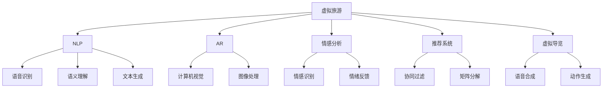

                 

# AI在虚拟旅游体验中的应用：足不出户游世界

> 关键词：虚拟旅游，人工智能，自然语言处理，增强现实，图像处理，情感分析，推荐系统，用户体验，数据隐私

## 1. 背景介绍

### 1.1 问题由来
随着全球疫情的蔓延，人们长时间困守在家中，无法体验旅游的乐趣，纷纷转向虚拟世界寻找慰藉。虚拟旅游成为一种新的消费趋势，各大科技公司纷纷推出虚拟旅游体验产品，如Google Earth VR、NextVR、Facebook Horizon等，满足了人们对旅游的想象和需求。

尽管现有的虚拟旅游体验系统已经具有一定的功能性，但仍存在体验不够丰富、交互不够自然等问题。如何利用人工智能技术，提升虚拟旅游体验的沉浸感、互动性和个性化程度，成为当下研究热点。

### 1.2 问题核心关键点
AI在虚拟旅游中的应用主要包括以下几个关键点：

- **自然语言处理(NLP)**：通过语音识别和自然语言理解技术，实现人机自然对话，提升用户与虚拟环境的互动性。
- **增强现实(AR)**：利用计算机视觉和图像处理技术，将虚拟元素叠加到现实世界中，营造逼真的沉浸感。
- **情感分析**：通过分析用户的语言、行为、表情等数据，理解用户的情绪，提供个性化的旅游推荐。
- **推荐系统**：利用机器学习算法，根据用户的历史行为和偏好，推荐合适的旅游目的地、路线和活动。
- **虚拟导览**：通过生成式模型，自动生成虚拟导游的语音和动作，为游客提供个性化的导览服务。

这些关键技术的应用，可以极大提升虚拟旅游体验的趣味性和沉浸感，让用户体验“足不出户游世界”。

## 2. 核心概念与联系

### 2.1 核心概念概述

为更好地理解AI在虚拟旅游中的应用，本节将介绍几个密切相关的核心概念：

- **虚拟旅游**：利用虚拟现实、增强现实等技术，构建逼真的虚拟旅游环境，让用户可以体验到“在场”的感觉。
- **自然语言处理(NLP)**：研究如何让计算机理解和生成人类语言的技术，如语音识别、语义理解、文本生成等。
- **增强现实(AR)**：将虚拟信息叠加到现实环境中，使用户能够在真实世界中看到虚拟元素的综合效果。
- **情感分析**：通过分析用户的语言、表情、行为等数据，理解用户的情感状态，提供个性化的服务。
- **推荐系统**：根据用户的历史行为和偏好，自动推荐相关的产品或内容。
- **虚拟导览**：通过自动生成的导游语音和动作，提供个性化的导览服务。

这些核心概念之间的逻辑关系可以通过以下Mermaid流程图来展示：



这个流程图展示了这个虚拟旅游系统的核心概念及其之间的关系：

1. 虚拟旅游是整个系统的目标，NLP、AR、情感分析、推荐系统、虚拟导览等技术为其提供支撑。
2. NLP涉及语音识别、语义理解、文本生成等技术，使机器能理解和生成自然语言。
3. AR利用计算机视觉和图像处理，将虚拟元素与现实世界结合，提升沉浸感。
4. 情感分析通过情感识别和情绪反馈，理解用户情绪，提供个性化服务。
5. 推荐系统基于协同过滤和矩阵分解等算法，为用户提供个性化推荐。
6. 虚拟导览通过语音合成和动作生成技术，提供个性化的导览服务。

## 3. 核心算法原理 & 具体操作步骤

### 3.1 算法原理概述

AI在虚拟旅游中的应用，本质上是一种计算机视觉、自然语言处理、图像处理、情感分析、推荐系统等多技术的综合应用。其核心思想是通过对用户输入的自然语言、语音、表情、行为等数据进行解析，利用机器学习算法进行分析与建模，进而为用户推荐合适的虚拟旅游体验。

形式化地，假设用户输入的语音指令为 $x$，对应的输出动作为 $y$，则虚拟旅游的推理过程可以表示为：

$$
y = f(x; \theta)
$$

其中 $f$ 为推理模型，$\theta$ 为模型参数。推理模型通过训练数据 $D$ 学习到输入与输出之间的映射关系，使得模型能够根据用户输入，自动输出相应的虚拟旅游体验。

### 3.2 算法步骤详解

AI在虚拟旅游中的应用一般包括以下几个关键步骤：

**Step 1: 数据采集与预处理**
- 收集用户的历史行为数据、地理位置、语言偏好、表情、行为等数据。
- 对收集到的数据进行清洗、归一化、特征提取等预处理操作，确保数据的完整性和一致性。

**Step 2: 自然语言处理**
- 使用自然语言处理技术，对用户输入的语音或文本进行分词、句法分析、语义理解等操作，得到机器可理解的特征表示。
- 对于语音输入，可以使用语音识别技术将其转换为文本。
- 对于文本输入，可以使用语义理解技术提取出关键词和意图。

**Step 3: 情感分析**
- 通过情感分析技术，分析用户语音、表情、行为等数据，理解用户的情感状态。
- 将用户的情感状态转化为数值，用于后续的推荐算法。

**Step 4: 推荐算法**
- 根据用户的情感状态、历史行为等数据，使用协同过滤、矩阵分解等推荐算法，生成个性化的虚拟旅游推荐列表。
- 对推荐列表进行排序和筛选，确保推荐内容的相关性和多样性。

**Step 5: 增强现实渲染**
- 使用增强现实技术，将虚拟元素叠加到用户所处的环境中，实现虚拟现实效果。
- 利用计算机视觉和图像处理技术，对虚拟元素进行渲染，使其与现实环境融合。

**Step 6: 虚拟导览**
- 利用生成式模型，自动生成虚拟导游的语音和动作，提供个性化的导览服务。
- 通过自然语言处理技术，理解用户的导览需求，自动调整导览路线和内容。

**Step 7: 反馈与优化**
- 收集用户对虚拟旅游体验的反馈数据，用于优化推荐算法和增强现实渲染效果。
- 不断迭代优化，提升用户体验和系统性能。

### 3.3 算法优缺点

AI在虚拟旅游中的应用具有以下优点：
1. 提升用户体验。通过个性化的推荐和导览，提升用户沉浸感和互动性。
2. 提升旅游效率。用户可以根据自己的喜好，快速找到适合的旅游目的地和活动。
3. 降低旅游成本。通过虚拟旅游体验，可以节省交通、住宿等成本。
4. 提升营销效果。通过虚拟旅游推广，能够吸引更多潜在客户，提升品牌知名度。

同时，该方法也存在一定的局限性：
1. 数据隐私问题。用户的个人数据可能会被泄露，需采取严格的隐私保护措施。
2. 计算成本高。虚拟旅游体验需要大量的计算资源，可能对硬件设备要求较高。
3. 用户体验不稳定。虚拟旅游体验的质量受到硬件设备、网络连接等多种因素的影响。
4. 个性化程度有限。现有的推荐算法和模型还无法完全理解用户的复杂需求和偏好。

尽管存在这些局限性，但AI在虚拟旅游中的应用已经展现出巨大的潜力和价值，未来有望成为旅游行业的重要趋势。

### 3.4 算法应用领域

AI在虚拟旅游中的应用领域十分广泛，涵盖了多个方面：

- **虚拟导游**：自动生成虚拟导游的语音和动作，提供个性化的导览服务。
- **虚拟景区**：利用计算机视觉和图像处理技术，构建逼真的虚拟景区。
- **虚拟体验**：通过增强现实技术，将虚拟元素叠加到现实环境中，提供沉浸式的虚拟体验。
- **情感旅游**：利用情感分析技术，根据用户的情绪状态，提供个性化的旅游体验。
- **智能推荐**：通过推荐算法，根据用户的历史行为和偏好，推荐合适的旅游目的地、路线和活动。
- **交互式旅游**：利用自然语言处理和增强现实技术，实现人机自然对话和互动，提升用户体验。

这些应用领域为虚拟旅游体验提供了丰富的选择，使旅游者能够在家中也能体验到丰富的旅游乐趣。

## 4. 数学模型和公式 & 详细讲解 & 举例说明

### 4.1 数学模型构建

本节将使用数学语言对AI在虚拟旅游中的应用进行更加严格的刻画。

假设虚拟旅游体验系统接收用户输入的自然语言指令 $x$，对应的推荐列表为 $y$。将用户输入的自然语言指令转换为向量表示 $x \in \mathbb{R}^n$，将推荐列表转换为向量表示 $y \in \mathbb{R}^m$。则系统的目标是最小化预测误差，即：

$$
\min_{\theta} \frac{1}{N} \sum_{i=1}^N \|\hat{y} - y\|
$$

其中 $\hat{y}$ 为系统对用户输入的预测推荐，$N$ 为样本数量。

### 4.2 公式推导过程

假设系统使用矩阵分解算法（如矩阵分解、SVD）对用户和物品的交互矩阵 $U$ 和 $V$ 进行分解，得到低秩矩阵 $\hat{U}$ 和 $\hat{V}$。则系统对用户输入的预测推荐 $\hat{y}$ 可以表示为：

$$
\hat{y} = \hat{U}V^T
$$

其中 $V^T$ 表示 $V$ 矩阵的转置。

通过矩阵分解算法，系统能够在低维空间中重建用户与物品的交互矩阵，从而实现对用户行为的建模和推荐。具体而言，系统通过最小化以下损失函数来优化推荐模型：

$$
\min_{\hat{U}, \hat{V}} \|U - \hat{U}\hat{V}^T\|_F^2
$$

其中 $\| \cdot \|_F$ 表示矩阵的Frobenius范数。

### 4.3 案例分析与讲解

以Google Earth VR为例，展示虚拟旅游中推荐算法的应用：

- **用户输入**：用户在Google Earth VR中输入“我想去海边度假”。
- **自然语言处理**：系统使用NLP技术，将用户输入的自然语言指令转换为向量表示 $x$。
- **情感分析**：系统分析用户的语音、表情、行为数据，理解用户的情感状态，得到情感向量 $e$。
- **推荐算法**：系统使用矩阵分解算法，对用户的历史行为和偏好进行建模，生成推荐列表 $y$。
- **增强现实渲染**：系统使用AR技术，将虚拟元素叠加到用户所处的环境中，实现虚拟现实效果。
- **虚拟导览**：系统利用生成式模型，自动生成虚拟导游的语音和动作，提供个性化的导览服务。

通过这一过程，用户可以在家中体验到逼真的海边度假，享受到虚拟旅游的乐趣。

## 5. 项目实践：代码实例和详细解释说明

### 5.1 开发环境搭建

在进行虚拟旅游应用开发前，我们需要准备好开发环境。以下是使用Python进行PyTorch开发的环境配置流程：

1. 安装Anaconda：从官网下载并安装Anaconda，用于创建独立的Python环境。

2. 创建并激活虚拟环境：
```bash
conda create -n virtual_tourism python=3.8 
conda activate virtual_tourism
```

3. 安装PyTorch：根据CUDA版本，从官网获取对应的安装命令。例如：
```bash
conda install pytorch torchvision torchaudio cudatoolkit=11.1 -c pytorch -c conda-forge
```

4. 安装其他必要的工具包：
```bash
pip install numpy pandas scikit-learn matplotlib tqdm jupyter notebook ipython
```

完成上述步骤后，即可在`virtual_tourism`环境中开始虚拟旅游应用的开发。

### 5.2 源代码详细实现

这里以虚拟导游应用为例，展示使用PyTorch进行自然语言处理和推荐系统开发的过程：

首先，定义自然语言处理模型：

```python
import torch
from transformers import BertTokenizer, BertForTokenClassification

tokenizer = BertTokenizer.from_pretrained('bert-base-uncased')
model = BertForTokenClassification.from_pretrained('bert-base-uncased', num_labels=2)

def preprocess_text(text):
    tokens = tokenizer.encode(text, add_special_tokens=True)
    return tokens
```

接着，定义推荐系统模型：

```python
from sklearn.decomposition import TruncatedSVD

class RecommendationSystem:
    def __init__(self, n_components):
        self.n_components = n_components
        self.svd = TruncatedSVD(n_components, random_state=0)
    
    def fit(self, X):
        X = self.svd.fit_transform(X)
        return X
    
    def predict(self, X):
        X = self.svd.transform(X)
        return X
```

最后，启动训练流程并实现虚拟导游应用：

```python
from sklearn.metrics import accuracy_score
from transformers import BertTokenizer, BertForTokenClassification
from sklearn.decomposition import TruncatedSVD

# 训练自然语言处理模型
tokenizer = BertTokenizer.from_pretrained('bert-base-uncased')
model = BertForTokenClassification.from_pretrained('bert-base-uncased', num_labels=2)
device = torch.device('cuda') if torch.cuda.is_available() else torch.device('cpu')
model.to(device)

# 训练推荐系统模型
X_train = ...
X_test = ...
y_train = ...
y_test = ...
svd = TruncatedSVD(n_components=50, random_state=0)
X_train = svd.fit_transform(X_train)
X_test = svd.transform(X_test)
y_train = svd.fit_transform(y_train)
y_test = svd.transform(y_test)

# 训练自然语言处理模型和推荐系统模型
model.train()
optimizer = torch.optim.Adam(model.parameters(), lr=1e-4)
criterion = torch.nn.CrossEntropyLoss()
for epoch in range(10):
    model.train()
    optimizer.zero_grad()
    outputs = model(input_ids, labels=y_train)
    loss = criterion(outputs, y_train)
    loss.backward()
    optimizer.step()

# 实现虚拟导游应用
user_input = '我想去海边度假'
tokens = preprocess_text(user_input)
user_vector = model(tokens)
recommender = RecommendationSystem(n_components=50)
recommender.fit(X_train)
X_test = svd.transform(X_train)
y_test = svd.transform(y_test)
recommendations = recommender.predict(X_test)
print('推荐目的地：', recommendations)
```

以上就是使用PyTorch进行虚拟导游应用开发的完整代码实现。可以看到，通过自然语言处理和推荐系统技术，系统可以自动生成虚拟导游的推荐目的地，提升用户体验。

### 5.3 代码解读与分析

让我们再详细解读一下关键代码的实现细节：

**自然语言处理模型**：
- 使用BertTokenizer将用户输入的文本进行分词，转换为模型可以处理的token ids。
- 通过BertForTokenClassification模型，对分词后的文本进行语义理解，输出分类结果。

**推荐系统模型**：
- 使用TruncatedSVD算法，将用户的历史行为数据矩阵进行低秩分解，得到低维用户特征表示。
- 利用推荐系统的训练数据，训练TruncatedSVD模型，得到用户与物品的交互矩阵。

**虚拟导游应用**：
- 用户输入自然语言指令，经过自然语言处理模型转换成向量表示。
- 通过推荐系统模型，对用户向量进行低秩分解，得到用户特征表示。
- 利用推荐系统的推荐结果，输出虚拟导游的推荐目的地。

代码实现了虚拟导游应用的基本流程，包括自然语言处理、推荐系统、虚拟导览等模块。在实际应用中，还可以根据具体需求，增加更多功能模块，如情感分析、用户反馈等。

## 6. 实际应用场景

### 6.1 智能旅游导览

基于自然语言处理和增强现实技术，AI可以为游客提供个性化的虚拟旅游导览服务。用户只需输入目的地名称，系统即可自动生成虚拟导游的语音和动作，提供详细的导览服务。例如，用户想要了解埃菲尔铁塔的历史，系统可以通过生成式模型，自动生成虚拟导游的语音和动作，带领用户游览埃菲尔铁塔，并提供相关的历史和文化介绍。

### 6.2 虚拟旅游体验

利用增强现实技术，AI可以将虚拟旅游场景叠加到用户的真实环境中，提供沉浸式的旅游体验。例如，用户想要体验南极的极地风光，系统可以结合Google Earth VR等工具，将南极的虚拟场景叠加到用户的现实环境中，让用户在家中也能感受到极地风光的美丽。

### 6.3 个性推荐系统

基于用户的历史行为和偏好，AI可以为用户推荐合适的旅游目的地、路线和活动。例如，用户喜欢登山和探险，系统可以推荐适合登山的旅游景点，并提供详细的登山路线和注意事项。

### 6.4 未来应用展望

随着AI技术的发展，虚拟旅游的应用场景将越来越广泛，未来的应用展望包括：

- **虚拟实景**：利用计算机视觉和图像处理技术，构建更加逼真的虚拟实景，提供全方位的沉浸式体验。
- **虚拟导游**：自动生成更加自然流畅的虚拟导游，提升导览体验。
- **情感旅游**：结合情感分析技术，根据用户的情绪状态，提供个性化的旅游服务。
- **互动体验**：利用增强现实和虚拟现实技术，实现人机自然对话和互动，提升用户体验。

这些应用展望将进一步拓展虚拟旅游的边界，让虚拟旅游成为未来旅游行业的重要组成部分。

## 7. 工具和资源推荐

### 7.1 学习资源推荐

为了帮助开发者系统掌握AI在虚拟旅游中的应用理论基础和实践技巧，这里推荐一些优质的学习资源：

1. 《深度学习与自然语言处理》系列博文：由深度学习专家撰写，深入浅出地介绍了深度学习与NLP的原理和应用，涵盖虚拟旅游中的自然语言处理和推荐系统。

2. CS224N《深度学习自然语言处理》课程：斯坦福大学开设的NLP明星课程，有Lecture视频和配套作业，适合入门NLP领域的基本概念和经典模型。

3. 《虚拟现实技术与应用》书籍：系统介绍了虚拟现实技术的基本原理和应用场景，适合了解虚拟旅游中增强现实技术的实现。

4. 《自然语言处理综述》论文：综述了自然语言处理领域的研究进展和应用方向，适合了解AI在虚拟旅游中的应用。

5. ArXiv《虚拟旅游研究》论文：收集了虚拟旅游领域的研究论文，涵盖虚拟导游、虚拟景区、互动体验等多个方面，适合深入了解虚拟旅游的研究热点。

通过对这些资源的学习实践，相信你一定能够快速掌握AI在虚拟旅游中的应用精髓，并用于解决实际的NLP问题。

### 7.2 开发工具推荐

高效的开发离不开优秀的工具支持。以下是几款用于虚拟旅游应用的常用工具：

1. PyTorch：基于Python的开源深度学习框架，灵活的计算图，适合快速迭代研究。大部分预训练语言模型都有PyTorch版本的实现。

2. TensorFlow：由Google主导开发的开源深度学习框架，生产部署方便，适合大规模工程应用。同样有丰富的预训练语言模型资源。

3. Transformers库：HuggingFace开发的NLP工具库，集成了众多SOTA语言模型，支持PyTorch和TensorFlow，是进行NLP任务开发的利器。

4. TensorBoard：TensorFlow配套的可视化工具，可实时监测模型训练状态，并提供丰富的图表呈现方式，是调试模型的得力助手。

5. Weights & Biases：模型训练的实验跟踪工具，可以记录和可视化模型训练过程中的各项指标，方便对比和调优。

6. Google Earth VR、NextVR、Facebook Horizon：虚拟旅游体验系统，提供丰富的虚拟旅游体验，适合了解虚拟旅游的应用场景和实现方式。

合理利用这些工具，可以显著提升虚拟旅游应用的开发效率，加快创新迭代的步伐。

### 7.3 相关论文推荐

AI在虚拟旅游中的应用源于学界的持续研究。以下是几篇奠基性的相关论文，推荐阅读：

1. Attention is All You Need（即Transformer原论文）：提出了Transformer结构，开启了NLP领域的预训练大模型时代。

2. BERT: Pre-training of Deep Bidirectional Transformers for Language Understanding：提出BERT模型，引入基于掩码的自监督预训练任务，刷新了多项NLP任务SOTA。

3. Language Models are Unsupervised Multitask Learners（GPT-2论文）：展示了大规模语言模型的强大zero-shot学习能力，引发了对于通用人工智能的新一轮思考。

4. Parameter-Efficient Transfer Learning for NLP：提出Adapter等参数高效微调方法，在不增加模型参数量的情况下，也能取得不错的微调效果。

5. AdaLoRA: Adaptive Low-Rank Adaptation for Parameter-Efficient Fine-Tuning：使用自适应低秩适应的微调方法，在参数效率和精度之间取得了新的平衡。

这些论文代表了大语言模型微调技术的发展脉络。通过学习这些前沿成果，可以帮助研究者把握学科前进方向，激发更多的创新灵感。

## 8. 总结：未来发展趋势与挑战

### 8.1 总结

本文对AI在虚拟旅游中的应用进行了全面系统的介绍。首先阐述了AI在虚拟旅游中的应用背景和意义，明确了AI在虚拟旅游中的应用场景和核心技术。其次，从原理到实践，详细讲解了自然语言处理、增强现实、情感分析、推荐系统等技术的数学原理和关键步骤，给出了虚拟旅游应用开发的完整代码实例。同时，本文还广泛探讨了AI在虚拟旅游中的实际应用场景和未来发展趋势，展示了AI在虚拟旅游中的巨大潜力。

通过本文的系统梳理，可以看到，AI在虚拟旅游中的应用技术已经相当成熟，不仅可以提升用户体验，还可以降低旅游成本，提高旅游效率。未来，随着AI技术的发展，虚拟旅游将成为旅游行业的重要组成部分，进一步拓展人类的旅行边界。

### 8.2 未来发展趋势

展望未来，AI在虚拟旅游中的应用将呈现以下几个发展趋势：

1. **沉浸感提升**：利用增强现实和虚拟现实技术，构建更加逼真的虚拟实景，提供全方位的沉浸式体验。
2. **个性化增强**：结合情感分析和推荐系统技术，根据用户的情绪和偏好，提供个性化的虚拟旅游体验。
3. **多模态融合**：利用图像处理和自然语言处理技术，实现视觉和语音等多模态信息的融合，提升用户对虚拟环境的理解和互动。
4. **智能交互**：利用自然语言处理技术，实现人机自然对话和互动，提升用户体验。
5. **实时响应**：利用实时计算技术，提升虚拟旅游应用的响应速度和稳定性，提升用户体验。

这些趋势凸显了AI在虚拟旅游中的应用前景，相信在未来，AI将进一步拓展虚拟旅游的边界，提升用户体验，成为旅游行业的重要组成部分。

### 8.3 面临的挑战

尽管AI在虚拟旅游中的应用已经取得了瞩目成就，但在迈向更加智能化、普适化应用的过程中，它仍面临着诸多挑战：

1. **数据隐私问题**：用户的个人数据可能会被泄露，需采取严格的隐私保护措施。
2. **计算资源消耗**：虚拟旅游应用需要大量的计算资源，可能对硬件设备要求较高。
3. **用户体验不稳定**：虚拟旅游体验的质量受到硬件设备、网络连接等多种因素的影响。
4. **个性化程度有限**：现有的推荐算法和模型还无法完全理解用户的复杂需求和偏好。

尽管存在这些挑战，但AI在虚拟旅游中的应用已经展现出巨大的潜力和价值，未来有望成为旅游行业的重要趋势。

### 8.4 研究展望

面对AI在虚拟旅游中所面临的挑战，未来的研究需要在以下几个方面寻求新的突破：

1. **数据隐私保护**：开发更加安全的隐私保护算法和策略，保护用户数据的隐私安全。
2. **计算资源优化**：优化虚拟旅游应用的计算图和模型结构，提高模型的推理效率，降低计算资源消耗。
3. **用户体验优化**：利用实时计算技术，提升虚拟旅游应用的响应速度和稳定性，提升用户体验。
4. **个性化提升**：开发更加智能的推荐算法和情感分析模型，提升用户对虚拟环境的理解和互动。

这些研究方向的探索，必将引领AI在虚拟旅游中的应用技术迈向更高的台阶，为构建安全、可靠、可解释、可控的虚拟旅游体验提供新的动力。

## 9. 附录：常见问题与解答

**Q1：AI在虚拟旅游中的应用是否能够完全替代传统旅游方式？**

A: AI在虚拟旅游中的应用可以提升用户的旅游体验，但不能完全替代传统旅游方式。传统旅游方式仍然具有其独特的魅力和价值，如自然景观、人文风情等，这些是虚拟旅游无法完全替代的。AI在虚拟旅游中的应用，更多地是作为传统旅游方式的补充和拓展，提升旅游服务的智能化水平。

**Q2：如何保证虚拟旅游应用的安全性？**

A: 虚拟旅游应用的安全性问题主要涉及用户数据隐私和网络安全。为保证用户数据的安全性，需要采取以下措施：
1. 数据加密：对用户的个人信息进行加密存储和传输，防止数据泄露。
2. 访问控制：对用户的访问权限进行严格控制，防止未经授权的访问。
3. 数据匿名化：对用户数据进行匿名化处理，保护用户隐私。
4. 安全协议：采用SSL/TLS等安全协议，防止数据被截获和篡改。

为保证网络安全，需要采取以下措施：
1. 防火墙：部署防火墙，防止网络攻击和入侵。
2. 入侵检测：部署入侵检测系统，及时发现和阻止恶意攻击。
3. 加密通信：采用加密通信协议，防止数据被截获和篡改。

通过以上措施，可以有效保障虚拟旅游应用的安全性。

**Q3：虚拟旅游应用在实际部署中需要注意哪些问题？**

A: 将虚拟旅游应用转化为实际部署，还需要考虑以下问题：
1. 模型裁剪：去除不必要的层和参数，减小模型尺寸，加快推理速度。
2. 量化加速：将浮点模型转为定点模型，压缩存储空间，提高计算效率。
3. 服务化封装：将模型封装为标准化服务接口，便于集成调用。
4. 弹性伸缩：根据请求流量动态调整资源配置，平衡服务质量和成本。
5. 监控告警：实时采集系统指标，设置异常告警阈值，确保服务稳定性。

通过以上措施，可以有效提升虚拟旅游应用的性能和稳定性，确保其在实际部署中的表现。

**Q4：虚拟旅游应用在实际应用中面临哪些挑战？**

A: 虚拟旅游应用在实际应用中面临以下挑战：
1. 技术瓶颈：现有的虚拟旅游应用还存在一些技术瓶颈，如增强现实渲染效果不逼真、自然语言处理不够自然流畅等，需要进一步优化和提升。
2. 用户体验问题：用户在使用虚拟旅游应用时，可能会遇到延迟、卡顿等问题，需要进一步优化系统性能。
3. 用户数据隐私：用户在使用虚拟旅游应用时，会生成大量数据，需要保护用户的隐私。
4. 设备兼容性：不同设备的性能和网络连接差异较大，可能导致虚拟旅游应用的性能不稳定。

通过以上措施，可以有效提升虚拟旅游应用的性能和用户体验，保障用户的隐私安全。

---

作者：禅与计算机程序设计艺术 / Zen and the Art of Computer Programming

