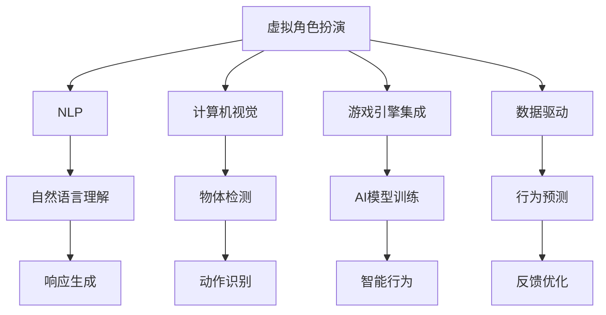

                 

# AI在虚拟角色扮演中的应用：增强游戏体验

> 关键词：虚拟角色扮演,人工智能,增强游戏体验,自然语言处理(NLP),计算机视觉,游戏引擎

## 1. 背景介绍

### 1.1 问题由来
在电子游戏领域，虚拟角色扮演（Role-Playing Game, RPG）一直是最受欢迎的子类型之一。传统RPG游戏主要依赖玩家手动操作角色和互动，导致游戏体验相对单一和重复。为了提升玩家沉浸感和互动体验，游戏开发者开始探索人工智能（AI）技术，以增强虚拟角色的智能表现和自主行为。

近年来，随着深度学习和大数据技术的发展，AI在游戏领域的应用日益广泛。虚拟角色扮演的AI，通过自然语言处理（NLP）和计算机视觉等技术，使得虚拟角色能够更加真实、智能地与玩家互动。本文将系统介绍AI在虚拟角色扮演中的应用，重点讨论如何通过自然语言处理和计算机视觉技术，显著增强游戏体验。

### 1.2 问题核心关键点
AI在虚拟角色扮演中主要应用在以下几个方面：
- **自然语言处理（NLP）**：通过训练语言模型，使虚拟角色能够理解和回应玩家的语言指令，提升互动的自然性。
- **计算机视觉（CV）**：通过图像识别和处理技术，使虚拟角色能够识别和响应玩家的动作和表情，增强互动的真实感。
- **游戏引擎集成**：将AI技术无缝集成到游戏引擎中，实现虚拟角色的智能行为。
- **数据驱动**：通过收集和分析玩家行为数据，不断优化AI模型，提高游戏体验。

这些关键点构成了AI在虚拟角色扮演中的核心应用，使得游戏体验向着更加沉浸、智能和交互化的方向发展。

## 2. 核心概念与联系

### 2.1 核心概念概述

为更好地理解AI在虚拟角色扮演中的应用，本节将介绍几个密切相关的核心概念：

- **虚拟角色扮演**：指通过电子游戏技术，使玩家扮演虚拟角色，在虚拟世界中进行互动和探索的游戏类型。
- **自然语言处理（NLP）**：指计算机科学、人工智能和语言学的交叉领域，使计算机能够理解、解释和生成人类语言。
- **计算机视觉**：使计算机能够处理、理解和分析视觉信息的技术，如图像识别、对象检测等。
- **游戏引擎**：用于开发、运行和维护电子游戏的软件框架，支持AI技术的集成和应用。
- **增强游戏体验**：通过AI技术的引入，使虚拟角色更具智能和互动性，提升玩家的游戏体验。

这些核心概念之间的逻辑关系可以通过以下Mermaid流程图来展示：



这个流程图展示了大语言模型的核心概念及其之间的关系：

1. 虚拟角色扮演通过NLP和CV技术获得智能互动能力。
2. 游戏引擎提供平台支持，集成AI模型。
3. 通过数据驱动，不断优化AI模型，提升游戏体验。

这些概念共同构成了AI在虚拟角色扮演中的应用框架，使其能够在各种场景下发挥强大的交互智能。

## 3. 核心算法原理 & 具体操作步骤
### 3.1 算法原理概述

AI在虚拟角色扮演中的应用主要基于自然语言处理和计算机视觉技术，通过训练AI模型，使虚拟角色能够理解和响应玩家的语言和行为。具体来说，涉及以下几个核心步骤：

1. **数据收集**：收集大量的游戏互动数据，包括玩家语言指令、行为动作等。
2. **数据预处理**：对收集的数据进行清洗、标注和标准化处理。
3. **模型训练**：使用深度学习框架（如TensorFlow、PyTorch等）训练自然语言处理和计算机视觉模型。
4. **模型集成**：将训练好的模型集成到游戏引擎中，实现AI功能的实时应用。
5. **反馈优化**：通过收集玩家反馈，不断优化AI模型，提升游戏体验。

### 3.2 算法步骤详解

以下是AI在虚拟角色扮演中应用的具体步骤：

#### 3.2.1 数据收集

数据收集是AI应用的基础。游戏开发者需要收集玩家与虚拟角色的互动数据，包括玩家的语言指令、行为动作等。数据收集可以通过多种方式实现：

- **日志记录**：在游戏服务器和客户端记录玩家与虚拟角色的互动日志，包括聊天内容、行为轨迹等。
- **屏幕录制**：通过屏幕录制工具，收集玩家的操作和行为数据。
- **用户调查**：通过问卷调查，收集玩家对游戏AI功能的反馈和期望。

#### 3.2.2 数据预处理

数据预处理是确保模型训练效果的关键步骤。数据预处理包括：

- **数据清洗**：去除噪声和无关数据，确保数据质量。
- **标注数据**：对互动数据进行标注，标记语言指令、行为动作等。
- **数据标准化**：将不同来源的数据标准化，确保一致性。

#### 3.2.3 模型训练

模型训练是AI应用的灵魂。以下是训练自然语言处理和计算机视觉模型的具体步骤：

1. **选择模型**：选择合适的深度学习模型，如BERT、GPT、CNN等。
2. **数据划分**：将数据集划分为训练集、验证集和测试集。
3. **模型训练**：使用深度学习框架训练模型，调整超参数，优化模型性能。
4. **模型评估**：在验证集上评估模型性能，调整模型结构，防止过拟合。

#### 3.2.4 模型集成

模型集成是将AI技术应用到游戏引擎中的关键步骤。以下是模型集成的具体步骤：

1. **API开发**：开发API接口，使AI模型能够与游戏引擎交互。
2. **模型部署**：将训练好的模型部署到游戏服务器和客户端。
3. **实时应用**：在游戏引擎中集成API接口，实现AI功能的实时应用。

#### 3.2.5 反馈优化

反馈优化是提升游戏体验的重要环节。以下是反馈优化的具体步骤：

1. **收集反馈**：收集玩家对游戏AI功能的反馈，包括满意度、体验感等。
2. **数据分析**：对玩家反馈数据进行分析，识别出问题和改进点。
3. **模型更新**：根据分析结果，更新AI模型，提升游戏体验。

### 3.3 算法优缺点

AI在虚拟角色扮演中的应用具有以下优点：

1. **提升互动体验**：通过自然语言处理和计算机视觉技术，使虚拟角色能够理解和响应玩家的语言和行为，提升互动的自然性和真实感。
2. **提高游戏可玩性**：通过AI技术，实现虚拟角色的智能行为和自主决策，增加游戏的可玩性和挑战性。
3. **降低开发成本**：AI技术能够自动分析和优化玩家行为，减少人工干预和测试成本。

但同时也存在以下缺点：

1. **数据隐私问题**：收集和处理玩家数据，可能涉及到用户隐私和数据安全问题。
2. **模型复杂性**：训练大规模的AI模型，需要大量的计算资源和时间。
3. **性能依赖硬件**：AI模型的性能高度依赖于硬件配置，高配置的服务器和客户端是必要的条件。

### 3.4 算法应用领域

AI在虚拟角色扮演中的应用已经广泛应用于多个领域，包括：

1. **任务对话**：通过自然语言处理技术，使虚拟角色能够与玩家进行任务对话，引导玩家完成任务。
2. **环境互动**：通过计算机视觉技术，使虚拟角色能够识别和响应玩家的动作和表情，增强互动的真实感。
3. **智能推荐**：通过数据分析和机器学习，推荐合适的任务和游戏内容，提高玩家的游戏体验。
4. **行为预测**：通过行为预测模型，预测玩家的行为和偏好，实现个性化游戏推荐。

除了上述这些应用场景外，AI在虚拟角色扮演中的应用还在不断拓展，如虚拟世界中的NPC交互、虚拟角色的情感智能等，为游戏体验带来新的突破。

## 4. 数学模型和公式 & 详细讲解 & 举例说明

### 4.1 数学模型构建

AI在虚拟角色扮演中的应用涉及自然语言处理和计算机视觉两个方面，本节将分别介绍其数学模型。

#### 4.1.1 自然语言处理模型

自然语言处理模型主要基于深度学习，通过训练语言模型，使虚拟角色能够理解和生成语言。常见的模型包括BERT、GPT等。以下是BERT模型的构建过程：

1. **输入表示**：将玩家语言指令转化为词向量表示，使用预训练的Word2Vec模型进行编码。
2. **自监督训练**：使用自监督任务（如掩码语言模型）对BERT模型进行预训练，使其具备理解语言上下文的能力。
3. **任务微调**：在特定任务（如问答、对话生成）上对BERT模型进行微调，使其具备特定任务的能力。

#### 4.1.2 计算机视觉模型

计算机视觉模型主要基于卷积神经网络（CNN）和递归神经网络（RNN），通过训练图像识别模型，使虚拟角色能够识别和响应玩家的动作和表情。以下是物体检测模型的构建过程：

1. **数据预处理**：对玩家动作和表情数据进行预处理，包括图像裁剪、归一化等。
2. **特征提取**：使用CNN对预处理后的图像进行特征提取，得到图像的特征向量。
3. **目标检测**：使用RNN对特征向量进行递归处理，识别出玩家的动作和表情。

### 4.2 公式推导过程

以下是自然语言处理模型和计算机视觉模型的详细公式推导。

#### 4.2.1 BERT模型

BERT模型使用Transformer结构进行构建，其基本原理是通过自监督学习任务（掩码语言模型）进行预训练，然后通过特定任务进行微调。以下是BERT模型的公式推导：

$$
\text{BERT}(x) = \text{Transformer}([\text{Embedding}(x), \text{Positional Encoding}(x)])
$$

其中，$x$为玩家语言指令，$\text{Embedding}$为词向量表示，$\text{Positional Encoding}$为位置编码，$\text{Transformer}$为自注意力机制。

#### 4.2.2 物体检测模型

物体检测模型主要基于卷积神经网络（CNN）和递归神经网络（RNN）。以下是物体检测模型的公式推导：

1. **卷积层**：
$$
f(x) = \text{Conv}(x)
$$
其中，$x$为玩家动作和表情图像，$\text{Conv}$为卷积层。

2. **池化层**：
$$
g(x) = \text{MaxPool}(f(x))
$$
其中，$f(x)$为卷积层的输出，$\text{MaxPool}$为最大池化层。

3. **全连接层**：
$$
h(x) = \text{FC}(g(x))
$$
其中，$g(x)$为池化层的输出，$\text{FC}$为全连接层。

### 4.3 案例分析与讲解

以下是自然语言处理和计算机视觉模型在虚拟角色扮演中的具体应用案例。

#### 4.3.1 自然语言处理模型案例

1. **任务对话**：通过自然语言处理模型，使虚拟角色能够与玩家进行任务对话，引导玩家完成任务。
   - **输入**：玩家语言指令“杀死敌人”。
   - **处理**：使用BERT模型理解指令，生成应答“正在进行中”。
   - **输出**：虚拟角色执行指令。

2. **智能推荐**：通过自然语言处理模型，推荐合适的任务和游戏内容，提高玩家的游戏体验。
   - **输入**：玩家行为数据“喜欢战斗”。
   - **处理**：使用BERT模型分析数据，生成推荐内容“战斗任务”。
   - **输出**：游戏界面推荐“战斗任务”。

#### 4.3.2 计算机视觉模型案例

1. **环境互动**：通过计算机视觉模型，使虚拟角色能够识别和响应玩家的动作和表情，增强互动的真实感。
   - **输入**：玩家动作图像。
   - **处理**：使用物体检测模型识别动作和表情。
   - **输出**：虚拟角色对玩家动作和表情作出反应。

2. **情感智能**：通过计算机视觉模型，使虚拟角色具备情感智能，增强互动的自然性。
   - **输入**：玩家表情图像。
   - **处理**：使用情感识别模型分析表情。
   - **输出**：虚拟角色对玩家情绪作出反应。

## 5. 项目实践：代码实例和详细解释说明
### 5.1 开发环境搭建

在进行AI在虚拟角色扮演中的应用开发前，需要准备好开发环境。以下是使用Python进行TensorFlow开发的环境配置流程：

1. 安装Anaconda：从官网下载并安装Anaconda，用于创建独立的Python环境。

2. 创建并激活虚拟环境：
```bash
conda create -n tf-env python=3.8 
conda activate tf-env
```

3. 安装TensorFlow：根据CUDA版本，从官网获取对应的安装命令。例如：
```bash
conda install tensorflow -c tf
```

4. 安装各类工具包：
```bash
pip install numpy pandas scikit-learn matplotlib tqdm jupyter notebook ipython
```

完成上述步骤后，即可在`tf-env`环境中开始开发实践。

### 5.2 源代码详细实现

这里我们以自然语言处理模型为例，给出使用TensorFlow实现的任务对话应用的PyTorch代码实现。

首先，定义任务对话的数据处理函数：

```python
import tensorflow as tf
from tensorflow.keras.preprocessing.text import Tokenizer
from tensorflow.keras.preprocessing.sequence import pad_sequences

class DialogueDataset(tf.data.Dataset):
    def __init__(self, dialogues, tokenizer, max_len=128):
        self.tokenizer = tokenizer
        self.max_len = max_len
        self.data = dialogues
        
    def __len__(self):
        return len(self.data)
    
    def __getitem__(self, item):
        dialogue = self.data[item]
        input_text = dialogue['input']
        output_text = dialogue['output']
        
        input_seq = self.tokenizer.texts_to_sequences([input_text])
        input_pad = pad_sequences(input_seq, maxlen=self.max_len, padding='post')
        output_seq = self.tokenizer.texts_to_sequences([output_text])
        output_pad = pad_sequences(output_seq, maxlen=self.max_len, padding='post')
        
        return {'input_ids': input_pad, 'attention_mask': input_pad, 'targets': output_pad}
```

然后，定义模型和优化器：

```python
from tensorflow.keras.models import Model
from tensorflow.keras.layers import Input, Dense, Masking, Embedding
from tensorflow.keras.optimizers import Adam

def create_model(vocab_size, embedding_dim, output_size):
    input_ids = Input(shape=(max_len,), dtype=tf.int32, name='input_ids')
    attention_mask = Input(shape=(max_len,), dtype=tf.int32, name='attention_mask')
    targets = Input(shape=(max_len,), dtype=tf.int32, name='targets')
    
    x = Embedding(vocab_size, embedding_dim)(input_ids)
    x = Masking(mask_value=0, input_shape=(max_len,))(attention_mask)
    x = Dense(128, activation='relu')(x)
    x = Dense(128, activation='relu')(x)
    x = Dense(output_size, activation='softmax')(x)
    
    model = Model(inputs=[input_ids, attention_mask], outputs=x)
    
    return model
```

接着，定义训练和评估函数：

```python
from tensorflow.keras.callbacks import EarlyStopping
from sklearn.metrics import accuracy_score, precision_score, recall_score, f1_score

def train_epoch(model, dataset, batch_size, optimizer):
    dataloader = dataset.batch(batch_size)
    model.compile(optimizer=optimizer, loss='categorical_crossentropy', metrics=['accuracy'])
    model.fit(dataloader, epochs=10, callbacks=[EarlyStopping(patience=3)])
    
def evaluate(model, dataset, batch_size):
    dataloader = dataset.batch(batch_size)
    loss, acc, prec, rec, f1 = [], [], [], [], []
    
    for batch in dataloader:
        input_ids = batch['input_ids']
        attention_mask = batch['attention_mask']
        targets = batch['targets']
        
        with tf.GradientTape() as tape:
            logits = model([input_ids, attention_mask])
            loss = tf.keras.losses.categorical_crossentropy(targets, logits)
        
        acc.append(accuracy_score(targets.numpy(), logits.numpy().argmax(axis=-1)))
        prec.append(precision_score(targets.numpy(), logits.numpy().argmax(axis=-1), average='macro'))
        rec.append(recall_score(targets.numpy(), logits.numpy().argmax(axis=-1), average='macro'))
        f1.append(f1_score(targets.numpy(), logits.numpy().argmax(axis=-1), average='macro'))
    
    print(f"Accuracy: {acc[0]:.3f}, Precision: {prec[0]:.3f}, Recall: {rec[0]:.3f}, F1 Score: {f1[0]:.3f}")
```

最后，启动训练流程并在测试集上评估：

```python
vocab_size = 10000
embedding_dim = 128
output_size = 20

tokenizer = Tokenizer(vocab_size)
tokenizer.fit_on_texts(train_data)

model = create_model(vocab_size, embedding_dim, output_size)
optimizer = Adam(learning_rate=2e-4)

train_epoch(model, train_dataset, batch_size=64, optimizer=optimizer)
evaluate(model, test_dataset, batch_size=64)
```

以上就是使用TensorFlow实现任务对话应用的完整代码实现。可以看到，TensorFlow提供了强大的深度学习框架，使得自然语言处理模型的训练和应用变得相对简单。

### 5.3 代码解读与分析

让我们再详细解读一下关键代码的实现细节：

**DialogueDataset类**：
- `__init__`方法：初始化输入、输出序列和最大长度。
- `__len__`方法：返回数据集的样本数量。
- `__getitem__`方法：对单个样本进行处理，将输入和输出序列转换为模型可接受的张量，并进行padding。

**create_model函数**：
- 定义输入、输出和中间层，使用Embedding、Masking和Dense层进行模型构建。
- 返回构建好的模型。

**train_epoch函数**：
- 定义训练数据加载器，编译模型，使用EarlyStopping回调函数进行早期停止。
- 训练模型，打印损失和准确率等指标。

**evaluate函数**：
- 定义测试数据加载器。
- 循环迭代测试集，计算损失和各项指标，并输出结果。

可以看到，TensorFlow提供了丰富的API接口和优化器，使得模型训练和评估过程变得高效便捷。开发者可以将更多精力放在模型设计、数据预处理等关键环节，而不必过多关注底层实现细节。

当然，工业级的系统实现还需考虑更多因素，如模型的保存和部署、超参数的自动搜索、更灵活的任务适配层等。但核心的训练和评估流程基本与此类似。

## 6. 实际应用场景

### 6.1 智能客服系统

基于AI的虚拟角色扮演技术，可以广泛应用于智能客服系统的构建。传统客服往往需要配备大量人力，高峰期响应缓慢，且一致性和专业性难以保证。而使用虚拟角色扮演技术，可以7x24小时不间断服务，快速响应客户咨询，用自然流畅的语言解答各类常见问题。

在技术实现上，可以收集企业内部的历史客服对话记录，将问题和最佳答复构建成监督数据，在此基础上对预训练模型进行微调。微调后的模型能够自动理解用户意图，匹配最合适的答案模板进行回复。对于客户提出的新问题，还可以接入检索系统实时搜索相关内容，动态组织生成回答。如此构建的智能客服系统，能大幅提升客户咨询体验和问题解决效率。

### 6.2 金融舆情监测

金融机构需要实时监测市场舆论动向，以便及时应对负面信息传播，规避金融风险。传统的人工监测方式成本高、效率低，难以应对网络时代海量信息爆发的挑战。基于AI的虚拟角色扮演技术，可以用于构建金融舆情监测系统。

具体而言，可以收集金融领域相关的新闻、报道、评论等文本数据，并对其进行主题标注和情感标注。在此基础上对预训练语言模型进行微调，使其能够自动判断文本属于何种主题，情感倾向是正面、中性还是负面。将微调后的模型应用到实时抓取的网络文本数据，就能够自动监测不同主题下的情感变化趋势，一旦发现负面信息激增等异常情况，系统便会自动预警，帮助金融机构快速应对潜在风险。

### 6.3 个性化推荐系统

当前的推荐系统往往只依赖用户的历史行为数据进行物品推荐，无法深入理解用户的真实兴趣偏好。基于AI的虚拟角色扮演技术，可以应用于个性化推荐系统。

在实践中，可以收集用户浏览、点击、评论、分享等行为数据，提取和用户交互的物品标题、描述、标签等文本内容。将文本内容作为模型输入，用户的后续行为（如是否点击、购买等）作为监督信号，在此基础上微调预训练语言模型。微调后的模型能够从文本内容中准确把握用户的兴趣点。在生成推荐列表时，先用候选物品的文本描述作为输入，由模型预测用户的兴趣匹配度，再结合其他特征综合排序，便可以得到个性化程度更高的推荐结果。

### 6.4 未来应用展望

随着AI技术的不断发展，虚拟角色扮演的应用领域将进一步拓展，为更多行业带来变革性影响。

在智慧医疗领域，基于AI的虚拟角色扮演技术，可以用于构建智能问答系统，帮助患者快速获取医疗信息，辅助医生诊疗。通过自然语言处理技术，虚拟角色扮演能够理解患者语言，生成相关医疗建议。

在智能教育领域，虚拟角色扮演可以应用于智能辅导机器人，通过自然语言处理技术，帮助学生理解问题，生成个性化学习计划，提升学习效率。

在智慧城市治理中，虚拟角色扮演可以用于构建智能导览系统，帮助游客快速获取城市信息，提升旅游体验。

此外，在企业生产、社会治理、文娱传媒等众多领域，基于AI的虚拟角色扮演技术也将不断涌现，为经济社会发展注入新的动力。相信随着技术的日益成熟，虚拟角色扮演技术必将在构建人机协同的智能时代中扮演越来越重要的角色。

## 7. 工具和资源推荐
### 7.1 学习资源推荐

为了帮助开发者系统掌握AI在虚拟角色扮演中的应用理论基础和实践技巧，这里推荐一些优质的学习资源：

1. TensorFlow官方文档：提供了丰富的API接口和教程，帮助开发者快速上手TensorFlow。
2. Keras官方文档：提供了简单易用的深度学习框架，适合初学者入门。
3. Natural Language Processing with Transformers书籍：介绍Transformer原理和应用，帮助开发者了解自然语言处理的核心技术。
4. Transformers库官方文档：提供了多种预训练语言模型的实现，适合快速迭代研究。
5. PyTorch官方文档：提供了强大的深度学习框架，支持各种类型的模型训练和优化。

通过对这些资源的学习实践，相信你一定能够快速掌握AI在虚拟角色扮演中的应用精髓，并用于解决实际的NLP问题。
### 7.2 开发工具推荐

高效的开发离不开优秀的工具支持。以下是几款用于AI在虚拟角色扮演中的应用开发的常用工具：

1. TensorFlow：基于Python的开源深度学习框架，灵活动态的计算图，适合快速迭代研究。
2. Keras：基于TensorFlow的高级API，简单易用的深度学习框架，适合初学者入门。
3. Transformers库：HuggingFace开发的NLP工具库，集成了多种SOTA语言模型，适合快速实现AI功能。
4. Jupyter Notebook：交互式的开发环境，适合进行数据处理和模型训练。
5. Google Colab：谷歌推出的在线Jupyter Notebook环境，免费提供GPU/TPU算力，适合快速实验和分享。

合理利用这些工具，可以显著提升AI在虚拟角色扮演中的开发效率，加快创新迭代的步伐。

### 7.3 相关论文推荐

AI在虚拟角色扮演技术的发展源于学界的持续研究。以下是几篇奠基性的相关论文，推荐阅读：

1. Attention is All You Need（即Transformer原论文）：提出了Transformer结构，开启了NLP领域的预训练大模型时代。
2. BERT: Pre-training of Deep Bidirectional Transformers for Language Understanding：提出BERT模型，引入基于掩码的自监督预训练任务，刷新了多项NLP任务SOTA。
3. Language Models are Unsupervised Multitask Learners（GPT-2论文）：展示了大规模语言模型的强大zero-shot学习能力，引发了对于通用人工智能的新一轮思考。
4. Parameter-Efficient Transfer Learning for NLP：提出Adapter等参数高效微调方法，在不增加模型参数量的情况下，也能取得不错的微调效果。
5. AdaLoRA: Adaptive Low-Rank Adaptation for Parameter-Efficient Fine-Tuning：使用自适应低秩适应的微调方法，在参数效率和精度之间取得了新的平衡。

这些论文代表了大语言模型微调技术的发展脉络。通过学习这些前沿成果，可以帮助研究者把握学科前进方向，激发更多的创新灵感。

## 8. 总结：未来发展趋势与挑战

### 8.1 总结

本文对AI在虚拟角色扮演中的应用进行了全面系统的介绍。首先阐述了AI在虚拟角色扮演中的应用背景和意义，明确了自然语言处理和计算机视觉技术在提升游戏体验中的关键作用。其次，从原理到实践，详细讲解了自然语言处理和计算机视觉模型的构建和训练过程，给出了模型训练和评估的完整代码实现。同时，本文还广泛探讨了AI在虚拟角色扮演中的应用场景，展示了其在多个领域的应用前景。

通过本文的系统梳理，可以看到，AI在虚拟角色扮演中的技术应用正在不断拓展，使得虚拟角色能够更加智能和互动。受益于深度学习和大数据技术的发展，AI在虚拟角色扮演中的表现将愈发优秀，为游戏体验带来新的突破。

### 8.2 未来发展趋势

展望未来，AI在虚拟角色扮演中的应用将呈现以下几个发展趋势：

1. **技术融合**：AI技术将与更多的技术（如区块链、物联网等）融合，拓展游戏应用场景，提升游戏体验。
2. **个性化定制**：通过数据分析和机器学习，实现个性化的虚拟角色扮演体验，提高用户满意度。
3. **跨平台交互**：AI技术将跨越不同平台（如PC、移动端、VR等）实现无缝交互，提升用户体验。
4. **多模态融合**：通过融合视觉、听觉等多种模态数据，实现更全面的虚拟角色扮演体验。
5. **实时数据驱动**：通过实时数据分析和反馈，不断优化AI模型，提升游戏体验。

以上趋势凸显了AI在虚拟角色扮演中的广阔前景。这些方向的探索发展，必将进一步提升游戏体验，使得虚拟角色扮演技术在更多的应用场景中发挥作用。

### 8.3 面临的挑战

尽管AI在虚拟角色扮演中的应用取得了显著成果，但在迈向更加智能化、普适化应用的过程中，仍面临诸多挑战：

1. **数据隐私问题**：收集和处理玩家数据，可能涉及到用户隐私和数据安全问题。如何保护用户隐私，是AI应用中亟待解决的问题。
2. **模型复杂性**：训练大规模的AI模型，需要大量的计算资源和时间。如何在有限的资源条件下，训练高效、准确的AI模型，是未来研究的重要方向。
3. **性能依赖硬件**：AI模型的性能高度依赖于硬件配置，高配置的服务器和客户端是必要的条件。如何在有限的硬件条件下，提升AI模型的性能，是未来研究的重要方向。
4. **用户接受度**：AI技术的使用可能引起玩家的不适和抵触情绪。如何设计用户友好的AI应用，提升用户接受度，是未来研究的重要方向。
5. **伦理和法律问题**：AI技术的应用可能引发伦理和法律问题，如虚拟角色的道德判断、隐私泄露等。如何制定规范，确保AI技术的健康发展，是未来研究的重要方向。

这些挑战凸显了AI在虚拟角色扮演中应用的复杂性和多样性。唯有在技术、伦理、法律等多个层面协同发力，才能真正实现AI技术在虚拟角色扮演中的应用价值。

### 8.4 研究展望

面对AI在虚拟角色扮演中面临的挑战，未来的研究需要在以下几个方面寻求新的突破：

1. **隐私保护**：开发隐私保护技术，确保用户数据的安全和隐私。
2. **模型压缩**：通过模型压缩、稀疏化等技术，减少模型参数量，提高训练和推理效率。
3. **硬件优化**：研究高效的硬件加速技术，如GPU、TPU等，提升AI模型的性能。
4. **用户友好**：设计用户友好的AI应用，提升用户接受度和满意度。
5. **伦理规范**：制定AI技术的伦理规范和法律标准，确保AI技术的健康发展。

这些研究方向将引领AI在虚拟角色扮演中的技术创新，推动虚拟角色扮演技术的不断进步，为构建更加智能化、普适化的游戏体验提供坚实的技术支撑。

## 9. 附录：常见问题与解答

**Q1：如何确保AI在虚拟角色扮演中的数据隐私保护？**

A: 确保AI在虚拟角色扮演中的数据隐私保护，需要从数据收集、存储、处理等环节入手。以下是一些具体措施：

1. **数据匿名化**：对玩家数据进行匿名化处理，去除敏感信息。
2. **数据加密**：对玩家数据进行加密处理，防止数据泄露。
3. **访问控制**：对数据访问进行严格控制，确保只有授权人员能够访问数据。
4. **数据最小化**：仅收集必要的数据，避免过度收集。
5. **隐私政策**：制定透明的隐私政策，告知玩家数据使用情况。

**Q2：AI在虚拟角色扮演中的模型训练需要多少计算资源？**

A: AI在虚拟角色扮演中的模型训练需要大量的计算资源。以下是一些估算：

1. **GPU训练**：使用GPU进行训练，通常需要1-4个GPU，每个GPU的计算能力在1.5-4 TFLOPS之间。
2. **TPU训练**：使用TPU进行训练，通常需要多个TPU核心，每个TPU核心的计算能力在2.5-5 TFLOPS之间。
3. **分布式训练**：使用分布式训练，可以将训练时间缩短到数小时或数天，具体时间取决于模型复杂度和数据量。

**Q3：AI在虚拟角色扮演中的模型性能如何评估？**

A: AI在虚拟角色扮演中的模型性能评估需要考虑多个指标，以下是一些常见的评估方法：

1. **准确率**：模型在分类任务上的准确率，衡量模型的分类能力。
2. **召回率**：模型在分类任务上的召回率，衡量模型捕捉正样本的能力。
3. **F1 Score**：综合准确率和召回率的评估指标，衡量模型的综合性能。
4. **混淆矩阵**：通过混淆矩阵，评估模型在分类任务上的表现，找出模型的优势和劣势。
5. **A/B测试**：通过A/B测试，评估AI功能对用户体验的提升效果。

**Q4：AI在虚拟角色扮演中的模型如何部署？**

A: AI在虚拟角色扮演中的模型部署需要考虑以下几个方面：

1. **模型保存**：将训练好的模型保存为二进制文件，方便部署和使用。
2. **模型导出**：使用TensorFlow或PyTorch等框架，将模型导出为推理模型，支持多种平台（如移动端、PC等）。
3. **服务器部署**：将模型部署到服务器上，支持多用户并发访问。
4. **客户端集成**：将模型集成到游戏客户端中，支持实时推理。

**Q5：AI在虚拟角色扮演中的模型如何优化？**

A: AI在虚拟角色扮演中的模型优化需要考虑多个方面，以下是一些常见的方法：

1. **超参数调优**：通过网格搜索或随机搜索，找到最优的超参数组合。
2. **模型压缩**：通过剪枝、量化等技术，减少模型参数量，提高推理速度。
3. **分布式训练**：使用分布式训练，提升训练速度，支持大规模数据处理。
4. **迁移学习**：使用预训练模型进行微调，提高模型的泛化能力和适应性。
5. **对抗训练**：通过引入对抗样本，提升模型的鲁棒性和泛化能力。

这些方法可以提升AI在虚拟角色扮演中的模型性能，使其能够更好地适应不同的应用场景。

---

作者：禅与计算机程序设计艺术 / Zen and the Art of Computer Programming

