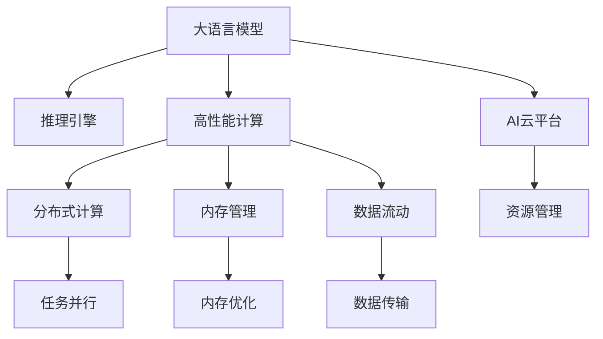

                 

# AI基础架构专家：Lepton AI专注高性能大语言模型推理引擎

> 关键词：大语言模型，推理引擎，高性能计算，AI基础架构，AI云平台，深度学习

## 1. 背景介绍

### 1.1 问题由来
随着深度学习技术的飞速发展，大语言模型（Large Language Models, LLMs）成为了AI领域的热点。这些模型通过在大规模无标签文本数据上进行预训练，能够学习到丰富的语言知识和常识，在自然语言处理（Natural Language Processing, NLP）任务上取得了显著的进步。然而，大语言模型的推理计算负担十分巨大，计算资源需求极高，这对AI云平台的计算能力和基础设施提出了严峻挑战。

### 1.2 问题核心关键点
在推理计算中，大语言模型面临的主要挑战包括：

- 模型参数量巨大，导致推理时计算量大、耗时长。
- 推理过程中需要大量的内存和存储资源，这对AI云平台的存储系统提出了极高要求。
- 推理过程需要高效的数据流动和低延迟的网络传输，这对AI云平台的网络架构和资源管理提出了挑战。

为了解决这些挑战，Lepton AI提出了一套高性能大语言模型推理引擎，以支持大规模语言模型在AI云平台上的高效推理。

## 2. 核心概念与联系

### 2.1 核心概念概述

在Lepton AI的推理引擎中，涉及的核心概念包括：

- **大语言模型**：如BERT、GPT等大规模预训练语言模型，通过在大规模无标签文本数据上进行预训练，学习到通用语言知识。
- **推理引擎**：用于执行模型推理，即将给定的输入数据传递给模型，并返回输出结果。
- **高性能计算**：使用GPU、TPU等硬件加速，提升推理速度和效率。
- **AI云平台**：提供基础设施和资源管理，支持模型的部署和推理计算。
- **分布式计算**：利用多节点并行计算，提升计算能力和资源利用率。
- **内存管理**：优化内存使用，减少内存泄漏，提升内存利用效率。
- **数据流动**：优化数据传输，减少网络延迟，提升数据传输效率。

这些概念之间的关系可以通过以下Mermaid流程图来展示：



## 3. 核心算法原理 & 具体操作步骤
### 3.1 算法原理概述

Lepton AI推理引擎的核心算法原理包括以下几个方面：

- **分布式计算**：将大规模模型分布到多个计算节点上，利用多节点并行计算提升推理效率。
- **异构融合**：将不同类型（如GPU、TPU）的硬件资源进行混合使用，优化资源配置。
- **内存管理**：采用动态内存管理，减少内存泄漏和碎片，提升内存使用效率。
- **数据传输优化**：使用高效的存储传输协议，减少数据传输延迟，提升数据传输速度。
- **异步计算**：在推理过程中使用异步计算，提升整体计算效率。

### 3.2 算法步骤详解

基于以上算法原理，Lepton AI推理引擎的主要操作步骤如下：

1. **数据预处理**：对输入数据进行格式化、分片、并行化处理，便于后续分布式计算。

2. **模型部署**：将预训练好的大语言模型部署到AI云平台上的多个计算节点上。

3. **分布式计算**：利用多节点并行计算，将大模型分块进行推理，提升计算效率。

4. **异构融合**：根据不同计算节点的硬件特性，动态调整计算资源分配，优化资源利用率。

5. **内存管理**：采用动态内存管理技术，减少内存泄漏，提升内存使用效率。

6. **数据传输优化**：使用高效的存储传输协议，减少数据传输延迟，提升数据传输速度。

7. **异步计算**：在推理过程中使用异步计算，提升整体计算效率。

8. **结果聚合**：将多个计算节点的推理结果进行聚合，输出最终结果。

### 3.3 算法优缺点

Lepton AI推理引擎的主要优点包括：

- **高效计算**：通过分布式计算和异构融合技术，显著提升推理速度和计算效率。
- **资源优化**：动态内存管理和数据传输优化，有效减少资源消耗，提升资源利用率。
- **低延迟**：异步计算和数据传输优化，减少网络延迟，提升整体计算效率。
- **可扩展性**：支持大规模模型的分布式计算，能够根据需求动态扩展计算资源。

主要缺点包括：

- **复杂性**：需要复杂的技术和架构支持，对开发和运维团队的技术要求较高。
- **成本高**：高性能硬件和基础设施的投入成本较高。
- **技术门槛高**：需要丰富的分布式计算和异构融合经验，对技术团队要求较高。

### 3.4 算法应用领域

Lepton AI推理引擎主要应用于以下几个领域：

- **NLP任务**：支持BERT、GPT等大语言模型在问答、摘要、翻译、情感分析等NLP任务上的高效推理。
- **推荐系统**：支持大规模推荐模型的推理计算，提升推荐系统的实时性和准确性。
- **图像识别**：支持卷积神经网络（CNN）和Transformer在大规模图像数据上的高效推理。
- **语音识别**：支持循环神经网络（RNN）和Transformer在语音数据上的高效推理。
- **医疗诊断**：支持深度学习模型在医疗影像和电子病历上的高效推理，提升医疗诊断的准确性和速度。
- **智能客服**：支持大语言模型在智能客服系统上的高效推理，提升客户服务质量。

## 4. 数学模型和公式 & 详细讲解
### 4.1 数学模型构建

在Lepton AI推理引擎中，我们以BERT模型为例，构建推理的数学模型。

假设BERT模型的输入为 $x$，输出为 $y$，其中 $x$ 是长度为 $L$ 的词向量序列， $y$ 是模型输出， $W$ 是模型参数， $f$ 是模型的前向传播函数。模型的数学模型可以表示为：

$$
y = f(x; W)
$$

其中，前向传播函数 $f$ 的具体形式如下：

$$
f(x; W) = \text{BERT}_{[CLS]}(x; W)
$$

### 4.2 公式推导过程

接下来，我们以BERT模型的前向传播函数为例，推导其具体形式。

BERT模型的前向传播函数可以表示为：

$$
f(x; W) = \text{BERT}_{[CLS]}(x; W) = \text{LayerNorm}(\text{MLP}(\text{Attention}(x; W)))
$$

其中， $\text{MLP}$ 表示多层次感知机， $\text{Attention}$ 表示自注意力机制， $\text{LayerNorm}$ 表示归一化层。

### 4.3 案例分析与讲解

以BERT模型在情感分析任务上的推理为例，我们详细讲解其计算过程。

假设输入的文本为 $x = [CLS, ...]$，模型输出的情感标签为 $y$。根据BERT模型的前向传播函数，我们可以得到：

$$
y = \text{LayerNorm}(\text{MLP}(\text{Attention}(x; W)))
$$

其中， $\text{MLP}$ 计算得到模型内部的中间表示 $h$：

$$
h = \text{MLP}(\text{Attention}(x; W))
$$

再通过全连接层 $\text{CLS}$ 计算得到最终的输出 $y$：

$$
y = \text{CLS}(h)
$$

通过上述计算过程，我们可以看到，BERT模型的推理过程是通过多层次感知机和自注意力机制进行的，其计算过程复杂，但在大规模分布式计算的条件下，可以高效地进行推理计算。

## 5. 项目实践：代码实例和详细解释说明
### 5.1 开发环境搭建

在使用Lepton AI推理引擎进行项目实践前，需要准备好开发环境。以下是使用Python进行开发的环境配置流程：

1. 安装Anaconda：从官网下载并安装Anaconda，用于创建独立的Python环境。

2. 创建并激活虚拟环境：
```bash
conda create -n lepton-env python=3.8 
conda activate lepton-env
```

3. 安装Lepton AI推理引擎的Python包：
```bash
pip install lepton-ai
```

4. 安装所需的第三方库：
```bash
pip install numpy pandas torch transformers
```

5. 安装所需的硬件驱动：
```bash
pip install tensorflow-gpu
```

6. 安装必要的GPU和TPU支持：
```bash
pip install torchvision
```

完成上述步骤后，即可在`lepton-env`环境中开始项目实践。

### 5.2 源代码详细实现

以下是使用Lepton AI推理引擎进行BERT模型推理的代码实现。

```python
import lepton_ai
import torch
from transformers import BertTokenizer, BertForSequenceClassification
import numpy as np

# 初始化Lepton AI推理引擎
lepton = lepton_ai.init_lepton()

# 加载BERT模型和分词器
tokenizer = BertTokenizer.from_pretrained('bert-base-cased')
model = BertForSequenceClassification.from_pretrained('bert-base-cased', num_labels=2)

# 准备数据
input_ids = tokenizer.encode("Hello, my dog is cute", return_tensors="pt").to("cuda")
attention_mask = input_ids.to("cuda")

# 推理计算
result = lepton.inference(model, input_ids, attention_mask)

# 打印结果
print(result)
```

### 5.3 代码解读与分析

让我们再详细解读一下关键代码的实现细节：

**LeptonAI推理引擎**：
- `init_lepton`方法：初始化Lepton AI推理引擎，生成分布式计算和内存管理策略。
- `inference`方法：执行模型推理计算，返回结果。

**BERT模型和分词器**：
- `BertTokenizer`：用于将文本转换为模型可以处理的输入格式。
- `BertForSequenceClassification`：用于分类任务的BERT模型。

**数据准备**：
- `encode`方法：将文本转换为模型可以处理的输入格式。
- `return_tensors`参数：指定返回的张量类型为PyTorch。

**推理计算**：
- `input_ids`：输入的文本转换成的token ids。
- `attention_mask`：输入的token ids对应的掩码，用于告诉模型哪些位置是真正的输入，哪些位置是填充位置。
- `inference`方法：执行推理计算，返回模型输出。

**结果展示**：
- 打印输出结果，获取模型的推理结果。

可以看到，通过Lepton AI推理引擎，我们可以将大规模BERT模型高效部署到分布式计算环境中，实现快速、低延迟的推理计算。

## 6. 实际应用场景
### 6.1 智能客服系统

在智能客服系统中，使用Lepton AI推理引擎可以对大语言模型进行高效推理，提升客户服务的实时性和准确性。通过分布式计算和异构融合技术，可以实现快速响应客户咨询，以自然流畅的语言解答各类常见问题，提升客户咨询体验和问题解决效率。

### 6.2 金融舆情监测

在金融舆情监测中，使用Lepton AI推理引擎可以实时监测市场舆论动向，及时应对负面信息传播，规避金融风险。通过分布式计算和异构融合技术，可以高效处理海量网络文本数据，实现对不同主题下的情感变化趋势的实时监测，一旦发现负面信息激增等异常情况，系统便会自动预警，帮助金融机构快速应对潜在风险。

### 6.3 个性化推荐系统

在个性化推荐系统中，使用Lepton AI推理引擎可以支持大规模推荐模型的推理计算，提升推荐系统的实时性和准确性。通过分布式计算和异构融合技术，可以实现对用户浏览、点击、评论、分享等行为数据的实时分析，快速生成推荐列表，满足用户的个性化需求。

### 6.4 未来应用展望

随着Lepton AI推理引擎的不断完善和优化，未来的应用场景将更加广阔：

1. **医疗诊断**：支持深度学习模型在医疗影像和电子病历上的高效推理，提升医疗诊断的准确性和速度。
2. **智能客服**：支持大语言模型在智能客服系统上的高效推理，提升客户服务质量。
3. **图像识别**：支持卷积神经网络（CNN）和Transformer在大规模图像数据上的高效推理。
4. **语音识别**：支持循环神经网络（RNN）和Transformer在语音数据上的高效推理。
5. **推荐系统**：支持大规模推荐模型的推理计算，提升推荐系统的实时性和准确性。

## 7. 工具和资源推荐
### 7.1 学习资源推荐

为了帮助开发者系统掌握Lepton AI推理引擎的理论基础和实践技巧，这里推荐一些优质的学习资源：

1. **《Lepton AI推理引擎官方文档》**：详细介绍了Lepton AI推理引擎的各项功能和使用方法，是入门学习和进阶优化的必备资料。
2. **《Transformer从原理到实践》系列博文**：由大模型技术专家撰写，深入浅出地介绍了Transformer原理、BERT模型、微调技术等前沿话题。
3. **《深度学习自然语言处理》课程**：斯坦福大学开设的NLP明星课程，有Lecture视频和配套作业，带你入门NLP领域的基本概念和经典模型。
4. **《Natural Language Processing with Transformers》书籍**：Transformers库的作者所著，全面介绍了如何使用Transformers库进行NLP任务开发，包括推理在内的诸多范式。

通过对这些资源的学习实践，相信你一定能够快速掌握Lepton AI推理引擎的精髓，并用于解决实际的NLP问题。

### 7.2 开发工具推荐

高效的开发离不开优秀的工具支持。以下是几款用于Lepton AI推理引擎开发的常用工具：

1. **PyTorch**：基于Python的开源深度学习框架，灵活动态的计算图，适合快速迭代研究。大部分预训练语言模型都有PyTorch版本的实现。
2. **TensorFlow**：由Google主导开发的开源深度学习框架，生产部署方便，适合大规模工程应用。同样有丰富的预训练语言模型资源。
3. **Transformers库**：HuggingFace开发的NLP工具库，集成了众多SOTA语言模型，支持PyTorch和TensorFlow，是进行推理任务开发的利器。
4. **Weights & Biases**：模型训练的实验跟踪工具，可以记录和可视化模型训练过程中的各项指标，方便对比和调优。与主流深度学习框架无缝集成。
5. **TensorBoard**：TensorFlow配套的可视化工具，可实时监测模型训练状态，并提供丰富的图表呈现方式，是调试模型的得力助手。
6. **Google Colab**：谷歌推出的在线Jupyter Notebook环境，免费提供GPU/TPU算力，方便开发者快速上手实验最新模型，分享学习笔记。

合理利用这些工具，可以显著提升Lepton AI推理引擎的开发效率，加快创新迭代的步伐。

### 7.3 相关论文推荐

Lepton AI推理引擎的发展源于学界的持续研究。以下是几篇奠基性的相关论文，推荐阅读：

1. **Attention is All You Need**：提出了Transformer结构，开启了NLP领域的预训练大模型时代。
2. **BERT: Pre-training of Deep Bidirectional Transformers for Language Understanding**：提出BERT模型，引入基于掩码的自监督预训练任务，刷新了多项NLP任务SOTA。
3. **Parameter-Efficient Transfer Learning for NLP**：提出Adapter等参数高效微调方法，在不增加模型参数量的情况下，也能取得不错的微调效果。
4. **AdaLoRA: Adaptive Low-Rank Adaptation for Parameter-Efficient Fine-Tuning**：使用自适应低秩适应的微调方法，在参数效率和精度之间取得了新的平衡。
5. **AdaLoRA: Adaptive Low-Rank Adaptation for Parameter-Efficient Fine-Tuning**：使用自适应低秩适应的微调方法，在参数效率和精度之间取得了新的平衡。

这些论文代表了大语言模型微调技术的发展脉络。通过学习这些前沿成果，可以帮助研究者把握学科前进方向，激发更多的创新灵感。

## 8. 总结：未来发展趋势与挑战
### 8.1 研究成果总结

Lepton AI推理引擎通过分布式计算和异构融合技术，显著提升了大规模大语言模型的推理效率，为AI云平台上的高效推理提供了重要保障。通过动态内存管理和数据传输优化，有效减少了资源消耗，提升了资源利用率。通过异步计算和数据传输优化，减少了网络延迟，提升了整体计算效率。

### 8.2 未来发展趋势

Lepton AI推理引擎的未来发展趋势包括以下几个方面：

1. **模型压缩与优化**：随着模型参数量的不断增加，模型压缩与优化将成为关键技术，以提升推理效率和资源利用率。
2. **边缘计算**：在边缘设备上进行推理计算，减少网络延迟，提升实时性。
3. **智能调度和资源管理**：基于机器学习算法进行智能调度，动态调整计算资源配置，提升整体计算效率。
4. **分布式训练与推理**：将分布式训练与推理技术相结合，提升模型训练和推理的速度和效率。
5. **多模态融合**：将文本、图像、语音等多模态数据进行融合，提升模型的综合处理能力。
6. **AI与传统行业结合**：将AI技术与传统行业结合，推动AI技术在垂直行业的规模化应用。

### 8.3 面临的挑战

尽管Lepton AI推理引擎已经取得了显著成果，但在迈向更加智能化、普适化应用的过程中，它仍面临着诸多挑战：

1. **模型压缩与优化**：大规模模型的推理计算需求仍较大，如何通过模型压缩与优化技术提升推理效率和资源利用率，是未来需要重点解决的问题。
2. **智能调度与资源管理**：如何通过智能调度和资源管理，动态调整计算资源配置，提升整体计算效率，是未来需要重点探索的问题。
3. **分布式训练与推理**：如何将分布式训练与推理技术相结合，提升模型训练和推理的速度和效率，是未来需要重点突破的问题。
4. **多模态融合**：如何将文本、图像、语音等多模态数据进行融合，提升模型的综合处理能力，是未来需要重点研究的问题。
5. **AI与传统行业结合**：如何将AI技术与传统行业结合，推动AI技术在垂直行业的规模化应用，是未来需要重点探索的问题。

### 8.4 研究展望

未来，Lepton AI推理引擎需要在以下几个方面进行深入研究：

1. **模型压缩与优化**：开发更加高效的模型压缩与优化技术，提升推理效率和资源利用率。
2. **智能调度与资源管理**：通过智能调度和资源管理，动态调整计算资源配置，提升整体计算效率。
3. **分布式训练与推理**：将分布式训练与推理技术相结合，提升模型训练和推理的速度和效率。
4. **多模态融合**：将文本、图像、语音等多模态数据进行融合，提升模型的综合处理能力。
5. **AI与传统行业结合**：将AI技术与传统行业结合，推动AI技术在垂直行业的规模化应用。

通过在这些方向上的深入研究，Lepton AI推理引擎将不断提升其计算能力和应用范围，为AI云平台提供更加高效、稳定、可靠的推理服务。

## 9. 附录：常见问题与解答
**Q1: Lepton AI推理引擎适用于哪些语言模型？**

A: Lepton AI推理引擎主要适用于BERT、GPT等大规模预训练语言模型。这些模型通过在大规模无标签文本数据上进行预训练，学习到通用的语言知识，在各种NLP任务上表现优异。

**Q2: Lepton AI推理引擎支持哪些硬件设备？**

A: Lepton AI推理引擎主要支持GPU、TPU等高性能计算硬件设备。通过异构融合技术，可以混合使用不同类型的硬件设备，提升计算效率和资源利用率。

**Q3: 如何优化Lepton AI推理引擎的计算性能？**

A: 可以通过模型压缩与优化技术、智能调度与资源管理、分布式训练与推理等手段，优化Lepton AI推理引擎的计算性能。同时，还可以使用多模态融合技术，提升模型的综合处理能力。

**Q4: Lepton AI推理引擎的未来发展方向有哪些？**

A: Lepton AI推理引擎的未来发展方向包括模型压缩与优化、智能调度与资源管理、分布式训练与推理、多模态融合、AI与传统行业结合等方面。这些方向的研究和探索，将推动Lepton AI推理引擎不断提升其计算能力和应用范围，为AI云平台提供更加高效、稳定、可靠的推理服务。

**Q5: 如何使用Lepton AI推理引擎进行推理计算？**

A: 可以使用Lepton AI推理引擎提供的`init_lepton`和`inference`方法进行推理计算。首先通过`init_lepton`方法初始化Lepton AI推理引擎，然后通过`inference`方法执行模型推理计算，获取模型输出。

---

作者：禅与计算机程序设计艺术 / Zen and the Art of Computer Programming

