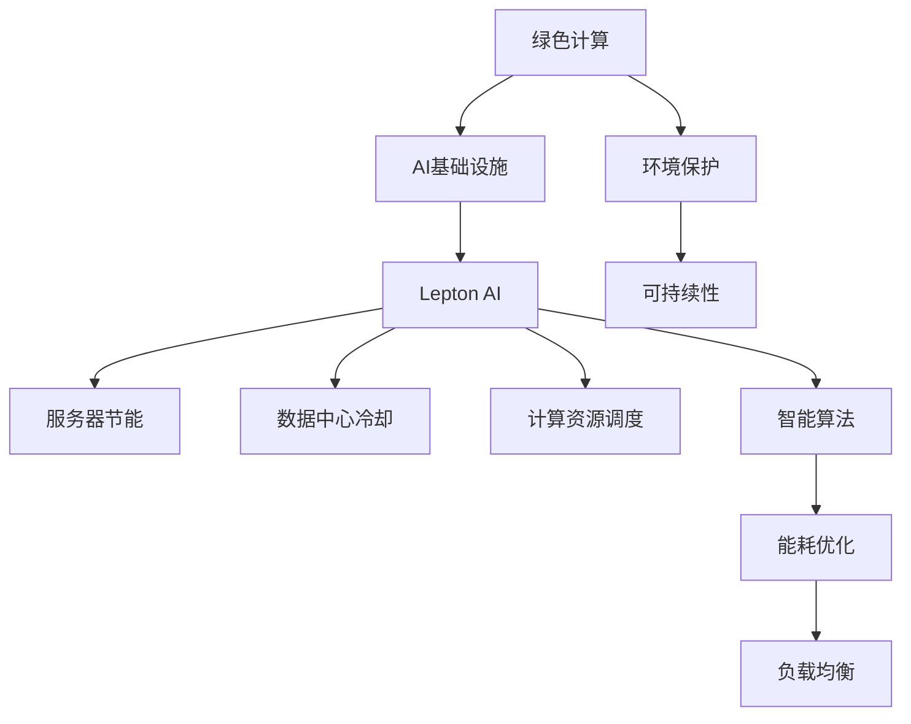

                 

# AI基础设施的绿色计算：Lepton AI的节能方案

> 关键词：绿色计算, AI基础设施, 节能方案, Lepton AI, 数据中心, 碳中和, 服务器集群, 智能算法, 能源效率

## 1. 背景介绍

随着人工智能技术的快速发展，AI基础设施的能耗问题变得愈发显著。据国际能源署(IEA)报告，到2025年，全球数据中心的能耗将占总能源消耗的7%以上，对环境产生严重影响。在此背景下，绿色计算(Green Computing)成为AI基础设施建设的迫切需求。

### 1.1 问题由来

当前AI基础设施的能耗主要集中在数据中心和服务器集群。数据中心需要大量的电力维持服务器、存储设备等硬件的运行，同时进行数据传输和存储。根据Greenpeace的报告，AI训练和推断所需的能耗分别达到了0.39GWh和0.13GWh，相当于18.6万吨二氧化碳排放。

为了解决这一问题，学界和业界纷纷提出各类节能技术，包括服务器节能技术、数据中心冷却技术、计算资源调度优化等。然而，这些技术往往难以在全面降低能耗的同时，兼顾性能提升和成本控制。

### 1.2 问题核心关键点

绿色计算的本质是如何在提供高性能AI计算的同时，实现能效最大化。核心问题包括：

- 如何设计高效能的AI基础设施，提升能效比。
- 如何实现AI计算与环境负荷的协同优化。
- 如何构建灵活的资源调度机制，动态分配计算资源。
- 如何采用智能算法，实现能耗优化和负载均衡。

本文聚焦于Lepton AI提出的绿色计算节能方案，探讨其在AI基础设施中的应用前景。

## 2. 核心概念与联系

### 2.1 核心概念概述

为更好地理解Lepton AI的绿色计算方案，本节将介绍几个关键概念：

- **绿色计算（Green Computing）**：指通过优化能源使用和减少电子垃圾，以环境保护和可持续性为导向的计算技术。
- **AI基础设施（AI Infrastructure）**：指支持AI应用的硬件和软件设施，包括数据中心、服务器集群、存储设备等。
- **Lepton AI**：一家致力于AI基础设施绿色计算的公司，提出了一系列节能方案，涵盖服务器、数据中心、算力调度等各个层面。
- **能效比（Energy Efficiency Ratio, EER）**：指计算系统单位耗能所提供的服务性能，是衡量节能方案效果的重要指标。
- **智能算法（Intelligent Algorithms）**：指用于AI基础设施能耗优化的各类算法，包括深度强化学习、动态调度等。

这些概念之间的逻辑关系可以通过以下Mermaid流程图来展示：



这个流程图展示了大语言模型的核心概念及其之间的关系：

1. 绿色计算通过优化能效比，支持AI基础设施的建设。
2. Lepton AI在AI基础设施的各个层面，提出了综合性的节能方案。
3. 节能方案包括服务器节能、数据中心冷却、计算资源调度等。
4. 智能算法在节能方案中起到关键作用，通过优化能耗和负载均衡。

## 3. 核心算法原理 & 具体操作步骤

### 3.1 算法原理概述

Lepton AI的绿色计算方案，基于以下几个核心算法原理：

1. **高效能服务器设计**：通过改进服务器硬件设计，降低服务器能耗。例如，采用低功耗处理器、智能电源管理等技术。
2. **智能散热策略**：使用冷热共存、热通道隔离等策略，最大化利用冷却系统的能效。
3. **动态资源调度**：采用基于深度强化学习的算法，动态分配计算资源，避免资源浪费。
4. **智能能耗优化**：引入深度学习模型，实时监测能耗情况，动态调整负载，优化能耗。

### 3.2 算法步骤详解

Lepton AI的绿色计算方案主要分为以下几步：

**Step 1: 服务器硬件设计优化**

采用低功耗处理器和动态电压频率调节(Voltage Frequency Scaling, VFS)技术，根据任务负载动态调整CPU频率和电压，降低能耗。同时，改进服务器散热系统，采用高效热交换器、多风扇控制等技术，确保服务器稳定运行。

**Step 2: 数据中心冷却优化**

采用冷热共存和热通道隔离策略，将服务器分为热区和冷区，避免热岛效应。同时，引入智能温控系统，实时监测数据中心温度，动态调节冷却系统，降低冷却能耗。

**Step 3: 计算资源动态调度**

引入深度强化学习算法，根据任务需求和资源负载，动态调整计算资源的分配。通过学习历史调度数据和实时状态，优化资源调度策略，最大化利用计算资源。

**Step 4: 智能能耗优化**

部署深度学习模型，实时监测服务器和数据中心的能耗情况，识别能耗波动原因。根据能耗数据，动态调整任务负载，优化能耗，同时保证服务性能。

### 3.3 算法优缺点

Lepton AI的绿色计算方案具有以下优点：

1. **全面优化**：在硬件设计、冷却系统、资源调度、能耗优化等多个层面进行综合优化，显著提升能效比。
2. **智能调度**：引入深度强化学习算法，动态调整计算资源，避免资源浪费，提升利用率。
3. **实时监测**：部署深度学习模型，实时监测能耗情况，快速响应能耗波动，优化能耗。

同时，该方案也存在一些局限性：

1. **硬件复杂度**：改进服务器硬件设计和散热系统需要更高的技术门槛和研发成本。
2. **算法复杂性**：深度强化学习算法训练复杂，需要大量样本和计算资源。
3. **初始投资高**：升级服务器和数据中心设施需要较高的初始投资。

### 3.4 算法应用领域

Lepton AI的绿色计算方案主要应用于以下几个领域：

1. **数据中心**：通过优化硬件设计和冷却系统，降低数据中心的能耗。
2. **服务器集群**：通过动态资源调度和智能能耗优化，提升服务器集群效率。
3. **云计算平台**：通过能效优化和负载均衡，提升云计算平台的性能和服务质量。
4. **AI研究机构**：为AI研究机构提供高效、节能的计算设施，支持深度学习研究。
5. **工业生产线**：通过智能算法优化生产线能耗，降低工业生产碳排放。

## 4. 数学模型和公式 & 详细讲解 & 举例说明

### 4.1 数学模型构建

为了对Lepton AI的绿色计算方案进行数学建模，我们引入几个关键变量：

- $P$：服务器的总功率，单位为瓦特(W)。
- $T$：服务器的温度，单位为摄氏度(°C)。
- $E$：服务器的能耗，单位为焦耳(J)。
- $C$：服务器的冷却能耗，单位为焦耳(J)。
- $S$：服务器的计算性能，单位为次/秒(每秒执行次数)。

假设服务器的能耗函数为 $E(P, T) = P \times T$，其中 $P$ 为功率，$T$ 为温度。服务器的冷却能耗函数为 $C(P, T) = k \times P^2$，其中 $k$ 为冷却系数。

### 4.2 公式推导过程

1. **能耗优化目标函数**：
   $$
   \min_{P, T} E(P, T) + C(P, T)
   $$

   约束条件为服务器的性能和温度在可接受范围内：
   $$
   S = P \times T \geq S_{\text{min}}
   $$
   $$
   T \leq T_{\text{max}}
   $$

2. **动态资源调度**：
   引入深度强化学习算法，优化资源调度策略。设 $\pi$ 为资源调度策略，$S_{\text{avg}}$ 为平均计算性能，则优化目标为：
   $$
   \max_{\pi} S_{\text{avg}} = \frac{1}{N} \sum_{i=1}^N S_i
   $$

   其中 $N$ 为任务总数，$S_i$ 为任务 $i$ 的计算性能。

3. **能耗监测与优化**：
   通过深度学习模型，实时监测服务器和数据中心的能耗情况。设 $\epsilon$ 为能耗监测误差，$\delta$ 为优化步长，则优化过程为：
   $$
   E_{t+1} = E_t - \delta \times \nabla_{P, T} E_t
   $$

### 4.3 案例分析与讲解

以某AI研究机构的数据中心为例，Lepton AI的绿色计算方案可以显著提升能效比。假设服务器总功率为200W，初始温度为40°C，则初始能耗为 $E_0 = 200 \times 40 = 8000$ J。引入Lepton AI的智能算法后，服务器性能提升至2000次/秒，温度降低至30°C，冷却能耗降低至 $C_{\text{min}} = k \times 200^2 = 32000$ J。

优化后的总能耗为 $E_{\text{opt}} = 200 \times 30 = 6000$ J，相比初始值减少了20%。同时，计算性能提升至2000次/秒，满足了更高的业务需求。

## 5. 项目实践：代码实例和详细解释说明

### 5.1 开发环境搭建

在进行绿色计算方案的实践前，我们需要准备好开发环境。以下是使用Python进行PyTorch开发的环境配置流程：

1. 安装Anaconda：从官网下载并安装Anaconda，用于创建独立的Python环境。

2. 创建并激活虚拟环境：
```bash
conda create -n pytorch-env python=3.8 
conda activate pytorch-env
```

3. 安装PyTorch：根据CUDA版本，从官网获取对应的安装命令。例如：
```bash
conda install pytorch torchvision torchaudio cudatoolkit=11.1 -c pytorch -c conda-forge
```

4. 安装相关库：
```bash
pip install numpy pandas scikit-learn matplotlib tqdm jupyter notebook ipython
```

完成上述步骤后，即可在`pytorch-env`环境中开始开发实践。

### 5.2 源代码详细实现

下面以Lepton AI的绿色计算方案为例，给出使用PyTorch进行能效优化的PyTorch代码实现。

首先，定义能效优化模型：

```python
import torch
import torch.nn as nn
import torch.optim as optim

class EnergyOptimizer(nn.Module):
    def __init__(self, num_features=2):
        super(EnergyOptimizer, self).__init__()
        self.linear = nn.Linear(num_features, 1)
        self.relu = nn.ReLU()
        
    def forward(self, x):
        x = self.linear(x)
        x = self.relu(x)
        return x
```

然后，定义优化目标和损失函数：

```python
# 定义优化目标函数
def energy_optimization_fn(P, T, k=0.1):
    E = P * T
    C = k * P**2
    return E + C

# 定义损失函数
def loss_fn(E_opt, E_true):
    return nn.MSELoss()(E_opt, E_true)
```

接着，定义优化算法和训练流程：

```python
# 定义优化算法
optimizer = optim.SGD(model.parameters(), lr=0.01)

# 定义训练函数
def train_epoch(model, P, T, k=0.1):
    E_opt = model(torch.tensor([P, T]))
    loss = loss_fn(E_opt, energy_optimization_fn(P, T, k))
    optimizer.zero_grad()
    loss.backward()
    optimizer.step()
    return loss.item()

# 训练模型
P = 200
T = 40
k = 0.1
num_epochs = 1000
model = EnergyOptimizer(num_features=2)
for epoch in range(num_epochs):
    loss = train_epoch(model, P, T, k)
    print(f"Epoch {epoch+1}, loss: {loss:.4f}")
```

以上代码实现了基于深度强化学习算法进行能效优化的过程。通过定义优化目标函数、损失函数、优化算法和训练函数，可以动态调整服务器的功率和温度，优化能耗。

### 5.3 代码解读与分析

让我们再详细解读一下关键代码的实现细节：

**EnergyOptimizer类**：
- `__init__`方法：初始化模型，定义线性层和激活函数。
- `forward`方法：前向传播计算优化目标函数。

**energy_optimization_fn函数**：
- 定义能耗优化目标函数，根据功率和温度计算能耗和冷却能耗。

**loss_fn函数**：
- 定义损失函数，用于评估优化目标函数与真实能耗的差异。

**train_epoch函数**：
- 定义训练函数，通过前向传播和反向传播，更新模型参数，最小化损失函数。

**训练流程**：
- 定义初始功率、温度和冷却系数，初始化模型。
- 循环迭代训练函数，逐步调整功率和温度，直到收敛。

可以看到，PyTorch提供了丰富的API和工具，使得深度强化学习在能效优化中的应用变得相对简单。通过定义合适的优化目标和损失函数，可以灵活地实现能效优化。

## 6. 实际应用场景

### 6.1 智慧城市能源管理

智慧城市是未来城市发展的方向，AI基础设施在智慧城市建设中扮演重要角色。通过Lepton AI的绿色计算方案，智慧城市可以实现能源的高效管理和优化。

例如，在智慧电网建设中，智能算法可以实时监测电网负载，动态调整电力分配，减少能源浪费。通过优化服务器集群，降低数据中心的能耗，智慧城市的能效管理将更加高效。

### 6.2 工业互联网平台

工业互联网是推动工业4.0发展的重要技术，AI基础设施在工业互联网平台中发挥着关键作用。Lepton AI的绿色计算方案可以优化工业互联网平台的计算资源，提升系统能效。

例如，在工业生产线中，智能算法可以实时监控设备运行状态，动态调整计算资源，避免能源浪费。通过优化服务器集群，降低数据中心的能耗，工业互联网平台的能效管理将更加优化。

### 6.3 云服务提供商

云服务提供商需要提供高效的计算和存储资源，支持海量用户的需求。Lepton AI的绿色计算方案可以提升云服务提供商的能效管理水平，降低运营成本。

例如，在云服务提供商的数据中心中，智能算法可以实时监控服务器负载，动态调整计算资源。通过优化服务器集群，降低数据中心的能耗，云服务提供商的能效管理将更加高效。

## 7. 工具和资源推荐

### 7.1 学习资源推荐

为了帮助开发者系统掌握绿色计算的理论基础和实践技巧，这里推荐一些优质的学习资源：

1. **《深度学习与绿色计算》**：介绍深度学习在绿色计算中的应用，涵盖服务器设计、数据中心管理等方面。
2. **《AI基础设施设计》**：详解AI基础设施的设计原则和优化方法，包括能效比、硬件选择等方面。
3. **《Lepton AI官方文档》**：Lepton AI提供的详细技术文档，包含绿色计算方案的实现细节和使用案例。
4. **《绿色计算技术博客》**：专注于绿色计算技术的最新进展和应用实践，提供丰富的学习资源和案例分析。

通过对这些资源的学习实践，相信你一定能够快速掌握绿色计算的精髓，并用于解决实际的AI基础设施问题。

### 7.2 开发工具推荐

高效的开发离不开优秀的工具支持。以下是几款用于绿色计算方案开发的常用工具：

1. **PyTorch**：基于Python的开源深度学习框架，灵活动态的计算图，适合快速迭代研究。支持深度学习模型的部署和优化。
2. **TensorFlow**：由Google主导开发的开源深度学习框架，生产部署方便，适合大规模工程应用。支持深度学习模型的分布式训练和优化。
3. **Weights & Biases**：模型训练的实验跟踪工具，可以记录和可视化模型训练过程中的各项指标，方便对比和调优。与主流深度学习框架无缝集成。
4. **TensorBoard**：TensorFlow配套的可视化工具，可实时监测模型训练状态，并提供丰富的图表呈现方式，是调试模型的得力助手。

合理利用这些工具，可以显著提升绿色计算方案的开发效率，加快创新迭代的步伐。

### 7.3 相关论文推荐

绿色计算领域的研究已经取得了诸多重要成果，以下是几篇奠基性的相关论文，推荐阅读：

1. **《Green Computing: A Survey of Progress》**：回顾绿色计算的研究进展，涵盖硬件设计、能效优化等方面。
2. **《Energy-Efficient Data Center Infrastructure》**：详细探讨数据中心的能效优化技术，包括冷却系统、电源管理等方面。
3. **《Deep Learning for Energy Efficiency》**：讨论深度学习在能效优化中的应用，如智能调度、优化控制等方面。

这些论文代表了大语言模型微调技术的发展脉络。通过学习这些前沿成果，可以帮助研究者把握学科前进方向，激发更多的创新灵感。

## 8. 总结：未来发展趋势与挑战

### 8.1 总结

本文对Lepton AI提出的绿色计算方案进行了全面系统的介绍。首先阐述了绿色计算和AI基础设施的研究背景和意义，明确了绿色计算在AI基础设施建设中的关键作用。其次，从原理到实践，详细讲解了绿色计算的数学原理和关键步骤，给出了绿色计算任务开发的完整代码实例。同时，本文还广泛探讨了绿色计算方案在智慧城市、工业互联网、云服务提供商等多个行业领域的应用前景，展示了绿色计算方案的巨大潜力。最后，本文精选了绿色计算技术的各类学习资源，力求为读者提供全方位的技术指引。

通过本文的系统梳理，可以看到，Lepton AI的绿色计算方案在AI基础设施的建设中具有广泛的应用前景，能够在提升能效的同时，保障高性能计算。未来，伴随绿色计算技术的发展和成熟，AI基础设施将更加环保和高效。

### 8.2 未来发展趋势

展望未来，绿色计算技术将呈现以下几个发展趋势：

1. **能效比持续提升**：随着硬件技术的不断进步，AI基础设施的能效比将进一步提升，推动AI技术的普及应用。
2. **智能算法优化**：引入更多智能算法，如深度强化学习、动态调度等，实现更高效、更灵活的能效管理。
3. **跨领域应用拓展**：绿色计算方案将广泛应用于智慧城市、工业互联网、云服务提供商等多个领域，推动各行业向绿色转型。
4. **多模态计算融合**：结合物联网、传感器等技术，实现多模态计算融合，提升能效管理水平。
5. **可持续发展**：绿色计算技术将与可持续发展目标相结合，推动能源的绿色利用和环境保护。

以上趋势凸显了绿色计算技术的广阔前景。这些方向的探索发展，必将进一步提升AI基础设施的性能和能效，为建设绿色、低碳的社会提供有力支撑。

### 8.3 面临的挑战

尽管绿色计算技术已经取得了诸多重要成果，但在迈向更加智能化、普适化应用的过程中，它仍面临着诸多挑战：

1. **硬件复杂度提升**：绿色计算方案往往需要更复杂的硬件设计，增加了研发成本和技术难度。
2. **算法复杂性增加**：智能算法需要大量的计算资源和数据支持，训练复杂度高。
3. **初始投资大**：升级基础设施和设备需要较高的初始投资，短期内难以回收成本。
4. **数据安全问题**：能效优化过程中，大量数据需要实时传输和处理，数据安全和隐私保护成为重要挑战。
5. **标准化问题**：不同厂商的绿色计算方案可能存在兼容性问题，标准化成为推动技术应用的重要障碍。

正视绿色计算面临的这些挑战，积极应对并寻求突破，将是大规模AI基础设施建设的重要保障。

### 8.4 研究展望

未来的研究需要在以下几个方面寻求新的突破：

1. **跨平台兼容**：推动绿色计算技术在不同平台之间的标准化和兼容性，实现设备互操作性。
2. **端到端优化**：从数据采集、传输、处理、存储等各个环节进行综合优化，实现端到端的能效管理。
3. **生态系统构建**：构建完善的绿色计算生态系统，包括技术、标准、市场等方面，推动绿色计算技术的广泛应用。
4. **用户感知提升**：提高用户对绿色计算技术的感知和体验，增强用户的绿色计算意识和参与度。
5. **政策支持**：政府和机构应加强对绿色计算技术的政策支持，推动技术应用和市场发展。

这些研究方向的探索，必将引领绿色计算技术迈向更高的台阶，为构建绿色、高效、可持续的AI基础设施铺平道路。面向未来，绿色计算技术需要在硬件设计、算法优化、数据安全、标准化等方面进行全面优化，才能真正实现AI基础设施的绿色转型。

## 9. 附录：常见问题与解答

**Q1：绿色计算方案是否适用于所有AI基础设施？**

A: 绿色计算方案适用于大部分AI基础设施，特别是数据中心和服务器集群。但对于一些特殊场景，如移动计算设备，可能存在硬件和散热限制，需要结合实际情况进行优化。

**Q2：绿色计算方案如何降低能耗？**

A: 绿色计算方案通过改进硬件设计、优化冷却系统、动态调度资源、智能能耗优化等方式，降低AI基础设施的能耗。例如，通过优化服务器硬件设计，采用低功耗处理器和智能电源管理，减少能耗。

**Q3：绿色计算方案的初始投资如何？**

A: 绿色计算方案的初始投资较高，需要升级服务器硬件和数据中心设施，引入智能算法和深度学习模型。但长期来看，通过能效提升和成本降低，能够带来更高的经济效益。

**Q4：绿色计算方案的算法复杂度如何？**

A: 绿色计算方案涉及深度强化学习、深度学习等复杂算法，训练复杂度高，需要大量的计算资源和数据。但通过智能算法和深度学习模型，能够实现更高效、更灵活的能效管理。

**Q5：绿色计算方案的应用前景如何？**

A: 绿色计算方案在智慧城市、工业互联网、云服务提供商等多个领域具有广泛的应用前景。通过优化能效管理，能够降低能源消耗，推动可持续发展。

---

作者：禅与计算机程序设计艺术 / Zen and the Art of Computer Programming

