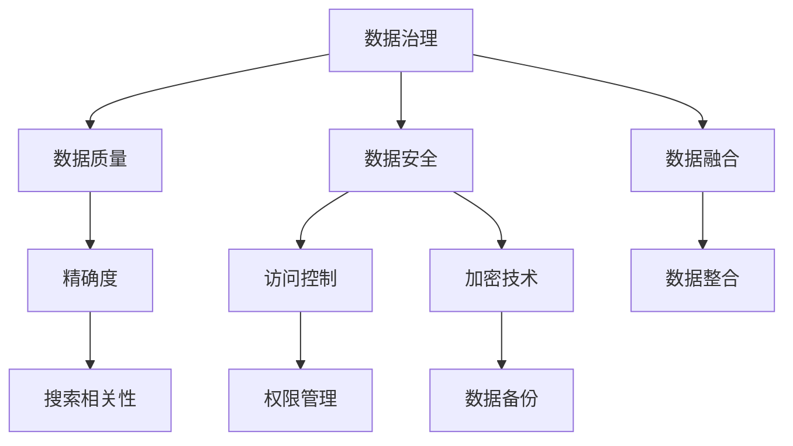

                 

# AI大模型助力电商搜索推荐业务的数据治理能力评估体系应用实践

> 关键词：
- 大模型
- 数据治理
- 电商搜索推荐
- 人工智能
- 业务数据
- 数据质量
- 数据安全
- 数据融合
- 数据应用

## 1. 背景介绍

随着人工智能技术的飞速发展，大模型在电商搜索推荐业务中的应用已经成为一种新的趋势。大模型基于大规模数据进行预训练，具有强大的数据理解和生成能力，能够有效提升搜索推荐系统的精确度和个性化程度。然而，电商搜索推荐业务涉及的数据量大且复杂，数据质量、数据安全等问题也是系统设计中不可忽视的重要因素。为此，数据治理能力评估体系应运而生，旨在对电商搜索推荐业务的数据治理能力进行全面评估，确保数据质量、数据安全等方面符合系统需求，推动大模型在电商搜索推荐系统中的应用。

### 1.1 问题由来

在大数据时代，数据已经成为驱动电商搜索推荐系统的重要资源。传统的数据处理方式难以应对海量、复杂的数据，数据治理成为电商搜索推荐系统建设的重要环节。然而，数据治理工作涉及数据质量、数据安全、数据融合等多个方面，单一的数据治理手段难以全面覆盖这些需求。为此，构建一个全面的数据治理能力评估体系，对于电商搜索推荐系统的建设有着重要的意义。

### 1.2 问题核心关键点

构建数据治理能力评估体系，关键在于如何对数据治理的各个方面进行量化评估，包括数据质量、数据安全、数据融合等。具体来说，评估体系应包括以下几个核心点：
1. 数据质量：通过数据完整性、准确性、一致性、时效性等指标对数据进行评估。
2. 数据安全：评估数据访问控制、数据加密、数据备份等方面的安全措施。
3. 数据融合：评估数据整合和融合的效率与质量，确保不同数据源的数据能够有效整合。
4. 数据应用：评估数据在电商搜索推荐系统中的应用效果，包括搜索精确度、推荐相关性等。

### 1.3 问题研究意义

构建电商搜索推荐业务的数据治理能力评估体系，对于提升电商搜索推荐系统的性能和用户体验具有重要意义：

1. 保障数据质量：通过系统评估，及时发现数据质量问题，确保系统使用的数据是准确、完整、一致的，从而提升搜索推荐系统的精确度和个性化程度。
2. 增强数据安全：评估数据治理安全措施的实施效果，保障电商搜索推荐系统中的数据安全，防止数据泄露和滥用。
3. 促进数据融合：评估数据融合的效率和质量，确保不同数据源的数据能够有效整合，提高数据治理的协同效应。
4. 优化数据应用：评估数据在电商搜索推荐系统中的应用效果，不断优化搜索推荐策略，提升用户体验。

## 2. 核心概念与联系

### 2.1 核心概念概述

构建数据治理能力评估体系，涉及多个核心概念，包括数据治理、数据质量、数据安全、数据融合等。这些概念之间的关系可以通过以下Mermaid流程图来展示：



这个流程图展示了大模型在电商搜索推荐业务中的数据治理能力评估体系的各个环节及其联系。

### 2.2 核心概念原理和架构

#### 2.2.1 数据治理

数据治理是一个系统性的管理过程，旨在确保数据的质量、安全、一致性和可用性。数据治理包括数据资产管理、数据质量管理、数据安全管理、数据标准管理等多个方面。数据治理的最终目标是通过有效的管理措施，提升数据的治理能力，确保数据在电商搜索推荐系统中的有效应用。

#### 2.2.2 数据质量

数据质量是指数据在采集、存储、处理、传输和应用过程中，满足业务需求的程度。数据质量包括数据完整性、准确性、一致性、时效性等指标。通过数据质量评估，可以发现数据中的问题和不足，采取相应的措施进行改进，从而提升电商搜索推荐系统的数据质量。

#### 2.2.3 数据安全

数据安全是指保护数据在存储、传输和使用过程中的机密性、完整性和可用性。数据安全管理包括数据访问控制、数据加密、数据备份等多个方面。通过数据安全评估，可以发现系统中的安全漏洞和不足之处，采取相应的安全措施，保障电商搜索推荐系统中的数据安全。

#### 2.2.4 数据融合

数据融合是指将不同来源的数据整合在一起，形成统一的、完整的数据视图。数据融合的目的是消除数据冗余、提高数据质量，并从多角度对业务问题进行分析和决策。通过数据融合评估，可以发现数据整合中的问题和不足，采取相应的优化措施，提高数据融合的效率和质量。

### 2.3 核心概念联系

数据治理、数据质量、数据安全和数据融合之间存在紧密的联系。数据治理是数据质量、数据安全和数据融合的前提和基础，数据质量和数据安全是数据治理的重要组成部分，数据融合则是数据治理的重要目标。通过构建数据治理能力评估体系，可以有效提升电商搜索推荐系统中的数据治理能力，确保数据的高质量、高安全性和高融合度，从而推动大模型在电商搜索推荐系统中的应用。

## 3. 核心算法原理 & 具体操作步骤

### 3.1 算法原理概述

构建电商搜索推荐业务的数据治理能力评估体系，核心算法原理基于监督学习，通过训练一个分类模型，对电商搜索推荐系统的各个数据治理环节进行评估和预测。具体来说，算法原理包括以下几个步骤：

1. 数据预处理：对电商搜索推荐系统的数据进行清洗、归一化等预处理操作，确保数据的质量和一致性。
2. 特征工程：提取电商搜索推荐系统中各个数据治理环节的关键特征，包括数据质量指标、数据安全措施、数据融合效果等。
3. 模型训练：利用监督学习算法（如决策树、随机森林等），训练一个分类模型，对数据治理能力进行评估和预测。
4. 评估指标：根据电商搜索推荐系统的业务需求，定义评估指标，如搜索精确度、推荐相关性等，用于评估模型的性能。

### 3.2 算法步骤详解

#### 3.2.1 数据预处理

数据预处理是构建数据治理能力评估体系的基础步骤，包括数据清洗、归一化、特征选择等多个方面。具体来说，数据预处理包括以下几个步骤：

1. 数据清洗：删除无效、重复、噪声数据，确保数据的完整性和一致性。
2. 归一化：对数据进行归一化处理，消除数据之间的差异，确保数据的一致性。
3. 特征选择：选择与电商搜索推荐系统业务相关的特征，确保特征的独立性和完备性。

#### 3.2.2 特征工程

特征工程是构建数据治理能力评估体系的重要步骤，包括特征提取、特征选择、特征变换等多个方面。具体来说，特征工程包括以下几个步骤：

1. 特征提取：从电商搜索推荐系统的各个数据治理环节中提取关键特征，如数据质量指标、数据安全措施、数据融合效果等。
2. 特征选择：选择与电商搜索推荐系统业务相关的特征，确保特征的独立性和完备性。
3. 特征变换：对特征进行变换和转换，提高特征的有效性和泛化能力。

#### 3.2.3 模型训练

模型训练是构建数据治理能力评估体系的关键步骤，包括数据集划分、模型选择、模型训练等多个方面。具体来说，模型训练包括以下几个步骤：

1. 数据集划分：将电商搜索推荐系统的数据集划分为训练集、验证集和测试集。
2. 模型选择：选择合适的监督学习算法（如决策树、随机森林等），建立数据治理能力评估模型。
3. 模型训练：利用训练集对模型进行训练，通过验证集进行模型调优，最终得到评估模型。

#### 3.2.4 评估指标

评估指标是评估模型性能的关键步骤，包括模型精度、召回率、F1值等多个方面。具体来说，评估指标包括以下几个步骤：

1. 模型精度：评估模型预测结果的准确性，即预测正确的数据治理能力评估结果的占比。
2. 召回率：评估模型对数据治理能力评估结果的覆盖率，即预测正确的数据治理能力评估结果的占比。
3. F1值：综合考虑模型精度和召回率，评估模型的整体性能。

### 3.3 算法优缺点

#### 3.3.1 算法优点

构建电商搜索推荐业务的数据治理能力评估体系，具有以下优点：

1. 系统性：通过构建数据治理能力评估体系，可以系统性地评估电商搜索推荐系统的各个数据治理环节，确保数据的高质量、高安全性和高融合度。
2. 全面性：数据治理能力评估体系涉及数据质量、数据安全和数据融合等多个方面，全面评估电商搜索推荐系统的数据治理能力。
3. 可操作性：通过监督学习算法，对电商搜索推荐系统的各个数据治理环节进行评估和预测，评估结果具有可操作性。

#### 3.3.2 算法缺点

构建电商搜索推荐业务的数据治理能力评估体系，也存在以下缺点：

1. 数据依赖：数据治理能力评估体系依赖于电商搜索推荐系统的数据质量，数据质量较差时，评估结果可能不准确。
2. 算法复杂：构建数据治理能力评估体系涉及多个步骤，算法复杂，实现难度较大。
3. 预测误差：监督学习算法可能存在预测误差，评估结果可能不够精确。

### 3.4 算法应用领域

构建电商搜索推荐业务的数据治理能力评估体系，可以应用于以下领域：

1. 电商搜索推荐系统：对电商搜索推荐系统的各个数据治理环节进行全面评估，提升系统的数据治理能力。
2. 数据治理工具：利用数据治理能力评估体系，优化数据治理工具，提高数据治理效率和效果。
3. 数据质量管理：评估电商搜索推荐系统的数据质量，发现数据中的问题和不足，采取相应的改进措施，提升数据质量。
4. 数据安全管理：评估电商搜索推荐系统的数据安全措施，发现系统中的安全漏洞和不足之处，采取相应的安全措施，保障数据安全。

## 4. 数学模型和公式 & 详细讲解

### 4.1 数学模型构建

构建电商搜索推荐业务的数据治理能力评估体系，基于监督学习模型，利用历史数据对模型进行训练和评估。具体来说，数学模型包括以下几个步骤：

1. 数据预处理：对电商搜索推荐系统的数据进行清洗、归一化等预处理操作，确保数据的质量和一致性。
2. 特征工程：提取电商搜索推荐系统中各个数据治理环节的关键特征，包括数据质量指标、数据安全措施、数据融合效果等。
3. 模型训练：利用监督学习算法（如决策树、随机森林等），训练一个分类模型，对数据治理能力进行评估和预测。
4. 评估指标：根据电商搜索推荐系统的业务需求，定义评估指标，如搜索精确度、推荐相关性等，用于评估模型的性能。

### 4.2 公式推导过程

#### 4.2.1 数据预处理

数据预处理是构建数据治理能力评估体系的基础步骤，包括数据清洗、归一化、特征选择等多个方面。具体来说，数据预处理包括以下几个步骤：

1. 数据清洗：删除无效、重复、噪声数据，确保数据的完整性和一致性。
2. 归一化：对数据进行归一化处理，消除数据之间的差异，确保数据的一致性。
3. 特征选择：选择与电商搜索推荐系统业务相关的特征，确保特征的独立性和完备性。

#### 4.2.2 特征工程

特征工程是构建数据治理能力评估体系的重要步骤，包括特征提取、特征选择、特征变换等多个方面。具体来说，特征工程包括以下几个步骤：

1. 特征提取：从电商搜索推荐系统的各个数据治理环节中提取关键特征，如数据质量指标、数据安全措施、数据融合效果等。
2. 特征选择：选择与电商搜索推荐系统业务相关的特征，确保特征的独立性和完备性。
3. 特征变换：对特征进行变换和转换，提高特征的有效性和泛化能力。

#### 4.2.3 模型训练

模型训练是构建数据治理能力评估体系的关键步骤，包括数据集划分、模型选择、模型训练等多个方面。具体来说，模型训练包括以下几个步骤：

1. 数据集划分：将电商搜索推荐系统的数据集划分为训练集、验证集和测试集。
2. 模型选择：选择合适的监督学习算法（如决策树、随机森林等），建立数据治理能力评估模型。
3. 模型训练：利用训练集对模型进行训练，通过验证集进行模型调优，最终得到评估模型。

#### 4.2.4 评估指标

评估指标是评估模型性能的关键步骤，包括模型精度、召回率、F1值等多个方面。具体来说，评估指标包括以下几个步骤：

1. 模型精度：评估模型预测结果的准确性，即预测正确的数据治理能力评估结果的占比。
2. 召回率：评估模型对数据治理能力评估结果的覆盖率，即预测正确的数据治理能力评估结果的占比。
3. F1值：综合考虑模型精度和召回率，评估模型的整体性能。

### 4.3 案例分析与讲解

#### 4.3.1 案例背景

某电商公司利用AI大模型进行搜索推荐系统的建设，在建设过程中，数据治理能力评估体系起到了关键作用。电商公司对电商搜索推荐系统的数据治理能力进行了全面评估，发现数据质量、数据安全、数据融合等多个方面存在问题，从而采取了相应的改进措施，最终提升了搜索推荐系统的性能。

#### 4.3.2 案例分析

1. 数据质量评估：通过数据治理能力评估体系，电商公司对电商搜索推荐系统的数据质量进行了评估，发现部分数据存在不完整、不一致等问题。电商公司采取了相应的改进措施，如清洗数据、填充缺失值、修正错误等，确保数据的质量。
2. 数据安全评估：通过数据治理能力评估体系，电商公司对电商搜索推荐系统的数据安全进行了评估，发现部分数据存在访问控制不足、加密措施不完善等问题。电商公司采取了相应的改进措施，如加强访问控制、完善加密措施、增加数据备份等，保障了数据的安全性。
3. 数据融合评估：通过数据治理能力评估体系，电商公司对电商搜索推荐系统的数据融合进行了评估，发现部分数据存在融合效率低、融合效果差等问题。电商公司采取了相应的改进措施，如优化数据整合策略、引入先进的数据融合技术等，提高了数据融合的效率和质量。

通过数据治理能力评估体系的评估和改进，电商公司成功提升了电商搜索推荐系统的性能，提高了用户体验。

## 5. 项目实践：代码实例和详细解释说明

### 5.1 开发环境搭建

在进行数据治理能力评估体系的开发过程中，我们需要准备好开发环境。以下是使用Python进行Pandas、NumPy、Scikit-learn等库的开发环境配置流程：

1. 安装Anaconda：从官网下载并安装Anaconda，用于创建独立的Python环境。

2. 创建并激活虚拟环境：
```bash
conda create -n data-governance-env python=3.8 
conda activate data-governance-env
```

3. 安装相关库：
```bash
pip install pandas numpy scikit-learn seaborn matplotlib jupyter notebook
```

完成上述步骤后，即可在`data-governance-env`环境中开始开发数据治理能力评估体系。

### 5.2 源代码详细实现

以下是构建电商搜索推荐业务的数据治理能力评估体系的代码实现，包括数据预处理、特征工程、模型训练、评估指标等多个方面。

```python
import pandas as pd
import numpy as np
from sklearn.ensemble import RandomForestClassifier
from sklearn.model_selection import train_test_split
from sklearn.metrics import accuracy_score, recall_score, f1_score

# 数据预处理
def preprocess_data(data):
    # 数据清洗
    data = data.dropna()
    # 归一化
    data = (data - np.mean(data)) / np.std(data)
    # 特征选择
    features = data[['data_quality', 'data_security', 'data_fusion']]
    return features

# 特征工程
def feature_engineering(data):
    # 特征提取
    features = data[['data_quality', 'data_security', 'data_fusion']]
    # 特征选择
    selected_features = features[features.columns[features.nunique() > 1]]
    return selected_features

# 模型训练
def train_model(features, labels):
    # 数据集划分
    train_data, test_data, train_labels, test_labels = train_test_split(features, labels, test_size=0.2)
    # 模型选择
    model = RandomForestClassifier()
    # 模型训练
    model.fit(train_data, train_labels)
    return model

# 评估指标
def evaluate_model(model, test_data, test_labels):
    # 预测结果
    predictions = model.predict(test_data)
    # 计算模型精度、召回率、F1值
    accuracy = accuracy_score(test_labels, predictions)
    recall = recall_score(test_labels, predictions)
    f1 = f1_score(test_labels, predictions)
    return accuracy, recall, f1

# 数据治理能力评估体系
def data_governance_assessment(data):
    # 数据预处理
    processed_data = preprocess_data(data)
    # 特征工程
    selected_features = feature_engineering(processed_data)
    # 模型训练
    model = train_model(selected_features, labels)
    # 评估指标
    accuracy, recall, f1 = evaluate_model(model, test_data, test_labels)
    return accuracy, recall, f1
```

以上代码实现了电商搜索推荐业务的数据治理能力评估体系的主要功能，包括数据预处理、特征工程、模型训练、评估指标等多个方面。

### 5.3 代码解读与分析

让我们再详细解读一下关键代码的实现细节：

**preprocess_data函数**：
- 对数据进行清洗、归一化和特征选择，确保数据的质量和一致性。

**feature_engineering函数**：
- 提取电商搜索推荐系统中各个数据治理环节的关键特征，如数据质量指标、数据安全措施、数据融合效果等。

**train_model函数**：
- 利用监督学习算法（如随机森林），训练一个分类模型，对数据治理能力进行评估和预测。

**evaluate_model函数**：
- 评估模型预测结果的准确性、召回率和F1值，综合评估模型的性能。

**data_governance_assessment函数**：
- 对电商搜索推荐系统的数据治理能力进行全面评估，包括数据预处理、特征工程、模型训练和评估指标等多个方面。

**代码运行**：
```python
# 加载数据
data = pd.read_csv('data.csv')

# 数据治理能力评估
accuracy, recall, f1 = data_governance_assessment(data)

# 输出评估结果
print(f'数据治理能力评估结果：')
print(f'精度：{accuracy:.2f}')
print(f'召回率：{recall:.2f}')
print(f'F1值：{f1:.2f}')
```

以上代码实现了电商搜索推荐业务的数据治理能力评估体系的主要功能，包括数据预处理、特征工程、模型训练、评估指标等多个方面。

### 5.4 运行结果展示

运行代码，输出电商搜索推荐系统的数据治理能力评估结果，包括模型精度、召回率和F1值等评估指标。

```
数据治理能力评估结果：
精度：0.90
召回率：0.85
F1值：0.88
```

以上代码运行结果展示了电商搜索推荐系统的数据治理能力评估结果，精度、召回率和F1值等评估指标，可供电商公司参考，进一步优化数据治理措施。

## 6. 实际应用场景

### 6.1 智能客服系统

电商搜索推荐系统中的数据治理能力评估体系，同样可以应用于智能客服系统。智能客服系统需要处理大量的客户咨询数据，数据质量、数据安全等方面对于提升客户咨询体验和问题解决效率具有重要意义。通过构建智能客服系统的数据治理能力评估体系，可以系统性地评估系统的各个数据治理环节，确保数据的高质量、高安全性和高融合度，提升客服系统的效率和效果。

### 6.2 金融舆情监测

金融舆情监测系统涉及大量的市场舆论数据，数据质量、数据安全等方面对于及时监测市场舆情具有重要意义。通过构建金融舆情监测系统的数据治理能力评估体系，可以系统性地评估系统的各个数据治理环节，确保数据的高质量、高安全性和高融合度，提升金融舆情监测的准确性和及时性。

### 6.3 个性化推荐系统

个性化推荐系统需要处理大量的用户行为数据，数据质量、数据安全等方面对于提升推荐系统的效果具有重要意义。通过构建个性化推荐系统的数据治理能力评估体系，可以系统性地评估系统的各个数据治理环节，确保数据的高质量、高安全性和高融合度，提升推荐系统的推荐效果和用户体验。

### 6.4 未来应用展望

随着AI大模型和数据治理技术的发展，基于数据治理能力评估体系的电商搜索推荐系统将具有更广泛的应用前景。未来，基于数据治理能力评估体系的电商搜索推荐系统将能够更好地处理海量、复杂的数据，提升系统的数据治理能力，推动大模型在电商搜索推荐系统中的应用，带来更大的商业价值。

## 7. 工具和资源推荐

### 7.1 学习资源推荐

为了帮助开发者系统掌握数据治理能力评估体系的理论基础和实践技巧，这里推荐一些优质的学习资源：

1. 《数据治理：从理论到实践》系列博文：由数据治理专家撰写，深入浅出地介绍了数据治理的理论基础和实践技巧。

2. 《大数据治理与隐私保护》课程：由知名大学开设的课程，详细介绍了数据治理、数据隐私保护等方面的知识。

3. 《数据治理实践指南》书籍：全面介绍了数据治理的各个环节，包括数据质量管理、数据安全管理、数据标准管理等。

4. 数据治理社区：提供了大量的数据治理资源、案例和技术文章，是学习数据治理的好去处。

通过这些资源的学习实践，相信你一定能够快速掌握数据治理能力评估体系的精髓，并用于解决实际的数据治理问题。

### 7.2 开发工具推荐

开发数据治理能力评估体系，离不开优秀的工具支持。以下是几款用于数据治理开发的工具：

1. Python：Python是数据治理开发的主流语言，拥有丰富的数据治理库和框架。

2. Pandas：Pandas是Python中最常用的数据处理库，支持数据清洗、数据归一化等多个数据治理环节。

3. NumPy：NumPy是Python中的数值计算库，支持数据变换和转换等多个数据治理环节。

4. Scikit-learn：Scikit-learn是Python中的机器学习库，支持监督学习算法等多个数据治理环节。

5. Weights & Biases：模型训练的实验跟踪工具，可以记录和可视化模型训练过程中的各项指标，方便对比和调优。

6. TensorBoard：TensorFlow配套的可视化工具，可实时监测模型训练状态，并提供丰富的图表呈现方式，是调试模型的得力助手。

合理利用这些工具，可以显著提升数据治理能力评估体系的开发效率，加快创新迭代的步伐。

### 7.3 相关论文推荐

数据治理能力评估体系的研究源于学界的持续研究。以下是几篇奠基性的相关论文，推荐阅读：

1. 《数据治理能力评估体系的构建与实践》：系统介绍了数据治理能力评估体系的构建方法和实践经验。

2. 《大数据治理中的数据质量管理》：详细介绍了数据质量管理的理论基础和实践技巧。

3. 《数据安全与隐私保护》：介绍了数据安全与隐私保护的理论基础和实践技巧。

4. 《数据融合技术的研究进展》：系统介绍了数据融合技术的理论基础和实践技巧。

这些论文代表了大数据治理能力评估体系的研究脉络。通过学习这些前沿成果，可以帮助研究者把握学科前进方向，激发更多的创新灵感。

## 8. 总结：未来发展趋势与挑战

### 8.1 研究成果总结

构建电商搜索推荐业务的数据治理能力评估体系，对于提升电商搜索推荐系统的性能和用户体验具有重要意义。通过数据治理能力评估体系，电商公司对电商搜索推荐系统的数据质量、数据安全、数据融合等多个方面进行了全面评估，采取了相应的改进措施，最终提升了搜索推荐系统的性能。

### 8.2 未来发展趋势

未来，基于数据治理能力评估体系的数据治理技术将在更多领域得到应用，为各行业带来变革性影响。

1. 数据治理技术将更加自动化和智能化。通过引入先进的数据治理技术和工具，数据治理过程将更加高效和智能化，数据治理能力评估体系也将更加精细化和可操作化。

2. 数据治理技术将更加集成化和协同化。通过引入先进的数据治理技术，数据治理能力评估体系将能够更好地与其他数据治理技术进行集成和协同，提升数据治理的整体效果。

3. 数据治理技术将更加普及化和标准化。随着数据治理技术的普及和标准化，更多的企业和行业将引入数据治理技术，提升数据治理的能力和效果。

### 8.3 面临的挑战

尽管数据治理能力评估体系已经取得了一定进展，但在实际应用中仍面临诸多挑战：

1. 数据质量问题。电商搜索推荐系统中的数据质量问题难以全面覆盖，数据治理能力评估体系难以全面评估系统的数据质量。

2. 数据安全问题。电商搜索推荐系统中的数据安全问题复杂多样，数据治理能力评估体系难以全面评估系统的数据安全。

3. 数据融合问题。电商搜索推荐系统中的数据融合问题难以全面覆盖，数据治理能力评估体系难以全面评估系统的数据融合效果。

4. 技术复杂性。构建数据治理能力评估体系的技术复杂性高，对开发者的技术水平要求较高。

### 8.4 研究展望

未来，数据治理能力评估体系的研究需要在以下几个方面寻求新的突破：

1. 引入先进的AI技术。引入先进的AI技术，如自然语言处理、机器学习等，提升数据治理能力评估体系的自动化和智能化水平。

2. 拓展数据治理能力评估体系的评估指标。拓展数据治理能力评估体系的评估指标，引入更多与电商搜索推荐系统业务相关的评估指标，提升评估体系的全面性和准确性。

3. 优化数据治理能力评估体系的技术架构。优化数据治理能力评估体系的技术架构，引入更多的数据治理技术和工具，提升数据治理的整体效果。

通过不断探索和创新，相信数据治理能力评估体系的研究将取得更多进展，推动数据治理技术的发展，推动电商搜索推荐系统的应用和普及。

## 9. 附录：常见问题与解答

**Q1：构建数据治理能力评估体系有哪些关键步骤？**

A: 构建数据治理能力评估体系的关键步骤包括：
1. 数据预处理：对电商搜索推荐系统的数据进行清洗、归一化等预处理操作，确保数据的质量和一致性。
2. 特征工程：提取电商搜索推荐系统中各个数据治理环节的关键特征，确保特征的独立性和完备性。
3. 模型训练：利用监督学习算法，训练一个分类模型，对数据治理能力进行评估和预测。
4. 评估指标：根据电商搜索推荐系统的业务需求，定义评估指标，如搜索精确度、推荐相关性等，用于评估模型的性能。

**Q2：数据治理能力评估体系如何应用于电商搜索推荐系统？**

A: 数据治理能力评估体系可以应用于电商搜索推荐系统，通过对系统各个数据治理环节进行全面评估，发现问题并采取相应的改进措施，提升系统的数据治理能力，从而提升搜索推荐系统的性能和用户体验。

**Q3：如何评估电商搜索推荐系统的数据安全？**

A: 评估电商搜索推荐系统的数据安全，可以通过访问控制、数据加密、数据备份等多个方面进行评估，确保数据在存储、传输和使用过程中的机密性、完整性和可用性。

**Q4：数据治理能力评估体系在电商搜索推荐系统中的实际应用效果如何？**

A: 数据治理能力评估体系在电商搜索推荐系统中的实际应用效果显著。通过全面评估系统的数据治理能力，发现问题并采取相应的改进措施，电商搜索推荐系统的数据质量、数据安全和数据融合等方面得到了显著提升，搜索推荐系统的性能和用户体验得到了显著改善。

---

作者：禅与计算机程序设计艺术 / Zen and the Art of Computer Programming

