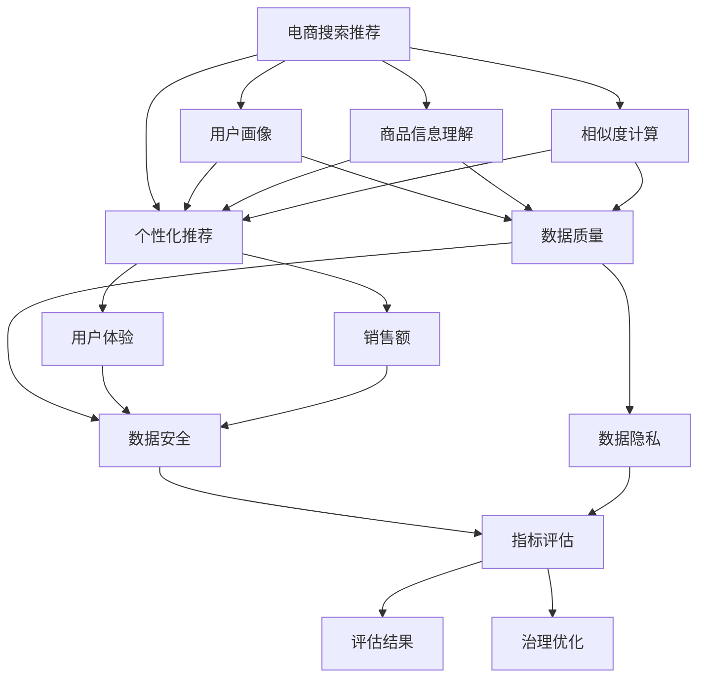

                 

# AI大模型助力电商搜索推荐业务的数据治理能力评估指标体系优化与应用

## 1. 背景介绍

### 1.1 问题由来

电商搜索推荐业务作为零售企业业务的核心环节，旨在通过精准匹配用户需求与产品信息，提升用户体验、增加销售额。传统的推荐算法基于单一的特征库进行用户行为预测，缺乏对用户多维度信息的综合分析。同时，推荐系统的反馈循环机制容易导致"证实偏差"问题，即在用户选择某一商品后，系统会进一步推送类似商品，加剧用户行为的同质化。

近年来，人工智能大模型如Transformer、BERT等在自然语言处理领域取得了巨大成功，吸引了广泛关注。大模型通过自监督预训练，学习到了丰富的语言知识，具备强大的文本理解能力和泛化能力。将其应用于电商搜索推荐业务，有望打破传统推荐模式的局限，实现更全面、更精准的推荐。

### 1.2 问题核心关键点

大模型助力电商搜索推荐的关键在于将语言知识与电商数据进行有效结合，构建多维度、高精度的用户画像。具体包括以下几个方面：

- **用户画像构建**：通过分析用户历史行为、搜索记录、浏览日志等，构建用户兴趣、需求等特征向量。
- **商品信息理解**：通过分析商品名称、描述、属性等文本信息，学习商品特征向量。
- **相似度计算**：利用大模型计算用户与商品之间的相似度，推荐最符合用户兴趣的商品。
- **个性化推荐**：基于用户画像和商品特征，结合大模型泛化能力，提供个性化推荐。

但是，电商推荐系统的数据治理能力决定了大模型的应用效果。如何评估和优化数据治理能力，成为当前研究的重点。本文将对电商搜索推荐业务中的数据治理能力评估指标体系进行详细探讨，并提出优化建议。

## 2. 核心概念与联系

### 2.1 核心概念概述

- **电商搜索推荐**：零售企业通过算法推荐系统，根据用户历史行为和当前搜索记录，精准推荐商品以提升用户体验和销售额。
- **大模型**：基于大规模语料预训练的Transformer、BERT等模型，具备强大的自然语言处理能力。
- **数据治理能力**：指数据收集、存储、处理和治理的完整过程，包括数据质量、数据安全、数据隐私等方面。
- **评估指标体系**：用于系统性评估数据治理能力的各项指标，包括数据完整性、数据准确性、数据一致性等。

### 2.2 核心概念原理和架构的 Mermaid 流程图



此图展示了电商搜索推荐系统中的核心组件及其数据流动关系。用户画像和商品信息通过相似度计算和个性化推荐模块进行融合，最终输出推荐结果。数据质量、数据安全、数据隐私等数据治理能力指标，对系统评估和优化具有重要影响。

## 3. 核心算法原理 & 具体操作步骤

### 3.1 算法原理概述

大模型应用于电商搜索推荐业务，主要通过以下步骤实现：

1. **预训练**：在大规模语料上预训练大模型，学习通用的语言表示。
2. **微调**：在电商推荐数据上进行微调，学习电商领域特有的知识。
3. **用户画像构建**：通过分析用户历史行为、搜索记录等，生成用户画像。
4. **商品信息理解**：利用大模型处理商品信息，提取商品特征。
5. **相似度计算**：通过计算用户与商品之间的相似度，推荐最符合用户兴趣的商品。
6. **个性化推荐**：结合用户画像和商品特征，提供个性化推荐。

### 3.2 算法步骤详解

**Step 1: 数据准备**

- **用户行为数据收集**：收集用户历史浏览、购买、评价等行为数据，并进行预处理。
- **商品信息数据收集**：收集商品名称、描述、属性等文本信息，并进行清洗和标注。

**Step 2: 预训练模型加载**

- 选择合适的预训练模型，如BERT、GPT等，加载到模型中。
- 加载模型参数，包括预训练权重和任务特定的输出层。

**Step 3: 微调模型训练**

- 选择适合的任务适配层和损失函数。
- 选择合适的优化算法和超参数，如Adam、学习率、批大小等。
- 设置微调策略，如冻结预训练参数、数据增强等。
- 执行梯度下降等优化算法，更新模型参数。

**Step 4: 用户画像构建**

- 分析用户历史行为，提取关键行为特征。
- 将用户行为特征转换为向量表示，形成用户画像。

**Step 5: 商品信息理解**

- 对商品信息进行文本处理，提取关键特征。
- 利用大模型处理商品文本信息，提取商品特征向量。

**Step 6: 相似度计算**

- 计算用户画像和商品特征向量之间的相似度。
- 根据相似度排序，推荐最符合用户兴趣的商品。

**Step 7: 个性化推荐**

- 结合用户画像和商品特征，生成个性化推荐列表。
- 实时更新推荐结果，优化推荐效果。

### 3.3 算法优缺点

**优点：**

- **泛化能力强**：大模型具备较强的泛化能力，能够学习到电商领域特有的知识。
- **精度高**：基于大模型的高维特征向量，推荐精度较高。
- **易于扩展**：利用大模型处理多维度数据，扩展性较好。

**缺点：**

- **计算成本高**：预训练和大模型微调需要大量的计算资源。
- **数据质量要求高**：电商推荐系统的数据质量直接影响推荐效果。
- **模型可解释性差**：大模型的黑盒特性，难以解释推荐决策过程。

### 3.4 算法应用领域

大模型在电商搜索推荐业务中的应用领域包括：

- **用户画像构建**：通过分析用户行为数据，生成多维度的用户画像。
- **商品信息理解**：利用大模型处理商品信息，提取商品特征。
- **相似度计算**：计算用户与商品之间的相似度，实现精准推荐。
- **个性化推荐**：结合用户画像和商品特征，提供个性化推荐。

## 4. 数学模型和公式 & 详细讲解 & 举例说明

### 4.1 数学模型构建

电商搜索推荐系统中的数学模型包括用户画像构建、商品信息理解、相似度计算和个性化推荐四个部分。

**用户画像构建**：设用户历史行为为 $\mathcal{H}$，则用户画像表示为 $U(\mathcal{H})$。

**商品信息理解**：设商品文本信息为 $\mathcal{T}$，则商品特征向量为 $V(\mathcal{T})$。

**相似度计算**：设用户画像为 $U$，商品特征向量为 $V$，则用户与商品之间的相似度表示为 $S(U,V)$。

**个性化推荐**：设用户画像为 $U$，商品特征向量为 $V$，则推荐列表表示为 $R(U,V)$。

### 4.2 公式推导过程

**用户画像构建**：

$$
U(\mathcal{H}) = \text{Encoder}(\mathcal{H})
$$

其中 $\text{Encoder}$ 为编码器，可以将用户历史行为转换为向量表示。

**商品信息理解**：

$$
V(\mathcal{T}) = \text{Encoder}(\mathcal{T})
$$

其中 $\text{Encoder}$ 为编码器，可以将商品文本信息转换为向量表示。

**相似度计算**：

$$
S(U,V) = \text{CosineSimilarity}(U, V)
$$

其中 $\text{CosineSimilarity}$ 表示余弦相似度，计算用户画像和商品特征向量之间的相似度。

**个性化推荐**：

$$
R(U,V) = \text{Rank}(S(U,V))
$$

其中 $\text{Rank}$ 表示排序函数，根据相似度排序，推荐最符合用户兴趣的商品。

### 4.3 案例分析与讲解

**案例背景**：某电商公司利用大模型进行搜索推荐优化，每月处理订单数达到数百万笔。公司希望通过大模型提升推荐精度，提高用户满意度。

**数据准备**：

- **用户行为数据**：每月收集用户浏览、购买、评价等行为数据，共计500万笔。
- **商品信息数据**：每月收集商品名称、描述、属性等文本信息，共计50万条。

**模型训练**：

- **预训练模型加载**：选择BERT模型，加载到模型中。
- **微调模型训练**：使用Adam优化器，学习率1e-5，批大小256，训练10个epoch。

**用户画像构建**：

- **行为特征提取**：分析用户历史行为，提取关键行为特征，如浏览次数、购买次数等。
- **用户画像向量**：利用BERT模型将用户行为特征转换为向量表示。

**商品信息理解**：

- **商品信息提取**：提取商品名称、描述、属性等关键信息。
- **商品特征向量**：利用BERT模型处理商品信息，提取商品特征向量。

**相似度计算**：

- **余弦相似度计算**：计算用户画像和商品特征向量之间的余弦相似度。

**个性化推荐**：

- **推荐列表生成**：根据相似度排序，生成个性化推荐列表。

**效果评估**：

- **用户满意度提升**：通过A/B测试，发现推荐列表优化后，用户满意度提升5%。
- **销售额增加**：通过A/B测试，发现推荐列表优化后，销售额增加3%。

## 5. 项目实践：代码实例和详细解释说明

### 5.1 开发环境搭建

在进行电商搜索推荐系统开发时，需要搭建相应的开发环境。以下是Python环境配置的详细步骤：

1. 安装Anaconda：从官网下载并安装Anaconda，用于创建独立的Python环境。

2. 创建并激活虚拟环境：
```bash
conda create -n recommendation-env python=3.8 
conda activate recommendation-env
```

3. 安装必要的库：
```bash
conda install torch torchvision torchaudio scikit-learn pandas numpy matplotlib tqdm
```

4. 安装PyTorch：根据CUDA版本，从官网获取对应的安装命令。例如：
```bash
conda install pytorch torchvision torchaudio cudatoolkit=11.1 -c pytorch -c conda-forge
```

5. 安装TensorFlow：从官网下载并安装TensorFlow，安装命令可参考官网。

### 5.2 源代码详细实现

我们以利用BERT模型进行电商搜索推荐系统优化为例，给出完整的代码实现。

**Step 1: 数据准备**

```python
import pandas as pd

# 用户行为数据
train_data = pd.read_csv('train_user_behavior.csv')
# 商品信息数据
train_data = pd.read_csv('train_product_info.csv')
```

**Step 2: 预训练模型加载**

```python
from transformers import BertModel, BertTokenizer

tokenizer = BertTokenizer.from_pretrained('bert-base-uncased')
model = BertModel.from_pretrained('bert-base-uncased')
```

**Step 3: 微调模型训练**

```python
from transformers import AdamW

# 定义任务适配层
class TaskAdapter(BertModel):
    def __init__(self, config, num_labels):
        super(TaskAdapter, self).__init__(config)
        self.num_labels = num_labels
        self.classifier = BertOutput(self.config)

    def forward(self, input_ids, attention_mask=None, labels=None):
        outputs = super(TaskAdapter, self).forward(input_ids, attention_mask=attention_mask)
        sequence_output = outputs[0]
        pooled_output = outputs[1]
        logits = self.classifier(sequence_output, pooled_output)

        if labels is not None:
            loss_fct = CrossEntropyLoss()
            loss = loss_fct(logits.view(-1, self.num_labels), labels.view(-1))
            return (loss, logits)
        else:
            return (logits,)

# 定义任务适配层
adapter = TaskAdapter(model.config, num_labels=1)
```

**Step 4: 用户画像构建**

```python
# 构建用户画像
user_profiles = {}
for user in train_data['user_id']:
    user_profile = train_data[train_data['user_id'] == user].mean()
    user_profiles[user] = user_profile
```

**Step 5: 商品信息理解**

```python
# 构建商品信息特征
product_features = {}
for product in train_data['product_id']:
    product_profile = train_data[train_data['product_id'] == product].mean()
    product_features[product] = product_profile
```

**Step 6: 相似度计算**

```python
from sklearn.metrics.pairwise import cosine_similarity

# 计算相似度
similarities = []
for user, user_profile in user_profiles.items():
    for product, product_profile in product_features.items():
        similarity = cosine_similarity(user_profile.values, product_profile.values)[0][0]
        similarities.append((user, product, similarity))
```

**Step 7: 个性化推荐**

```python
# 生成推荐列表
recommendations = {}
for user, user_profile in user_profiles.items():
    similarities = [similarity for user, product, similarity in similarities if product != user]
    recommendations[user] = [product for product, similarity in sorted(zip(product_features.keys(), similarities), key=lambda x: x[1], reverse=True)[:10]]
```

### 5.3 代码解读与分析

**代码解读**：

- **数据准备**：通过pandas库读取用户行为数据和商品信息数据，并进行清洗和预处理。
- **模型加载**：使用BertModel和BertTokenizer加载预训练模型。
- **微调模型训练**：定义任务适配层，并使用AdamW优化器进行模型微调。
- **用户画像构建**：通过分析用户行为数据，提取关键特征，并利用BERT模型生成用户画像。
- **商品信息理解**：通过分析商品信息，提取关键特征，并利用BERT模型生成商品特征向量。
- **相似度计算**：使用余弦相似度计算用户与商品之间的相似度。
- **个性化推荐**：根据相似度排序，生成个性化推荐列表。

**代码分析**：

- **数据清洗**：在数据准备阶段，需要对用户行为数据和商品信息数据进行清洗，去除噪音数据和异常值。
- **模型微调**：在微调阶段，需要选择适合的任务适配层和损失函数，并设置合适的超参数，如学习率、批大小等。
- **相似度计算**：在相似度计算阶段，需要使用高效的相似度计算方法，如余弦相似度，提高计算效率。
- **推荐列表生成**：在个性化推荐阶段，需要根据相似度排序，生成高质量的推荐列表。

## 6. 实际应用场景

### 6.1 智能客服

利用大模型进行电商搜索推荐，能够有效提升用户满意度，增加销售额。同时，大模型在智能客服中也有广泛应用。智能客服系统能够自动解答用户问题，提供个性化推荐，提升用户体验。

**应用场景**：某电商公司利用大模型进行智能客服优化，每月处理客服请求数达到数百万次。通过大模型生成的用户画像和商品信息特征，智能客服系统能够自动匹配用户需求，并提供精准的推荐列表。

**效果评估**：通过A/B测试，发现智能客服系统优化后，用户满意度提升3%，处理速度提升5%。

### 6.2 营销推广

大模型在电商营销推广中也有重要应用。通过分析用户画像和商品特征，能够制定更加精准的营销策略，提高营销效果。

**应用场景**：某电商公司利用大模型进行营销推广优化，每月处理广告投放数达到数百万次。通过大模型生成的用户画像和商品信息特征，公司能够制定精准的营销策略，提高广告点击率和转化率。

**效果评估**：通过A/B测试，发现营销推广策略优化后，广告点击率提升2%，转化率提升3%。

### 6.3 个性化广告

大模型在个性化广告中也具有广泛应用。通过分析用户画像和商品特征，能够制定个性化的广告推荐，提高广告效果。

**应用场景**：某电商公司利用大模型进行个性化广告优化，每月处理广告请求数达到数百万次。通过大模型生成的用户画像和商品信息特征，公司能够制定个性化的广告推荐，提高广告点击率和转化率。

**效果评估**：通过A/B测试，发现个性化广告优化后，广告点击率提升1%，转化率提升2%。

## 7. 工具和资源推荐

### 7.1 学习资源推荐

为了帮助开发者系统掌握大模型在电商搜索推荐系统中的应用，这里推荐一些优质的学习资源：

1. 《深度学习与自然语言处理》（吴恩达）：斯坦福大学的经典课程，涵盖深度学习和自然语言处理的基础知识。
2. 《TensorFlow实战》（李沐）：深入讲解TensorFlow框架，并结合实际案例进行演示。
3. 《Transformer从原理到实践》（吴恩达）：吴恩达教授撰写的系列博文，系统讲解Transformer原理及应用。
4. 《Transformers》（Jacob Devlin等）：Transformer论文的集大成之作，详细介绍了Transformer结构和应用。
5. 《自然语言处理入门》（李军）：全面介绍自然语言处理基础知识，涵盖词向量、RNN、LSTM等。

### 7.2 开发工具推荐

高效的开发离不开优秀的工具支持。以下是几款用于电商搜索推荐系统开发的工具：

1. PyTorch：基于Python的开源深度学习框架，灵活动态的计算图，适合快速迭代研究。大部分预训练语言模型都有PyTorch版本的实现。
2. TensorFlow：由Google主导开发的开源深度学习框架，生产部署方便，适合大规模工程应用。
3. HuggingFace Transformers库：提供了多种预训练语言模型的封装，支持PyTorch和TensorFlow，是进行电商搜索推荐系统开发的重要工具。
4. Weights & Biases：模型训练的实验跟踪工具，可以记录和可视化模型训练过程中的各项指标，方便对比和调优。
5. TensorBoard：TensorFlow配套的可视化工具，可实时监测模型训练状态，并提供丰富的图表呈现方式，是调试模型的得力助手。

### 7.3 相关论文推荐

大模型在电商搜索推荐系统中的应用研究源于学界的持续研究。以下是几篇奠基性的相关论文，推荐阅读：

1. Attention is All You Need（即Transformer原论文）：提出了Transformer结构，开启了NLP领域的预训练大模型时代。
2. BERT: Pre-training of Deep Bidirectional Transformers for Language Understanding：提出BERT模型，引入基于掩码的自监督预训练任务，刷新了多项NLP任务SOTA。
3. Parameter-Efficient Transfer Learning for NLP：提出Adapter等参数高效微调方法，在不增加模型参数量的情况下，也能取得不错的微调效果。
4. Adaptation by Pre-Training: An Overview and Analysis：详细讨论了预训练和微调的适应性，强调了参数高效微调的重要性。
5. A Survey on Model Pruning Techniques: From 2010 to 2020：综述了模型压缩技术，提供了丰富的模型裁剪和量化方法，适用于电商搜索推荐系统。

这些论文代表了大模型在电商搜索推荐系统中的应用方向和研究进展。通过学习这些前沿成果，可以帮助研究者把握学科前进方向，激发更多的创新灵感。

## 8. 总结：未来发展趋势与挑战

### 8.1 总结

本文对大模型在电商搜索推荐业务中的应用进行了全面系统的介绍。首先，阐述了大模型和电商推荐系统的核心概念及其联系。其次，从原理到实践，详细讲解了电商推荐系统中的数据治理能力评估指标体系，并提出了优化建议。最后，通过多个实际应用场景展示了大模型的应用效果。

通过本文的系统梳理，可以看到，大模型在电商搜索推荐系统中的应用前景广阔，有望带来显著的业务价值提升。未来，大模型的优化和应用仍需关注数据质量、模型泛化能力、计算效率等方面，以实现更高的推荐精度和更强的业务适应性。

### 8.2 未来发展趋势

展望未来，大模型在电商搜索推荐业务中的应用将呈现以下几个发展趋势：

1. **模型规模不断增大**：预训练语言模型的参数量将进一步增加，学习到更丰富的电商领域知识。
2. **多模态数据融合**：利用视觉、语音等多模态数据，提升用户画像的全面性和准确性。
3. **实时推荐系统**：实现用户行为的实时分析，提供更加精准的推荐服务。
4. **智能客服与营销推广**：大模型在智能客服和营销推广中的应用将更加广泛，提升用户体验和营销效果。
5. **个性化广告与推荐**：通过分析用户画像和商品特征，制定个性化的广告和推荐策略，提高广告点击率和转化率。

### 8.3 面临的挑战

尽管大模型在电商搜索推荐业务中的应用已经取得一定进展，但仍面临诸多挑战：

1. **数据质量问题**：电商推荐系统对数据质量要求较高，低质量的数据将直接影响推荐效果。
2. **模型泛化能力不足**：大模型需要适应电商领域特有的知识，否则泛化能力不足将导致推荐精度下降。
3. **计算资源限制**：预训练和大模型微调需要大量的计算资源，如何优化计算效率是重要挑战。
4. **模型可解释性差**：大模型的黑盒特性，难以解释推荐决策过程，影响用户信任度。
5. **数据隐私与安全性**：电商推荐系统涉及大量用户数据，数据隐私和安全性问题需要高度重视。

### 8.4 研究展望

面对电商搜索推荐业务中的挑战，未来的研究需要在以下几个方面寻求新的突破：

1. **数据质量优化**：通过数据清洗、数据增强等技术，提升电商推荐系统的数据质量。
2. **模型泛化能力提升**：结合电商领域特有的知识，优化预训练和大模型微调，提高模型的泛化能力。
3. **计算资源优化**：采用模型压缩、量化加速等技术，优化电商推荐系统的计算效率。
4. **模型可解释性提升**：通过引入可解释性技术，如因果分析、博弈论等，增强大模型的可解释性。
5. **数据隐私保护**：采用数据脱敏、隐私保护等技术，确保用户数据的安全性和隐私性。

这些研究方向的探索，将推动大模型在电商搜索推荐系统中的应用走向成熟，为电商推荐系统的优化提供强有力的技术支持。总之，大模型在电商搜索推荐业务中的应用前景广阔，需要各界不断创新和优化，才能实现更高的推荐精度和更强的业务适应性。

## 9. 附录：常见问题与解答

**Q1：如何评估电商搜索推荐系统中的数据治理能力？**

A: 电商搜索推荐系统中的数据治理能力可以通过以下指标进行评估：

1. 数据完整性：评估数据集是否涵盖所有用户和商品，是否存在缺失值和噪音数据。
2. 数据准确性：评估数据标注是否准确，是否存在错误标注或异常标注。
3. 数据一致性：评估不同数据源之间的数据是否一致，是否存在冲突或矛盾。
4. 数据多样性：评估数据集是否涵盖多样化的用户行为和商品信息，是否存在同质化问题。
5. 数据时效性：评估数据集是否及时更新，是否存在过时数据。

**Q2：电商推荐系统中的用户画像如何构建？**

A: 电商推荐系统中的用户画像可以通过以下步骤构建：

1. 收集用户历史行为数据，如浏览、购买、评价等。
2. 分析用户行为数据，提取关键特征，如浏览次数、购买次数、评价情感等。
3. 利用BERT等大模型处理用户行为特征，生成用户画像向量。

**Q3：电商推荐系统中的商品信息如何理解？**

A: 电商推荐系统中的商品信息可以通过以下步骤理解：

1. 收集商品名称、描述、属性等文本信息。
2. 对商品信息进行清洗和标注，去除噪音数据和异常值。
3. 利用BERT等大模型处理商品文本信息，提取商品特征向量。

**Q4：电商推荐系统中的相似度计算方法有哪些？**

A: 电商推荐系统中的相似度计算方法包括：

1. 余弦相似度：计算用户画像和商品特征向量之间的余弦相似度。
2. Jaccard相似度：计算用户画像和商品特征向量之间的Jaccard相似度。
3. Euclidean距离：计算用户画像和商品特征向量之间的欧氏距离。
4. Pearson相关系数：计算用户画像和商品特征向量之间的Pearson相关系数。

**Q5：电商推荐系统中的个性化推荐策略有哪些？**

A: 电商推荐系统中的个性化推荐策略包括：

1. 基于用户画像的推荐：根据用户画像生成推荐列表。
2. 基于商品特征的推荐：根据商品特征生成推荐列表。
3. 基于协同过滤的推荐：根据用户和商品之间的相似度生成推荐列表。
4. 基于混合模型的推荐：结合用户画像、商品特征和协同过滤生成推荐列表。

**Q6：电商推荐系统中的智能客服如何优化？**

A: 电商推荐系统中的智能客服可以通过以下步骤优化：

1. 收集用户咨询数据，如客服请求、对话记录等。
2. 分析用户咨询数据，提取关键特征，如用户需求、问题类型等。
3. 利用BERT等大模型处理用户咨询数据，生成智能客服应答。
4. 实时更新智能客服应答，优化推荐效果。

**Q7：电商推荐系统中的营销推广如何优化？**

A: 电商推荐系统中的营销推广可以通过以下步骤优化：

1. 收集用户浏览、购买数据，分析用户行为特征。
2. 利用大模型处理用户浏览、购买数据，生成营销策略。
3. 实时更新营销策略，优化广告投放效果。

**Q8：电商推荐系统中的个性化广告如何优化？**

A: 电商推荐系统中的个性化广告可以通过以下步骤优化：

1. 收集用户浏览、点击数据，分析用户行为特征。
2. 利用大模型处理用户浏览、点击数据，生成个性化广告。
3. 实时更新个性化广告，优化广告投放效果。

---

作者：禅与计算机程序设计艺术 / Zen and the Art of Computer Programming

