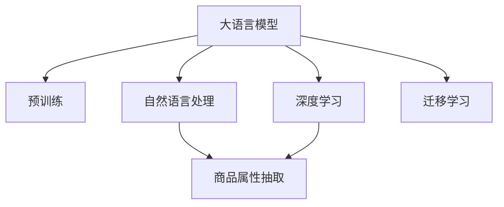

                 

# AI大模型在电商平台商品属性抽取中的应用

> 关键词：大语言模型,属性抽取,电商平台,自然语言处理,深度学习,商品推荐

## 1. 背景介绍

在当下信息爆炸的时代，电商平台已成为消费者获取商品信息的重要渠道。然而，商品信息往往分散在大量的文本描述中，如何从海量的文本数据中准确高效地抽取商品属性信息，成为电商平台运营中的一个重要问题。传统的规则提取和关键词匹配方法难以满足日益复杂多变的商品描述。随着深度学习和自然语言处理技术的兴起，基于大语言模型的商品属性抽取技术逐渐成为业内关注的焦点。本文将深入探讨大语言模型在电商平台商品属性抽取中的应用，涵盖算法原理、实践步骤、应用场景等方面，力图为电商平台的商品管理、智能推荐等业务提供强有力的技术支撑。

## 2. 核心概念与联系

### 2.1 核心概念概述

为帮助读者更好地理解大语言模型在商品属性抽取中的应用，本节将详细介绍几个关键概念：

- **大语言模型(Large Language Model, LLM)**：指基于Transformer等架构的预训练语言模型，如BERT、GPT等，通过在大规模无标签文本数据上进行预训练，学习通用的语言表示。

- **自然语言处理(Natural Language Processing, NLP)**：涉及计算机对人类语言的处理和分析，包括文本预处理、词向量表示、序列标注、文本生成等任务。

- **商品属性抽取(Product Attribute Extraction)**：指从电商平台商品描述中自动抽取属性值的过程，如尺寸、颜色、品牌等。

- **深度学习(Deep Learning)**：基于神经网络的机器学习技术，通过多层非线性变换，从大量数据中学习特征表示，适用于复杂的序列标注任务。

- **迁移学习(Transfer Learning)**：指将一个领域学习到的知识，迁移应用到另一个不同但相关的领域的学习范式，可以在少量标注数据上实现商品属性抽取。

这些概念之间的逻辑关系可以通过以下Mermaid流程图来展示：



这个流程图展示了大语言模型、自然语言处理、深度学习、商品属性抽取和迁移学习之间的关系：

1. 大语言模型通过预训练获得语言表示能力。
2. 自然语言处理技术对文本进行序列标注，提取属性信息。
3. 深度学习模型用于训练抽取模型，提高提取准确性。
4. 商品属性抽取任务在电商平台的实际应用中具有重要价值。
5. 迁移学习使模型能够跨领域应用，提升模型泛化能力。

## 3. 核心算法原理 & 具体操作步骤

### 3.1 算法原理概述

基于大语言模型的商品属性抽取，本质上是一种序列标注任务。假设有商品描述文本 $x_1,x_2,...,x_n$，其属性标签为 $y_1,y_2,...,y_n$，目标是从文本中自动抽取属性值 $y_i$。

在深度学习中，常用的模型结构为条件随机场（CRF）或序列到序列（Seq2Seq）模型。前者适用于序列标注任务，后者适用于序列生成任务。本节将重点介绍基于大语言模型的CRF模型。

**算法步骤**：
1. 预训练语言模型进行预训练。
2. 设计任务适配层，包括Word Embedding、Dropout、Linear Layer等。
3. 使用标注数据对适配层进行微调，学习属性标签与文本特征之间的映射关系。
4. 在测试集上对模型进行评估，输出商品属性信息。

### 3.2 算法步骤详解

#### 3.2.1 预训练语言模型

选择预训练语言模型 $M_{\theta}$，其中 $\theta$ 为预训练得到的模型参数。常用的预训练模型包括BERT、GPT等。以BERT为例，其预训练目标为预测遮掩位置，即输入文本中的某些单词被随机遮蔽，模型需预测这些单词的真实值。

#### 3.2.2 任务适配层设计

适配层的主要功能是提取文本特征，并将其映射为属性标签。设计适配层时，需考虑以下要素：

- **Word Embedding**：将输入文本 $x_i$ 转换为稠密向量 $v_i$。
- **Dropout**：防止过拟合，增强模型泛化能力。
- **Linear Layer**：将输入特征映射为属性标签 $y_i$。

### 3.3 算法优缺点

#### 3.3.1 优点

1. **高准确性**：大语言模型通过预训练学习到丰富的语言知识，能够有效提升商品属性抽取的准确性。
2. **泛化能力强**：适配层能够学习通用的特征表示，适应多种不同的商品属性抽取任务。
3. **迁移学习**：无需大量标注数据，通过迁移学习即可快速实现商品属性抽取。
4. **算法简单**：CRF模型计算简单，易于实现和优化。

#### 3.3.2 缺点

1. **依赖标注数据**：尽管迁移学习有助于降低标注成本，但部分任务仍需一定量的标注数据进行微调。
2. **计算资源要求高**：预训练语言模型和适配层都需要较高的计算资源。
3. **解释性不足**：模型输出结果缺乏可解释性，难以解释其推理逻辑。

### 3.4 算法应用领域

大语言模型在电商平台商品属性抽取中的应用，主要体现在以下几方面：

1. **商品管理**：电商平台需要对海量商品进行精细化管理，自动抽取商品属性信息可以大幅提升管理效率。
2. **智能推荐**：根据用户历史行为和商品属性信息，模型能够更精准地推荐相关商品，提升用户体验。
3. **搜索结果优化**：对商品描述进行属性抽取，并匹配查询关键词，可以提高搜索结果的相关性和准确性。
4. **运营分析**：分析商品属性信息，发现销售趋势和用户偏好，为运营决策提供数据支撑。

## 4. 数学模型和公式 & 详细讲解

### 4.1 数学模型构建

假设输入文本 $x_i$ 长度为 $n$，其属性标签为 $y_i \in \{0,1\}$，表示文本是否包含属性 $x_i$。将商品描述 $x_i$ 转换为稠密向量 $v_i$，适配层为 $H(v_i)$，输出属性标签 $y_i$。适配层的输出为 $H(v_i)W+b$，其中 $W$ 为线性变换的权重，$b$ 为偏置项。

### 4.2 公式推导过程

设 $h_i = H(v_i)W+b$，则属性标签 $y_i$ 的条件概率为：

$$
p(y_i=1|h_i) = \sigma(h_i)
$$

其中 $\sigma$ 为Sigmoid函数，用于将输出映射到 $[0,1]$ 区间，表示文本 $x_i$ 是否包含属性 $y_i$。整个模型的输出为：

$$
p(y|X) = \prod_{i=1}^{n} p(y_i|h_i)
$$

### 4.3 案例分析与讲解

以电商平台上的一件T恤为例，其商品描述为："休闲风格，纯棉面料，尺码L，颜色黑色"。模型首先对商品描述进行Word Embedding，得到稠密向量 $v$。适配层的输出为 $H(v)W+b$，经Sigmoid函数映射为属性标签 $y_1,y_2,...,y_n$，表示每个属性是否在商品描述中出现。

在训练过程中，模型通过标注数据 $(x_i,y_i)$ 学习适配层参数，使得输出与真实标签一致。在测试阶段，对新的商品描述 $x'$ 进行Word Embedding和适配层计算，得到属性标签 $y'$。

## 5. 项目实践：代码实例和详细解释说明

### 5.1 开发环境搭建

在进行项目实践前，需要准备好开发环境。以下是使用Python进行PyTorch开发的环境配置流程：

1. 安装Anaconda：从官网下载并安装Anaconda，用于创建独立的Python环境。

2. 创建并激活虚拟环境：
```bash
conda create -n pytorch-env python=3.8 
conda activate pytorch-env
```

3. 安装PyTorch：根据CUDA版本，从官网获取对应的安装命令。例如：
```bash
conda install pytorch torchvision torchaudio cudatoolkit=11.1 -c pytorch -c conda-forge
```

4. 安装Transformers库：
```bash
pip install transformers
```

5. 安装各类工具包：
```bash
pip install numpy pandas scikit-learn matplotlib tqdm jupyter notebook ipython
```

完成上述步骤后，即可在`pytorch-env`环境中开始项目开发。

### 5.2 源代码详细实现

下面以商品属性抽取为例，给出使用Transformers库对BERT模型进行属性抽取的PyTorch代码实现。

```python
from transformers import BertTokenizer, BertForTokenClassification, AdamW
import torch
import numpy as np

# 加载预训练模型和分词器
model_name = 'bert-base-uncased'
tokenizer = BertTokenizer.from_pretrained(model_name)
model = BertForTokenClassification.from_pretrained(model_name)

# 定义训练函数
def train_epoch(model, data_loader, optimizer):
    model.train()
    epoch_loss = 0
    for batch in data_loader:
        input_ids = batch['input_ids'].to(device)
        attention_mask = batch['attention_mask'].to(device)
        labels = batch['labels'].to(device)
        model.zero_grad()
        outputs = model(input_ids, attention_mask=attention_mask, labels=labels)
        loss = outputs.loss
        epoch_loss += loss.item()
        loss.backward()
        optimizer.step()
    return epoch_loss / len(data_loader)

# 定义评估函数
def evaluate(model, data_loader):
    model.eval()
    preds, labels = [], []
    with torch.no_grad():
        for batch in data_loader:
            input_ids = batch['input_ids'].to(device)
            attention_mask = batch['attention_mask'].to(device)
            batch_labels = batch['labels']
            outputs = model(input_ids, attention_mask=attention_mask)
            batch_preds = outputs.logits.argmax(dim=2).to('cpu').tolist()
            batch_labels = batch_labels.to('cpu').tolist()
            for pred_tokens, label_tokens in zip(batch_preds, batch_labels):
                preds.append(pred_tokens[:len(label_tokens)])
                labels.append(label_tokens)
    return preds, labels

# 加载数据集
train_dataset = # 训练集数据
dev_dataset = # 验证集数据
test_dataset = # 测试集数据

# 定义数据预处理函数
def preprocess(text):
    tokens = tokenizer.tokenize(text)
    tokens = [tokenizer.convert_tokens_to_ids(token) for token in tokens]
    tokens = [0] + tokens + [0]
    attention_mask = [1] * len(tokens)
    return {'token_type_ids': np.zeros(len(tokens)), 'input_ids': np.array(tokens), 'attention_mask': np.array(attention_mask)}

# 定义模型训练和评估
device = torch.device('cuda') if torch.cuda.is_available() else torch.device('cpu')
model.to(device)

train_loader = torch.utils.data.DataLoader(train_dataset, batch_size=16, shuffle=True)
dev_loader = torch.utils.data.DataLoader(dev_dataset, batch_size=16)
test_loader = torch.utils.data.DataLoader(test_dataset, batch_size=16)

optimizer = AdamW(model.parameters(), lr=2e-5)
num_epochs = 5

for epoch in range(num_epochs):
    train_loss = train_epoch(model, train_loader, optimizer)
    print(f'Epoch {epoch+1}, train loss: {train_loss:.3f}')
    
    dev_loss, dev_acc = evaluate(model, dev_loader)
    print(f'Epoch {epoch+1}, dev loss: {dev_loss:.3f}, dev acc: {dev_acc:.3f}')
    
print('Test results:')
test_loss, test_acc = evaluate(model, test_loader)
print(f'Test loss: {test_loss:.3f}, test acc: {test_acc:.3f}')
```

### 5.3 代码解读与分析

让我们再详细解读一下关键代码的实现细节：

**preprocess函数**：
- 将商品描述转换为分词后的序列，并进行编码。
- 为序列添加[CLS]、[SEP]标记，方便模型识别输入和输出。

**训练函数train_epoch**：
- 在每个batch中，将输入文本和标签输入模型，计算损失函数。
- 反向传播更新模型参数，最小化损失函数。
- 在每个epoch结束时，计算平均损失。

**评估函数evaluate**：
- 在测试集上，不更新模型参数，仅记录预测结果和真实标签。
- 返回所有样本的预测结果和真实标签。

**训练和评估循环**：
- 对模型进行多次迭代训练，在每个epoch结束时评估模型性能。
- 记录训练集和验证集的损失和准确率，并在测试集上最终评估模型效果。

**模型保存和部署**：
- 在训练完成后，可以将模型保存为PyTorch模型文件，方便后续使用。
- 使用Flask等Web框架，将模型封装为RESTful API接口，提供实时预测服务。

通过代码实现，可以看出，使用PyTorch和Transformers库可以高效实现基于BERT模型的商品属性抽取。开发者可以根据实际需求，进一步优化模型结构和训练参数，提升商品属性抽取的准确性和鲁棒性。

## 6. 实际应用场景

### 6.1 智能推荐系统

基于大语言模型的商品属性抽取，可以应用于智能推荐系统的构建。传统的推荐系统往往仅考虑用户的历史行为，无法深入理解商品的属性信息。通过属性抽取，推荐系统可以更全面地分析商品特征，提升推荐效果。

在技术实现上，可以收集用户浏览、点击、评论等行为数据，提取商品描述中的属性信息。利用商品属性抽取模型，为每个商品打上属性标签，再结合用户画像和历史行为，生成更精准的推荐结果。

### 6.2 搜索引擎优化

在电商平台上，用户往往通过搜索词来查找商品。如果搜索结果中包含详细的属性信息，能够更精准地匹配用户需求。利用商品属性抽取模型，对商品描述进行分析，提取属性信息，并将其与查询关键词匹配，可以提高搜索结果的相关性和准确性。

具体实现时，可以对每个商品描述进行属性抽取，建立属性-关键词的映射关系，在查询时根据映射关系生成推荐商品列表。

### 6.3 运营数据分析

电商平台需要对商品销售数据进行详细的分析，了解用户偏好和销售趋势。通过商品属性抽取，可以提取每个商品的属性信息，进行统计分析，发现商品的特征和使用情况。

例如，可以对热销商品的常用属性进行统计，分析不同属性的销售情况，为商品管理提供数据支撑。

### 6.4 未来应用展望

未来，大语言模型在商品属性抽取中的应用将更加广泛，涵盖更多领域和场景：

1. **多模态属性抽取**：除文本属性抽取外，可以扩展到图像、视频等模态数据的属性抽取。通过多模态信息融合，提升商品属性的丰富性和准确性。
2. **动态属性更新**：商品属性可能随时间发生变化，利用属性抽取模型，自动更新商品描述中的属性信息，保持数据的时效性。
3. **跨领域属性抽取**：不同领域的商品可能具有相似的特征，利用跨领域属性抽取，提升模型在不同领域的泛化能力。
4. **增强模型解释性**：利用可解释性技术，对模型输出进行解释，让用户更清楚地理解推荐逻辑，增强用户信任。

这些趋势将使大语言模型在电商平台的应用更加深入和广泛，提升平台的服务质量和用户体验。

## 7. 工具和资源推荐

### 7.1 学习资源推荐

为了帮助开发者系统掌握大语言模型在商品属性抽取中的应用，这里推荐一些优质的学习资源：

1. 《深度学习入门：基于Python的理论与实现》书籍：系统介绍深度学习基础理论，涵盖自然语言处理、序列标注等关键技术。

2. 《自然语言处理综论》书籍：详细讲解自然语言处理的基本概念、经典模型和算法，适用于深入学习。

3. HuggingFace官方文档：提供丰富的预训练模型和代码样例，方便快速上手微调任务。

4. CS224N《深度学习自然语言处理》课程：斯坦福大学开设的NLP明星课程，提供高质量的学习资源和配套作业。

5. GitHub开源项目：包含大量商品属性抽取的代码实现和模型优化方案，可供学习参考。

通过对这些资源的学习实践，相信你一定能够快速掌握大语言模型在商品属性抽取中的应用方法，并用于解决实际的电商问题。

### 7.2 开发工具推荐

高效的开发离不开优秀的工具支持。以下是几款用于大语言模型商品属性抽取开发的常用工具：

1. PyTorch：基于Python的开源深度学习框架，支持动态图，便于快速迭代研究。

2. TensorFlow：由Google主导开发的开源深度学习框架，生产部署方便，支持自动微分和分布式训练。

3. Transformers库：HuggingFace开发的NLP工具库，集成了众多预训练语言模型，支持序列标注任务。

4. Weights & Biases：模型训练的实验跟踪工具，可以记录和可视化模型训练过程中的各项指标，方便对比和调优。

5. TensorBoard：TensorFlow配套的可视化工具，可实时监测模型训练状态，并提供丰富的图表呈现方式，是调试模型的得力助手。

合理利用这些工具，可以显著提升大语言模型在商品属性抽取任务上的开发效率，加快创新迭代的步伐。

### 7.3 相关论文推荐

大语言模型在商品属性抽取技术的发展源于学界的持续研究。以下是几篇奠基性的相关论文，推荐阅读：

1. Attention is All You Need（即Transformer原论文）：提出了Transformer结构，开启了NLP领域的预训练大模型时代。

2. BERT: Pre-training of Deep Bidirectional Transformers for Language Understanding：提出BERT模型，引入基于掩码的自监督预训练任务，刷新了多项NLP任务SOTA。

3. Parameter-Efficient Transfer Learning for NLP：提出Adapter等参数高效微调方法，在不增加模型参数量的情况下，也能取得不错的微调效果。

4. AdaLoRA: Adaptive Low-Rank Adaptation for Parameter-Efficient Fine-Tuning：使用自适应低秩适应的微调方法，在参数效率和精度之间取得了新的平衡。

这些论文代表了大语言模型在商品属性抽取技术的发展脉络。通过学习这些前沿成果，可以帮助研究者把握学科前进方向，激发更多的创新灵感。

## 8. 总结：未来发展趋势与挑战

### 8.1 研究成果总结

本文对基于大语言模型的商品属性抽取方法进行了全面系统的介绍。首先阐述了该方法在大规模商品管理、智能推荐系统、搜索引擎优化和运营数据分析中的应用背景和重要性。其次，从算法原理到实践步骤，详细讲解了大语言模型在商品属性抽取中的实现方法，包括预训练模型选择、任务适配层设计、微调步骤等。最后，展望了未来大语言模型在商品属性抽取中的发展趋势和面临的挑战。

通过本文的系统梳理，可以看到，基于大语言模型的商品属性抽取方法已经成为电商平台智能化运营的重要技术支撑，具有广阔的应用前景。

### 8.2 未来发展趋势

展望未来，大语言模型在商品属性抽取领域的发展将呈现以下几个趋势：

1. **多模态信息融合**：融合文本、图像、视频等多模态信息，提升商品属性抽取的准确性和丰富性。
2. **动态属性抽取**：利用属性抽取模型，自动更新商品描述中的属性信息，保持数据的时效性。
3. **跨领域属性抽取**：不同领域的商品可能具有相似的特征，利用跨领域属性抽取，提升模型在不同领域的泛化能力。
4. **增强模型解释性**：利用可解释性技术，对模型输出进行解释，让用户更清楚地理解推荐逻辑，增强用户信任。
5. **实时属性抽取**：在用户进行实时搜索时，利用属性抽取模型，动态生成商品属性信息，提升用户购物体验。

这些趋势将使大语言模型在商品属性抽取中的应用更加深入和广泛，进一步提升电商平台的智能化水平。

### 8.3 面临的挑战

尽管大语言模型在商品属性抽取中已经取得了显著成效，但在技术应用过程中仍面临诸多挑战：

1. **标注数据成本高**：商品属性抽取通常需要大量标注数据，获取高质量标注数据的成本较高。如何降低标注成本，是未来研究的重要方向。
2. **模型泛化能力不足**：不同商品的描述形式各异，模型难以泛化到所有场景。如何增强模型的泛化能力，提高对复杂描述的抽取准确性，仍然是一个挑战。
3. **推理速度慢**：大语言模型虽然准确性高，但推理速度较慢，难以满足实时应用的需求。如何优化推理速度，提升模型实时性，是未来研究方向之一。
4. **模型可解释性不足**：模型输出结果缺乏可解释性，难以理解其推理逻辑。如何增强模型的可解释性，使其更具透明性和可信度，是重要的研究方向。
5. **安全性问题**：模型可能学习到有害信息，输出结果可能存在安全隐患。如何加强模型安全性，保障数据和应用安全，是重要的研究方向。

这些挑战需要研究者不断探索和创新，逐步突破现有技术瓶颈，才能实现大语言模型在商品属性抽取中的应用效果。

### 8.4 研究展望

面对大语言模型在商品属性抽取领域所面临的挑战，未来的研究需要在以下几个方面寻求新的突破：

1. **无监督和半监督学习**：摆脱对大量标注数据的依赖，利用自监督学习、主动学习等方法，最大化利用非结构化数据，实现更高效的模型训练。
2. **参数高效微调**：开发更加参数高效的微调方法，减少模型参数量，提升推理速度和计算效率。
3. **多模态信息融合**：利用多模态信息融合技术，提升模型对不同模态数据的理解能力，实现更全面的属性抽取。
4. **跨领域属性抽取**：通过跨领域属性抽取，提升模型在不同领域的泛化能力，扩展应用场景。
5. **增强模型可解释性**：利用可解释性技术，对模型输出进行解释，提高模型的透明性和可信度，增强用户信任。
6. **提高模型安全性**：加强模型安全性研究，避免模型学习有害信息，保障数据和应用安全。

这些研究方向的探索，将使大语言模型在商品属性抽取技术中实现更高的性能和更广泛的应用，推动电商平台的智能化转型，为社会经济的发展注入新的动力。

## 9. 附录：常见问题与解答

**Q1：大语言模型在商品属性抽取中是否适用于所有商品描述？**

A: 大语言模型在商品属性抽取中具有较强的泛化能力，但对于一些极端复杂、离散性强的商品描述，可能难以准确抽取属性。此时需要对模型进行定制化优化，提升其在特定场景下的表现。

**Q2：大语言模型在商品属性抽取中如何进行参数高效微调？**

A: 参数高效微调（PEFT）可以通过冻结大部分预训练权重，只更新少量的任务相关参数，减少微调参数量，提高微调效率。具体方法包括使用Adapter、LoRA等参数高效微调技术，或利用迁移学习，在少量标注数据上实现高效的微调。

**Q3：大语言模型在商品属性抽取中的推理速度较慢，如何解决？**

A: 可以通过以下方法提升大语言模型的推理速度：
1. 使用推理优化技术，如GPU加速、量化、模型剪枝等，减少计算量。
2. 利用分布式训练，将模型并行化，提升推理性能。
3. 优化推理代码，减少不必要的计算和数据传输，提高推理效率。

**Q4：大语言模型在商品属性抽取中的输出结果缺乏可解释性，如何解决？**

A: 可以通过以下方法增强大语言模型的可解释性：
1. 利用可解释性技术，如LIME、SHAP等，对模型输出进行解释，分析模型决策的依据。
2. 设计更加透明的任务适配层，增加模型输出的可理解性。
3. 通过人工干预和审核，确保模型输出的合理性和安全性。

**Q5：大语言模型在商品属性抽取中如何进行多模态信息融合？**

A: 可以通过以下方法实现多模态信息融合：
1. 融合文本、图像、视频等多模态信息，建立多模态数据之间的映射关系，提升模型对多模态数据的理解能力。
2. 设计多模态融合模型，如跨模态特征融合、多模态损失函数等，增强模型的泛化能力和准确性。
3. 利用跨模态特征提取技术，提取不同模态数据的特征，并将其融合到模型中。

通过这些方法，可以使大语言模型在商品属性抽取中更好地利用多模态信息，提升模型性能和应用效果。

---

作者：禅与计算机程序设计艺术 / Zen and the Art of Computer Programming

