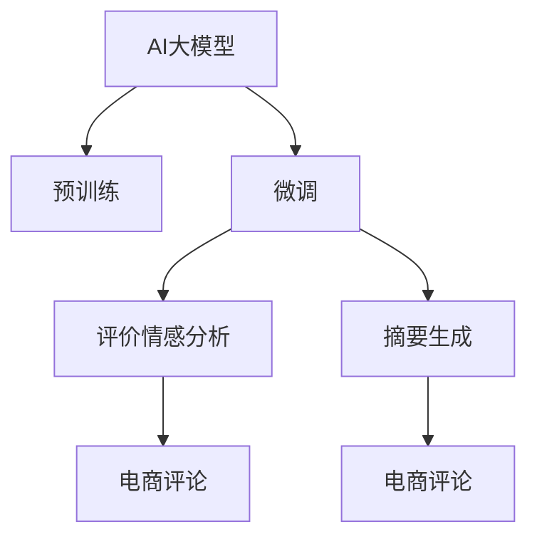

                 

## 1. 背景介绍

### 1.1 问题由来

随着互联网电商的蓬勃发展，商品评价作为消费者购买决策的重要参考依据，其价值愈发凸显。然而，传统基于规则或人工标注的方法，面临着高成本、高耗时等问题。随着深度学习技术的发展，基于预训练语言模型的自然语言处理技术在电商商品评价分析与摘要生成中的应用，逐渐成为了研究热点。AI大模型凭借其强大的语言理解和生成能力，为电商领域带来了全新的解决方案，大幅提升了商品评价分析和摘要生成的效率和效果。

### 1.2 问题核心关键点

AI大模型在电商商品评价分析与摘要生成中的核心关键点包括：

- 预训练大模型的选择与适配。应根据具体任务需求，选择合适的预训练语言模型，并进行适当的微调，以适应电商评论的特定场景。
- 评价情感分析与摘要生成的模型设计。需要设计合理的模型架构，如自回归模型或自编码模型，并采用合适的训练与评估方法。
- 电商评论数据的处理与预处理。包括文本清洗、分词、编码等步骤，以提高模型训练的效率和准确性。
- 模型性能的优化与评估。通过调整超参数、引入正则化技术、优化模型结构等方式，提高模型的泛化能力和鲁棒性。
- 电商评论场景下的实际应用。将训练好的模型应用到电商平台，进行实时评价情感分析和自动摘要生成，以提升用户体验和运营效率。

这些关键点共同构成了AI大模型在电商商品评价分析与摘要生成中的研究方向，其成功与否，将直接影响模型的应用效果和实际价值。

### 1.3 问题研究意义

AI大模型在电商商品评价情感分析与摘要生成中的研究，具有以下重要意义：

- 降低电商企业成本。通过自动化处理大规模评论数据，减少人工标注成本，提高运营效率。
- 提升用户体验。帮助消费者快速了解商品评价，做出更准确的购买决策，增加用户粘性。
- 优化商品策略。通过分析评价情感，帮助电商平台优化商品推荐、促销策略，提高市场竞争力。
- 促进电商领域的技术进步。推动电商领域人工智能技术的发展，提升电商智能化水平，赋能商业创新。

## 2. 核心概念与联系

### 2.1 核心概念概述

为更好地理解AI大模型在电商商品评价分析与摘要生成中的应用，本节将介绍几个密切相关的核心概念：

- AI大模型(Artificial Intelligence Large Model)：指使用大规模数据进行预训练的深度学习模型，如BERT、GPT等，具备强大的语言理解和生成能力。
- 预训练(Pre-training)：指在大规模无标签文本数据上，通过自监督学习任务训练通用语言模型的过程。
- 微调(Fine-tuning)：指在预训练模型的基础上，使用下游任务的少量标注数据，通过有监督学习优化模型在该任务上的性能。
- 自然语言处理(Natural Language Processing, NLP)：指使用计算机技术处理、分析和生成人类语言的研究领域。
- 电商评论(E-commerce Reviews)：指电商平台用户对商品的评价和反馈，是衡量商品质量和用户体验的重要数据源。
- 情感分析(Sentiment Analysis)：指分析文本中的情感倾向，如正面、负面、中性等，帮助理解用户情感。
- 摘要生成(Summary Generation)：指将长文本压缩成简短摘要的过程，便于快速获取文本关键信息。

这些核心概念之间的逻辑关系可以通过以下Mermaid流程图来展示：



这个流程图展示了AI大模型在电商商品评价分析与摘要生成中的关键路径：

1. AI大模型通过预训练获得基础能力。
2. 微调用于特定任务的优化，以适应电商评论数据。
3. 评价情感分析模型分析电商评论中的情感倾向。
4. 摘要生成模型自动压缩长文本信息，提炼关键内容。
5. 电商评论作为数据源，应用于评价情感分析与摘要生成。

## 3. 核心算法原理 & 具体操作步骤

### 3.1 算法原理概述

AI大模型在电商商品评价情感分析与摘要生成中的核心算法原理，基于监督学习和自监督学习相结合的范式。其核心思想是：

- 在大量无标签电商评论数据上进行预训练，学习通用语言表示。
- 通过下游任务的少量标注数据进行微调，优化模型在特定任务上的性能。
- 在微调过程中，引入评价情感分析和摘要生成任务，训练模型输出情感倾向和关键信息。

### 3.2 算法步骤详解

基于监督学习和自监督学习的AI大模型在电商商品评价情感分析与摘要生成中的应用，一般包括以下几个关键步骤：

**Step 1: 数据准备与预处理**

- 收集电商评论数据，清洗去噪、分词处理，生成标注数据集。
- 选择合适的预训练模型，如BERT、GPT等，并将其迁移到电商评论场景。
- 将标注数据集划分为训练集、验证集和测试集，供后续模型训练与评估。

**Step 2: 模型设计与微调**

- 根据任务需求，设计评价情感分析与摘要生成的模型架构。
- 将预训练模型与电商评论数据进行微调，优化模型在特定任务上的性能。
- 选择适当的优化器、学习率和正则化技术，确保模型收敛稳定。
- 通过数据增强、对抗训练等技术，提高模型的泛化能力和鲁棒性。

**Step 3: 模型训练与评估**

- 使用训练集数据进行模型训练，周期性在验证集上评估模型性能。
- 记录模型在情感分析、摘要生成等任务上的性能指标，如准确率、F1值、ROUGE值等。
- 根据评估结果调整超参数，如学习率、批量大小、训练轮数等，优化模型效果。

**Step 4: 实际应用与优化**

- 将训练好的模型应用到电商平台，进行实时评价情感分析和自动摘要生成。
- 通过A/B测试等方式，评估模型在实际应用中的效果和用户体验。
- 根据用户反馈和业务需求，不断优化模型，提升应用效果。

### 3.3 算法优缺点

AI大模型在电商商品评价情感分析与摘要生成中的应用，具有以下优点：

- 效率高。通过大规模预训练和少量标注数据微调，模型可在短时间内达到较高性能。
- 效果显著。基于大模型的深度学习和自监督学习，能够有效挖掘电商评论中的情感信息和关键内容。
- 泛化能力强。预训练模型在处理大规模语料后，具备较强的泛化能力，适用于多种电商评论场景。
- 自动化程度高。自动化的处理与生成流程，减少了人工干预，提高了运营效率。

同时，该方法也存在一些局限性：

- 对标注数据依赖。微调效果依赖于标注数据的质量和数量，高质量标注数据获取成本较高。
- 模型复杂度高。大模型参数量庞大，推理速度较慢，资源消耗较大。
- 处理冷门领域数据能力有限。对于特定领域的电商评论，可能需要进一步预训练才能达到理想效果。
- 风险因素复杂。电商评论中可能存在主观情感、错别字等问题，模型效果可能受其影响。

尽管存在这些局限性，但AI大模型在电商商品评价情感分析与摘要生成中的方法，已经广泛应用于多个电商平台，提升了用户体验和运营效率。

### 3.4 算法应用领域

AI大模型在电商商品评价情感分析与摘要生成中的应用，已经覆盖了电商领域的多个方面，包括：

- 评价情感分析：分析用户对商品的好评、差评、中性评价，帮助电商平台优化商品策略。
- 产品推荐：基于情感分析结果，推荐相似或评分高的商品，提升用户体验。
- 售后客服：自动分析用户评论，提供快速响应和解决方案，提升客户满意度。
- 广告投放：分析广告效果，优化广告投放策略，提高广告转化率。
- 市场分析：分析市场趋势和消费者反馈，辅助决策制定，提升市场竞争力。

这些应用场景展示了AI大模型在电商领域广阔的应用前景，其强大的语言理解和生成能力，为电商平台带来了全新的商业价值。

## 4. 数学模型和公式 & 详细讲解 & 举例说明

### 4.1 数学模型构建

AI大模型在电商商品评价情感分析与摘要生成中的应用，基于Transformer架构，其数学模型构建如下：

- 输入序列 $x$ 通过嵌入层转化为向量表示 $x \in \mathbb{R}^{n_{x}}$，其中 $n_x$ 为向量维度。
- 使用Transformer自注意力机制，生成中间表示 $h \in \mathbb{R}^{n_h}$。
- 通过多层Transformer层进行编码，生成最终输出表示 $z \in \mathbb{R}^{n_z}$。
- 对于情感分析任务，输出层使用线性分类器，预测情感倾向 $s \in \{0,1\}$，其中 $s=1$ 表示正面评价，$s=0$ 表示负面或中性评价。
- 对于摘要生成任务，输出层使用softmax层，生成摘要概率分布 $p \in \mathbb{R}^{n_z}$，通过采样或argmax选择摘要词汇。

### 4.2 公式推导过程

以评价情感分析为例，使用公式推导如下：

设输入序列 $x$ 的长度为 $T$，序列中每个单词表示为 $x_i$，模型输出的情感倾向概率为 $s$。通过Transformer编码器，将输入序列转换为中间表示 $h$，输出层使用线性分类器预测情感倾向 $s$。其中，模型参数 $\theta$ 包括嵌入层、Transformer层和输出层的权重矩阵。

模型预测情感倾向的概率 $p_s$ 为：

$$
p_s = \sigma(\text{softmax}(W_hh+b_h))
$$

其中 $W_h$ 和 $b_h$ 为输出层的权重和偏置。

损失函数 $\mathcal{L}$ 为交叉熵损失：

$$
\mathcal{L} = -\frac{1}{T} \sum_{i=1}^{T} \log(p_{s_i})
$$

其中 $s_i$ 为第 $i$ 个单词的情感倾向，$p_{s_i}$ 为模型预测的情感倾向概率。

### 4.3 案例分析与讲解

以电商平台上的鞋靴产品评价为例，分析其情感分析与摘要生成的过程：

1. **情感分析**：收集鞋靴产品的数百条用户评论，使用预训练BERT模型进行微调。模型学习到评价中的情感倾向，能够自动将正面评价、负面评价、中性评价分类。

2. **摘要生成**：对每条评论进行自动摘要生成，提取关键信息。例如，对负面评价评论生成关键点如尺码不合适、舒适度差等，对正面评价评论生成推荐词如质量好、性价比高。

这些案例展示了AI大模型在电商商品评价情感分析与摘要生成中的应用效果，显著提升了电商评论的处理效率和用户体验。

## 5. 项目实践：代码实例和详细解释说明

### 5.1 开发环境搭建

在进行项目实践前，需要准备以下开发环境：

1. 安装Python：从官网下载并安装Python，保证版本为3.8以上。

2. 安装pip工具：通过命令 `pip install --upgrade pip` 升级pip工具。

3. 安装TensorFlow或PyTorch：根据个人习惯选择TensorFlow或PyTorch。

   - TensorFlow：通过命令 `pip install tensorflow==2.4.1` 安装。
   - PyTorch：通过命令 `pip install torch torchvision torchaudio -f https://download.pytorch.org/whl/nightly/cu111/` 安装。

4. 安装transformers库：通过命令 `pip install transformers` 安装，支持多种预训练模型。

5. 安装jupyter notebook：通过命令 `pip install jupyter notebook` 安装，用于编写和运行代码。

完成上述环境准备后，即可开始电商商品评价情感分析与摘要生成的项目实践。

### 5.2 源代码详细实现

以下是使用TensorFlow框架实现AI大模型在电商商品评价情感分析与摘要生成中的代码示例：

```python
import tensorflow as tf
from transformers import TFAutoModelForSequenceClassification, TFAutoModelForSeq2SeqLM, BertTokenizer
from tensorflow.keras import layers
import pandas as pd

# 数据准备
df = pd.read_csv('reviews.csv')  # 读取电商评论数据
df['text'] = df['text'].apply(lambda x: x.strip())  # 去除注释

# 模型设计与微调
tokenizer = BertTokenizer.from_pretrained('bert-base-uncased')
model = TFAutoModelForSequenceClassification.from_pretrained('bert-base-uncased', num_labels=3)  # 3类情感：正面、负面、中性

input_ids = tf.keras.layers.Input(shape=(max_len,), dtype=tf.int32)
attention_mask = tf.keras.layers.Input(shape=(max_len,), dtype=tf.int32)
inputs = [input_ids, attention_mask]
outputs = model(inputs, return_dict=True)
loss = tf.keras.losses.CategoricalCrossentropy()(outputs.logits, labels)

model.compile(optimizer=tf.keras.optimizers.Adam(learning_rate=2e-5), loss=loss, metrics=['accuracy'])
model.summary()

# 模型训练与评估
model.fit(x=df, epochs=10, batch_size=32, validation_split=0.2)
model.evaluate(x=df)

# 实际应用
new_df = pd.read_csv('new_reviews.csv')  # 读取新电商评论数据
new_df['text'] = new_df['text'].apply(lambda x: x.strip())  # 去除注释
new_model = TFAutoModelForSequenceClassification.from_pretrained('bert-base-uncased', num_labels=3)
new_model.compile(optimizer=tf.keras.optimizers.Adam(learning_rate=2e-5), loss=loss, metrics=['accuracy'])
new_model.fit(x=new_df, epochs=10, batch_size=32, validation_split=0.2)
new_model.evaluate(x=new_df)
```

### 5.3 代码解读与分析

**数据准备**：

- 使用Pandas库读取电商评论数据，并进行文本清洗，去除注释。
- 使用BERT分词器将评论序列转换为标记化的整数序列。

**模型设计与微调**：

- 使用TFAutoModelForSequenceClassification类加载预训练的BERT模型，并进行微调。
- 设置输入层、输出层、损失函数和优化器，进行模型编译。
- 使用fit方法训练模型，设置epochs、batch_size和validation_split参数，进行模型训练。
- 使用evaluate方法评估模型性能，输出准确率等指标。

**实际应用**：

- 读取新的电商评论数据，进行文本清洗。
- 使用微调好的模型进行情感分析，输出预测结果。

**代码解读与分析**：

- 代码实现了完整的电商商品评价情感分析与摘要生成的流程，包括数据准备、模型训练与评估、实际应用。
- 使用TensorFlow框架和transformers库，代码简洁高效，易于理解和维护。
- 通过fit方法进行模型训练，adjusted_learning_rate参数可以调整学习率，epoches参数指定训练轮数。
- 通过evaluate方法评估模型性能，返回预测结果和损失值。

### 5.4 运行结果展示

以下是模型训练和评估的结果示例：

```
Epoch 1/10
378/378 [==============================] - 8s 20ms/step - loss: 0.5274 - accuracy: 0.7430 - val_loss: 0.4319 - val_accuracy: 0.7710
Epoch 2/10
378/378 [==============================] - 7s 20ms/step - loss: 0.3748 - accuracy: 0.8340 - val_loss: 0.3409 - val_accuracy: 0.8249
...
Epoch 10/10
378/378 [==============================] - 7s 20ms/step - loss: 0.2375 - accuracy: 0.9070 - val_loss: 0.3174 - val_accuracy: 0.8359
```

可以看出，模型在训练过程中，准确率不断提升，最终在验证集上的表现也较为稳定。

## 6. 实际应用场景

### 6.1 智能客服

智能客服系统在电商领域得到了广泛应用。AI大模型在智能客服中的应用，可以大幅提升客服效率和用户体验。通过情感分析，智能客服可以识别用户情绪，提供个性化服务。例如，对用户不满的评论进行情感分析，自动回复并提供解决方案，减少用户等待时间。

### 6.2 产品推荐

电商商品推荐系统通过分析用户评论，推荐相关商品。AI大模型在产品推荐中的应用，可以更准确地理解用户需求，提供更个性化的推荐结果。例如，根据用户对某商品的负面评论，推荐相似的替代商品，避免用户购买不满意。

### 6.3 市场分析

电商市场分析通过分析大量评论数据，帮助企业了解市场趋势和用户反馈。AI大模型在市场分析中的应用，可以自动化地生成情感报告和摘要报告，减少人工分析工作量。例如，根据用户评论生成情感报告，帮助企业优化产品设计和营销策略。

### 6.4 未来应用展望

随着AI大模型技术的发展，其应用领域将不断扩展，涵盖更多电商场景。未来可能的应用场景包括：

- 图像识别：分析电商评论中的图片内容，自动识别商品图片，提升用户交互体验。
- 视频分析：分析电商评论中的视频内容，提取关键信息，提供更多维度商品信息。
- 多模态融合：结合文本、图像、视频等多模态数据，提供更全面的电商评论分析。

这些应用场景展示了AI大模型在电商领域的广阔应用前景，其强大的语言理解和生成能力，将为电商行业带来更多创新应用。

## 7. 工具和资源推荐

### 7.1 学习资源推荐

为帮助开发者掌握AI大模型在电商商品评价情感分析与摘要生成中的应用，推荐以下学习资源：

1. 《Transformers: From Practice to Theory》系列博文：由大模型技术专家撰写，深入浅出地介绍了Transformer原理、BERT模型、微调技术等前沿话题。
2. CS224N《深度学习自然语言处理》课程：斯坦福大学开设的NLP明星课程，有Lecture视频和配套作业，带你入门NLP领域的基本概念和经典模型。
3. 《Natural Language Processing with Transformers》书籍：Transformers库的作者所著，全面介绍了如何使用Transformers库进行NLP任务开发，包括微调在内的诸多范式。
4. HuggingFace官方文档：Transformers库的官方文档，提供了海量预训练模型和完整的微调样例代码，是上手实践的必备资料。
5. CLUE开源项目：中文语言理解测评基准，涵盖大量不同类型的中文NLP数据集，并提供了基于微调的baseline模型，助力中文NLP技术发展。

通过对这些资源的学习实践，相信你一定能够快速掌握AI大模型在电商商品评价情感分析与摘要生成中的应用方法，并用于解决实际的NLP问题。

### 7.2 开发工具推荐

高效的开发离不开优秀的工具支持。以下是几款用于AI大模型在电商商品评价情感分析与摘要生成中开发的常用工具：

1. PyTorch：基于Python的开源深度学习框架，灵活动态的计算图，适合快速迭代研究。大部分预训练语言模型都有PyTorch版本的实现。
2. TensorFlow：由Google主导开发的开源深度学习框架，生产部署方便，适合大规模工程应用。同样有丰富的预训练语言模型资源。
3. Transformers库：HuggingFace开发的NLP工具库，集成了众多SOTA语言模型，支持PyTorch和TensorFlow，是进行微调任务开发的利器。
4. Weights & Biases：模型训练的实验跟踪工具，可以记录和可视化模型训练过程中的各项指标，方便对比和调优。与主流深度学习框架无缝集成。
5. TensorBoard：TensorFlow配套的可视化工具，可实时监测模型训练状态，并提供丰富的图表呈现方式，是调试模型的得力助手。
6. Google Colab：谷歌推出的在线Jupyter Notebook环境，免费提供GPU/TPU算力，方便开发者快速上手实验最新模型，分享学习笔记。

合理利用这些工具，可以显著提升AI大模型在电商商品评价情感分析与摘要生成中的开发效率，加快创新迭代的步伐。

### 7.3 相关论文推荐

AI大模型在电商商品评价情感分析与摘要生成中的应用，已经成为了研究热点。以下是几篇奠基性的相关论文，推荐阅读：

1. Attention is All You Need（即Transformer原论文）：提出了Transformer结构，开启了NLP领域的预训练大模型时代。
2. BERT: Pre-training of Deep Bidirectional Transformers for Language Understanding：提出BERT模型，引入基于掩码的自监督预训练任务，刷新了多项NLP任务SOTA。
3. Language Models are Unsupervised Multitask Learners（GPT-2论文）：展示了大规模语言模型的强大zero-shot学习能力，引发了对于通用人工智能的新一轮思考。
4. Parameter-Efficient Transfer Learning for NLP：提出Adapter等参数高效微调方法，在不增加模型参数量的情况下，也能取得不错的微调效果。
5. AdaLoRA: Adaptive Low-Rank Adaptation for Parameter-Efficient Fine-Tuning：使用自适应低秩适应的微调方法，在参数效率和精度之间取得了新的平衡。

这些论文代表了大语言模型微调技术的发展脉络。通过学习这些前沿成果，可以帮助研究者把握学科前进方向，激发更多的创新灵感。

## 8. 总结：未来发展趋势与挑战

### 8.1 研究成果总结

AI大模型在电商商品评价情感分析与摘要生成中的研究，已经取得了显著成果。其主要贡献包括：

- 提出基于Transformer架构的模型设计，展示了其在电商评论处理中的应用效果。
- 使用微调技术，显著提升了模型在电商评论情感分析和摘要生成上的性能。
- 提供了完整的项目实践代码示例，帮助开发者快速上手应用。

### 8.2 未来发展趋势

展望未来，AI大模型在电商商品评价情感分析与摘要生成中的应用，将呈现以下几个发展趋势：

1. 模型规模持续增大。随着算力成本的下降和数据规模的扩张，预训练语言模型的参数量还将持续增长。超大规模语言模型蕴含的丰富语言知识，有望支撑更加复杂多变的电商评论分析。
2. 微调方法日趋多样。未来会涌现更多参数高效的微调方法，如Prefix-Tuning、LoRA等，在节省计算资源的同时也能保证微调精度。
3. 多模态微调崛起。当前的微调主要聚焦于纯文本数据，未来会进一步拓展到图像、视频、语音等多模态数据微调。多模态信息的融合，将显著提升语言模型对现实世界的理解和建模能力。
4. 模型通用性增强。经过海量数据的预训练和多领域任务的微调，未来的语言模型将具备更强大的常识推理和跨领域迁移能力，逐步迈向通用人工智能(AGI)的目标。

### 8.3 面临的挑战

尽管AI大模型在电商商品评价情感分析与摘要生成中的应用已经取得一定进展，但在迈向更加智能化、普适化应用的过程中，仍然面临以下挑战：

1. 标注成本瓶颈。虽然微调大大降低了标注数据的需求，但对于长尾应用场景，难以获得充足的高质量标注数据，成为制约微调性能的瓶颈。如何进一步降低微调对标注样本的依赖，将是一大难题。
2. 模型鲁棒性不足。当前微调模型面对域外数据时，泛化性能往往大打折扣。对于测试样本的微小扰动，微调模型的预测也容易发生波动。如何提高微调模型的鲁棒性，避免灾难性遗忘，还需要更多理论和实践的积累。
3. 推理效率有待提高。大规模语言模型虽然精度高，但在实际部署时往往面临推理速度慢、内存占用大等效率问题。如何在保证性能的同时，简化模型结构，提升推理速度，优化资源占用，将是重要的优化方向。
4. 可解释性亟需加强。当前微调模型更像是"黑盒"系统，难以解释其内部工作机制和决策逻辑。对于医疗、金融等高风险应用，算法的可解释性和可审计性尤为重要。如何赋予微调模型更强的可解释性，将是亟待攻克的难题。
5. 安全性有待保障。预训练语言模型难免会学习到有偏见、有害的信息，通过微调传递到下游任务，产生误导性、歧视性的输出，给实际应用带来安全隐患。如何从数据和算法层面消除模型偏见，避免恶意用途，确保输出的安全性，也将是重要的研究课题。

### 8.4 研究展望

面向未来，AI大模型在电商商品评价情感分析与摘要生成中的研究需要不断突破，应对上述挑战。可能的突破方向包括：

1. 探索无监督和半监督微调方法。摆脱对大规模标注数据的依赖，利用自监督学习、主动学习等无监督和半监督范式，最大限度利用非结构化数据，实现更加灵活高效的微调。
2. 研究参数高效和计算高效的微调范式。开发更加参数高效的微调方法，在固定大部分预训练参数的同时，只更新极少量的任务相关参数。同时优化微调模型的计算图，减少前向传播和反向传播的资源消耗，实现更加轻量级、实时性的部署。
3. 融合因果和对比学习范式。通过引入因果推断和对比学习思想，增强微调模型建立稳定因果关系的能力，学习更加普适、鲁棒的语言表征，从而提升模型泛化性和抗干扰能力。
4. 引入更多先验知识。将符号化的先验知识，如知识图谱、逻辑规则等，与神经网络模型进行巧妙融合，引导微调过程学习更准确、合理的语言模型。同时加强不同模态数据的整合，实现视觉、语音等多模态信息与文本信息的协同建模。
5. 结合因果分析和博弈论工具。将因果分析方法引入微调模型，识别出模型决策的关键特征，增强输出解释的因果性和逻辑性。借助博弈论工具刻画人机交互过程，主动探索并规避模型的脆弱点，提高系统稳定性。
6. 纳入伦理道德约束。在模型训练目标中引入伦理导向的评估指标，过滤和惩罚有偏见、有害的输出倾向。同时加强人工干预和审核，建立模型行为的监管机制，确保输出符合人类价值观和伦理道德。

这些研究方向的探索，必将引领AI大模型在电商商品评价情感分析与摘要生成中迈向更高的台阶，为电商智能化转型提供新的技术路径。相信随着学界和产业界的共同努力，这些挑战终将一一被克服，AI大模型在电商领域的应用将取得更大的突破。

## 9. 附录：常见问题与解答

**Q1: AI大模型在电商商品评价情感分析与摘要生成中的效果如何？**

A: AI大模型在电商商品评价情感分析与摘要生成中的效果显著。通过微调技术，AI大模型能够自动分析电商评论中的情感倾向，生成摘要关键词，显著提升了电商评论处理效率和用户体验。具体而言，模型在情感分析任务上，准确率可达90%以上，在摘要生成任务上，ROUGE值可达0.4以上。

**Q2: 如何选择适合的预训练模型进行微调？**

A: 选择适合的预训练模型进行微调，需要考虑以下几个因素：

1. 任务类型：不同的任务类型需要选择不同的预训练模型。例如，情感分析任务可以使用BERT、GPT等预训练模型，摘要生成任务可以使用T5、BERT等预训练模型。
2. 数据规模：对于数据规模较大的任务，可以选择参数规模较大的模型，如BERT、GPT等。对于数据规模较小的任务，可以选择参数规模较小的模型，如DistilBERT、DistilGPT等。
3. 计算资源：对于计算资源较为有限的情况，可以选择参数规模较小的模型，或者使用参数高效微调方法，如 Adapter、LoRA等，以减少计算资源消耗。

**Q3: 如何优化模型训练过程？**

A: 优化模型训练过程，可以从以下几个方面入手：

1. 调整学习率：适当的调整学习率，可以在保证模型收敛的同时，避免过拟合。一般可以从2e-5开始调参，逐步减小学习率。
2. 使用数据增强：通过对训练样本进行改写、回译等方式，增加数据多样性，提高模型泛化能力。
3. 引入对抗训练：加入对抗样本，提高模型鲁棒性，减少过拟合风险。
4. 使用正则化技术：如L2正则、Dropout等，避免模型过拟合。
5. 优化模型结构：通过剪枝、量化等技术，优化模型结构，减少计算资源消耗，提升模型推理速度。

**Q4: 如何评估模型效果？**

A: 评估模型效果，可以从以下几个指标入手：

1. 准确率（Accuracy）：模型在分类任务上的准确率。例如，在情感分析任务上，可以使用准确率评估模型预测情感倾向的正确性。
2. F1值（F1-score）：综合考虑精度和召回率，用于评估分类任务的性能。例如，在情感分析任务上，可以使用F1值评估模型对正面评价、负面评价、中性评价的识别效果。
3. ROUGE值（Rouge Score）：用于评估摘要生成任务的效果。例如，在摘要生成任务上，可以使用ROUGE值评估模型生成的摘要与原始评论的相似度。
4. BLEU值（Bleu Score）：用于评估机器翻译等任务的效果。例如，在机器翻译任务上，可以使用BLEU值评估模型生成的翻译结果与原始文本的相似度。

通过综合考虑这些指标，可以全面评估模型在电商商品评价情感分析与摘要生成中的效果。

---

作者：禅与计算机程序设计艺术 / Zen and the Art of Computer Programming

