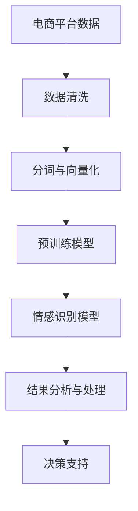

                 

# AI大模型在电商平台用户情感分析中的作用

> 关键词：用户情感分析, 电商平台, 人工智能, 情感识别, 自然语言处理, 大语言模型, 深度学习, 情感分析工具, 客户反馈

## 1. 背景介绍

随着互联网电商的迅猛发展，消费者日益成为市场中的主导力量。电商平台对用户的关注从单纯的购买行为扩展到用户的整体体验，包括产品满意度、服务质量、品牌忠诚度等方面。电商平台如何洞察用户情感，及时调整策略，提升用户体验，成为了关键问题。

AI大模型在用户情感分析中的作用，在于利用先进的深度学习技术，自动从用户的文本数据中提取情感倾向，分析用户情感，从而为电商平台提供决策支持。在如今大数据时代，利用AI大模型进行用户情感分析，能够迅速、高效地获取大量用户情感数据，为电商平台提供精准的决策支持。

## 2. 核心概念与联系

### 2.1 核心概念概述

在讨论AI大模型在用户情感分析中的应用前，首先应明确几个核心概念：

- **AI大模型**：即基于深度学习的大规模预训练语言模型，如GPT、BERT等。这些模型通过在大量无标签文本上预训练，具备强大的语言理解和生成能力。
- **用户情感分析**：通过分析用户的文本数据，判断其情感倾向，如正面、中性或负面。广泛应用于客户反馈分析、产品评价、市场调研等领域。
- **自然语言处理(NLP)**：涉及语言识别、语言理解、语言生成等技术，是AI大模型在用户情感分析中最重要的技术支撑。
- **情感识别**：利用深度学习模型识别文本中的情感信息，包括情感分类、情感极性分析、情感强度评估等。

这些概念之间紧密关联，共同构成了AI大模型在用户情感分析中的关键技术框架。

### 2.2 核心概念原理和架构的 Mermaid 流程图



这个流程图展示了用户情感分析的主要步骤：

1. **电商平台数据**：获取用户在电商平台上留下的文本数据，包括商品评价、客服聊天记录等。
2. **数据清洗**：清洗数据，去除噪音、无关信息，保证数据质量。
3. **分词与向量化**：将文本数据分词，转化为模型可以处理的向量形式。
4. **预训练模型**：使用AI大模型进行预训练，获得语言表征。
5. **情感识别模型**：在预训练模型的基础上，使用情感识别模型对用户文本进行情感分析。
6. **结果分析与处理**：对情感识别结果进行统计分析，提取有价值的情感信息。
7. **决策支持**：将情感分析结果转化为业务决策支持信息，指导电商平台运营策略调整。

## 3. 核心算法原理 & 具体操作步骤

### 3.1 算法原理概述

基于AI大模型的用户情感分析，主要基于以下算法原理：

1. **文本预处理**：将用户的文本数据进行清洗和向量化，转化为模型可以处理的形式。
2. **预训练模型**：使用大语言模型对文本进行预训练，学习通用的语言表示。
3. **情感识别模型**：在预训练模型的基础上，训练情感识别模型，对用户文本进行情感分类或情感极性分析。
4. **情感分析结果应用**：将情感分析结果转化为业务决策支持信息，用于产品优化、客服策略调整等。

### 3.2 算法步骤详解

基于AI大模型的用户情感分析流程大致可以分为以下几个步骤：

1. **数据收集与清洗**：收集电商平台的用户文本数据，并进行数据清洗，去除无关信息、噪音等。
2. **分词与向量化**：对清洗后的文本进行分词，将分词结果转化为数值向量，便于模型处理。
3. **预训练模型加载与微调**：使用大语言模型对文本进行预训练，并在少量标注数据上进行微调，优化模型在特定任务上的性能。
4. **情感识别模型训练**：在预训练模型的基础上，训练情感识别模型，对用户文本进行情感分类或情感极性分析。
5. **情感分析结果处理**：对情感识别模型输出的结果进行统计分析，提取有价值的情感信息。
6. **业务决策支持**：将情感分析结果转化为业务决策支持信息，用于指导电商平台运营策略调整。

### 3.3 算法优缺点

基于AI大模型的用户情感分析具有以下优点：

1. **高效性**：大语言模型可以通过预训练和微调，快速学习用户情感，进行高效的情感分析。
2. **鲁棒性**：大语言模型具有较强的泛化能力，能够适应不同类型的文本数据。
3. **可解释性**：大语言模型内部具有丰富的语义表示，可以进行较好的解释和溯源。

同时，该方法也存在以下缺点：

1. **高成本**：预训练和微调需要大量的计算资源和时间。
2. **数据依赖**：情感分析的效果依赖于标注数据的质量和数量，获取高质量标注数据较为困难。
3. **隐私风险**：用户文本数据涉及隐私信息，处理不当可能造成隐私泄漏。

### 3.4 算法应用领域

基于AI大模型的用户情感分析，可以在多个领域得到广泛应用，例如：

- **电商运营**：通过情感分析结果，优化产品设计和营销策略，提升用户满意度。
- **客服系统**：分析用户投诉和反馈，优化客服响应策略，提升客户服务质量。
- **市场调研**：分析消费者情感倾向，进行市场细分和用户画像构建。
- **品牌管理**：监测品牌声誉，及时处理负面情感，维护品牌形象。

## 4. 数学模型和公式 & 详细讲解

### 4.1 数学模型构建

假设用户情感分析的目标为二分类任务，即将用户文本分为正面、负面两类。设输入文本为 $x$，模型输出为 $y \in \{0,1\}$，其中 $0$ 表示负面情感，$1$ 表示正面情感。模型的目标是最大化正负样本的分类准确率。

### 4.2 公式推导过程

假设使用深度神经网络对用户文本进行情感分类，网络的输入层为 $x$，输出层为 $y$。模型的损失函数为交叉熵损失函数，定义如下：

$$
\mathcal{L}(y,\hat{y}) = -[y\log \hat{y} + (1-y)\log (1-\hat{y})]
$$

其中 $\hat{y}$ 为模型的输出，即模型对样本 $x$ 的情感分类预测结果。

模型的优化目标为最小化经验风险，即：

$$
\mathcal{L} = \frac{1}{N}\sum_{i=1}^N \mathcal{L}(y_i,\hat{y}_i)
$$

其中 $N$ 为样本数，$y_i$ 为样本 $x_i$ 的真实情感标签，$\hat{y}_i$ 为模型对样本 $x_i$ 的情感分类预测结果。

模型的参数更新公式为：

$$
\theta \leftarrow \theta - \eta \nabla_{\theta}\mathcal{L}(\theta)
$$

其中 $\eta$ 为学习率，$\nabla_{\theta}\mathcal{L}(\theta)$ 为损失函数对模型参数的梯度。

### 4.3 案例分析与讲解

以电商平台用户评价数据为例，假设我们要训练一个二分类模型来识别用户的评价情感。首先，我们将用户评价文本进行预处理，去除无关信息，进行分词，然后将其转换为模型可以处理的数值向量。接着，使用大语言模型进行预训练，获得通用的语言表示。最后，在少量标注数据上微调模型，训练一个情感分类器，对用户评价进行情感分析。

具体步骤如下：

1. **数据预处理**：将用户评价文本进行清洗和分词，转化为数值向量。
2. **预训练模型加载**：使用大语言模型对文本进行预训练，获得通用的语言表示。
3. **情感识别模型训练**：在预训练模型的基础上，训练一个情感分类器，对用户评价进行情感分类。
4. **情感分析结果处理**：对情感分类器的输出进行统计分析，提取正面评价数量、负面评价数量等信息。
5. **业务决策支持**：根据情感分析结果，优化产品设计和客服策略。

## 5. 项目实践：代码实例和详细解释说明

### 5.1 开发环境搭建

在进行用户情感分析的实践前，需要准备好开发环境。以下是使用Python进行PyTorch开发的环境配置流程：

1. 安装Anaconda：从官网下载并安装Anaconda，用于创建独立的Python环境。
2. 创建并激活虚拟环境：
```bash
conda create -n pytorch-env python=3.8 
conda activate pytorch-env
```

3. 安装PyTorch：根据CUDA版本，从官网获取对应的安装命令。例如：
```bash
conda install pytorch torchvision torchaudio cudatoolkit=11.1 -c pytorch -c conda-forge
```

4. 安装Transformers库：
```bash
pip install transformers
```

5. 安装各类工具包：
```bash
pip install numpy pandas scikit-learn matplotlib tqdm jupyter notebook ipython
```

完成上述步骤后，即可在`pytorch-env`环境中开始用户情感分析的实践。

### 5.2 源代码详细实现

下面以电商用户评价情感分析为例，给出使用Transformers库对BERT模型进行训练的PyTorch代码实现。

首先，定义情感分类数据处理函数：

```python
from transformers import BertTokenizer
from torch.utils.data import Dataset
import torch

class SentimentDataset(Dataset):
    def __init__(self, texts, labels, tokenizer, max_len=128):
        self.texts = texts
        self.labels = labels
        self.tokenizer = tokenizer
        self.max_len = max_len
        
    def __len__(self):
        return len(self.texts)
    
    def __getitem__(self, item):
        text = self.texts[item]
        label = self.labels[item]
        
        encoding = self.tokenizer(text, return_tensors='pt', max_length=self.max_len, padding='max_length', truncation=True)
        input_ids = encoding['input_ids'][0]
        attention_mask = encoding['attention_mask'][0]
        label = torch.tensor(label, dtype=torch.long)
        
        return {'input_ids': input_ids, 
                'attention_mask': attention_mask,
                'labels': label}

# 定义标签与id的映射
label2id = {1: 0, -1: 1}
id2label = {v: k for k, v in label2id.items()}

# 创建dataset
tokenizer = BertTokenizer.from_pretrained('bert-base-cased')

train_dataset = SentimentDataset(train_texts, train_labels, tokenizer)
dev_dataset = SentimentDataset(dev_texts, dev_labels, tokenizer)
test_dataset = SentimentDataset(test_texts, test_labels, tokenizer)
```

然后，定义模型和优化器：

```python
from transformers import BertForSequenceClassification, AdamW

model = BertForSequenceClassification.from_pretrained('bert-base-cased', num_labels=2)

optimizer = AdamW(model.parameters(), lr=2e-5)
```

接着，定义训练和评估函数：

```python
from torch.utils.data import DataLoader
from tqdm import tqdm
from sklearn.metrics import classification_report

device = torch.device('cuda') if torch.cuda.is_available() else torch.device('cpu')
model.to(device)

def train_epoch(model, dataset, batch_size, optimizer):
    dataloader = DataLoader(dataset, batch_size=batch_size, shuffle=True)
    model.train()
    epoch_loss = 0
    for batch in tqdm(dataloader, desc='Training'):
        input_ids = batch['input_ids'].to(device)
        attention_mask = batch['attention_mask'].to(device)
        labels = batch['labels'].to(device)
        model.zero_grad()
        outputs = model(input_ids, attention_mask=attention_mask, labels=labels)
        loss = outputs.loss
        epoch_loss += loss.item()
        loss.backward()
        optimizer.step()
    return epoch_loss / len(dataloader)

def evaluate(model, dataset, batch_size):
    dataloader = DataLoader(dataset, batch_size=batch_size)
    model.eval()
    preds, labels = [], []
    with torch.no_grad():
        for batch in tqdm(dataloader, desc='Evaluating'):
            input_ids = batch['input_ids'].to(device)
            attention_mask = batch['attention_mask'].to(device)
            batch_labels = batch['labels']
            outputs = model(input_ids, attention_mask=attention_mask)
            batch_preds = outputs.logits.argmax(dim=1).to('cpu').tolist()
            batch_labels = batch_labels.to('cpu').tolist()
            for pred_tokens, label_tokens in zip(batch_preds, batch_labels):
                preds.append(pred_tokens)
                labels.append(label_tokens)
                
    print(classification_report(labels, preds))
```

最后，启动训练流程并在测试集上评估：

```python
epochs = 5
batch_size = 16

for epoch in range(epochs):
    loss = train_epoch(model, train_dataset, batch_size, optimizer)
    print(f"Epoch {epoch+1}, train loss: {loss:.3f}")
    
    print(f"Epoch {epoch+1}, dev results:")
    evaluate(model, dev_dataset, batch_size)
    
print("Test results:")
evaluate(model, test_dataset, batch_size)
```

以上就是使用PyTorch对BERT进行电商用户评价情感分析的完整代码实现。可以看到，得益于Transformers库的强大封装，我们可以用相对简洁的代码完成BERT模型的加载和情感分析任务的开发。

### 5.3 代码解读与分析

让我们再详细解读一下关键代码的实现细节：

**SentimentDataset类**：
- `__init__`方法：初始化文本、标签、分词器等关键组件。
- `__len__`方法：返回数据集的样本数量。
- `__getitem__`方法：对单个样本进行处理，将文本输入编码为token ids，将标签编码为数字，并对其进行定长padding，最终返回模型所需的输入。

**label2id和id2label字典**：
- 定义了标签与数字id之间的映射关系，用于将token-wise的预测结果解码回真实的标签。

**训练和评估函数**：
- 使用PyTorch的DataLoader对数据集进行批次化加载，供模型训练和推理使用。
- 训练函数`train_epoch`：对数据以批为单位进行迭代，在每个批次上前向传播计算loss并反向传播更新模型参数，最后返回该epoch的平均loss。
- 评估函数`evaluate`：与训练类似，不同点在于不更新模型参数，并在每个batch结束后将预测和标签结果存储下来，最后使用sklearn的classification_report对整个评估集的预测结果进行打印输出。

**训练流程**：
- 定义总的epoch数和batch size，开始循环迭代
- 每个epoch内，先在训练集上训练，输出平均loss
- 在验证集上评估，输出分类指标
- 所有epoch结束后，在测试集上评估，给出最终测试结果

可以看到，PyTorch配合Transformers库使得情感分析任务的代码实现变得简洁高效。开发者可以将更多精力放在数据处理、模型改进等高层逻辑上，而不必过多关注底层的实现细节。

## 6. 实际应用场景

### 6.1 电商运营优化

在电商运营中，用户评价数据是重要的反馈信息，用于优化产品设计、营销策略等。通过情感分析，电商平台可以了解用户对产品的满意度，及时发现问题并进行调整。

具体而言，电商平台上存在海量用户评价数据，情感分析模型可以对这些数据进行快速处理，统计正面评价和负面评价的数量和比例。根据情感分析结果，电商平台可以：

- **产品优化**：分析负面评价，找出产品质量问题，及时进行产品改进。
- **营销策略调整**：根据正面评价，优化广告和推广策略，提高用户转化率。
- **客服策略优化**：分析用户投诉和反馈，优化客服响应策略，提升客户服务质量。

### 6.2 客户服务改进

客户服务是电商平台的重要环节，情感分析可以帮助提升客户服务质量，增强用户体验。

具体而言，通过情感分析，客服系统可以：

- **快速响应负面评价**：识别负面情感，快速响应并处理用户投诉，提升用户满意度。
- **主动引导用户**：根据用户情感倾向，自动推荐相关产品或服务，提高用户购买率。
- **智能客服对话**：分析用户对话内容，自动生成回答，提高客服效率。

### 6.3 市场调研分析

情感分析还可以应用于市场调研中，帮助电商平台了解市场趋势和用户需求。

具体而言，通过情感分析，电商平台可以：

- **市场细分**：根据不同用户的情感倾向，进行市场细分和用户画像构建。
- **产品趋势分析**：分析用户对不同产品的情感倾向，指导产品开发和营销策略。
- **品牌声誉监测**：监测品牌声誉，及时处理负面情感，维护品牌形象。

## 7. 工具和资源推荐

### 7.1 学习资源推荐

为了帮助开发者系统掌握情感分析的理论基础和实践技巧，这里推荐一些优质的学习资源：

1. 《自然语言处理入门与实战》系列博文：由大模型技术专家撰写，深入浅出地介绍了自然语言处理的基本概念和经典模型。
2. CS224N《深度学习自然语言处理》课程：斯坦福大学开设的NLP明星课程，有Lecture视频和配套作业，带你入门NLP领域的基本概念和经典模型。
3. 《深度学习与自然语言处理》书籍：全面介绍了深度学习在自然语言处理中的应用，包括情感分析在内的多个任务。
4. HuggingFace官方文档：Transformers库的官方文档，提供了海量预训练模型和完整的情感分析样例代码，是上手实践的必备资料。
5. 《情感分析技术与应用》论文：介绍了多种情感分析方法和应用场景，适合深入学习。

通过对这些资源的学习实践，相信你一定能够快速掌握情感分析的精髓，并用于解决实际的NLP问题。

### 7.2 开发工具推荐

高效的开发离不开优秀的工具支持。以下是几款用于情感分析开发的常用工具：

1. PyTorch：基于Python的开源深度学习框架，灵活动态的计算图，适合快速迭代研究。大部分预训练语言模型都有PyTorch版本的实现。
2. TensorFlow：由Google主导开发的开源深度学习框架，生产部署方便，适合大规模工程应用。同样有丰富的预训练语言模型资源。
3. Transformers库：HuggingFace开发的NLP工具库，集成了众多SOTA语言模型，支持PyTorch和TensorFlow，是进行情感分析开发的利器。
4. Weights & Biases：模型训练的实验跟踪工具，可以记录和可视化模型训练过程中的各项指标，方便对比和调优。与主流深度学习框架无缝集成。
5. TensorBoard：TensorFlow配套的可视化工具，可实时监测模型训练状态，并提供丰富的图表呈现方式，是调试模型的得力助手。
6. Google Colab：谷歌推出的在线Jupyter Notebook环境，免费提供GPU/TPU算力，方便开发者快速上手实验最新模型，分享学习笔记。

合理利用这些工具，可以显著提升情感分析任务的开发效率，加快创新迭代的步伐。

### 7.3 相关论文推荐

情感分析技术的发展源于学界的持续研究。以下是几篇奠基性的相关论文，推荐阅读：

1. Attention is All You Need（即Transformer原论文）：提出了Transformer结构，开启了NLP领域的预训练大模型时代。
2. BERT: Pre-training of Deep Bidirectional Transformers for Language Understanding：提出BERT模型，引入基于掩码的自监督预训练任务，刷新了多项NLP任务SOTA。
3. Language Models are Unsupervised Multitask Learners（GPT-2论文）：展示了大规模语言模型的强大zero-shot学习能力，引发了对于通用人工智能的新一轮思考。
4. Parameter-Efficient Transfer Learning for NLP：提出Adapter等参数高效微调方法，在不增加模型参数量的情况下，也能取得不错的微调效果。
5. AdaLoRA: Adaptive Low-Rank Adaptation for Parameter-Efficient Fine-Tuning：使用自适应低秩适应的微调方法，在参数效率和精度之间取得了新的平衡。
6. Early Stopping and Generalization in Deep Learning（Early Stopping论文）：研究了Early Stopping技术在深度学习中的应用，提升了模型泛化性能。

这些论文代表了大语言模型情感分析的发展脉络。通过学习这些前沿成果，可以帮助研究者把握学科前进方向，激发更多的创新灵感。

## 8. 总结：未来发展趋势与挑战

### 8.1 研究成果总结

本文对基于AI大模型的用户情感分析方法进行了全面系统的介绍。首先阐述了情感分析在电商平台应用中的重要意义，明确了情感分析在电商平台运营优化、客户服务改进、市场调研分析等方面的独特价值。其次，从原理到实践，详细讲解了情感分析的数学原理和关键步骤，给出了情感分析任务开发的完整代码实例。同时，本文还广泛探讨了情感分析方法在电商、客服、市场调研等多个行业领域的应用前景，展示了情感分析范式的巨大潜力。

通过本文的系统梳理，可以看到，基于AI大模型的情感分析方法正在成为电商平台应用的重要范式，极大地拓展了电商平台的运营优化空间，提升了用户体验，增强了市场竞争力。未来，伴随预训练语言模型和情感分析方法的持续演进，相信情感分析技术将在更多领域得到应用，为行业带来变革性影响。

### 8.2 未来发展趋势

展望未来，情感分析技术将呈现以下几个发展趋势：

1. **模型规模增大**：随着算力成本的下降和数据规模的扩张，情感分析模型的参数量还将持续增长。超大规模情感分析模型蕴含的丰富情感知识，有望支撑更加复杂多变的情感分析任务。
2. **情感粒度细化**：未来的情感分析模型将不仅能够识别正面、负面情感，还能进一步细化情感强度、情感分类等粒度，提供更加精准的情感信息。
3. **多模态融合**：情感分析模型将融合视觉、语音等多模态数据，实现全面、多维度的情感识别。
4. **实时分析能力**：随着模型推理速度的提升，情感分析模型将具备实时分析能力，能够即时响应用户情感变化。
5. **领域自适应**：未来的情感分析模型将能够根据不同领域的特点进行自适应调整，提供更加精准的情感分析结果。

### 8.3 面临的挑战

尽管情感分析技术已经取得了显著进展，但在迈向更加智能化、普适化应用的过程中，它仍面临以下挑战：

1. **数据依赖问题**：情感分析的效果依赖于标注数据的质量和数量，获取高质量标注数据较为困难。如何进一步降低情感分析对标注样本的依赖，将是一大难题。
2. **隐私保护**：用户情感数据涉及隐私信息，处理不当可能造成隐私泄漏。如何在保护用户隐私的同时，实现情感分析，是亟待解决的问题。
3. **模型泛化性不足**：当前情感分析模型面对域外数据时，泛化性能往往大打折扣。如何提高情感分析模型的泛化能力，避免灾难性遗忘，还需要更多理论和实践的积累。
4. **计算资源消耗大**：情感分析模型对计算资源的需求较大，如何降低模型训练和推理的计算资源消耗，是实际部署中的重要挑战。

### 8.4 研究展望

面对情感分析面临的这些挑战，未来的研究需要在以下几个方面寻求新的突破：

1. **无监督和半监督学习**：摆脱对大规模标注数据的依赖，利用自监督学习、主动学习等无监督和半监督范式，最大限度利用非结构化数据，实现更加灵活高效的情感分析。
2. **轻量化模型设计**：开发更加轻量化的情感分析模型，减少计算资源消耗，提升模型推理速度。
3. **多模态融合**：将符号化的先验知识，如知识图谱、逻辑规则等，与神经网络模型进行巧妙融合，引导情感分析过程学习更准确、合理的情感表示。
4. **跨领域自适应**：构建领域自适应模型，适应不同领域的特点，提升情感分析模型的泛化能力。
5. **隐私保护技术**：引入隐私保护技术，如差分隐私、联邦学习等，保护用户情感数据隐私。

这些研究方向的探索，必将引领情感分析技术迈向更高的台阶，为构建安全、可靠、可解释、可控的智能系统铺平道路。面向未来，情感分析技术还需要与其他人工智能技术进行更深入的融合，如知识表示、因果推理、强化学习等，多路径协同发力，共同推动情感分析系统的进步。只有勇于创新、敢于突破，才能不断拓展情感分析的边界，让智能技术更好地造福人类社会。

## 9. 附录：常见问题与解答

**Q1：情感分析的准确率如何评估？**

A: 情感分析的准确率通常使用精确率、召回率和F1值等指标进行评估。其中，精确率表示分类正确的正样本数量占总分类为正样本数量的比例，召回率表示分类正确的正样本数量占真实正样本数量的比例，F1值是精确率和召回率的调和平均。

**Q2：情感分析如何处理长文本？**

A: 长文本的情感分析通常需要使用分词、句法分析等技术，将文本进行分段处理。可以使用Transformer等模型，进行句子级别的情感分析，并使用池化操作将句子级别的情感表示合并为整体情感表示。

**Q3：情感分析在电商运营中的应用有哪些？**

A: 情感分析在电商运营中的应用主要包括以下几个方面：

- **产品优化**：分析用户对产品的情感倾向，找出产品质量问题，及时进行产品改进。
- **营销策略调整**：根据用户对不同产品的情感倾向，指导产品开发和营销策略。
- **客户服务优化**：分析用户投诉和反馈，优化客服响应策略，提升客户服务质量。

**Q4：情感分析的特征工程包括哪些步骤？**

A: 情感分析的特征工程包括以下几个步骤：

1. **文本预处理**：清洗文本数据，去除无关信息，进行分词、去停用词等预处理。
2. **特征提取**：将文本数据转化为数值向量，提取文本中的情感特征，如情感词、情感强度等。
3. **特征选择**：选择对情感分析有用的特征，去除冗余特征。

**Q5：情感分析的模型选择有哪些？**

A: 情感分析的常用模型包括：

- **基于深度学习的模型**：如LSTM、GRU、BERT等，通过神经网络对文本进行情感分类。
- **基于规则的模型**：如情感词典、情感规则等，通过规则匹配进行情感分析。
- **混合模型**：将深度学习和规则结合，提高情感分析的准确率。

这些模型各有优缺点，需要根据具体任务和数据特点选择合适的模型。

---

作者：禅与计算机程序设计艺术 / Zen and the Art of Computer Programming

