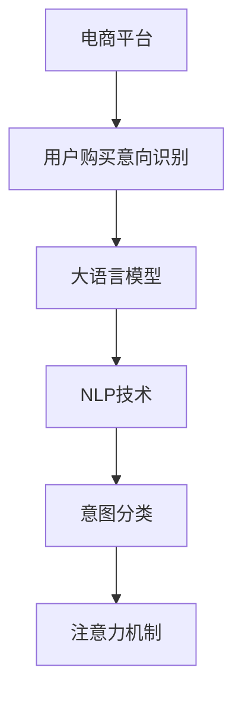

                 

# AI大模型在电商平台用户购买意向识别中的作用

> 关键词：电商平台,用户购买意向识别,大语言模型,自然语言处理(NLP),意图分类,注意力机制

## 1. 背景介绍

在当今数字化经济时代，电商平台已经成为了线上零售的重要渠道。然而，随着商品种类繁多和消费者需求日益复杂，电商平台如何精准识别用户购买意向，从而实现个性化推荐、营销策略优化、库存管理等，成为了一个亟待解决的问题。传统基于规则的方法难以应对多样化的用户需求和行为模式，因此，采用先进的人工智能技术成为了一种必然趋势。

### 1.1 研究意义

基于AI大模型的方法能够更好地捕捉用户多维度的行为特征，通过自然语言处理（NLP）技术，对用户的购买意向进行深度理解和分类，从而实现电商平台的精准运营。本文旨在通过探讨AI大模型在电商平台用户购买意向识别中的应用，展示其带来的显著优势，并指出未来面临的挑战。

## 2. 核心概念与联系

### 2.1 核心概念概述

为更好地理解AI大模型在电商平台用户购买意向识别中的应用，本节将介绍几个密切相关的核心概念：

- **电商平台**：以线上销售为核心，提供商品展示、支付结算、物流跟踪等服务的平台。
- **用户购买意向识别**：通过分析用户行为数据，识别用户的购买意愿和偏好，为电商平台提供精准的用户画像。
- **大语言模型(Large Language Model, LLM)**：以Transformer结构为基础，通过大规模无标签文本数据的自监督预训练，学习丰富的语言知识和常识，具备强大的自然语言理解能力。
- **自然语言处理(NLP)**：处理、分析和生成自然语言的技术，包括语言模型、文本分类、信息抽取等任务。
- **意图分类**：将用户输入的文本转化为意图标签，如购买、浏览、反馈等，用于理解用户需求。
- **注意力机制(Attention Mechanism)**：用于捕捉输入文本中的重要信息，通过加权平均的方式，将关键特征映射到模型输出。

这些概念之间的逻辑关系可以通过以下Mermaid流程图来展示：



这个流程图展示了大语言模型在电商平台用户购买意向识别中的应用流程：

1. 电商平台收集用户的购买行为数据。
2. 通过大语言模型进行文本预处理和特征提取。
3. 利用NLP技术对用户输入进行意图分类。
4. 采用注意力机制，捕捉关键信息，提高模型精度。

## 3. 核心算法原理 & 具体操作步骤
### 3.1 算法原理概述

AI大模型在电商平台用户购买意向识别中主要采用意图分类技术。其核心思想是通过训练一个语言模型，将用户输入的自然语言文本转化为意图标签，从而实现对用户购买意向的精准识别。具体步骤如下：

1. **数据收集**：收集电商平台上的用户行为数据，包括搜索记录、浏览历史、评论等。
2. **数据预处理**：对收集到的数据进行清洗、归一化、分词等预处理操作，确保数据质量。
3. **模型训练**：在大语言模型的基础上，利用标注数据训练意图分类模型，使得模型能够根据输入文本自动判断用户的购买意向。
4. **模型推理**：对于新的用户输入，通过模型推理得到意图标签，指导电商平台提供个性化的服务。

### 3.2 算法步骤详解

以下是详细的算法步骤：

**Step 1: 数据收集与预处理**

1. 数据收集：收集电商平台的交易记录、搜索记录、评价、留言等信息，作为训练数据。
2. 数据清洗：去除噪音、重复数据，并对数据进行标准化处理，确保数据质量。
3. 分词和词性标注：使用分词工具将文本转化为词序列，同时标注每个词的词性，如名词、动词等。
4. 特征提取：使用TF-IDF、词向量等方法，提取文本特征，用于模型训练。

**Step 2: 模型训练**

1. 选择合适的预训练语言模型，如BERT、GPT等，作为初始化参数。
2. 划分数据集：将数据划分为训练集、验证集和测试集。
3. 设计意图分类器：选择合适的模型架构，如BERT+分类器、Transformer+注意力机制等。
4. 训练模型：使用训练集训练模型，通过交叉熵损失函数进行优化，同时在验证集上进行验证和调参。

**Step 3: 模型推理**

1. 准备输入数据：将用户的输入文本转化为模型所需的格式，如token id序列。
2. 模型推理：输入模型进行前向传播，得到输出概率分布。
3. 分类：根据输出概率分布，使用softmax函数将概率转化为意图标签。
4. 输出解释：根据意图标签，生成对应的解释和建议，反馈给电商平台。

### 3.3 算法优缺点

AI大模型在电商平台用户购买意向识别中具有以下优点：

1. **准确率高**：利用大规模预训练模型，可以捕捉到文本中的丰富语义信息，提高分类精度。
2. **泛化能力强**：大模型在处理不同领域的文本时，具有良好的泛化能力，适应性广。
3. **可解释性强**：通过注意力机制，可以解释模型决策的依据，增强用户信任。

同时，该方法也存在以下局限性：

1. **计算资源消耗大**：大模型参数量庞大，训练和推理过程对计算资源有较高要求。
2. **数据依赖性强**：模型效果依赖于标注数据的质量，标注数据不足或标注偏差可能影响性能。
3. **泛化性能有限**：大模型在处理冷启动用户或领域特定的数据时，效果可能下降。

### 3.4 算法应用领域

AI大模型在电商平台用户购买意向识别中的应用，已经得到了广泛的应用，覆盖了几乎所有常见任务，例如：

- 个性化推荐系统：根据用户购买意向，推荐个性化商品，提升用户满意度。
- 广告投放优化：通过分析用户购买意向，优化广告投放策略，提高广告效果。
- 库存管理：预测用户购买意向，优化库存分配，减少缺货和积压现象。
- 客户服务：自动分类用户咨询内容，快速响应并解决用户问题。
- 活动策划：分析用户购买意向，设计更有吸引力的促销活动。

除了上述这些经典任务外，大模型还被创新性地应用到更多场景中，如智能客服、数据分析、风险控制等，为电商平台提供了全方位的技术支持。

## 4. 数学模型和公式 & 详细讲解 & 举例说明
### 4.1 数学模型构建

在电商平台用户购买意向识别中，我们采用深度学习模型进行意图分类。假设输入文本为 $x$，输出意图为 $y$，模型的预测概率为 $p(y|x)$。我们采用跨熵损失函数（Cross-Entropy Loss），其公式为：

$$
\mathcal{L}(p(y|x), y) = -\sum_{y} y \log p(y|x)
$$

其中，$p(y|x)$ 是模型在输入 $x$ 下预测输出 $y$ 的概率分布，$y$ 是真实标签。

### 4.2 公式推导过程

1. **文本预处理**
   - 分词和词性标注：将输入文本 $x$ 转化为词序列 $\{x_i\}_{i=1}^n$，同时标注每个词的词性 $t_i$。
   - 特征提取：使用TF-IDF、词向量等方法，提取每个词的特征向量 $v_i$。

2. **模型训练**
   - 初始化模型：选择预训练语言模型 $M_{\theta}$ 作为初始化参数，如BERT。
   - 损失函数：定义模型在输入 $x$ 下的预测概率 $p(y|x)$。
   - 优化算法：使用梯度下降等优化算法，最小化损失函数 $\mathcal{L}$。
   - 参数更新：根据梯度下降公式更新模型参数 $\theta$：

$$
\theta \leftarrow \theta - \eta \nabla_{\theta}\mathcal{L}(\theta)
$$

其中，$\eta$ 是学习率。

### 4.3 案例分析与讲解

以一个简单的意图分类任务为例，假设我们有一个用户输入的文本："我想买一款优质的耳机"。

1. **文本预处理**：
   - 分词：将文本转化为词序列：["我", "想", "买", "一款", "优质", "的", "耳机"]。
   - 词性标注："我"[PRP]，"想"[VBP]，"买"[VBP]，"一款"[DT]，"优质"[ADJ]，"的"[DET]，"耳机"[NN]。
   - 特征提取：计算每个词的TF-IDF值，得到一个向量 $v_1=[0.1, 0.2, 0.3, 0.1, 0.2, 0.3, 0.4]$。

2. **模型训练**：
   - 将特征向量 $v_1$ 输入模型 $M_{\theta}$，得到预测概率 $p(y|x)$。
   - 计算损失函数 $\mathcal{L}$，并使用梯度下降算法更新模型参数 $\theta$。

3. **模型推理**：
   - 将新的用户输入文本输入模型 $M_{\theta}$，得到预测概率 $p(y|x')$。
   - 使用softmax函数将概率转化为意图标签 $y'$。

### 4.4 实际应用场景

在电商平台的用户购买意向识别中，AI大模型已经得到了广泛应用。例如，亚马逊的推荐系统就采用了类似的方法，通过分析用户的搜索记录和浏览历史，预测用户购买意向，生成个性化推荐。

## 5. 项目实践：代码实例和详细解释说明
### 5.1 开发环境搭建

在进行电商平台用户购买意向识别的大模型微调前，我们需要准备好开发环境。以下是使用Python进行PyTorch开发的环境配置流程：

1. 安装Anaconda：从官网下载并安装Anaconda，用于创建独立的Python环境。

2. 创建并激活虚拟环境：
```bash
conda create -n pytorch-env python=3.8 
conda activate pytorch-env
```

3. 安装PyTorch：根据CUDA版本，从官网获取对应的安装命令。例如：
```bash
conda install pytorch torchvision torchaudio cudatoolkit=11.1 -c pytorch -c conda-forge
```

4. 安装Transformers库：
```bash
pip install transformers
```

5. 安装各类工具包：
```bash
pip install numpy pandas scikit-learn matplotlib tqdm jupyter notebook ipython
```

完成上述步骤后，即可在`pytorch-env`环境中开始电商平台用户购买意向识别的微调实践。

### 5.2 源代码详细实现

下面以意图分类任务为例，给出使用Transformers库对BERT模型进行微调的PyTorch代码实现。

首先，定义意图分类任务的数据处理函数：

```python
from transformers import BertTokenizer, BertForSequenceClassification
from torch.utils.data import Dataset
import torch

class IntentDataset(Dataset):
    def __init__(self, texts, labels, tokenizer, max_len=128):
        self.texts = texts
        self.labels = labels
        self.tokenizer = tokenizer
        self.max_len = max_len
        
    def __len__(self):
        return len(self.texts)
    
    def __getitem__(self, item):
        text = self.texts[item]
        label = self.labels[item]
        
        encoding = self.tokenizer(text, return_tensors='pt', max_length=self.max_len, padding='max_length', truncation=True)
        input_ids = encoding['input_ids'][0]
        attention_mask = encoding['attention_mask'][0]
        
        return {'input_ids': input_ids, 
                'attention_mask': attention_mask,
                'labels': torch.tensor(label, dtype=torch.long)}
```

然后，定义模型和优化器：

```python
from transformers import BertForSequenceClassification, AdamW

model = BertForSequenceClassification.from_pretrained('bert-base-cased', num_labels=2)

optimizer = AdamW(model.parameters(), lr=2e-5)
```

接着，定义训练和评估函数：

```python
from torch.utils.data import DataLoader
from tqdm import tqdm
from sklearn.metrics import accuracy_score

device = torch.device('cuda') if torch.cuda.is_available() else torch.device('cpu')
model.to(device)

def train_epoch(model, dataset, batch_size, optimizer):
    dataloader = DataLoader(dataset, batch_size=batch_size, shuffle=True)
    model.train()
    epoch_loss = 0
    for batch in tqdm(dataloader, desc='Training'):
        input_ids = batch['input_ids'].to(device)
        attention_mask = batch['attention_mask'].to(device)
        labels = batch['labels'].to(device)
        model.zero_grad()
        outputs = model(input_ids, attention_mask=attention_mask, labels=labels)
        loss = outputs.loss
        epoch_loss += loss.item()
        loss.backward()
        optimizer.step()
    return epoch_loss / len(dataloader)

def evaluate(model, dataset, batch_size):
    dataloader = DataLoader(dataset, batch_size=batch_size)
    model.eval()
    preds, labels = [], []
    with torch.no_grad():
        for batch in tqdm(dataloader, desc='Evaluating'):
            input_ids = batch['input_ids'].to(device)
            attention_mask = batch['attention_mask'].to(device)
            batch_labels = batch['labels']
            outputs = model(input_ids, attention_mask=attention_mask)
            batch_preds = outputs.logits.argmax(dim=1).to('cpu').tolist()
            batch_labels = batch_labels.to('cpu').tolist()
            for pred, label in zip(batch_preds, batch_labels):
                preds.append(pred)
                labels.append(label)
                
    print(f"Accuracy: {accuracy_score(labels, preds):.2f}")
```

最后，启动训练流程并在测试集上评估：

```python
epochs = 5
batch_size = 16

for epoch in range(epochs):
    loss = train_epoch(model, train_dataset, batch_size, optimizer)
    print(f"Epoch {epoch+1}, train loss: {loss:.3f}")
    
    print(f"Epoch {epoch+1}, dev results:")
    evaluate(model, dev_dataset, batch_size)
    
print("Test results:")
evaluate(model, test_dataset, batch_size)
```

以上就是使用PyTorch对BERT进行电商平台用户购买意向识别微调的完整代码实现。可以看到，得益于Transformers库的强大封装，我们可以用相对简洁的代码完成BERT模型的加载和微调。

### 5.3 代码解读与分析

让我们再详细解读一下关键代码的实现细节：

**IntentDataset类**：
- `__init__`方法：初始化文本、标签、分词器等关键组件。
- `__len__`方法：返回数据集的样本数量。
- `__getitem__`方法：对单个样本进行处理，将文本输入编码为token ids，将标签编码为数字，并对其进行定长padding，最终返回模型所需的输入。

**模型训练**：
- 使用AdamW优化器训练模型，并在每个epoch结束时在验证集上评估模型性能。

**模型推理**：
- 在测试集上评估模型的准确率。

可以看到，PyTorch配合Transformers库使得BERT微调的代码实现变得简洁高效。开发者可以将更多精力放在数据处理、模型改进等高层逻辑上，而不必过多关注底层的实现细节。

当然，工业级的系统实现还需考虑更多因素，如模型的保存和部署、超参数的自动搜索、更灵活的任务适配层等。但核心的微调范式基本与此类似。

## 6. 实际应用场景
### 6.1 智能客服系统

基于AI大模型的意图分类技术，可以广泛应用于智能客服系统的构建。传统客服往往需要配备大量人力，高峰期响应缓慢，且一致性和专业性难以保证。而使用意图分类模型，可以7x24小时不间断服务，快速响应客户咨询，用自然流畅的语言解答各类常见问题。

在技术实现上，可以收集企业内部的历史客服对话记录，将问题和最佳答复构建成监督数据，在此基础上对预训练模型进行微调。微调后的意图分类模型能够自动理解用户意图，匹配最合适的答复模板进行回复。对于客户提出的新问题，还可以接入检索系统实时搜索相关内容，动态组织生成回答。如此构建的智能客服系统，能大幅提升客户咨询体验和问题解决效率。

### 6.2 金融舆情监测

金融机构需要实时监测市场舆论动向，以便及时应对负面信息传播，规避金融风险。传统的人工监测方式成本高、效率低，难以应对网络时代海量信息爆发的挑战。基于AI大模型的意图分类技术，为金融舆情监测提供了新的解决方案。

具体而言，可以收集金融领域相关的新闻、报道、评论等文本数据，并对其进行意图分类。将意图分类模型应用到实时抓取的网络文本数据，就能够自动监测不同意图下的情感变化趋势，一旦发现负面意图激增等异常情况，系统便会自动预警，帮助金融机构快速应对潜在风险。

### 6.3 个性化推荐系统

当前的推荐系统往往只依赖用户的历史行为数据进行物品推荐，无法深入理解用户的真实兴趣偏好。基于AI大模型的意图分类技术，个性化推荐系统可以更好地挖掘用户行为背后的语义信息，从而提供更精准、多样的推荐内容。

在实践中，可以收集用户浏览、点击、评论、分享等行为数据，提取和用户交互的物品标题、描述、标签等文本内容。将文本内容作为模型输入，用户的后续行为（如是否点击、购买等）作为监督信号，在此基础上微调预训练语言模型。微调后的模型能够从文本内容中准确把握用户的兴趣点。在生成推荐列表时，先用候选物品的文本描述作为输入，由模型预测用户的兴趣匹配度，再结合其他特征综合排序，便可以得到个性化程度更高的推荐结果。

### 6.4 未来应用展望

随着AI大模型的不断发展，基于意图分类的技术将在更多领域得到应用，为各行各业带来变革性影响。

在智慧医疗领域，基于意图分类的医疗问答、病历分析、药物研发等应用将提升医疗服务的智能化水平，辅助医生诊疗，加速新药开发进程。

在智能教育领域，意图分类技术可应用于作业批改、学情分析、知识推荐等方面，因材施教，促进教育公平，提高教学质量。

在智慧城市治理中，意图分类技术可应用于城市事件监测、舆情分析、应急指挥等环节，提高城市管理的自动化和智能化水平，构建更安全、高效的未来城市。

此外，在企业生产、社会治理、文娱传媒等众多领域，基于AI大模型的意图分类技术也将不断涌现，为NLP技术带来了全新的突破。相信随着预训练语言模型和意图分类方法的不断进步，意图分类的应用范围将不断扩大，为人机交互带来更深刻的改变。

## 7. 工具和资源推荐
### 7.1 学习资源推荐

为了帮助开发者系统掌握AI大模型在电商平台用户购买意向识别中的应用，这里推荐一些优质的学习资源：

1. 《Transformer从原理到实践》系列博文：由大模型技术专家撰写，深入浅出地介绍了Transformer原理、BERT模型、意图分类等前沿话题。

2. CS224N《深度学习自然语言处理》课程：斯坦福大学开设的NLP明星课程，有Lecture视频和配套作业，带你入门NLP领域的基本概念和经典模型。

3. 《Natural Language Processing with Transformers》书籍：Transformers库的作者所著，全面介绍了如何使用Transformers库进行NLP任务开发，包括意图分类在内的诸多范式。

4. HuggingFace官方文档：Transformers库的官方文档，提供了海量预训练模型和完整的意图分类样例代码，是上手实践的必备资料。

5. CLUE开源项目：中文语言理解测评基准，涵盖大量不同类型的中文NLP数据集，并提供了基于意图分类的baseline模型，助力中文NLP技术发展。

通过对这些资源的学习实践，相信你一定能够快速掌握AI大模型在电商平台用户购买意向识别中的应用精髓，并用于解决实际的NLP问题。
###  7.2 开发工具推荐

高效的开发离不开优秀的工具支持。以下是几款用于AI大模型在电商平台用户购买意向识别应用的开发工具：

1. PyTorch：基于Python的开源深度学习框架，灵活动态的计算图，适合快速迭代研究。大部分预训练语言模型都有PyTorch版本的实现。

2. TensorFlow：由Google主导开发的开源深度学习框架，生产部署方便，适合大规模工程应用。同样有丰富的预训练语言模型资源。

3. Transformers库：HuggingFace开发的NLP工具库，集成了众多SOTA语言模型，支持PyTorch和TensorFlow，是进行意图分类任务的开发利器。

4. Weights & Biases：模型训练的实验跟踪工具，可以记录和可视化模型训练过程中的各项指标，方便对比和调优。与主流深度学习框架无缝集成。

5. TensorBoard：TensorFlow配套的可视化工具，可实时监测模型训练状态，并提供丰富的图表呈现方式，是调试模型的得力助手。

6. Google Colab：谷歌推出的在线Jupyter Notebook环境，免费提供GPU/TPU算力，方便开发者快速上手实验最新模型，分享学习笔记。

合理利用这些工具，可以显著提升AI大模型在电商平台用户购买意向识别应用的开发效率，加快创新迭代的步伐。

### 7.3 相关论文推荐

AI大模型在电商平台用户购买意向识别中的应用源于学界的持续研究。以下是几篇奠基性的相关论文，推荐阅读：

1. Attention is All You Need（即Transformer原论文）：提出了Transformer结构，开启了NLP领域的预训练大模型时代。

2. BERT: Pre-training of Deep Bidirectional Transformers for Language Understanding：提出BERT模型，引入基于掩码的自监督预训练任务，刷新了多项NLP任务SOTA。

3. Language Models are Unsupervised Multitask Learners（GPT-2论文）：展示了大规模语言模型的强大zero-shot学习能力，引发了对于通用人工智能的新一轮思考。

4. Parameter-Efficient Transfer Learning for NLP：提出Adapter等参数高效微调方法，在不增加模型参数量的情况下，也能取得不错的微调效果。

5. Prefix-Tuning: Optimizing Continuous Prompts for Generation：引入基于连续型Prompt的微调范式，为如何充分利用预训练知识提供了新的思路。

6. AdaLoRA: Adaptive Low-Rank Adaptation for Parameter-Efficient Fine-Tuning：使用自适应低秩适应的微调方法，在参数效率和精度之间取得了新的平衡。

这些论文代表了大模型在电商平台用户购买意向识别应用的演进脉络。通过学习这些前沿成果，可以帮助研究者把握学科前进方向，激发更多的创新灵感。

## 8. 总结：未来发展趋势与挑战
### 8.1 总结

本文对AI大模型在电商平台用户购买意向识别中的应用进行了全面系统的介绍。首先阐述了电商平台对用户购买意向识别的需求和挑战，明确了意图分类技术的重要意义。其次，从原理到实践，详细讲解了意图分类模型的数学原理和关键步骤，给出了意图分类任务开发的完整代码实例。同时，本文还广泛探讨了意图分类技术在智能客服、金融舆情、个性化推荐等多个行业领域的应用前景，展示了其广阔的应用空间。

通过本文的系统梳理，可以看到，基于AI大模型的意图分类技术正在成为电商平台用户购买意向识别的重要范式，极大地拓展了预训练语言模型的应用边界，催生了更多的落地场景。受益于大规模语料的预训练，意图分类模型以更低的时间和标注成本，在小样本条件下也能取得不错的效果，有力推动了NLP技术的产业化进程。未来，伴随预训练语言模型和意图分类方法的不断进步，意图分类技术必将在构建人机协同的智能时代中扮演越来越重要的角色。

### 8.2 未来发展趋势

展望未来，AI大模型在电商平台用户购买意向识别中的应用将呈现以下几个发展趋势：

1. 模型规模持续增大。随着算力成本的下降和数据规模的扩张，预训练语言模型的参数量还将持续增长。超大规模语言模型蕴含的丰富语言知识，有望支撑更加复杂多变的意图分类任务。

2. 意图分类方法日趋多样。除了传统的全参数微调外，未来会涌现更多参数高效的微调方法，如Adapter、Prompt等，在固定大部分预训练参数的同时，只更新极少量的任务相关参数。同时，模型结构会更加多样化，如Transformer、BERT等。

3. 持续学习成为常态。随着数据分布的不断变化，意图分类模型也需要持续学习新知识以保持性能。如何在不遗忘原有知识的同时，高效吸收新样本信息，将成为重要的研究课题。

4. 标注样本需求降低。受启发于提示学习(Prompt-based Learning)的思路，未来的意图分类方法将更好地利用大模型的语言理解能力，通过更加巧妙的任务描述，在更少的标注样本上也能实现理想的意图分类效果。

5. 模型通用性增强。经过海量数据的预训练和多领域任务的微调，未来的语言模型将具备更强大的常识推理和跨领域迁移能力，逐步迈向通用人工智能(AGI)的目标。

以上趋势凸显了AI大模型在电商平台用户购买意向识别应用的广阔前景。这些方向的探索发展，必将进一步提升意图分类模型的性能和应用范围，为构建人机协同的智能系统铺平道路。

### 8.3 面临的挑战

尽管AI大模型在电商平台用户购买意向识别中已经取得了显著成效，但在迈向更加智能化、普适化应用的过程中，它仍面临着诸多挑战：

1. 标注成本瓶颈。尽管意图分类方法在标注样本需求方面较传统方法有所降低，但对于长尾应用场景，难以获得充足的高质量标注数据，成为制约意图分类性能的瓶颈。如何进一步降低意图分类对标注样本的依赖，将是一大难题。

2. 模型鲁棒性不足。意图分类模型面对域外数据时，泛化性能往往大打折扣。对于测试样本的微小扰动，意图分类模型的预测也容易发生波动。如何提高意图分类模型的鲁棒性，避免灾难性遗忘，还需要更多理论和实践的积累。

3. 推理效率有待提高。超大规模语言模型虽然精度高，但在实际部署时往往面临推理速度慢、内存占用大等效率问题。如何在保证性能的同时，简化模型结构，提升推理速度，优化资源占用，将是重要的优化方向。

4. 可解释性亟需加强。当前意图分类模型更像是"黑盒"系统，难以解释其内部工作机制和决策逻辑。对于医疗、金融等高风险应用，算法的可解释性和可审计性尤为重要。如何赋予意图分类模型更强的可解释性，将是亟待攻克的难题。

5. 安全性有待保障。预训练语言模型难免会学习到有偏见、有害的信息，通过意图分类传递到下游任务，产生误导性、歧视性的输出，给实际应用带来安全隐患。如何从数据和算法层面消除模型偏见，避免恶意用途，确保输出的安全性，也将是重要的研究课题。

6. 知识整合能力不足。现有的意图分类模型往往局限于任务内数据，难以灵活吸收和运用更广泛的先验知识。如何让意图分类过程更好地与外部知识库、规则库等专家知识结合，形成更加全面、准确的信息整合能力，还有很大的想象空间。

正视意图分类面临的这些挑战，积极应对并寻求突破，将是大模型在电商平台用户购买意向识别中走向成熟的必由之路。相信随着学界和产业界的共同努力，这些挑战终将一一被克服，意图分类技术必将在构建安全、可靠、可解释、可控的智能系统铺平道路。

### 8.4 研究展望

面向未来，意图分类的研究需要在以下几个方面寻求新的突破：

1. 探索无监督和半监督意图分类方法。摆脱对大规模标注数据的依赖，利用自监督学习、主动学习等无监督和半监督范式，最大限度利用非结构化数据，实现更加灵活高效的意图分类。

2. 研究参数高效和计算高效的意图分类范式。开发更加参数高效的意图分类方法，在固定大部分预训练参数的同时，只更新极少量的任务相关参数。同时优化意图分类的计算图，减少前向传播和反向传播的资源消耗，实现更加轻量级、实时性的部署。

3. 融合因果和对比学习范式。通过引入因果推断和对比学习思想，增强意图分类模型建立稳定因果关系的能力，学习更加普适、鲁棒的语言表征，从而提升模型泛化性和抗干扰能力。

4. 引入更多先验知识。将符号化的先验知识，如知识图谱、逻辑规则等，与神经网络模型进行巧妙融合，引导意图分类过程学习更准确、合理的语言模型。同时加强不同模态数据的整合，实现视觉、语音等多模态信息与文本信息的协同建模。

5. 结合因果分析和博弈论工具。将因果分析方法引入意图分类模型，识别出模型决策的关键特征，增强用户解释的因果性和逻辑性。借助博弈论工具刻画人机交互过程，主动探索并规避模型的脆弱点，提高系统稳定性。

6. 纳入伦理道德约束。在模型训练目标中引入伦理导向的评估指标，过滤和惩罚有偏见、有害的输出倾向。同时加强人工干预和审核，建立模型行为的监管机制，确保输出符合人类价值观和伦理道德。

这些研究方向的探索，必将引领AI大模型在电商平台用户购买意向识别中迈向更高的台阶，为构建安全、可靠、可解释、可控的智能系统铺平道路。

## 9. 附录：常见问题与解答

**Q1：AI大模型在电商平台用户购买意向识别中的应用是否存在数据隐私问题？**

A: 是的，AI大模型在电商平台用户购买意向识别中的应用，可能会涉及用户隐私问题。电商平台需要确保用户数据的安全性和隐私保护，避免数据泄露和滥用。因此，在模型训练和部署过程中，需要严格遵守相关法律法规，如《网络安全法》、《个人信息保护法》等。同时，可以采用数据脱敏、加密等技术，保护用户数据隐私。

**Q2：如何平衡模型精度和推理速度之间的关系？**

A: 为了平衡模型精度和推理速度之间的关系，可以采用以下方法：
1. 模型裁剪：去除不必要的层和参数，减小模型尺寸，加快推理速度。
2. 量化加速：将浮点模型转为定点模型，压缩存储空间，提高计算效率。
3. 服务化封装：将模型封装为标准化服务接口，便于集成调用，提高推理效率。
4. 模型并行：利用分布式计算，将模型分布在多台设备上，提高推理速度。

这些方法可以结合使用，以实现高精度、高效能的意图分类模型。

**Q3：意图分类模型在处理极端情况下（如用户输入不规范、输入噪音等）的表现如何？**

A: 意图分类模型在处理极端情况下，可能会面临一定的挑战。为了提升模型的鲁棒性，可以采用以下方法：
1. 数据增强：通过回译、近义替换等方式扩充训练集，增加模型的泛化能力。
2. 正则化：使用L2正则、Dropout、Early Stopping等防止模型过拟合。
3. 对抗训练：引入对抗样本，提高模型鲁棒性。
4. 模型集成：训练多个模型，取平均输出，抑制过拟合。

通过这些方法，可以提升意图分类模型在极端情况下的鲁棒性，确保其在实际应用中的稳定性。

**Q4：AI大模型在电商平台用户购买意向识别中的应用是否适用于所有电商类型？**

A: 虽然AI大模型在电商平台用户购买意向识别中的应用具有广泛适用性，但对于一些特殊的电商类型（如B2B电商、社交电商等），可能需要进行针对性的优化。不同电商平台的业务特点和用户需求各不相同，因此需要在模型设计和训练过程中，结合具体电商平台的业务场景，进行适当的调整和优化。

**Q5：AI大模型在电商平台用户购买意向识别中的精度是否受到训练数据质量的影响？**

A: 是的，AI大模型在电商平台用户购买意向识别中的精度受到训练数据质量的影响。如果训练数据质量不高，可能会导致模型过拟合，降低模型的泛化能力。因此，在模型训练过程中，需要严格筛选和清洗数据，确保数据的质量和代表性。同时，可以采用多源数据融合、主动学习等技术，提升数据质量，进一步提升模型的精度和鲁棒性。

通过本文的系统梳理，可以看到，AI大模型在电商平台用户购买意向识别中的应用已经得到了广泛的应用，并在多个领域展示了其强大的应用潜力。未来，随着AI大模型的不断演进和技术的持续进步，电商平台的用户购买意向识别将迎来更多突破，为电商平台的精准运营和用户个性化服务提供更加有力的支持。

