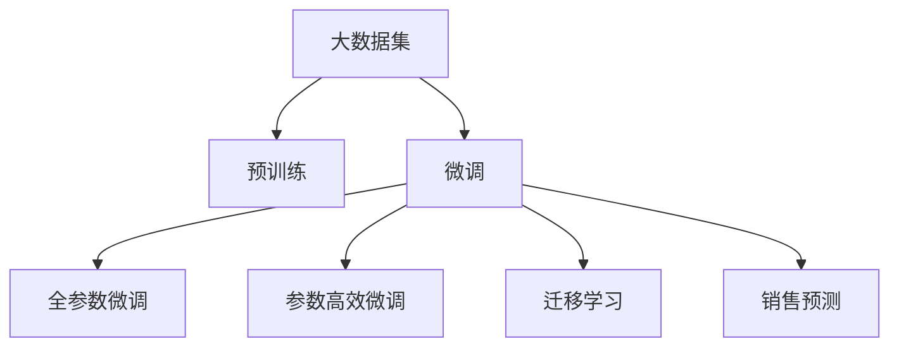

                 

# AI大模型在电商平台销售预测精确化中的应用

## 1. 背景介绍

### 1.1 问题由来

随着电子商务的飞速发展，电商平台为了优化运营效率和提升用户体验，对销售预测的需求日益增加。传统的销售预测模型依赖人工特征工程和统计方法，往往需要繁琐的手动调整，难以适应复杂多变的业务环境。而基于大模型的销售预测方法，借助自然语言处理(NLP)和深度学习的力量，能够从海量数据中自动学习到特征，具有强大的泛化能力和适应性。

### 1.2 问题核心关键点

本节将详细介绍基于大模型的销售预测方法的关键点和核心原理，并说明其在电商平台中的应用。

1. **数据准备**：收集电商平台的销售数据、产品信息、用户行为等，并进行清洗和预处理，形成可用于模型训练的数据集。
2. **预训练模型选择**：选择合适的预训练语言模型（如BERT、GPT等）作为初始化参数，进行销售预测任务的微调。
3. **模型架构设计**：构建适合电商平台的销售预测模型架构，包括特征提取、预测层和损失函数设计。
4. **模型训练与评估**：在电商平台的标注数据集上训练模型，通过交叉验证和测试集评估模型性能。
5. **应用部署与监控**：将训练好的模型集成到电商平台系统，并设置监控机制，持续优化模型效果。

## 2. 核心概念与联系

### 2.1 核心概念概述

为更好地理解基于大模型的销售预测方法，本节将介绍几个关键概念：

- **大模型(大语言模型)**：指预训练语言模型，如BERT、GPT等，通过大规模无标签文本语料进行预训练，学习到丰富的语言知识和语义信息。
- **预训练**：指在大规模无标签数据上，通过自监督学习任务训练预训练语言模型，学习通用语言表示。
- **微调**：指在预训练模型的基础上，使用电商平台销售数据的标注信息进行有监督学习，优化模型在特定任务（如销售预测）上的性能。
- **迁移学习**：指将预训练语言模型在大规模数据上学习到的知识，迁移到销售预测等小规模数据集上进行微调，提升模型效果。

这些概念之间的关系可以通过以下Mermaid流程图展示：



这个流程图展示了预训练、微调和迁移学习之间的关系，以及它们在销售预测中的应用。

### 2.2 核心概念原理和架构

大模型的核心原理是自回归和自编码，通过大规模无标签文本语料进行预训练，学习到丰富的语言知识和语义信息。这些知识包括单词、短语、句子结构等语言特征，以及上下文关联、语义一致性等高级语义信息。

在销售预测任务中，大模型的迁移学习能力使得其在预训练后，能够快速适应新的下游任务，无需从头训练。微调过程通过有监督学习，进一步优化模型在销售预测上的表现，提升模型的准确性和泛化能力。

## 3. 核心算法原理 & 具体操作步骤

### 3.1 算法原理概述

基于大模型的销售预测方法，本质上是一种迁移学习范式。其核心思想是：将预训练的大语言模型作为初始化参数，通过电商平台销售数据的标注信息进行微调，使得模型能够自动学习到商品的销售趋势、用户行为等特征，进行精确的销售预测。

形式化地，假设预训练语言模型为 $M_{\theta}$，其中 $\theta$ 为预训练得到的模型参数。给定电商平台销售数据集 $D=\{(x_i, y_i)\}_{i=1}^N$，销售预测的任务是将输入 $x_i$ 映射到输出 $y_i$（如销量、销售额等）。微调的目标是找到新的模型参数 $\hat{\theta}$，使得：

$$
\hat{\theta}=\mathop{\arg\min}_{\theta} \mathcal{L}(M_{\theta},D)
$$

其中 $\mathcal{L}$ 为针对销售预测设计的损失函数，用于衡量模型预测输出与真实标签之间的差异。常见的损失函数包括均方误差损失、交叉熵损失等。

### 3.2 算法步骤详解

基于大模型的销售预测方法一般包括以下几个关键步骤：

**Step 1: 数据准备**
- 收集电商平台的销售数据、产品信息、用户行为等，并进行清洗和预处理，形成可用于模型训练的数据集。
- 将数据集划分为训练集、验证集和测试集，确保标注数据与预训练数据的分布相似。

**Step 2: 预训练模型选择**
- 选择合适的预训练语言模型（如BERT、GPT等）作为初始化参数，进行销售预测任务的微调。

**Step 3: 模型架构设计**
- 设计适合电商平台的销售预测模型架构，包括特征提取、预测层和损失函数设计。
- 在顶层设计输出层和损失函数，如对于回归任务，通常使用线性回归层和均方误差损失；对于分类任务，使用分类层和交叉熵损失。

**Step 4: 模型训练与评估**
- 在电商平台标注数据集上训练模型，通过交叉验证和测试集评估模型性能。
- 设置合适的学习率、批大小、迭代轮数等超参数，使用梯度下降等优化算法进行模型训练。
- 在验证集上监控模型性能，防止过拟合，及时调整超参数。

**Step 5: 应用部署与监控**
- 将训练好的模型集成到电商平台系统，进行销售预测。
- 设置监控机制，实时收集新的数据，持续优化模型效果。

### 3.3 算法优缺点

基于大模型的销售预测方法具有以下优点：
1. **高效泛化**：大模型具备强大的泛化能力，能够快速适应新的销售数据集，提升预测准确性。
2. **自动化特征工程**：大模型自动学习到特征，无需手动提取和调整，减少工作量。
3. **可解释性强**：大模型的输出结果可通过解释机制（如Attention、GLUE等）进行解释，提升可解释性。
4. **实时预测**：大模型可以实时处理大量数据，进行实时销售预测。

同时，该方法也存在以下局限性：
1. **数据依赖**：模型的效果很大程度上取决于电商平台标注数据的质量和数量，获取高质量标注数据的成本较高。
2. **模型复杂度**：大模型参数量庞大，训练和推理计算资源消耗较大。
3. **计算成本高**：训练大模型需要大量的计算资源，难以在资源有限的场景中应用。

## 4. 数学模型和公式 & 详细讲解 & 举例说明

### 4.1 数学模型构建

本节将使用数学语言对基于大模型的销售预测方法进行更加严格的刻画。

记预训练语言模型为 $M_{\theta}$，其中 $\theta$ 为预训练得到的模型参数。假设电商平台销售数据集为 $D=\{(x_i, y_i)\}_{i=1}^N$，其中 $x_i$ 为销售数据特征，$y_i$ 为销售目标（如销量、销售额等）。

定义模型 $M_{\theta}$ 在输入 $x_i$ 上的预测输出为 $\hat{y}_i=M_{\theta}(x_i)$，损失函数为 $\ell(\hat{y}_i,y_i)$，则在数据集 $D$ 上的经验风险为：

$$
\mathcal{L}(\theta) = \frac{1}{N} \sum_{i=1}^N \ell(\hat{y}_i,y_i)
$$

常用的损失函数包括均方误差损失（回归任务）和交叉熵损失（分类任务）。这里以均方误差损失为例：

$$
\ell(\hat{y}_i,y_i) = (\hat{y}_i - y_i)^2
$$

最小化经验风险即是最小化损失函数：

$$
\theta^* = \mathop{\arg\min}_{\theta} \mathcal{L}(\theta)
$$

在实践中，我们通常使用基于梯度的优化算法（如SGD、Adam等）来近似求解上述最优化问题。

### 4.2 公式推导过程

以下我们以回归任务为例，推导均方误差损失函数的梯度计算公式。

假设模型 $M_{\theta}$ 在输入 $x_i$ 上的预测输出为 $\hat{y}_i=M_{\theta}(x_i)$，真实标签为 $y_i$。均方误差损失函数为：

$$
\ell(\hat{y}_i,y_i) = (\hat{y}_i - y_i)^2
$$

将其代入经验风险公式，得：

$$
\mathcal{L}(\theta) = \frac{1}{N} \sum_{i=1}^N (\hat{y}_i - y_i)^2
$$

根据链式法则，损失函数对参数 $\theta_k$ 的梯度为：

$$
\frac{\partial \mathcal{L}(\theta)}{\partial \theta_k} = \frac{2}{N} \sum_{i=1}^N (\hat{y}_i - y_i) \frac{\partial M_{\theta}(x_i)}{\partial \theta_k}
$$

其中 $\frac{\partial M_{\theta}(x_i)}{\partial \theta_k}$ 可进一步递归展开，利用自动微分技术完成计算。

### 4.3 案例分析与讲解

以下以电商平台销售预测为例，说明如何使用大模型进行销售预测。

假设我们要对某电商平台的日销量进行预测，数据集为 $D=\{(x_i, y_i)\}_{i=1}^N$，其中 $x_i$ 为商品信息、用户行为等特征，$y_i$ 为日销量。

1. **数据准备**：收集电商平台的历史销售数据，包括商品描述、用户评论、点击量、购买量等。对这些数据进行清洗和预处理，形成可用于模型训练的数据集。

2. **预训练模型选择**：选择BERT等预训练语言模型作为初始化参数，进行销售预测任务的微调。

3. **模型架构设计**：在预训练模型的基础上，设计适合电商平台的销售预测模型架构。例如，可以使用Bidirectional LSTM进行特征提取，添加多层全连接神经网络进行预测。

4. **模型训练与评估**：在电商平台标注数据集上训练模型，通过交叉验证和测试集评估模型性能。设置合适的学习率、批大小、迭代轮数等超参数，使用梯度下降等优化算法进行模型训练。

5. **应用部署与监控**：将训练好的模型集成到电商平台系统，进行实时销售预测。设置监控机制，实时收集新的数据，持续优化模型效果。

## 5. 项目实践：代码实例和详细解释说明

### 5.1 开发环境搭建

在进行销售预测实践前，我们需要准备好开发环境。以下是使用Python进行PyTorch开发的环境配置流程：

1. 安装Anaconda：从官网下载并安装Anaconda，用于创建独立的Python环境。

2. 创建并激活虚拟环境：
```bash
conda create -n sales-pred-env python=3.8 
conda activate sales-pred-env
```

3. 安装PyTorch：根据CUDA版本，从官网获取对应的安装命令。例如：
```bash
conda install pytorch torchvision torchaudio cudatoolkit=11.1 -c pytorch -c conda-forge
```

4. 安装Transformers库：
```bash
pip install transformers
```

5. 安装各类工具包：
```bash
pip install numpy pandas scikit-learn matplotlib tqdm jupyter notebook ipython
```

完成上述步骤后，即可在`sales-pred-env`环境中开始销售预测实践。

### 5.2 源代码详细实现

下面我们以电商平台销售预测为例，给出使用Transformers库对BERT模型进行销售预测的PyTorch代码实现。

首先，定义销售预测任务的数据处理函数：

```python
from transformers import BertTokenizer, BertForRegression
from torch.utils.data import Dataset, DataLoader
import torch

class SalesData(Dataset):
    def __init__(self, texts, targets, tokenizer, max_len=128):
        self.texts = texts
        self.targets = targets
        self.tokenizer = tokenizer
        self.max_len = max_len
        
    def __len__(self):
        return len(self.texts)
    
    def __getitem__(self, item):
        text = self.texts[item]
        target = self.targets[item]
        
        encoding = self.tokenizer(text, return_tensors='pt', max_length=self.max_len, padding='max_length', truncation=True)
        input_ids = encoding['input_ids'][0]
        attention_mask = encoding['attention_mask'][0]
        
        target = torch.tensor(target, dtype=torch.float32)
        
        return {'input_ids': input_ids, 
                'attention_mask': attention_mask,
                'targets': target}

# 标签与id的映射
tag2id = {}
id2tag = {}

# 创建dataset
tokenizer = BertTokenizer.from_pretrained('bert-base-cased')

train_dataset = SalesData(train_texts, train_targets, tokenizer)
dev_dataset = SalesData(dev_texts, dev_targets, tokenizer)
test_dataset = SalesData(test_texts, test_targets, tokenizer)
```

然后，定义模型和优化器：

```python
from transformers import BertForRegression, AdamW

model = BertForRegression.from_pretrained('bert-base-cased')

optimizer = AdamW(model.parameters(), lr=2e-5)
```

接着，定义训练和评估函数：

```python
from tqdm import tqdm
from sklearn.metrics import mean_squared_error

device = torch.device('cuda') if torch.cuda.is_available() else torch.device('cpu')
model.to(device)

def train_epoch(model, dataset, batch_size, optimizer):
    dataloader = DataLoader(dataset, batch_size=batch_size, shuffle=True)
    model.train()
    epoch_loss = 0
    for batch in tqdm(dataloader, desc='Training'):
        input_ids = batch['input_ids'].to(device)
        attention_mask = batch['attention_mask'].to(device)
        targets = batch['targets'].to(device)
        model.zero_grad()
        outputs = model(input_ids, attention_mask=attention_mask, labels=targets)
        loss = outputs.loss
        epoch_loss += loss.item()
        loss.backward()
        optimizer.step()
    return epoch_loss / len(dataloader)

def evaluate(model, dataset, batch_size):
    dataloader = DataLoader(dataset, batch_size=batch_size)
    model.eval()
    mse = mean_squared_error(labels, preds)
    return mse
```

最后，启动训练流程并在测试集上评估：

```python
epochs = 5
batch_size = 16

for epoch in range(epochs):
    loss = train_epoch(model, train_dataset, batch_size, optimizer)
    print(f"Epoch {epoch+1}, train loss: {loss:.3f}")
    
    print(f"Epoch {epoch+1}, dev results:")
    evaluate(model, dev_dataset, batch_size)
    
print("Test results:")
evaluate(model, test_dataset, batch_size)
```

以上就是使用PyTorch对BERT进行销售预测的完整代码实现。可以看到，得益于Transformers库的强大封装，我们可以用相对简洁的代码完成BERT模型的加载和微调。

### 5.3 代码解读与分析

让我们再详细解读一下关键代码的实现细节：

**SalesData类**：
- `__init__`方法：初始化文本、目标、分词器等关键组件。
- `__len__`方法：返回数据集的样本数量。
- `__getitem__`方法：对单个样本进行处理，将文本输入编码为token ids，将目标值编码为数字，并对其进行定长padding，最终返回模型所需的输入。

**训练和评估函数**：
- 使用PyTorch的DataLoader对数据集进行批次化加载，供模型训练和推理使用。
- 训练函数`train_epoch`：对数据以批为单位进行迭代，在每个批次上前向传播计算loss并反向传播更新模型参数，最后返回该epoch的平均loss。
- 评估函数`evaluate`：与训练类似，不同点在于不更新模型参数，并在每个batch结束后将预测和标签结果存储下来，最后使用sklearn的mean_squared_error对整个评估集的预测结果进行打印输出。

**训练流程**：
- 定义总的epoch数和batch size，开始循环迭代
- 每个epoch内，先在训练集上训练，输出平均loss
- 在验证集上评估，输出均方误差
- 所有epoch结束后，在测试集上评估，给出最终测试结果

可以看到，PyTorch配合Transformers库使得BERT微调的代码实现变得简洁高效。开发者可以将更多精力放在数据处理、模型改进等高层逻辑上，而不必过多关注底层的实现细节。

当然，工业级的系统实现还需考虑更多因素，如模型的保存和部署、超参数的自动搜索、更灵活的任务适配层等。但核心的微调范式基本与此类似。

## 6. 实际应用场景

### 6.1 智能客服系统

基于大模型微调的销售预测方法，可以广泛应用于智能客服系统的构建。传统客服往往需要配备大量人力，高峰期响应缓慢，且一致性和专业性难以保证。而使用微调后的销售预测模型，可以7x24小时不间断服务，快速响应客户咨询，用销售预测结果辅助客服系统自动生成回复。

在技术实现上，可以收集企业内部的历史销售数据，将销售目标作为微调数据，训练模型学习销售趋势和用户行为。微调后的模型能够自动预测新客户的销售意愿，客服系统根据预测结果自动生成推荐和回复。对于复杂咨询，还可以接入检索系统实时搜索相关内容，动态组织生成回答。如此构建的智能客服系统，能大幅提升客户咨询体验和问题解决效率。

### 6.2 库存管理优化

电商平台库存管理的目标是减少库存积压，提高库存周转率。传统库存管理依赖人工预测和经验判断，难以适应快速变化的销售趋势。基于大模型的销售预测方法，可以实时监控商品销售情况，预测未来的销售量，优化库存管理策略。

在技术实现上，可以将历史销售数据、用户行为数据等作为输入，训练大模型进行销售预测。预测结果可用于生成库存预警信号，自动触发补货或减价等操作，提升库存管理效率。同时，可以通过持续训练和微调，不断优化预测模型，提高库存管理准确性。

### 6.3 个性化推荐系统

当前的推荐系统往往只依赖用户的历史行为数据进行物品推荐，无法深入理解用户的真实兴趣偏好。基于大模型的销售预测方法，可以更好地挖掘用户行为背后的语义信息，从而提供更精准、多样的推荐内容。

在技术实现上，可以收集用户浏览、点击、评论、分享等行为数据，提取和用户交互的物品标题、描述、标签等文本内容。将文本内容作为模型输入，用户的后续行为（如是否点击、购买等）作为监督信号，在此基础上微调预训练语言模型。微调后的模型能够从文本内容中准确把握用户的兴趣点。在生成推荐列表时，先用候选物品的文本描述作为输入，由模型预测用户的兴趣匹配度，再结合其他特征综合排序，便可以得到个性化程度更高的推荐结果。

## 7. 工具和资源推荐

### 7.1 学习资源推荐

为了帮助开发者系统掌握大模型微调的理论基础和实践技巧，这里推荐一些优质的学习资源：

1. 《Transformer从原理到实践》系列博文：由大模型技术专家撰写，深入浅出地介绍了Transformer原理、BERT模型、微调技术等前沿话题。

2. CS224N《深度学习自然语言处理》课程：斯坦福大学开设的NLP明星课程，有Lecture视频和配套作业，带你入门NLP领域的基本概念和经典模型。

3. 《Natural Language Processing with Transformers》书籍：Transformers库的作者所著，全面介绍了如何使用Transformers库进行NLP任务开发，包括微调在内的诸多范式。

4. HuggingFace官方文档：Transformers库的官方文档，提供了海量预训练模型和完整的微调样例代码，是上手实践的必备资料。

5. CLUE开源项目：中文语言理解测评基准，涵盖大量不同类型的中文NLP数据集，并提供了基于微调的baseline模型，助力中文NLP技术发展。

通过对这些资源的学习实践，相信你一定能够快速掌握大模型微调的精髓，并用于解决实际的NLP问题。

### 7.2 开发工具推荐

高效的开发离不开优秀的工具支持。以下是几款用于大模型微调开发的常用工具：

1. PyTorch：基于Python的开源深度学习框架，灵活动态的计算图，适合快速迭代研究。大部分预训练语言模型都有PyTorch版本的实现。

2. TensorFlow：由Google主导开发的开源深度学习框架，生产部署方便，适合大规模工程应用。同样有丰富的预训练语言模型资源。

3. Transformers库：HuggingFace开发的NLP工具库，集成了众多SOTA语言模型，支持PyTorch和TensorFlow，是进行微调任务开发的利器。

4. Weights & Biases：模型训练的实验跟踪工具，可以记录和可视化模型训练过程中的各项指标，方便对比和调优。与主流深度学习框架无缝集成。

5. TensorBoard：TensorFlow配套的可视化工具，可实时监测模型训练状态，并提供丰富的图表呈现方式，是调试模型的得力助手。

6. Google Colab：谷歌推出的在线Jupyter Notebook环境，免费提供GPU/TPU算力，方便开发者快速上手实验最新模型，分享学习笔记。

合理利用这些工具，可以显著提升大模型微调任务的开发效率，加快创新迭代的步伐。

### 7.3 相关论文推荐

大语言模型和微调技术的发展源于学界的持续研究。以下是几篇奠基性的相关论文，推荐阅读：

1. Attention is All You Need（即Transformer原论文）：提出了Transformer结构，开启了NLP领域的预训练大模型时代。

2. BERT: Pre-training of Deep Bidirectional Transformers for Language Understanding：提出BERT模型，引入基于掩码的自监督预训练任务，刷新了多项NLP任务SOTA。

3. Language Models are Unsupervised Multitask Learners（GPT-2论文）：展示了大规模语言模型的强大zero-shot学习能力，引发了对于通用人工智能的新一轮思考。

4. Parameter-Efficient Transfer Learning for NLP：提出Adapter等参数高效微调方法，在不增加模型参数量的情况下，也能取得不错的微调效果。

5. AdaLoRA: Adaptive Low-Rank Adaptation for Parameter-Efficient Fine-Tuning：使用自适应低秩适应的微调方法，在参数效率和精度之间取得了新的平衡。

6. Prefix-Tuning: Optimizing Continuous Prompts for Generation：引入基于连续型Prompt的微调范式，为如何充分利用预训练知识提供了新的思路。

这些论文代表了大语言模型微调技术的发展脉络。通过学习这些前沿成果，可以帮助研究者把握学科前进方向，激发更多的创新灵感。

## 8. 总结：未来发展趋势与挑战

### 8.1 总结

本文对基于大模型的销售预测方法进行了全面系统的介绍。首先阐述了电商平台对销售预测的需求，以及大模型的优势和核心原理。其次，从原理到实践，详细讲解了大模型微调的数学模型、关键步骤和核心算法。最后，展示了大模型在智能客服、库存管理、个性化推荐等多个场景中的应用，以及未来发展的趋势和挑战。

通过本文的系统梳理，可以看到，基于大模型的销售预测方法正在成为电商平台的重要工具，极大地提升了运营效率和用户体验。未来，伴随大模型和微调方法的持续演进，相信在更多领域中，基于大模型的微调方法都将发挥重要作用，推动人工智能技术的发展和应用。

### 8.2 未来发展趋势

展望未来，大模型微调技术将呈现以下几个发展趋势：

1. **模型规模持续增大**：随着算力成本的下降和数据规模的扩张，预训练语言模型的参数量还将持续增长。超大规模语言模型蕴含的丰富语言知识，有望支撑更加复杂多变的下游任务微调。

2. **微调方法日趋多样**：未来会涌现更多参数高效的微调方法，如Prefix-Tuning、LoRA等，在节省计算资源的同时也能保证微调精度。

3. **持续学习成为常态**：随着数据分布的不断变化，微调模型也需要持续学习新知识以保持性能。如何在不遗忘原有知识的同时，高效吸收新样本信息，将成为重要的研究课题。

4. **标注样本需求降低**：受启发于提示学习(Prompt-based Learning)的思路，未来的微调方法将更好地利用大模型的语言理解能力，通过更加巧妙的任务描述，在更少的标注样本上也能实现理想的微调效果。

5. **多模态微调崛起**：当前的微调主要聚焦于纯文本数据，未来会进一步拓展到图像、视频、语音等多模态数据微调。多模态信息的融合，将显著提升语言模型对现实世界的理解和建模能力。

6. **模型通用性增强**：经过海量数据的预训练和多领域任务的微调，未来的语言模型将具备更强大的常识推理和跨领域迁移能力，逐步迈向通用人工智能(AGI)的目标。

以上趋势凸显了大模型微调技术的广阔前景。这些方向的探索发展，必将进一步提升NLP系统的性能和应用范围，为构建人机协同的智能系统铺平道路。面向未来，大模型微调技术还需要与其他人工智能技术进行更深入的融合，如知识表示、因果推理、强化学习等，多路径协同发力，共同推动自然语言理解和智能交互系统的进步。

### 8.3 面临的挑战

尽管大模型微调技术已经取得了瞩目成就，但在迈向更加智能化、普适化应用的过程中，它仍面临着诸多挑战：

1. **数据依赖**：模型的效果很大程度上取决于电商平台标注数据的质量和数量，获取高质量标注数据的成本较高。如何进一步降低微调对标注样本的依赖，将是一大难题。

2. **模型鲁棒性不足**：当前微调模型面对域外数据时，泛化性能往往大打折扣。对于测试样本的微小扰动，微调模型的预测也容易发生波动。如何提高微调模型的鲁棒性，避免灾难性遗忘，还需要更多理论和实践的积累。

3. **推理效率有待提高**：大规模语言模型虽然精度高，但在实际部署时往往面临推理速度慢、内存占用大等效率问题。如何在保证性能的同时，简化模型结构，提升推理速度，优化资源占用，将是重要的优化方向。

4. **可解释性亟需加强**：当前微调模型更像是"黑盒"系统，难以解释其内部工作机制和决策逻辑。对于医疗、金融等高风险应用，算法的可解释性和可审计性尤为重要。如何赋予微调模型更强的可解释性，将是亟待攻克的难题。

5. **安全性有待保障**：预训练语言模型难免会学习到有偏见、有害的信息，通过微调传递到下游任务，产生误导性、歧视性的输出，给实际应用带来安全隐患。如何从数据和算法层面消除模型偏见，避免恶意用途，确保输出的安全性，也将是重要的研究课题。

6. **知识整合能力不足**：现有的微调模型往往局限于任务内数据，难以灵活吸收和运用更广泛的先验知识。如何让微调过程更好地与外部知识库、规则库等专家知识结合，形成更加全面、准确的信息整合能力，还有很大的想象空间。

正视微调面临的这些挑战，积极应对并寻求突破，将是大语言模型微调走向成熟的必由之路。相信随着学界和产业界的共同努力，这些挑战终将一一被克服，大语言模型微调必将在构建安全、可靠、可解释、可控的智能系统铺平道路。

### 8.4 研究展望

未来，大模型微调技术需要在以下几个方面进行深入研究：

1. **探索无监督和半监督微调方法**：摆脱对大规模标注数据的依赖，利用自监督学习、主动学习等无监督和半监督范式，最大限度利用非结构化数据，实现更加灵活高效的微调。

2. **研究参数高效和计算高效的微调范式**：开发更加参数高效的微调方法，在固定大部分预训练参数的同时，只更新极少量的任务相关参数。同时优化微调模型的计算图，减少前向传播和反向传播的资源消耗，实现更加轻量级、实时性的部署。

3. **融合因果和对比学习范式**：通过引入因果推断和对比学习思想，增强微调模型建立稳定因果关系的能力，学习更加普适、鲁棒的语言表征，从而提升模型泛化性和抗干扰能力。

4. **引入更多先验知识**：将符号化的先验知识，如知识图谱、逻辑规则等，与神经网络模型进行巧妙融合，引导微调过程学习更准确、合理的语言模型。同时加强不同模态数据的整合，实现视觉、语音等多模态信息与文本信息的协同建模。

5. **结合因果分析和博弈论工具**：将因果分析方法引入微调模型，识别出模型决策的关键特征，增强输出解释的因果性和逻辑性。借助博弈论工具刻画人机交互过程，主动探索并规避模型的脆弱点，提高系统稳定性。

6. **纳入伦理道德约束**：在模型训练目标中引入伦理导向的评估指标，过滤和惩罚有偏见、有害的输出倾向。同时加强人工干预和审核，建立模型行为的监管机制，确保输出符合人类价值观和伦理道德。

这些研究方向的探索，必将引领大语言模型微调技术迈向更高的台阶，为构建安全、可靠、可解释、可控的智能系统铺平道路。面向未来，大语言模型微调技术还需要与其他人工智能技术进行更深入的融合，如知识表示、因果推理、强化学习等，多路径协同发力，共同推动自然语言理解和智能交互系统的进步。只有勇于创新、敢于突破，才能不断拓展语言模型的边界，让智能技术更好地造福人类社会。

## 9. 附录：常见问题与解答

**Q1：电商平台销售预测是否适用于所有电商平台？**

A: 基于大模型的销售预测方法，可以应用于各种类型的电商平台，包括B2B、B2C、C2C等。但不同类型的电商平台，其销售数据和用户行为特征可能存在差异，需要针对性地进行特征工程和模型微调。

**Q2：大模型微调时如何选择合适的学习率？**

A: 大模型微调的学习率一般要比预训练时小1-2个数量级，如果使用过大的学习率，容易破坏预训练权重，导致过拟合。一般建议从1e-5开始调参，逐步减小学习率，直至收敛。也可以使用warmup策略，在开始阶段使用较小的学习率，再逐渐过渡到预设值。

**Q3：电商平台的销售预测模型如何在线部署？**

A: 电商平台的销售预测模型在线部署，需要考虑模型裁剪、量化加速、服务化封装、弹性伸缩、监控告警等多个因素。可以使用Dask、Ray等分布式计算框架，对模型进行并行化处理，提高计算效率。同时，可以将模型封装为RESTful API，方便前端调用。

**Q4：电商平台的销售预测模型如何进行实时更新？**

A: 电商平台的销售预测模型实时更新，需要设计高效的数据流和计算流。可以采用增量学习技术，持续收集新的销售数据，实时更新模型参数。同时，可以引入滑动窗口机制，对近期数据进行重点学习，提高模型的时效性。

**Q5：大模型微调时需要考虑哪些资源瓶颈？**

A: 大模型微调时需要考虑的资源瓶颈主要包括：
1. 数据流：需要确保数据流高效稳定，避免数据读取和写入瓶颈。
2. 计算流：需要优化计算流，减少模型推理的计算量和时间。
3. 内存管理：需要合理管理内存，避免内存泄漏和不足。
4. 存储优化：需要优化存储结构，减少模型参数的存储开销。

通过优化这些资源瓶颈，可以显著提升大模型微调模型的性能和响应速度。

通过本文的系统梳理，可以看到，基于大模型的销售预测方法正在成为电商平台的重要工具，极大地提升了运营效率和用户体验。未来，伴随大模型和微调方法的持续演进，相信在更多领域中，基于大模型的微调方法都将发挥重要作用，推动人工智能技术的发展和应用。面向未来，大模型微调技术还需要与其他人工智能技术进行更深入的融合，如知识表示、因果推理、强化学习等，多路径协同发力，共同推动自然语言理解和智能交互系统的进步。只有勇于创新、敢于突破，才能不断拓展语言模型的边界，让智能技术更好地造福人类社会。

