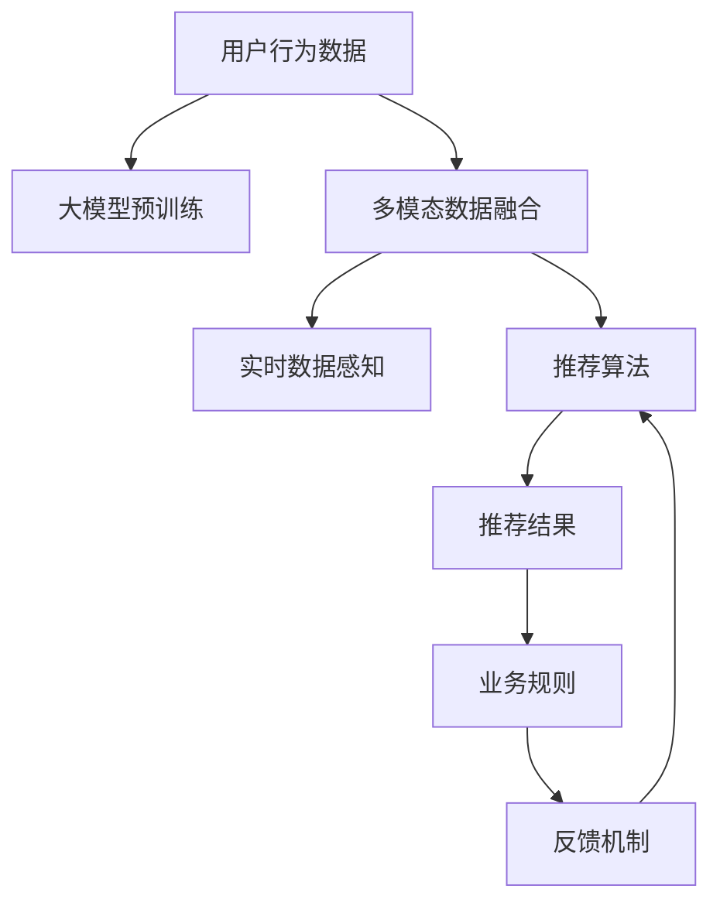

                 

## 1. 背景介绍

### 1.1 问题由来
社交电商行业，如淘宝、京东、拼多多等，通过网络平台聚集了亿万用户，构建了一个庞大的消费场景。这种场景下，用户行为、产品信息、交易记录等数据源丰富多样，提供了丰富的数据支持，使得社交电商企业有机会通过数据驱动的方式优化产品推荐，提升用户粘性和购物体验。

在推荐系统发展初期，由于数据量和计算资源的限制，主要采用基于规则、协同过滤、内容过滤等简单方式。然而，随着数据量的激增，复杂推荐模型的引入，AI大模型开始在社交电商推荐中大放异彩。AI大模型，即采用深度神经网络架构，基于大规模数据进行预训练，能够有效地学习到商品、用户、场景之间的复杂关系，适应了社交电商场景中数据多样性和动态变化的需求。

### 1.2 问题核心关键点
基于AI大模型的社交电商推荐系统，核心在于通过预训练模型捕捉用户与商品的复杂关联，结合业务特征和实时数据，实现个性化的商品推荐。主要关键点包括：

1. **用户行为预测**：利用大模型学习用户历史行为数据，预测用户未来行为，生成商品推荐列表。
2. **商品描述与属性提取**：大模型能够自然语言处理商品描述，提取商品的关键属性，作为推荐特征之一。
3. **场景感知**：结合实时上下文信息（如地理位置、时间、用户在线行为等），增强推荐的相关性和时效性。
4. **多模态数据融合**：社交电商推荐需要融合文本、图像、视频等多模态数据，大模型可利用强大的表示能力，整合多模态信息进行综合推理。
5. **可解释性和公平性**：AI大模型的推荐结果需要具备可解释性，确保决策过程透明公正，避免算法歧视和滥用。

## 2. 核心概念与联系

### 2.1 核心概念概述

社交电商推荐系统涉及多个核心概念，包括：

- **AI大模型**：基于深度学习架构，如Transformer、BERT等，通过大规模无监督数据进行预训练，学习到丰富的语义和结构表示，适用于多模态数据融合和复杂关系建模。
- **推荐算法**：基于用户行为和商品属性，结合业务规则，生成个性化商品推荐列表。
- **多模态数据融合**：将文本、图像、视频等不同模态的数据进行整合，增强推荐系统的表现力。
- **实时数据感知**：结合用户行为和实时场景信息，提升推荐的时效性和个性化。
- **模型可解释性**：利用多种技术手段，对推荐模型的决策过程进行解释，确保其透明性和公平性。

### 2.2 核心概念原理和架构的 Mermaid 流程图



该流程图展示了社交电商推荐系统中，用户行为数据、多模态数据融合、实时数据感知、推荐算法、业务规则和反馈机制之间的关系。大模型的预训练作为基础，融合用户行为数据，多模态数据，并结合实时数据感知，最终通过推荐算法生成推荐结果，经过业务规则的调整，并通过反馈机制不断优化。

## 3. 核心算法原理 & 具体操作步骤

### 3.1 算法原理概述

基于AI大模型的社交电商推荐系统，核心算法可以大致分为以下几个步骤：

1. **大模型预训练**：采用大规模无标签数据，训练深度神经网络模型，捕捉商品、用户、场景之间的复杂关系。
2. **特征提取**：将用户行为、商品属性、实时场景等数据输入到预训练模型中，提取特征向量。
3. **推荐计算**：结合业务规则和实时数据，计算推荐结果。
4. **业务规则调整**：根据推荐结果，结合业务规则进行规则调整，确保推荐结果符合业务逻辑。
5. **反馈机制优化**：通过用户的点击、购买等反馈行为，优化推荐模型。

### 3.2 算法步骤详解

以用户行为预测为例，详细讲解基于AI大模型的推荐算法步骤：

1. **数据准备**：收集用户行为数据，包括浏览历史、购买记录、评分、评论等。
2. **数据预处理**：将数据转化为模型所需的格式，并进行清洗、归一化等预处理。
3. **特征提取**：将用户行为数据输入到大模型中，提取用户行为特征向量。
4. **模型训练**：基于用户行为特征向量，训练推荐模型，优化模型参数。
5. **推荐生成**：结合用户实时行为和场景信息，生成个性化推荐列表。
6. **反馈优化**：根据用户点击、购买等反馈，调整推荐模型参数，优化推荐结果。

### 3.3 算法优缺点

#### 3.3.1 算法优点

1. **泛化能力强**：大模型通过大规模无监督数据进行预训练，可以学习到丰富的语义和结构表示，适用于多模态数据融合和复杂关系建模。
2. **实时性好**：结合实时数据感知技术，可以动态调整推荐策略，适应动态变化的用户行为和场景信息。
3. **推荐准确性高**：大模型通过学习商品和用户之间的关系，能够生成更加准确和个性化的推荐结果。
4. **可扩展性强**：大模型可以轻松地添加新特征，适应社交电商业务的动态扩展需求。

#### 3.3.2 算法缺点

1. **计算资源需求高**：大模型的训练和推理需要大量计算资源，可能面临资源瓶颈。
2. **数据隐私问题**：社交电商推荐系统需要收集大量用户行为数据，存在数据隐私和安全风险。
3. **模型复杂度高**：大模型复杂度较高，训练和推理效率较低。
4. **可解释性不足**：大模型往往作为黑盒模型，难以解释推荐决策的依据，可能影响用户信任。

### 3.4 算法应用领域

基于AI大模型的社交电商推荐系统，主要应用于以下领域：

1. **个性化推荐**：根据用户行为和商品属性，生成个性化商品推荐列表。
2. **新用户激活**：结合用户注册信息和行为数据，推荐新用户感兴趣的商品，提升用户粘性。
3. **商品召回**：通过历史行为和实时数据，对无行为或行为稀少的用户进行商品召回，避免用户流失。
4. **多模态推荐**：结合商品图片、视频等多模态数据，提升推荐多样性和精准性。
5. **实时推荐**：结合实时场景信息，提升推荐的时效性，满足用户实时需求。
6. **动态定价**：根据用户行为和实时数据，动态调整商品价格，提升转化率和销售效果。

## 4. 数学模型和公式 & 详细讲解 & 举例说明

### 4.1 数学模型构建

以基于用户行为预测的推荐系统为例，其数学模型可以构建为：

$$ P(y|x) = \frac{e^{f(y|x)}}{\sum_{y'} e^{f(y'|x)}} $$

其中，$y$ 为推荐结果，$x$ 为用户行为数据，$f$ 为推荐函数，表示基于用户行为数据的推荐概率。

### 4.2 公式推导过程

推荐函数的推导过程如下：

1. **用户行为编码**：将用户行为数据 $x$ 输入到大模型中，得到用户行为特征向量 $u$。
2. **商品特征编码**：将商品数据 $i$ 输入到大模型中，得到商品特征向量 $v$。
3. **用户行为与商品相关性计算**：计算用户行为特征向量 $u$ 与商品特征向量 $v$ 的点积，表示用户行为与商品的相关性 $s(u,v)$。
4. **用户行为相关性加权和**：对所有商品特征向量与用户行为特征向量进行加权求和，得到推荐分数 $f(u,v)$。
5. **推荐概率计算**：将推荐分数 $f(u,v)$ 输入到softmax函数中，得到每个商品的推荐概率 $P(y|x)$。

### 4.3 案例分析与讲解

以用户行为预测为例，假设用户 $x$ 最近浏览了商品 $i_1,i_2,i_3$，分别获取三个商品的特征向量 $v_{i_1},v_{i_2},v_{i_3}$，以及用户行为特征向量 $u$。计算每个商品与用户行为的相似度 $s(u,v_{i_1}),s(u,v_{i_2}),s(u,v_{i_3})$，进行加权求和得到推荐分数 $f(u,v_{i_1})+f(u,v_{i_2})+f(u,v_{i_3})$。将推荐分数输入softmax函数中，得到每个商品的推荐概率 $P(y_1|x),P(y_2|x),P(y_3|x)$。

## 5. 项目实践：代码实例和详细解释说明

### 5.1 开发环境搭建

1. **环境安装**：
   - Python 3.7及以上版本
   - PyTorch 1.9及以上版本
   - TensorFlow 2.5及以上版本
   - HuggingFace Transformers 4.17及以上版本

2. **环境配置**：
   - 安装并配置好相应的依赖包和工具，如Anaconda、Jupyter Notebook、GPU等。
   - 配置好Python环境，确保所有依赖包能够正常运行。

### 5.2 源代码详细实现

以基于用户行为预测的推荐系统为例，提供代码实现步骤：

```python
# 导入依赖包
import torch
from transformers import BertForSequenceClassification, BertTokenizer, AdamW

# 加载预训练模型
model = BertForSequenceClassification.from_pretrained('bert-base-uncased', num_labels=num_labels)

# 初始化模型参数
model.train()

# 定义优化器
optimizer = AdamW(model.parameters(), lr=learning_rate)

# 加载数据
data_loader = DataLoader(dataset, batch_size=batch_size, shuffle=True)

# 训练模型
for epoch in range(num_epochs):
    for batch in data_loader:
        inputs = batch['input_ids'].to(device)
        attention_mask = batch['attention_mask'].to(device)
        labels = batch['labels'].to(device)

        # 前向传播
        outputs = model(inputs, attention_mask=attention_mask)
        loss = outputs.loss

        # 反向传播
        optimizer.zero_grad()
        loss.backward()
        optimizer.step()

# 保存模型
model.save_pretrained(model_dir)
```

### 5.3 代码解读与分析

代码中，首先导入依赖包，并加载预训练的Bert模型。然后初始化模型参数，并定义优化器。接着，加载训练数据，并循环迭代进行训练。在每个epoch中，对每个批次的数据进行前向传播和反向传播，更新模型参数。最后，保存模型。

### 5.4 运行结果展示

在训练完成后，可以通过测试集评估模型性能。具体步骤如下：

1. 加载测试集数据。
2. 将测试集数据输入到模型中进行推理。
3. 计算推荐精度、召回率、F1值等指标。
4. 根据测试结果，调整模型参数，进行重新训练。

## 6. 实际应用场景

### 6.1 智能客服系统

社交电商智能客服系统可以基于大模型进行构建，主要应用场景包括：

1. **用户咨询推荐**：用户通过客服系统咨询商品时，系统根据用户问题和历史行为数据，推荐相关的商品或服务，提升客户满意度。
2. **问题智能解答**：系统根据用户咨询，自动匹配问题，并通过大模型生成回答，减少人工客服的工作负担。
3. **需求预判**：系统根据用户行为，预测用户的需求，提前提供相关信息，提升客户体验。

### 6.2 个性化推荐系统

社交电商个性化推荐系统可以基于大模型进行构建，主要应用场景包括：

1. **商品推荐**：根据用户行为和商品属性，生成个性化商品推荐列表。
2. **新用户激活**：结合用户注册信息和行为数据，推荐新用户感兴趣的商品，提升用户粘性。
3. **商品召回**：通过历史行为和实时数据，对无行为或行为稀少的用户进行商品召回，避免用户流失。

### 6.3 用户行为分析系统

社交电商用户行为分析系统可以基于大模型进行构建，主要应用场景包括：

1. **用户画像生成**：根据用户行为数据，生成用户画像，提供更加个性化的推荐和服务。
2. **用户流失预警**：通过行为分析，预测用户流失概率，提前采取措施，降低流失率。
3. **用户画像聚合**：将不同来源的用户数据进行聚合，生成更加全面的用户画像。

## 7. 工具和资源推荐

### 7.1 学习资源推荐

1. **《深度学习基础》书籍**：涵盖深度学习的基本概念和算法，适合初学者入门。
2. **《深度学习与Python》书籍**：结合Python编程语言，详细介绍深度学习模型的实现。
3. **Coursera《深度学习专项课程》**：由斯坦福大学开设，涵盖深度学习的理论和实践。
4. **Kaggle竞赛平台**：提供丰富的数据集和竞赛，练习深度学习模型的应用。
5. **HuggingFace官方文档**：提供丰富的预训练模型和教程，适合学习大模型的微调和使用。

### 7.2 开发工具推荐

1. **PyTorch**：Python深度学习框架，提供了丰富的模型库和工具支持。
2. **TensorFlow**：Google开发的深度学习框架，适用于大规模模型的训练和部署。
3. **TensorBoard**：可视化工具，用于监控模型训练过程，提供丰富的图表支持。
4. **Weights & Biases**：实验跟踪工具，记录模型训练过程中的各项指标，方便对比和调优。
5. **Jupyter Notebook**：交互式编程环境，适合进行实验和调试。

### 7.3 相关论文推荐

1. **《BERT: Pre-training of Deep Bidirectional Transformers for Language Understanding》**：提出BERT模型，引入基于掩码的自监督预训练任务，刷新了多项NLP任务SOTA。
2. **《Attention is All You Need》**：提出Transformer结构，开启了NLP领域的预训练大模型时代。
3. **《Large Scale Representation Learning with Unsupervised Learning》**：提出XLNet模型，通过自监督学习，提升了大模型的表示能力。
4. **《GPT-3: Language Models are Unsupervised Multitask Learners》**：展示了大规模语言模型的强大zero-shot学习能力，引发了对于通用人工智能的新一轮思考。
5. **《Graph Neural Networks: A Review of Methods and Applications》**：介绍图神经网络在推荐系统中的应用，提升了推荐模型的表现力。

## 8. 总结：未来发展趋势与挑战

### 8.1 研究成果总结

基于AI大模型的社交电商推荐系统，通过预训练模型学习商品、用户和场景之间的复杂关系，结合业务规则和实时数据，生成个性化推荐结果。这一范式已经在电商、客服、用户行为分析等多个场景中取得了良好的效果。

### 8.2 未来发展趋势

未来，社交电商推荐系统将在以下几个方面继续发展：

1. **多模态融合**：结合文本、图像、视频等多模态数据，提升推荐系统的表现力。
2. **实时推荐**：结合实时数据，动态调整推荐策略，适应动态变化的用户行为和场景信息。
3. **智能客服**：基于大模型的智能客服系统，可以自动解答用户咨询，提升客户满意度。
4. **个性化推荐**：结合用户画像和行为数据，生成更加精准的个性化推荐。
5. **跨平台融合**：跨不同平台的推荐系统，通过联邦学习等技术，共享用户行为数据，提升推荐效果。

### 8.3 面临的挑战

尽管社交电商推荐系统取得了一定的进展，但仍面临诸多挑战：

1. **计算资源瓶颈**：大模型的训练和推理需要大量计算资源，可能面临资源瓶颈。
2. **数据隐私问题**：社交电商推荐系统需要收集大量用户行为数据，存在数据隐私和安全风险。
3. **模型复杂度高**：大模型复杂度较高，训练和推理效率较低。
4. **可解释性不足**：大模型往往作为黑盒模型，难以解释推荐决策的依据，可能影响用户信任。

### 8.4 研究展望

未来，社交电商推荐系统需要在以下几个方面进行进一步研究：

1. **高效训练和推理**：通过优化模型架构和算法，提高大模型的训练和推理效率，降低计算资源需求。
2. **数据隐私保护**：采用差分隐私等技术，保护用户数据隐私和安全。
3. **模型可解释性**：通过模型压缩、可视化等技术手段，提升大模型的可解释性，确保决策透明公正。
4. **多平台融合**：通过联邦学习等技术，跨不同平台实现用户行为的联合建模，提升推荐效果。
5. **智能客服**：基于大模型的智能客服系统，可以自动解答用户咨询，提升客户满意度。

## 9. 附录：常见问题与解答

**Q1：社交电商推荐系统如何实现多模态融合？**

A: 社交电商推荐系统实现多模态融合的方法包括：

1. **多模态特征提取**：将文本、图像、视频等多模态数据输入到预训练模型中，提取特征向量。
2. **特征融合**：将不同模态的特征向量进行融合，提升特征表示能力。
3. **综合推理**：结合多模态特征向量，进行综合推理，生成推荐结果。

**Q2：社交电商推荐系统如何实现实时推荐？**

A: 社交电商推荐系统实现实时推荐的方法包括：

1. **实时数据感知**：结合用户行为和实时场景信息，动态调整推荐策略。
2. **数据流处理**：采用流式数据处理框架，实时处理用户行为数据。
3. **推荐模型优化**：基于实时数据，动态调整推荐模型参数，优化推荐结果。

**Q3：社交电商推荐系统如何保护用户数据隐私？**

A: 社交电商推荐系统保护用户数据隐私的方法包括：

1. **差分隐私**：采用差分隐私技术，保护用户数据的隐私性。
2. **数据匿名化**：对用户数据进行匿名化处理，避免用户身份信息的泄露。
3. **数据访问控制**：采用访问控制机制，限制数据访问权限，防止数据泄露。

**Q4：社交电商推荐系统如何提升可解释性？**

A: 社交电商推荐系统提升可解释性的方法包括：

1. **模型可视化**：采用可视化技术，展示推荐模型的内部结构和推理过程。
2. **特征解释**：对模型生成的特征向量进行解释，提供对推荐决策的详细分析。
3. **用户反馈**：通过用户反馈，了解推荐结果的合理性，优化推荐模型。

---

作者：禅与计算机程序设计艺术 / Zen and the Art of Computer Programming

