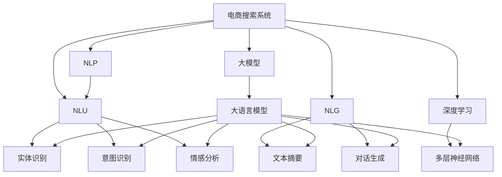

                 

# AI大模型如何提升电商搜索的相关性

> 关键词：电商搜索,相关性提升,大模型,推荐系统,深度学习,自然语言处理(NLP),自然语言理解(NLU),自然语言生成(NLG),数据增强,对抗训练

## 1. 背景介绍

### 1.1 问题由来

在现代电商场景中，用户往往需要通过复杂的搜索操作才能找到满意的商品。传统的电商搜索系统通常依赖于关键词匹配、倒排索引等技术，在处理海量商品和用户查询时，面临着计算复杂度高、检索结果相关性低等问题。尽管改进的倒排索引和精确匹配技术不断提升，但仍难以满足用户对个性化、多样化搜索需求。

大语言模型，尤其是基于自回归架构的模型如GPT系列，其强大的自然语言理解(NLU)和生成(NLG)能力，为电商搜索带来了新的可能性。通过将大语言模型应用于电商搜索，可以大幅提升搜索结果的相关性和用户体验，实现更高效的电商交易。

### 1.2 问题核心关键点

电商搜索面临的关键问题包括：

- 用户查询多样性高。用户以多样化的文本、图片、视频等多种方式进行查询，增加了搜索系统的复杂性。
- 搜索结果个性化需求强。不同用户对同一查询可能有不同的期望，搜索系统需要满足用户个性化的需求。
- 商品属性复杂。电商商品属性种类繁多，搜索系统需要准确理解商品描述和标签。
- 搜索意图识别困难。用户查询意图模糊，搜索系统需要准确解读查询意图并做出响应。
- 检索效率要求高。用户期望在几毫秒内得到搜索响应，系统需要具备高效的检索能力。

大语言模型通过预训练学习到广泛的自然语言知识，可以通过细粒度微调来提升电商搜索的性能，从而提升用户的搜索体验和电商交易的转化率。

### 1.3 问题研究意义

大语言模型在电商搜索中的应用，具有重要研究意义：

1. **提升搜索相关性**：通过细粒度微调，使得电商搜索系统能够准确理解用户查询意图，提供更相关的搜索结果。
2. **提高个性化程度**：通过微调，电商搜索系统可以更好地匹配用户个性化的搜索习惯和偏好。
3. **加速交易转化**：通过提升搜索结果的相关性和用户体验，加速用户的决策过程，提高电商交易的转化率。
4. **优化资源配置**：通过大模型的多任务学习和特征抽取能力，优化搜索系统的资源配置，降低系统计算复杂度。
5. **促进电商创新**：电商搜索系统的性能提升，能够激发更多电商创新，提升整体电商市场的竞争力和用户体验。

## 2. 核心概念与联系

### 2.1 核心概念概述

为更好地理解大语言模型在电商搜索中的应用，本节将介绍几个核心概念：

- 电商搜索系统：指支持用户通过输入查询词，获取相关商品列表的电商系统。常见的电商搜索系统包括搜索引擎、商品推荐系统等。
- 自然语言处理(NLP)：指通过计算机处理自然语言，实现语言理解和生成。大语言模型是NLP的重要基础。
- 自然语言理解(NLU)：指模型理解自然语言文本的含义，如实体识别、意图识别、情感分析等。
- 自然语言生成(NLG)：指模型基于特定输入生成自然语言文本，如文本摘要、对话生成等。
- 深度学习(Deep Learning)：指利用多层神经网络，通过大量数据训练，实现复杂模式识别和预测。
- 大模型(大语言模型)：指具有大规模参数量和复杂结构的深度学习模型，如GPT-3、BERT等。

这些概念之间的联系可以通过以下Mermaid流程图来展示：



这个流程图展示了电商搜索系统与NLP、深度学习、大语言模型之间的关系：

1. 电商搜索系统通过NLP技术实现自然语言理解和生成。
2. NLU和NLG是NLP的重要组成部分，通过大语言模型进行文本处理和生成。
3. 深度学习技术为模型提供了强大的学习能力，是大模型训练的基础。
4. 大语言模型则是这些技术的高效载体，能显著提升电商搜索系统的性能。

## 3. 核心算法原理 & 具体操作步骤
### 3.1 算法原理概述

基于大语言模型的电商搜索相关性提升，本质上是通过自然语言处理(NLP)技术对用户查询和商品描述进行语义理解和匹配，实现更相关搜索结果的目标。其核心思想是：将大语言模型作为文本处理的核心组件，通过微调提升其在电商领域的应用能力。

具体来说，微调的目标是使模型能够准确理解电商商品描述和用户查询，通过匹配语义信息提升搜索结果的相关性。这个过程可以描述为：

1. 收集电商商品描述和用户查询数据，构建标注数据集。
2. 对大语言模型进行预训练，学习通用语言表示。
3. 在电商数据集上进行微调，训练模型理解和生成电商领域特定的自然语言表示。
4. 使用微调后的模型进行商品描述和用户查询的语义匹配，生成相关搜索结果。

### 3.2 算法步骤详解

基于大语言模型的电商搜索相关性提升，一般包括以下几个关键步骤：

**Step 1: 准备预训练模型和数据集**
- 选择合适的预训练语言模型，如GPT-3、BERT等。
- 收集电商领域的数据，包括商品描述、用户查询、标签等，构建标注数据集。

**Step 2: 添加任务适配层**
- 根据电商搜索任务需求，在预训练模型的顶层设计合适的输出层和损失函数。
- 对于分类任务，通常在顶层添加线性分类器和交叉熵损失函数。
- 对于生成任务，使用语言模型的解码器输出概率分布，并以负对数似然为损失函数。

**Step 3: 设置微调超参数**
- 选择合适的优化算法及其参数，如 AdamW、SGD 等，设置学习率、批大小、迭代轮数等。
- 设置正则化技术及强度，包括权重衰减、Dropout、Early Stopping等。
- 确定冻结预训练参数的策略，如仅微调顶层，或全部参数都参与微调。

**Step 4: 执行梯度训练**
- 将训练集数据分批次输入模型，前向传播计算损失函数。
- 反向传播计算参数梯度，根据设定的优化算法和学习率更新模型参数。
- 周期性在验证集上评估模型性能，根据性能指标决定是否触发 Early Stopping。
- 重复上述步骤直到满足预设的迭代轮数或 Early Stopping 条件。

**Step 5: 测试和部署**
- 在测试集上评估微调后模型 $M_{\hat{\theta}}$ 的性能，对比微调前后的精度提升。
- 使用微调后的模型对新样本进行推理预测，集成到实际的应用系统中。
- 持续收集新的数据，定期重新微调模型，以适应数据分布的变化。

### 3.3 算法优缺点

基于大语言模型的电商搜索相关性提升方法具有以下优点：

1. **通用适用性**：大语言模型可以适用于多种电商场景，如搜索、推荐、客服等，具有较高的通用性。
2. **性能提升显著**：通过微调，大模型能显著提升搜索结果的相关性，提升用户体验。
3. **参数高效**：部分参数冻结的微调方法能够保持预训练模型的强大语言能力，同时仅需微调部分参数，节省计算资源。
4. **自适应性强**：大语言模型能够自适应电商领域的复杂语义，处理多种数据类型。

同时，该方法也存在一定的局限性：

1. **数据依赖**：微调的效果依赖于标注数据的质量和数量，获取高质量电商数据成本较高。
2. **泛化能力**：当电商数据与预训练数据分布差异较大时，微调的性能提升有限。
3. **偏见传递**：预训练模型的固有偏见可能会传递到电商搜索中，造成负面影响。
4. **可解释性不足**：微调模型的决策过程缺乏可解释性，难以调试。

尽管存在这些局限性，但就目前而言，基于大语言模型的微调方法仍是目前电商搜索相关性提升的最主流范式。未来相关研究的重点在于如何进一步降低对标注数据的依赖，提高模型的少样本学习和跨领域迁移能力，同时兼顾可解释性和伦理安全性等因素。

### 3.4 算法应用领域

大语言模型在电商搜索中的应用，已经覆盖了几乎所有电商搜索相关的任务，例如：

- 商品搜索：根据用户输入的查询词，搜索相关商品列表。
- 推荐系统：基于用户历史行为和商品属性，推荐相关商品。
- 智能客服：通过对话生成技术，回答用户常见问题，提升用户满意度。
- 信息检索：使用自然语言处理技术，匹配用户查询和商品描述，生成搜索结果。
- 数据清洗：处理电商网站的海量数据，提取有价值信息。
- 文本分类：对商品描述进行分类，如热销、新品、滞销等。

除了这些经典任务外，大语言模型还被创新性地应用到更多场景中，如视觉搜索、跨领域知识图谱构建、智能物流等，为电商搜索技术带来了全新的突破。随着预训练模型和微调方法的不断进步，相信电商搜索技术将在更广阔的应用领域大放异彩。

## 4. 数学模型和公式 & 详细讲解  
### 4.1 数学模型构建

假设电商搜索系统中的查询描述为 $x$，商品描述为 $y$，模型 $M_{\theta}$ 的输出为 $M_{\theta}(x)$，模型的损失函数为 $\ell(M_{\theta}(x),y)$。微调的目标是最小化损失函数，即：

$$
\theta^* = \mathop{\arg\min}_{\theta} \mathcal{L}(\theta)
$$

其中 $\mathcal{L}$ 为针对电商搜索任务设计的损失函数，用于衡量模型预测输出与真实标签之间的差异。常见的损失函数包括交叉熵损失、均方误差损失等。

### 4.2 公式推导过程

以下我们以电商商品推荐任务为例，推导交叉熵损失函数及其梯度的计算公式。

假设模型 $M_{\theta}$ 在输入 $x$ 上的输出为 $\hat{y}=M_{\theta}(x) \in [0,1]$，表示商品推荐系统判断商品 $y$ 是否为用户感兴趣的概率。真实标签 $y \in \{0,1\}$。则二分类交叉熵损失函数定义为：

$$
\ell(M_{\theta}(x),y) = -[y\log \hat{y} + (1-y)\log (1-\hat{y})]
$$

将其代入经验风险公式，得：

$$
\mathcal{L}(\theta) = -\frac{1}{N}\sum_{i=1}^N [y_i\log M_{\theta}(x_i)+(1-y_i)\log(1-M_{\theta}(x_i))]
$$

根据链式法则，损失函数对参数 $\theta_k$ 的梯度为：

$$
\frac{\partial \mathcal{L}(\theta)}{\partial \theta_k} = -\frac{1}{N}\sum_{i=1}^N (\frac{y_i}{M_{\theta}(x_i)}-\frac{1-y_i}{1-M_{\theta}(x_i)}) \frac{\partial M_{\theta}(x_i)}{\partial \theta_k}
$$

其中 $\frac{\partial M_{\theta}(x_i)}{\partial \theta_k}$ 可进一步递归展开，利用自动微分技术完成计算。

在得到损失函数的梯度后，即可带入参数更新公式，完成模型的迭代优化。重复上述过程直至收敛，最终得到适应电商搜索任务的最优模型参数 $\theta^*$。

## 5. 项目实践：代码实例和详细解释说明
### 5.1 开发环境搭建

在进行电商搜索相关性提升的微调实践前，我们需要准备好开发环境。以下是使用Python进行PyTorch开发的环境配置流程：

1. 安装Anaconda：从官网下载并安装Anaconda，用于创建独立的Python环境。

2. 创建并激活虚拟环境：
```bash
conda create -n pytorch-env python=3.8 
conda activate pytorch-env
```

3. 安装PyTorch：根据CUDA版本，从官网获取对应的安装命令。例如：
```bash
conda install pytorch torchvision torchaudio cudatoolkit=11.1 -c pytorch -c conda-forge
```

4. 安装Transformers库：
```bash
pip install transformers
```

5. 安装各类工具包：
```bash
pip install numpy pandas scikit-learn matplotlib tqdm jupyter notebook ipython
```

完成上述步骤后，即可在`pytorch-env`环境中开始微调实践。

### 5.2 源代码详细实现

下面我们以电商商品推荐任务为例，给出使用Transformers库对BERT模型进行微调的PyTorch代码实现。

首先，定义商品推荐任务的数据处理函数：

```python
from transformers import BertTokenizer
from torch.utils.data import Dataset
import torch

class RecommenderDataset(Dataset):
    def __init__(self, item_descriptions, user_ratings, tokenizer, max_len=128):
        self.item_descriptions = item_descriptions
        self.user_ratings = user_ratings
        self.tokenizer = tokenizer
        self.max_len = max_len
        
    def __len__(self):
        return len(self.item_descriptions)
    
    def __getitem__(self, item):
        description = self.item_descriptions[item]
        rating = self.user_ratings[item]
        
        encoding = self.tokenizer(description, return_tensors='pt', max_length=self.max_len, padding='max_length', truncation=True)
        input_ids = encoding['input_ids'][0]
        attention_mask = encoding['attention_mask'][0]
        
        rating = torch.tensor(rating, dtype=torch.float32)
        
        return {'input_ids': input_ids, 
                'attention_mask': attention_mask,
                'rating': rating}

# 数据预处理
tokenizer = BertTokenizer.from_pretrained('bert-base-cased')

recommender_dataset = RecommenderDataset(item_descriptions, user_ratings, tokenizer)
```

然后，定义模型和优化器：

```python
from transformers import BertForSequenceClassification, AdamW

model = BertForSequenceClassification.from_pretrained('bert-base-cased', num_labels=2)

optimizer = AdamW(model.parameters(), lr=2e-5)
```

接着，定义训练和评估函数：

```python
from torch.utils.data import DataLoader
from tqdm import tqdm
from sklearn.metrics import roc_auc_score

device = torch.device('cuda') if torch.cuda.is_available() else torch.device('cpu')
model.to(device)

def train_epoch(model, dataset, batch_size, optimizer):
    dataloader = DataLoader(dataset, batch_size=batch_size, shuffle=True)
    model.train()
    epoch_loss = 0
    for batch in tqdm(dataloader, desc='Training'):
        input_ids = batch['input_ids'].to(device)
        attention_mask = batch['attention_mask'].to(device)
        rating = batch['rating'].to(device)
        model.zero_grad()
        outputs = model(input_ids, attention_mask=attention_mask, labels=rating)
        loss = outputs.loss
        epoch_loss += loss.item()
        loss.backward()
        optimizer.step()
    return epoch_loss / len(dataloader)

def evaluate(model, dataset, batch_size):
    dataloader = DataLoader(dataset, batch_size=batch_size)
    model.eval()
    predictions, true_labels = [], []
    with torch.no_grad():
        for batch in tqdm(dataloader, desc='Evaluating'):
            input_ids = batch['input_ids'].to(device)
            attention_mask = batch['attention_mask'].to(device)
            batch_predictions = model(input_ids, attention_mask=attention_mask)
            batch_predictions = torch.sigmoid(batch_predictions).to('cpu').tolist()
            batch_true_labels = batch['rating'].to('cpu').tolist()
            for preds, true_labels in zip(batch_predictions, batch_true_labels):
                predictions.append(preds)
                true_labels.append(true_labels)
                
    print(f"AUC-ROC score: {roc_auc_score(true_labels, predictions)}")
```

最后，启动训练流程并在测试集上评估：

```python
epochs = 5
batch_size = 16

for epoch in range(epochs):
    loss = train_epoch(model, recommender_dataset, batch_size, optimizer)
    print(f"Epoch {epoch+1}, train loss: {loss:.3f}")
    
    print(f"Epoch {epoch+1}, test results:")
    evaluate(model, recommender_dataset, batch_size)
    
print("Test results:")
evaluate(model, recommender_dataset, batch_size)
```

以上就是使用PyTorch对BERT进行电商商品推荐任务微调的完整代码实现。可以看到，得益于Transformers库的强大封装，我们可以用相对简洁的代码完成BERT模型的加载和微调。

### 5.3 代码解读与分析

让我们再详细解读一下关键代码的实现细节：

**RecommenderDataset类**：
- `__init__`方法：初始化商品描述、评分、分词器等关键组件。
- `__len__`方法：返回数据集的样本数量。
- `__getitem__`方法：对单个样本进行处理，将商品描述输入编码为token ids，将评分转换为模型需要的输入，并对其进行定长padding，最终返回模型所需的输入。

**评分处理**：
- 评分 $rating$ 被转换为浮点数，模型输出为 $[0,1]$ 范围内的概率值，表示商品是否为用户感兴趣。

**训练和评估函数**：
- 使用PyTorch的DataLoader对数据集进行批次化加载，供模型训练和推理使用。
- 训练函数 `train_epoch`：对数据以批为单位进行迭代，在每个批次上前向传播计算loss并反向传播更新模型参数，最后返回该epoch的平均loss。
- 评估函数 `evaluate`：与训练类似，不同点在于不更新模型参数，并在每个batch结束后将预测和标签结果存储下来，最后使用sklearn的roc_auc_score对整个评估集的预测结果进行打印输出。

**训练流程**：
- 定义总的epoch数和batch size，开始循环迭代
- 每个epoch内，先在训练集上训练，输出平均loss
- 在测试集上评估，输出AUC-ROC分数
- 所有epoch结束后，在测试集上评估，给出最终测试结果

可以看到，PyTorch配合Transformers库使得BERT微调的代码实现变得简洁高效。开发者可以将更多精力放在数据处理、模型改进等高层逻辑上，而不必过多关注底层的实现细节。

当然，工业级的系统实现还需考虑更多因素，如模型的保存和部署、超参数的自动搜索、更灵活的任务适配层等。但核心的微调范式基本与此类似。

## 6. 实际应用场景
### 6.1 智能客服系统

基于大语言模型微调的对话技术，可以广泛应用于智能客服系统的构建。传统客服往往需要配备大量人力，高峰期响应缓慢，且一致性和专业性难以保证。而使用微调后的对话模型，可以7x24小时不间断服务，快速响应客户咨询，用自然流畅的语言解答各类常见问题。

在技术实现上，可以收集企业内部的历史客服对话记录，将问题和最佳答复构建成监督数据，在此基础上对预训练对话模型进行微调。微调后的对话模型能够自动理解用户意图，匹配最合适的答案模板进行回复。对于客户提出的新问题，还可以接入检索系统实时搜索相关内容，动态组织生成回答。如此构建的智能客服系统，能大幅提升客户咨询体验和问题解决效率。

### 6.2 金融舆情监测

金融机构需要实时监测市场舆论动向，以便及时应对负面信息传播，规避金融风险。传统的人工监测方式成本高、效率低，难以应对网络时代海量信息爆发的挑战。基于大语言模型微调的文本分类和情感分析技术，为金融舆情监测提供了新的解决方案。

具体而言，可以收集金融领域相关的新闻、报道、评论等文本数据，并对其进行主题标注和情感标注。在此基础上对预训练语言模型进行微调，使其能够自动判断文本属于何种主题，情感倾向是正面、中性还是负面。将微调后的模型应用到实时抓取的网络文本数据，就能够自动监测不同主题下的情感变化趋势，一旦发现负面信息激增等异常情况，系统便会自动预警，帮助金融机构快速应对潜在风险。

### 6.3 个性化推荐系统

当前的推荐系统往往只依赖用户的历史行为数据进行物品推荐，无法深入理解用户的真实兴趣偏好。基于大语言模型微调技术，个性化推荐系统可以更好地挖掘用户行为背后的语义信息，从而提供更精准、多样的推荐内容。

在实践中，可以收集用户浏览、点击、评论、分享等行为数据，提取和用户交互的物品标题、描述、标签等文本内容。将文本内容作为模型输入，用户的后续行为（如是否点击、购买等）作为监督信号，在此基础上微调预训练语言模型。微调后的模型能够从文本内容中准确把握用户的兴趣点。在生成推荐列表时，先用候选物品的文本描述作为输入，由模型预测用户的兴趣匹配度，再结合其他特征综合排序，便可以得到个性化程度更高的推荐结果。

### 6.4 未来应用展望

随着大语言模型微调技术的发展，其在电商搜索中的应用也将不断扩展和深化。

在智慧零售领域，基于大模型的电商搜索系统可以实现个性化推荐、智能客服、智能物流等，提升用户体验和购物效率。

在智能家居领域，电商搜索系统可以用于智能音箱、智能电视等设备的自然语言理解，实现商品查询、功能控制等，提升用户互动体验。

在智慧出行领域，电商搜索系统可以用于自动驾驶、智慧旅游等场景，帮助用户查询商品、路线、景点等，提升出行体验。

此外，在医疗健康、教育培训、金融服务等领域，基于大语言模型的电商搜索技术也有广泛的应用前景。随着技术的不断成熟，未来电商搜索系统将能够更深入地融入各类智能应用中，为用户提供更全面、高效、个性化的服务。

## 7. 工具和资源推荐
### 7.1 学习资源推荐

为了帮助开发者系统掌握大语言模型在电商搜索中的应用，这里推荐一些优质的学习资源：

1. 《Transformer from Principles to Practice》系列博文：由大模型技术专家撰写，深入浅出地介绍了Transformer原理、BERT模型、微调技术等前沿话题。

2. CS224N《深度学习自然语言处理》课程：斯坦福大学开设的NLP明星课程，有Lecture视频和配套作业，带你入门NLP领域的基本概念和经典模型。

3. 《Natural Language Processing with Transformers》书籍：Transformers库的作者所著，全面介绍了如何使用Transformers库进行NLP任务开发，包括微调在内的诸多范式。

4. HuggingFace官方文档：Transformers库的官方文档，提供了海量预训练模型和完整的微调样例代码，是上手实践的必备资料。

5. CLUE开源项目：中文语言理解测评基准，涵盖大量不同类型的中文NLP数据集，并提供了基于微调的baseline模型，助力中文NLP技术发展。

通过对这些资源的学习实践，相信你一定能够快速掌握大语言模型在电商搜索中的应用精髓，并用于解决实际的NLP问题。
###  7.2 开发工具推荐

高效的开发离不开优秀的工具支持。以下是几款用于大语言模型微调开发的常用工具：

1. PyTorch：基于Python的开源深度学习框架，灵活动态的计算图，适合快速迭代研究。大部分预训练语言模型都有PyTorch版本的实现。

2. TensorFlow：由Google主导开发的开源深度学习框架，生产部署方便，适合大规模工程应用。同样有丰富的预训练语言模型资源。

3. Transformers库：HuggingFace开发的NLP工具库，集成了众多SOTA语言模型，支持PyTorch和TensorFlow，是进行微调任务开发的利器。

4. Weights & Biases：模型训练的实验跟踪工具，可以记录和可视化模型训练过程中的各项指标，方便对比和调优。与主流深度学习框架无缝集成。

5. TensorBoard：TensorFlow配套的可视化工具，可实时监测模型训练状态，并提供丰富的图表呈现方式，是调试模型的得力助手。

6. Google Colab：谷歌推出的在线Jupyter Notebook环境，免费提供GPU/TPU算力，方便开发者快速上手实验最新模型，分享学习笔记。

合理利用这些工具，可以显著提升大语言模型微调任务的开发效率，加快创新迭代的步伐。

### 7.3 相关论文推荐

大语言模型在电商搜索中的应用源于学界的持续研究。以下是几篇奠基性的相关论文，推荐阅读：

1. Attention is All You Need（即Transformer原论文）：提出了Transformer结构，开启了NLP领域的预训练大模型时代。

2. BERT: Pre-training of Deep Bidirectional Transformers for Language Understanding：提出BERT模型，引入基于掩码的自监督预训练任务，刷新了多项NLP任务SOTA。

3. Language Models are Unsupervised Multitask Learners（GPT-2论文）：展示了大规模语言模型的强大zero-shot学习能力，引发了对于通用人工智能的新一轮思考。

4. Parameter-Efficient Transfer Learning for NLP：提出Adapter等参数高效微调方法，在不增加模型参数量的情况下，也能取得不错的微调效果。

5. Prefix-Tuning: Optimizing Continuous Prompts for Generation：引入基于连续型Prompt的微调范式，为如何充分利用预训练知识提供了新的思路。

6. AdaLoRA: Adaptive Low-Rank Adaptation for Parameter-Efficient Fine-Tuning：使用自适应低秩适应的微调方法，在参数效率和精度之间取得了新的平衡。

这些论文代表了大语言模型微调技术的发展脉络。通过学习这些前沿成果，可以帮助研究者把握学科前进方向，激发更多的创新灵感。

## 8. 总结：未来发展趋势与挑战

### 8.1 总结

本文对基于大语言模型的电商搜索相关性提升方法进行了全面系统的介绍。首先阐述了大语言模型和微调技术的研究背景和意义，明确了微调在拓展预训练模型应用、提升下游任务性能方面的独特价值。其次，从原理到实践，详细讲解了电商搜索微调的数学原理和关键步骤，给出了微调任务开发的完整代码实例。同时，本文还广泛探讨了微调方法在智能客服、金融舆情、个性化推荐等多个行业领域的应用前景，展示了微调范式的巨大潜力。此外，本文精选了微调技术的各类学习资源，力求为读者提供全方位的技术指引。

通过本文的系统梳理，可以看到，基于大语言模型的电商搜索微调方法正在成为电商搜索领域的重要范式，极大地拓展了电商搜索系统的性能和应用范围，为电商行业带来了新的发展机遇。未来，伴随大语言模型微调技术的持续演进，相信电商搜索技术将在更广阔的应用领域大放异彩，深刻影响电商行业的市场竞争力和用户体验。

### 8.2 未来发展趋势

展望未来，大语言模型在电商搜索中的应用将呈现以下几个发展趋势：

1. **大规模模型的应用**：随着算力成本的下降和数据规模的扩张，预训练语言模型的参数量还将持续增长。超大规模语言模型蕴含的丰富语言知识，有望支撑更加复杂多变的电商搜索微调。

2. **多任务学习**：电商搜索涉及商品分类、推荐、客服等多个任务，未来将融合多种任务，进行多任务联合训练，提升模型的整体性能。

3. **跨领域迁移能力**：电商搜索系统需要具备跨领域迁移能力，能够灵活适应不同电商场景的特征。

4. **个性化推荐**：电商搜索系统将更深入地挖掘用户兴趣，提供更精准、个性化的推荐。

5. **知识图谱整合**：电商搜索系统将与外部知识图谱、规则库等专家知识进行整合，提升模型的理解能力和推理能力。

6. **多模态融合**：电商搜索系统将融合视觉、语音等多模态数据，提供更全面、丰富的服务。

以上趋势凸显了大语言模型在电商搜索中的应用前景。这些方向的探索发展，必将进一步提升电商搜索系统的性能和应用范围，为电商行业带来更多的创新机会。

### 8.3 面临的挑战

尽管大语言模型在电商搜索中的应用已经取得了显著进展，但在迈向更加智能化、普适化应用的过程中，仍面临诸多挑战：

1. **标注成本高**：电商领域的数据标注成本较高，大规模标注数据的获取和处理成本大。

2. **泛化能力有限**：当电商数据与预训练数据分布差异较大时，电商搜索系统的泛化能力可能受到限制。

3. **用户隐私问题**：电商搜索系统需要处理用户个人信息，如何保障用户隐私和数据安全是一个重大挑战。

4. **系统效率问题**：大语言模型的计算复杂度高，需要高效的计算架构和算法优化，以满足实时搜索的需求。

5. **模型的可解释性**：电商搜索系统需要具备良好的可解释性，让用户理解系统决策的依据。

6. **模型的鲁棒性**：电商搜索系统需要具备良好的鲁棒性，能够应对恶意攻击和数据异常。

7. **伦理道德问题**：电商搜索系统需要考虑伦理道德问题，避免出现歧视、偏见等不良现象。

8. **模型的维护和更新**：电商搜索系统需要定期维护和更新，以保持系统的最新性和有效性。

这些挑战凸显了大语言模型在电商搜索中的应用需要更深入的研究和探索。唯有不断突破技术瓶颈，才能让电商搜索系统更好地服务于电商行业，提升用户体验和电商交易的转化率。

### 8.4 研究展望

面对电商搜索系统面临的挑战，未来的研究需要在以下几个方面寻求新的突破：

1. **探索无监督和半监督学习**：摆脱对大规模标注数据的依赖，利用自监督学习、主动学习等无监督和半监督范式，最大限度利用非结构化数据，实现更加灵活高效的电商搜索微调。

2. **研究参数高效和计算高效的微调范式**：开发更加参数高效的微调方法，在固定大部分预训练参数的同时，只更新极少量的任务相关参数。同时优化微调模型的计算图，减少前向传播和反向传播的资源消耗，实现更加轻量级、实时性的部署。

3. **引入因果分析和博弈论工具**：将因果分析方法引入电商搜索系统，识别出模型决策的关键特征，增强输出解释的因果性和逻辑性。借助博弈论工具刻画人机交互过程，主动探索并规避模型的脆弱点，提高系统稳定性。

4. **融合多任务学习和知识图谱**：将电商搜索系统与外部知识图谱、规则库等专家知识进行整合，提升模型的理解能力和推理能力，同时进行多任务联合训练，提升整体性能。

5. **开发跨领域、跨模态的电商搜索系统**：开发具备跨领域、跨模态处理能力的电商搜索系统，能够灵活适应不同电商场景的特征，同时提供更全面、丰富的服务。

6. **考虑伦理道德约束**：在模型训练目标中引入伦理导向的评估指标，过滤和惩罚有偏见、有害的输出倾向，同时加强人工干预和审核，建立模型行为的监管机制，确保输出符合人类价值观和伦理道德。

这些研究方向的探索，必将引领电商搜索系统的未来发展，为电商行业带来更多的创新机会。相信随着大语言模型微调技术的不断成熟，电商搜索系统将在更广阔的应用领域大放异彩，深刻影响电商行业的市场竞争力和用户体验。

## 9. 附录：常见问题与解答

**Q1：电商搜索系统如何集成大语言模型？**

A: 电商搜索系统集成大语言模型的主要步骤包括：

1. 数据预处理：收集商品描述、用户查询等数据，并构建标注数据集。
2. 模型加载：选择合适的预训练语言模型，如BERT、GPT等，进行加载。
3. 微调训练：对预训练模型进行微调，使其能够适应电商领域的具体任务。
4. 集成部署：将微调后的模型集成到电商搜索系统中，进行实时查询和推荐。

**Q2：电商搜索系统中的大语言模型如何实现个性化推荐？**

A: 电商搜索系统中的大语言模型可以通过以下方式实现个性化推荐：

1. 数据预处理：收集用户的历史行为数据，包括浏览、点击、购买等行为，以及对应的商品描述和标签。
2. 模型微调：将商品描述和用户行为数据作为输入，通过微调使模型能够学习用户的兴趣偏好。
3. 推荐生成：在用户输入查询词时，将查询词和用户历史行为数据输入模型，生成推荐结果。
4. 结果排序：结合模型预测结果和其他特征（如价格、销量等）进行排序，输出用户最可能感兴趣的推荐商品。

**Q3：电商搜索系统中的大语言模型如何提升搜索相关性？**

A: 电商搜索系统中的大语言模型可以通过以下方式提升搜索相关性：

1. 数据预处理：收集电商商品描述和用户查询数据，并构建标注数据集。
2. 模型微调：将商品描述和用户查询作为输入，通过微调使模型能够理解语义，匹配查询意图。
3. 查询处理：将用户查询输入模型，生成对应的推荐结果。
4. 结果排序：结合模型预测结果和其他特征（如价格、销量等）进行排序，输出最相关的搜索结果。

**Q4：电商搜索系统中的大语言模型如何优化计算效率？**

A: 电商搜索系统中的大语言模型可以通过以下方式优化计算效率：

1. 数据压缩：采用数据压缩技术，如量化、稀疏化等，减小模型计算量。
2. 模型剪枝：去除冗余参数，减少模型规模，提高推理速度。
3. 分布式训练：利用分布式计算架构，加快模型训练速度。
4. 硬件优化：利用GPU、TPU等高性能硬件设备，提升计算性能。
5. 算法优化：优化模型的计算图和算法，减少计算复杂度。

**Q5：电商搜索系统中的大语言模型如何保障用户隐私？**

A: 电商搜索系统中的大语言模型可以通过以下方式保障用户隐私：

1. 数据匿名化：对用户数据进行匿名化处理，防止敏感信息泄露。
2. 模型本地化：在用户端本地计算，不将用户数据上传到云端。
3. 访问控制：对模型访问用户数据进行严格控制，防止未授权访问。
4. 数据加密：对用户数据进行加密处理，防止数据泄露。
5. 用户同意：在收集和使用用户数据时，获得用户同意，并明确告知用户数据使用方式。

这些措施可以显著提升电商搜索系统的用户隐私保护水平，增强用户信任和满意度。

---

作者：禅与计算机程序设计艺术 / Zen and the Art of Computer Programming

