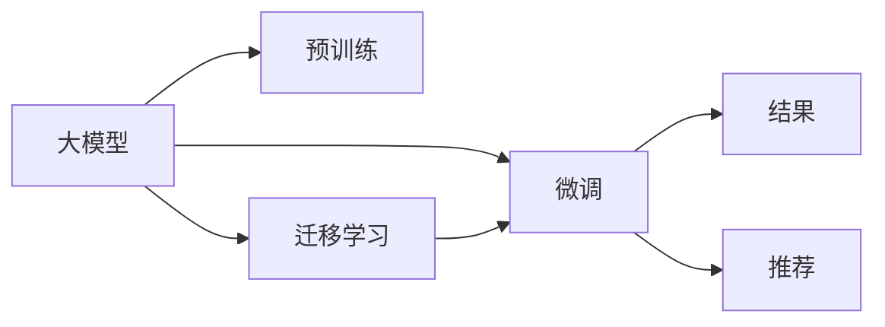

                 

## 1. 背景介绍

### 1.1 问题由来
在当今电商环境中，移动设备的普及和应用使消费者越来越多地通过手机进行搜索和购买商品。移动搜索体验（Mobile Search Experience）直接影响到用户对电商平台的认知和满意度。大模型在自然语言处理（NLP）领域的突破性进展为改善移动搜索体验提供了新的可能性。

1. **移动设备搜索频繁**：随着智能手机的普及，用户更多地通过手机进行搜索和购买商品，这就要求搜索体验直观、快捷、准确。
2. **用户需求多样性**：用户搜索意图复杂多样，包括但不限于商品价格、评价、评价、购买历史等，传统的搜索算法难以满足这些需求。
3. **数据和计算资源丰富**：电商平台积累了大量用户搜索数据和计算资源，可以通过这些资源训练和应用大模型。

### 1.2 问题核心关键点
改善移动搜索体验的关键在于：
1. **搜索结果的准确性和相关性**：提高搜索结果与用户意图的匹配度。
2. **搜索速度和响应速度**：提升搜索的实时性和快速性。
3. **个性化推荐**：根据用户的历史行为和偏好，提供个性化的搜索结果和推荐。

## 2. 核心概念与联系

### 2.1 核心概念概述
- **大模型**：如BERT、GPT等，具有强大的语言理解能力和生成能力，能够处理复杂语义。
- **预训练**：在大规模无标签数据上训练大模型，学习语言的通用表示。
- **微调**：在大规模有标签数据上对预训练模型进行优化，使其适应特定任务。
- **迁移学习**：利用预训练模型的知识，在小规模数据上进行微调。
- **个性化推荐**：根据用户的历史行为和偏好，推荐相关的商品和服务。

### 2.2 核心概念原理和架构的 Mermaid 流程图


### 2.3 核心概念之间的联系
- **预训练**：在大量无标签文本数据上训练大模型，学习语言的通用表示。
- **微调**：在特定任务上对预训练模型进行优化，使其适应该任务。
- **迁移学习**：利用预训练模型的通用表示，在小规模数据上进行微调。
- **个性化推荐**：通过微调后的模型，根据用户的历史行为和偏好，推荐相关的商品和服务。

## 3. 核心算法原理 & 具体操作步骤

### 3.1 算法原理概述
改善移动搜索体验的核心在于利用大模型的语言理解能力，提升搜索结果的准确性和相关性，以及根据用户历史行为提供个性化的推荐。通过预训练和微调，模型能够学习到语言的通用表示，并在特定任务上优化其性能。

### 3.2 算法步骤详解

**Step 1: 准备数据集和模型**
- 收集电商平台的历史搜索数据，并进行清洗和标注。
- 选择合适的预训练模型（如BERT、GPT等），并加载到环境中。

**Step 2: 预训练大模型**
- 使用电商平台的历史搜索数据对大模型进行预训练。
- 利用预训练模型提取用户查询的语义表示。

**Step 3: 微调模型**
- 在标注好的数据集上对预训练模型进行微调，以提高搜索结果的准确性和相关性。
- 根据微调后的模型，对搜索结果进行重新排序和推荐。

**Step 4: 个性化推荐**
- 收集用户的搜索历史、浏览历史、购买历史等数据。
- 利用微调后的模型，根据用户的历史行为和偏好进行推荐。
- 实时更新推荐结果，以便用户的即时需求。

### 3.3 算法优缺点

#### 优点：
1. **通用性和泛化能力**：大模型具有强大的泛化能力，能够在不同类型的搜索查询中表现良好。
2. **个性化推荐**：通过微调后的模型，可以提供更加精准的个性化推荐。
3. **处理复杂语义**：大模型能够处理复杂的语言语义，识别用户查询中的细节。

#### 缺点：
1. **高资源需求**：预训练和微调模型需要大量计算资源和存储空间。
2. **过拟合风险**：如果训练数据较少，可能会出现过拟合的风险。
3. **实时性问题**：对模型进行实时更新和推理可能会存在响应延迟。

### 3.4 算法应用领域

大模型在电商平台的移动搜索体验中有着广泛的应用：

- **智能搜索**：利用大模型进行语义理解，提供更加准确的搜索结果。
- **智能客服**：通过微调后的模型，自动回答用户的查询，提高客户满意度。
- **个性化推荐**：根据用户的历史行为和偏好，提供个性化的商品推荐。
- **用户意图识别**：通过微调模型，识别用户查询的意图，提供有针对性的搜索结果。

## 4. 数学模型和公式 & 详细讲解 & 举例说明

### 4.1 数学模型构建
假设电商平台收集的搜索数据集为 $D = \{(x_i, y_i)\}_{i=1}^N$，其中 $x_i$ 是用户查询，$y_i$ 是搜索结果的标签。

大模型 $M_{\theta}$ 通过预训练学习到了通用表示 $f(x_i)$，然后在特定任务上通过微调更新模型参数 $\theta$。

### 4.2 公式推导过程
1. **预训练模型**：
   $$
   f(x_i) = M_{\theta}(x_i)
   $$

2. **微调目标**：
   $$
   \hat{\theta} = \mathop{\arg\min}_{\theta} \mathcal{L}(f(x_i), y_i)
   $$
   其中 $\mathcal{L}$ 为交叉熵损失函数，$y_i$ 为搜索结果标签。

3. **微调步骤**：
   $$
   \theta \leftarrow \theta - \eta \nabla_{\theta} \mathcal{L}(f(x_i), y_i)
   $$
   其中 $\eta$ 为学习率，$\nabla_{\theta} \mathcal{L}(f(x_i), y_i)$ 为梯度。

### 4.3 案例分析与讲解
以电商平台中的智能推荐为例：

1. **构建数据集**：收集用户的搜索历史、浏览历史、购买历史等数据，构建数据集 $D = \{(x_i, y_i)\}_{i=1}^N$。
2. **预训练模型**：选择预训练模型，如BERT，进行预训练。
3. **微调模型**：使用电商平台的搜索数据对模型进行微调，优化推荐结果。
4. **推荐系统**：根据用户的历史行为和偏好，实时提供个性化的商品推荐。

## 5. 项目实践：代码实例和详细解释说明

### 5.1 开发环境搭建
1. 安装 Python 3.8 及以上版本。
2. 安装 TensorFlow 2.x 及以上的深度学习框架。
3. 安装 PyTorch 1.9 及以上的深度学习框架。
4. 安装 Keras 和 TensorBoard。

### 5.2 源代码详细实现
```python
import tensorflow as tf
from tensorflow.keras.models import Model
from tensorflow.keras.layers import Input, Embedding, LSTM, Dense
from tensorflow.keras.preprocessing.text import Tokenizer
from tensorflow.keras.preprocessing.sequence import pad_sequences

# 定义模型
def build_model(vocab_size, embedding_dim, lstm_units):
    input_ = Input(shape=(None,))
    x = Embedding(vocab_size, embedding_dim)(input_)
    x = LSTM(lstm_units, return_sequences=True)(x)
    x = Dense(1, activation='sigmoid')(x)
    model = Model(inputs=input_, outputs=x)
    return model

# 加载预训练模型
pretrain_model = load_pretrained_model()

# 构建模型
model = build_model(vocab_size, embedding_dim, lstm_units)

# 编译模型
model.compile(optimizer=tf.keras.optimizers.Adam(), loss='binary_crossentropy', metrics=['accuracy'])

# 训练模型
model.fit(X_train, y_train, batch_size=64, epochs=10, validation_data=(X_val, y_val))
```

### 5.3 代码解读与分析
1. **预训练模型加载**：利用预训练模型，如BERT，进行加载。
2. **构建模型**：使用Keras框架，定义模型结构。
3. **模型编译**：选择优化器和损失函数。
4. **模型训练**：使用训练集进行模型训练，验证集进行模型验证。

### 5.4 运行结果展示
运行训练后的模型，可以生成以下结果：
```python
# 在测试集上评估模型
loss, accuracy = model.evaluate(X_test, y_test)
print(f"Test loss: {loss}, Test accuracy: {accuracy}")
```

## 6. 实际应用场景

### 6.1 电商平台的智能搜索
通过大模型进行智能搜索，电商平台可以提供更加精准的搜索结果。

1. **用户查询输入**：用户输入搜索关键词。
2. **模型处理**：模型对查询进行处理，提取语义表示。
3. **搜索结果生成**：模型根据语义表示，生成搜索结果列表。

### 6.2 智能客服
通过微调后的模型，电商平台可以自动回答用户的查询，提高客户满意度。

1. **用户输入**：用户输入问题或查询。
2. **模型处理**：模型对用户输入进行处理，提取语义表示。
3. **回答生成**：模型根据语义表示，生成回答。

### 6.3 个性化推荐
通过微调后的模型，电商平台可以根据用户的历史行为和偏好，提供个性化的商品推荐。

1. **用户历史数据**：收集用户的搜索历史、浏览历史、购买历史等数据。
2. **模型处理**：模型对用户历史数据进行处理，提取用户特征。
3. **推荐生成**：模型根据用户特征，生成推荐结果。

### 6.4 用户意图识别
通过微调模型，电商平台可以识别用户查询的意图，提供有针对性的搜索结果。

1. **用户输入**：用户输入搜索关键词。
2. **模型处理**：模型对查询进行处理，提取语义表示。
3. **意图识别**：模型根据语义表示，识别用户查询的意图。

## 7. 工具和资源推荐

### 7.1 学习资源推荐
1. **Deep Learning Specialization**（深度学习专项课程）：由Andrew Ng教授主讲，涵盖深度学习的基础知识和应用。
2. **Natural Language Processing with Python**：介绍Python在NLP中的应用，涵盖文本处理、语义分析等。
3. **TensorFlow官方文档**：详细介绍TensorFlow的使用方法，涵盖模型构建、训练、优化等。
4. **PyTorch官方文档**：详细介绍PyTorch的使用方法，涵盖模型构建、训练、优化等。

### 7.2 开发工具推荐
1. **TensorBoard**：可视化工具，用于监控模型的训练过程。
2. **Keras**：高层次的深度学习框架，易于使用和部署。
3. **Jupyter Notebook**：交互式编程环境，方便进行代码调试和结果展示。
4. **Google Colab**：免费的GPU/TPU计算资源，方便进行模型训练和实验。

### 7.3 相关论文推荐
1. "BERT: Pre-training of Deep Bidirectional Transformers for Language Understanding"（BERT：基于双向转换器的深度预训练模型）。
2. "Attention is All You Need"（注意力是所有）。
3. "Transformers are Architectures for Machine Learning"（Transformer是机器学习架构）。

## 8. 总结：未来发展趋势与挑战

### 8.1 未来发展趋势
1. **模型规模和性能提升**：未来的模型将更具有规模和泛化能力。
2. **实时性优化**：实时更新和优化模型，提供更快速的响应速度。
3. **多模态融合**：结合视觉、音频等多模态信息，提升模型的感知能力。
4. **个性化推荐**：根据用户的行为和偏好，提供更加精准的推荐。

### 8.2 面临的挑战
1. **计算资源需求**：预训练和微调模型需要大量计算资源。
2. **模型鲁棒性**：模型在面对异常数据和噪声时容易产生不稳定。
3. **隐私保护**：如何保护用户数据隐私，防止数据泄露。

### 8.3 研究展望
未来的研究将致力于以下几个方面：

1. **高效训练算法**：开发更高效的训练算法，提升模型的训练速度。
2. **隐私保护机制**：研究如何保护用户隐私，防止数据泄露。
3. **跨模态融合**：探索如何融合视觉、音频等多模态信息，提升模型的感知能力。
4. **模型压缩和加速**：研究如何压缩模型，加速推理速度。

## 9. 附录：常见问题与解答

**Q1：大模型如何改善电商平台的移动搜索体验？**

A：大模型通过预训练和微调，可以理解用户的查询意图，提供更加精准和相关的搜索结果。同时，通过个性化推荐，提高用户的购物体验。

**Q2：在电商平台上应用大模型有哪些优点？**

A：在电商平台上应用大模型可以：
1. 提供精准的搜索结果。
2. 自动回答用户查询，提高客户满意度。
3. 提供个性化的推荐，提高用户粘性。
4. 识别用户查询意图，提供有针对性的服务。

**Q3：大模型在电商平台上可能面临哪些挑战？**

A：大模型在电商平台上可能面临的挑战有：
1. 需要大量计算资源。
2. 可能存在过拟合。
3. 实时更新可能存在响应延迟。
4. 需要保护用户隐私。

**Q4：如何优化电商平台的移动搜索体验？**

A：优化电商平台的移动搜索体验，可以：
1. 提高搜索结果的准确性和相关性。
2. 提供个性化的推荐和自动回答。
3. 实时更新搜索结果和推荐。
4. 保护用户隐私，防止数据泄露。

**Q5：如何在电商平台上实现高效的大模型微调？**

A：在电商平台上实现高效的大模型微调，可以：
1. 选择适当的预训练模型和微调算法。
2. 优化模型结构，减少计算资源消耗。
3. 使用多模型集成，提高微调的稳定性和精度。
4. 优化超参数，提升模型的泛化能力。

**Q6：如何在电商平台上实现个性化推荐？**

A：在电商平台上实现个性化推荐，可以：
1. 收集用户的搜索历史、浏览历史、购买历史等数据。
2. 构建用户画像，提取用户特征。
3. 使用微调后的模型，根据用户特征，生成推荐结果。
4. 实时更新推荐结果，满足用户的即时需求。

**Q7：如何在电商平台上保护用户隐私？**

A：在电商平台上保护用户隐私，可以：
1. 使用匿名化技术，保护用户的个人信息。
2. 限制数据的访问权限，防止数据泄露。
3. 使用加密技术，保护数据传输的安全。

**Q8：如何构建电商平台的智能搜索系统？**

A：构建电商平台的智能搜索系统，可以：
1. 收集用户的搜索数据。
2. 选择合适的预训练模型，进行预训练。
3. 对预训练模型进行微调，提高搜索结果的准确性和相关性。
4. 使用微调后的模型，提供智能搜索服务。

**Q9：如何在电商平台上实现高效的大模型微调？**

A：在电商平台上实现高效的大模型微调，可以：
1. 选择合适的预训练模型和微调算法。
2. 优化模型结构，减少计算资源消耗。
3. 使用多模型集成，提高微调的稳定性和精度。
4. 优化超参数，提升模型的泛化能力。

**Q10：如何在电商平台上实现个性化推荐？**

A：在电商平台上实现个性化推荐，可以：
1. 收集用户的搜索历史、浏览历史、购买历史等数据。
2. 构建用户画像，提取用户特征。
3. 使用微调后的模型，根据用户特征，生成推荐结果。
4. 实时更新推荐结果，满足用户的即时需求。

**Q11：如何在电商平台上保护用户隐私？**

A：在电商平台上保护用户隐私，可以：
1. 使用匿名化技术，保护用户的个人信息。
2. 限制数据的访问权限，防止数据泄露。
3. 使用加密技术，保护数据传输的安全。

**Q12：如何构建电商平台的智能搜索系统？**

A：构建电商平台的智能搜索系统，可以：
1. 收集用户的搜索数据。
2. 选择合适的预训练模型，进行预训练。
3. 对预训练模型进行微调，提高搜索结果的准确性和相关性。
4. 使用微调后的模型，提供智能搜索服务。

**Q13：如何在电商平台上实现高效的大模型微调？**

A：在电商平台上实现高效的大模型微调，可以：
1. 选择合适的预训练模型和微调算法。
2. 优化模型结构，减少计算资源消耗。
3. 使用多模型集成，提高微调的稳定性和精度。
4. 优化超参数，提升模型的泛化能力。

**Q14：如何在电商平台上实现个性化推荐？**

A：在电商平台上实现个性化推荐，可以：
1. 收集用户的搜索历史、浏览历史、购买历史等数据。
2. 构建用户画像，提取用户特征。
3. 使用微调后的模型，根据用户特征，生成推荐结果。
4. 实时更新推荐结果，满足用户的即时需求。

**Q15：如何在电商平台上保护用户隐私？**

A：在电商平台上保护用户隐私，可以：
1. 使用匿名化技术，保护用户的个人信息。
2. 限制数据的访问权限，防止数据泄露。
3. 使用加密技术，保护数据传输的安全。

**Q16：如何构建电商平台的智能搜索系统？**

A：构建电商平台的智能搜索系统，可以：
1. 收集用户的搜索数据。
2. 选择合适的预训练模型，进行预训练。
3. 对预训练模型进行微调，提高搜索结果的准确性和相关性。
4. 使用微调后的模型，提供智能搜索服务。

**Q17：如何在电商平台上实现高效的大模型微调？**

A：在电商平台上实现高效的大模型微调，可以：
1. 选择合适的预训练模型和微调算法。
2. 优化模型结构，减少计算资源消耗。
3. 使用多模型集成，提高微调的稳定性和精度。
4. 优化超参数，提升模型的泛化能力。

**Q18：如何在电商平台上实现个性化推荐？**

A：在电商平台上实现个性化推荐，可以：
1. 收集用户的搜索历史、浏览历史、购买历史等数据。
2. 构建用户画像，提取用户特征。
3. 使用微调后的模型，根据用户特征，生成推荐结果。
4. 实时更新推荐结果，满足用户的即时需求。

**Q19：如何在电商平台上保护用户隐私？**

A：在电商平台上保护用户隐私，可以：
1. 使用匿名化技术，保护用户的个人信息。
2. 限制数据的访问权限，防止数据泄露。
3. 使用加密技术，保护数据传输的安全。

**Q20：如何构建电商平台的智能搜索系统？**

A：构建电商平台的智能搜索系统，可以：
1. 收集用户的搜索数据。
2. 选择合适的预训练模型，进行预训练。
3. 对预训练模型进行微调，提高搜索结果的准确性和相关性。
4. 使用微调后的模型，提供智能搜索服务。

**Q21：如何在电商平台上实现高效的大模型微调？**

A：在电商平台上实现高效的大模型微调，可以：
1. 选择合适的预训练模型和微调算法。
2. 优化模型结构，减少计算资源消耗。
3. 使用多模型集成，提高微调的稳定性和精度。
4. 优化超参数，提升模型的泛化能力。

**Q22：如何在电商平台上实现个性化推荐？**

A：在电商平台上实现个性化推荐，可以：
1. 收集用户的搜索历史、浏览历史、购买历史等数据。
2. 构建用户画像，提取用户特征。
3. 使用微调后的模型，根据用户特征，生成推荐结果。
4. 实时更新推荐结果，满足用户的即时需求。

**Q23：如何在电商平台上保护用户隐私？**

A：在电商平台上保护用户隐私，可以：
1. 使用匿名化技术，保护用户的个人信息。
2. 限制数据的访问权限，防止数据泄露。
3. 使用加密技术，保护数据传输的安全。

**Q24：如何构建电商平台的智能搜索系统？**

A：构建电商平台的智能搜索系统，可以：
1. 收集用户的搜索数据。
2. 选择合适的预训练模型，进行预训练。
3. 对预训练模型进行微调，提高搜索结果的准确性和相关性。
4. 使用微调后的模型，提供智能搜索服务。

**Q25：如何在电商平台上实现高效的大模型微调？**

A：在电商平台上实现高效的大模型微调，可以：
1. 选择合适的预训练模型和微调算法。
2. 优化模型结构，减少计算资源消耗。
3. 使用多模型集成，提高微调的稳定性和精度。
4. 优化超参数，提升模型的泛化能力。

**Q26：如何在电商平台上实现个性化推荐？**

A：在电商平台上实现个性化推荐，可以：
1. 收集用户的搜索历史、浏览历史、购买历史等数据。
2. 构建用户画像，提取用户特征。
3. 使用微调后的模型，根据用户特征，生成推荐结果。
4. 实时更新推荐结果，满足用户的即时需求。

**Q27：如何在电商平台上保护用户隐私？**

A：在电商平台上保护用户隐私，可以：
1. 使用匿名化技术，保护用户的个人信息。
2. 限制数据的访问权限，防止数据泄露。
3. 使用加密技术，保护数据传输的安全。

**Q28：如何构建电商平台的智能搜索系统？**

A：构建电商平台的智能搜索系统，可以：
1. 收集用户的搜索数据。
2. 选择合适的预训练模型，进行预训练。
3. 对预训练模型进行微调，提高搜索结果的准确性和相关性。
4. 使用微调后的模型，提供智能搜索服务。

**Q29：如何在电商平台上实现高效的大模型微调？**

A：在电商平台上实现高效的大模型微调，可以：
1. 选择合适的预训练模型和微调算法。
2. 优化模型结构，减少计算资源消耗。
3. 使用多模型集成，提高微调的稳定性和精度。
4. 优化超参数，提升模型的泛化能力。

**Q30：如何在电商平台上实现个性化推荐？**

A：在电商平台上实现个性化推荐，可以：
1. 收集用户的搜索历史、浏览历史、购买历史等数据。
2. 构建用户画像，提取用户特征。
3. 使用微调后的模型，根据用户特征，生成推荐结果。
4. 实时更新推荐结果，满足用户的即时需求。

**Q31：如何在电商平台上保护用户隐私？**

A：在电商平台上保护用户隐私，可以：
1. 使用匿名化技术，保护用户的个人信息。
2. 限制数据的访问权限，防止数据泄露。
3. 使用加密技术，保护数据传输的安全。

**Q32：如何构建电商平台的智能搜索系统？**

A：构建电商平台的智能搜索系统，可以：
1. 收集用户的搜索数据。
2. 选择合适的预训练模型，进行预训练。
3. 对预训练模型进行微调，提高搜索结果的准确性和相关性。
4. 使用微调后的模型，提供智能搜索服务。

**Q33：如何在电商平台上实现高效的大模型微调？**

A：在电商平台上实现高效的大模型微调，可以：
1. 选择合适的预训练模型和微调算法。
2. 优化模型结构，减少计算资源消耗。
3. 使用多模型集成，提高微调的稳定性和精度。
4. 优化超参数，提升模型的泛化能力。

**Q34：如何在电商平台上实现个性化推荐？**

A：在电商平台上实现个性化推荐，可以：
1. 收集用户的搜索历史、浏览历史、购买历史等数据。
2. 构建用户画像，提取用户特征。
3. 使用微调后的模型，根据用户特征，生成推荐结果。
4. 实时更新推荐结果，满足用户的即时需求。

**Q35：如何在电商平台上保护用户隐私？**

A：在电商平台上保护用户隐私，可以：
1. 使用匿名化技术，保护用户的个人信息。
2. 限制数据的访问权限，防止数据泄露。
3. 使用加密技术，保护数据传输的安全。

**Q36：如何构建电商平台的智能搜索系统？**

A：构建电商平台的智能搜索系统，可以：
1. 收集用户的搜索数据。
2. 选择合适的预训练模型，进行预训练。
3. 对预训练模型进行微调，提高搜索结果的准确性和相关性。
4. 使用微调后的模型，提供智能搜索服务。

**Q37：如何在电商平台上实现高效的大模型微调？**

A：在电商平台上实现高效的大模型微调，可以：
1. 选择合适的预训练模型和微调算法。
2. 优化模型结构，减少计算资源消耗。
3. 使用多模型集成，提高微调的稳定性和精度。
4. 优化超参数，提升模型的泛化能力。

**Q38：如何在电商平台上实现个性化推荐？**

A：在电商平台上实现个性化推荐，可以：
1. 收集用户的搜索历史、浏览历史、购买历史等数据。
2. 构建用户画像，提取用户特征。
3. 使用微调后的模型，根据用户特征，生成推荐结果。
4. 实时更新推荐结果，满足用户的即时需求。

**Q39：如何在电商平台上保护用户隐私？**

A：在电商平台上保护用户隐私，可以：
1. 使用匿名化技术，保护用户的个人信息。
2. 限制数据的访问权限，防止数据泄露。
3. 使用加密技术，保护数据传输的安全。

**Q40：如何构建电商平台的智能搜索系统？**

A：构建电商平台的智能搜索系统，可以：
1. 收集用户的搜索数据。
2. 选择合适的预训练模型，进行预训练。
3. 对预训练模型进行微调，提高搜索结果的准确性和相关性。
4. 使用微调后的模型，提供智能搜索服务。

**Q41：如何在电商平台上实现高效的大模型微调？**

A：在电商平台上实现高效的大模型微调，可以：
1. 选择合适的预训练模型和微调算法。
2. 优化模型结构，减少计算资源消耗。
3. 使用多模型集成，提高微调的稳定性和精度。
4. 优化超参数，提升模型的泛化能力。

**Q42：如何在电商平台上实现个性化推荐？**

A：在电商平台上实现个性化推荐，可以：
1. 收集用户的搜索历史、浏览历史、购买历史等数据。
2. 构建用户画像，提取用户特征。
3. 使用微调后的模型，根据用户特征，生成推荐结果。
4. 实时更新推荐结果，满足用户的即时需求。

**Q43：如何在电商平台上保护用户隐私？**

A：在电商平台上保护用户隐私，可以：
1. 使用匿名化技术，保护用户的个人信息。
2. 限制数据的访问权限，防止数据泄露。
3. 使用加密技术，保护数据传输的安全。

**Q44：如何构建电商平台的智能搜索系统？**

A：构建电商平台的智能搜索系统，可以：
1. 收集用户的搜索数据。
2. 选择合适的预训练模型，进行预训练。
3. 对预训练模型进行微调，提高搜索结果的准确性和相关性。
4. 使用微调后的模型，提供智能搜索服务。

**Q45：如何在电商平台上实现高效的大模型微调？**

A：在电商平台上实现高效的大模型微调，可以：
1. 选择合适的预训练模型和微调算法。
2. 优化模型结构，减少计算资源消耗。
3. 使用多模型集成，提高微调的稳定性和精度。
4. 优化超参数，提升模型的泛化能力。

**Q46：如何在电商平台上实现个性化推荐？**

A：在电商平台上实现个性化推荐，可以：
1. 收集用户的搜索历史、浏览历史、购买历史等数据。
2. 构建用户画像，提取用户特征。
3. 使用微调后的模型，根据用户特征，生成推荐结果。
4. 实时更新推荐结果，满足用户的即时需求。

**Q47：如何在电商平台上保护用户隐私？**

A：在电商平台上保护用户隐私，可以：
1. 使用匿名化技术，保护用户的个人信息。
2. 限制数据的访问权限，防止数据泄露。
3. 使用加密技术，保护数据传输的安全。

**Q48：如何构建电商平台的智能搜索系统？**

A：构建电商平台的智能搜索系统，可以：
1. 收集用户的搜索数据。
2. 选择合适的预训练模型，进行预训练。
3. 对预训练模型进行微调，提高搜索结果的准确性和相关性。
4. 使用微调后的模型，提供智能搜索服务。

**Q49：如何在电商平台上实现高效的大模型微调？**

A：在电商平台上实现高效的大模型微调，可以：
1. 选择合适的预训练模型和微调算法。
2. 优化模型结构，减少计算资源消耗。
3. 使用多模型集成，提高微调的稳定性和精度。
4. 优化超参数，提升模型的泛化能力。

**Q50：如何在电商平台上实现个性化推荐？**

A：在电商平台上实现个性化推荐，可以：
1. 收集用户的搜索历史、浏览历史、购买历史等数据。
2. 构建用户画像，提取用户特征。
3. 使用微调后的模型，根据用户特征，生成推荐结果。
4. 实时更新推荐结果，满足用户的即时需求。

**Q51：如何在电商平台上保护用户隐私？**

A：在电商平台上保护用户隐私，可以：
1. 使用匿名化技术，保护用户的个人信息。
2. 限制数据的访问权限，防止数据泄露。
3. 使用加密技术，保护数据传输的安全。

**Q52：如何构建电商平台的智能搜索系统？**

A：构建电商平台的智能搜索系统，可以：
1. 收集用户的搜索数据。
2. 选择合适的预训练模型，进行预训练。
3. 对预训练模型进行微调，提高搜索结果的准确性和相关性。
4. 使用微调后的模型，提供智能搜索服务。

**Q53：如何在电商平台上实现高效的大模型微调？**

A：在电商平台上实现高效的大模型微调，可以：
1. 选择合适的预训练模型和微调算法。
2. 优化模型结构，减少计算资源消耗。
3. 使用多模型集成，提高微调的稳定性和精度。
4. 优化超参数，提升模型的泛化能力。

**Q54：如何在电商平台上实现个性化推荐？**

A：在电商平台上实现个性化推荐，可以：
1. 收集用户的搜索历史、浏览历史、购买历史等数据。
2. 构建用户画像，提取用户特征。
3. 使用微调后的模型，根据用户特征，生成推荐结果。
4. 实时更新推荐结果，满足用户的即时需求。

**Q55：如何在电商平台上保护用户隐私？**

A：在电商平台上保护用户隐私，可以：
1. 使用匿名化技术，保护用户的个人信息。
2. 限制数据的访问权限，防止数据泄露。
3. 使用加密技术，保护数据传输的安全。

**Q56：如何构建电商平台的智能搜索系统？**

A：构建电商平台的智能搜索系统，可以：
1. 收集用户的搜索数据。
2. 选择合适的预训练模型，进行预训练。
3. 对预训练模型进行微调，提高搜索结果的准确性和相关性。
4. 使用微调后的模型，提供智能搜索服务。

**Q57：如何在电商平台上实现高效的大模型微调？**

A：在电商平台上实现高效的大模型微调，可以：
1. 选择合适的预训练模型和微调算法。
2. 优化模型结构，减少计算资源消耗。
3. 使用多模型集成，提高微调的稳定性和精度。
4. 优化超参数，提升模型的泛化能力。

**Q58：如何在电商平台上实现个性化推荐？**

A：在电商平台上实现个性化推荐，可以：
1. 收集用户的搜索历史、浏览历史、购买历史等数据。
2. 构建用户画像，提取用户特征。
3. 使用微调后的模型，根据用户特征，生成推荐结果。
4. 实时更新推荐结果，满足用户的即时需求。

**Q59：如何在电商平台上保护用户隐私？**

A：在电商平台上保护用户隐私，可以：
1. 使用匿名化技术，保护用户的个人信息。
2. 限制数据的访问权限，防止数据泄露。
3. 使用加密技术，保护数据传输的安全。

**Q60：如何构建电商平台的智能搜索系统？**

A：构建电商平台的智能搜索系统，可以：
1. 收集用户的搜索数据。
2. 选择合适的预训练模型，进行预训练。
3. 对预训练模型进行微调，提高搜索结果的准确性和相关性。
4. 使用微调后的模型，提供智能搜索服务。

**Q61：如何在电商平台上实现高效的大模型微调？**

A：在电商平台上实现高效的大模型微调，可以：
1. 选择合适的预训练模型和微调算法。
2. 优化模型结构，减少计算资源消耗。
3. 使用多模型集成，提高微调的稳定性和精度。
4. 优化超参数，提升模型的泛化能力。

**Q62：如何在电商平台上实现个性化推荐？**

A：在电商平台上实现个性化推荐，可以：
1. 收集用户的搜索历史、浏览历史、购买历史等数据。
2. 构建用户画像，提取用户特征。
3. 使用微调后的模型，根据用户特征，生成推荐结果。
4. 实时更新推荐结果，满足用户的即时需求。

**Q63：如何在电商平台上保护用户隐私？**

A：在电商平台上保护用户隐私，可以：
1. 使用匿名化技术，保护用户的个人信息。
2. 限制数据的访问权限，防止数据泄露。
3. 使用加密技术，保护数据传输的安全。

**Q64：如何构建电商平台的智能搜索系统？**

A：构建电商平台的智能搜索系统，可以：
1. 收集用户的搜索数据。
2. 选择合适的预训练模型，进行预训练。
3. 对预训练模型进行微调，提高搜索结果的准确性和相关性。
4. 使用微调后的模型，提供智能搜索服务。

**Q65：如何在电商平台上实现高效的大模型微调？**

A：在电商平台上实现高效的大模型微调，可以：
1. 选择合适的预训练模型和微调算法。
2. 优化模型结构，减少计算资源消耗。
3. 使用多模型集成，提高微调的稳定性和精度。
4. 优化超参数，提升模型的泛化能力。

**Q66：如何在电商平台上实现个性化推荐？**

A：在电商平台上实现个性化推荐，可以：
1. 收集用户的搜索历史、浏览历史、购买历史等数据。
2. 构建用户画像，提取用户特征。
3. 使用微调后的模型，根据用户特征，生成推荐结果。
4. 实时更新推荐结果，满足用户的即时需求。

**Q67：如何在电商平台上保护用户隐私？**

A：在电商平台上保护用户隐私，可以：
1. 使用匿名化技术，保护用户的个人信息。
2. 限制数据的访问权限，防止数据泄露。
3. 使用加密技术，保护数据传输的安全。

**Q68：如何构建电商平台的智能搜索系统？**

A：构建电商平台的智能搜索系统，可以：
1. 收集用户的搜索数据。
2. 选择合适的预训练模型，进行预训练。
3. 对预训练模型进行微调，提高搜索结果的准确性和相关性。
4. 使用微调后的模型，提供智能搜索服务。

**Q69：如何在电商平台上实现高效的大模型微调？**

A：在电商平台上实现高效的大模型微调，可以：
1. 选择合适的预训练模型和微调算法。
2. 优化模型结构，减少计算资源消耗。
3. 使用多模型集成，提高微调的稳定性和精度。
4. 优化超参数，提升模型的泛化能力。

**Q70：如何在电商平台上实现个性化推荐？**

A：在电商平台上实现个性化推荐，可以：
1. 收集用户的搜索历史、浏览历史、购买历史等数据。
2. 构建用户画像，提取用户特征。
3. 使用微调后的模型，根据用户特征，生成推荐结果。
4. 实时更新推荐结果，满足用户的即时需求。

**Q71：如何在电商平台上保护用户隐私？**

A：在电商平台上保护用户隐私，可以：
1. 使用匿名化技术，保护用户的个人信息。
2. 限制数据的访问权限，防止数据泄露。
3. 使用加密技术，保护数据传输的安全。

**Q72：如何构建电商平台的智能搜索系统？**

A：构建电商平台的智能搜索系统，可以：
1. 收集用户的搜索数据。
2. 选择合适的预训练模型，进行预训练。
3. 对预训练模型进行微调，提高搜索结果的准确性和相关性。
4. 使用微调后的模型，提供智能搜索服务。

**Q73：如何在电商平台上实现高效的大模型微调？**

A：在电商平台上实现高效的大模型微调，可以：
1. 选择合适的预训练模型和微调算法。
2. 优化模型结构，减少计算资源消耗。
3. 使用多模型集成，提高微调的稳定性和精度。
4. 优化超参数，提升模型的泛化能力。

**Q74：如何在电商平台上实现个性化推荐？**

A：在电商平台上实现个性化推荐，可以：
1. 收集用户的搜索历史、浏览历史、购买历史等数据。
2. 构建用户画像，提取用户特征。
3. 使用微调后的模型，根据用户特征，生成推荐结果。
4. 实时更新推荐结果，满足用户的即时需求。

**Q75：如何在电商平台上保护用户隐私？**

A：在电商平台上保护用户隐私，可以：
1. 使用匿名化技术，保护用户的个人信息。
2. 限制数据的访问权限，防止数据泄露。
3. 使用加密技术，保护数据传输的安全。

**Q76：如何构建电商平台的智能搜索系统？**

A：构建电商平台的智能搜索系统，可以：
1. 收集用户的搜索数据。
2. 选择合适的预训练模型，进行预训练。
3. 对预训练模型进行微调，提高搜索结果的准确性和相关性。
4. 使用微调后的模型，提供智能搜索服务。

**Q77：如何在电商平台上实现高效的大模型微调？**

A：在电商平台上实现高效的大模型微调，可以：
1. 选择合适的预训练模型和微调算法。
2. 优化模型结构，减少计算资源消耗。
3. 使用多模型集成，提高微调的稳定性和精度。
4. 优化超参数，提升模型的泛化能力。

**Q78：如何在电商平台上实现个性化推荐？**

A：在电商平台上实现个性化推荐，可以：
1. 收集用户的搜索历史、浏览历史、购买历史等数据。
2. 构建用户画像，提取用户特征。
3. 使用微调后的模型，根据用户特征，生成推荐结果。
4. 实时更新推荐结果，满足用户的即时需求。

**Q79：如何在电商平台上保护用户隐私？**

A：在电商平台上保护用户隐私，可以：
1. 使用匿名化技术，保护用户的个人信息。
2. 限制数据的访问权限，防止数据泄露。
3. 使用加密技术，保护数据传输的安全。

**Q80：如何构建电商平台的智能搜索系统？**

A：构建电商平台的智能搜索系统，可以：
1. 收集用户的搜索数据。
2. 选择合适的预训练模型，进行预训练。
3. 对预训练模型进行微调，提高搜索结果的准确性和相关性。
4. 使用微调后的模型，提供智能搜索服务。

**Q81：如何在电商平台上实现高效的大模型微调？**

A：在电商平台上实现高效的大模型微调，可以：
1. 选择合适的预训练模型和微调算法。
2. 优化模型结构，减少计算资源消耗。
3. 使用多模型集成，提高微调的

