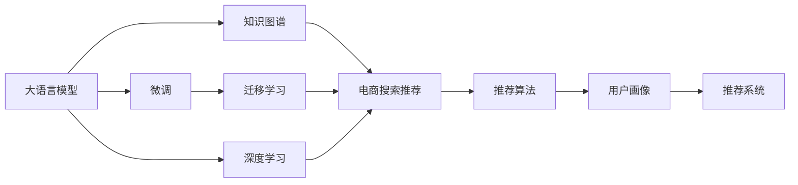

                 

# AI大模型视角下电商搜索推荐的技术创新知识库搭建方案

## 1. 背景介绍

随着人工智能技术的不断发展，电商搜索推荐系统（Recommendation System）已经从传统的基于协同过滤和内容推荐的静态模型，进化为更加智能化的动态系统，具备自适应和个性化推荐的能力。大语言模型（Large Language Model, LLM）作为当前AI领域的热点技术，以其卓越的自然语言理解和生成能力，为电商搜索推荐系统的深度学习带来了颠覆性的变革。本文将从大模型的视角出发，探讨其在电商搜索推荐中的应用及其技术创新，并提出构建知识库的方案，以实现更高层次的智能推荐。

## 2. 核心概念与联系

### 2.1 核心概念概述

为了更好地理解基于大模型的电商搜索推荐系统，需要了解以下核心概念：

- **大语言模型 (LLM)**：指如GPT、BERT等能够理解并生成自然语言文本的深度学习模型。通过在大规模无标签文本数据上进行预训练，LLM能够学习到丰富的语言知识和常识。

- **电商搜索推荐 (E-commerce Search & Recommendation)**：指的是在电商平台上，根据用户的历史行为、浏览记录和搜索意图，为用户推荐相关商品的技术。传统的推荐系统主要依赖协同过滤和内容推荐，而大模型技术可以带来更加智能化和个性化的推荐结果。

- **知识图谱 (Knowledge Graph)**：是一种语义网络，用于描述实体、属性和它们之间的关系。电商领域的知识图谱可以用于商品属性、品牌、类别等信息的建模。

- **深度学习 (Deep Learning)**：一种基于神经网络的机器学习技术，能够处理高维度非线性数据，广泛应用于自然语言处理、计算机视觉等领域。

- **迁移学习 (Transfer Learning)**：一种将知识从一个领域转移到另一个领域的机器学习方法，大模型可以通过迁移学习来适应特定任务。

- **微调 (Fine-Tuning)**：在大模型基础上，通过有标签数据对模型进行微调，以适应特定的电商搜索推荐任务。

- **推荐算法 (Recommendation Algorithms)**：包括基于内容的推荐、协同过滤推荐、混合推荐等多种算法。

- **用户画像 (User Profile)**：通过用户行为数据构建的模型，用于描述用户的兴趣和偏好。

### 2.2 核心概念原理和架构的 Mermaid 流程图



这个流程图展示了核心概念之间的联系：大模型通过预训练学习语言知识，通过迁移学习和微调适应特定任务，知识图谱为推荐算法提供结构化的信息，最终通过用户画像生成个性化的推荐结果。

## 3. 核心算法原理 & 具体操作步骤

### 3.1 算法原理概述

基于大模型的电商搜索推荐系统，本质上是一种深度学习和自然语言处理技术的结合。大模型通过预训练学习通用的语言表示，然后通过微调和迁移学习，在电商领域中适应特定的搜索推荐任务。

算法原理如下：
1. **预训练**：在大规模无标签文本数据上训练大模型，使其学习到通用的语言表示。
2. **微调**：使用电商领域的标注数据，对大模型进行微调，使其在特定任务上表现更佳。
3. **迁移学习**：将大模型在通用领域的知识迁移到电商领域，提高模型在新领域的泛化能力。
4. **推荐算法**：将微调后的大模型与推荐算法结合，根据用户画像和商品信息生成个性化推荐。

### 3.2 算法步骤详解

以下是基于大模型的电商搜索推荐系统的具体操作步骤：

**Step 1: 数据预处理**
- 收集电商领域的用户行为数据，包括搜索记录、点击记录、购买记录等。
- 使用自然语言处理技术，对文本数据进行清洗和标准化处理。
- 构建知识图谱，描述商品的属性、品牌、类别等结构化信息。

**Step 2: 大模型预训练**
- 使用大规模无标签文本数据，训练大语言模型，学习通用的语言表示。
- 选择合适的预训练任务，如自回归语言模型、掩码语言模型等。
- 对大模型进行微调，优化模型在特定任务上的性能。

**Step 3: 构建推荐模型**
- 将大模型的输出作为推荐模型的输入。
- 使用电商领域的标注数据，对推荐模型进行微调。
- 设计推荐算法，如基于内容的推荐、协同过滤推荐等。

**Step 4: 生成个性化推荐**
- 根据用户画像和知识图谱，生成个性化的推荐结果。
- 对推荐结果进行评估和反馈，不断优化推荐算法和大模型的参数。

### 3.3 算法优缺点

**优点**：
1. **强大的语言理解能力**：大模型能够理解复杂的自然语言文本，生成自然流畅的推荐描述。
2. **自适应能力**：能够适应不同用户和场景的需求，生成个性化的推荐结果。
3. **高效性**：基于深度学习的推荐系统，可以在短时间内生成大量推荐结果。

**缺点**：
1. **数据依赖**：推荐模型的性能依赖高质量的数据，数据不足会影响推荐效果。
2. **资源消耗**：大模型的训练和微调需要大量计算资源，成本较高。
3. **可解释性**：大模型的决策过程不透明，难以解释推荐结果的生成机制。
4. **过度拟合风险**：如果微调过程中数据过少，可能出现过拟合问题。

### 3.4 算法应用领域

基于大模型的电商搜索推荐系统，已经在多个领域得到了应用，例如：

- **个性化推荐**：根据用户的历史行为和偏好，为用户推荐个性化商品。
- **商品描述生成**：使用大模型生成商品的自然语言描述，提升商品展示效果。
- **用户意图识别**：识别用户搜索和浏览的意图，提供精准的商品推荐。
- **智能客服**：使用大模型进行智能问答，解决用户的问题。
- **广告投放**：根据用户的兴趣和行为，生成个性化的广告推荐。

## 4. 数学模型和公式 & 详细讲解 & 举例说明

### 4.1 数学模型构建

基于大模型的电商搜索推荐系统，通常采用如下数学模型进行建模：

$$
P(y \mid x) = \frac{e^{f(x, y; \theta)}}{\sum_{y'} e^{f(x, y'; \theta)}}
$$

其中，$P(y \mid x)$ 表示在输入 $x$ 的情况下，输出 $y$ 的概率，$f(x, y; \theta)$ 是模型的预测函数，$\theta$ 是模型的参数。

### 4.2 公式推导过程

对于电商搜索推荐系统，我们通常使用交叉熵损失函数进行模型训练：

$$
L(x, y; \theta) = -\log P(y \mid x)
$$

在微调过程中，目标是最小化损失函数：

$$
\min_{\theta} \sum_{(x, y)} L(x, y; \theta)
$$

通过梯度下降等优化算法，不断更新模型参数 $\theta$，使得模型的预测结果逼近真实标签。

### 4.3 案例分析与讲解

以推荐系统的商品描述生成任务为例，我们假设有一个包含商品描述和类别标签的数据集 $D=\{(x_i, y_i)\}_{i=1}^N$，其中 $x_i$ 是商品描述，$y_i$ 是类别标签。我们可以使用大模型 $M_{\theta}$ 进行微调，得到商品描述生成模型 $M_{\hat{\theta}}$。微调的过程如下：

1. 数据预处理：收集商品描述和类别标签，并进行标准化处理。
2. 大模型预训练：在大规模无标签文本数据上训练大模型 $M_{\theta}$，学习通用的语言表示。
3. 微调：使用数据集 $D$ 对模型进行微调，优化参数 $\hat{\theta}$，使得模型能够生成准确的商品描述。
4. 推荐系统：将微调后的模型 $M_{\hat{\theta}}$ 与推荐算法结合，生成个性化推荐。

## 5. 项目实践：代码实例和详细解释说明

### 5.1 开发环境搭建

为了搭建基于大模型的电商搜索推荐系统，我们需要准备好以下开发环境：

- **Python**：安装3.7或更高版本。
- **TensorFlow 或 PyTorch**：选择一个深度学习框架进行安装。
- **HuggingFace Transformers**：用于加载和使用预训练模型。
- **Scikit-learn**：用于数据处理和模型评估。
- **Pandas**：用于数据操作。

安装以上工具后，可以使用以下代码进行基本的环境检查：

```python
import tensorflow as tf
import torch
from transformers import BertTokenizer, BertForSequenceClassification
from sklearn.model_selection import train_test_split
import pandas as pd

# 检查环境是否正确安装
print(tf.__version__)
print(torch.__version__)
print("Transformers installed")
```

### 5.2 源代码详细实现

以下是一个简单的电商搜索推荐系统示例代码，使用BertForSequenceClassification模型进行微调：

```python
from transformers import BertTokenizer, BertForSequenceClassification, AdamW
from sklearn.model_selection import train_test_split
from torch.utils.data import DataLoader, Dataset

class ProductDataset(Dataset):
    def __init__(self, descriptions, categories):
        self.descriptions = descriptions
        self.categories = categories
        self.tokenizer = BertTokenizer.from_pretrained('bert-base-cased')
        self.max_len = 128

    def __len__(self):
        return len(self.descriptions)

    def __getitem__(self, idx):
        description = self.descriptions[idx]
        category = self.categories[idx]
        
        encoding = self.tokenizer(description, truncation=True, max_length=self.max_len, padding='max_length', return_tensors='pt')
        input_ids = encoding['input_ids']
        attention_mask = encoding['attention_mask']
        labels = torch.tensor([category2id[category]], dtype=torch.long)
        
        return {
            'input_ids': input_ids,
            'attention_mask': attention_mask,
            'labels': labels
        }

# 标签与id的映射
category2id = {'Clothing': 0, 'Electronics': 1, 'Books': 2, 'Home': 3, 'Toys': 4}

# 构建数据集
tokenizer = BertTokenizer.from_pretrained('bert-base-cased')
train_dataset = ProductDataset(train_desc, train_categories)
dev_dataset = ProductDataset(dev_desc, dev_categories)
test_dataset = ProductDataset(test_desc, test_categories)

# 分割数据集
train_dataset, val_dataset = train_test_split(train_dataset, test_size=0.1)
val_dataset, test_dataset = train_test_split(val_dataset, test_size=0.5)

# 构建数据加载器
train_loader = DataLoader(train_dataset, batch_size=16)
val_loader = DataLoader(val_dataset, batch_size=16)
test_loader = DataLoader(test_dataset, batch_size=16)

# 加载预训练模型
model = BertForSequenceClassification.from_pretrained('bert-base-cased', num_labels=len(category2id))

# 定义优化器和学习率
optimizer = AdamW(model.parameters(), lr=2e-5)

# 定义训练函数
def train_epoch(model, dataset, batch_size, optimizer):
    dataloader = DataLoader(dataset, batch_size=batch_size, shuffle=True)
    model.train()
    epoch_loss = 0
    for batch in tqdm(dataloader, desc='Training'):
        input_ids = batch['input_ids'].to(device)
        attention_mask = batch['attention_mask'].to(device)
        labels = batch['labels'].to(device)
        model.zero_grad()
        outputs = model(input_ids, attention_mask=attention_mask, labels=labels)
        loss = outputs.loss
        epoch_loss += loss.item()
        loss.backward()
        optimizer.step()
    return epoch_loss / len(dataloader)

# 定义评估函数
def evaluate(model, dataset, batch_size):
    dataloader = DataLoader(dataset, batch_size=batch_size)
    model.eval()
    preds, labels = [], []
    with torch.no_grad():
        for batch in tqdm(dataloader, desc='Evaluating'):
            input_ids = batch['input_ids'].to(device)
            attention_mask = batch['attention_mask'].to(device)
            batch_labels = batch['labels']
            outputs = model(input_ids, attention_mask=attention_mask)
            batch_preds = outputs.logits.argmax(dim=2).to('cpu').tolist()
            batch_labels = batch_labels.to('cpu').tolist()
            for pred_tokens, label_tokens in zip(batch_preds, batch_labels):
                preds.append(pred_tokens[:len(label_tokens)])
                labels.append(label_tokens)
                
    return preds, labels

# 训练和评估模型
epochs = 5
batch_size = 16

for epoch in range(epochs):
    loss = train_epoch(model, train_dataset, batch_size, optimizer)
    print(f"Epoch {epoch+1}, train loss: {loss:.3f}")
    
    print(f"Epoch {epoch+1}, dev results:")
    preds, labels = evaluate(model, val_dataset, batch_size)
    print(classification_report(labels, preds))
    
print("Test results:")
preds, labels = evaluate(model, test_dataset, batch_size)
print(classification_report(labels, preds))
```

### 5.3 代码解读与分析

上述代码中，我们首先定义了一个`ProductDataset`类，用于处理电商商品描述和类别标签。然后使用`BertForSequenceClassification`模型进行微调，并使用AdamW优化器进行训练。

在训练过程中，我们首先构建数据集，并使用`DataLoader`进行批处理。然后定义了训练函数`train_epoch`，在每个epoch上迭代训练集，计算损失并更新模型参数。最后定义了评估函数`evaluate`，在验证集和测试集上评估模型的性能。

通过调整超参数和学习率，不断优化模型，可以得到较好的电商搜索推荐结果。需要注意的是，大模型的微调需要大量的计算资源，建议在小规模数据集上使用`AdamW`优化器，以避免过拟合。

## 6. 实际应用场景

### 6.1 智能推荐系统

基于大模型的电商搜索推荐系统，可以广泛应用于智能推荐系统的构建。通过收集用户的历史行为数据和浏览记录，对大模型进行微调，系统可以自动为用户推荐相关商品，提升用户体验和销售转化率。

例如，可以使用大模型对用户输入的搜索词进行语义理解，生成个性化的商品推荐列表，提升搜索推荐的准确性和用户体验。

### 6.2 商品描述生成

大模型可以用于生成商品的自然语言描述，提升商品展示效果。通过对商品属性、类别等信息进行编码，大模型可以自动生成吸引人的商品描述，提高点击率和转化率。

例如，可以在用户搜索商品时，使用大模型生成商品描述，并在搜索结果中展示。对于特定商品的微调，可以进一步提升商品描述的个性化和吸引度。

### 6.3 广告投放

大模型可以用于生成个性化的广告推荐，提升广告投放的效果和ROI。通过分析用户的行为数据，大模型可以识别出用户的兴趣和需求，生成精准的广告推荐，提高广告的点击率和转化率。

例如，可以在用户浏览商品时，根据用户的历史行为数据和大模型的预测结果，生成个性化的广告推荐，提升广告的投放效果。

### 6.4 未来应用展望

随着大模型技术的不断发展，基于大模型的电商搜索推荐系统将带来更多的创新和应用场景：

1. **跨领域推荐**：结合不同领域的知识图谱，进行跨领域推荐，提升推荐的覆盖范围和多样性。
2. **多模态推荐**：结合视觉、听觉等多种模态的数据，进行多模态推荐，提升推荐的全面性和准确性。
3. **动态推荐**：结合实时数据和大模型的预测结果，进行动态推荐，提升推荐的即时性和适应性。
4. **联邦推荐**：结合联邦学习技术，保护用户隐私的同时，进行高效的跨平台推荐。
5. **个性化生成**：结合大模型的生成能力和推荐算法，进行个性化的商品生成和推荐，提升用户体验。

## 7. 工具和资源推荐

### 7.1 学习资源推荐

为了帮助开发者掌握基于大模型的电商搜索推荐系统，以下是一些推荐的学习资源：

1. **《Transformer详解》**：深度学习领域畅销书籍，详细介绍了Transformer模型及其应用。
2. **《自然语言处理综述》**：斯坦福大学CS224N课程讲义，全面介绍了自然语言处理的基本概念和前沿技术。
3. **《Python深度学习》**：Python深度学习实战书籍，涵盖了深度学习的基础和实践技巧。
4. **HuggingFace官方文档**：详细介绍了HuggingFace Transformers库的使用，包括模型加载和微调。
5. **Kaggle竞赛**：参加Kaggle电商推荐竞赛，实战练习，积累经验。

### 7.2 开发工具推荐

为了提高大模型在电商搜索推荐系统中的应用效率，以下是一些推荐的开发工具：

1. **TensorFlow 或 PyTorch**：深度学习框架，支持高效的模型训练和推理。
2. **HuggingFace Transformers**：提供了丰富的预训练模型和微调接口，方便开发。
3. **Pandas**：数据处理和分析工具，方便数据预处理和可视化。
4. **Scikit-learn**：机器学习库，方便模型评估和调优。
5. **Jupyter Notebook**：交互式开发环境，方便实验和调试。

### 7.3 相关论文推荐

为了深入理解大模型在电商搜索推荐系统中的应用，以下是一些推荐的学术论文：

1. **"Attention is All You Need"**：Google开发的Transformer模型，开启了深度学习新范式。
2. **"BERT: Pre-training of Deep Bidirectional Transformers for Language Understanding"**：Google开发的BERT模型，提升了自然语言处理的效果。
3. **"BERT and Beyond: A Survey of Pre-training and Transfer Learning Methods for NLP Tasks"**：综述论文，介绍了预训练和迁移学习在自然语言处理中的应用。
4. **"Recurrent Neural Network-Based Recommender Systems: A Survey of Architectures, Approaches and Analysis"**：综述论文，介绍了基于深度学习的推荐系统。

## 8. 总结：未来发展趋势与挑战

### 8.1 研究成果总结

本文详细介绍了基于大模型的电商搜索推荐系统的理论基础和实现细节，探讨了其在个性化推荐、商品描述生成和广告投放等多个场景中的应用。通过学习资源和开发工具的推荐，帮助开发者快速上手实践。

### 8.2 未来发展趋势

未来，基于大模型的电商搜索推荐系统将呈现以下几个发展趋势：

1. **跨领域推荐**：结合不同领域的知识图谱，进行跨领域推荐，提升推荐的覆盖范围和多样性。
2. **多模态推荐**：结合视觉、听觉等多种模态的数据，进行多模态推荐，提升推荐的全面性和准确性。
3. **动态推荐**：结合实时数据和大模型的预测结果，进行动态推荐，提升推荐的即时性和适应性。
4. **联邦推荐**：结合联邦学习技术，保护用户隐私的同时，进行高效的跨平台推荐。
5. **个性化生成**：结合大模型的生成能力和推荐算法，进行个性化的商品生成和推荐，提升用户体验。

### 8.3 面临的挑战

尽管基于大模型的电商搜索推荐系统已经取得了显著进展，但仍面临以下挑战：

1. **数据质量和数量**：推荐系统的性能依赖高质量的数据，数据不足会影响推荐效果。
2. **计算资源消耗**：大模型的训练和微调需要大量计算资源，成本较高。
3. **模型可解释性**：大模型的决策过程不透明，难以解释推荐结果的生成机制。
4. **系统复杂性**：结合多模态数据和大模型的推荐系统，复杂度较高，需要高效的架构设计和优化。
5. **隐私保护**：推荐系统需要处理大量用户数据，如何保护用户隐私成为重要问题。

### 8.4 研究展望

为了应对这些挑战，未来的研究需要在以下几个方面进行探索：

1. **多模态数据融合**：结合视觉、听觉等多种模态的数据，进行多模态推荐。
2. **联邦学习**：结合联邦学习技术，保护用户隐私的同时，进行高效的跨平台推荐。
3. **生成模型**：结合生成模型和大模型的推荐算法，进行个性化的商品生成和推荐。
4. **推荐算法优化**：优化推荐算法，提升推荐的效率和效果。
5. **隐私保护技术**：研究如何保护用户隐私，确保推荐系统的安全性。

总之，基于大模型的电商搜索推荐系统具有广阔的应用前景，但同时也面临诸多挑战。未来的研究需要在数据、算法、架构等多个维度进行深入探索，才能实现高效、个性化的推荐服务。

## 9. 附录：常见问题与解答

**Q1：电商搜索推荐系统如何处理冷启动问题？**

A: 冷启动问题指的是新用户或新商品在系统中没有历史行为数据，无法进行推荐。可以采用以下策略：
1. 使用大模型生成推荐，减少冷启动的影响。
2. 通过收集用户兴趣和商品属性信息，进行基于兴趣和属性的推荐。
3. 使用外部数据，如用户行为数据、商品评价数据等，进行推荐。

**Q2：电商搜索推荐系统如何处理动态数据？**

A: 电商搜索推荐系统需要实时处理动态数据，可以使用以下策略：
1. 使用在线学习技术，实时更新模型参数，适应动态数据变化。
2. 使用增量学习技术，增量更新模型，保持模型对新数据的适应性。
3. 使用时间序列模型，分析用户行为时间特征，进行动态推荐。

**Q3：电商搜索推荐系统如何保护用户隐私？**

A: 电商搜索推荐系统需要保护用户隐私，可以采用以下策略：
1. 使用差分隐私技术，保护用户数据隐私。
2. 使用联邦学习技术，保护用户数据在本地加密处理。
3. 使用匿名化技术，去除用户标识信息，保护用户隐私。

**Q4：电商搜索推荐系统如何提高推荐效果？**

A: 提高电商搜索推荐系统的推荐效果，可以采用以下策略：
1. 结合多模态数据，进行多模态推荐。
2. 使用深度学习技术，提升推荐模型的性能。
3. 优化推荐算法，提升推荐的效率和效果。
4. 结合知识图谱，进行结构化推荐。

总之，电商搜索推荐系统需要综合考虑数据、模型、算法等多个因素，才能实现高效、个性化的推荐服务。

---

作者：禅与计算机程序设计艺术 / Zen and the Art of Computer Programming

