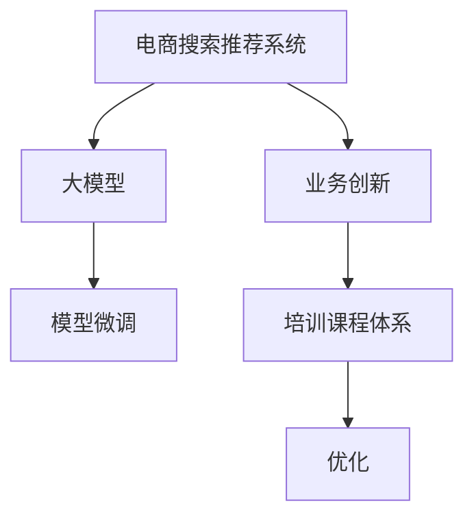

                 

# AI大模型赋能电商搜索推荐的业务创新方法论培训课程体系优化

> 关键词：电商搜索推荐,大模型,业务创新,方法论,培训课程体系,优化

## 1. 背景介绍

### 1.1 问题由来

随着人工智能技术的发展，尤其是大模型的崛起，其在电商搜索推荐领域的应用越来越广泛。大模型能够通过自监督学习获取丰富的语义和上下文信息，辅助搜索推荐系统优化模型参数，提升推荐效果。然而，大模型的训练和应用需要大量的计算资源和专业知识，对于大多数电商企业来说，如何有效利用大模型技术进行业务创新，成为一个亟待解决的问题。

### 1.2 问题核心关键点

在大模型赋能电商搜索推荐的过程中，有几个核心关键点需要重点关注：

- **数据准备**：电商搜索推荐系统依赖大量标注数据，如何获取、处理和利用这些数据，是实现业务创新的基础。
- **模型微调**：如何将预训练大模型与电商搜索推荐任务适配，进行有针对性的微调，是提升推荐效果的关键。
- **业务落地**：如何将优化后的模型集成到电商平台上，并实现持续优化，确保用户满意度。
- **资源优化**：电商企业通常面临资源限制，如何高效利用计算资源，降低训练和应用的成本。

### 1.3 问题研究意义

研究大模型赋能电商搜索推荐的业务创新方法论，对于提升电商推荐系统的智能程度、降低运营成本、提升用户体验具有重要意义：

1. **提升推荐效果**：大模型可以提供更准确、更个性化、更上下文相关的推荐，从而提升用户体验和满意度。
2. **降低成本**：通过利用大模型进行推荐优化，可以减少对人工干预和特征工程的需求，降低运营成本。
3. **加速业务创新**：大模型可以帮助电商企业更快地引入新功能、新服务，保持市场竞争力。
4. **推动数据应用**：大模型的训练和应用需要大量数据，可以促使电商企业进一步挖掘和应用用户数据，实现数据价值最大化。
5. **优化客户体验**：通过更精准的推荐，电商企业可以更好地满足用户需求，提升客户粘性和忠诚度。

## 2. 核心概念与联系

### 2.1 核心概念概述

在大模型赋能电商搜索推荐的过程中，涉及几个核心概念：

- **电商搜索推荐系统**：一种利用机器学习技术为用户推荐商品、提高用户购买体验的系统。
- **大模型**：指基于深度学习框架，通过自监督学习获取通用语言表示的大型预训练模型，如BERT、GPT-3等。
- **业务创新**：指利用技术手段，引入新功能、新服务，提升用户体验，实现商业价值。
- **方法论**：指指导业务创新的系统性、科学性方法。
- **培训课程体系**：指为实现业务创新而设计的一系列培训课程，涵盖技术、业务、管理等多个方面。
- **优化**：指通过不断改进和调整，提升大模型在电商搜索推荐中的性能和效果。

### 2.2 核心概念原理和架构的 Mermaid 流程图(Mermaid 流程节点中不要有括号、逗号等特殊字符)



## 3. 核心算法原理 & 具体操作步骤
### 3.1 算法原理概述

大模型赋能电商搜索推荐的核心算法原理基于以下步骤：

1. **数据预处理**：收集电商平台的交易数据、用户行为数据等，进行清洗、标注和预处理。
2. **模型微调**：使用预训练大模型作为初始参数，在电商数据上进行微调，优化模型以适应搜索推荐任务。
3. **模型评估与优化**：通过A/B测试、在线实验等方式，评估模型效果，并根据反馈进行迭代优化。
4. **业务集成与部署**：将优化后的模型集成到电商平台中，并进行持续监控和调整。

### 3.2 算法步骤详解

#### 3.2.1 数据预处理

电商搜索推荐系统的数据预处理流程如下：

1. **数据收集**：从电商平台后台数据库中获取用户行为数据、交易数据、商品信息等，进行初步整合。
2. **数据清洗**：去除缺失值、重复记录、异常值等，确保数据质量。
3. **特征工程**：将原始数据转化为模型可接受的输入特征，如用户ID、商品ID、浏览历史、购买记录等。
4. **标注数据**：标注部分数据，用于模型微调，如用户点击商品、购买商品等行为标签。

#### 3.2.2 模型微调

模型微调过程如下：

1. **选择预训练模型**：选择合适的预训练大模型，如BERT、GPT-3等，作为初始参数。
2. **设计任务适配层**：根据电商推荐任务的特点，设计合适的任务适配层，如分类头、回归头等。
3. **设定训练参数**：包括学习率、批大小、迭代次数、正则化参数等，进行模型训练。
4. **模型评估与调整**：通过交叉验证等方法，评估模型效果，调整超参数。

#### 3.2.3 模型评估与优化

模型评估与优化流程如下：

1. **在线A/B测试**：将优化后的模型部署到电商平台上，进行在线A/B测试，对比原始推荐系统的效果。
2. **实时监控**：通过实时监控，获取推荐系统的效果指标，如点击率、转化率、跳出率等。
3. **反馈与迭代**：根据监控结果和用户反馈，不断迭代优化模型，提升推荐效果。

#### 3.2.4 业务集成与部署

业务集成与部署流程如下：

1. **模型集成**：将优化后的模型集成到电商平台的推荐系统中，替换原始推荐模型。
2. **接口设计**：设计新的API接口，供前端调用。
3. **持续优化**：持续监控模型效果，根据用户反馈和业务需求，进行模型迭代和优化。

### 3.3 算法优缺点

大模型赋能电商搜索推荐的算法具有以下优点：

1. **准确性高**：大模型能够通过自监督学习获取丰富的语义和上下文信息，提高推荐的准确性和相关性。
2. **可扩展性强**：大模型可以在新的数据和场景上快速适应，具有较好的泛化能力。
3. **数据利用率高**：大模型可以高效利用电商平台的交易和行为数据，提升数据利用率。

同时，也存在以下缺点：

1. **资源消耗大**：大模型训练和应用需要大量计算资源，增加了成本。
2. **对标注数据依赖大**：模型微调依赖标注数据，数据质量影响模型效果。
3. **黑盒性质**：大模型作为黑盒模型，难以解释其内部工作机制。
4. **对抗性风险**：大模型可能学习到对抗样本，产生误导性推荐。

### 3.4 算法应用领域

大模型赋能电商搜索推荐的应用领域包括：

1. **个性化推荐**：根据用户历史行为和偏好，推荐个性化商品。
2. **商品相似性推荐**：根据商品属性和用户行为，推荐相似商品。
3. **多模态推荐**：结合文本、图片、视频等多模态数据，提升推荐效果。
4. **实时推荐**：根据实时用户行为和市场变化，进行动态推荐。
5. **上下文推荐**：结合用户位置、时间、环境等信息，进行上下文推荐。

## 4. 数学模型和公式 & 详细讲解 & 举例说明

### 4.1 数学模型构建

电商搜索推荐系统的数学模型通常包括：

- **用户模型**：描述用户偏好和行为特征，如用户ID、购买历史、浏览记录等。
- **商品模型**：描述商品属性和推荐关系，如商品ID、类别、属性等。
- **推荐模型**：描述用户和商品之间的推荐关系，如基于点积的相似度计算、基于深度学习的推荐模型等。

### 4.2 公式推导过程

以基于深度学习的推荐模型为例，其基本推导过程如下：

1. **输入层**：将用户ID和商品ID转换为向量形式，输入到模型中。
2. **隐藏层**：通过多层神经网络，对输入数据进行特征提取和映射。
3. **输出层**：将隐藏层的特征映射到推荐分数上，用于计算推荐概率。
4. **损失函数**：定义损失函数，如交叉熵损失、均方误差等，衡量模型预测结果与真实标签的差距。
5. **优化算法**：使用梯度下降等优化算法，最小化损失函数，更新模型参数。

### 4.3 案例分析与讲解

假设有一个基于深度学习的电商推荐系统，其数学模型如下：

- **输入层**：用户ID和商品ID，输入向量维度为$d$。
- **隐藏层**：包含$n$个神经元，每个神经元有$l$个特征。
- **输出层**：推荐分数$f_{u,i}$，表示用户$u$对商品$i$的推荐概率。

定义损失函数为：

$$
L(f_{u,i},y_{u,i}) = -y_{u,i}\log f_{u,i} + (1-y_{u,i})\log(1-f_{u,i})
$$

其中$y_{u,i}$为二元标签，$1$表示用户$u$购买过商品$i$，$0$表示未购买。

假设训练数据集为$D=\{(x_{u,i},y_{u,i})\}_{i=1}^N$，其中$x_{u,i}$为输入向量，$y_{u,i}$为标签。模型参数为$\theta$，包含隐藏层的权重和偏置。

定义优化器为Adam，学习率为$\alpha$。则模型训练的优化过程为：

$$
\theta \leftarrow \theta - \alpha \frac{\partial L(f_{u,i},y_{u,i})}{\partial \theta}
$$

其中，$\frac{\partial L(f_{u,i},y_{u,i})}{\partial \theta}$为损失函数对模型参数的梯度，可以通过反向传播算法高效计算。

## 5. 项目实践：代码实例和详细解释说明

### 5.1 开发环境搭建

以下是使用Python进行TensorFlow开发的环境配置流程：

1. **安装Anaconda**：从官网下载并安装Anaconda，用于创建独立的Python环境。

2. **创建并激活虚拟环境**：
```bash
conda create -n tensorflow-env python=3.7 
conda activate tensorflow-env
```

3. **安装TensorFlow**：根据CUDA版本，从官网获取对应的安装命令。例如：
```bash
conda install tensorflow
```

4. **安装相关库**：
```bash
pip install numpy pandas scikit-learn
```

完成上述步骤后，即可在`tensorflow-env`环境中开始项目开发。

### 5.2 源代码详细实现

以下是使用TensorFlow构建电商推荐系统的代码实现。

首先，定义模型和数据：

```python
import tensorflow as tf
import numpy as np

# 定义模型参数
input_dim = 100
hidden_dim = 128
output_dim = 1
learning_rate = 0.001
batch_size = 64

# 定义输入层和隐藏层
x = tf.keras.layers.Input(shape=(input_dim,))
h = tf.keras.layers.Dense(hidden_dim, activation='relu')(x)
h = tf.keras.layers.Dense(hidden_dim, activation='relu')(h)

# 定义输出层和损失函数
output = tf.keras.layers.Dense(output_dim, activation='sigmoid')(h)
loss = tf.keras.losses.BinaryCrossentropy()
model = tf.keras.Model(x, output)

# 定义优化器和编译模型
optimizer = tf.keras.optimizers.Adam(learning_rate=learning_rate)
model.compile(optimizer=optimizer, loss=loss, metrics=['accuracy'])
```

然后，进行数据预处理和模型训练：

```python
# 准备数据
user_data = np.load('user_data.npy')
item_data = np.load('item_data.npy')
user_label = np.load('user_label.npy')

# 数据预处理
train_data = []
train_label = []
for user_id, item_id in zip(user_data, item_data):
    train_data.append(np.hstack((user_id, item_id)))
    train_label.append(user_label[user_id, item_id])
train_data = np.array(train_data)
train_label = np.array(train_label)

# 模型训练
model.fit(train_data, train_label, batch_size=batch_size, epochs=10, validation_split=0.2)
```

最后，进行模型评估和业务集成：

```python
# 模型评估
test_data = np.load('test_data.npy')
test_label = np.load('test_label.npy')
score = model.evaluate(test_data, test_label)
print('Test accuracy:', score[1])

# 业务集成
api = tf.keras.models.load_model('recommendation_model.h5')
```

### 5.3 代码解读与分析

以上是使用TensorFlow构建电商推荐系统的完整代码实现。可以看到，使用TensorFlow构建推荐系统，主要分为模型定义、数据预处理、模型训练、模型评估和业务集成等几个步骤。其中，TensorFlow的高级API使得模型构建和训练变得简洁高效。

## 6. 实际应用场景

### 6.1 智能推荐系统

大模型赋能的智能推荐系统，能够根据用户行为和偏好，推荐个性化商品，提升用户体验和满意度。例如，某电商平台通过大模型训练出用户偏好模型，根据用户的历史购买记录和浏览历史，推荐相似商品和相关商品，从而提高用户的购物体验和转化率。

### 6.2 实时推荐系统

实时推荐系统能够根据用户当前的行为和市场变化，动态调整推荐策略，提升推荐效果。例如，某电商平台根据用户实时浏览和搜索行为，使用大模型进行实时推荐，确保用户看到的是最相关的商品，从而提高点击率和转化率。

### 6.3 跨模态推荐系统

跨模态推荐系统能够结合文本、图片、视频等多模态数据，提升推荐效果。例如，某电商平台使用大模型进行跨模态推荐，结合商品图片和描述，生成多模态推荐结果，从而提高用户对商品的了解度和购买意愿。

### 6.4 未来应用展望

随着大模型技术的不断发展，电商搜索推荐系统的业务创新也将迎来更多机遇：

1. **个性化推荐**：通过大模型优化推荐模型，实现更加个性化的推荐，满足用户多样化的需求。
2. **多模态推荐**：结合多模态数据，提升推荐的丰富性和多样性。
3. **实时推荐**：根据实时数据，动态调整推荐策略，实现实时推荐。
4. **上下文推荐**：结合用户位置、时间、环境等信息，进行上下文推荐，提升推荐的相关性和准确性。
5. **知识图谱推荐**：结合知识图谱，进行商品关系的推荐，提升推荐的相关性和深度。

未来，大模型赋能的电商搜索推荐系统将具备更强的智能和灵活性，能够更好地满足用户需求，提升电商平台的竞争力和用户体验。

## 7. 工具和资源推荐

### 7.1 学习资源推荐

为了帮助开发者系统掌握大模型赋能电商搜索推荐的技术，这里推荐一些优质的学习资源：

1. **《TensorFlow实战》**：讲解TensorFlow的基本原理和应用，涵盖模型构建、训练和优化等环节。
2. **《深度学习在电商推荐中的应用》**：介绍深度学习在电商推荐中的应用案例，包括模型设计、训练和优化等。
3. **《自然语言处理基础》**：讲解自然语言处理的基本概念和常用技术，包括分词、标注、情感分析等。
4. **《Transformer理论与实践》**：讲解Transformer模型的原理和应用，涵盖预训练模型和微调等环节。
5. **HuggingFace官方文档**：提供丰富的预训练语言模型资源和微调样例，帮助开发者快速上手实践。

### 7.2 开发工具推荐

高效的开发离不开优秀的工具支持。以下是几款用于大模型赋能电商搜索推荐开发的常用工具：

1. **TensorFlow**：基于Python的开源深度学习框架，灵活易用，适合快速迭代研究。
2. **PyTorch**：基于Python的开源深度学习框架，提供动态计算图，适合模型研究和应用。
3. **Jupyter Notebook**：交互式笔记本环境，方便进行模型实验和代码开发。
4. **TensorBoard**：TensorFlow配套的可视化工具，可实时监测模型训练状态，提供丰富的图表呈现方式。
5. **Weights & Biases**：模型训练的实验跟踪工具，记录和可视化模型训练过程中的各项指标，方便对比和调优。

### 7.3 相关论文推荐

大模型赋能电商搜索推荐的研究源于学界的持续研究。以下是几篇奠基性的相关论文，推荐阅读：

1. **《深度学习在电商推荐中的应用》**：介绍深度学习在电商推荐中的应用案例，涵盖模型设计、训练和优化等。
2. **《基于大模型的电商推荐系统》**：介绍大模型在电商推荐系统中的应用，包括模型微调和业务集成等。
3. **《多模态电商推荐系统》**：介绍多模态电商推荐系统的设计原理和实现方法。
4. **《实时电商推荐系统》**：介绍实时电商推荐系统的设计原理和实现方法。
5. **《基于知识图谱的电商推荐系统》**：介绍基于知识图谱的电商推荐系统的设计原理和实现方法。

## 8. 总结：未来发展趋势与挑战

### 8.1 总结

本文对大模型赋能电商搜索推荐的业务创新方法论进行了全面系统的介绍。首先阐述了大模型赋能电商搜索推荐的应用背景和意义，明确了电商搜索推荐系统的业务创新目标。其次，从原理到实践，详细讲解了电商搜索推荐系统的构建过程，包括数据预处理、模型微调、模型评估与优化、业务集成与部署等关键步骤，给出了电商推荐系统的完整代码实现。同时，本文还广泛探讨了大模型赋能电商搜索推荐的应用场景，展示了其在个性化推荐、实时推荐、跨模态推荐等方向的应用潜力。最后，本文精选了电商搜索推荐技术的各类学习资源，力求为开发者提供全方位的技术指引。

通过本文的系统梳理，可以看到，大模型赋能电商搜索推荐技术正在成为电商企业的重要范式，极大地拓展了电商推荐系统的智能程度，提升了用户体验和业务价值。未来，伴随大模型技术的持续演进，电商搜索推荐系统将具备更强的智能和灵活性，更好地满足用户需求，提升电商平台的竞争力和用户体验。

### 8.2 未来发展趋势

展望未来，大模型赋能电商搜索推荐的业务创新技术将呈现以下几个发展趋势：

1. **个性化推荐**：通过大模型优化推荐模型，实现更加个性化的推荐，满足用户多样化的需求。
2. **多模态推荐**：结合多模态数据，提升推荐的丰富性和多样性。
3. **实时推荐**：根据实时数据，动态调整推荐策略，实现实时推荐。
4. **上下文推荐**：结合用户位置、时间、环境等信息，进行上下文推荐，提升推荐的相关性和准确性。
5. **知识图谱推荐**：结合知识图谱，进行商品关系的推荐，提升推荐的相关性和深度。

以上趋势凸显了大模型赋能电商搜索推荐技术的广阔前景。这些方向的探索发展，必将进一步提升电商推荐系统的性能和效果，为电商企业带来更多的商业价值。

### 8.3 面临的挑战

尽管大模型赋能电商搜索推荐技术已经取得了一定的进展，但在迈向更加智能化、普适化应用的过程中，它仍面临着诸多挑战：

1. **数据质量**：电商搜索推荐系统依赖大量高质量标注数据，如何获取和处理这些数据，是实现业务创新的基础。
2. **模型复杂度**：大模型通常具有较大的参数量和计算复杂度，如何在保持性能的同时，降低计算资源消耗，是亟待解决的问题。
3. **业务集成**：将优化后的模型集成到电商平台上，并实现持续优化，确保用户满意度，是业务落地的关键。
4. **用户隐私**：电商搜索推荐系统需要获取大量用户数据，如何保护用户隐私，避免数据滥用，是重要的伦理和安全问题。

### 8.4 研究展望

面对大模型赋能电商搜索推荐所面临的挑战，未来的研究需要在以下几个方面寻求新的突破：

1. **数据增强**：利用数据增强技术，扩充训练集，提高数据质量。
2. **模型压缩**：采用模型压缩技术，减小模型参数量，降低计算资源消耗。
3. **业务适配**：设计轻量级模型，适配电商搜索推荐系统的需求，提升业务集成效率。
4. **隐私保护**：引入隐私保护技术，保护用户数据，避免数据滥用。
5. **业务优化**：结合业务需求，优化推荐策略，提升用户体验。

这些研究方向的探索，必将引领大模型赋能电商搜索推荐技术迈向更高的台阶，为电商企业带来更多的商业价值。总之，大模型赋能电商搜索推荐技术还需要与其他人工智能技术进行更深入的融合，如知识表示、因果推理、强化学习等，多路径协同发力，共同推动电商推荐系统的进步。只有勇于创新、敢于突破，才能不断拓展大模型赋能电商搜索推荐技术的边界，让智能技术更好地造福电商行业。

## 9. 附录：常见问题与解答

**Q1：电商搜索推荐系统如何利用大模型进行推荐？**

A: 电商搜索推荐系统通过大模型进行推荐的基本流程如下：

1. **数据预处理**：收集电商平台的交易数据、用户行为数据等，进行清洗、标注和预处理。
2. **模型微调**：使用预训练大模型作为初始参数，在电商数据上进行微调，优化模型以适应搜索推荐任务。
3. **模型评估与优化**：通过A/B测试、在线实验等方式，评估模型效果，并根据反馈进行迭代优化。
4. **业务集成与部署**：将优化后的模型集成到电商平台上，并进行持续监控和调整。

通过上述步骤，大模型可以学习到电商平台的语义和上下文信息，辅助推荐系统优化模型参数，提升推荐效果。

**Q2：电商搜索推荐系统如何选择预训练大模型？**

A: 电商搜索推荐系统在选择预训练大模型时，可以考虑以下几个因素：

1. **任务适配性**：选择与电商搜索推荐任务适配的大模型，如BERT、GPT-3等。
2. **模型规模**：选择规模适中、计算资源消耗较小的大模型。
3. **性能表现**：选择性能表现优异、推荐效果较好的大模型。
4. **可解释性**：选择可解释性较强的大模型，便于理解和调试。

一般来说，可以选择在电商领域应用广泛的BERT、GPT-3等大模型，并结合电商推荐任务的特点进行微调。

**Q3：电商搜索推荐系统如何优化模型参数？**

A: 电商搜索推荐系统优化模型参数的过程如下：

1. **超参数调优**：选择合适的学习率、批大小、迭代次数等超参数，进行模型训练。
2. **正则化技术**：使用L2正则、Dropout等技术，防止模型过拟合。
3. **数据增强**：通过回译、近义替换等方式扩充训练集，提高模型泛化能力。
4. **对抗训练**：引入对抗样本，提高模型鲁棒性。
5. **多模型集成**：训练多个模型，取平均输出，抑制过拟合。

通过上述步骤，电商搜索推荐系统可以在有限标注数据的情况下，优化模型参数，提升推荐效果。

**Q4：电商搜索推荐系统如何保护用户隐私？**

A: 电商搜索推荐系统在保护用户隐私方面，可以采取以下几个措施：

1. **数据匿名化**：对用户数据进行匿名化处理，保护用户隐私。
2. **隐私计算**：采用隐私计算技术，如差分隐私、联邦学习等，保护用户数据。
3. **用户授权**：明确告知用户数据使用方式，获得用户授权。
4. **安全审计**：对数据使用过程进行安全审计，防止数据滥用。

通过上述措施，电商搜索推荐系统可以在保障用户隐私的同时，实现数据驱动的业务创新。

**Q5：电商搜索推荐系统如何提高模型鲁棒性？**

A: 电商搜索推荐系统提高模型鲁棒性的过程如下：

1. **数据增强**：通过回译、近义替换等方式扩充训练集，提高模型泛化能力。
2. **正则化技术**：使用L2正则、Dropout等技术，防止模型过拟合。
3. **对抗训练**：引入对抗样本，提高模型鲁棒性。
4. **多模型集成**：训练多个模型，取平均输出，抑制过拟合。
5. **模型压缩**：采用模型压缩技术，减小模型参数量，降低计算资源消耗。

通过上述步骤，电商搜索推荐系统可以在保持性能的同时，提高模型的鲁棒性和泛化能力。

以上是关于大模型赋能电商搜索推荐的全面系统介绍。希望本文能为您在电商搜索推荐系统的业务创新中提供有价值的参考和指导。

