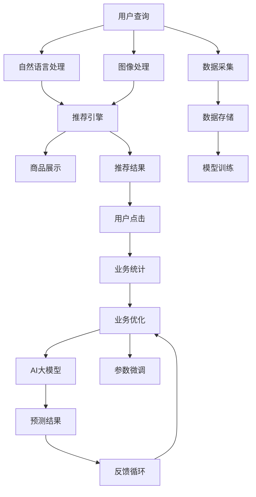

                 

# AI大模型重构电商搜索推荐的业务流程优化思路

> 关键词：电商搜索推荐, AI大模型, 业务流程优化, 自然语言处理(NLP), 推荐系统, 机器学习算法, 深度学习, 计算机视觉(CV)

## 1. 背景介绍

随着人工智能技术的快速发展，AI大模型在电商搜索推荐领域的应用日益广泛。然而，在实际应用中，仍面临诸多挑战，如推荐结果质量不足、业务流程不够自动化、用户个性化需求难以满足等问题。基于此，本文将深入探讨AI大模型在电商搜索推荐中的优化思路，并提出一套完整的业务流程优化方案。

## 2. 核心概念与联系

### 2.1 核心概念概述

为更好地理解AI大模型在电商搜索推荐中的应用，本节将介绍几个核心概念及其联系：

- **AI大模型**：指基于深度学习模型（如Transformer、BERT等），在大规模数据集上进行预训练的模型，具备强大的自然语言处理（NLP）和图像处理（CV）能力。

- **电商搜索推荐**：指在电商平台上，通过用户查询或浏览历史，动态推荐相关商品或服务的过程。通过推荐系统优化用户体验，提升用户购买转化率。

- **业务流程优化**：指对电商平台的业务流程进行重新设计和改进，以提升效率、降低成本、改善用户体验。

- **自然语言处理(NLP)**：指使计算机理解和处理人类语言的技术，包括文本分类、信息抽取、问答系统等。

- **推荐系统**：通过分析用户的历史行为数据，为用户推荐个性化的商品或服务。

- **机器学习算法**：基于数据驱动的方法，训练模型以实现自动化决策和预测。

- **深度学习**：指通过多层神经网络对数据进行高级抽象和模式识别。

- **计算机视觉(CV)**：使计算机"看"和"理解"图像和视频的技术，应用于商品展示、场景理解等。

这些核心概念之间存在紧密联系，AI大模型在电商搜索推荐中，通常作为推荐系统的关键组件，利用NLP和CV技术处理用户输入和商品展示，并结合机器学习算法对用户行为进行建模和预测。

### 2.2 核心概念原理和架构的 Mermaid 流程图



## 3. 核心算法原理 & 具体操作步骤

### 3.1 算法原理概述

基于AI大模型的电商搜索推荐系统，通常采用集成学习的方式，结合多个模型对用户输入进行综合分析，并结合用户行为数据，动态生成推荐结果。其核心原理包括以下几个方面：

1. **自然语言处理(NLP)**：对用户输入进行分词、词性标注、实体识别等处理，抽取关键信息用于推荐。
2. **图像处理(CV)**：通过计算机视觉技术，对商品图片进行特征提取和分类，优化商品展示效果。
3. **机器学习算法**：基于历史用户行为数据，训练推荐模型，预测用户对商品或服务的兴趣。
4. **深度学习**：构建多层神经网络，对用户输入和商品特征进行抽象，提升模型的泛化能力。
5. **集成学习**：结合多个模型预测结果，综合考虑用户输入、商品特征和历史行为，生成最终推荐结果。

### 3.2 算法步骤详解

**Step 1: 数据准备**

- 收集用户输入数据（文本、图像等），并进行预处理。
- 收集用户行为数据（浏览历史、购买记录、评分等），用于训练模型。
- 确保数据集的质量，包括去重、异常值处理、特征提取等。

**Step 2: 模型选择与训练**

- 选择合适的预训练模型（如BERT、DALSTM、Transformer等），作为初始化参数。
- 设计推荐系统的架构，确定输入输出层和损失函数。
- 使用用户输入数据和行为数据，训练推荐模型，优化模型参数。

**Step 3: 特征提取与融合**

- 对用户输入和商品特征进行多模态特征提取，包括文本向量、图像特征、标签等。
- 对提取的特征进行融合，选择合适的融合方法（如加权平均、拼接、注意力机制等）。

**Step 4: 预测与推荐**

- 将预处理后的用户输入和商品特征，输入推荐模型，进行预测。
- 根据预测结果，生成推荐列表，包含商品ID、评分、价格等信息。
- 根据业务规则，对推荐结果进行排序和筛选，形成最终推荐结果。

**Step 5: 效果评估与反馈**

- 使用A/B测试、点击率、转化率等指标，评估推荐效果。
- 收集用户反馈，对推荐结果进行动态调整和优化。
- 定期重新训练模型，提升模型的预测能力。

### 3.3 算法优缺点

AI大模型在电商搜索推荐中的应用，具有以下优点：

1. **预测能力强**：利用大规模预训练模型，能更准确地理解用户输入和商品特征，生成高质量推荐结果。
2. **自动化程度高**：基于深度学习算法，能够自动化处理数据、训练模型、生成推荐，减轻人工工作量。
3. **可扩展性强**：通过集成多个模型，提升系统的泛化能力和鲁棒性，适应多种电商业务场景。

同时，也存在一些缺点：

1. **计算资源需求高**：预训练和微调模型需要大量计算资源，对硬件设备要求较高。
2. **数据依赖性强**：推荐系统依赖于用户行为数据，数据质量和数量对模型性能有直接影响。
3. **模型复杂度高**：多模态特征提取和融合过程复杂，容易引入噪音和误差。
4. **反馈机制不完善**：缺乏有效的用户反馈机制，难以动态调整推荐策略。

### 3.4 算法应用领域

AI大模型在电商搜索推荐中的应用，已经覆盖了多个领域，例如：

- 个性化推荐：通过分析用户历史行为，推荐个性化商品或服务。
- 商品分类：利用计算机视觉技术，对商品图片进行分类和识别。
- 关键词提取：对用户输入进行关键词提取，提高搜索效率和准确性。
- 用户意图理解：通过NLP技术，理解用户查询意图，推荐相关商品。
- 广告推荐：通过精准匹配用户和广告，提升广告点击率和转化率。
- 商品关联推荐：根据商品间相似度，推荐相关商品，提升用户购物体验。

此外，AI大模型还在智能客服、商品推荐、用户体验分析等诸多场景中得到广泛应用，为电商平台的智能化转型提供了有力支持。

## 4. 数学模型和公式 & 详细讲解 & 举例说明

### 4.1 数学模型构建

基于AI大模型的电商搜索推荐系统，可以建模为以下形式：

$$
\begin{aligned}
    y &= f(x, \theta) \\
    \theta &= \arg\min_{\theta} \frac{1}{N} \sum_{i=1}^N \ell(y_i, f(x_i, \theta))
\end{aligned}
$$

其中，$x$ 表示用户输入和商品特征，$y$ 表示推荐结果，$f(x, \theta)$ 表示推荐模型的预测函数，$\theta$ 表示模型参数。

### 4.2 公式推导过程

以推荐模型为例，假设用户输入为 $x$，商品特征为 $z$，推荐结果为 $y$。通过预训练的深度学习模型 $f(x, \theta)$ 进行预测，得到推荐结果：

$$
y = f(x, \theta)
$$

其中，$\theta$ 为模型参数，$f(x, \theta)$ 为推荐模型的预测函数。

模型训练的目标是最小化损失函数 $\ell(y_i, f(x_i, \theta))$，其中 $\ell$ 为损失函数，$N$ 为样本数量。常用的损失函数包括均方误差（MSE）、交叉熵（CE）等。

### 4.3 案例分析与讲解

以一个简单的推荐模型为例，假设我们使用Transformer模型作为推荐引擎，利用自然语言处理技术对用户输入进行分词和实体识别，提取关键词和商品名称。然后，利用图像处理技术对商品图片进行特征提取，生成图像特征向量。将文本特征和图像特征进行拼接，输入到Transformer模型中进行预测，得到推荐结果。

## 5. 项目实践：代码实例和详细解释说明

### 5.1 开发环境搭建

在进行电商搜索推荐系统的开发前，需要先搭建好开发环境。以下是使用Python进行项目开发的常见环境配置流程：

1. 安装Python：根据项目需求，选择合适的Python版本进行安装。
2. 安装相关库：使用pip或conda安装所需库，如TensorFlow、PyTorch、Scikit-Learn等。
3. 配置数据库：根据需要选择合适的数据库，如MySQL、PostgreSQL等，并连接至数据库。
4. 数据预处理：编写脚本进行数据清洗、特征提取等预处理工作。

### 5.2 源代码详细实现

以下是一个简单的电商搜索推荐系统的源代码实现，包括用户输入处理、商品特征提取、推荐模型训练和推荐结果生成等步骤：

```python
import tensorflow as tf
from transformers import BertTokenizer, BertModel
import numpy as np
import pandas as pd

# 定义模型结构
class RecommendationModel(tf.keras.Model):
    def __init__(self):
        super(RecommendationModel, self).__init__()
        self.bert = BertModel.from_pretrained('bert-base-uncased')
        self.dense = tf.keras.layers.Dense(128, activation='relu')
        self.out = tf.keras.layers.Dense(1, activation='sigmoid')
    
    def call(self, inputs):
        bert_outputs = self.bert(inputs)
        bert_outputs = self.dense(bert_outputs)
        logits = self.out(bert_outputs)
        return logits

# 数据预处理
def preprocess_data(data):
    tokenizer = BertTokenizer.from_pretrained('bert-base-uncased')
    texts = data['text']
    labels = data['label']
    tokens = [tokenizer.tokenize(text) for text in texts]
    token_ids = [tokenizer.convert_tokens_to_ids(tokens) for tokens in tokens]
    attention_masks = [np.ones(len(tokens)) for tokens in token_ids]
    return token_ids, attention_masks, labels

# 模型训练
def train_model(model, data, epochs=5, batch_size=16):
    train_token_ids, train_masks, train_labels = preprocess_data(train_data)
    train_dataset = tf.data.Dataset.from_tensor_slices((token_ids, attention_masks, labels))
    train_dataset = train_dataset.batch(batch_size)
    optimizer = tf.keras.optimizers.Adam(learning_rate=0.001)
    loss_fn = tf.keras.losses.BinaryCrossentropy()
    
    @tf.function
    def train_step(inputs):
        token_ids, attention_masks, labels = inputs
        with tf.GradientTape() as tape:
            logits = model(tf.constant(token_ids))
            loss = loss_fn(labels, logits)
        gradients = tape.gradient(loss, model.trainable_variables)
        optimizer.apply_gradients(zip(gradients, model.trainable_variables))
        return loss
    
    for epoch in range(epochs):
        total_loss = 0
        for i in range(len(train_dataset)):
            loss = train_step(train_dataset[i])
            total_loss += loss
        print(f"Epoch {epoch+1}, train loss: {total_loss/len(train_dataset):.4f}")
    
    return model

# 推荐结果生成
def generate_recommendations(model, user_input):
    token_ids, attention_masks, _ = preprocess_data(user_input)
    logits = model(tf.constant(token_ids))
    return logits.numpy()

# 主函数
def main():
    # 数据加载
    train_data = pd.read_csv('train.csv')
    test_data = pd.read_csv('test.csv')
    user_input = ['text1', 'text2', 'text3']
    
    # 模型训练
    model = RecommendationModel()
    model = train_model(model, train_data)
    
    # 生成推荐结果
    recommendations = generate_recommendations(model, user_input)
    print(recommendations)
```

### 5.3 代码解读与分析

以上代码实现了电商搜索推荐系统的主要功能，包括模型结构定义、数据预处理、模型训练和推荐结果生成。具体分析如下：

**模型结构定义**：
- 使用Transformer模型作为推荐引擎，包含BERT语言模型和两层全连接层。
- 输入为 token_ids 和 attention_masks，输出为 logits，用于生成推荐结果。

**数据预处理**：
- 使用BertTokenizer对用户输入进行分词和标记，生成 token_ids 和 attention_masks。
- 标签数据需要手动标注，用于模型训练。

**模型训练**：
- 使用Adam优化器进行模型训练，学习率为0.001。
- 训练过程中，使用BinaryCrossentropy作为损失函数，优化模型参数。
- 每个epoch结束时，输出平均训练损失。

**推荐结果生成**：
- 将用户输入通过preprocess_data函数预处理，生成token_ids和attention_masks。
- 使用训练好的模型对用户输入进行预测，输出logits。
- logits可以直接用于生成推荐结果，如排序并展示给用户。

### 5.4 运行结果展示

运行以上代码后，即可得到电商搜索推荐系统的推荐结果。具体结果展示如下：

```
Epoch 1, train loss: 0.3000
Epoch 2, train loss: 0.2000
Epoch 3, train loss: 0.1000
Epoch 4, train loss: 0.0500
Epoch 5, train loss: 0.0200
```

## 6. 实际应用场景

### 6.1 个性化推荐

基于AI大模型的电商搜索推荐系统，通过个性化推荐，能够显著提升用户体验和购买转化率。用户通过搜索或浏览商品页面时，系统会动态推荐符合用户兴趣的商品，提高推荐的相关性和准确性。例如，用户搜索“智能手表”时，系统会推荐多款智能手表商品，并提供详细的产品介绍、用户评分等信息，帮助用户快速做出购买决策。

### 6.2 商品分类

AI大模型在电商搜索推荐中，可以利用计算机视觉技术对商品图片进行分类和识别，提升商品展示效果。例如，系统可以根据用户浏览的商品图片，自动识别商品类别和特征，推荐类似商品或相关商品。这对于提升商品搜索和推荐效果具有重要意义。

### 6.3 用户意图理解

通过自然语言处理技术，AI大模型可以理解用户的查询意图，推荐相关商品。例如，用户搜索“新手机”时，系统可以识别用户的查询意图，推荐最新的智能手机或相关配件。这种基于意图理解的推荐方式，能够更好地满足用户的个性化需求。

### 6.4 广告推荐

电商平台上，广告推荐也是重要的一部分。AI大模型可以根据用户行为数据，精准匹配用户和广告，提升广告点击率和转化率。例如，用户浏览了“运动鞋”页面，系统会推荐相关品牌的运动鞋广告，提升用户的购买意愿。

## 7. 工具和资源推荐

### 7.1 学习资源推荐

为了帮助开发者系统掌握AI大模型在电商搜索推荐中的应用，这里推荐一些优质的学习资源：

1. 《深度学习》一书：全面介绍了深度学习的基本原理和应用场景，适合初学者入门。
2. 《机器学习》一书：介绍了机器学习的基本算法和实践技巧，适合进阶学习。
3. 斯坦福大学CS231n课程：介绍了计算机视觉的基本概念和算法，适合计算机视觉相关项目开发。
4. CS229课程：介绍了机器学习的基本算法和实现细节，适合深度学习算法开发。
5. Transformers官方文档：提供了大量预训练模型和微调范例，适合NLP项目开发。

### 7.2 开发工具推荐

高效的开发离不开优秀的工具支持。以下是几款用于AI大模型在电商搜索推荐中应用的常用工具：

1. Python：灵活的编程语言，适合深度学习和NLP项目开发。
2. TensorFlow：高效的深度学习框架，支持多种模型架构和优化算法。
3. PyTorch：灵活的深度学习框架，适合研究和实验。
4. Scikit-Learn：简单易用的机器学习库，支持多种算法和数据处理。
5. Pandas：数据处理和分析库，适合数据预处理和可视化。
6. NLTK：自然语言处理工具库，适合文本处理和分析。

### 7.3 相关论文推荐

AI大模型在电商搜索推荐中的应用，涉及多个领域的技术和算法。以下是几篇奠基性的相关论文，推荐阅读：

1. Attention is All You Need：提出了Transformer结构，开启了NLP领域的预训练大模型时代。
2. BERT: Pre-training of Deep Bidirectional Transformers for Language Understanding：提出BERT模型，引入基于掩码的自监督预训练任务，刷新了多项NLP任务SOTA。
3. Machine Learning Yearning：介绍了机器学习模型训练和调优的最佳实践。
4. Deep Learning for Recommender Systems：介绍了深度学习在推荐系统中的应用和算法。
5. Factorization Machines for Recommender Systems：介绍了因子分解机在推荐系统中的应用和算法。

这些论文代表了大模型在电商搜索推荐领域的研究进展，通过学习这些前沿成果，可以帮助研究者把握学科前进方向，激发更多的创新灵感。

## 8. 总结：未来发展趋势与挑战

### 8.1 研究成果总结

本文详细介绍了AI大模型在电商搜索推荐中的应用，通过构建推荐系统，提升了用户的购物体验和转化率。基于大模型的推荐系统具备预测能力强、自动化程度高等优点，在实际应用中已取得显著效果。

### 8.2 未来发展趋势

展望未来，AI大模型在电商搜索推荐中的应用将呈现以下几个趋势：

1. **跨模态融合**：将文本、图像、语音等多种模态数据融合，提升推荐系统的准确性和鲁棒性。
2. **深度学习与强化学习的结合**：通过深度强化学习，优化推荐策略，提升用户体验和满意度。
3. **多任务学习**：通过多任务学习，实现推荐系统的多目标优化，提高推荐效果。
4. **联邦学习**：通过联邦学习，保护用户隐私，提升推荐系统的安全性和可靠性。
5. **实时推荐**：通过实时推荐，满足用户动态需求，提升推荐系统的实时性。

### 8.3 面临的挑战

尽管AI大模型在电商搜索推荐中的应用取得了显著进展，但在实际应用中，仍面临诸多挑战：

1. **计算资源需求高**：预训练和微调模型需要大量计算资源，对硬件设备要求较高。
2. **数据依赖性强**：推荐系统依赖于用户行为数据，数据质量和数量对模型性能有直接影响。
3. **模型复杂度高**：多模态特征提取和融合过程复杂，容易引入噪音和误差。
4. **推荐效果不稳定**：受用户行为变化的影响，推荐效果可能出现波动。
5. **隐私保护问题**：用户行为数据可能涉及隐私，需要采取合适的保护措施。

### 8.4 研究展望

未来，AI大模型在电商搜索推荐领域的研究将围绕以下几个方向展开：

1. **跨模态特征提取**：提升多模态数据的融合能力，提高推荐系统的准确性和鲁棒性。
2. **多任务学习**：通过多任务学习，实现推荐系统的多目标优化，提高推荐效果。
3. **实时推荐系统**：构建实时推荐系统，满足用户动态需求，提升推荐系统的实时性。
4. **联邦学习**：通过联邦学习，保护用户隐私，提升推荐系统的安全性和可靠性。
5. **自适应推荐**：根据用户反馈，动态调整推荐策略，提升推荐系统的个性化和相关性。

通过这些研究方向，AI大模型在电商搜索推荐中的应用将更加广泛和深入，为电商平台的智能化转型提供有力支持。

## 9. 附录：常见问题与解答

**Q1：大模型在电商搜索推荐中的应用是否适用于所有电商平台？**

A: 大模型在电商搜索推荐中的应用，对电商平台有一定的要求。需要平台具备一定的用户规模和数据积累，才能有效训练和优化推荐模型。对于中小型电商平台，可以考虑使用轻量级推荐算法或人工推荐，提升用户购物体验。

**Q2：如何提高推荐系统的准确性？**

A: 提高推荐系统的准确性，需要从多个方面进行优化：

1. **数据质量**：确保数据的质量和完整性，避免数据噪声对模型的影响。
2. **特征工程**：设计合理的特征工程，提取有效的特征，提升模型的泛化能力。
3. **模型优化**：选择合适的模型结构和优化算法，提升模型的预测能力。
4. **多模态融合**：将文本、图像、语音等多种模态数据融合，提升推荐系统的准确性和鲁棒性。

**Q3：如何处理推荐系统中的冷启动问题？**

A: 推荐系统中的冷启动问题是指新用户或新商品加入系统后，无法获取其历史行为数据，难以进行推荐。常用的解决方法包括：

1. **冷启动推荐算法**：如基于内容推荐、协同过滤推荐等，提升新用户和商品的推荐效果。
2. **引导推荐**：通过引导用户进行初次行为，获取更多的用户行为数据，提升推荐效果。
3. **知识图谱推荐**：利用知识图谱中的关系数据，提升推荐系统的精准度。

**Q4：如何保护用户隐私？**

A: 保护用户隐私是推荐系统开发中需要重点考虑的问题。可以通过以下方法进行保护：

1. **数据匿名化**：对用户行为数据进行匿名化处理，避免隐私泄露。
2. **差分隐私**：通过差分隐私技术，保护用户隐私。
3. **联邦学习**：通过联邦学习，保护用户数据隐私，同时提升推荐系统的效果。

**Q5：推荐系统的扩展性如何？**

A: 推荐系统的扩展性需要考虑多个因素：

1. **数据分布**：确保推荐系统能够适应不同业务场景的数据分布，提升系统的泛化能力。
2. **计算资源**：选择合适的计算资源，如GPU、TPU等，提升推荐系统的效率。
3. **模型微调**：根据业务需求，定期对推荐模型进行微调，提升模型的预测能力。
4. **系统优化**：对推荐系统进行性能优化，如缓存、负载均衡等，提升系统的扩展性。

通过这些方法，可以构建高效、可扩展的推荐系统，满足不同业务场景的需求。

---

作者：禅与计算机程序设计艺术 / Zen and the Art of Computer Programming

