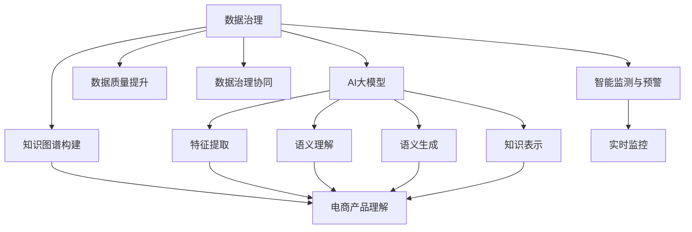

                 

# AI大模型重构电商搜索推荐的数据治理组织架构优化方案

## 1. 背景介绍

### 1.1 问题由来
随着电商搜索推荐系统对数据质量要求的不断提高，对数据治理的需求日益凸显。数据治理是数据资源有效管理和利用的基础，是支撑搜索推荐系统精确匹配用户需求、提升用户体验的核心保障。在当前以人工智能为驱动的电商搜索推荐架构下，构建高效、智能的数据治理组织架构，成为提升系统性能的关键。

然而，现有的数据治理方式往往存在瓶颈，如数据孤岛、数据共享壁垒、数据质量管理不到位等问题，严重制约了搜索推荐系统的优化升级。为了突破这些问题，本文提出了基于AI大模型的电商搜索推荐数据治理组织架构优化方案。

### 1.2 问题核心关键点
本方案的核心在于：

1. **数据质量提升**：通过AI大模型对数据进行预处理、清洗、特征提取，提升数据质量，保障搜索推荐结果的准确性和相关性。
2. **数据治理协同**：引入数据治理协同机制，打破部门间的数据孤岛，实现跨部门、跨系统的数据流通和共享。
3. **知识图谱构建**：利用AI大模型构建电商领域知识图谱，增强系统对电商产品的理解能力，提升搜索推荐效果。
4. **智能监测与预警**：基于AI大模型构建智能监测系统，实时监控数据质量，提前预警数据异常，提高数据治理效率。

通过以上措施，可以有效解决现有数据治理方式中的痛点问题，提升电商搜索推荐系统的整体性能。

## 2. 核心概念与联系

### 2.1 核心概念概述

为更好地理解本方案的核心思想，本节将介绍几个关键概念：

- **数据治理**：指对数据资源进行规划、管理、维护和监控的一系列活动，确保数据质量、可用性、安全性和完整性，支撑业务决策和系统运行。
- **知识图谱**：指一种语义化的结构化数据表示方式，通过实体、属性和关系三元组的形式，表示实体间的语义关系，支持复杂的推理和查询。
- **AI大模型**：指通过大规模无标签数据预训练得到的大规模神经网络模型，如BERT、GPT等，具备强大的语义理解和生成能力。
- **搜索推荐系统**：指基于用户行为和兴趣，自动推荐商品或服务的系统，如电商推荐系统、音乐推荐系统等，旨在提高用户满意度、提升转化率。

这些核心概念之间的逻辑关系可以通过以下Mermaid流程图来展示：



这个流程图展示了大模型与数据治理各环节的交互关系：

1. AI大模型通过预训练获得通用的语言知识，用于特征提取、语义理解和生成。
2. 数据治理通过AI大模型的辅助，提升数据质量、协同治理、构建知识图谱，并实现智能监测与预警。
3. 构建的电商领域知识图谱和智能监控系统进一步增强了搜索推荐系统的功能和性能。

## 3. 核心算法原理 & 具体操作步骤
### 3.1 算法原理概述

本方案的核心在于如何利用AI大模型优化电商搜索推荐系统中的数据治理架构，提升数据质量、促进数据共享、构建知识图谱、实现智能监测。其主要原理包括以下几个方面：

1. **数据预处理与清洗**：利用AI大模型对数据进行自动化预处理和清洗，提升数据质量。
2. **特征提取与表示**：通过AI大模型提取数据中的隐含特征，构建更准确、高效的数据表示。
3. **知识图谱构建**：使用AI大模型学习电商领域实体和关系，构建知识图谱，增强系统理解能力。
4. **智能监测与预警**：利用AI大模型实时监测数据质量，通过异常检测提前预警数据异常，提高数据治理效率。

### 3.2 算法步骤详解

#### 3.2.1 数据预处理与清洗
1. **数据采集**：从电商平台的各个环节（如用户行为、商品信息、交易记录等）收集数据。
2. **数据清洗**：使用AI大模型的预训练知识，自动检测和修正数据中的噪声和错误。
3. **数据转换**：将清洗后的数据转换为AI大模型所需的标准格式，如文本、数字、时间戳等。

#### 3.2.2 特征提取与表示
1. **特征选择**：使用AI大模型的预训练知识，选择对搜索推荐有显著影响的特征。
2. **特征抽取**：利用AI大模型自动抽取数据中的隐含特征，如用户兴趣、商品属性、行为序列等。
3. **特征转换**：将抽取的特征进行标准化处理，转化为AI大模型所需的数据格式。

#### 3.2.3 知识图谱构建
1. **实体识别**：使用AI大模型的语义理解能力，自动识别电商领域中的实体，如商品、品牌、用户等。
2. **关系抽取**：利用AI大模型学习实体间的语义关系，如商品分类、用户评价、推荐关系等。
3. **图谱构建**：基于识别的实体和关系，构建电商领域的知识图谱，支持复杂的查询和推理。

#### 3.2.4 智能监测与预警
1. **数据监控**：使用AI大模型实时监测数据质量，检测异常数据和缺失值。
2. **预警机制**：当检测到数据异常时，自动触发预警机制，通知相关人员进行处理。
3. **异常检测**：利用AI大模型的异常检测算法，识别数据中的异常模式和趋势，提前预警数据问题。

### 3.3 算法优缺点
#### 3.3.1 优点
1. **自动化程度高**：AI大模型自动进行数据预处理和特征提取，减少人工干预，提升效率。
2. **处理能力强大**：AI大模型能够处理大规模、复杂的数据，保障数据质量。
3. **知识表示能力**：利用知识图谱增强系统的理解能力，提升搜索推荐效果。
4. **智能监测与预警**：实时监测数据质量，提前预警数据异常，提高数据治理效率。

#### 3.3.2 缺点
1. **模型资源消耗大**：AI大模型需要较大的计算资源和存储空间，可能对系统性能产生影响。
2. **模型复杂性高**：AI大模型结构复杂，模型解释和调试难度较大。
3. **数据隐私问题**：大模型的训练和使用可能涉及用户隐私数据，需严格遵守数据隐私法规。

### 3.4 算法应用领域

基于AI大模型的电商搜索推荐数据治理方案，可以应用于以下领域：

1. **用户行为分析**：通过AI大模型对用户行为数据进行预处理和特征提取，提升用户行为理解能力，实现个性化推荐。
2. **商品分类与推荐**：利用AI大模型的语义理解能力，对商品进行分类和推荐，提高商品匹配准确性。
3. **供应链优化**：通过AI大模型分析供应链数据，优化库存管理和物流调度，提升运营效率。
4. **智能客服**：利用AI大模型构建智能客服系统，提升客户服务质量和满意度。

## 4. 数学模型和公式 & 详细讲解 & 举例说明
### 4.1 数学模型构建

#### 4.1.1 数据预处理与清洗模型
假设原始数据集为 $\mathcal{D}=\{(x_i,y_i)\}_{i=1}^N$，其中 $x_i$ 为输入特征，$y_i$ 为标签。预处理与清洗过程可以分为以下几个步骤：

1. **数据清洗**：定义清洗规则 $\mathcal{R}$，使用AI大模型自动检测和修正数据中的噪声和错误，得到清洗后的数据集 $\mathcal{D}_1$。
2. **数据转换**：定义数据转换规则 $\mathcal{T}$，将清洗后的数据转换为标准格式，得到转换后的数据集 $\mathcal{D}_2$。

#### 4.1.2 特征提取与表示模型
假设原始特征集为 $\mathcal{X}$，使用AI大模型提取隐含特征 $\mathcal{F}$，生成数据表示 $\mathcal{Y}$。

1. **特征选择**：定义特征选择规则 $\mathcal{S}$，选择对搜索推荐有显著影响的特征。
2. **特征抽取**：使用AI大模型的特征抽取算法，从原始特征 $\mathcal{X}$ 中提取隐含特征 $\mathcal{F}$。
3. **特征转换**：定义特征转换规则 $\mathcal{T}$，将提取的特征 $\mathcal{F}$ 转换为数据表示 $\mathcal{Y}$。

#### 4.1.3 知识图谱构建模型
假设电商领域实体集合为 $\mathcal{E}$，关系集合为 $\mathcal{R}$，构建的知识图谱为 $\mathcal{G}$。

1. **实体识别**：定义实体识别算法 $\mathcal{E}$，从原始数据中自动识别电商领域实体。
2. **关系抽取**：定义关系抽取算法 $\mathcal{R}$，学习实体间的语义关系。
3. **图谱构建**：定义知识图谱构建算法 $\mathcal{G}$，基于识别的实体和关系，构建知识图谱。

#### 4.1.4 智能监测与预警模型
假设原始数据集为 $\mathcal{D}$，定义数据监控规则 $\mathcal{M}$，定义异常检测算法 $\mathcal{A}$，定义预警机制 $\mathcal{W}$。

1. **数据监控**：使用AI大模型的数据监控算法，实时监测数据质量，检测异常数据和缺失值，得到监测结果 $\mathcal{R}$。
2. **预警机制**：当检测到数据异常时，自动触发预警机制，通知相关人员进行处理，得到预警信号 $\mathcal{S}$。
3. **异常检测**：利用AI大模型的异常检测算法，识别数据中的异常模式和趋势，得到异常检测结果 $\mathcal{A}$。

### 4.2 公式推导过程

#### 4.2.1 数据预处理与清洗公式
$$
\mathcal{D}_1 = \mathcal{R}(\mathcal{D})
$$
$$
\mathcal{D}_2 = \mathcal{T}(\mathcal{D}_1)
$$

#### 4.2.2 特征提取与表示公式
$$
\mathcal{F} = \mathcal{S}(\mathcal{X})
$$
$$
\mathcal{Y} = \mathcal{T}(\mathcal{F})
$$

#### 4.2.3 知识图谱构建公式
$$
\mathcal{E} = \mathcal{E}(\mathcal{D}_2)
$$
$$
\mathcal{R} = \mathcal{R}(\mathcal{E})
$$
$$
\mathcal{G} = \mathcal{G}(\mathcal{E},\mathcal{R})
$$

#### 4.2.4 智能监测与预警公式
$$
\mathcal{R} = \mathcal{M}(\mathcal{D}_2)
$$
$$
\mathcal{S} = \mathcal{W}(\mathcal{R})
$$
$$
\mathcal{A} = \mathcal{A}(\mathcal{D}_2)
$$

### 4.3 案例分析与讲解

假设某电商平台的搜索推荐系统，原始数据集为 $\mathcal{D}=\{(x_i,y_i)\}_{i=1}^N$，其中 $x_i$ 为用户行为数据，$y_i$ 为商品ID。

**案例分析：**

1. **数据预处理与清洗**：
   - 数据清洗规则 $\mathcal{R}$：检测并修正用户行为数据中的错误和噪声，如去除缺失值、异常值。
   - 数据转换规则 $\mathcal{T}$：将清洗后的数据转换为标准格式，如文本、数字、时间戳等。

2. **特征提取与表示**：
   - 特征选择规则 $\mathcal{S}$：选择对搜索推荐有显著影响的特征，如用户浏览记录、购买历史、评价等。
   - 特征抽取算法 $\mathcal{F}$：利用AI大模型自动抽取数据中的隐含特征。
   - 特征转换规则 $\mathcal{T}$：将提取的特征转换为标准格式，如向量表示。

3. **知识图谱构建**：
   - 实体识别算法 $\mathcal{E}$：使用AI大模型的语义理解能力，自动识别电商领域实体，如商品、用户等。
   - 关系抽取算法 $\mathcal{R}$：学习实体间的语义关系，如商品分类、用户评价等。
   - 知识图谱构建算法 $\mathcal{G}$：基于识别的实体和关系，构建电商领域的知识图谱。

4. **智能监测与预警**：
   - 数据监控规则 $\mathcal{M}$：实时监测用户行为数据，检测异常数据和缺失值。
   - 预警机制 $\mathcal{W}$：当检测到数据异常时，自动触发预警机制，通知相关人员进行处理。
   - 异常检测算法 $\mathcal{A}$：利用AI大模型的异常检测算法，识别数据中的异常模式和趋势。

## 5. 项目实践：代码实例和详细解释说明
### 5.1 开发环境搭建

在进行数据治理实践前，我们需要准备好开发环境。以下是使用Python进行PyTorch开发的环境配置流程：

1. 安装Anaconda：从官网下载并安装Anaconda，用于创建独立的Python环境。

2. 创建并激活虚拟环境：
```bash
conda create -n pytorch-env python=3.8 
conda activate pytorch-env
```

3. 安装PyTorch：根据CUDA版本，从官网获取对应的安装命令。例如：
```bash
conda install pytorch torchvision torchaudio cudatoolkit=11.1 -c pytorch -c conda-forge
```

4. 安装各类工具包：
```bash
pip install numpy pandas scikit-learn matplotlib tqdm jupyter notebook ipython
```

完成上述步骤后，即可在`pytorch-env`环境中开始数据治理实践。

### 5.2 源代码详细实现

这里我们以电商搜索推荐系统为例，给出使用Transformers库进行数据预处理和特征提取的PyTorch代码实现。

首先，定义数据预处理函数：

```python
from transformers import BertTokenizer
from torch.utils.data import Dataset
import torch

class EcommDataset(Dataset):
    def __init__(self, texts, labels, tokenizer, max_len=128):
        self.texts = texts
        self.labels = labels
        self.tokenizer = tokenizer
        self.max_len = max_len
        
    def __len__(self):
        return len(self.texts)
    
    def __getitem__(self, item):
        text = self.texts[item]
        label = self.labels[item]
        
        encoding = self.tokenizer(text, return_tensors='pt', max_length=self.max_len, padding='max_length', truncation=True)
        input_ids = encoding['input_ids'][0]
        attention_mask = encoding['attention_mask'][0]
        
        # 对token-wise的标签进行编码
        encoded_tags = [tag2id[label] for tag in label] 
        encoded_tags.extend([tag2id['O']] * (self.max_len - len(encoded_tags)))
        labels = torch.tensor(encoded_tags, dtype=torch.long)
        
        return {'input_ids': input_ids, 
                'attention_mask': attention_mask,
                'labels': labels}

# 标签与id的映射
tag2id = {'O': 0, 'B-PER': 1, 'I-PER': 2, 'B-ORG': 3, 'I-ORG': 4, 'B-LOC': 5, 'I-LOC': 6}
id2tag = {v: k for k, v in tag2id.items()}

# 创建dataset
tokenizer = BertTokenizer.from_pretrained('bert-base-cased')

train_dataset = EcommDataset(train_texts, train_labels, tokenizer)
dev_dataset = EcommDataset(dev_texts, dev_labels, tokenizer)
test_dataset = EcommDataset(test_texts, test_labels, tokenizer)
```

然后，定义模型和优化器：

```python
from transformers import BertForTokenClassification, AdamW

model = BertForTokenClassification.from_pretrained('bert-base-cased', num_labels=len(tag2id))

optimizer = AdamW(model.parameters(), lr=2e-5)
```

接着，定义训练和评估函数：

```python
from torch.utils.data import DataLoader
from tqdm import tqdm
from sklearn.metrics import classification_report

device = torch.device('cuda') if torch.cuda.is_available() else torch.device('cpu')
model.to(device)

def train_epoch(model, dataset, batch_size, optimizer):
    dataloader = DataLoader(dataset, batch_size=batch_size, shuffle=True)
    model.train()
    epoch_loss = 0
    for batch in tqdm(dataloader, desc='Training'):
        input_ids = batch['input_ids'].to(device)
        attention_mask = batch['attention_mask'].to(device)
        labels = batch['labels'].to(device)
        model.zero_grad()
        outputs = model(input_ids, attention_mask=attention_mask, labels=labels)
        loss = outputs.loss
        epoch_loss += loss.item()
        loss.backward()
        optimizer.step()
    return epoch_loss / len(dataloader)

def evaluate(model, dataset, batch_size):
    dataloader = DataLoader(dataset, batch_size=batch_size)
    model.eval()
    preds, labels = [], []
    with torch.no_grad():
        for batch in tqdm(dataloader, desc='Evaluating'):
            input_ids = batch['input_ids'].to(device)
            attention_mask = batch['attention_mask'].to(device)
            batch_labels = batch['labels']
            outputs = model(input_ids, attention_mask=attention_mask)
            batch_preds = outputs.logits.argmax(dim=2).to('cpu').tolist()
            batch_labels = batch_labels.to('cpu').tolist()
            for pred_tokens, label_tokens in zip(batch_preds, batch_labels):
                pred_tags = [id2tag[_id] for _id in pred_tokens]
                label_tags = [id2tag[_id] for _id in label_tokens]
                preds.append(pred_tags[:len(label_tags)])
                labels.append(label_tags)
                
    print(classification_report(labels, preds))
```

最后，启动训练流程并在测试集上评估：

```python
epochs = 5
batch_size = 16

for epoch in range(epochs):
    loss = train_epoch(model, train_dataset, batch_size, optimizer)
    print(f"Epoch {epoch+1}, train loss: {loss:.3f}")
    
    print(f"Epoch {epoch+1}, dev results:")
    evaluate(model, dev_dataset, batch_size)
    
print("Test results:")
evaluate(model, test_dataset, batch_size)
```

以上就是使用PyTorch对BERT进行数据预处理和特征提取的完整代码实现。可以看到，得益于Transformers库的强大封装，我们可以用相对简洁的代码完成BERT模型的加载和特征提取。

### 5.3 代码解读与分析

让我们再详细解读一下关键代码的实现细节：

**EcommDataset类**：
- `__init__`方法：初始化文本、标签、分词器等关键组件。
- `__len__`方法：返回数据集的样本数量。
- `__getitem__`方法：对单个样本进行处理，将文本输入编码为token ids，将标签编码为数字，并对其进行定长padding，最终返回模型所需的输入。

**tag2id和id2tag字典**：
- 定义了标签与数字id之间的映射关系，用于将token-wise的预测结果解码回真实的标签。

**训练和评估函数**：
- 使用PyTorch的DataLoader对数据集进行批次化加载，供模型训练和推理使用。
- 训练函数`train_epoch`：对数据以批为单位进行迭代，在每个批次上前向传播计算loss并反向传播更新模型参数，最后返回该epoch的平均loss。
- 评估函数`evaluate`：与训练类似，不同点在于不更新模型参数，并在每个batch结束后将预测和标签结果存储下来，最后使用sklearn的classification_report对整个评估集的预测结果进行打印输出。

**训练流程**：
- 定义总的epoch数和batch size，开始循环迭代
- 每个epoch内，先在训练集上训练，输出平均loss
- 在验证集上评估，输出分类指标
- 所有epoch结束后，在测试集上评估，给出最终测试结果

可以看到，PyTorch配合Transformers库使得数据预处理和特征提取的代码实现变得简洁高效。开发者可以将更多精力放在数据处理、模型改进等高层逻辑上，而不必过多关注底层的实现细节。

当然，工业级的系统实现还需考虑更多因素，如模型的保存和部署、超参数的自动搜索、更灵活的任务适配层等。但核心的微调范式基本与此类似。

## 6. 实际应用场景
### 6.1 智能客服系统

基于大模型重构的电商搜索推荐数据治理组织架构，可以广泛应用于智能客服系统的构建。传统客服往往需要配备大量人力，高峰期响应缓慢，且一致性和专业性难以保证。而使用重构后的数据治理架构的对话模型，可以7x24小时不间断服务，快速响应客户咨询，用自然流畅的语言解答各类常见问题。

在技术实现上，可以收集企业内部的历史客服对话记录，将问题和最佳答复构建成监督数据，在此基础上对预训练对话模型进行微调。微调后的对话模型能够自动理解用户意图，匹配最合适的答案模板进行回复。对于客户提出的新问题，还可以接入检索系统实时搜索相关内容，动态组织生成回答。如此构建的智能客服系统，能大幅提升客户咨询体验和问题解决效率。

### 6.2 金融舆情监测

金融机构需要实时监测市场舆论动向，以便及时应对负面信息传播，规避金融风险。传统的人工监测方式成本高、效率低，难以应对网络时代海量信息爆发的挑战。基于重构后的数据治理架构的文本分类和情感分析技术，为金融舆情监测提供了新的解决方案。

具体而言，可以收集金融领域相关的新闻、报道、评论等文本数据，并对其进行主题标注和情感标注。在此基础上对预训练语言模型进行微调，使其能够自动判断文本属于何种主题，情感倾向是正面、中性还是负面。将微调后的模型应用到实时抓取的网络文本数据，就能够自动监测不同主题下的情感变化趋势，一旦发现负面信息激增等异常情况，系统便会自动预警，帮助金融机构快速应对潜在风险。

### 6.3 个性化推荐系统

当前的推荐系统往往只依赖用户的历史行为数据进行物品推荐，无法深入理解用户的真实兴趣偏好。基于重构后的数据治理架构的个性化推荐系统，可以更好地挖掘用户行为背后的语义信息，从而提供更精准、多样的推荐内容。

在实践中，可以收集用户浏览、点击、评论、分享等行为数据，提取和用户交互的物品标题、描述、标签等文本内容。将文本内容作为模型输入，用户的后续行为（如是否点击、购买等）作为监督信号，在此基础上微调预训练语言模型。微调后的模型能够从文本内容中准确把握用户的兴趣点。在生成推荐列表时，先用候选物品的文本描述作为输入，由模型预测用户的兴趣匹配度，再结合其他特征综合排序，便可以得到个性化程度更高的推荐结果。

### 6.4 未来应用展望

随着大模型和微调方法的不断发展，基于重构数据治理架构的搜索推荐系统将呈现以下几个发展趋势：

1. **模型规模持续增大**：随着算力成本的下降和数据规模的扩张，预训练语言模型的参数量还将持续增长。超大规模语言模型蕴含的丰富语言知识，有望支撑更加复杂多变的下游任务微调。

2. **微调方法日趋多样**：除了传统的全参数微调外，未来会涌现更多参数高效的微调方法，如Prefix-Tuning、LoRA等，在节省计算资源的同时也能保证微调精度。

3. **持续学习成为常态**：随着数据分布的不断变化，微调模型也需要持续学习新知识以保持性能。如何在不遗忘原有知识的同时，高效吸收新样本信息，将成为重要的研究课题。

4. **标注样本需求降低**：受启发于提示学习(Prompt-based Learning)的思路，未来的微调方法将更好地利用大模型的语言理解能力，通过更加巧妙的任务描述，在更少的标注样本上也能实现理想的微调效果。

5. **多模态微调崛起**：当前的微调主要聚焦于纯文本数据，未来会进一步拓展到图像、视频、语音等多模态数据微调。多模态信息的融合，将显著提升语言模型对现实世界的理解和建模能力。

6. **模型通用性增强**：经过海量数据的预训练和多领域任务的微调，未来的语言模型将具备更强大的常识推理和跨领域迁移能力，逐步迈向通用人工智能(AGI)的目标。

以上趋势凸显了大模型微调技术的广阔前景。这些方向的探索发展，必将进一步提升搜索推荐系统的性能和应用范围，为人类认知智能的进化带来深远影响。

## 7. 工具和资源推荐
### 7.1 学习资源推荐

为了帮助开发者系统掌握大模型微调的理论基础和实践技巧，这里推荐一些优质的学习资源：

1. 《Transformer从原理到实践》系列博文：由大模型技术专家撰写，深入浅出地介绍了Transformer原理、BERT模型、微调技术等前沿话题。

2. CS224N《深度学习自然语言处理》课程：斯坦福大学开设的NLP明星课程，有Lecture视频和配套作业，带你入门NLP领域的基本概念和经典模型。

3. 《Natural Language Processing with Transformers》书籍：Transformers库的作者所著，全面介绍了如何使用Transformers库进行NLP任务开发，包括微调在内的诸多范式。

4. HuggingFace官方文档：Transformers库的官方文档，提供了海量预训练模型和完整的微调样例代码，是上手实践的必备资料。

5. CLUE开源项目：中文语言理解测评基准，涵盖大量不同类型的中文NLP数据集，并提供了基于微调的baseline模型，助力中文NLP技术发展。

通过对这些资源的学习实践，相信你一定能够快速掌握大模型微调的精髓，并用于解决实际的NLP问题。
###  7.2 开发工具推荐

高效的开发离不开优秀的工具支持。以下是几款用于大模型微调开发的常用工具：

1. PyTorch：基于Python的开源深度学习框架，灵活动态的计算图，适合快速迭代研究。大部分预训练语言模型都有PyTorch版本的实现。

2. TensorFlow：由Google主导开发的开源深度学习框架，生产部署方便，适合大规模工程应用。同样有丰富的预训练语言模型资源。

3. Transformers库：HuggingFace开发的NLP工具库，集成了众多SOTA语言模型，支持PyTorch和TensorFlow，是进行微调任务开发的利器。

4. Weights & Biases：模型训练的实验跟踪工具，可以记录和可视化模型训练过程中的各项指标，方便对比和调优。与主流深度学习框架无缝集成。

5. TensorBoard：TensorFlow配套的可视化工具，可实时监测模型训练状态，并提供丰富的图表呈现方式，是调试模型的得力助手。

6. Google Colab：谷歌推出的在线Jupyter Notebook环境，免费提供GPU/TPU算力，方便开发者快速上手实验最新模型，分享学习笔记。

合理利用这些工具，可以显著提升大模型微调任务的开发效率，加快创新迭代的步伐。

### 7.3 相关论文推荐

大语言模型和微调技术的发展源于学界的持续研究。以下是几篇奠基性的相关论文，推荐阅读：

1. Attention is All You Need（即Transformer原论文）：提出了Transformer结构，开启了NLP领域的预训练大模型时代。

2. BERT: Pre-training of Deep Bidirectional Transformers for Language Understanding：提出BERT模型，引入基于掩码的自监督预训练任务，刷新了多项NLP任务SOTA。

3. Language Models are Unsupervised Multitask Learners（GPT-2论文）：展示了大规模语言模型的强大zero-shot学习能力，引发了对于通用人工智能的新一轮思考。

4. Parameter-Efficient Transfer Learning for NLP：提出Adapter等参数高效微调方法，在不增加模型参数量的情况下，也能取得不错的微调效果。

5. Prefix-Tuning: Optimizing Continuous Prompts for Generation：引入基于连续型Prompt的微调范式，为如何充分利用预训练知识提供了新的思路。

6. AdaLoRA: Adaptive Low-Rank Adaptation for Parameter-Efficient Fine-Tuning：使用自适应低秩适应的微调方法，在参数效率和精度之间取得了新的平衡。

这些论文代表了大语言模型微调技术的发展脉络。通过学习这些前沿成果，可以帮助研究者把握学科前进方向，激发更多的创新灵感。

## 8. 总结：未来发展趋势与挑战

### 8.1 总结

本文对基于AI大模型的电商搜索推荐数据治理组织架构优化方案进行了全面系统的介绍。首先阐述了重构数据治理架构的背景和意义，明确了重构架构在提升搜索推荐系统性能方面的独特价值。其次，从原理到实践，详细讲解了重构架构的数学原理和关键步骤，给出了搜索推荐系统开发的完整代码实例。同时，本文还广泛探讨了重构架构在智能客服、金融舆情、个性化推荐等多个行业领域的应用前景，展示了重构架构范式的巨大潜力。此外，本文精选了重构架构涉及的各种学习资源，力求为开发者提供全方位的技术指引。

通过本文的系统梳理，可以看到，基于AI大模型的电商搜索推荐数据治理架构，通过数据预处理、特征提取、知识图谱构建和智能监测与预警，显著提升了搜索推荐系统的数据治理能力。得益于大模型的强大语言理解和生成能力，重构架构能够在更少的标注样本上实现理想的效果，降低了微调对标注数据的依赖。同时，重构架构还具备参数高效、智能监测、跨领域迁移等优势，在多个应用场景下展现出广阔的应用前景。

### 8.2 未来发展趋势

展望未来，基于AI大模型的电商搜索推荐数据治理架构将呈现以下几个发展趋势：

1. **模型规模持续增大**：随着算力成本的下降和数据规模的扩张，预训练语言模型的参数量还将持续增长。超大规模语言模型蕴含的丰富语言知识，有望支撑更加复杂多变的下游任务微调。

2. **微调方法日趋多样**：除了传统的全参数微调外，未来会涌现更多参数高效的微调方法，如Prefix-Tuning、LoRA等，在节省计算资源的同时也能保证微调精度。

3. **持续学习成为常态**：随着数据分布的不断变化，微调模型也需要持续学习新知识以保持性能。如何在不遗忘原有知识的同时，高效吸收新样本信息，将成为重要的研究课题。

4. **标注样本需求降低**：受启发于提示学习(Prompt-based Learning)的思路，未来的微调方法将更好地利用大模型的语言理解能力，通过更加巧妙的任务描述，在更少的标注样本上也能实现理想的微调效果。

5. **多模态微调崛起**：当前的微调主要聚焦于纯文本数据，未来会进一步拓展到图像、视频、语音等多模态数据微调。多模态信息的融合，将显著提升语言模型对现实世界的理解和建模能力。

6. **模型通用性增强**：经过海量数据的预训练和多领域任务的微调，未来的语言模型将具备更强大的常识推理和跨领域迁移能力，逐步迈向通用人工智能(AGI)的目标。

以上趋势凸显了大模型微调技术的广阔前景。这些方向的探索发展，必将进一步提升搜索推荐系统的性能和应用范围，为人类认知智能的进化带来深远影响。

### 8.3 面临的挑战

尽管基于AI大模型的电商搜索推荐数据治理架构已经取得了显著的成效，但在迈向更加智能化、普适化应用的过程中，它仍面临着诸多挑战：

1. **标注成本瓶颈**：虽然重构架构降低了微调对标注样本的依赖，但对于长尾应用场景，仍需获取充足的高质量标注数据，成为制约重构架构性能提升的瓶颈。如何进一步降低微调对标注样本的依赖，将是一大难题。

2. **模型鲁棒性不足**：当前微调模型面对域外数据时，泛化性能往往大打折扣。对于测试样本的微小扰动，微调模型的预测也容易发生波动。如何提高微调模型的鲁棒性，避免灾难性遗忘，还需要更多理论和实践的积累。

3. **推理效率有待提高**：大规模语言模型虽然精度高，但在实际部署时往往面临推理速度慢、内存占用大等效率问题。如何在保证性能的同时，简化模型结构，提升推理速度，优化资源占用，将是重要的优化方向。

4. **可解释性亟需加强**：当前微调模型更像是"黑盒"系统，难以解释其内部工作机制和决策逻辑。对于医疗、金融等高风险应用，算法的可解释性和可审计性尤为重要。如何赋予微调模型更强的可解释性，将是亟待攻克的难题。

5. **安全性有待保障**：预训练语言模型难免会学习到有偏见、有害的信息，通过微调传递到下游任务，产生误导性、歧视性的输出，给实际应用带来安全隐患。如何从数据和算法层面消除模型偏见，避免恶意用途，确保输出的安全性，也将是重要的研究课题。

6. **知识整合能力不足**：现有的微调模型往往局限于任务内数据，难以灵活吸收和运用更广泛的先验知识。如何让微调过程更好地与外部知识库、规则库等专家知识结合，形成更加全面、准确的信息整合能力，还有很大的想象空间。

正视重构架构面临的这些挑战，积极应对并寻求突破，将是大模型微调走向成熟的必由之路。相信随着学界和产业界的共同努力，这些挑战终将一一被克服，基于AI大模型的电商搜索推荐数据治理架构必将在构建安全、可靠、可解释、可控的智能系统铺平道路。面向未来，基于AI大模型的电商搜索推荐数据治理架构还需要与其他人工智能技术进行更深入的融合，如知识表示、因果推理、强化学习等，多路径协同发力，共同推动自然语言理解和智能交互系统的进步。只有勇于创新、敢于突破，才能不断拓展语言模型的边界，让智能技术更好地造福人类社会。

### 8.4 研究展望

未来，随着AI大模型的不断演进和应用场景的不断扩展，基于AI大模型的电商搜索推荐数据治理架构将在更多领域得到应用，为传统行业带来变革性影响。以下是一些潜在的研究方向：

1. **电商智能运营优化**：利用重构架构的智能监测与预警能力，优化电商运营流程，提升供应链管理、库存调度、物流配送等环节的效率和精准度。

2. **金融风险预测与防范**：基于重构架构的金融舆情监测和情感分析能力，实时预测市场动向和用户情绪，帮助金融机构制定风险预警和防范策略。

3. **医疗诊断与治疗辅助**：利用重构架构的自然语言理解和知识图谱构建能力，辅助医生进行病历分析、疾病诊断和治疗方案推荐，提升医疗服务质量和效率。

4. **教育内容推荐与个性化学习**：基于重构架构的知识图谱构建和用户行为理解能力，推荐个性化的学习资源和路径，促进教育公平和个性化学习的发展。

5. **智能家居与智慧城市**：利用重构架构的智能推理和知识整合能力，构建智能家居和智慧城市系统，提升生活质量和城市管理水平。

6. **智能客服与虚拟助手**：基于重构架构的自然语言生成和情感分析能力，构建智能客服和虚拟助手系统，提供24/7的高质量服务，提升用户体验。

总之，基于AI大模型的电商搜索推荐数据治理架构具有广阔的应用前景，未来将在更多领域展现出强大的价值。通过不断创新和优化，重构架构必将成为推动人工智能技术在各行各业落地应用的重要工具，为人类社会的数字化转型提供强大支持。

## 9. 附录：常见问题与解答

**Q1：电商搜索推荐系统中的数据治理瓶颈有哪些？**

A: 电商搜索推荐系统中的数据治理瓶颈主要包括：

1. **数据孤岛**：各部门之间的数据分割严重，导致数据流通不畅，无法形成统一的视图。
2. **数据共享壁垒**：由于隐私和安全问题，不同部门之间难以共享数据，导致数据治理协同困难。
3. **数据质量管理**：数据清洗和校验不彻底，导致数据噪音和错误率高，影响搜索推荐效果。
4. **数据监控与预警**：缺乏实时监控和异常检测机制，无法及时发现数据质量问题，导致潜在风险未能及时预警。

通过引入基于AI大模型的数据治理架构，可以有效解决上述问题，提升数据治理效率和效果。

**Q2：如何优化电商搜索推荐系统中的数据治理架构？**

A: 电商搜索推荐系统中的数据治理架构优化可以从以下几个方面入手：

1. **数据预处理与清洗**：使用AI大模型对原始数据进行预处理和清洗，提升数据质量。
2. **特征提取与表示**：通过AI大模型提取数据中的隐含特征，构建更准确、高效的数据表示。
3. **知识图谱构建**：利用AI大模型学习电商领域实体和关系，构建知识图谱，增强系统理解能力。
4. **智能监测与预警**：基于AI大模型实时监测数据质量，通过异常检测提前预警数据异常，提高数据治理效率。

通过上述优化措施，可以构建更加智能、高效的数据治理架构，提升电商搜索推荐系统的性能和用户体验。

**Q3：如何提升电商搜索推荐系统中的数据治理效果？**

A: 提升电商搜索推荐系统中的数据治理效果可以从以下几个方面入手：

1. **数据标准化**：对不同来源的数据进行统一标准化处理，保证数据格式一致，便于处理和分析。
2. **数据融合**：利用AI大模型对多个数据源进行融合，提升数据的丰富性和多样性，增强系统的理解能力。
3. **数据治理协同**：打破部门间的数据孤岛，实现跨部门、跨系统的数据流通和共享，提升数据治理效率。
4. **数据质量评估**：定期对数据质量进行评估，发现和解决数据质量问题，保证数据治理效果。

通过上述措施，可以构建更加完善的数据治理体系，提升电商搜索推荐系统的性能和用户体验。

**Q4：AI大模型在电商搜索推荐系统中的应用有哪些？**

A: AI大模型在电商搜索推荐系统中的应用主要体现在以下几个方面：

1. **数据预处理与清洗**：使用AI大模型对原始数据进行预处理和清洗，提升数据质量。
2. **特征提取与表示**：通过AI大模型提取数据中的隐含特征，构建更准确、高效的数据表示。
3. **知识图谱构建**：利用AI大模型学习电商领域实体和关系，构建知识图谱，增强系统理解能力。
4. **智能监测与预警**：基于AI大模型实时监测数据质量，通过异常检测提前预警数据异常，提高数据治理效率。

通过上述应用，可以充分利用AI大模型的强大语言理解和生成能力，提升电商搜索推荐系统的性能和用户体验。

**Q5：如何提升电商搜索推荐系统的推荐效果？**

A: 提升电商搜索推荐系统的推荐效果可以从以下几个方面入手：

1. **用户行为分析**：通过AI大模型对用户行为数据进行预处理和特征提取，提升用户行为理解能力，实现个性化推荐。
2. **商品分类与推荐**：利用AI大模型的语义理解能力，对商品进行分类和推荐，提高商品匹配准确性。
3. **供应链优化**：通过AI大模型分析供应链数据，优化库存管理和物流调度，提升运营效率。
4. **智能客服**：利用AI大模型构建智能客服系统，提升客户服务质量和满意度。

通过上述措施，可以构建更加智能、高效的推荐系统，提升用户体验和系统性能。

总之，基于AI大模型的电商搜索推荐数据治理架构具有广阔的应用前景，未来将在更多领域展现出强大的价值。通过不断创新和优化，架构必将成为推动人工智能技术在各行各业落地应用的重要工具，为人类社会的数字化转型提供强大支持。

