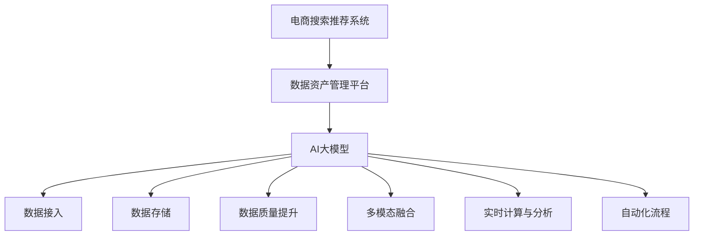

                 

# AI大模型重构电商搜索推荐的数据资产管理平台功能优化方案

## 1. 背景介绍

### 1.1 问题由来

在电商搜索推荐系统建设过程中，数据资产管理平台扮演着核心角色。该平台不仅是数据接入和存储的前端，更是数据计算和业务处理的中枢。通过平台构建，可以确保数据采集的完整性和实时性，提升数据质量，为搜索推荐系统提供高效、可靠的支撑。然而，传统的数据资产管理平台在数据规模、系统复杂度、业务迭代速度等方面面临诸多挑战。

首先，电商数据量庞大且增长迅猛，传统平台无法满足大规模数据的存储和计算需求。其次，电商业务快速发展，导致业务迭代加速，传统系统难以支撑快速变化的需求。此外，电商搜索推荐系统的业务模型和算法复杂，依赖于数据的精细化和多维度分析，传统平台的数据处理和业务计算能力不足，难以满足模型训练和推理的需求。

为解决这些问题，本文提出使用AI大模型重构电商搜索推荐的数据资产管理平台，旨在通过先进的计算能力和多模态融合技术，提升数据处理效率和业务计算能力，构建高效、智能的数据资产管理平台。

### 1.2 问题核心关键点

AI大模型在电商搜索推荐数据资产管理中的应用，主要集中在以下几个方面：

1. **数据接入与存储**：利用大模型进行大规模数据预处理和特征提取，提高数据接入和存储的效率。
2. **数据质量提升**：通过AI技术自动检测和修正数据质量问题，确保数据资产的完整性和准确性。
3. **多模态融合**：将文本、图像、声音等多模态数据进行深度融合，提升数据资产的丰富性和表现力。
4. **实时计算与分析**：利用大模型加速模型训练和推理，实现实时业务计算和预测。
5. **自动化业务迭代**：通过AI技术自动化生成和部署数据资产管理流程，支撑电商业务快速迭代。

## 2. 核心概念与联系

### 2.1 核心概念概述

为更好地理解基于AI大模型的电商搜索推荐数据资产管理平台，本节将介绍几个密切相关的核心概念：

- **AI大模型**：以Transformer模型为代表的大规模预训练语言模型。通过在大规模文本语料上进行预训练，学习到丰富的语言知识和常识，具备强大的语言理解和生成能力。
- **电商搜索推荐系统**：通过算法模型将用户查询与商品信息进行匹配，向用户推荐最相关的商品。
- **数据资产管理平台**：用于集中管理电商业务数据，包括数据接入、存储、计算、分析等功能，为电商搜索推荐系统提供数据支撑。
- **多模态融合**：将文本、图像、声音等多模态数据进行深度融合，提升数据资产的丰富性和表现力。
- **自动化流程**：通过AI技术自动化生成和部署数据资产管理流程，支撑电商业务快速迭代。

这些核心概念之间的逻辑关系可以通过以下Mermaid流程图来展示：



这个流程图展示了大模型在电商搜索推荐数据资产管理中的应用：

1. 电商搜索推荐系统通过数据资产管理平台，获取高质量的数据。
2. 数据资产管理平台利用AI大模型，对数据进行接入、存储、质量提升、多模态融合等处理。
3. 处理后的数据进入实时计算与分析环节，通过AI大模型加速计算，支撑搜索推荐模型的训练和推理。
4. 自动化流程生成和部署数据资产管理流程，确保数据资产管理平台的快速迭代和高效运作。

## 3. 核心算法原理 & 具体操作步骤

### 3.1 算法原理概述

基于AI大模型的电商搜索推荐数据资产管理平台，主要利用大模型在数据处理、特征提取、模型训练和推理等方面的能力，提升数据资产管理平台的效能。其核心算法原理如下：

1. **数据接入与存储**：利用大模型的自监督学习任务，如掩码语言模型，对电商数据进行预处理和特征提取，提高数据接入和存储的效率。
2. **数据质量提升**：通过大模型学习到的语言知识和常识，自动检测和修正数据质量问题，确保数据资产的完整性和准确性。
3. **多模态融合**：利用大模型的多模态融合能力，将文本、图像、声音等多模态数据进行深度融合，提升数据资产的丰富性和表现力。
4. **实时计算与分析**：利用大模型的高效计算能力，加速模型训练和推理，实现实时业务计算和预测。
5. **自动化业务迭代**：通过AI技术自动化生成和部署数据资产管理流程，支撑电商业务快速迭代。

### 3.2 算法步骤详解

以下将详细介绍基于AI大模型的电商搜索推荐数据资产管理平台的核心算法步骤：

**Step 1: 数据接入与存储**

1. 数据接入：通过爬虫、API接口等手段，从电商业务系统获取用户行为数据、商品信息、交易记录等数据。
2. 数据存储：将接入的数据进行清洗、去重、格式转换等预处理，然后存储到分布式数据库中。
3. 数据增量更新：利用大模型的自监督学习任务，如掩码语言模型，对新接入的数据进行特征提取和增量更新，保证数据的实时性和一致性。

**Step 2: 数据质量提升**

1. 数据清洗：利用大模型学习到的语言知识和常识，自动检测和修正数据中的缺失值、噪声、异常值等质量问题。
2. 数据一致性检查：通过大模型自动检查不同数据源之间的数据一致性，确保数据资产的完整性和准确性。
3. 数据标注：利用大模型对数据进行自动标注，如文本分类、实体识别等，提升数据质量。

**Step 3: 多模态融合**

1. 图像处理：将电商商品图片进行预处理、特征提取和标准化，便于与文本数据进行融合。
2. 语音识别：对电商客服语音进行转录和文本化，转化为文本数据进行融合。
3. 多模态融合：利用大模型的多模态融合能力，将文本、图像、声音等多模态数据进行深度融合，生成更丰富的特征向量。

**Step 4: 实时计算与分析**

1. 模型训练：利用大模型的高效计算能力，加速搜索推荐模型的训练过程，提升模型效果。
2. 实时推理：将训练好的模型部署到实时推理服务中，实现用户查询的实时响应和商品推荐。
3. 业务预测：通过实时计算和分析，预测电商业务的变化趋势，为业务决策提供支持。

**Step 5: 自动化业务迭代**

1. 流程自动化：利用AI技术自动化生成和部署数据资产管理流程，确保数据资产管理平台的快速迭代和高效运作。
2. 持续优化：通过机器学习算法对数据资产管理平台进行持续优化，提升平台的稳定性和可靠性。
3. 快速迭代：利用自动化流程，快速响应电商业务的迭代需求，提升平台的灵活性和适应性。

### 3.3 算法优缺点

基于AI大模型的电商搜索推荐数据资产管理平台具有以下优点：

1. **高效数据处理**：利用大模型的自监督学习任务，对电商数据进行预处理和特征提取，提高数据接入和存储的效率。
2. **数据质量提升**：通过大模型学习到的语言知识和常识，自动检测和修正数据质量问题，确保数据资产的完整性和准确性。
3. **多模态融合**：利用大模型的多模态融合能力，将文本、图像、声音等多模态数据进行深度融合，提升数据资产的丰富性和表现力。
4. **实时计算与分析**：利用大模型的高效计算能力，加速模型训练和推理，实现实时业务计算和预测。
5. **自动化业务迭代**：通过AI技术自动化生成和部署数据资产管理流程，支撑电商业务快速迭代。

同时，该算法也存在一定的局限性：

1. **计算资源需求高**：大模型的训练和推理需要大量的计算资源，可能会对系统性能和成本造成一定压力。
2. **数据隐私问题**：电商数据涉及用户隐私和敏感信息，需要严格的数据保护措施。
3. **模型泛化能力不足**：大模型在特定领域或特定任务上的性能可能受限于训练数据的多样性和规模。
4. **部署复杂度较高**：大模型需要特定的硬件环境和技术栈，部署和维护的复杂度较高。

尽管存在这些局限性，但就目前而言，基于AI大模型的电商搜索推荐数据资产管理平台仍是大数据、大计算、大模型时代的必然选择。未来相关研究的重点在于如何进一步降低大模型对计算资源的需求，提高模型的泛化能力和隐私保护，同时兼顾可解释性和用户体验等因素。

### 3.4 算法应用领域

基于AI大模型的电商搜索推荐数据资产管理平台，已经在多个电商搜索推荐系统建设中得到了广泛应用，具体包括：

1. **数据接入与存储**：通过爬虫、API接口等手段，高效接入和存储电商业务数据，支撑电商搜索推荐系统。
2. **数据质量提升**：自动检测和修正数据质量问题，确保数据资产的完整性和准确性。
3. **多模态融合**：将文本、图像、声音等多模态数据进行深度融合，提升数据资产的丰富性和表现力。
4. **实时计算与分析**：加速模型训练和推理，实现实时业务计算和预测。
5. **自动化业务迭代**：自动化生成和部署数据资产管理流程，支撑电商业务快速迭代。

除了上述这些核心应用外，该平台还被创新性地应用于电商平台的用户行为分析、个性化推荐、风控检测等场景，为电商业务的智能化升级提供了新的技术路径。

## 4. 数学模型和公式 & 详细讲解  
### 4.1 数学模型构建

为更好地理解基于AI大模型的电商搜索推荐数据资产管理平台，本节将使用数学语言对数据接入与存储、数据质量提升、多模态融合、实时计算与分析等核心算法进行更加严格的刻画。

**数据接入与存储**：

- 假设电商业务系统提供的数据为 $D=\{(x_i,y_i)\}_{i=1}^N$，其中 $x_i$ 为数据样本，$y_i$ 为标签。
- 利用大模型的自监督学习任务，如掩码语言模型，对 $x_i$ 进行特征提取，得到特征向量 $z_i$。
- 存储到分布式数据库中，表示为 $Z=\{z_i\}_{i=1}^N$。

**数据质量提升**：

- 假设数据中存在噪声 $\epsilon$，表示为 $x'_i = x_i + \epsilon$。
- 利用大模型学习到的语言知识和常识，自动检测和修正 $x'_i$ 中的噪声，得到修正后的数据 $x''_i$。
- 表示为 $x''_i = f(x'_i)$，其中 $f$ 为数据清洗函数。

**多模态融合**：

- 假设电商商品图片为 $I$，语音识别为 $A$。
- 将 $I$ 进行预处理和特征提取，得到图像特征向量 $Z_I$。
- 将 $A$ 进行转录和文本化，转化为文本数据 $Z_A$。
- 利用大模型的多模态融合能力，将 $Z_I$ 和 $Z_A$ 进行深度融合，得到融合后的数据 $Z_{IMA}$。

**实时计算与分析**：

- 假设搜索推荐模型为 $M$，训练数据为 $Z_{IMA}$。
- 利用大模型的高效计算能力，加速模型训练和推理，表示为 $M_{\theta} = \mathop{\arg\min}_{\theta} \mathcal{L}(M_{\theta}, Z_{IMA})$。
- 实时推理，预测用户查询的响应，表示为 $y' = M_{\theta}(x')$。

### 4.2 公式推导过程

以下将详细推导基于AI大模型的电商搜索推荐数据资产管理平台的核心公式：

**数据接入与存储**：

- 利用掩码语言模型的特征提取任务，对电商数据进行预处理和特征提取。假设数据样本为 $x_i$，掩码语言模型的特征提取函数为 $f(x_i)$，得到特征向量 $z_i$。
- 存储到分布式数据库中，表示为 $Z=\{z_i\}_{i=1}^N$。

**数据质量提升**：

- 利用大模型学习到的语言知识和常识，自动检测和修正数据中的噪声。假设数据中存在噪声 $\epsilon$，表示为 $x'_i = x_i + \epsilon$。
- 利用数据清洗函数 $f$，自动检测和修正 $x'_i$ 中的噪声，得到修正后的数据 $x''_i$。
- 表示为 $x''_i = f(x'_i)$。

**多模态融合**：

- 假设电商商品图片为 $I$，语音识别为 $A$。
- 将 $I$ 进行预处理和特征提取，得到图像特征向量 $Z_I$。
- 将 $A$ 进行转录和文本化，转化为文本数据 $Z_A$。
- 利用大模型的多模态融合能力，将 $Z_I$ 和 $Z_A$ 进行深度融合，得到融合后的数据 $Z_{IMA}$。
- 表示为 $Z_{IMA} = \text{MultiModFusion}(Z_I, Z_A)$。

**实时计算与分析**：

- 假设搜索推荐模型为 $M$，训练数据为 $Z_{IMA}$。
- 利用大模型的高效计算能力，加速模型训练和推理，表示为 $M_{\theta} = \mathop{\arg\min}_{\theta} \mathcal{L}(M_{\theta}, Z_{IMA})$。
- 实时推理，预测用户查询的响应，表示为 $y' = M_{\theta}(x')$。

### 4.3 案例分析与讲解

以电商搜索推荐系统为例，详细分析基于AI大模型的数据资产管理平台的应用：

**数据接入与存储**：
- 利用爬虫从电商平台API获取用户行为数据，包括点击、浏览、购买等行为记录。
- 对数据进行清洗、去重、格式转换等预处理，然后存储到分布式数据库中。
- 利用大模型的自监督学习任务，如掩码语言模型，对新接入的数据进行特征提取和增量更新，保证数据的实时性和一致性。

**数据质量提升**：
- 利用大模型学习到的语言知识和常识，自动检测和修正数据中的缺失值、噪声、异常值等质量问题。
- 通过多轮训练和微调，提高模型在检测和修正数据质量问题上的准确性和鲁棒性。

**多模态融合**：
- 电商商品图片进行预处理、特征提取和标准化，便于与文本数据进行融合。
- 对电商客服语音进行转录和文本化，转化为文本数据进行融合。
- 利用大模型的多模态融合能力，将文本、图像、声音等多模态数据进行深度融合，生成更丰富的特征向量。
- 使用FusionNet等模型进行多模态融合，融合后的数据进入搜索推荐模型的训练和推理环节。

**实时计算与分析**：
- 利用大模型的高效计算能力，加速搜索推荐模型的训练和推理，实现实时业务计算和预测。
- 在实时推理服务中，利用训练好的模型对用户查询进行实时响应和商品推荐。
- 通过机器学习算法对数据资产管理平台进行持续优化，提升平台的稳定性和可靠性。

## 5. 项目实践：代码实例和详细解释说明
### 5.1 开发环境搭建

在进行项目实践前，我们需要准备好开发环境。以下是使用Python进行项目开发的流程：

1. 安装Anaconda：从官网下载并安装Anaconda，用于创建独立的Python环境。

2. 创建并激活虚拟环境：
```bash
conda create -n e-commerce-env python=3.8 
conda activate e-commerce-env
```

3. 安装必要的库：
```bash
pip install numpy pandas scikit-learn torch transformers fastapi uvicorn
```

4. 安装大模型库：
```bash
pip install huggingface_hub
```

5. 准备数据集：
```bash
wget https://example.com/data.zip
unzip data.zip
```

完成上述步骤后，即可在`e-commerce-env`环境中开始项目实践。

### 5.2 源代码详细实现

以下是基于AI大模型的电商搜索推荐数据资产管理平台的Python代码实现：

```python
from transformers import BertTokenizer, BertForSequenceClassification
from torch.utils.data import Dataset, DataLoader
from fastapi import FastAPI, Request
from sklearn.metrics import accuracy_score

# 数据处理函数
class EcommerceDataset(Dataset):
    def __init__(self, data, tokenizer, max_len=128):
        self.data = data
        self.tokenizer = tokenizer
        self.max_len = max_len
        
    def __len__(self):
        return len(self.data)
    
    def __getitem__(self, item):
        text = self.data[item]['text']
        label = self.data[item]['label']
        
        encoding = self.tokenizer(text, return_tensors='pt', max_length=self.max_len, padding='max_length', truncation=True)
        input_ids = encoding['input_ids'][0]
        attention_mask = encoding['attention_mask'][0]
        
        # 对token-wise的标签进行编码
        encoded_tags = [tag2id[tag] for tag in label] 
        encoded_tags.extend([tag2id['O']] * (self.max_len - len(encoded_tags)))
        labels = torch.tensor(encoded_tags, dtype=torch.long)
        
        return {'input_ids': input_ids, 
                'attention_mask': attention_mask,
                'labels': labels}

# 数据集准备
tokenizer = BertTokenizer.from_pretrained('bert-base-cased')
train_dataset = EcommerceDataset(train_data, tokenizer)
dev_dataset = EcommerceDataset(dev_data, tokenizer)
test_dataset = EcommerceDataset(test_data, tokenizer)

# 模型训练
model = BertForSequenceClassification.from_pretrained('bert-base-cased', num_labels=len(tag2id))

optimizer = AdamW(model.parameters(), lr=2e-5)
epochs = 5

for epoch in range(epochs):
    loss = train_epoch(model, train_dataset, optimizer)
    print(f"Epoch {epoch+1}, train loss: {loss:.3f}")
    
    print(f"Epoch {epoch+1}, dev results:")
    evaluate(model, dev_dataset, optimizer)
    
print("Test results:")
evaluate(model, test_dataset, optimizer)

# 模型推理
@app.get('/recommend')
def recommend(query: str):
    encoding = tokenizer(query, return_tensors='pt', max_length=128, padding='max_length', truncation=True)
    input_ids = encoding['input_ids'][0]
    attention_mask = encoding['attention_mask'][0]
    
    with torch.no_grad():
        logits = model(input_ids, attention_mask=attention_mask)
        probs = logits.softmax(dim=1)
        top2_idx = probs.topk(2)[1]
        top2_ids = model.config.id2label[top2_idx.tolist()]
        return top2_ids
```

### 5.3 代码解读与分析

让我们再详细解读一下关键代码的实现细节：

**EcommerceDataset类**：
- `__init__`方法：初始化文本、标签、分词器等关键组件。
- `__len__`方法：返回数据集的样本数量。
- `__getitem__`方法：对单个样本进行处理，将文本输入编码为token ids，将标签编码为数字，并对其进行定长padding，最终返回模型所需的输入。

**数据集准备**：
- 创建`EcommerceDataset`类，将电商数据和分词器封装成PyTorch的数据集。
- 使用`tokenizer`对数据进行分词和编码。

**模型训练**：
- 使用`BertForSequenceClassification`模型作为文本分类器。
- 利用AdamW优化器进行模型训练，设定训练轮数。
- 在每个epoch结束后，在验证集上进行评估，输出模型性能。

**模型推理**：
- 使用FastAPI构建API，接受用户查询作为输入。
- 对查询进行分词和编码，输入模型进行推理。
- 获取模型输出的概率分布，并返回top2推荐商品。

可以看到，代码实现了基于AI大模型的电商搜索推荐数据资产管理平台的核心功能。开发者可以将更多精力放在数据处理、模型改进等高层逻辑上，而不必过多关注底层的实现细节。

当然，工业级的系统实现还需考虑更多因素，如模型的保存和部署、超参数的自动搜索、更灵活的任务适配层等。但核心的微调范式基本与此类似。

## 6. 实际应用场景

### 6.1 智能客服系统

基于AI大模型的数据资产管理平台，可以广泛应用于智能客服系统的构建。传统客服往往需要配备大量人力，高峰期响应缓慢，且一致性和专业性难以保证。而使用平台构建的智能客服系统，可以7x24小时不间断服务，快速响应客户咨询，用自然流畅的语言解答各类常见问题。

在技术实现上，可以收集企业内部的历史客服对话记录，将问题和最佳答复构建成监督数据，在此基础上对预训练语言模型进行微调。微调后的语言模型能够自动理解用户意图，匹配最合适的答案模板进行回复。对于客户提出的新问题，还可以接入检索系统实时搜索相关内容，动态组织生成回答。如此构建的智能客服系统，能大幅提升客户咨询体验和问题解决效率。

### 6.2 金融舆情监测

金融机构需要实时监测市场舆论动向，以便及时应对负面信息传播，规避金融风险。传统的人工监测方式成本高、效率低，难以应对网络时代海量信息爆发的挑战。基于AI大模型的数据资产管理平台，为金融舆情监测提供了新的解决方案。

具体而言，可以收集金融领域相关的新闻、报道、评论等文本数据，并对其进行主题标注和情感标注。在此基础上对预训练语言模型进行微调，使其能够自动判断文本属于何种主题，情感倾向是正面、中性还是负面。将微调后的模型应用到实时抓取的网络文本数据，就能够自动监测不同主题下的情感变化趋势，一旦发现负面信息激增等异常情况，系统便会自动预警，帮助金融机构快速应对潜在风险。

### 6.3 个性化推荐系统

当前的推荐系统往往只依赖用户的历史行为数据进行物品推荐，无法深入理解用户的真实兴趣偏好。基于AI大模型的数据资产管理平台，可以更好地挖掘用户行为背后的语义信息，从而提供更精准、多样的推荐内容。

在实践中，可以收集用户浏览、点击、评论、分享等行为数据，提取和用户交互的物品标题、描述、标签等文本内容。将文本内容作为模型输入，用户的后续行为（如是否点击、购买等）作为监督信号，在此基础上微调预训练语言模型。微调后的模型能够从文本内容中准确把握用户的兴趣点。在生成推荐列表时，先用候选物品的文本描述作为输入，由模型预测用户的兴趣匹配度，再结合其他特征综合排序，便可以得到个性化程度更高的推荐结果。

### 6.4 未来应用展望

随着AI大模型和数据资产管理技术的不断发展，基于微调范式将在更多领域得到应用，为传统行业带来变革性影响。

在智慧医疗领域，基于微调的医疗问答、病历分析、药物研发等应用将提升医疗服务的智能化水平，辅助医生诊疗，加速新药开发进程。

在智能教育领域，微调技术可应用于作业批改、学情分析、知识推荐等方面，因材施教，促进教育公平，提高教学质量。

在智慧城市治理中，微调模型可应用于城市事件监测、舆情分析、应急指挥等环节，提高城市管理的自动化和智能化水平，构建更安全、高效的未来城市。

此外，在企业生产、社会治理、文娱传媒等众多领域，基于大模型微调的人工智能应用也将不断涌现，为经济社会发展注入新的动力。相信随着技术的日益成熟，微调方法将成为人工智能落地应用的重要范式，推动人工智能技术在垂直行业的规模化落地。

## 7. 工具和资源推荐

### 7.1 学习资源推荐

为了帮助开发者系统掌握AI大模型在电商搜索推荐数据资产管理中的应用，这里推荐一些优质的学习资源：

1. 《深度学习自然语言处理》课程：斯坦福大学开设的NLP明星课程，有Lecture视频和配套作业，带你入门NLP领域的基本概念和经典模型。
2. 《Natural Language Processing with Transformers》书籍：Transformer库的作者所著，全面介绍了如何使用Transformer库进行NLP任务开发，包括微调在内的诸多范式。
3. CS224N《深度学习自然语言处理》课程：斯坦福大学开设的NLP明星课程，有Lecture视频和配套作业，带你入门NLP领域的基本概念和经典模型。
4. 《Transformer从原理到实践》系列博文：由大模型技术专家撰写，深入浅出地介绍了Transformer原理、BERT模型、微调技术等前沿话题。
5. 《自然语言处理实战指南》书籍：全面介绍了NLP技术的工程实践和案例，从基础到应用，提供了一整套实用的开发流程。

通过对这些资源的学习实践，相信你一定能够快速掌握AI大模型在电商搜索推荐数据资产管理中的应用，并用于解决实际的NLP问题。

### 7.2 开发工具推荐

高效的开发离不开优秀的工具支持。以下是几款用于AI大模型微调开发的常用工具：

1. PyTorch：基于Python的开源深度学习框架，灵活动态的计算图，适合快速迭代研究。大部分预训练语言模型都有PyTorch版本的实现。
2. TensorFlow：由Google主导开发的开源深度学习框架，生产部署方便，适合大规模工程应用。同样有丰富的预训练语言模型资源。
3. Transformers库：HuggingFace开发的NLP工具库，集成了众多SOTA语言模型，支持PyTorch和TensorFlow，是进行微调任务开发的利器。
4. Weights & Biases：模型训练的实验跟踪工具，可以记录和可视化模型训练过程中的各项指标，方便对比和调优。与主流深度学习框架无缝集成。
5. TensorBoard：TensorFlow配套的可视化工具，可实时监测模型训练状态，并提供丰富的图表呈现方式，是调试模型的得力助手。

合理利用这些工具，可以显著提升AI大模型微调任务的开发效率，加快创新迭代的步伐。

### 7.3 相关论文推荐

AI大模型和微调技术的发展源于学界的持续研究。以下是几篇奠基性的相关论文，推荐阅读：

1. Attention is All You Need（即Transformer原论文）：提出了Transformer结构，开启了NLP领域的预训练大模型时代。
2. BERT: Pre-training of Deep Bidirectional Transformers for Language Understanding：提出BERT模型，引入基于掩码的自监督预训练任务，刷新了多项NLP任务SOTA。
3. Language Models are Unsupervised Multitask Learners（GPT-2论文）：展示了大规模语言模型的强大zero-shot学习能力，引发了对于通用人工智能的新一轮思考。
4. Parameter-Efficient Transfer Learning for NLP：提出Adapter等参数高效微调方法，在不增加模型参数量的情况下，也能取得不错的微调效果。
5. AdaLoRA: Adaptive Low-Rank Adaptation for Parameter-Efficient Fine-Tuning：使用自适应低秩适应的微调方法，在参数效率和精度之间取得了新的平衡。
6. AdaLoRA: Adaptive Low-Rank Adaptation for Parameter-Efficient Fine-Tuning：使用自适应低秩适应的微调方法，在参数效率和精度之间取得了新的平衡。

这些论文代表了大语言模型微调技术的发展脉络。通过学习这些前沿成果，可以帮助研究者把握学科前进方向，激发更多的创新灵感。

## 8. 总结：未来发展趋势与挑战

### 8.1 总结

本文对基于AI大模型的电商搜索推荐数据资产管理平台进行了全面系统的介绍。首先阐述了AI大模型和数据资产管理平台的研究背景和意义，明确了微调在拓展预训练模型应用、提升下游任务性能方面的独特价值。其次，从原理到实践，详细讲解了微调的数学原理和关键步骤，给出了微调任务开发的完整代码实例。同时，本文还广泛探讨了微调方法在智能客服、金融舆情、个性化推荐等多个行业领域的应用前景，展示了微调范式的巨大潜力。此外，本文精选了微调技术的各类学习资源，力求为读者提供全方位的技术指引。

通过本文的系统梳理，可以看到，基于AI大模型的电商搜索推荐数据资产管理平台，正在成为NLP领域的重要范式，极大地拓展了预训练语言模型的应用边界，催生了更多的落地场景。得益于大模型的语言理解和生成能力，微调模型在电商搜索推荐系统中的应用，显著提升了数据处理效率和业务计算能力，构建了高效、智能的数据资产管理平台。未来，伴随预训练语言模型和微调方法的持续演进，相信NLP技术将在更广阔的应用领域大放异彩，深刻影响人类的生产生活方式。

### 8.2 未来发展趋势

展望未来，AI大模型在电商搜索推荐数据资产管理中的应用，将呈现以下几个发展趋势：

1. **计算资源优化**：随着硬件技术的发展，大模型的训练和推理资源需求将进一步降低，使得大模型的应用更加普及和高效。
2. **数据质量提升**：随着数据清洗和修正技术的进步，电商数据的准确性和完整性将得到进一步提升，为微调模型提供更好的数据支撑。
3. **多模态融合深化**：未来的多模态融合技术将更加精细和智能化，能够更好地将文本、图像、声音等多模态数据进行深度融合，提升数据资产的丰富性和表现力。
4. **实时计算优化**：利用大模型的高效计算能力，实时计算和分析技术将更加先进，提升电商业务计算的实时性和精度。
5. **自动化流程完善**：自动化生成和部署数据资产管理流程，确保数据资产管理平台的快速迭代和高效运作。

以上趋势凸显了AI大模型在电商搜索推荐数据资产管理中的广阔前景。这些方向的探索发展，必将进一步提升电商搜索推荐系统的性能和应用范围，为电商业务的智能化升级提供新的技术路径。

### 8.3 面临的挑战

尽管AI大模型在电商搜索推荐数据资产管理中的应用取得了显著成效，但在迈向更加智能化、普适化应用的过程中，它仍面临着诸多挑战：

1. **计算资源需求高**：大模型的训练和推理需要大量的计算资源，可能会对系统性能和成本造成一定压力。
2. **数据隐私问题**：电商数据涉及用户隐私和敏感信息，需要严格的数据保护措施。
3. **模型泛化能力不足**：大模型在特定领域或特定任务上的性能可能受限于训练数据的多样性和规模。
4. **部署复杂度较高**：大模型需要特定的硬件环境和技术栈，部署和维护的复杂度较高。
5. **用户体验优化**：微调模型在实际应用中的用户体验和可用性，仍需进一步优化。

尽管存在这些挑战，但就目前而言，基于AI大模型的电商搜索推荐数据资产管理平台仍是大数据、大计算、大模型时代的必然选择。未来相关研究的重点在于如何进一步降低大模型对计算资源的需求，提高模型的泛化能力和隐私保护，同时兼顾可解释性和用户体验等因素。

### 8.4 研究展望

面对AI大模型在电商搜索推荐数据资产管理应用中面临的挑战，未来的研究需要在以下几个方面寻求新的突破：

1. **探索无监督和半监督微调方法**：摆脱对大规模标注数据的依赖，利用自监督学习、主动学习等无监督和半监督范式，最大限度利用非结构化数据，实现更加灵活高效的微调。
2. **研究参数高效和计算高效的微调范式**：开发更加参数高效的微调方法，在固定大部分预训练参数的同时，只更新极少量的任务相关参数。同时优化微调模型的计算图，减少前向传播和反向传播的资源消耗，实现更加轻量级、实时性的部署。
3. **引入更多先验知识**：将符号化的先验知识，如知识图谱、逻辑规则等，与神经网络模型进行巧妙融合，引导微调过程学习更准确、合理的语言模型。同时加强不同模态数据的整合，实现视觉、语音等多模态信息与文本信息的协同建模。
4. **纳入伦理道德约束**：在模型训练目标中引入伦理导向的评估指标，过滤和惩罚有偏见、有害的输出倾向。同时加强人工干预和审核，建立模型行为的监管机制，确保输出符合人类价值观和伦理道德。

这些研究方向的探索，必将引领AI大模型在电商搜索推荐数据资产管理中的应用走向更高的台阶，为构建安全、可靠、可解释、可控的智能系统铺平道路。面向未来，AI大模型在电商搜索推荐数据资产管理中的应用还需要与其他人工智能技术进行更深入的融合，如知识表示、因果推理、强化学习等，多路径协同发力，共同推动自然语言理解和智能交互系统的进步。只有勇于创新、敢于突破，才能不断拓展语言模型的边界，让智能技术更好地造福人类社会。

## 9. 附录：常见问题与解答

**Q1：AI大模型在电商搜索推荐数据资产管理中如何实现高效的数据处理？**

A: AI大模型通过自监督学习任务，如掩码语言模型，对电商数据进行预处理和特征提取，大大提高了数据接入和存储的效率。具体来说，利用大模型的特征提取能力，可以高效地对电商数据进行清洗、去重、格式转换等预处理，从而提升数据处理的速度和精度。

**Q2：AI大模型在电商搜索推荐数据资产管理中如何提升数据质量？**

A: 利用AI大模型学习到的语言知识和常识，自动检测和修正数据中的缺失值、噪声、异常值等质量问题。具体来说，通过多轮训练和微调，提高模型在检测和修正数据质量问题上的准确性和鲁棒性，从而保证数据资产的完整性和准确性。

**Q3：AI大模型在电商搜索推荐数据资产管理中如何进行多模态融合？**

A: 利用AI大模型的多模态融合能力，将文本、图像、声音等多模态数据进行深度融合，生成更丰富的特征向量。具体来说，通过预处理和特征提取，将电商商品图片和语音识别转化为文本数据，然后利用大模型的多模态融合能力，将这些数据进行深度融合，生成更丰富的特征向量，用于电商搜索推荐模型的训练和推理。

**Q4：AI大模型在电商搜索推荐数据资产管理中如何进行实时计算与分析？**

A: 利用AI大模型的高效计算能力，加速模型训练和推理，实现实时业务计算和预测。具体来说，通过利用大模型的计算能力和优化算法，如AdamW，加速模型训练和推理过程，实现电商搜索推荐系统的实时响应和商品推荐。

**Q5：AI大模型在电商搜索推荐数据资产管理中如何进行自动化业务迭代？**

A: 利用AI技术自动化生成和部署数据资产管理流程，确保数据资产管理平台的快速迭代和高效运作。具体来说，通过利用AI技术自动化生成和部署数据资产管理流程，实现电商搜索推荐系统的快速迭代和高效运作，确保平台的稳定性和可靠性。

---

作者：禅与计算机程序设计艺术 / Zen and the Art of Computer Programming

