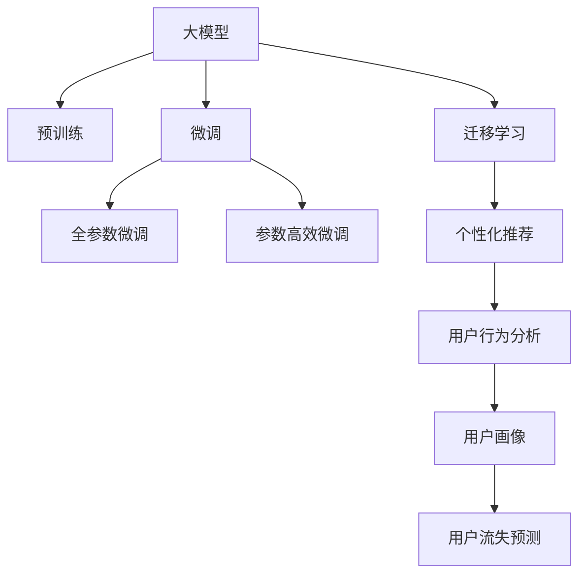

                 

# AI大模型：优化电商平台长期用户价值的新方法

> 关键词：大模型,电商平台,长期用户价值,个性化推荐,行为预测,用户画像,用户行为分析,深度学习

## 1. 背景介绍

### 1.1 问题由来
近年来，随着电子商务的迅猛发展，各大电商平台面临着如何提升用户留存率和转化率的双重挑战。一方面，新用户获取成本持续攀升，流量红利逐渐消退；另一方面，用户流失率不断上升，会员活跃度下降。如何通过数据驱动的策略，在用户生命周期中实现价值最大化，成为平台的核心议题。

大模型技术，特别是预训练语言模型和微调技术，为电商平台提供了一个全新的视角和方法。通过分析用户行为数据，预测用户后续行为，生成个性化推荐，大模型有望在电商平台中发挥巨大的作用，从而提升长期用户价值。

### 1.2 问题核心关键点
电商平台长期用户价值优化，本质上是基于用户行为数据，预测用户后续行为，进而生成个性化推荐。其核心在于：

- 如何高效收集和利用用户行为数据，构建精细的用户画像。
- 如何基于用户画像，预测用户后续行为，进行精准推荐。
- 如何结合业务逻辑，设计合理的推荐策略，提升用户粘性和转化率。
- 如何通过不断迭代，优化推荐模型，使其不断适应用户行为变化。

大模型技术，特别是预训练语言模型和微调技术，为这些问题提供了新的解决方案。通过预训练获得通用的语言表示，然后针对电商平台的特定需求进行微调，模型能够高效地分析用户行为数据，预测用户行为，生成个性化的推荐内容。

## 2. 核心概念与联系

### 2.1 核心概念概述

为更好地理解大模型在电商平台中的应用，本节将介绍几个密切相关的核心概念：

- 大模型(Large Model)：以自回归模型（如GPT）或自编码模型（如BERT）为代表的深度学习模型，通过在大规模数据上预训练，学习到丰富的语言和特征表示。
- 预训练(Pre-training)：指在大规模数据上，通过自监督学习任务训练模型，获得通用的特征表示的过程。
- 微调(Fine-tuning)：指在预训练模型的基础上，使用特定任务的数据，通过有监督学习，优化模型在特定任务上的性能。
- 迁移学习(Transfer Learning)：指将一个领域学习到的知识，迁移到另一个相关领域，提升新任务的学习效果。
- 个性化推荐(Personalized Recommendation)：根据用户行为和偏好，生成符合其兴趣的推荐内容，提高用户满意度和转化率。
- 用户行为分析(User Behavior Analysis)：通过分析用户在不同时间、不同场景下的行为数据，挖掘其行为规律和偏好，构建用户画像。
- 用户画像(User Profile)：基于用户行为数据，构建的反映用户特征和偏好的模型或标签。
- 用户流失预测(User Churn Prediction)：通过用户历史行为数据，预测用户未来流失的概率，提前采取干预措施。

这些核心概念之间的逻辑关系可以通过以下Mermaid流程图来展示：



这个流程图展示了大模型的核心概念及其之间的关系：

1. 大模型通过预训练获得基础能力。
2. 微调是对预训练模型进行任务特定的优化，可以分为全参数微调和参数高效微调。
3. 迁移学习是连接预训练模型与电商平台的桥梁，可以通过微调或迁移学习来实现。
4. 个性化推荐基于用户画像，进行推荐策略设计，优化用户体验。
5. 用户行为分析通过收集和分析用户数据，构建用户画像。
6. 用户画像反映了用户的特征和偏好。
7. 用户流失预测通过分析用户行为，预测用户流失概率，及时采取干预措施。

这些概念共同构成了电商平台大模型应用的基本框架，为大模型在电商平台中的价值提升提供了有力支持。

## 3. 核心算法原理 & 具体操作步骤

### 3.1 算法原理概述

电商平台长期用户价值优化，主要基于以下算法原理：

1. **用户行为数据分析**：收集用户在平台上的行为数据，包括浏览记录、购买历史、点击率、评分等，通过统计分析和机器学习技术，挖掘用户的行为规律和特征。

2. **用户画像构建**：基于用户行为数据，构建用户画像，反映用户的兴趣、偏好、行为模式等。用户画像通常由一系列标签或特征向量构成，能够表征用户的综合特征。

3. **用户流失预测**：通过用户行为数据分析，预测用户未来流失的概率。预测模型的输入为用户行为数据，输出为流失概率。

4. **个性化推荐生成**：基于用户画像，结合电商平台的业务逻辑，设计推荐策略，生成个性化的推荐内容。推荐模型的输入为用户画像和产品特征，输出为推荐结果。

5. **微调优化**：将大模型应用于电商平台，通过微调优化模型，使其能够更好地适应电商平台的具体需求。

### 3.2 算法步骤详解

以下是基于大模型优化电商平台长期用户价值的详细算法步骤：

1. **数据准备**：收集用户行为数据，清洗和预处理数据，划分为训练集、验证集和测试集。确保数据的质量和多样性。

2. **用户画像构建**：基于用户行为数据，使用大模型构建用户画像。常见的用户画像构建方法包括聚类、降维、异常检测等。

3. **用户流失预测**：使用大模型进行用户流失预测，通过微调优化预测模型。常见的预测模型包括逻辑回归、随机森林、深度神经网络等。

4. **个性化推荐生成**：基于用户画像，结合电商平台的推荐算法，生成个性化推荐。常见的推荐算法包括协同过滤、基于内容的推荐、混合推荐等。

5. **微调优化**：将大模型应用于电商平台，通过微调优化模型。常见的微调方法包括全参数微调、参数高效微调、对抗训练等。

### 3.3 算法优缺点

大模型在电商平台中的应用，具有以下优点：

- 通用性强：大模型经过大规模预训练，能够学习到通用的语言和特征表示，适用于各种类型的电商推荐任务。
- 性能提升显著：通过微调优化，大模型能够在特定电商任务上取得显著的性能提升。
- 适应性强：大模型能够快速适应不同的电商平台和用户需求，提供灵活的个性化推荐服务。

但大模型在电商平台中的应用也存在以下缺点：

- 数据需求量大：构建用户画像和预测用户流失，需要大量的用户行为数据，数据采集成本较高。
- 计算资源消耗大：大模型的计算复杂度较高，对硬件资源有较高要求。
- 用户隐私问题：电商平台需要收集和分析大量用户数据，可能涉及用户隐私保护问题。

### 3.4 算法应用领域

基于大模型的电商平台长期用户价值优化方法，广泛应用于以下领域：

- 个性化推荐：根据用户历史行为，生成符合用户偏好的商品推荐，提升用户满意度和转化率。
- 用户流失预测：通过分析用户行为数据，预测用户流失概率，提前采取干预措施，降低用户流失率。
- 行为分析：分析用户在不同时间、不同场景下的行为数据，挖掘用户行为规律，优化推荐策略。
- 用户画像构建：基于用户行为数据，构建用户画像，实现用户特征和偏好的全面描述。

除了上述这些领域，大模型技术还被应用于电商平台的许多其他场景，如用户情绪分析、广告投放优化、智能客服等，为电商平台带来了全新的业务机会和用户价值提升。

## 4. 数学模型和公式 & 详细讲解  
### 4.1 数学模型构建

本节将使用数学语言对电商平台大模型优化方法进行更加严格的刻画。

假设用户行为数据为 $\mathcal{X}=\{x_1, x_2, \dots, x_N\}$，其中 $x_i$ 表示用户第 $i$ 次的行为记录，包括浏览、点击、购买等事件。用户画像为 $\mathcal{U}$，包含一系列用户特征 $u_1, u_2, \dots, u_M$。用户流失概率预测模型为 $f$，输出用户流失概率 $p(y_i=1|u_i)$。个性化推荐模型为 $g$，输入用户画像 $u_i$ 和商品特征 $p_j$，输出推荐结果 $r_{ij}$。

用户画像 $u_i$ 的构建，可以通过以下数学公式表示：

$$
u_i = \mathbf{W}x_i + \mathbf{b}
$$

其中 $\mathbf{W}$ 和 $\mathbf{b}$ 为可训练参数，$x_i$ 为行为数据向量。

用户流失概率预测模型 $f$ 的构建，可以通过以下公式表示：

$$
f(x_i, u_i) = \sigma(\mathbf{W}u_i + \mathbf{b})
$$

其中 $\sigma$ 为 sigmoid 函数，$\mathbf{W}$ 和 $\mathbf{b}$ 为可训练参数。

个性化推荐模型 $g$ 的构建，可以通过以下公式表示：

$$
g(u_i, p_j) = \mathbf{W}g(u_i) + \mathbf{b}
$$

其中 $g(u_i)$ 表示用户画像 $u_i$ 的隐向量表示，$\mathbf{W}$ 和 $\mathbf{b}$ 为可训练参数，$p_j$ 表示商品特征向量。

### 4.2 公式推导过程

以下是基于大模型优化电商平台长期用户价值的详细公式推导过程。

1. **用户画像构建**：
   - 通过用户行为数据 $\mathcal{X}$ 训练模型，得到用户画像 $\mathcal{U}$。

2. **用户流失预测**：
   - 通过用户行为数据 $\mathcal{X}$ 和用户画像 $\mathcal{U}$，训练用户流失预测模型 $f$。

3. **个性化推荐生成**：
   - 通过用户画像 $\mathcal{U}$ 和商品特征 $\mathcal{P}$，生成个性化推荐结果 $\mathcal{R}$。

4. **微调优化**：
   - 将大模型应用于电商平台，通过微调优化模型，使其能够更好地适应电商平台的具体需求。

### 4.3 案例分析与讲解

以下以用户流失预测为例，展示基于大模型优化电商平台长期用户价值的案例分析。

假设电商平台收集到用户行为数据 $\mathcal{X}=\{x_1, x_2, \dots, x_N\}$，其中 $x_i$ 表示用户第 $i$ 次的行为记录，包括浏览、点击、购买等事件。

1. **用户画像构建**：
   - 通过行为数据分析，得到用户画像 $\mathcal{U}=\{u_1, u_2, \dots, u_M\}$，其中 $u_i$ 表示用户画像的第 $i$ 个特征。
   - 将用户行为数据 $\mathcal{X}$ 输入到大模型中，得到用户画像 $\mathcal{U}$。

2. **用户流失预测**：
   - 通过用户行为数据 $\mathcal{X}$ 和用户画像 $\mathcal{U}$，训练用户流失预测模型 $f$。
   - 假设用户流失概率预测模型为二分类模型，输出 $p(y_i=1|u_i)$。
   - 通过最小化交叉熵损失，训练模型：
     - $$
     \mathcal{L}(f) = -\frac{1}{N}\sum_{i=1}^N [y_i\log f(x_i) + (1-y_i)\log(1-f(x_i))]
     $$

3. **个性化推荐生成**：
   - 通过用户画像 $\mathcal{U}$ 和商品特征 $\mathcal{P}=\{p_1, p_2, \dots, p_k\}$，生成个性化推荐结果 $\mathcal{R}=\{r_{11}, r_{12}, \dots, r_{1k}\}$，其中 $r_{ij}$ 表示商品 $j$ 对用户 $i$ 的推荐结果。
   - 假设推荐模型为线性回归模型，输出推荐结果：
     - $$
     r_{ij} = g(u_i, p_j) = \mathbf{W}g(u_i) + \mathbf{b}
     $$

4. **微调优化**：
   - 将大模型应用于电商平台，通过微调优化模型，使其能够更好地适应电商平台的具体需求。
   - 假设微调优化目标为最大化推荐效果，最小化用户流失率。

## 5. 项目实践：代码实例和详细解释说明
### 5.1 开发环境搭建

在进行电商平台大模型优化实践前，我们需要准备好开发环境。以下是使用Python进行PyTorch开发的环境配置流程：

1. 安装Anaconda：从官网下载并安装Anaconda，用于创建独立的Python环境。

2. 创建并激活虚拟环境：
```bash
conda create -n pytorch-env python=3.8 
conda activate pytorch-env
```

3. 安装PyTorch：根据CUDA版本，从官网获取对应的安装命令。例如：
```bash
conda install pytorch torchvision torchaudio cudatoolkit=11.1 -c pytorch -c conda-forge
```

4. 安装Transformers库：
```bash
pip install transformers
```

5. 安装各类工具包：
```bash
pip install numpy pandas scikit-learn matplotlib tqdm jupyter notebook ipython
```

完成上述步骤后，即可在`pytorch-env`环境中开始大模型优化实践。

### 5.2 源代码详细实现

下面我们以用户流失预测任务为例，给出使用Transformers库对大模型进行微调的PyTorch代码实现。

首先，定义用户流失预测任务的数据处理函数：

```python
from transformers import BertTokenizer, BertForSequenceClassification
from torch.utils.data import Dataset
import torch

class UserChurnDataset(Dataset):
    def __init__(self, texts, labels, tokenizer, max_len=128):
        self.texts = texts
        self.labels = labels
        self.tokenizer = tokenizer
        self.max_len = max_len
        
    def __len__(self):
        return len(self.texts)
    
    def __getitem__(self, item):
        text = self.texts[item]
        label = self.labels[item]
        
        encoding = self.tokenizer(text, return_tensors='pt', max_length=self.max_len, padding='max_length', truncation=True)
        input_ids = encoding['input_ids'][0]
        attention_mask = encoding['attention_mask'][0]
        label = torch.tensor(label, dtype=torch.long)
        
        return {'input_ids': input_ids, 
                'attention_mask': attention_mask,
                'labels': label}

# 标签与id的映射
label2id = {'no_churn': 0, 'churn': 1}
id2label = {v: k for k, v in label2id.items()}

# 创建dataset
tokenizer = BertTokenizer.from_pretrained('bert-base-cased')

train_dataset = UserChurnDataset(train_texts, train_labels, tokenizer)
dev_dataset = UserChurnDataset(dev_texts, dev_labels, tokenizer)
test_dataset = UserChurnDataset(test_texts, test_labels, tokenizer)
```

然后，定义模型和优化器：

```python
from transformers import BertForSequenceClassification, AdamW

model = BertForSequenceClassification.from_pretrained('bert-base-cased', num_labels=len(label2id))

optimizer = AdamW(model.parameters(), lr=2e-5)
```

接着，定义训练和评估函数：

```python
from torch.utils.data import DataLoader
from tqdm import tqdm
from sklearn.metrics import classification_report

device = torch.device('cuda') if torch.cuda.is_available() else torch.device('cpu')
model.to(device)

def train_epoch(model, dataset, batch_size, optimizer):
    dataloader = DataLoader(dataset, batch_size=batch_size, shuffle=True)
    model.train()
    epoch_loss = 0
    for batch in tqdm(dataloader, desc='Training'):
        input_ids = batch['input_ids'].to(device)
        attention_mask = batch['attention_mask'].to(device)
        labels = batch['labels'].to(device)
        model.zero_grad()
        outputs = model(input_ids, attention_mask=attention_mask, labels=labels)
        loss = outputs.loss
        epoch_loss += loss.item()
        loss.backward()
        optimizer.step()
    return epoch_loss / len(dataloader)

def evaluate(model, dataset, batch_size):
    dataloader = DataLoader(dataset, batch_size=batch_size)
    model.eval()
    preds, labels = [], []
    with torch.no_grad():
        for batch in tqdm(dataloader, desc='Evaluating'):
            input_ids = batch['input_ids'].to(device)
            attention_mask = batch['attention_mask'].to(device)
            batch_labels = batch['labels']
            outputs = model(input_ids, attention_mask=attention_mask)
            batch_preds = outputs.logits.argmax(dim=2).to('cpu').tolist()
            batch_labels = batch_labels.to('cpu').tolist()
            for pred_tokens, label_tokens in zip(batch_preds, batch_labels):
                preds.append(pred_tokens[:len(label_tokens)])
                labels.append(label_tokens)
                
    print(classification_report(labels, preds))
```

最后，启动训练流程并在测试集上评估：

```python
epochs = 5
batch_size = 16

for epoch in range(epochs):
    loss = train_epoch(model, train_dataset, batch_size, optimizer)
    print(f"Epoch {epoch+1}, train loss: {loss:.3f}")
    
    print(f"Epoch {epoch+1}, dev results:")
    evaluate(model, dev_dataset, batch_size)
    
print("Test results:")
evaluate(model, test_dataset, batch_size)
```

以上就是使用PyTorch对Bert模型进行用户流失预测任务微调的完整代码实现。可以看到，得益于Transformers库的强大封装，我们可以用相对简洁的代码完成Bert模型的加载和微调。

### 5.3 代码解读与分析

让我们再详细解读一下关键代码的实现细节：

**UserChurnDataset类**：
- `__init__`方法：初始化文本、标签、分词器等关键组件。
- `__len__`方法：返回数据集的样本数量。
- `__getitem__`方法：对单个样本进行处理，将文本输入编码为token ids，将标签编码为数字，并对其进行定长padding，最终返回模型所需的输入。

**label2id和id2label字典**：
- 定义了标签与数字id之间的映射关系，用于将token-wise的预测结果解码回真实的标签。

**训练和评估函数**：
- 使用PyTorch的DataLoader对数据集进行批次化加载，供模型训练和推理使用。
- 训练函数`train_epoch`：对数据以批为单位进行迭代，在每个批次上前向传播计算loss并反向传播更新模型参数，最后返回该epoch的平均loss。
- 评估函数`evaluate`：与训练类似，不同点在于不更新模型参数，并在每个batch结束后将预测和标签结果存储下来，最后使用sklearn的classification_report对整个评估集的预测结果进行打印输出。

**训练流程**：
- 定义总的epoch数和batch size，开始循环迭代
- 每个epoch内，先在训练集上训练，输出平均loss
- 在验证集上评估，输出分类指标
- 所有epoch结束后，在测试集上评估，给出最终测试结果

可以看到，PyTorch配合Transformers库使得Bert微调的代码实现变得简洁高效。开发者可以将更多精力放在数据处理、模型改进等高层逻辑上，而不必过多关注底层的实现细节。

当然，工业级的系统实现还需考虑更多因素，如模型的保存和部署、超参数的自动搜索、更灵活的任务适配层等。但核心的微调范式基本与此类似。

## 6. 实际应用场景
### 6.1 智能推荐系统

基于大模型的用户画像构建和推荐生成方法，可以在智能推荐系统中发挥巨大作用，提升用户满意度和转化率。

具体而言，通过收集用户历史行为数据，构建用户画像，并基于用户画像生成个性化推荐。在大模型微调的帮助下，推荐系统能够更好地理解用户兴趣，提供更加精准的推荐内容。智能推荐系统的构建，能够大幅提升用户粘性和购买转化率，帮助电商平台提升用户留存率和Lifetime Value（LTV）。

### 6.2 行为预测系统

电商平台用户行为预测系统，可以基于用户行为数据，预测用户后续行为，提前采取干预措施，减少用户流失。

通过收集用户浏览、点击、购买等行为数据，构建用户画像，并使用大模型进行行为预测，能够及时识别出有流失风险的用户，并推送个性化的优惠活动或关怀信息。行为预测系统能够有效降低用户流失率，提高用户留存率，提升平台的长期价值。

### 6.3 实时广告投放

电商平台实时广告投放系统，可以通过大模型预测用户对广告的反应，实时调整广告投放策略。

通过分析用户历史行为数据和实时行为数据，构建用户画像，并使用大模型进行广告效果预测。广告投放系统能够根据用户画像和广告特征，生成个性化广告，实时投放至用户。通过实时调整广告投放策略，最大化广告效果，提升用户点击率和转化率。

### 6.4 用户情绪分析

电商平台用户情绪分析系统，可以基于用户评论、评分等反馈数据，分析用户情绪，提升用户体验。

通过收集用户对商品、服务的评论、评分等反馈数据，构建用户画像，并使用大模型进行情感分析。情绪分析系统能够及时识别出用户的不满情绪，并给出相应的解决方案，提升用户满意度和平台声誉。

## 7. 工具和资源推荐
### 7.1 学习资源推荐

为了帮助开发者系统掌握大模型在电商平台中的应用，这里推荐一些优质的学习资源：

1. 《Deep Learning for Natural Language Processing》书籍：斯坦福大学深度学习专家所著，全面介绍了深度学习在自然语言处理中的应用，包括大模型微调。

2. 《Transformer: A Survey of Attention-Based Neural Machine Translation Architectures》论文：Transformer论文及其引用文献，深入介绍了Transformer结构和预训练语言模型的原理。

3. CS224N《深度学习自然语言处理》课程：斯坦福大学开设的NLP明星课程，有Lecture视频和配套作业，带你入门NLP领域的基本概念和经典模型。

4. 《Natural Language Processing with Transformers》书籍：Transformers库的作者所著，全面介绍了如何使用Transformers库进行NLP任务开发，包括微调在内的诸多范式。

5. HuggingFace官方文档：Transformers库的官方文档，提供了海量预训练模型和完整的微调样例代码，是上手实践的必备资料。

通过对这些资源的学习实践，相信你一定能够快速掌握大模型在电商平台中的应用，并用于解决实际的NLP问题。

### 7.2 开发工具推荐

高效的开发离不开优秀的工具支持。以下是几款用于大模型微调开发的常用工具：

1. PyTorch：基于Python的开源深度学习框架，灵活动态的计算图，适合快速迭代研究。大部分预训练语言模型都有PyTorch版本的实现。

2. TensorFlow：由Google主导开发的开源深度学习框架，生产部署方便，适合大规模工程应用。同样有丰富的预训练语言模型资源。

3. Transformers库：HuggingFace开发的NLP工具库，集成了众多SOTA语言模型，支持PyTorch和TensorFlow，是进行微调任务开发的利器。

4. Weights & Biases：模型训练的实验跟踪工具，可以记录和可视化模型训练过程中的各项指标，方便对比和调优。与主流深度学习框架无缝集成。

5. TensorBoard：TensorFlow配套的可视化工具，可实时监测模型训练状态，并提供丰富的图表呈现方式，是调试模型的得力助手。

6. Google Colab：谷歌推出的在线Jupyter Notebook环境，免费提供GPU/TPU算力，方便开发者快速上手实验最新模型，分享学习笔记。

合理利用这些工具，可以显著提升大模型微调的开发效率，加快创新迭代的步伐。

### 7.3 相关论文推荐

大模型在电商平台中的应用源于学界的持续研究。以下是几篇奠基性的相关论文，推荐阅读：

1. Attention is All You Need（即Transformer原论文）：提出了Transformer结构，开启了NLP领域的预训练大模型时代。

2. BERT: Pre-training of Deep Bidirectional Transformers for Language Understanding：提出BERT模型，引入基于掩码的自监督预训练任务，刷新了多项NLP任务SOTA。

3. Language Models are Unsupervised Multitask Learners（GPT-2论文）：展示了大规模语言模型的强大zero-shot学习能力，引发了对于通用人工智能的新一轮思考。

4. Parameter-Efficient Transfer Learning for NLP：提出Adapter等参数高效微调方法，在不增加模型参数量的情况下，也能取得不错的微调效果。

5. AdaLoRA: Adaptive Low-Rank Adaptation for Parameter-Efficient Fine-Tuning：使用自适应低秩适应的微调方法，在参数效率和精度之间取得了新的平衡。

这些论文代表了大模型在电商平台中的应用发展脉络。通过学习这些前沿成果，可以帮助研究者把握学科前进方向，激发更多的创新灵感。

## 8. 总结：未来发展趋势与挑战

### 8.1 总结

本文对基于大模型优化电商平台长期用户价值的方法进行了全面系统的介绍。首先阐述了大模型在电商平台中的应用背景和重要性，明确了通过用户画像和推荐策略设计，实现用户长期价值最大化的核心目标。其次，从原理到实践，详细讲解了用户画像构建、用户流失预测、个性化推荐生成和微调优化的数学原理和关键步骤，给出了微调任务开发的完整代码实例。同时，本文还广泛探讨了大模型在电商平台中的实际应用场景，展示了其在智能推荐、行为预测、实时广告投放和用户情绪分析等多个领域的巨大潜力。最后，本文精选了相关学习资源，力求为读者提供全方位的技术指引。

通过本文的系统梳理，可以看到，基于大模型的电商平台长期用户价值优化方法，已经在多个领域展现了其显著的性能提升和应用价值。大模型技术通过高效的用户画像构建和个性化推荐生成，能够显著提升用户满意度和留存率，为电商平台的长期发展提供重要支撑。未来，伴随大模型技术的不断演进和优化，相信在电商平台中的应用将更加深入和广泛，为电商平台带来更多的商业机会和用户价值。

### 8.2 未来发展趋势

展望未来，大模型在电商平台中的应用将呈现以下几个发展趋势：

1. 模型规模持续增大。随着算力成本的下降和数据规模的扩张，预训练语言模型的参数量还将持续增长。超大规模语言模型蕴含的丰富语言知识，有望支撑更加复杂多变的电商推荐任务。

2. 微调方法日趋多样。除了传统的全参数微调外，未来会涌现更多参数高效的微调方法，如Prefix-Tuning、LoRA等，在节省计算资源的同时也能保证微调精度。

3. 持续学习成为常态。随着数据分布的不断变化，微调模型也需要持续学习新知识以保持性能。如何在不遗忘原有知识的同时，高效吸收新样本信息，将成为重要的研究课题。

4. 标注样本需求降低。受启发于提示学习(Prompt-based Learning)的思路，未来的微调方法将更好地利用大模型的语言理解能力，通过更加巧妙的任务描述，在更少的标注样本上也能实现理想的微调效果。

5. 多模态微调崛起。当前的微调主要聚焦于纯文本数据，未来会进一步拓展到图像、视频、语音等多模态数据微调。多模态信息的融合，将显著提升语言模型对现实世界的理解和建模能力。

6. 模型通用性增强。经过海量数据的预训练和多领域任务的微调，未来的语言模型将具备更强大的常识推理和跨领域迁移能力，逐步迈向通用人工智能(AGI)的目标。

以上趋势凸显了大模型在电商平台中的广阔前景。这些方向的探索发展，必将进一步提升NLP系统的性能和应用范围，为电商平台的长期发展提供更多助力。

### 8.3 面临的挑战

尽管大模型在电商平台中的应用已经取得了瞩目成就，但在迈向更加智能化、普适化应用的过程中，它仍面临着诸多挑战：

1. 标注成本瓶颈。虽然微调大大降低了标注数据的需求，但对于长尾应用场景，难以获得充足的高质量标注数据，成为制约微调性能的瓶颈。如何进一步降低微调对标注样本的依赖，将是一大难题。

2. 模型鲁棒性不足。当前微调模型面对域外数据时，泛化性能往往大打折扣。对于测试样本的微小扰动，微调模型的预测也容易发生波动。如何提高微调模型的鲁棒性，避免灾难性遗忘，还需要更多理论和实践的积累。

3. 推理效率有待提高。大规模语言模型虽然精度高，但在实际部署时往往面临推理速度慢、内存占用大等效率问题。如何在保证性能的同时，简化模型结构，提升推理速度，优化资源占用，将是重要的优化方向。

4. 用户隐私问题。电商平台需要收集和分析大量用户数据，可能涉及用户隐私保护问题。如何合理采集和保护用户数据，保障用户隐私，将是重要的研究方向。

5. 用户流失预测的准确性。用户流失预测的准确性直接影响到推荐策略的效果。如何通过优化模型和特征工程，提高用户流失预测的准确性，是提升推荐系统性能的关键。

6. 个性化推荐的实时性。个性化推荐系统需要在用户行为发生时实时生成推荐内容，对计算资源的实时性和稳定性有较高要求。如何优化算法和硬件资源，提升推荐系统的实时性，将是重要的优化方向。

以上挑战需要在未来的研究中加以解决，才能使大模型技术在电商平台中发挥更大的作用，更好地服务于用户和商家。

### 8.4 研究展望

面对大模型在电商平台中的应用所面临的挑战，未来的研究需要在以下几个方面寻求新的突破：

1. 探索无监督和半监督微调方法。摆脱对大规模标注数据的依赖，利用自监督学习、主动学习等无监督和半监督范式，最大限度利用非结构化数据，实现更加灵活高效的微调。

2. 研究参数高效和计算高效的微调范式。开发更加参数高效的微调方法，在固定大部分预训练参数的同时，只更新极少量的任务相关参数。同时优化微调模型的计算图，减少前向传播和反向传播的资源消耗，实现更加轻量级、实时性的部署。

3. 融合因果和对比学习范式。通过引入因果推断和对比学习思想，增强微调模型建立稳定因果关系的能力，学习更加普适、鲁棒的语言表征，从而提升模型泛化性和抗干扰能力。

4. 引入更多先验知识。将符号化的先验知识，如知识图谱、逻辑规则等，与神经网络模型进行巧妙融合，引导微调过程学习更准确、合理的语言模型。同时加强不同模态数据的整合，实现视觉、语音等多模态信息与文本信息的协同建模。

5. 结合因果分析和博弈论工具。将因果分析方法引入微调模型，识别出模型决策的关键特征，增强输出解释的因果性和逻辑性。借助博弈论工具刻画人机交互过程，主动探索并规避模型的脆弱点，提高系统稳定性。

6. 纳入伦理道德约束。在模型训练目标中引入伦理导向的评估指标，过滤和惩罚有偏见、有害的输出倾向。同时加强人工干预和审核，建立模型行为的监管机制，确保输出符合人类价值观和伦理道德。

这些研究方向的探索，必将引领大模型在电商平台中的应用走向更高的台阶，为电商平台带来更多的商业机会和用户价值。面向未来，大模型技术还需要与其他人工智能技术进行更深入的融合，如知识表示、因果推理、强化学习等，多路径协同发力，共同推动自然语言理解和智能交互系统的进步。只有勇于创新、敢于突破，才能不断拓展语言模型的边界，让智能技术更好地造福人类社会。

## 9. 附录：常见问题与解答

**Q1：电商平台用户画像的构建需要大量数据，数据采集成本较高，如何解决这一问题？**

A: 电商平台用户画像的构建确实需要大量用户行为数据，数据采集成本较高。为降低成本，可以采取以下措施：
1. 优化数据采集策略：根据电商平台的业务需求，重点采集与用户购买、浏览、点击等行为相关的数据，减少冗余数据的采集。
2. 利用用户隐私政策：合理利用用户隐私政策，收集用户同意的数据，保障用户隐私。
3. 数据共享合作：与第三方数据提供商合作，获取更多的用户行为数据，提高数据采集效率。
4. 多源数据融合：整合来自不同渠道的数据，如社交媒体、广告平台等，获取更全面的用户画像。

通过上述措施，可以在不显著增加成本的情况下，获取高质量的用户行为数据，构建精细的用户画像。

**Q2：如何提高电商平台大模型微调的效率？**

A: 电商平台大模型微调的效率主要取决于模型参数量、数据量和计算资源的消耗。以下是一些提高微调效率的措施：
1. 参数高效微调：采用参数高效微调方法，如Adapter、LoRA等，只更新少量任务相关参数，减少计算资源消耗。
2. 混合精度训练：使用混合精度训练，将浮点运算转换为半精度运算，降低计算资源消耗。
3. 模型压缩：对大模型进行压缩，如剪枝、量化、蒸馏等，减小模型大小，提高推理效率。
4. 模型并行：使用模型并行技术，如数据并行、模型并行、混合并行等，提高计算效率。
5. 梯度累积：使用梯度累积技术，减少单次前向和反向传播的计算量，提高训练效率。

通过这些措施，可以在保证模型性能的前提下，显著提高大模型微调的效率，满足电商平台的实时需求。

**Q3：电商平台用户流失预测的准确性受哪些因素影响？**

A: 电商平台用户流失预测的准确性受多种因素影响：
1. 数据质量：用户行为数据的质量直接影响流失预测的准确性。数据缺失、噪声、异常等都会影响预测结果。
2. 特征工程：用户行为数据的特征选择和提取，对预测模型的效果有重要影响。
3. 模型选择：不同的预测模型对数据和特征的要求不同，选择适合的预测模型，能够提高预测准确性。
4. 模型调参：模型参数的设置，如学习率、正则化等，对预测效果有显著影响。
5. 用户行为变化：用户行为的变化，如季节性、促销活动等，都会影响预测模型的效果。

为提高预测准确性，可以采取以下措施：
1. 数据清洗和预处理：去除异常和噪声数据，对缺失数据进行填补，提高数据质量。
2. 特征工程：通过特征选择和特征提取，构建高质量的特征集合。
3. 模型选择和调参：根据电商平台的业务需求，选择适合的预测模型，并进行参数调优。
4. 实时更新：定期更新预测模型，适应用户行为变化。

通过这些措施，可以显著提高电商平台用户流失预测的准确性，为推荐策略设计提供可靠的数据支持。

**Q4：如何平衡个性化推荐的效果和计算资源消耗？**

A: 个性化推荐的效果和计算资源消耗之间存在一定的权衡。以下是一些平衡二者的措施：
1. 参数高效微调：采用参数高效微调方法，如Adapter、LoRA等，只更新少量任务相关参数，减少计算资源消耗。
2. 模型压缩：对大模型进行压缩，如剪枝、量化、蒸馏等，减小模型大小，提高推理效率。
3. 混合精度训练：使用混合精度训练，将浮点运算转换为半精度运算，降低计算资源消耗。
4. 渐进式推荐：根据用户行为变化，逐步增加推荐内容的丰富度，避免过度计算资源消耗。
5. 多级推荐：将推荐分为多个级别，如初级推荐、中级推荐、高级推荐，逐步增加推荐复杂度，平衡效果和效率。

通过这些措施，可以在保证个性化推荐效果的前提下，显著降低计算资源消耗，满足电商平台的实时需求。

---

作者：禅与计算机程序设计艺术 / Zen and the Art of Computer Programming

