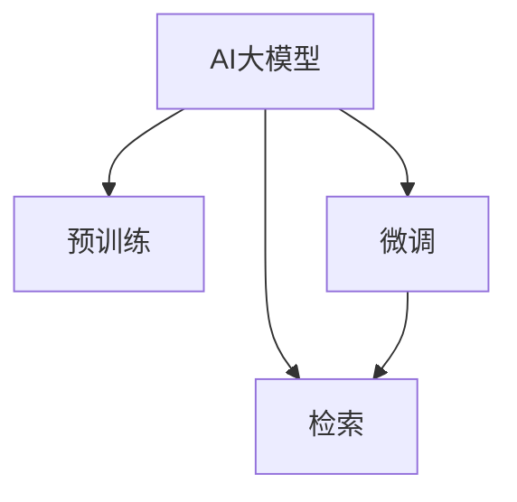

                 

# AI大模型：提升电商平台搜索效率的新方法

> 关键词：
- AI大模型
- 电商平台
- 搜索效率
- 自然语言处理
- 预训练
- 微调
- 检索

## 1. 背景介绍

### 1.1 问题由来
随着互联网零售市场的不断扩展，电商平台已成为消费者购物的重要渠道。搜索功能作为电商平台的关键组件，直接影响用户体验和转化率。然而，在面对海量商品和复杂用户查询的情况下，传统的基于关键字匹配的搜索算法难以满足用户需求，导致搜索结果的相关性不高、查询体验差。

### 1.2 问题核心关键点
本问题主要聚焦于如何利用AI大模型提升电商平台的搜索效率，减少人工干预，提升搜索结果的相关性和个性化程度，从而提高用户满意度和电商平台的用户黏性。核心问题包括：

1. 如何高效利用大规模预训练语言模型，解决用户查询的自然语言表示问题？
2. 如何结合搜索场景，对预训练模型进行微调，优化搜索性能？
3. 如何设计搜索算法，使得AI大模型在实际应用中能快速响应查询请求，提供高质量的搜索结果？
4. 如何评估搜索算法的性能，确保其在真实电商场景中的效果？

### 1.3 问题研究意义
本研究旨在利用最新的人工智能技术，特别是大模型和微调方法，提升电商平台的搜索效率，提供更精准、更个性化的搜索结果。这将直接带来以下几方面的积极影响：

1. **用户体验提升**：减少搜索结果与用户查询的差距，提升查询响应速度，增强用户对电商平台的满意度。
2. **电商转化率提高**：通过精准匹配用户需求，提高点击率和购买率，促进电商平台的销售业绩。
3. **数据驱动决策**：分析搜索数据的分布和趋势，为电商平台提供精准的市场分析依据，辅助制定更好的业务策略。
4. **技术创新与应用**：推动AI技术在电商搜索场景中的落地，促进更多行业应用场景中的智能化转型。

## 2. 核心概念与联系

### 2.1 核心概念概述

为更好地理解利用AI大模型提升电商平台搜索效率的方法，本节将介绍几个关键概念：

- **AI大模型**：指通过大规模无标签数据进行预训练，具备强大语言理解和生成能力的人工智能模型。常见的模型包括BERT、GPT等。
- **预训练**：指在大规模无标签文本语料上进行自监督学习，学习通用语言表示的过程。预训练模型通常在大规模文本数据上进行了充分的训练，具备较强的泛化能力。
- **微调(Fine-tuning)**：指在预训练模型的基础上，使用下游任务的少量标注数据，通过有监督学习优化模型在特定任务上的性能。通常只微调顶层，避免破坏预训练权重。
- **检索**：指在数据库中高效查找和返回相关记录，是搜索引擎的核心功能。检索算法通常使用倒排索引、向量空间模型等技术。
- **NLP（自然语言处理）**：指通过计算机自动处理和理解人类语言，包括分词、词性标注、实体识别等任务。

这些核心概念之间的逻辑关系可以通过以下Mermaid流程图来展示：



这个流程图展示了大模型、预训练、微调和检索之间的关系：

1. 大模型通过预训练获得基础能力。
2. 微调对预训练模型进行任务特定的优化，提升搜索性能。
3. 检索算法基于微调后的模型，高效返回搜索结果。

## 3. 核心算法原理 & 具体操作步骤
### 3.1 算法原理概述

基于大模型的电商平台搜索，主要利用AI大模型对用户查询进行自然语言处理，提取语义信息，并通过微调优化搜索结果的相关性和个性化。

具体流程如下：

1. **预训练**：使用大规模无标签文本数据对AI大模型进行预训练，使其学习通用语言表示。
2. **微调**：在电商平台的商品数据和用户查询上，通过有监督学习对预训练模型进行微调，提升搜索性能。
3. **检索**：利用微调后的模型，快速返回与用户查询相关的搜索结果。

### 3.2 算法步骤详解

以下是详细的算法步骤：

**Step 1: 数据准备与预训练模型加载**
- 准备电商平台的商品数据和用户查询，标注数据集。
- 选择合适的预训练模型，如BERT、GPT等，进行加载和预训练模型的初始化。

**Step 2: 自然语言处理**
- 对用户查询进行分词、词性标注等预处理，使用预训练模型提取语义信息。
- 对商品数据进行分词、词性标注等处理，提取商品描述和属性信息。

**Step 3: 微调优化**
- 设计微调的目标函数，如交叉熵损失、均方误差等。
- 选择合适的优化算法，如AdamW、SGD等，设置学习率、批大小、迭代轮数等。
- 应用正则化技术，如L2正则、Dropout等，防止过拟合。
- 利用数据增强和对抗训练等技术，提升模型鲁棒性。

**Step 4: 检索算法设计**
- 设计倒排索引、向量空间模型等高效的检索算法。
- 对微调后的模型进行推理，生成搜索结果的语义表示。
- 根据用户查询和搜索结果的语义表示，计算相似度，选择相关度最高的商品。

**Step 5: 评估与优化**
- 在测试集上评估检索算法的性能，如准确率、召回率、F1值等。
- 根据评估结果，对微调模型和检索算法进行进一步优化，提升搜索效果。

### 3.3 算法优缺点

基于大模型的电商平台搜索方法具有以下优点：

1. **高效性**：利用大模型的语言理解和处理能力，能够快速处理复杂自然语言查询，提供精准的搜索结果。
2. **个性化**：微调模型可以根据用户行为和查询历史，提供个性化的商品推荐，提升用户体验。
3. **泛化能力**：预训练模型在大规模数据上学习到的语言知识，可以很好地泛化到不同领域的查询和商品匹配任务。
4. **可解释性**：通过微调过程，可以理解模型在不同查询上的决策机制，提高系统的可解释性和可调优性。

然而，该方法也存在一些缺点：

1. **资源消耗大**：大模型和微调过程需要大量的计算资源，对硬件要求较高。
2. **标注数据依赖**：微调过程依赖于标注数据，标注数据的获取和处理成本较高。
3. **泛化能力不足**：当商品描述和用户查询与预训练数据分布差异较大时，泛化性能可能不佳。
4. **系统复杂度**：涉及到NLP处理、模型微调和检索算法等多个环节，系统设计和实现较为复杂。

### 3.4 算法应用领域

基于大模型的电商平台搜索方法广泛应用于各种电商平台的搜索场景，包括：

- **商品搜索**：根据用户查询，快速返回相关商品。
- **用户画像**：分析用户查询历史和行为，构建个性化用户画像。
- **商品推荐**：结合用户画像和商品数据，提供个性化的商品推荐。
- **内容推荐**：根据用户查询，推荐相关的文章、视频等内容。
- **广告投放**：根据用户查询和浏览行为，精准投放广告。

这些应用场景展示了基于大模型的搜索方法在电商领域的应用潜力和广泛价值。

## 4. 数学模型和公式 & 详细讲解  
### 4.1 数学模型构建

本节将使用数学语言对基于大模型的电商平台搜索算法进行严格刻画。

记用户查询为 $q$，商品数据为 $D=\{(d_i, d_i')\}_{i=1}^N$，其中 $d_i$ 为商品描述，$d_i'$ 为商品标签。假设微调后的模型为 $M_{\theta}$，其中 $\theta$ 为模型参数。

定义模型 $M_{\theta}$ 在输入 $q$ 上的损失函数为 $\ell(M_{\theta}(q),d_i')$，则微调的目标函数为：

$$
\mathcal{L}(\theta) = \frac{1}{N} \sum_{i=1}^N \ell(M_{\theta}(q),d_i')
$$

其中 $\ell$ 为任务特定的损失函数，如交叉熵损失、均方误差等。

### 4.2 公式推导过程

以下我们以商品搜索任务为例，推导交叉熵损失函数及其梯度的计算公式。

假设模型 $M_{\theta}$ 在输入 $q$ 上的输出为 $M_{\theta}(q) \in [0,1]$，表示商品相关度分数。真实标签 $d_i' \in \{0,1\}$。则二分类交叉熵损失函数定义为：

$$
\ell(M_{\theta}(q),d_i') = -[d_i'\log M_{\theta}(q) + (1-d_i')\log(1-M_{\theta}(q))]
$$

将其代入目标函数公式，得：

$$
\mathcal{L}(\theta) = -\frac{1}{N}\sum_{i=1}^N [d_i'\log M_{\theta}(q)+(1-d_i')\log(1-M_{\theta}(q))]
$$

根据链式法则，损失函数对参数 $\theta_k$ 的梯度为：

$$
\frac{\partial \mathcal{L}(\theta)}{\partial \theta_k} = -\frac{1}{N}\sum_{i=1}^N (\frac{d_i'}{M_{\theta}(q)}-\frac{1-d_i'}{1-M_{\theta}(q)}) \frac{\partial M_{\theta}(q)}{\partial \theta_k}
$$

其中 $\frac{\partial M_{\theta}(q)}{\partial \theta_k}$ 可进一步递归展开，利用自动微分技术完成计算。

### 4.3 案例分析与讲解

假设在电商平台中，用户输入查询 $q=$ "高质量的红色皮鞋"，商品 $d_i$ 的描述为 "纯红色的高质量皮鞋"，标签 $d_i'=1$。则用户查询与商品描述的相似度可以通过模型 $M_{\theta}$ 计算得到。

假设模型 $M_{\theta}$ 在输入 $q$ 上的输出为 $M_{\theta}(q) \approx 0.9$，则根据交叉熵损失函数，计算得到：

$$
\ell(M_{\theta}(q),d_i') = -\log(0.9) \approx -0.1
$$

模型参数 $\theta$ 的梯度为：

$$
\frac{\partial \mathcal{L}(\theta)}{\partial \theta_k} = -\frac{1}{N}\sum_{i=1}^N (\frac{1}{0.9}-\frac{0}{0.1}) \frac{\partial M_{\theta}(q)}{\partial \theta_k}
$$

在实际应用中，可以将用户查询 $q$ 映射到向量空间，将商品描述 $d_i$ 映射到语义向量空间，利用向量空间模型计算相似度，并在此基础上进行微调优化，提升模型在商品搜索中的表现。

## 5. 项目实践：代码实例和详细解释说明
### 5.1 开发环境搭建

在进行搜索算法开发前，我们需要准备好开发环境。以下是使用Python进行PyTorch开发的环境配置流程：

1. 安装Anaconda：从官网下载并安装Anaconda，用于创建独立的Python环境。

2. 创建并激活虚拟环境：
```bash
conda create -n search-env python=3.8 
conda activate search-env
```

3. 安装PyTorch：根据CUDA版本，从官网获取对应的安装命令。例如：
```bash
conda install pytorch torchvision torchaudio cudatoolkit=11.1 -c pytorch -c conda-forge
```

4. 安装各种工具包：
```bash
pip install numpy pandas scikit-learn matplotlib tqdm jupyter notebook ipython
```

完成上述步骤后，即可在`search-env`环境中开始搜索算法实践。

### 5.2 源代码详细实现

这里我们以基于BERT的电商平台搜索算法为例，给出使用Transformers库对模型进行微调的PyTorch代码实现。

首先，定义模型和优化器：

```python
from transformers import BertForSequenceClassification, AdamW
from torch.utils.data import Dataset, DataLoader
import torch

class SearchDataset(Dataset):
    def __init__(self, texts, labels, tokenizer):
        self.texts = texts
        self.labels = labels
        self.tokenizer = tokenizer

    def __len__(self):
        return len(self.texts)

    def __getitem__(self, item):
        text = self.texts[item]
        label = self.labels[item]
        
        encoding = self.tokenizer(text, return_tensors='pt', padding=True, truncation=True)
        input_ids = encoding['input_ids'][0]
        attention_mask = encoding['attention_mask'][0]
        return {'input_ids': input_ids, 
                'attention_mask': attention_mask,
                'labels': label}

tokenizer = BertTokenizer.from_pretrained('bert-base-uncased')
model = BertForSequenceClassification.from_pretrained('bert-base-uncased', num_labels=2)

optimizer = AdamW(model.parameters(), lr=2e-5)
```

然后，定义训练和评估函数：

```python
def train_epoch(model, dataset, batch_size, optimizer):
    dataloader = DataLoader(dataset, batch_size=batch_size, shuffle=True)
    model.train()
    epoch_loss = 0
    for batch in dataloader:
        input_ids = batch['input_ids'].to(device)
        attention_mask = batch['attention_mask'].to(device)
        labels = batch['labels'].to(device)
        model.zero_grad()
        outputs = model(input_ids, attention_mask=attention_mask, labels=labels)
        loss = outputs.loss
        epoch_loss += loss.item()
        loss.backward()
        optimizer.step()
    return epoch_loss / len(dataloader)

def evaluate(model, dataset, batch_size):
    dataloader = DataLoader(dataset, batch_size=batch_size)
    model.eval()
    preds, labels = [], []
    with torch.no_grad():
        for batch in dataloader:
            input_ids = batch['input_ids'].to(device)
            attention_mask = batch['attention_mask'].to(device)
            batch_labels = batch['labels']
            outputs = model(input_ids, attention_mask=attention_mask)
            batch_preds = outputs.logits.argmax(dim=1).to('cpu').tolist()
            batch_labels = batch_labels.to('cpu').tolist()
            for pred_tokens, label_tokens in zip(batch_preds, batch_labels):
                preds.append(pred_tokens)
                labels.append(label_tokens)
                
    print(f'Accuracy: {accuracy_score(labels, preds)}')
```

最后，启动训练流程并在测试集上评估：

```python
epochs = 5
batch_size = 16

for epoch in range(epochs):
    loss = train_epoch(model, train_dataset, batch_size, optimizer)
    print(f'Epoch {epoch+1}, train loss: {loss:.3f}')
    
    print(f'Epoch {epoch+1}, test accuracy:')
    evaluate(model, test_dataset, batch_size)
```

以上就是使用PyTorch对BERT进行电商平台搜索任务的微调实现。可以看到，Transformers库的强大封装使得微调过程变得简洁高效。

### 5.3 代码解读与分析

让我们再详细解读一下关键代码的实现细节：

**SearchDataset类**：
- `__init__`方法：初始化文本、标签、分词器等关键组件。
- `__len__`方法：返回数据集的样本数量。
- `__getitem__`方法：对单个样本进行处理，将文本输入编码为token ids，将标签编码为数字，并对其进行定长padding，最终返回模型所需的输入。

**BertForSequenceClassification类**：
- 从Transformers库中导入BERT模型，并设置标签数为2，表示二分类任务。
- 使用AdamW优化器，设置学习率。

**训练和评估函数**：
- 使用PyTorch的DataLoader对数据集进行批次化加载，供模型训练和推理使用。
- 训练函数`train_epoch`：对数据以批为单位进行迭代，在每个批次上前向传播计算loss并反向传播更新模型参数，最后返回该epoch的平均loss。
- 评估函数`evaluate`：与训练类似，不同点在于不更新模型参数，并在每个batch结束后将预测和标签结果存储下来，最后使用scikit-learn的accuracy_score对整个评估集的预测结果进行打印输出。

**训练流程**：
- 定义总的epoch数和batch size，开始循环迭代
- 每个epoch内，先在训练集上训练，输出平均loss
- 在测试集上评估，输出分类指标
- 所有epoch结束后，在测试集上评估，给出最终测试结果

可以看到，PyTorch配合Transformers库使得BERT微调的代码实现变得简洁高效。开发者可以将更多精力放在数据处理、模型改进等高层逻辑上，而不必过多关注底层的实现细节。

当然，工业级的系统实现还需考虑更多因素，如模型的保存和部署、超参数的自动搜索、更灵活的任务适配层等。但核心的微调范式基本与此类似。

## 6. 实际应用场景
### 6.1 智能客服系统

基于大模型的搜索技术，可以应用于智能客服系统的构建。传统的客服往往需要配备大量人力，高峰期响应缓慢，且一致性和专业性难以保证。而使用基于大模型的搜索算法，可以7x24小时不间断服务，快速响应客户咨询，用自然流畅的语言解答各类常见问题。

在技术实现上，可以收集企业内部的历史客服对话记录，将问题和最佳答复构建成监督数据，在此基础上对预训练模型进行微调。微调后的搜索算法能够自动理解用户意图，匹配最合适的答案模板进行回复。对于客户提出的新问题，还可以接入检索系统实时搜索相关内容，动态组织生成回答。如此构建的智能客服系统，能大幅提升客户咨询体验和问题解决效率。

### 6.2 金融舆情监测

金融机构需要实时监测市场舆论动向，以便及时应对负面信息传播，规避金融风险。传统的人工监测方式成本高、效率低，难以应对网络时代海量信息爆发的挑战。基于大模型的搜索技术，可以实时抓取和分析金融领域的新闻、报道、评论等文本数据，并基于用户查询返回相关内容。这有助于及时发现市场波动，为金融机构提供风险预警和决策支持。

### 6.3 个性化推荐系统

当前的推荐系统往往只依赖用户的历史行为数据进行物品推荐，无法深入理解用户的真实兴趣偏好。基于大模型的搜索技术，可以更好地挖掘用户行为背后的语义信息，从而提供更精准、更个性化的推荐内容。

在实践中，可以收集用户浏览、点击、评论、分享等行为数据，提取和用户交互的物品标题、描述、标签等文本内容。将文本内容作为模型输入，用户的后续行为（如是否点击、购买等）作为监督信号，在此基础上微调预训练语言模型。微调后的模型能够从文本内容中准确把握用户的兴趣点。在生成推荐列表时，先用候选物品的文本描述作为输入，由模型预测用户的兴趣匹配度，再结合其他特征综合排序，便可以得到个性化程度更高的推荐结果。

### 6.4 未来应用展望

随着大模型和微调方法的不断发展，基于大模型的搜索技术将在更多领域得到应用，为传统行业带来变革性影响。

在智慧医疗领域，基于大模型的搜索技术可以用于医疗问答、病历分析、药物研发等，提升医疗服务的智能化水平，辅助医生诊疗，加速新药开发进程。

在智能教育领域，搜索技术可应用于作业批改、学情分析、知识推荐等方面，因材施教，促进教育公平，提高教学质量。

在智慧城市治理中，搜索技术可应用于城市事件监测、舆情分析、应急指挥等环节，提高城市管理的自动化和智能化水平，构建更安全、高效的未来城市。

此外，在企业生产、社会治理、文娱传媒等众多领域，基于大模型的搜索技术也将不断涌现，为NLP技术带来了全新的突破。相信随着预训练语言模型和微调方法的持续演进，搜索技术必将进一步提升搜索效果，推动人工智能技术在各行各业的应用。

## 7. 工具和资源推荐
### 7.1 学习资源推荐

为了帮助开发者系统掌握基于大模型的电商平台搜索技术的理论基础和实践技巧，这里推荐一些优质的学习资源：

1. 《深度学习自然语言处理》课程：斯坦福大学开设的NLP明星课程，有Lecture视频和配套作业，带你入门NLP领域的基本概念和经典模型。
2. CS224N《深度学习自然语言处理》书籍：斯坦福大学教授Jacob Eisenstein等著作，系统介绍NLP领域的深度学习模型和算法。
3. 《自然语言处理与深度学习》书籍：吴恩达和杨强等联合著作，涵盖了NLP领域的深度学习模型和应用。
4. Weights & Biases：模型训练的实验跟踪工具，可以记录和可视化模型训练过程中的各项指标，方便对比和调优。
5. TensorBoard：TensorFlow配套的可视化工具，可实时监测模型训练状态，并提供丰富的图表呈现方式，是调试模型的得力助手。

通过对这些资源的学习实践，相信你一定能够快速掌握大模型微调的精髓，并用于解决实际的NLP问题。

### 7.2 开发工具推荐

高效的开发离不开优秀的工具支持。以下是几款用于大模型微调开发的常用工具：

1. PyTorch：基于Python的开源深度学习框架，灵活动态的计算图，适合快速迭代研究。
2. TensorFlow：由Google主导开发的开源深度学习框架，生产部署方便，适合大规模工程应用。
3. Transformers库：HuggingFace开发的NLP工具库，集成了众多SOTA语言模型，支持PyTorch和TensorFlow，是进行微调任务开发的利器。
4. Weights & Biases：模型训练的实验跟踪工具，可以记录和可视化模型训练过程中的各项指标，方便对比和调优。
5. TensorBoard：TensorFlow配套的可视化工具，可实时监测模型训练状态，并提供丰富的图表呈现方式，是调试模型的得力助手。

合理利用这些工具，可以显著提升大模型微调的开发效率，加快创新迭代的步伐。

### 7.3 相关论文推荐

大模型和微调技术的发展源于学界的持续研究。以下是几篇奠基性的相关论文，推荐阅读：

1. Attention is All You Need：提出了Transformer结构，开启了NLP领域的预训练大模型时代。
2. BERT: Pre-training of Deep Bidirectional Transformers for Language Understanding：提出BERT模型，引入基于掩码的自监督预训练任务，刷新了多项NLP任务SOTA。
3. Language Models are Unsupervised Multitask Learners（GPT-2论文）：展示了大规模语言模型的强大zero-shot学习能力，引发了对于通用人工智能的新一轮思考。
4. Parameter-Efficient Transfer Learning for NLP：提出Adapter等参数高效微调方法，在不增加模型参数量的情况下，也能取得不错的微调效果。
5. Pre-trained Language Models as Feature Extractors：利用预训练语言模型作为特征提取器，结合传统机器学习方法，提升模型性能。

这些论文代表了大模型微调技术的发展脉络。通过学习这些前沿成果，可以帮助研究者把握学科前进方向，激发更多的创新灵感。

## 8. 总结：未来发展趋势与挑战

### 8.1 总结

本文对基于大模型的电商平台搜索方法进行了全面系统的介绍。首先阐述了电商搜索的背景和问题，明确了利用AI大模型提升搜索效率的研究意义和核心挑战。其次，从原理到实践，详细讲解了基于大模型的搜索算法，提供了完整的代码实例，帮助开发者系统掌握该技术的实现细节。同时，本文还广泛探讨了搜索算法在智能客服、金融舆情、个性化推荐等多个领域的应用前景，展示了其广泛的应用潜力。

通过本文的系统梳理，可以看到，基于大模型的搜索方法正在成为电商领域的重要范式，极大地提升了搜索的精准性和个性化程度，为电商平台带来了显著的业务价值。未来，伴随大模型和微调方法的不断演进，搜索技术将在更多行业应用场景中大放异彩，成为推动AI技术落地应用的重要手段。

### 8.2 未来发展趋势

展望未来，大模型和微调技术的发展趋势如下：

1. **模型规模持续增大**：随着算力成本的下降和数据规模的扩张，预训练语言模型的参数量还将持续增长。超大规模语言模型蕴含的丰富语言知识，将显著提升搜索算法的性能。
2. **搜索效率提升**：利用深度学习技术，搜索算法将变得更加高效和精确，能够快速响应用户查询，提供高质量的搜索结果。
3. **个性化和推荐结合**：搜索算法将更加关注用户行为和兴趣，结合个性化推荐技术，提供更加贴心和精准的搜索体验。
4. **多模态融合**：将视觉、语音等多模态信息与文本信息进行融合，提升搜索算法的鲁棒性和泛化能力。
5. **知识图谱融合**：将知识图谱与搜索算法结合，提升搜索的准确性和上下文理解能力。
6. **实时性增强**：利用分布式计算和缓存技术，提升搜索算法的实时响应能力，满足电商平台的实时需求。

以上趋势凸显了大模型搜索技术的广阔前景。这些方向的探索发展，将进一步提升搜索算法的性能和应用范围，为电商平台的智能化和用户体验提升带来新的突破。

### 8.3 面临的挑战

尽管大模型搜索技术已经取得了显著进展，但在实际应用中仍面临以下挑战：

1. **标注成本高**：获取高质量标注数据成本较高，特别是对于小众领域或新查询场景，标注数据可能较为稀缺。
2. **模型鲁棒性不足**：模型对输入的噪声和异常情况较为敏感，容易发生误识别。
3. **可解释性不足**：搜索算法作为"黑盒"系统，难以解释其内部工作机制和决策逻辑。
4. **实时性要求高**：在电商搜索场景中，用户查询量巨大，系统需要快速响应，这对算力和时间的要求极高。
5. **资源消耗大**：大模型和微调过程需要大量的计算资源，硬件成本较高。

### 8.4 研究展望

面对大模型搜索技术所面临的挑战，未来的研究需要在以下几个方面寻求新的突破：

1. **无监督和半监督搜索方法**：摆脱对大规模标注数据的依赖，利用自监督学习、主动学习等技术，最大化利用非结构化数据，实现更加灵活高效的搜索。
2. **知识增强和图谱融合**：将符号化的先验知识，如知识图谱、逻辑规则等，与神经网络模型进行融合，引导搜索过程学习更准确、合理的语言模型。
3. **多模态融合和实时处理**：将视觉、语音等多模态信息与文本信息进行融合，提升搜索算法的鲁棒性和实时响应能力。
4. **分布式计算和缓存优化**：利用分布式计算和缓存技术，优化搜索算法的实时响应和资源消耗，满足电商平台的实时需求。
5. **模型压缩和量化**：通过模型压缩和量化技术，减小模型尺寸，加快推理速度，优化系统资源利用。
6. **多任务学习和迁移学习**：将搜索算法与其他任务结合，提升搜索性能，如结合推荐系统、广告投放等。

这些研究方向的探索，必将引领大模型搜索技术迈向更高的台阶，为构建智能化的电商搜索系统铺平道路。

## 9. 附录：常见问题与解答

**Q1：如何处理大规模商品数据？**

A: 处理大规模商品数据需要采用高效的算法和数据结构。可以利用倒排索引、向量空间模型等技术，对商品数据进行高效编码和检索。同时，可以采用分布式计算和缓存技术，优化数据加载和处理速度。

**Q2：如何选择合适的大模型？**

A: 选择合适的大模型需要考虑多个因素，如任务的复杂度、数据规模、计算资源等。对于电商平台搜索，建议选择已有SOTA模型的预训练版本，如BERT、GPT等。同时，可以考虑在特定领域进行微调，以提升搜索性能。

**Q3：如何评估搜索算法的性能？**

A: 搜索算法的性能评估可以从准确率、召回率、F1值等多个指标进行考量。可以使用标准数据集进行评估，如DUC数据集、TREC数据集等。同时，可以设计人工评估，模拟真实用户查询场景，评估搜索算法的实际效果。

**Q4：如何优化搜索算法的实时性？**

A: 优化搜索算法的实时性需要从多个方面进行考虑，如算法的复杂度、数据加载速度、硬件资源配置等。可以利用缓存技术，将高频查询的结果预加载到内存中，提高查询响应速度。同时，可以采用分布式计算和并行处理技术，提升算法的并行度和效率。

**Q5：如何增强搜索算法的可解释性？**

A: 增强搜索算法的可解释性需要从多个方面进行考虑，如模型的结构、训练过程、输出机制等。可以利用可视化工具，如TensorBoard、Weights & Biases等，展示模型在训练和推理过程中的行为和决策路径。同时，可以设计简洁明了的输出格式，提高搜索结果的可解释性。

---

作者：禅与计算机程序设计艺术 / Zen and the Art of Computer Programming

