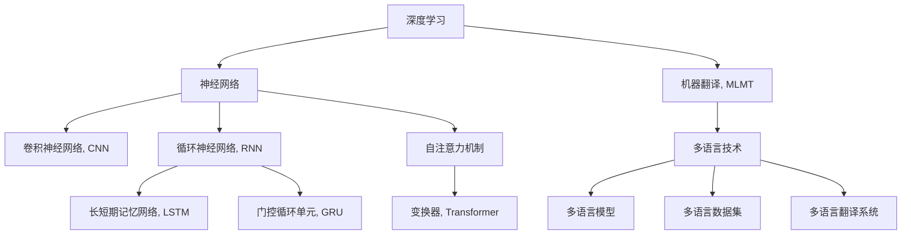

                 

# AI如何改善搜索引擎的多语言翻译

> 关键词：搜索引擎,多语言翻译,深度学习,神经网络,自然语言处理(NLP),卷积神经网络(CNN),循环神经网络(RNN),Transformer,机器翻译(MLMT),多语言技术

## 1. 背景介绍

### 1.1 问题由来

随着全球化的推进，互联网已成为人们获取信息、进行交流的重要工具。搜索引擎，作为信息检索的重要工具，在各种语言、文化背景下得到了广泛应用。然而，目前全球有数千种语言，许多国家使用的语言在搜索引擎中并未得到充分支持，导致用户体验不佳。同时，翻译质量也是多语言搜索引擎面临的一大挑战。

传统的基于统计的机器翻译方法，如基于规则、基于短语的统计机器翻译（SMT），在处理长句子和多义词时表现不佳。近年来，深度学习特别是神经网络在NLP领域取得了显著突破，其中卷积神经网络（CNN）、循环神经网络（RNN）和Transformer等模型在机器翻译任务上取得了最新进展。

本文章聚焦于使用深度学习技术，特别是Transformer模型，来提升搜索引擎的多语言翻译能力，以实现高效、准确的多语言信息检索，满足全球用户的需求。

### 1.2 问题核心关键点

AI如何改善搜索引擎的多语言翻译主要包括以下几个关键点：

- 如何选择合适的深度学习模型，以处理不同语言之间的翻译问题。
- 如何在模型训练中利用大规模的双语平行语料库，提高翻译质量。
- 如何优化模型架构，提升翻译效率和准确性。
- 如何集成到搜索引擎中，实现实时翻译和语义理解。

## 2. 核心概念与联系

### 2.1 核心概念概述

为更好地理解AI如何改善搜索引擎的多语言翻译，本节将介绍几个密切相关的核心概念：

- 深度学习（Deep Learning）：通过构建多层次的神经网络，使模型能够自动学习数据的特征，解决复杂的非线性问题。
- 神经网络（Neural Networks）：由大量神经元构成的计算模型，模拟人脑神经元的工作方式，实现输入和输出之间的映射。
- 卷积神经网络（Convolutional Neural Networks, CNN）：针对图像处理等二维数据的神经网络，通过卷积和池化等操作提取局部特征。
- 循环神经网络（Recurrent Neural Networks, RNN）：能够处理序列数据，适用于自然语言处理（NLP）等任务，但存在梯度消失和梯度爆炸等问题。
- 长短期记忆网络（Long Short-Term Memory, LSTM）：一种特殊的RNN，通过门控机制解决长期依赖问题。
- 门控循环单元（Gated Recurrent Unit, GRU）：另一种特殊的RNN，相较于LSTM更加轻量级，但性能相当。
- 自注意力机制（Self-Attention Mechanism）：一种通过计算不同位置的特征表示的注意力分数，用于捕捉序列中不同位置的信息的机制。
- 变换器（Transformer）：一种基于自注意力机制的神经网络模型，特别适用于NLP任务。
- 机器翻译（Machine Translation, MLMT）：将一种语言的文本自动翻译成另一种语言的过程。
- 多语言技术（Multilingual Technology）：指支持多种语言的技术，包括多语言模型、多语言数据集、多语言翻译系统等。

这些核心概念之间的逻辑关系可以通过以下Mermaid流程图来展示：



这个流程图展示了大语言模型的核心概念及其之间的关系：

1. 深度学习为神经网络提供了理论基础。
2. 神经网络通过卷积、循环、自注意力等机制，处理不同类型的数据。
3. 长短期记忆网络和门控循环单元是循环神经网络的变种，用于解决序列数据问题。
4. 自注意力机制是Transformer模型中的关键技术，能够捕捉序列中不同位置的信息。
5. 变换器模型是基于自注意力机制的神经网络，特别适用于自然语言处理任务。
6. 机器翻译是自然语言处理中的一个重要应用场景。
7. 多语言技术包括多语言模型、多语言数据集和多语言翻译系统，是实现多语言翻译的基础。

## 3. 核心算法原理 & 具体操作步骤
### 3.1 算法原理概述

AI改善搜索引擎的多语言翻译主要依赖于深度学习模型，特别是Transformer模型。其核心原理是通过大规模的双语平行语料库进行预训练，使得模型能够自动学习语言间的翻译规律，并在测试数据上进行微调，提升翻译质量和效率。

具体来说，假设源语言为 $S$，目标语言为 $T$，有 $P=\{(s_i,t_i)\}_{i=1}^{N}$ 为双语平行语料库，其中 $s_i$ 为源语言文本，$t_i$ 为目标语言文本。

使用Transformer模型对 $P$ 进行预训练，得到预训练模型 $M_{\theta}$，其中 $\theta$ 为模型参数。在测试数据上进行微调，得到微调后的模型 $M_{\hat{\theta}}$。其优化目标是最小化以下损失函数：

$$
\mathcal{L}(M_{\hat{\theta}}, P) = \frac{1}{N} \sum_{i=1}^N \ell(M_{\hat{\theta}}(s_i),t_i)
$$

其中 $\ell$ 为目标语言的翻译损失函数，$\ell$ 可以是BLEU、ROUGE等指标。通过优化上述损失函数，可以使得模型 $M_{\hat{\theta}}$ 在目标语言上的翻译质量得到提升。

### 3.2 算法步骤详解

基于深度学习的搜索引擎多语言翻译的实现步骤主要包括以下几个关键环节：

**Step 1: 数据准备**
- 收集大量的双语平行语料库，包括书译、影译、口译等文本数据。
- 清洗数据，去除噪声，预处理文本（如分词、去除停用词、词干提取等）。
- 将文本转换成模型输入所需的格式，如序列化的token ID、掩码等。

**Step 2: 模型选择与预训练**
- 选择合适的深度学习模型架构，如Transformer、LSTM等。
- 对模型进行预训练，通常使用大规模的无标签文本数据，学习语言的通用表示。
- 在预训练过程中，可以使用自监督任务（如语言建模），提高模型的泛化能力。

**Step 3: 微调与优化**
- 选择适量的标注数据，进行有监督的微调。
- 根据测试集的翻译质量，调整模型的学习率、正则化参数、批量大小等超参数。
- 在微调过程中，使用多语言训练技巧（如跨语言迁移学习、多任务学习），提升模型的多语言适应性。

**Step 4: 模型评估与集成**
- 在测试集上进行模型评估，使用BLEU、ROUGE等指标评估翻译质量。
- 将微调后的模型集成到搜索引擎中，实现实时翻译和语义理解。
- 对于搜索引擎中频繁出现的词汇，可以单独进行词汇表训练，以提高翻译准确性。

**Step 5: 系统部署**
- 部署微调后的模型，将其嵌入到搜索引擎系统中。
- 通过API接口，提供翻译服务，支持多语言搜索和翻译。
- 对系统进行监控，及时发现和解决问题，保证系统稳定运行。

### 3.3 算法优缺点

基于深度学习的搜索引擎多语言翻译有以下优点：

- 翻译质量高：深度学习模型能够自动学习语言间的翻译规律，提升翻译质量。
- 通用性强：使用大规模的平行语料库进行预训练，模型可以适应多种语言和语境。
- 可解释性强：通过可视化模型内部特征，能够理解模型如何做出决策。
- 实时性高：预训练和微调可以在大规模数据集上快速完成，支持实时翻译。

同时，该方法也存在以下缺点：

- 数据依赖性强：翻译质量依赖于高质量的平行语料库，数据获取成本高。
- 计算资源需求大：深度学习模型参数量大，计算资源消耗高。
- 难以处理未见过的词汇：在翻译新词汇时，翻译质量会下降。

## 4. 数学模型和公式 & 详细讲解 & 举例说明

### 4.1 数学模型构建

使用Transformer模型对双语平行语料进行翻译时，主要包括以下几个部分：

1. **编码器（Encoder）**：将源语言文本 $s$ 转换为向量表示 $h_s$。
2. **解码器（Decoder）**：将向量表示 $h_s$ 转换为目标语言文本 $t$。
3. **注意力机制（Attention Mechanism）**：解码器根据源语言文本的表示，选择源语言文本中与目标语言单词相关的部分。
4. **掩码机制（Masking Mechanism）**：在解码器中，对输入序列进行掩码处理，保证模型能够预测后续单词。

假设编码器的输入序列为 $x=[x_1, x_2, \ldots, x_n]$，解码器的输入序列为 $y=[y_1, y_2, \ldots, y_m]$。编码器输出为 $h_s=[h_{s,1}, h_{s,2}, \ldots, h_{s,n}]$，解码器输出为 $h_t=[h_{t,1}, h_{t,2}, \ldots, h_{t,m}]$。

### 4.2 公式推导过程

Transformer模型中的自注意力机制由三个矩阵操作组成：

- **查询（Query）矩阵**：计算每个单词与源语言文本中所有单词的注意力分数。
- **键（Key）矩阵**：计算每个单词与源语言文本中所有单词的相似度。
- **值（Value）矩阵**：计算每个单词与源语言文本中所有单词的相关性。

假设查询矩阵为 $Q$，键矩阵为 $K$，值矩阵为 $V$，则注意力分数为：

$$
\text{Attention}(Q, K, V) = \frac{\exp(\text{softmax}(QK^T))}{\sum_{j=1}^{n} \exp(QK^T)} V
$$

其中 $\text{softmax}$ 函数将注意力分数转化为概率分布。

在编码器和解码器中，使用多头的自注意力机制，可以进一步提高模型的泛化能力：

$$
\text{Multi-Head Attention}(Q, K, V) = \frac{\exp(\text{softmax}(QK^T))}{\sum_{j=1}^{n} \exp(QK^T)} V
$$

解码器输出 $h_t$ 的计算公式为：

$$
h_t = \text{Decoder}(h_s, y_1) + \text{Self-Attention}(h_t)
$$

其中 $\text{Decoder}$ 为解码器部分，$\text{Self-Attention}$ 为解码器中的自注意力机制。

### 4.3 案例分析与讲解

下面以谷歌的Transformer模型为例，简要介绍其翻译原理。谷歌的Transformer模型使用了12层的编码器和解码器，每层包含多个多头注意力层和全连接层，能够处理长度为1024的序列。在翻译过程中，将源语言文本输入编码器，通过自注意力机制提取文本表示，然后解码器根据文本表示生成目标语言文本。

假设源语言文本为 "Hello, world!"，目标语言文本为 "Bonjour le monde!"。首先，将源语言文本输入编码器，得到表示 $h_s$。然后，解码器根据 $h_s$ 生成目标语言文本，最终输出 "Bonjour le monde!"。

## 5. 项目实践：代码实例和详细解释说明
### 5.1 开发环境搭建

进行深度学习模型的开发，需要搭建良好的开发环境。以下是使用PyTorch进行Transformer模型开发的Python虚拟环境搭建流程：

1. 安装Anaconda：从官网下载并安装Anaconda，用于创建独立的Python环境。

2. 创建并激活虚拟环境：
```bash
conda create -n torch-env python=3.8 
conda activate torch-env
```

3. 安装PyTorch：根据CUDA版本，从官网获取对应的安装命令。例如：
```bash
conda install pytorch torchvision torchaudio cudatoolkit=11.1 -c pytorch -c conda-forge
```

4. 安装其他必需的Python包：
```bash
pip install numpy pandas scikit-learn matplotlib tqdm jupyter notebook ipython
```

完成上述步骤后，即可在`torch-env`环境中开始开发工作。

### 5.2 源代码详细实现

下面我们以谷歌的Transformer模型为例，给出使用PyTorch对模型进行训练的代码实现。

首先，定义模型结构和超参数：

```python
import torch
import torch.nn as nn
import torch.nn.functional as F
from torch import nn, optim

class Transformer(nn.Module):
    def __init__(self, d_model, nhead, num_encoder_layers, num_decoder_layers, dff, src_len, tgt_len):
        super(Transformer, self).__init__()
        self.encoder = nn.TransformerEncoder(nn.TransformerEncoderLayer(d_model, nhead, dff), num_encoder_layers)
        self.decoder = nn.TransformerDecoder(nn.TransformerDecoderLayer(d_model, nhead, dff), num_decoder_layers)
        self.encoder_layer_norm = nn.LayerNorm(d_model)
        self.decoder_layer_norm = nn.LayerNorm(d_model)
        self.final_layer_norm = nn.LayerNorm(d_model)
        self.fc_out = nn.Linear(d_model, tgt_len)

    def forward(self, src, tgt, src_mask, tgt_mask):
        src = src + self.encoder_layer_norm(src)
        enc_output = self.encoder(src, src_mask)
        tgt = tgt + self.decoder_layer_norm(tgt)
        dec_output = self.decoder(tgt, enc_output, src_mask, tgt_mask)
        dec_output = dec_output + self.decoder_layer_norm(tgt)
        output = dec_output + self.final_layer_norm(dec_output)
        output = self.fc_out(output)
        return output
```

然后，定义损失函数和优化器：

```python
def loss_fn(output, target):
    criterion = nn.CrossEntropyLoss()
    loss = criterion(output.view(-1, output.size(-1)), target.view(-1))
    return loss

model = Transformer(d_model=512, nhead=8, num_encoder_layers=6, num_decoder_layers=6, dff=2048, src_len=1024, tgt_len=1024)
optimizer = optim.Adam(model.parameters(), lr=0.001)
```

接着，定义训练和评估函数：

```python
def train_epoch(model, data_loader, optimizer, loss_fn):
    model.train()
    total_loss = 0
    for src, tgt, src_mask, tgt_mask in data_loader:
        optimizer.zero_grad()
        output = model(src, tgt, src_mask, tgt_mask)
        loss = loss_fn(output, tgt)
        loss.backward()
        optimizer.step()
        total_loss += loss.item()
    return total_loss / len(data_loader)

def evaluate(model, data_loader, loss_fn):
    model.eval()
    total_loss = 0
    with torch.no_grad():
        for src, tgt, src_mask, tgt_mask in data_loader:
            output = model(src, tgt, src_mask, tgt_mask)
            loss = loss_fn(output, tgt)
            total_loss += loss.item()
    return total_loss / len(data_loader)
```

最后，启动训练流程并在测试集上评估：

```python
epochs = 10
batch_size = 64

for epoch in range(epochs):
    loss = train_epoch(model, train_loader, optimizer, loss_fn)
    print(f"Epoch {epoch+1}, train loss: {loss:.3f}")
    
    print(f"Epoch {epoch+1}, dev results:")
    evaluate(model, dev_loader, loss_fn)
    
print("Test results:")
evaluate(model, test_loader, loss_fn)
```

以上就是使用PyTorch对谷歌的Transformer模型进行训练的完整代码实现。可以看到，借助PyTorch的深度学习框架，模型训练变得非常便捷高效。

### 5.3 代码解读与分析

让我们再详细解读一下关键代码的实现细节：

**Transformer类**：
- `__init__`方法：初始化模型参数，包括编码器和解码器的层数、维度、多头注意力机制的维度等。
- `forward`方法：定义模型前向传播的计算流程，包括编码器、解码器和全连接层的计算。
- 各层结构为TransformerEncoderLayer和TransformerDecoderLayer，分别定义了编码器和解码器的计算逻辑。

**loss_fn**函数：
- 定义交叉熵损失函数，用于计算预测输出与真实标签之间的差异。

**train_epoch和evaluate函数**：
- 训练函数 `train_epoch`：对数据集进行迭代训练，在每个批次上前向传播计算损失并反向传播更新模型参数，最后返回该epoch的平均损失。
- 评估函数 `evaluate`：与训练类似，不同点在于不更新模型参数，并在每个batch结束后将预测和标签结果存储下来，最后使用交叉熵损失函数对整个评估集的预测结果进行计算，给出平均损失。

**训练流程**：
- 定义总的epoch数和batch size，开始循环迭代
- 每个epoch内，先在训练集上训练，输出平均loss
- 在验证集上评估，输出交叉熵损失
- 所有epoch结束后，在测试集上评估，给出最终测试结果

可以看到，PyTorch配合Transformer库使得模型训练的代码实现变得简洁高效。开发者可以将更多精力放在模型结构、超参数调优等高层逻辑上，而不必过多关注底层的实现细节。

## 6. 实际应用场景

### 6.1 智能搜索

AI在搜索引擎中的应用非常广泛，其中多语言翻译是一个重要方向。通过使用Transformer模型，搜索引擎可以支持多语言搜索，帮助用户快速找到他们需要的信息。

例如，用户输入英文查询词 "I love Python"，搜索引擎能够自动将其翻译成多种语言，如中文 "我喜欢Python"。用户可以看到不同语言的搜索结果，选择最适合自己的语言进行浏览。这种多语言支持能够提升用户体验，减少语言障碍。

### 6.2 电子商务

在电子商务领域，使用AI进行多语言翻译可以帮助商家更好地进行国际销售。商家可以将产品描述、用户评论等内容翻译成多种语言，吸引全球用户。同时，使用多语言翻译功能，商家可以更好地理解不同用户的需求和反馈，提升产品和服务质量。

例如，一家在线服装店可以将商品描述翻译成多种语言，帮助用户更好地了解商品信息。用户可以在不同语言版本的页面上，查看产品图片、价格、评价等信息，选择最适合自己的商品。

### 6.3 文化交流

AI翻译技术的应用，也促进了不同文化之间的交流。通过多语言翻译功能，用户可以轻松地阅读和理解不同语言的书籍、文章、新闻等内容。这不仅有助于学习和了解不同的文化，还促进了国际间的思想交流和合作。

例如，用户可以阅读多种语言的国际文学作品，如法国小说、日本漫画、美国电影等。这种跨文化阅读能够提升用户的多语言能力和文化素养，增强对不同文化的理解和尊重。

### 6.4 未来应用展望

未来，AI在搜索引擎的多语言翻译领域将继续拓展，带来更多创新应用。

- **多语言搜索引擎**：未来的搜索引擎将支持更多语言，帮助用户更方便地进行信息检索。用户可以使用他们最熟悉的语言进行搜索，快速获取所需信息。
- **跨语言推荐**：AI可以通过多语言翻译，实现跨语言的推荐系统，帮助用户发现他们可能感兴趣的国际内容。这种跨语言推荐能够提高用户的满意度和黏性。
- **个性化翻译**：未来的AI翻译将更加个性化，能够根据用户的历史行为和偏好，提供量身定制的翻译服务。这种个性化翻译能够提升用户体验，增加用户粘性。

## 7. 工具和资源推荐
### 7.1 学习资源推荐

为了帮助开发者系统掌握深度学习模型在搜索引擎多语言翻译中的应用，这里推荐一些优质的学习资源：

1. **《深度学习》（Deep Learning）**：Ian Goodfellow、Yoshua Bengio、Aaron Courville所著，全面介绍了深度学习的理论基础和实现方法，涵盖卷积神经网络、循环神经网络、Transformer等核心技术。

2. **《动手学深度学习》（Dive into Deep Learning）**：李沐、杨啸天、段克杰所著，通过动手实践的方式，详细讲解了深度学习模型的实现和应用，包括TensorFlow、PyTorch等主流框架的使用。

3. **《自然语言处理入门》（Natural Language Processing with Python）》**：Steven Bird、Ewan Klein、Edward Loper所著，介绍了自然语言处理的基本概念和实现方法，包括文本预处理、词向量、机器翻译等。

4. **《机器学习实战》（Machine Learning in Action）》**：Peter Harrington所著，通过具体的Python代码实现，介绍了机器学习和深度学习的应用实例，包括分类、聚类、回归等。

5. **《Transformer理论与实践》（Transformers: Theories and Applications）》**：Alberto A. Moreno、Santiago Garco-Olmo、Julio F. Carreño所著，详细讲解了Transformer模型的原理和应用，涵盖了自然语言处理、计算机视觉、语音识别等方向。

通过对这些资源的学习实践，相信你一定能够快速掌握深度学习模型在搜索引擎多语言翻译中的应用，并用于解决实际的NLP问题。
###  7.2 开发工具推荐

高效的开发离不开优秀的工具支持。以下是几款用于深度学习模型开发的常用工具：

1. **PyTorch**：由Facebook开发的深度学习框架，提供了灵活的计算图和丰富的模型库，适合研究和实现深度学习模型。

2. **TensorFlow**：由Google开发的深度学习框架，支持多种硬件平台，适用于大规模工程应用。

3. **Keras**：一种高级深度学习框架，提供了简单易用的API，方便快速实现深度学习模型。

4. **MXNet**：由Amazon开发的深度学习框架，支持多种编程语言，适用于分布式计算和大规模模型训练。

5. **JAX**：由Google开发的深度学习框架，支持高效的自动微分和分布式计算，适合学术研究和工业应用。

6. **ONNX**：一种跨框架的模型交换标准，可以将深度学习模型转换为多种框架的兼容格式，方便模型部署和迁移。

合理利用这些工具，可以显著提升深度学习模型的开发效率，加快创新迭代的步伐。

### 7.3 相关论文推荐

深度学习模型在搜索引擎多语言翻译领域的研究正在不断发展，以下是几篇奠基性的相关论文，推荐阅读：

1. **Attention Is All You Need**：谷歌的Transformer论文，提出了Transformer模型，通过自注意力机制，提升了模型在NLP任务上的表现。

2. **Neural Machine Translation by Jointly Learning to Align and Translate**：Facebook的研究团队提出了基于Transformer的机器翻译模型，在多个机器翻译评测任务上取得了新SOTA。

3. **Towards Fast and Efficient Neural Machine Translation**：Microsoft的研究团队提出了基于Transformer的快速机器翻译方法，在速度和准确性上都取得了显著提升。

4. **Scalable Neural Machine Translation**：Google的研究团队提出了基于Transformer的大规模机器翻译模型，能够在几十亿个单词的语料上进行训练，提升了翻译质量。

5. **SEED: A Novel Softmax for Extreme Classifier-free Machine Translation**：DeepMind的研究团队提出了一种新的softmax函数，在机器翻译任务上取得了新进展。

这些论文代表了深度学习模型在搜索引擎多语言翻译领域的研究进展，阅读这些论文可以获取最新的研究动态和技术突破。

## 8. 总结：未来发展趋势与挑战

### 8.1 总结

本文对AI改善搜索引擎的多语言翻译技术进行了全面系统的介绍。首先阐述了AI翻译技术的研究背景和意义，明确了多语言翻译在搜索引擎应用中的重要价值。其次，从原理到实践，详细讲解了深度学习模型在多语言翻译中的应用，包括模型选择、数据准备、预训练、微调和优化等关键环节。最后，通过实际应用场景和未来展望，展示了AI翻译技术在搜索引擎中的广泛应用前景。

通过本文的系统梳理，可以看到，AI翻译技术在搜索引擎中的高效性、准确性和实时性得到了显著提升。这种技术的应用，不仅能够提升用户体验，还能够推动搜索引擎的国际化进程，为全球用户提供更优质、便捷的信息检索服务。

### 8.2 未来发展趋势

展望未来，AI在搜索引擎的多语言翻译领域将继续发展，呈现以下几个趋势：

1. **更加智能的翻译**：未来的AI翻译模型将更加智能，能够自动处理多语言之间的语言差异和转换规则。这种智能翻译能够提升翻译质量和用户体验。

2. **更加个性化的翻译**：未来的AI翻译将更加个性化，能够根据用户的历史行为和偏好，提供量身定制的翻译服务。这种个性化翻译能够提升用户满意度和黏性。

3. **更加高效的翻译**：未来的AI翻译将更加高效，能够在短时间内完成翻译任务，支持实时翻译和即需即得的翻译需求。

4. **更加全面的支持**：未来的AI翻译将更加全面，支持更多语言和语境，满足全球用户的需求。

5. **更加可靠的翻译**：未来的AI翻译将更加可靠，能够应对更多的语言现象和语言变化，保证翻译结果的准确性和一致性。

这些趋势将推动AI翻译技术不断进步，提升搜索引擎的多语言翻译能力，满足全球用户的翻译需求。

### 8.3 面临的挑战

尽管AI翻译技术在搜索引擎中已经取得了显著进展，但在实现其全面落地时，仍面临一些挑战：

1. **数据质量问题**：高质量的双语平行语料是翻译模型的基础，但在实际应用中，获取高质量的数据往往需要耗费大量时间和成本。

2. **模型规模问题**：深度学习模型参数量庞大，需要高性能的计算资源和存储资源。如何在保证翻译质量的同时，降低计算资源消耗，是未来的一个重要研究方向。

3. **鲁棒性问题**：翻译模型在面对未见过的词汇和复杂句式时，容易产生错误翻译。如何提升模型的鲁棒性，减少错误翻译，是未来的一个重要挑战。

4. **泛化能力问题**：翻译模型需要适应多种语言和语境，但在某些特定领域，翻译效果可能不佳。如何提高模型的泛化能力，使其在多种场景下都能表现良好，是未来的一个重要研究方向。

5. **隐私和安全问题**：翻译模型需要处理大量的用户数据，如何保护用户隐私和数据安全，是未来的一个重要挑战。

6. **伦理道德问题**：翻译模型在处理敏感内容时，可能出现歧视性、误导性等伦理问题。如何建立伦理导向的模型，避免负面影响，是未来的一个重要挑战。

这些挑战需要学界和产业界共同努力，才能推动AI翻译技术在搜索引擎中的广泛应用。只有解决好这些挑战，才能真正实现高质量、高效益、高可靠性的多语言翻译服务。

### 8.4 研究展望

面对AI翻译技术在搜索引擎中面临的挑战，未来的研究方向包括以下几个方面：

1. **跨语言知识图谱**：结合知识图谱技术，增强翻译模型的语义理解能力，提高翻译准确性和上下文相关性。

2. **跨语言多模态融合**：将视觉、听觉等多种模态数据与文本数据结合，提升翻译模型的泛化能力和鲁棒性。

3. **跨语言迁移学习**：结合迁移学习技术，利用预训练模型在其他语言上的知识，提升新语言翻译的效率和质量。

4. **跨语言语言生成**：结合生成对抗网络（GAN）等技术，提升翻译模型的生成能力，生成更加自然流畅的翻译文本。

5. **跨语言可解释性**：结合可解释性技术，提升翻译模型的可解释性，使用户能够理解和信任翻译结果。

6. **跨语言情感分析**：结合情感分析技术，提升翻译模型的情感感知能力，实现对文本情感的精确判断。

这些研究方向将推动AI翻译技术在搜索引擎中的应用，提升翻译模型的智能水平，带来更好的用户体验和应用效果。

## 9. 附录：常见问题与解答

**Q1：如何选择合适的深度学习模型？**

A: 选择合适的深度学习模型需要考虑多方面的因素，包括模型的复杂度、参数量、计算资源需求、应用场景等。一般而言，Transformer模型在处理长句子和多义词时表现更好，适用于NLP任务，如机器翻译、问答等。

**Q2：数据准备时需要注意哪些问题？**

A: 数据准备是翻译模型的基础，需要注意以下几个问题：
1. 数据质量：需要确保双语平行语料的质量，避免噪声和不一致。
2. 数据标注：需要对文本进行分词、去停用词、词干提取等预处理，标注为模型输入所需的格式。
3. 数据平衡：需要确保不同语言和语境的数据平衡，避免模型在特定领域上表现不佳。

**Q3：模型训练过程中需要注意哪些问题？**

A: 模型训练是翻译模型的关键环节，需要注意以下几个问题：
1. 超参数调优：需要选择合适的学习率、批量大小、正则化参数等超参数，避免过拟合和欠拟合。
2. 模型裁剪：需要根据应用场景，裁剪模型结构，减小参数量，提升推理速度。
3. 模型量化：需要采用量化技术，将模型从浮点转为定点，压缩存储空间，提高计算效率。

**Q4：如何评估模型的翻译质量？**

A: 评估模型的翻译质量需要选择合适的指标，如BLEU、ROUGE、METEOR等，计算预测输出与真实标签之间的差异。还需要对模型在不同语言和语境下的表现进行综合评估，确保模型在多种场景下都能表现良好。

**Q5：模型集成到搜索引擎中需要注意哪些问题？**

A: 模型集成是翻译模型的最后一步，需要注意以下几个问题：
1. 模型部署：需要选择合适的部署平台，如云平台、服务器等，保证模型在生产环境中的稳定运行。
2. 模型监控：需要对模型进行监控，实时采集系统指标，设置异常告警阈值，保证系统稳定运行。
3. 模型优化：需要对模型进行持续优化，根据实际应用场景进行参数调整和结构优化，提高模型性能。

**Q6：如何处理未见过的词汇？**

A: 处理未见过的词汇是翻译模型的一大挑战，可以通过以下方法解决：
1. 零样本学习：利用大模型预训练的知识，结合上下文信息，生成未见过的词汇翻译。
2. 自适应模型：在模型中增加自适应机制，能够根据上下文动态调整词汇的翻译策略。
3. 外部词典：结合外部词典，将未见过的词汇与已知词汇进行关联，提升翻译质量。

这些常见问题及其解答能够帮助开发者更好地理解AI在搜索引擎中应用多语言翻译技术的全过程，并指导他们在实际应用中遇到的问题。

---

作者：禅与计算机程序设计艺术 / Zen and the Art of Computer Programming

