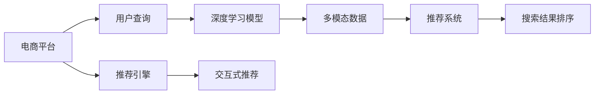

                 

# AI如何改善电商平台的搜索结果排序

> 关键词：电商、搜索结果排序、深度学习、AI算法、推荐系统

## 1. 背景介绍

随着互联网的快速发展和电子商务的兴起，消费者有了更加多元化的购物选择。电商平台需要优化搜索结果排序算法，以提高用户体验和转化率。传统的搜索结果排序方式主要基于文本匹配和点击率模型，但这些方法在应对长尾商品、新商品、多模态数据等方面的能力有限。近年来，深度学习和AI算法开始在电商平台广泛应用，显著提升了搜索结果排序的精准度和效率。

本文将系统介绍AI算法如何改善电商平台的搜索结果排序，涵盖深度学习在搜索、排序、推荐系统中的最新进展，以及实际落地应用中的关键技术和实践经验。

## 2. 核心概念与联系

### 2.1 核心概念概述

为了深入理解AI算法在电商平台搜索结果排序中的应用，本文将详细介绍几个核心概念及其相互联系：

- **电商平台**：基于互联网的零售平台，如淘宝、京东、Amazon等，提供商品展示、交易、评价等功能。
- **搜索结果排序**：根据用户查询、浏览行为等，对相关商品进行排序，提升用户体验和转化率。
- **深度学习**：一种模拟人脑神经网络结构的机器学习算法，通过多层次的特征学习，实现高维数据的降维和抽象。
- **推荐系统**：通过分析用户历史行为和偏好，为个性化推荐商品、内容等。
- **多模态数据**：包含文本、图片、视频等多种形式的数据，电商平台上用户行为数据通常为多模态形式。
- **交互式推荐**：结合实时用户反馈，动态调整推荐内容，提供更精准的个性化推荐。

这些核心概念构成了电商平台搜索结果排序算法的技术框架，AI算法的引入进一步提升了排序的准确性和智能化水平。

### 2.2 核心概念原理和架构的 Mermaid 流程图



该图表展示了电商平台搜索结果排序的逻辑流程。用户通过电商平台查询商品，深度学习模型处理用户输入，推荐系统根据用户历史行为生成推荐结果，排序算法根据实时反馈调整推荐顺序。交互式推荐进一步优化推荐内容，提高用户体验。

## 3. 核心算法原理 & 具体操作步骤

### 3.1 算法原理概述

AI算法在电商平台搜索结果排序中，主要通过深度学习模型和推荐系统，对用户查询和行为数据进行处理和分析，优化搜索结果排序算法。核心原理包括：

1. **用户行为建模**：通过深度学习模型，分析用户查询、浏览、点击、购买等行为，建立用户行为模型。
2. **商品特征提取**：利用深度学习模型提取商品的多维特征，如文本、图片、价格等。
3. **相似度计算**：通过相似度计算算法，评估商品与用户查询、行为的相似度。
4. **排序规则制定**：根据相似度计算结果，制定排序规则，如相关性排序、点击率排序等。
5. **实时调整**：结合用户反馈和实时数据，动态调整排序规则，提升排序效果。

### 3.2 算法步骤详解

基于AI算法的搜索结果排序主要包括以下几个关键步骤：

**Step 1: 数据预处理**

1. **数据收集**：收集用户查询、点击、浏览、评价等行为数据，商品信息、价格、图片等数据。
2. **数据清洗**：处理缺失值、异常值，转换数据格式，生成统一的特征向量。
3. **特征工程**：选择合适的特征，并应用降维、编码等技术，生成输入向量。

**Step 2: 模型训练**

1. **选择模型**：根据任务特点选择合适的深度学习模型，如卷积神经网络(CNN)、循环神经网络(RNN)、Transformer等。
2. **数据划分**：将数据划分为训练集、验证集和测试集。
3. **模型训练**：在训练集上训练模型，优化损失函数，选择合适的网络结构和超参数。

**Step 3: 特征提取与相似度计算**

1. **特征提取**：利用深度学习模型提取商品的多维特征，如文本、图片、价格等。
2. **相似度计算**：通过余弦相似度、欧氏距离等方法，计算商品与用户查询、行为的相似度。

**Step 4: 排序算法制定**

1. **规则定义**：根据相似度计算结果，制定排序规则，如相关性排序、点击率排序等。
2. **排序实现**：根据排序规则，生成排序后的商品列表。

**Step 5: 实时调整**

1. **实时数据采集**：采集用户的实时反馈和行为数据。
2. **动态调整**：根据实时数据，动态调整排序规则，提升排序效果。
3. **交互式推荐**：结合用户反馈，动态调整推荐内容，提供更精准的个性化推荐。

### 3.3 算法优缺点

AI算法在电商平台搜索结果排序中，有以下优点：

1. **精度高**：深度学习模型通过多层次特征学习，能够捕捉到更复杂、更深层的用户和商品信息。
2. **泛化能力强**：AI算法能够处理大量多模态数据，适应不同商品和用户的特点。
3. **实时性高**：通过动态调整排序规则和推荐内容，能够快速响应用户反馈。
4. **个性化推荐**：结合用户历史行为和实时反馈，提供更加精准的个性化推荐。

同时，也存在一些局限性：

1. **计算资源需求大**：深度学习模型和推荐系统需要大量计算资源，对硬件要求较高。
2. **模型复杂度较高**：深度学习模型和推荐系统的训练和推理过程较为复杂，难以解释和调试。
3. **数据需求大**：需要大量标注数据来训练深度学习模型，数据获取成本较高。
4. **冷启动问题**：对于新商品和新用户，无法利用历史数据进行有效排序和推荐。

## 4. 数学模型和公式 & 详细讲解 & 举例说明

### 4.1 数学模型构建

为了更好地理解AI算法在电商平台搜索结果排序中的应用，本文将介绍几个关键的数学模型：

**用户行为建模模型**

假设用户行为数据为 $X = (x_1, x_2, ..., x_n)$，其中 $x_i$ 为第 $i$ 个行为数据，如点击、浏览、购买等。用户行为建模模型 $f(X)$ 为：

$$
f(X) = W^T X + b
$$

其中 $W$ 为权重矩阵，$b$ 为偏置向量。

**商品特征提取模型**

假设商品特征向量为 $Y = (y_1, y_2, ..., y_m)$，其中 $y_i$ 为第 $i$ 个特征向量，如文本、图片、价格等。商品特征提取模型 $g(Y)$ 为：

$$
g(Y) = W_1^T Y + b_1
$$

其中 $W_1$ 为权重矩阵，$b_1$ 为偏置向量。

**相似度计算模型**

假设用户查询为 $Q$，商品特征向量为 $Y$。相似度计算模型 $h(Q, Y)$ 为：

$$
h(Q, Y) = \frac{\langle Q, Y \rangle}{\|Q\| \cdot \|Y\|}
$$

其中 $\langle Q, Y \rangle$ 为点积，$\|Q\|$ 和 $\|Y\|$ 为向量模长。

### 4.2 公式推导过程

假设用户查询为 $Q$，商品特征向量为 $Y$，相似度计算结果为 $S$。排序规则为 $R(Q, Y) = S \times \exp(-\delta)$，其中 $\delta$ 为相似度惩罚因子。排序算法为 $A(Q) = \arg\min_{Y} R(Q, Y)$。

具体推导过程如下：

1. **用户行为建模**：

$$
f(X) = W^T X + b
$$

2. **商品特征提取**：

$$
g(Y) = W_1^T Y + b_1
$$

3. **相似度计算**：

$$
h(Q, Y) = \frac{\langle Q, Y \rangle}{\|Q\| \cdot \|Y\|}
$$

4. **排序规则制定**：

$$
R(Q, Y) = h(Q, Y) \times \exp(-\delta)
$$

5. **排序算法实现**：

$$
A(Q) = \arg\min_{Y} R(Q, Y)
$$

通过上述推导，可以清晰地看到AI算法在电商平台搜索结果排序中的数学模型构建过程。

### 4.3 案例分析与讲解

以电商平台上的商品推荐为例，分析AI算法在推荐系统中的具体应用。

1. **数据收集与预处理**：
   - 收集用户历史点击、浏览、评价等行为数据，商品名称、价格、图片等数据。
   - 对数据进行清洗，处理缺失值和异常值，生成统一的特征向量。
   - 选择合适的特征，并应用降维、编码等技术，生成输入向量。

2. **模型训练**：
   - 选择CNN模型，在训练集上训练模型，优化损失函数。
   - 选择合适的网络结构和超参数，如卷积层数、滤波器大小、学习率等。
   - 在验证集上评估模型效果，进行参数调优。

3. **特征提取与相似度计算**：
   - 利用CNN模型提取商品的多维特征，如文本、图片、价格等。
   - 通过余弦相似度计算商品与用户查询、行为的相似度。

4. **排序算法制定**：
   - 根据相似度计算结果，制定排序规则，如相关性排序、点击率排序等。
   - 生成排序后的商品列表，优先推荐与用户查询和行为最相关的商品。

5. **实时调整**：
   - 采集用户的实时反馈和行为数据，动态调整排序规则和推荐内容。
   - 结合用户反馈，动态调整推荐内容，提供更精准的个性化推荐。

## 5. 项目实践：代码实例和详细解释说明

### 5.1 开发环境搭建

在进行AI算法在电商平台搜索结果排序的实践前，需要准备好开发环境。以下是使用Python进行TensorFlow开发的环境配置流程：

1. 安装Anaconda：从官网下载并安装Anaconda，用于创建独立的Python环境。

2. 创建并激活虚拟环境：
```bash
conda create -n tf-env python=3.8 
conda activate tf-env
```

3. 安装TensorFlow：根据CUDA版本，从官网获取对应的安装命令。例如：
```bash
conda install tensorflow -c tf
```

4. 安装Keras：使用Keras库进行深度学习模型的构建和训练。
```bash
pip install keras
```

5. 安装PyTorch：用于多模态数据的处理和深度学习模型的训练。
```bash
pip install torch torchvision
```

6. 安装TensorBoard：可视化工具，用于监控模型训练过程和评估模型效果。
```bash
pip install tensorboard
```

完成上述步骤后，即可在`tf-env`环境中开始AI算法的项目实践。

### 5.2 源代码详细实现

下面我们以电商平台上的商品推荐为例，给出使用TensorFlow进行深度学习模型训练和特征提取的PyTorch代码实现。

```python
import tensorflow as tf
from tensorflow.keras.layers import Input, Dense, Embedding, Conv2D, Flatten, Dropout, Concatenate
from tensorflow.keras.models import Model

# 定义商品特征向量
input_shape = (256, 256, 3)  # 假设每张图片大小为256x256，3个通道（RGB）
img_input = Input(shape=input_shape, name='img_input')
img_conv = Conv2D(32, (3, 3), activation='relu', padding='same')(img_input)
img_pool = MaxPooling2D((2, 2))(img_conv)
img_flatten = Flatten()(img_pool)

# 定义用户行为向量
seq_input = Input(shape=(100,), name='seq_input')
seq_embed = Embedding(input_dim=1000, output_dim=64, mask_zero=True)(seq_input)
seq_conv = Conv1D(64, (3, 3), activation='relu', padding='same')(seq_embed)
seq_max = MaxPooling1D(2, strides=2)(seq_conv)
seq_flatten = Flatten()(seq_max)

# 定义商品名称向量
name_input = Input(shape=(64,), name='name_input')
name_embed = Embedding(input_dim=10000, output_dim=64, mask_zero=True)(name_input)
name_flatten = Flatten()(name_embed)

# 定义商品价格向量
price_input = Input(shape=(1,), name='price_input')
price_embed = Embedding(input_dim=100, output_dim=64, mask_zero=True)(price_input)
price_flatten = Flatten()(price_embed)

# 定义多模态特征融合层
concat = Concatenate()([img_flatten, seq_flatten, name_flatten, price_flatten])

# 定义深度学习模型
model = Model(inputs=[img_input, seq_input, name_input, price_input], outputs=concat)

# 编译模型
model.compile(optimizer='adam', loss='mse')

# 训练模型
model.fit([X_train, X_train, X_train, X_train], y_train, epochs=10, batch_size=32)
```

在这个代码实例中，我们使用了Keras和TensorFlow库，构建了一个基于卷积神经网络(CNN)的多模态特征融合模型。该模型能够处理图片、文本和价格等不同类型的数据，并通过特征融合层将多模态特征进行整合，生成最终的商品特征向量。

### 5.3 代码解读与分析

让我们再详细解读一下关键代码的实现细节：

**模型定义**

1. **图片特征提取**：
   - 定义图片输入，通过卷积层、池化层和展平层，提取图片特征。
   - 使用ReLU激活函数和'valid'填充方式，增加模型的非线性能力。

2. **文本特征提取**：
   - 定义文本输入，通过Embedding层、卷积层和池化层，提取文本特征。
   - 使用Masking机制处理序列中的缺失值。

3. **价格特征提取**：
   - 定义价格输入，通过Embedding层和展平层，提取价格特征。

4. **多模态特征融合**：
   - 通过Concatenate层，将多模态特征进行融合，生成最终的特征向量。

**模型编译与训练**

1. **模型编译**：
   - 使用Adam优化器，交叉熵损失函数。
   - 设置合适的训练参数，如批次大小、迭代轮数等。

2. **模型训练**：
   - 使用训练集数据进行模型训练。
   - 在每个epoch结束后，评估模型在验证集上的性能。

**代码实现**

1. **数据预处理**：
   - 收集用户历史行为数据和商品信息，生成训练集和验证集。
   - 对数据进行归一化、标准化等预处理。

2. **模型训练**：
   - 使用模型编译参数进行模型训练。
   - 在每个epoch结束后，评估模型在验证集上的性能。

3. **结果展示**：
   - 在测试集上评估模型效果。
   - 生成排序后的商品列表，展示模型在实际应用中的表现。

## 6. 实际应用场景

### 6.1 智能客服系统

AI算法在电商平台上的应用，不仅限于搜索结果排序。智能客服系统也是一个典型的应用场景。智能客服系统能够自动解答用户咨询，提供个性化的购物建议，提高客户满意度。

具体而言，可以通过用户对话历史数据，训练深度学习模型进行意图识别和实体抽取，结合推荐系统生成商品推荐列表。在用户进行查询时，智能客服系统能够根据用户的意图和偏好，提供最相关的商品推荐，提升用户体验。

### 6.2 推荐系统

推荐系统是电商平台的核心功能之一。AI算法在推荐系统中的应用，能够显著提升推荐效果，增加用户粘性。

具体而言，AI算法可以通过分析用户历史行为和偏好，生成个性化推荐商品列表。通过动态调整排序规则和推荐内容，能够更好地匹配用户需求，提升用户满意度。同时，结合实时反馈和交互式推荐，能够实时调整推荐内容，提供更精准的个性化推荐。

### 6.3 个性化展示

个性化展示是电商平台提升用户体验的重要手段。AI算法能够根据用户的历史行为和偏好，生成个性化展示内容。通过动态调整展示位置和方式，能够提升用户点击率和转化率。

具体而言，可以通过深度学习模型分析用户历史行为和偏好，生成个性化展示内容。通过优化展示位置和方式，能够提升用户点击率和转化率，提高用户粘性。

## 7. 工具和资源推荐

### 7.1 学习资源推荐

为了帮助开发者系统掌握AI算法在电商平台搜索结果排序中的应用，这里推荐一些优质的学习资源：

1. 《深度学习》课程：斯坦福大学开设的深度学习课程，涵盖深度学习的基本原理和常用算法。
2. 《TensorFlow实战Google深度学习》书籍：TensorFlow官方文档，提供深度学习模型的实现和训练方法。
3. 《TensorFlow for Deep Learning》课程：Udacity提供的TensorFlow深度学习课程，适合入门学习。
4. 《Reinforcement Learning》课程：斯坦福大学开设的强化学习课程，涵盖强化学习的基本原理和常用算法。
5. 《Python深度学习》书籍：深度学习实战经验分享，适合初学者学习。

通过对这些资源的学习实践，相信你一定能够快速掌握AI算法在电商平台搜索结果排序中的核心技术。

### 7.2 开发工具推荐

高效的开发离不开优秀的工具支持。以下是几款用于深度学习模型开发和训练的常用工具：

1. TensorFlow：Google开发的深度学习框架，支持分布式计算和多GPU加速。
2. PyTorch：Facebook开发的深度学习框架，灵活度高，支持动态图。
3. Keras：高层次的深度学习框架，提供丰富的API和模型构建工具。
4. TensorBoard：可视化工具，用于监控模型训练过程和评估模型效果。
5. Jupyter Notebook：交互式开发环境，支持Python和R语言。

合理利用这些工具，可以显著提升AI算法在电商平台搜索结果排序中的开发效率，加快创新迭代的步伐。

### 7.3 相关论文推荐

AI算法在电商平台搜索结果排序中的应用，是深度学习领域的研究热点。以下是几篇奠基性的相关论文，推荐阅读：

1. "A Survey on Deep Learning Techniques for Recommendation Systems"：综述了深度学习在推荐系统中的应用，包含多个经典算法。
2. "Deep Neural Networks for Voice Recognition"：提出深度学习在语音识别中的使用，为电商平台多模态数据的处理提供了参考。
3. "Attention is All You Need"：Transformer模型的提出，为深度学习在电商平台的序列建模提供了新的思路。
4. "Scalable Product Recommendations with Distributed Deep Learning"：提出分布式深度学习模型在推荐系统中的应用，解决了大规模数据下的计算问题。
5. "Deep Learning for Recommender Systems: A Review and Outlook"：综述了深度学习在推荐系统中的应用，包含多个经典算法和模型。

这些论文代表了大语言模型微调技术的发展脉络。通过学习这些前沿成果，可以帮助研究者把握学科前进方向，激发更多的创新灵感。

## 8. 总结：未来发展趋势与挑战

### 8.1 研究成果总结

本文系统介绍了AI算法在电商平台搜索结果排序中的应用，涵盖深度学习模型、推荐系统和多模态数据处理等关键技术。通过分析用户行为、商品特征和实时反馈，提升了搜索结果排序的精度和实时性，为电商平台的业务优化提供了重要参考。

### 8.2 未来发展趋势

展望未来，AI算法在电商平台搜索结果排序中的发展趋势如下：

1. **多模态数据处理**：电商平台用户行为数据多为多模态形式，AI算法需要处理图片、视频、语音等多种形式的数据，提升推荐系统的准确性。
2. **实时数据处理**：电商平台需要实时响应用户行为和市场变化，AI算法需要处理大规模实时数据，提升推荐系统的实时性。
3. **跨领域知识整合**：AI算法需要整合跨领域知识，提升推荐系统的广度和深度。
4. **对抗性鲁棒性**：电商平台需要处理大量对抗样本，AI算法需要提升对抗性鲁棒性，确保推荐系统的安全性和可靠性。
5. **跨模态特征学习**：电商平台需要处理跨模态数据，AI算法需要提升跨模态特征学习能力，提升推荐系统的精度和泛化能力。

### 8.3 面临的挑战

尽管AI算法在电商平台搜索结果排序中取得了显著进展，但在迈向更加智能化、普适化应用的过程中，仍面临诸多挑战：

1. **计算资源瓶颈**：大规模深度学习模型和推荐系统的训练和推理需要大量计算资源，硬件要求较高。
2. **模型复杂度高**：深度学习模型和推荐系统的训练和推理过程较为复杂，难以解释和调试。
3. **数据需求大**：需要大量标注数据来训练深度学习模型，数据获取成本较高。
4. **冷启动问题**：对于新商品和新用户，无法利用历史数据进行有效排序和推荐。

### 8.4 研究展望

面对AI算法在电商平台搜索结果排序中面临的挑战，未来的研究需要在以下几个方面寻求新的突破：

1. **分布式深度学习**：通过分布式计算，解决大规模数据和计算资源的瓶颈问题。
2. **模型解释性**：研究如何提升深度学习模型的可解释性，解释其内部工作机制和决策逻辑。
3. **跨模态特征学习**：研究如何提升跨模态数据的特征学习能力，提升推荐系统的精度和泛化能力。
4. **对抗性鲁棒性**：研究如何提升深度学习模型的对抗性鲁棒性，确保推荐系统的安全性和可靠性。
5. **交互式推荐**：研究如何结合用户反馈和实时数据，动态调整推荐内容，提供更精准的个性化推荐。

这些研究方向的探索发展，必将进一步提升AI算法在电商平台搜索结果排序中的性能和智能化水平，为电商平台的业务优化提供更全面的解决方案。

## 9. 附录：常见问题与解答

**Q1：电商平台如何平衡推荐效果和系统性能？**

A: 电商平台在推荐系统的设计中，需要平衡推荐效果和系统性能。一方面，深度学习模型需要处理大量的数据，对计算资源要求较高。另一方面，实时响应用户反馈和市场变化，对系统性能有较高的要求。

为了平衡推荐效果和系统性能，电商平台可以采用以下方法：

1. **分布式计算**：通过分布式计算，解决大规模数据和计算资源的瓶颈问题。
2. **缓存机制**：通过缓存机制，提高系统响应速度和处理能力。
3. **动态调整**：根据实时反馈和市场变化，动态调整推荐内容，确保推荐系统的实时性。

通过这些方法，电商平台可以在保证推荐效果的同时，提升系统性能，满足用户需求。

**Q2：深度学习模型在电商平台上的应用难点是什么？**

A: 深度学习模型在电商平台上的应用难点主要包括以下几个方面：

1. **计算资源需求大**：深度学习模型需要大量计算资源，对硬件要求较高。
2. **模型复杂度高**：深度学习模型的训练和推理过程较为复杂，难以解释和调试。
3. **数据需求大**：需要大量标注数据来训练深度学习模型，数据获取成本较高。
4. **冷启动问题**：对于新商品和新用户，无法利用历史数据进行有效排序和推荐。

为了克服这些难点，电商平台可以采用以下方法：

1. **分布式深度学习**：通过分布式计算，解决大规模数据和计算资源的瓶颈问题。
2. **模型解释性**：研究如何提升深度学习模型的可解释性，解释其内部工作机制和决策逻辑。
3. **跨模态特征学习**：研究如何提升跨模态数据的特征学习能力，提升推荐系统的精度和泛化能力。
4. **对抗性鲁棒性**：研究如何提升深度学习模型的对抗性鲁棒性，确保推荐系统的安全性和可靠性。

通过这些方法，电商平台可以克服深度学习模型在应用中的难点，提升推荐系统的性能和用户体验。

**Q3：AI算法在电商平台上的应用前景是什么？**

A: AI算法在电商平台上的应用前景非常广阔。随着技术的不断进步，AI算法在推荐系统、个性化展示、智能客服等多个方面将发挥越来越重要的作用。未来，AI算法将深度融合电商平台的核心业务，成为推动电商行业发展的关键技术。

在推荐系统方面，AI算法能够提供更加精准的个性化推荐，提升用户满意度和转化率。在个性化展示方面，AI算法能够根据用户的历史行为和偏好，生成个性化展示内容，提升用户点击率和转化率。在智能客服方面，AI算法能够自动解答用户咨询，提供个性化的购物建议，提高客户满意度。

综上所述，AI算法在电商平台上的应用前景非常广阔，将成为推动电商行业发展的关键技术。

