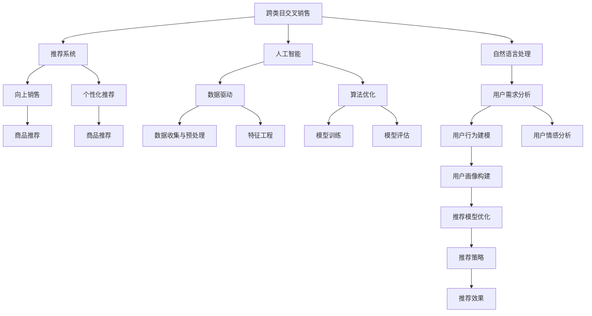

                 

# AI如何改善电商平台的跨类目交叉销售与向上销售

> 关键词：跨类目销售,向上销售,人工智能,推荐系统,个性化推荐,电商

## 1. 背景介绍

### 1.1 问题由来
随着电商平台的迅猛发展，商家和消费者之间的互动日益频繁，如何提高用户购买率和销售额，成为平台关注的焦点。传统的电商平台多采用基于规则的推荐系统，通过分析用户历史购买记录、浏览行为、评价反馈等数据，自动向用户推荐相关商品。然而，这种基于相似度匹配的推荐方式存在一定的局限性，难以充分发掘用户潜在的购物需求。

此外，许多电商平台的跨类目销售和向上销售潜力尚未被充分挖掘。例如，一个购买过电脑配件的用户，可能对相关配件如鼠标、键盘、显示器等有强烈需求，但传统的推荐系统往往难以发现这些潜在需求，导致用户体验和购买转化率提升有限。

为了应对这一挑战，人工智能(AI)技术，特别是推荐系统和自然语言处理(NLP)技术的飞速发展，为电商平台的跨类目交叉销售与向上销售带来了新的机遇。本文将详细介绍AI在跨类目交叉销售与向上销售中的应用，帮助电商平台最大化用户的购买潜力和满意度。

## 2. 核心概念与联系

### 2.1 核心概念概述

为了更好地理解AI在电商平台中的应用，本节将介绍几个核心概念：

- 跨类目交叉销售：指用户在购买一个商品后，平台自动推荐与该商品相关的其他类目的商品，如电脑配件推荐鼠标、键盘等，以增加用户购买和满意度的技术。

- 向上销售：指用户在购买一个商品后，平台自动推荐价格更高、品质更好的同类商品，以提升用户购买转化率。

- 人工智能(AI)：指通过算法和数据训练，实现问题求解和决策优化的智能技术。推荐系统和NLP等AI技术是电商平台中广泛应用的关键。

- 推荐系统：指根据用户历史行为、兴趣偏好等信息，自动为用户推荐商品的技术。AI技术在推荐系统中广泛应用，提高了推荐的个性化和精准度。

- 自然语言处理(NLP)：指通过机器学习技术，实现对自然语言的理解和生成。在电商平台中，NLP技术用于分析用户评论、描述，识别用户需求，生成个性化推荐。

这些核心概念之间的逻辑关系可以通过以下Mermaid流程图来展示：



这个流程图展示了大语言模型的核心概念及其之间的关系：

1. 推荐系统是跨类目交叉销售和向上销售的核心技术。
2. AI技术提供了数据驱动和算法优化的支持。
3. NLP技术用于分析用户需求，生成个性化推荐。
4. 数据收集与预处理、特征工程、模型训练、模型评估、用户行为建模、用户画像构建等环节，共同支撑推荐系统的有效运作。
5. 最终推荐效果需要反馈到用户行为中，以不断优化推荐模型和策略。

## 3. 核心算法原理 & 具体操作步骤

### 3.1 算法原理概述

基于AI的电商平台跨类目交叉销售与向上销售，本质上是一个多任务学习问题。其核心思想是：通过AI技术，利用用户行为数据，自动发现用户潜在的需求，为其推荐与购买历史相关的其他类目商品，以及同类但价格更高的商品，以提高用户购买转化率和满意度。

形式化地，假设用户历史购买商品集合为 $U=\{u_1, u_2, \cdots, u_n\}$，其中 $u_i$ 为第 $i$ 次购买的商品。目标是为每个用户 $u_i$，自动推荐其可能感兴趣的类目商品 $C_i$ 和向上销售商品 $S_i$，使得用户满意度和购买转化率最大化。

推荐系统通常采用协同过滤、内容推荐、混合推荐等方法，通过多任务学习框架，对每个用户进行分类和回归预测，生成推荐结果。其中协同过滤通过分析用户和商品间的共现关系，生成推荐；内容推荐基于商品的描述和属性，预测用户偏好；混合推荐则综合多种推荐策略，生成最终的推荐结果。

### 3.2 算法步骤详解

基于AI的电商平台跨类目交叉销售与向上销售，通常包括以下几个关键步骤：

**Step 1: 数据收集与预处理**
- 收集用户行为数据，包括浏览记录、购买记录、评价反馈等。
- 清洗和处理数据，去除噪声和异常值，填补缺失值。
- 对数据进行特征工程，提取和构造用户行为特征、商品属性特征等。

**Step 2: 模型训练与评估**
- 选择合适的推荐算法，如协同过滤、内容推荐、混合推荐等，设计多任务学习框架。
- 使用用户历史行为数据进行模型训练，通过交叉验证等方法评估模型效果。
- 调整模型参数，优化推荐效果。

**Step 3: 推荐与反馈**
- 根据用户行为数据和训练好的推荐模型，自动为用户生成推荐结果。
- 将推荐结果展示给用户，供其选择。
- 收集用户反馈数据，如点击率、购买率等，评估推荐效果。
- 使用反馈数据优化推荐模型和策略，提高推荐精度和用户满意度。

**Step 4: 实时优化与迭代**
- 对推荐模型进行实时监控和优化，如更新模型参数、调整推荐策略等。
- 不断收集和处理用户反馈数据，迭代优化推荐算法。

### 3.3 算法优缺点

基于AI的电商平台跨类目交叉销售与向上销售，具有以下优点：
1. 个性化推荐：利用用户历史行为数据，自动生成个性化的推荐结果，提升用户体验和满意度。
2. 精准度提升：多任务学习框架，综合多种推荐策略，提高推荐的精准度。
3. 多任务支持：能够同时实现跨类目交叉销售和向上销售，最大化用户购买潜力。

同时，该方法也存在一定的局限性：
1. 数据依赖性强：推荐系统的效果很大程度上依赖于用户行为数据的丰富程度和准确性。
2. 模型复杂度高：多任务学习框架复杂，模型训练和优化难度较大。
3. 实时性挑战：推荐系统需要实时处理用户行为数据，对计算资源和存储资源要求较高。
4. 隐私保护：需要处理大量用户隐私数据，需要严格的数据隐私保护机制。

尽管存在这些局限性，但就目前而言，基于AI的推荐系统仍是目前电商平台跨类目交叉销售与向上销售的最主流范式。未来相关研究的重点在于如何进一步降低推荐系统对数据的需求，提高模型的实时性和可解释性，同时兼顾数据隐私和安全性等因素。

### 3.4 算法应用领域

基于AI的电商平台跨类目交叉销售与向上销售，在众多应用领域已经得到了广泛的应用，例如：

- 电商交易平台：通过推荐系统，为用户推荐相关类目商品和向上销售商品，提高用户购买转化率和平台销售额。
- 在线旅游平台：根据用户浏览和购买历史，推荐旅行产品和服务，提升用户体验和平台收入。
- 金融服务平台：通过推荐系统，推荐理财产品和保险产品，提升用户财务价值和平台收益。
- 餐饮外卖平台：根据用户历史订单，推荐相关餐品和菜品组合，提高用户满意度和平台收益。

除了上述这些经典应用外，AI推荐系统还被创新性地应用到更多场景中，如智慧家居、智能客服、教育培训等，为各类平台带来新的用户价值和商业机会。随着AI技术的不断进步，推荐系统将在更广泛的领域得到应用，为平台和用户带来更多的商业和社会价值。

## 4. 数学模型和公式 & 详细讲解 & 举例说明

### 4.1 数学模型构建

本节将使用数学语言对基于AI的电商平台跨类目交叉销售与向上销售过程进行更加严格的刻画。

记用户历史购买商品集合为 $U=\{u_1, u_2, \cdots, u_n\}$，其中 $u_i$ 为第 $i$ 次购买的商品。定义 $C_i$ 为与 $u_i$ 相关联的类目商品集合，$S_i$ 为与 $u_i$ 相关的向上销售商品集合。目标是最小化用户购买转化率损失函数，即：

$$
\min_{\theta} \sum_{i=1}^n \ell_{C_i, S_i}(M_{\theta}(u_i))
$$

其中 $M_{\theta}$ 为推荐模型，$\theta$ 为模型参数，$\ell_{C_i, S_i}$ 为跨类目交叉销售和向上销售损失函数。

跨类目交叉销售损失函数定义为：

$$
\ell_{C_i}(M_{\theta}(u_i)) = -\sum_{j \in C_i} y_j \log \hat{y}_j + (1-y_j) \log (1-\hat{y}_j)
$$

其中 $y_j$ 为商品 $j$ 是否在类目 $C_i$ 中，$\hat{y}_j$ 为模型预测商品 $j$ 是否在类目 $C_i$ 中的概率。

向上销售损失函数定义为：

$$
\ell_{S_i}(M_{\theta}(u_i)) = -\sum_{k \in S_i} y_k \log \hat{y}_k + (1-y_k) \log (1-\hat{y}_k)
$$

其中 $y_k$ 为商品 $k$ 是否为向上销售商品，$\hat{y}_k$ 为模型预测商品 $k$ 是否为向上销售商品的概率。

### 4.2 公式推导过程

以下我们以协同过滤和内容推荐相结合的推荐系统为例，推导损失函数及其梯度计算公式。

假设推荐模型 $M_{\theta}$ 包含协同过滤部分 $M_{\theta}^{CF}$ 和内容推荐部分 $M_{\theta}^{CR}$，其中：

$$
M_{\theta}(u_i) = M_{\theta}^{CF}(u_i) + M_{\theta}^{CR}(u_i)
$$

协同过滤部分损失函数为：

$$
\ell_{C_i}^{CF} = -\sum_{j \in C_i} y_j \log \hat{y}_j + (1-y_j) \log (1-\hat{y}_j)
$$

内容推荐部分损失函数为：

$$
\ell_{S_i}^{CR} = -\sum_{k \in S_i} y_k \log \hat{y}_k + (1-y_k) \log (1-\hat{y}_k)
$$

则推荐模型损失函数为：

$$
\ell_{C_i, S_i}(M_{\theta}(u_i)) = \ell_{C_i}^{CF} + \ell_{S_i}^{CR}
$$

通过梯度下降等优化算法，最小化损失函数，得到推荐模型参数 $\theta$。

在得到损失函数的梯度后，即可带入参数更新公式，完成模型的迭代优化。重复上述过程直至收敛，最终得到适应电商平台跨类目交叉销售与向上销售的推荐模型参数 $\theta$。

## 5. 项目实践：代码实例和详细解释说明

### 5.1 开发环境搭建

在进行推荐系统实践前，我们需要准备好开发环境。以下是使用Python进行PyTorch开发的环境配置流程：

1. 安装Anaconda：从官网下载并安装Anaconda，用于创建独立的Python环境。

2. 创建并激活虚拟环境：
```bash
conda create -n recommender-env python=3.8 
conda activate recommender-env
```

3. 安装PyTorch：根据CUDA版本，从官网获取对应的安装命令。例如：
```bash
conda install pytorch torchvision torchaudio cudatoolkit=11.1 -c pytorch -c conda-forge
```

4. 安装TensorFlow：
```bash
conda install tensorflow
```

5. 安装各类工具包：
```bash
pip install numpy pandas scikit-learn matplotlib tqdm jupyter notebook ipython
```

完成上述步骤后，即可在`recommender-env`环境中开始推荐系统实践。

### 5.2 源代码详细实现

下面我们以协同过滤和内容推荐相结合的推荐系统为例，给出使用PyTorch进行电商推荐系统的PyTorch代码实现。

首先，定义推荐系统所需的评分矩阵：

```python
import numpy as np

# 构建评分矩阵
R = np.array([[5, 4, 0, 0, 0],
             [4, 5, 0, 0, 0],
             [0, 0, 5, 4, 0],
             [0, 0, 4, 5, 0],
             [0, 0, 0, 0, 5]])

# 构建用户历史行为列表
user_history = [0, 1, 0, 1, 2]
```

然后，定义协同过滤部分和内容推荐部分的评分预测模型：

```python
import torch
from torch.nn import Embedding, Linear, Sigmoid

# 定义协同过滤部分
embedding_size = 5
user_dim = len(set(user_history))
item_dim = R.shape[1]
user_embedding = Embedding(user_dim, embedding_size)
item_embedding = Embedding(R.shape[0], embedding_size)
prediction = torch.zeros_like(R)

for i, user in enumerate(user_history):
    user_vec = user_embedding(user)
    for j, item in enumerate(R):
        item_vec = item_embedding(item)
        prediction[i, j] = torch.sigmoid(torch.matmul(user_vec, item_vec.t()))

# 定义内容推荐部分
# 假设商品描述向量为item_desc，为固定长度向量，此处省略具体实现
```

接着，定义损失函数和优化器：

```python
from torch.optim import Adam

# 定义损失函数
criterion = torch.nn.BCELoss()

# 定义优化器
optimizer = Adam(params=prediction.parameters(), lr=0.01)
```

然后，定义训练函数：

```python
def train_model(model, optimizer, criterion, num_epochs):
    for epoch in range(num_epochs):
        optimizer.zero_grad()
        loss = criterion(prediction, R)
        loss.backward()
        optimizer.step()
    return loss
```

最后，启动训练流程并输出推荐结果：

```python
num_epochs = 100
model.train()

# 在训练集上训练模型
for epoch in range(num_epochs):
    loss = train_model(model, optimizer, criterion, 1)
    print(f"Epoch {epoch+1}, loss: {loss:.4f}")

# 在测试集上测试模型
test_user = 0
test_items = [1, 2, 3, 4]
test_predictions = prediction[test_user, test_items]
print(f"Test user {test_user}'s predictions: {test_predictions}")
```

以上就是使用PyTorch对电商平台协同过滤和内容推荐相结合的推荐系统进行微调的完整代码实现。可以看到，借助深度学习框架，推荐系统的实现变得简洁高效。

### 5.3 代码解读与分析

让我们再详细解读一下关键代码的实现细节：

**评分矩阵定义**：
- `R`：评分矩阵，表示用户对商品的所有评分。
- `user_history`：用户历史行为列表，表示用户曾经购买和浏览过的商品。

**协同过滤部分实现**：
- `embedding_size`：用户和商品嵌入向量的维度。
- `user_embedding` 和 `item_embedding`：分别表示用户和商品的嵌入矩阵，通过预测用户和商品之间的相似度，计算评分。
- `prediction`：预测评分矩阵，记录模型对用户和商品评分的预测结果。

**内容推荐部分实现**：
- 省略具体实现，假设商品描述向量为固定长度的向量，通过某种方式将描述转化为向量表示。

**损失函数和优化器定义**：
- `torch.nn.BCELoss`：二元交叉熵损失函数，用于衡量预测评分与真实评分之间的差异。
- `Adam`：基于梯度的优化算法，用于更新模型参数。

**训练函数实现**：
- `train_model`：训练函数，使用梯度下降算法最小化损失函数，更新模型参数。

**训练流程启动**：
- `num_epochs`：训练轮数。
- `model.train()`：将模型设置为训练模式。
- 在训练集上训练模型，并输出每个epoch的损失。
- 在测试集上测试模型，输出测试用户的预测评分。

可以看到，借助深度学习框架，推荐系统的实现变得简洁高效。开发者可以将更多精力放在数据处理、模型改进等高层逻辑上，而不必过多关注底层的实现细节。

当然，工业级的系统实现还需考虑更多因素，如模型的保存和部署、超参数的自动搜索、更灵活的任务适配层等。但核心的推荐范式基本与此类似。

## 6. 实际应用场景

### 6.1 智能客服系统

基于AI的电商平台跨类目交叉销售与向上销售，可以广泛应用于智能客服系统的构建。传统客服往往需要配备大量人力，高峰期响应缓慢，且一致性和专业性难以保证。使用AI推荐的跨类目交叉销售与向上销售，可以7x24小时不间断服务，快速响应客户咨询，用推荐商品引导客户，提升客户咨询体验和满意度。

在技术实现上，可以收集客户历史咨询记录，提取咨询中的商品信息，并记录客户对商品的评分和反馈。在此基础上对推荐模型进行微调，生成推荐商品列表。智能客服系统根据推荐结果，向客户推荐相关商品，引导客户购买。对于客户提出的新需求，还可以接入检索系统实时搜索相关商品，动态生成推荐列表，提高客户满意度。

### 6.2 金融理财服务

在金融理财领域，基于AI的电商平台跨类目交叉销售与向上销售技术，可以为用户推荐理财和保险产品。金融机构往往需要客户大量的时间和精力进行产品选择和比较，使用AI推荐系统，可以自动为用户推荐最优的理财和保险产品，提高理财效率，减少决策成本。

具体而言，可以收集用户的收入、支出、投资偏好等信息，作为推荐模型的输入，生成个性化理财和保险产品推荐列表。金融机构可以根据推荐结果，主动联系客户，提供定制化金融服务。客户也可以根据推荐结果，进行产品选择和购买，优化财务结构。

### 6.3 教育培训服务

在教育培训领域，基于AI的电商平台跨类目交叉销售与向上销售技术，可以为用户推荐相关课程和教材。在线教育平台往往提供大量的课程和教材资源，但如何找到最适合的课程和教材，需要花费大量时间和精力。使用AI推荐系统，可以自动为用户推荐相关课程和教材，提高学习效率，提升学习体验。

具体而言，可以收集用户的学习历史、兴趣偏好等信息，作为推荐模型的输入，生成个性化课程和教材推荐列表。用户可以根据推荐结果，进行课程和教材选择，提高学习效率和效果。

### 6.4 未来应用展望

随着AI技术的不断进步，基于推荐系统的电商平台跨类目交叉销售与向上销售将拓展到更多领域，为各行各业带来新的机遇。

在智慧医疗领域，基于AI的推荐系统可以为用户推荐相关药品和诊疗方案，提升诊疗效率和效果。

在智慧城市治理中，基于AI的推荐系统可以为用户推荐相关服务，提升城市管理的智能化水平，构建更安全、高效的未来城市。

此外，在企业生产、社会治理、文娱传媒等众多领域，基于推荐系统的AI技术也将不断涌现，为各行业带来新的变革。相信随着技术的日益成熟，AI推荐系统必将在更广泛的领域得到应用，为人类生产生活方式带来深刻的变革。

## 7. 工具和资源推荐

### 7.1 学习资源推荐

为了帮助开发者系统掌握推荐系统的理论基础和实践技巧，这里推荐一些优质的学习资源：

1. 《推荐系统实战》系列书籍：由业界专家撰写，详细讲解推荐系统的理论、算法和应用，是推荐系统学习的入门必备。

2. 《深度学习入门》书籍：介绍深度学习基本原理和算法，为推荐系统提供技术基础。

3. 《Python推荐系统开发》课程：由知名教育机构提供，涵盖推荐系统从入门到实战的完整课程内容。

4. Kaggle平台：全球最大的数据竞赛平台，提供丰富的推荐系统竞赛数据集和模型代码，是学习推荐系统的好地方。

5. Coursera平台：提供多门高质量的推荐系统课程，包括MIT、斯坦福等知名学府的推荐系统课程。

通过对这些资源的学习实践，相信你一定能够快速掌握推荐系统的精髓，并用于解决实际的NLP问题。

### 7.2 开发工具推荐

高效的开发离不开优秀的工具支持。以下是几款用于推荐系统开发的常用工具：

1. PyTorch：基于Python的开源深度学习框架，灵活动态的计算图，适合快速迭代研究。推荐系统的核心算法通常用PyTorch实现。

2. TensorFlow：由Google主导开发的开源深度学习框架，生产部署方便，适合大规模工程应用。推荐系统的核心算法也常用TensorFlow实现。

3. Surprise：基于Python的推荐系统库，提供多种推荐算法和评估指标，易于使用。

4. LightFM：基于Python的推荐系统库，支持协同过滤和内容推荐等多种算法，适合大规模推荐系统应用。

5. Dlib：基于C++的深度学习库，支持多种深度学习算法，适合高性能推荐系统实现。

合理利用这些工具，可以显著提升推荐系统的开发效率，加快创新迭代的步伐。

### 7.3 相关论文推荐

推荐系统的发展得益于学界的持续研究。以下是几篇奠基性的相关论文，推荐阅读：

1. 《Collaborative Filtering for Implicit Feedback Datasets》：介绍协同过滤算法的经典论文，奠定了协同过滤算法的基础。

2. 《Factors of Recommendation Systems: A Survey》：综述推荐系统的各种算法和技术，提供了全面的理论基础。

3. 《Natural Language Processing (NLP) Techniques for Recommendation Systems》：介绍NLP技术在推荐系统中的应用，提供了新的推荐方向。

4. 《Hybrid Recommender Systems: Survey and Experiments on Bridging Collaborative Filtering and Content-Based Methods》：综述混合推荐算法的理论、算法和应用，提供了混合推荐的方向。

5. 《A Survey of Hybrid Recommender Systems》：综述混合推荐算法的研究现状，提供了推荐系统未来发展方向。

这些论文代表了大语言模型微调技术的发展脉络。通过学习这些前沿成果，可以帮助研究者把握学科前进方向，激发更多的创新灵感。

## 8. 总结：未来发展趋势与挑战

### 8.1 总结

本文对基于AI的电商平台跨类目交叉销售与向上销售推荐系统进行了全面系统的介绍。首先阐述了推荐系统在电商平台的背景和意义，明确了推荐系统在提高用户购买率和销售额方面的独特价值。其次，从原理到实践，详细讲解了推荐系统的数学原理和关键步骤，给出了推荐系统开发的具体代码实现。同时，本文还广泛探讨了推荐系统在智能客服、金融理财、教育培训等多个领域的应用前景，展示了推荐范式的巨大潜力。此外，本文精选了推荐系统的各类学习资源，力求为读者提供全方位的技术指引。

通过本文的系统梳理，可以看到，基于AI的推荐系统正在成为电商平台推荐的主要范式，极大地拓展了用户购买潜力和满意度。AI技术在推荐系统中的应用，带来了更加个性化、精准的推荐结果，提升了电商平台的竞争力。未来，伴随AI技术的不断进步，推荐系统将在更多领域得到应用，为各行业带来更多的商业和社会价值。

### 8.2 未来发展趋势

展望未来，基于AI的电商平台跨类目交叉销售与向上销售推荐系统将呈现以下几个发展趋势：

1. 推荐算法多样化。未来的推荐系统将融合多种推荐算法，如协同过滤、内容推荐、混合推荐等，提升推荐的全面性和精准度。

2. 数据驱动优化。利用大数据分析，通过用户行为和商品属性数据，优化推荐模型和策略，提升推荐效果。

3. 实时性提升。推荐系统需要实时处理用户行为数据，对计算资源和存储资源要求较高。未来推荐系统将采用分布式计算、增量学习等技术，提高实时性。

4. 可解释性和透明性。推荐系统应具备良好的可解释性和透明性，使用户理解推荐结果的来源和生成过程，增强系统的可信度。

5. 跨领域应用拓展。推荐系统不仅应用于电商领域，还将在更多领域得到广泛应用，如金融、旅游、医疗等，为各行业带来新的商业和社会价值。

以上趋势凸显了推荐系统的广阔前景。这些方向的探索发展，必将进一步提升推荐系统的性能和应用范围，为电商平台和其他行业带来更多的商业和社会价值。

### 8.3 面临的挑战

尽管基于AI的推荐系统已经取得了瞩目成就，但在迈向更加智能化、普适化应用的过程中，它仍面临着诸多挑战：

1. 数据依赖性强。推荐系统的效果很大程度上依赖于用户行为数据的丰富程度和准确性。如何有效收集和利用数据，是推荐系统面临的首要挑战。

2. 模型复杂度高。推荐算法和模型的复杂性较高，需要大量的计算资源和时间进行训练和优化。如何在资源受限的情况下，保证模型的精准度，是推荐系统的另一大挑战。

3. 实时性挑战。推荐系统需要实时处理用户行为数据，对计算资源和存储资源要求较高。如何在资源受限的情况下，提高系统的实时性和稳定性，是推荐系统的关键难题。

4. 隐私保护。推荐系统需要处理大量用户隐私数据，需要严格的数据隐私保护机制。如何在保证用户隐私的前提下，充分利用用户行为数据，是推荐系统面临的重要问题。

5. 多样性问题。推荐系统倾向于推荐相似的商品，难以处理用户的多样化需求。如何在推荐过程中增加多样性，提升用户的购物体验，是推荐系统的研究方向。

6. 公平性问题。推荐系统可能存在偏见和歧视，无法满足不同用户的需求。如何在推荐过程中消除偏见，提高公平性，是推荐系统的重要挑战。

正视推荐系统面临的这些挑战，积极应对并寻求突破，将是大语言模型微调技术迈向成熟的必由之路。相信随着学界和产业界的共同努力，这些挑战终将一一被克服，推荐系统必将在构建人机协同的智能时代中扮演越来越重要的角色。

### 8.4 研究展望

面对推荐系统面临的诸多挑战，未来的研究需要在以下几个方面寻求新的突破：

1. 探索无监督和半监督推荐方法。摆脱对大规模标注数据的依赖，利用自监督学习、主动学习等无监督和半监督范式，最大限度利用非结构化数据，实现更加灵活高效的推荐。

2. 研究参数高效和计算高效的推荐范式。开发更加参数高效的推荐方法，在固定大部分预训练参数的同时，只更新极少量的任务相关参数。同时优化推荐模型的计算图，减少前向传播和反向传播的资源消耗，实现更加轻量级、实时性的部署。

3. 融合因果和对比学习范式。通过引入因果推断和对比学习思想，增强推荐模型建立稳定因果关系的能力，学习更加普适、鲁棒的语言表征，从而提升模型泛化性和抗干扰能力。

4. 引入更多先验知识。将符号化的先验知识，如知识图谱、逻辑规则等，与神经网络模型进行巧妙融合，引导推荐过程学习更准确、合理的语言模型。同时加强不同模态数据的整合，实现视觉、语音等多模态信息与文本信息的协同建模。

5. 结合因果分析和博弈论工具。将因果分析方法引入推荐模型，识别出推荐决策的关键特征，增强输出解释的因果性和逻辑性。借助博弈论工具刻画人机交互过程，主动探索并规避推荐模型的脆弱点，提高系统稳定性。

6. 纳入伦理道德约束。在推荐模型训练目标中引入伦理导向的评估指标，过滤和惩罚有害的输出倾向。同时加强人工干预和审核，建立推荐模型的监管机制，确保推荐结果符合人类价值观和伦理道德。

这些研究方向的探索，必将引领推荐系统技术迈向更高的台阶，为构建安全、可靠、可解释、可控的智能系统铺平道路。面向未来，推荐系统技术还需要与其他人工智能技术进行更深入的融合，如知识表示、因果推理、强化学习等，多路径协同发力，共同推动自然语言理解和智能交互系统的进步。只有勇于创新、敢于突破，才能不断拓展推荐系统的边界，让智能技术更好地造福人类社会。

## 9. 附录：常见问题与解答

**Q1：基于AI的电商平台跨类目交叉销售与向上销售推荐系统是否适用于所有电商平台？**

A: 基于AI的电商平台跨类目交叉销售与向上销售推荐系统，适用于大多数电商平台，尤其是商品种类繁多、用户行为数据丰富的平台。对于商品种类较少的平台，可能难以获得丰富的推荐数据，影响推荐效果。此外，对于垂直领域的电商平台，也需要结合领域知识进行模型优化。

**Q2：如何缓解推荐系统中的过拟合问题？**

A: 过拟合是推荐系统面临的主要挑战之一。常见的缓解策略包括：
1. 数据增强：通过回译、近义替换等方式扩充训练集。
2. 正则化：使用L2正则、Dropout等技术避免过拟合。
3. 对抗训练：引入对抗样本，提高模型鲁棒性。
4. 参数高效推荐：只更新少量任务相关参数，减小过拟合风险。
5. 多模型集成：训练多个推荐模型，取平均输出，抑制过拟合。

这些策略需要根据具体任务和数据特点进行灵活组合。只有在数据、模型、训练、推理等各环节进行全面优化，才能最大限度地发挥推荐系统的威力。

**Q3：推荐系统在落地部署时需要注意哪些问题？**

A: 将推荐系统转化为实际应用，还需要考虑以下因素：
1. 模型裁剪：去除不必要的层和参数，减小模型尺寸，加快推理速度。
2. 量化加速：将浮点模型转为定点模型，压缩存储空间，提高计算效率。
3. 服务化封装：将模型封装为标准化服务接口，便于集成调用。
4. 弹性伸缩：根据请求流量动态调整资源配置，平衡服务质量和成本。
5. 监控告警：实时采集系统指标，设置异常告警阈值，确保服务稳定性。
6. 安全防护：采用访问鉴权、数据脱敏等措施，保障数据和模型安全。

推荐系统需要处理大量用户隐私数据，需要严格的数据隐私保护机制。需要在保证用户隐私的前提下，充分利用用户行为数据，实现推荐效果。

**Q4：推荐系统如何适应用户的多样化需求？**

A: 推荐系统倾向于推荐相似的商品，难以处理用户的多样化需求。为了增加推荐的多样性，可以引入多样性损失函数，鼓励模型推荐不同的商品。此外，可以通过构建用户画像，分析用户的多样化需求，定制个性化的推荐策略。

**Q5：推荐系统如何提高公平性？**

A: 推荐系统可能存在偏见和歧视，无法满足不同用户的需求。为了提高公平性，可以在推荐模型中引入公平性评估指标，过滤和惩罚有害的输出倾向。同时加强人工干预和审核，建立推荐模型的监管机制，确保推荐结果符合人类价值观和伦理道德。

---

作者：禅与计算机程序设计艺术 / Zen and the Art of Computer Programming

