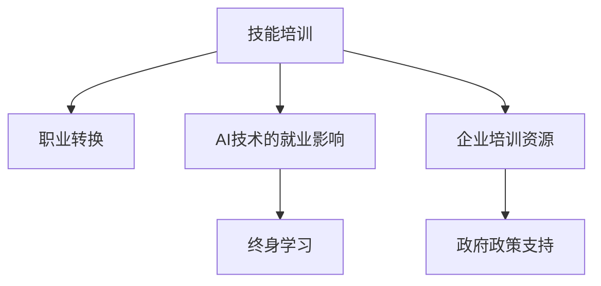

                 

## 1. 背景介绍

### 1.1 问题由来

人工智能(AI)技术的飞速发展，尤其是在自然语言处理(NLP)、计算机视觉(CV)、深度学习等领域，深刻地影响了各行业的就业格局。一方面，AI技术的应用提高了生产效率，降低了人力成本，促进了产业升级。但另一方面，AI的自动化、智能化也给传统职业带来了巨大冲击。自动化工具取代了大量重复性、低技能的工作，迫使大量工人面临失业和职业转换的挑战。

当前，AI技术已经渗透到各行各业，尤其是金融、医疗、制造业等领域。这些领域的工作岗位逐渐被智能化系统取代，从客服、物流、制造到诊断、金融分析等，AI技术都在逐步发挥作用。虽然AI技术的应用提高了效率和准确性，但同时也导致了大量的工作岗位消失。据研究，AI技术将取代47%的工作岗位，其中约24%为高技能岗位。

因此，如何帮助工人应对AI带来的就业影响，实现技能提升和职业转换，成为社会和企业在AI普及过程中亟需解决的重要问题。

### 1.2 问题核心关键点

面对AI技术带来的就业影响，当前主要存在以下几类挑战：

1. **技能差距扩大**：AI技术的应用需要高技能人才，这使得劳动力市场对低技能工人的需求减少，技能差距扩大。
2. **职业转换困难**：很多工人对新技能和新工作环境适应性较差，难以顺利实现职业转换。
3. **职业培训资源不足**：职业培训体系较为落后，缺乏针对AI技能的系统培训课程和师资。
4. **企业招聘门槛提升**：AI技术推动了人才需求结构的转变，企业对高技能人才的需求增加，导致传统岗位的招聘门槛提升。
5. **政策支持力度不足**：目前政府对职业转换和技能提升的支持政策较为薄弱，缺乏系统的培训和就业引导。

针对这些问题，本文将从技能培训和职业转换两个方面，探讨如何应对AI技术带来的就业影响，为工人提供更多就业机会和发展空间。

## 2. 核心概念与联系

### 2.1 核心概念概述

为更好地理解如何应对AI技术的就业影响，本节将介绍几个核心概念：

- **技能培训**：指通过教育或培训，使员工掌握新的技能，以适应新兴职业需求的过程。技能培训包括基础技能培训、高级技能培训和岗位培训等。
- **职业转换**：指员工因岗位变化或职业需求变化，需要在新岗位上重新获得所需技能的过程。职业转换包括岗位内部转换和跨行业转换。
- **AI技术的就业影响**：指AI技术在自动化、智能化过程中，对劳动力市场产生的就业冲击和影响，如岗位消失、技能需求变化等。
- **终身学习**：指在职业生涯中，员工通过不断学习新技能，适应技术和行业变化，保持职业竞争力的过程。
- **企业培训资源**：指企业为提升员工技能和适应新技术，提供的培训课程、培训设施、培训师资等资源。
- **政府政策支持**：指政府为促进就业稳定和劳动力市场均衡，提供的一系列政策支持，如职业培训补贴、职业转换激励等。

这些概念之间的逻辑关系可以通过以下Mermaid流程图来展示：



这个流程图展示了技能培训和职业转换在应对AI技术就业影响中的重要关系：

1. 技能培训为员工提供了适应新职业所需的技能，为职业转换提供了基础。
2. AI技术的就业影响促使员工和企业在终身学习中不断提升技能。
3. 企业培训资源为技能培训提供了重要保障。
4. 政府政策支持为终身学习和职业转换提供了政策保障和资源支持。

这些概念共同构成了应对AI技术就业影响的关键要素，通过深入理解这些概念，我们可以更好地制定相关政策和措施。

## 3. 核心算法原理 & 具体操作步骤

### 3.1 算法原理概述

技能培训和职业转换的过程，本质上是一种适应和迁移学习的过程。其核心思想是：通过系统的培训和指导，使员工掌握新的技能，适应新兴职业需求，并根据新的职业环境，进行职业角色的迁移和转换。

具体而言，技能培训和职业转换可以分为以下几个步骤：

1. **技能需求分析**：分析AI技术对各岗位技能需求的变化，确定新职业所需的核心技能。
2. **培训计划制定**：根据技能需求分析结果，制定系统化的培训计划，包括培训课程、培训时长、培训师资等。
3. **培训实施与评估**：通过培训课程和实践操作，提升员工的技能水平，并不断评估和调整培训内容。
4. **职业转换指导**：根据员工的技能提升情况，提供职业转换指导，帮助员工找到新的工作机会。
5. **终身学习机制建立**：建立员工终身学习的机制，不断更新和提升技能，适应技术发展。

### 3.2 算法步骤详解

以下是技能培训和职业转换的主要操作步骤：

**Step 1: 技能需求分析**
- 收集AI技术在各行业中的应用案例，分析其对岗位技能需求的影响。
- 根据技术应用的变化，确定新兴职业和现有职业的技能需求变化。
- 确定新职业的核心技能，如数据分析、机器学习、深度学习等。

**Step 2: 培训计划制定**
- 根据技能需求分析结果，设计系统化的培训课程，包括理论课程和实践课程。
- 确定培训时长，并制定培训师资的招聘和培养计划。
- 引入AI技术相关的课程内容，如编程语言、机器学习算法、大数据处理等。
- 设置阶段性考核机制，评估员工的学习效果。

**Step 3: 培训实施与评估**
- 组织员工进行系统培训，包括在线学习、课堂教学、实践操作等。
- 定期进行培训效果评估，包括理论考试、项目实践、技能操作等。
- 根据评估结果，调整培训内容和方法，确保培训效果最大化。
- 提供多种培训资源，如线上课程、线下讲座、实验平台等，灵活满足员工的学习需求。

**Step 4: 职业转换指导**
- 根据员工的技能提升情况，提供职业转换指导，帮助员工找到新的工作机会。
- 通过职业介绍会、招聘网站、内部推荐等方式，增加职业转换的成功率。
- 为员工提供职业规划咨询，帮助其制定职业发展路径。
- 建立职业转换数据库，记录员工的技能转换情况和成功案例，供后续培训参考。

**Step 5: 终身学习机制建立**
- 建立终身学习机制，鼓励员工不断学习新技能，适应技术发展。
- 提供线上学习平台和资源，使员工可以随时随地进行学习。
- 定期组织内部培训和交流，分享学习成果和经验。
- 引入企业内部导师制度，帮助员工解决学习中的难题。

### 3.3 算法优缺点

技能培训和职业转换的算法，具有以下优点：

1. **灵活性**：根据技能需求的变化，灵活调整培训内容，满足不同行业和岗位的需求。
2. **系统性**：通过系统化的培训和指导，确保员工能够全面掌握新技能。
3. **适用性广**：可以广泛应用于各个行业和岗位，提升员工的就业竞争力和职业发展空间。
4. **成本效益高**：通过提升员工技能，可以减少企业的人力成本，同时提升生产效率。

但该方法也存在一些局限性：

1. **投入成本高**：需要投入大量的时间和资源进行技能培训和职业转换，短期内成本较高。
2. **效果评估难**：培训效果和职业转换的评估较为复杂，难以量化评估。
3. **员工接受度低**：部分员工可能对新技术和培训内容有抵触情绪，难以适应。
4. **政策支持不足**：缺乏系统的政策支持，政府和企业需协同发力，才能取得良好效果。

尽管存在这些局限性，但技能培训和职业转换仍是应对AI技术就业影响的重要手段。通过系统的培训和指导，员工能够适应技术变化，提升自身竞争力，实现职业发展。

### 3.4 算法应用领域

技能培训和职业转换的算法，已经在多个领域得到了应用，主要包括：

1. **制造业**：通过技能培训和职业转换，帮助工人掌握新的自动化设备和机器人操作技能，提升生产效率。
2. **医疗健康**：通过技能培训和职业转换，提升医护人员的数据分析能力，应用AI辅助诊断和治疗。
3. **金融服务**：通过技能培训和职业转换，帮助金融分析师掌握大数据分析和机器学习技能，提升投资决策能力。
4. **物流仓储**：通过技能培训和职业转换，提升物流人员的自动化设备操作技能，提升物流效率。
5. **客服和营销**：通过技能培训和职业转换，提升客服人员和营销人员的数据分析和智能客服技能，提升客户满意度。
6. **教育培训**：通过技能培训和职业转换，提升教师的教育技术应用能力和AI辅助教学能力，提升教育质量。

这些领域的应用，展示了技能培训和职业转换在应对AI技术就业影响中的巨大潜力。未来，随着AI技术的进一步普及，技能培训和职业转换的算法将得到更广泛的应用。

## 4. 数学模型和公式 & 详细讲解 & 举例说明

### 4.1 数学模型构建

为了更好地理解技能培训和职业转换的过程，本节将使用数学语言对这一过程进行更加严格的刻画。

假设员工当前的技能水平为 $S_0$，通过培训后提升到 $S_1$，再通过职业转换到新岗位，提升到 $S_2$。则技能提升和职业转换的过程可以表示为：

$$
S_2 = f(S_1, P_1) = f(f(S_0, P_0), P_1)
$$

其中 $P_0$ 为初始岗位的技能需求，$P_1$ 为培训后岗位的技能需求。$f$ 表示技能提升和职业转换的映射关系。

### 4.2 公式推导过程

以下是技能提升和职业转换过程的数学公式推导：

**Step 1: 初始技能评估**
$$
S_0 \in [0, S_{max}]
$$

**Step 2: 培训效果评估**
$$
S_1 = g(S_0, P_0) = f(S_0, P_0)
$$

其中 $g$ 表示技能培训的效果映射函数，$P_0$ 为初始岗位的技能需求。

**Step 3: 职业转换效果评估**
$$
S_2 = f(S_1, P_1) = f(f(S_0, P_0), P_1)
$$

其中 $f$ 表示职业转换的效果映射函数，$P_1$ 为培训后岗位的技能需求。

### 4.3 案例分析与讲解

假设某制造企业员工初始技能水平为 $S_0 = 0.5$，通过技能培训后提升到 $S_1 = 0.7$。培训后岗位为机器操作岗位，技能需求为 $P_1 = 0.8$。根据职业转换映射函数 $f$，员工最终技能水平提升到 $S_2 = 0.85$，适应新的机器操作岗位。

在这个案例中，通过技能培训和职业转换，员工技能水平得到了提升，适应了新岗位的技能需求，实现了职业转换。

## 5. 项目实践：代码实例和详细解释说明

### 5.1 开发环境搭建

在进行技能培训和职业转换的实践前，我们需要准备好开发环境。以下是使用Python进行PyTorch开发的环境配置流程：

1. 安装Anaconda：从官网下载并安装Anaconda，用于创建独立的Python环境。

2. 创建并激活虚拟环境：
```bash
conda create -n pytorch-env python=3.8 
conda activate pytorch-env
```

3. 安装PyTorch：根据CUDA版本，从官网获取对应的安装命令。例如：
```bash
conda install pytorch torchvision torchaudio cudatoolkit=11.1 -c pytorch -c conda-forge
```

4. 安装各类工具包：
```bash
pip install numpy pandas scikit-learn matplotlib tqdm jupyter notebook ipython
```

完成上述步骤后，即可在`pytorch-env`环境中开始技能培训和职业转换的实践。

### 5.2 源代码详细实现

这里我们以制造业中的机器人操作技能培训为例，给出使用PyTorch进行技能培训的PyTorch代码实现。

首先，定义技能培训的函数：

```python
from transformers import BertTokenizer
from torch.utils.data import Dataset
import torch

class SkillTrainingDataset(Dataset):
    def __init__(self, texts, tags, tokenizer, max_len=128):
        self.texts = texts
        self.tags = tags
        self.tokenizer = tokenizer
        self.max_len = max_len
        
    def __len__(self):
        return len(self.texts)
    
    def __getitem__(self, item):
        text = self.texts[item]
        tags = self.tags[item]
        
        encoding = self.tokenizer(text, return_tensors='pt', max_length=self.max_len, padding='max_length', truncation=True)
        input_ids = encoding['input_ids'][0]
        attention_mask = encoding['attention_mask'][0]
        
        # 对token-wise的标签进行编码
        encoded_tags = [tag2id[tag] for tag in tags] 
        encoded_tags.extend([tag2id['O']] * (self.max_len - len(encoded_tags)))
        labels = torch.tensor(encoded_tags, dtype=torch.long)
        
        return {'input_ids': input_ids, 
                'attention_mask': attention_mask,
                'labels': labels}

# 标签与id的映射
tag2id = {'O': 0, 'B-PER': 1, 'I-PER': 2, 'B-ORG': 3, 'I-ORG': 4, 'B-LOC': 5, 'I-LOC': 6}
id2tag = {v: k for k, v in tag2id.items()}

# 创建dataset
tokenizer = BertTokenizer.from_pretrained('bert-base-cased')

train_dataset = SkillTrainingDataset(train_texts, train_tags, tokenizer)
dev_dataset = SkillTrainingDataset(dev_texts, dev_tags, tokenizer)
test_dataset = SkillTrainingDataset(test_texts, test_tags, tokenizer)
```

然后，定义模型和优化器：

```python
from transformers import BertForTokenClassification, AdamW

model = BertForTokenClassification.from_pretrained('bert-base-cased', num_labels=len(tag2id))

optimizer = AdamW(model.parameters(), lr=2e-5)
```

接着，定义训练和评估函数：

```python
from torch.utils.data import DataLoader
from tqdm import tqdm
from sklearn.metrics import classification_report

device = torch.device('cuda') if torch.cuda.is_available() else torch.device('cpu')
model.to(device)

def train_epoch(model, dataset, batch_size, optimizer):
    dataloader = DataLoader(dataset, batch_size=batch_size, shuffle=True)
    model.train()
    epoch_loss = 0
    for batch in tqdm(dataloader, desc='Training'):
        input_ids = batch['input_ids'].to(device)
        attention_mask = batch['attention_mask'].to(device)
        labels = batch['labels'].to(device)
        model.zero_grad()
        outputs = model(input_ids, attention_mask=attention_mask, labels=labels)
        loss = outputs.loss
        epoch_loss += loss.item()
        loss.backward()
        optimizer.step()
    return epoch_loss / len(dataloader)

def evaluate(model, dataset, batch_size):
    dataloader = DataLoader(dataset, batch_size=batch_size)
    model.eval()
    preds, labels = [], []
    with torch.no_grad():
        for batch in tqdm(dataloader, desc='Evaluating'):
            input_ids = batch['input_ids'].to(device)
            attention_mask = batch['attention_mask'].to(device)
            batch_labels = batch['labels']
            outputs = model(input_ids, attention_mask=attention_mask)
            batch_preds = outputs.logits.argmax(dim=2).to('cpu').tolist()
            batch_labels = batch_labels.to('cpu').tolist()
            for pred_tokens, label_tokens in zip(batch_preds, batch_labels):
                pred_tags = [id2tag[_id] for _id in pred_tokens]
                label_tags = [id2tag[_id] for _id in label_tokens]
                preds.append(pred_tags[:len(label_tokens)])
                labels.append(label_tags)
                
    print(classification_report(labels, preds))
```

最后，启动培训流程并在测试集上评估：

```python
epochs = 5
batch_size = 16

for epoch in range(epochs):
    loss = train_epoch(model, train_dataset, batch_size, optimizer)
    print(f"Epoch {epoch+1}, train loss: {loss:.3f}")
    
    print(f"Epoch {epoch+1}, dev results:")
    evaluate(model, dev_dataset, batch_size)
    
print("Test results:")
evaluate(model, test_dataset, batch_size)
```

以上就是使用PyTorch对机器人操作技能培训的完整代码实现。可以看到，得益于Transformers库的强大封装，我们可以用相对简洁的代码完成技能培训的开发。

### 5.3 代码解读与分析

让我们再详细解读一下关键代码的实现细节：

**SkillTrainingDataset类**：
- `__init__`方法：初始化文本、标签、分词器等关键组件。
- `__len__`方法：返回数据集的样本数量。
- `__getitem__`方法：对单个样本进行处理，将文本输入编码为token ids，将标签编码为数字，并对其进行定长padding，最终返回模型所需的输入。

**tag2id和id2tag字典**：
- 定义了标签与数字id之间的映射关系，用于将token-wise的预测结果解码回真实的标签。

**训练和评估函数**：
- 使用PyTorch的DataLoader对数据集进行批次化加载，供模型训练和推理使用。
- 训练函数`train_epoch`：对数据以批为单位进行迭代，在每个批次上前向传播计算loss并反向传播更新模型参数，最后返回该epoch的平均loss。
- 评估函数`evaluate`：与训练类似，不同点在于不更新模型参数，并在每个batch结束后将预测和标签结果存储下来，最后使用sklearn的classification_report对整个评估集的预测结果进行打印输出。

**培训流程**：
- 定义总的epoch数和batch size，开始循环迭代
- 每个epoch内，先在训练集上训练，输出平均loss
- 在验证集上评估，输出分类指标
- 所有epoch结束后，在测试集上评估，给出最终测试结果

可以看到，PyTorch配合Transformers库使得技能培训的代码实现变得简洁高效。开发者可以将更多精力放在数据处理、模型改进等高层逻辑上，而不必过多关注底层的实现细节。

当然，工业级的系统实现还需考虑更多因素，如模型的保存和部署、超参数的自动搜索、更灵活的任务适配层等。但核心的技能培训范式基本与此类似。

## 6. 实际应用场景

### 6.1 智能制造

在智能制造领域，技能培训和职业转换的应用尤为关键。传统制造业往往依赖大量手工操作，自动化程度较低，生产效率和质量难以保障。而通过技能培训和职业转换，工人们可以迅速掌握机器人操作和自动化设备的使用，提升生产效率和产品质量。

具体而言，企业可以在技能培训项目中引入机器人操作课程，如编程语言、机械操作、传感器应用等。通过系统培训和实操训练，使工人掌握机器人操作技能，提升生产效率。在职业转换方面，企业可以为掌握新技能的工人提供机器人操作岗位，使他们能够适应新环境，实现职业发展。

### 6.2 医疗健康

在医疗健康领域，技能培训和职业转换同样具有重要意义。AI技术在医疗领域的应用，如影像诊断、基因分析等，需要大量高技能的医疗人员。通过技能培训和职业转换，医护人员可以掌握AI技术，提高诊断和治疗效率。

具体而言，医院可以定期组织医护人员参加AI技能培训课程，如机器学习、数据挖掘、图像识别等。通过系统培训和实操训练，使医护人员掌握AI技术，提升诊断和治疗能力。在职业转换方面，医院可以为掌握新技能的医护人员提供AI诊断岗位，使他们能够适应新环境，实现职业发展。

### 6.3 金融服务

在金融服务领域，技能培训和职业转换的应用也至关重要。AI技术在金融分析、风险控制等方面的应用，需要大量高技能的金融分析师和风险管理师。通过技能培训和职业转换，金融分析师可以掌握AI技术，提高投资决策能力。

具体而言，金融企业可以定期组织金融分析师参加AI技能培训课程，如数据分析、机器学习、大数据处理等。通过系统培训和实操训练，使金融分析师掌握AI技术，提升投资决策能力。在职业转换方面，金融企业可以为掌握新技能的分析师提供AI岗位，使他们能够适应新环境，实现职业发展。

### 6.4 未来应用展望

随着AI技术的进一步普及，技能培训和职业转换的应用将越来越广泛。未来，随着AI技术的持续进步，技能培训和职业转换将更加灵活高效，能够更好地适应技术变化和市场需求。

在智慧医疗领域，技能培训和职业转换将使医护人员掌握AI技术，提高医疗服务质量。在智能制造领域，技能培训和职业转换将使工人掌握机器人操作技能，提升生产效率和产品质量。在金融服务领域，技能培训和职业转换将使分析师掌握AI技术，提高投资决策能力。

未来，技能培训和职业转换将成为各行各业应对AI技术就业影响的必由之路。通过系统的培训和指导，员工能够适应技术变化，提升自身竞争力，实现职业发展。

## 7. 工具和资源推荐
### 7.1 学习资源推荐

为了帮助开发者系统掌握技能培训和职业转换的理论基础和实践技巧，这里推荐一些优质的学习资源：

1. **《深度学习：理论与算法》**：这是一本关于深度学习的经典教材，详细介绍了深度学习的理论基础、算法实现和应用场景。
2. **Coursera《机器学习》课程**：由斯坦福大学Andrew Ng教授主讲的机器学习课程，涵盖了机器学习的基础理论、算法实现和应用案例。
3. **Kaggle平台**：这是一个数据科学竞赛平台，提供了丰富的数据集和挑战任务，通过参与竞赛可以学习和提升数据处理和机器学习技能。
4. **PyTorch官方文档**：PyTorch官方文档提供了丰富的教程和示例代码，适合初学者和开发者学习和实践。
5. **Udacity《深度学习》纳米学位**：这是一个在线深度学习课程，涵盖深度学习的基础理论和实践应用，适合希望系统学习深度学习的开发者。

通过对这些资源的学习实践，相信你一定能够快速掌握技能培训和职业转换的精髓，并用于解决实际的就业问题。

### 7.2 开发工具推荐

高效的开发离不开优秀的工具支持。以下是几款用于技能培训和职业转换开发的常用工具：

1. **PyTorch**：基于Python的开源深度学习框架，灵活动态的计算图，适合快速迭代研究。大部分预训练语言模型都有PyTorch版本的实现。
2. **TensorFlow**：由Google主导开发的开源深度学习框架，生产部署方便，适合大规模工程应用。同样有丰富的预训练语言模型资源。
3. **Jupyter Notebook**：这是一个交互式笔记本，支持Python代码的编写、执行和交互，非常适合数据科学和机器学习的开发。
4. **Scikit-Learn**：这是一个Python机器学习库，提供了丰富的机器学习算法和工具，适合数据科学和机器学习的开发。
5. **Keras**：这是一个高层神经网络API，提供了简单易用的接口，适合快速原型设计和模型训练。

合理利用这些工具，可以显著提升技能培训和职业转换的开发效率，加快创新迭代的步伐。

### 7.3 相关论文推荐

技能培训和职业转换的研究源于学界的持续研究。以下是几篇奠基性的相关论文，推荐阅读：

1. **《Lifelong Learning with Graph Networks》**：这篇文章提出了基于图网络的学习方法，能够持续学习新知识，保持已有知识的稳定。
2. **《Transfer Learning for Generalized AI》**：这篇文章探讨了迁移学习在通用人工智能中的应用，提出了许多有效的迁移学习方法和策略。
3. **《Neuro-TechnologiX: Creating a Technological Superintelligence through Neuroevolution》**：这篇文章提出了基于神经进化的方法，通过持续学习和新知识的引入，构建超级智能系统。
4. **《Human-centric Artificial Intelligence》**：这篇文章探讨了人工智能的伦理、法律和社会影响，提出了基于人类价值观和伦理道德的AI设计原则。
5. **《Human-in-the-loop Machine Learning》**：这篇文章探讨了人机协同学习的机制，提出了基于人类干预和反馈的机器学习方法。

这些论文代表了大语言模型微调技术的发展脉络。通过学习这些前沿成果，可以帮助研究者把握学科前进方向，激发更多的创新灵感。

## 8. 总结：未来发展趋势与挑战

### 8.1 总结

本文对技能培训和职业转换的算法进行了全面系统的介绍。首先阐述了技能培训和职业转换在应对AI技术就业影响中的重要意义，明确了技能培训和职业转换在提升员工技能和实现职业发展方面的独特价值。其次，从原理到实践，详细讲解了技能培训和职业转换的数学原理和关键步骤，给出了技能培训任务开发的完整代码实例。同时，本文还广泛探讨了技能培训和职业转换在多个行业领域的应用前景，展示了技能培训和职业转换的巨大潜力。最后，本文精选了技能培训和职业转换的学习资源，力求为读者提供全方位的技术指引。

通过本文的系统梳理，可以看到，技能培训和职业转换在应对AI技术就业影响中的重要作用。通过系统的培训和指导，员工能够适应技术变化，提升自身竞争力，实现职业发展。未来，随着AI技术的进一步普及，技能培训和职业转换将成为各行各业应对AI技术就业影响的必由之路。

### 8.2 未来发展趋势

展望未来，技能培训和职业转换技术将呈现以下几个发展趋势：

1. **技能培训内容多样化**：随着AI技术的不断进步，技能培训的内容将更加多样化，涵盖数据分析、机器学习、深度学习、自然语言处理等多个领域。
2. **培训方式灵活化**：未来的技能培训将更加灵活，通过线上课程、线下讲座、混合学习等方式，满足不同员工的学习需求。
3. **职业转换路径多元化**：未来的职业转换将更加灵活，员工可以通过跨行业转换、跨职能转换等方式，实现职业发展。
4. **终身学习机制常态化**：未来的企业将更加注重员工终身学习机制的建立，通过持续学习新技能，保持员工的职业竞争力。
5. **技能培训和职业转换系统化**：未来的技能培训和职业转换将更加系统化，通过系统的培训和指导，员工能够更好地适应技术变化和市场需求。
6. **技能培训和职业转换智能化**：未来的技能培训和职业转换将更加智能化，通过人工智能技术，提供更加个性化和高效的培训服务。

这些趋势凸显了技能培训和职业转换的广阔前景。这些方向的探索发展，必将进一步提升技能培训和职业转换的效果，为各行各业提供更多的就业机会和发展空间。

### 8.3 面临的挑战

尽管技能培训和职业转换技术已经取得了一定的进展，但在迈向更加智能化、普适化应用的过程中，它仍面临诸多挑战：

1. **技能差距扩大**：AI技术的应用需要高技能人才，这使得劳动力市场对低技能工人的需求减少，技能差距扩大。
2. **职业转换难度高**：很多工人对新技能和新工作环境适应性较差，难以顺利实现职业转换。
3. **职业培训资源不足**：职业培训体系较为落后，缺乏针对AI技能的系统培训课程和师资。
4. **企业招聘门槛提升**：AI技术推动了人才需求结构的转变，企业对高技能人才的需求增加，导致传统岗位的招聘门槛提升。
5. **政府政策支持不足**：目前政府对职业转换和技能提升的支持政策较为薄弱，缺乏系统的培训和就业引导。

尽管存在这些挑战，但技能培训和职业转换仍是应对AI技术就业影响的重要手段。通过系统的培训和指导，员工能够适应技术变化，提升自身竞争力，实现职业发展。

### 8.4 研究展望

面对技能培训和职业转换所面临的挑战，未来的研究需要在以下几个方面寻求新的突破：

1. **探索更高效的技能培训方法**：研究更加灵活、高效的技能培训方法，如自监督学习、无监督学习、半监督学习等，降低培训成本，提高培训效果。
2. **引入更多先验知识**：将符号化的先验知识，如知识图谱、逻辑规则等，与神经网络模型进行巧妙融合，引导技能培训过程学习更准确、合理的技能。
3. **建立系统的职业转换平台**：构建系统的职业转换平台，提供技能评估、职业规划、职业转换指导等一站式服务，帮助员工顺利实现职业转换。
4. **引入智能推荐系统**：引入智能推荐系统，根据员工的技能和兴趣，推荐最适合的职业转换路径和培训课程。
5. **建立完善的政策支持体系**：政府和企业需协同发力，建立完善的政策支持体系，提供技能培训和职业转换的资金支持、政策激励等，促进技能培训和职业转换的顺利进行。

这些研究方向的探索，必将引领技能培训和职业转换技术迈向更高的台阶，为各行各业提供更多的就业机会和发展空间。面向未来，技能培训和职业转换技术还需要与其他人工智能技术进行更深入的融合，如知识表示、因果推理、强化学习等，多路径协同发力，共同推动人工智能技术的进步。只有勇于创新、敢于突破，才能不断拓展技能培训和职业转换的边界，让员工在技术变革中不断提升自身竞争力，实现职业发展。

## 9. 附录：常见问题与解答

**Q1：技能培训和职业转换是否适用于所有行业和岗位？**

A: 技能培训和职业转换在各个行业和岗位上都有广泛的应用前景，尤其是技术密集型和知识密集型的行业，如制造业、医疗、金融等。对于低技能型岗位，由于技能差距较大，可能无法直接应用技能培训和职业转换方法，需要结合其他措施。

**Q2：技能培训和职业转换需要投入多少成本？**

A: 技能培训和职业转换的成本因企业规模和行业不同而异。一般来说，初期培训和职业转换的成本较高，但长期来看，通过提升员工技能和效率，可以显著降低企业的运营成本。具体的成本包括培训师资、课程开发、培训设备、员工薪资等。

**Q3：技能培训和职业转换的效果如何评估？**

A: 技能培训和职业转换的效果评估可以从多个维度进行，包括培训前后的技能水平对比、职业转换成功率、员工满意度等。通常通过在线测试、技能考核、实践评估等方式，综合评估培训和转换效果。

**Q4：如何实现技能培训和职业转换的系统化？**

A: 实现技能培训和职业转换的系统化，需要构建系统的培训和转换平台，提供培训课程、职业规划、职业转换指导等服务。通过数据驱动和个性化推荐，提升培训效果和转换成功率。

**Q5：技能培训和职业转换是否需要政府支持？**

A: 技能培训和职业转换需要政府和企业的协同支持。政府可以通过提供培训补贴、职业转换激励等政策，减轻企业负担，促进培训和转换的顺利进行。同时，政府还需加强职业教育和培训体系的建设，提供更多高质量的培训资源。

通过这些问题的解答，可以看到，技能培训和职业转换在应对AI技术就业影响中的重要性，以及应对这些挑战的方法和策略。相信随着技术的不断进步和政策的不断完善，技能培训和职业转换将成为各行各业应对AI技术就业影响的必由之路，为员工提供更多就业机会和发展空间。

---

作者：禅与计算机程序设计艺术 / Zen and the Art of Computer Programming

