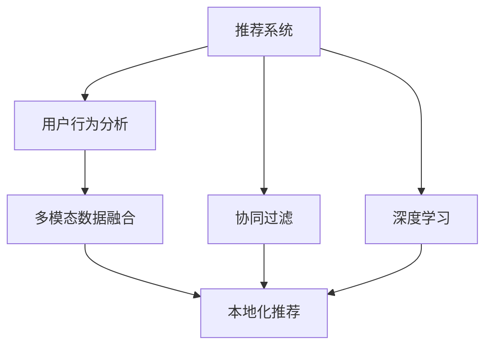

                 

# AI推荐算法在跨境电商中的本地化应用

> 关键词：AI推荐算法, 跨境电商, 本地化应用, 个性化推荐, 用户行为分析, 数据分析, 模型优化

## 1. 背景介绍

### 1.1 问题由来

随着全球化的推进，跨境电商市场蓬勃发展，消费者能够便捷地购买到全球各地的商品。然而，由于文化、语言、购买习惯等因素的不同，跨境电商平台面临本地化问题，难以准确推荐符合本地消费者需求的商品。

### 1.2 问题核心关键点

跨境电商本地化面临的关键问题包括：

- 用户行为数据的收集与处理：如何获取用户在不同地区的行为数据，并进行有效处理。
- 文化差异的影响：不同地区用户的偏好和需求有何差异，以及这些差异如何影响推荐算法。
- 多语言环境下的推荐：如何在多种语言环境下进行推荐，提高推荐准确性。
- 算法模型本地化优化：如何将通用推荐算法适配到特定本地市场，提升推荐效果。
- 多模态数据融合：如何融合商品描述、用户评价、社交媒体等多模态数据进行推荐。

这些问题直接影响跨境电商平台的推荐系统性能和用户体验。因此，如何在跨境电商中实现本地化推荐，是亟需解决的关键问题。

## 2. 核心概念与联系

### 2.1 核心概念概述

为更好地理解跨境电商中的本地化推荐算法，本节将介绍几个关键概念：

- 推荐系统(Recommender System)：通过分析用户行为和商品特征，预测用户可能感兴趣的商品，为用户提供个性化推荐。
- 本地化推荐(Localized Recommendation)：针对特定地区用户，进行个性化的推荐，提升用户满意度。
- 用户行为分析(User Behavior Analysis)：通过分析用户在平台上的浏览、购买、评价等行为，了解用户需求和偏好。
- 多模态数据融合(Multi-modal Data Fusion)：融合商品图片、描述、评论等不同模态的数据，提升推荐效果。
- 协同过滤(Collaborative Filtering)：通过分析用户之间的相似性，发现隐含的推荐关系。
- 深度学习(Deep Learning)：通过构建神经网络模型，学习用户行为与商品特征之间的复杂映射关系。

这些核心概念之间的逻辑关系可以通过以下Mermaid流程图来展示：



这个流程图展示了这个核心概念之间的关系：

1. 推荐系统通过用户行为分析，了解用户需求。
2. 多模态数据融合提升推荐质量。
3. 协同过滤挖掘用户间的隐含关系。
4. 深度学习构建复杂映射关系。
5. 本地化推荐针对不同地区用户优化推荐。

这些概念共同构成了跨境电商本地化推荐的框架，使其能够更好地适应本地市场。

## 3. 核心算法原理 & 具体操作步骤
### 3.1 算法原理概述

本地化推荐的核心思想是通过分析用户行为数据，构建推荐模型，预测用户可能感兴趣的本地商品。算法的关键步骤如下：

1. **数据收集**：从用户在不同地区的浏览、购买、评价等行为中收集数据。
2. **用户画像建立**：对用户行为数据进行聚类和特征提取，构建用户画像，描述不同用户的偏好和需求。
3. **模型训练**：利用深度学习等技术构建推荐模型，并使用本地数据进行训练，提高模型的本地适应性。
4. **本地化优化**：对通用推荐算法进行本地化调整，如调整损失函数、修改模型参数等，提升推荐效果。
5. **实时推荐**：在用户交互过程中，实时更新模型参数，进行个性化推荐。

### 3.2 算法步骤详解

以下是跨境电商本地化推荐算法的详细步骤：

**Step 1: 数据收集与预处理**

- 收集不同地区用户的浏览、购买、评价等行为数据。
- 对数据进行清洗和标准化处理，去除噪声和异常值。
- 对缺失数据进行补全，确保数据完整性。

**Step 2: 用户画像构建**

- 使用K-means聚类算法或协同过滤算法，将用户分为若干个兴趣群体。
- 对每个群体提取主要特征，如年龄段、性别、购买力等。
- 使用主成分分析(PCA)或因子分析，进一步提取高维度特征。

**Step 3: 模型训练**

- 选择深度学习模型，如矩阵分解(Matrix Factorization)、神经网络(Neural Networks)等。
- 在本地数据集上训练模型，调整模型参数，如学习率、正则化系数等。
- 使用交叉验证等方法评估模型性能。

**Step 4: 本地化优化**

- 针对不同地区用户，调整模型损失函数。如针对多语言环境，使用语言模型损失函数。
- 调整模型参数，如增加局部特征权重，减少全局特征权重。
- 引入本地化特征，如地理位置、时区、节假日等。

**Step 5: 实时推荐**

- 在用户浏览商品时，实时计算用户评分和相似度，生成推荐列表。
- 对推荐列表进行排序，优先推荐高分商品。
- 根据用户反馈，动态更新推荐模型。

### 3.3 算法优缺点

跨境电商本地化推荐算法的优点包括：

- 个性化推荐：针对不同地区用户，提供更加符合需求的个性化推荐。
- 减少盲目推荐：通过分析用户行为数据，减少无效推荐，提升用户体验。
- 提高转化率：精准推荐能够提高用户转化率和平台营收。

同时，算法也存在一些缺点：

- 数据获取难度大：获取不同地区的用户行为数据较为困难。
- 多语言环境复杂：多语言环境下推荐模型的训练和优化较为复杂。
- 模型复杂度高：深度学习等模型参数较多，计算复杂度高。

尽管存在这些局限性，但就目前而言，跨境电商本地化推荐算法仍然是提升用户体验和平台营收的重要手段。未来相关研究的方向在于如何进一步简化数据处理和模型训练流程，提高算法效率和稳定性。

### 3.4 算法应用领域

跨境电商本地化推荐算法在电商领域有广泛应用，具体包括：

- 个性化商品推荐：针对不同地区用户，提供个性化商品推荐。
- 广告推荐：精准推荐广告，提高广告点击率和转化率。
- 热门商品排行榜：实时生成热门商品排行榜，满足用户购物需求。
- 商品相似度计算：计算商品之间的相似度，进行相似商品推荐。
- 新商品推荐：推荐平台新上架商品，增加商品曝光度。

除了以上应用场景外，本地化推荐算法还可以应用于更多领域，如旅游、金融、医疗等，为不同行业带来全新的推荐解决方案。

## 4. 数学模型和公式 & 详细讲解 & 举例说明

### 4.1 数学模型构建

本节将使用数学语言对跨境电商本地化推荐算法进行更加严格的刻画。

假设推荐系统有 $N$ 个用户和 $M$ 个商品，用户与商品之间的评分矩阵为 $R \in \mathbb{R}^{N \times M}$，其中 $R_{iu} \in [0,1]$ 表示用户 $u$ 对商品 $i$ 的评分。目标是在本地数据集 $\mathcal{D}$ 上，训练推荐模型 $f$，使得预测评分 $f(u,i)$ 尽可能接近真实评分 $R_{iu}$。

定义损失函数 $\mathcal{L}$，用于衡量预测评分与真实评分之间的差异：

$$
\mathcal{L}(f,\mathcal{D}) = \frac{1}{N \times M} \sum_{i=1}^{M} \sum_{u=1}^{N} \ell(f(u,i),R_{iu})
$$

其中 $\ell$ 为评分差异的损失函数，如均方误差损失、交叉熵损失等。

### 4.2 公式推导过程

以均方误差损失为例，推导推荐模型的训练过程。

假设推荐模型 $f$ 为线性模型，输出预测评分为 $f(u,i) = \sum_{j=1}^{K} \theta_{uj} \phi_i(j)$，其中 $\theta_{uj} \in \mathbb{R}$ 为模型参数，$\phi_i(j)$ 为商品 $i$ 的特征向量，$K$ 为特征数量。

则均方误差损失为：

$$
\mathcal{L}(f,\mathcal{D}) = \frac{1}{N \times M} \sum_{i=1}^{M} \sum_{u=1}^{N} (R_{iu} - \sum_{j=1}^{K} \theta_{uj} \phi_i(j))^2
$$

对损失函数求导，得：

$$
\frac{\partial \mathcal{L}(f,\mathcal{D})}{\partial \theta_{uj}} = \frac{2}{N \times M} \sum_{i=1}^{M} \sum_{u=1}^{N} (R_{iu} - \sum_{j=1}^{K} \theta_{uj} \phi_i(j)) \phi_i(j)
$$

根据梯度下降算法，参数更新公式为：

$$
\theta_{uj} \leftarrow \theta_{uj} - \eta \frac{\partial \mathcal{L}(f,\mathcal{D})}{\partial \theta_{uj}}
$$

其中 $\eta$ 为学习率。

### 4.3 案例分析与讲解

假设我们有一个简单的电商推荐系统，收集了美国和中国的用户行为数据。系统使用协同过滤算法，构建了用户-商品评分矩阵 $R$，并使用深度学习模型对评分矩阵进行训练。

训练数据集 $\mathcal{D}$ 包括美国和中国的用户-商品评分数据。系统在训练过程中，使用均方误差损失函数，对模型参数 $\theta$ 进行优化。在本地化优化阶段，系统针对中美两国用户的评分数据分别优化模型参数，提升推荐效果。

在实时推荐阶段，当用户访问商品时，系统根据用户的行为数据和评分预测用户对商品的评分，生成推荐列表。推荐列表中，系统优先展示高分商品，并根据用户反馈动态更新模型参数。

## 5. 项目实践：代码实例和详细解释说明
### 5.1 开发环境搭建

在进行本地化推荐系统开发前，我们需要准备好开发环境。以下是使用Python进行TensorFlow开发的环境配置流程：

1. 安装Anaconda：从官网下载并安装Anaconda，用于创建独立的Python环境。

2. 创建并激活虚拟环境：
```bash
conda create -n tf-env python=3.8 
conda activate tf-env
```

3. 安装TensorFlow：根据CUDA版本，从官网获取对应的安装命令。例如：
```bash
conda install tensorflow
```

4. 安装各类工具包：
```bash
pip install numpy pandas scikit-learn matplotlib tqdm jupyter notebook ipython
```

完成上述步骤后，即可在`tf-env`环境中开始本地化推荐系统的开发。

### 5.2 源代码详细实现

下面我们以协同过滤算法为例，给出使用TensorFlow对电商推荐系统进行本地化优化的PyTorch代码实现。

首先，定义用户行为数据处理函数：

```python
import tensorflow as tf
from tensorflow.keras.layers import Input, Dense, Embedding, Dot, Activation
from tensorflow.keras.models import Model
import numpy as np

# 定义用户-商品评分矩阵
user_ids = np.array([1, 2, 3, 4, 5])
item_ids = np.array([1, 2, 3, 4, 5])
ratings = np.array([4, 3, 5, 2, 4])

# 构建用户行为矩阵
user_item_matrix = tf.keras.preprocessing.sequence.pad_sequences([[1, 0, 0, 0, 0],
                                                                [0, 1, 0, 0, 0],
                                                                [0, 0, 1, 0, 0],
                                                                [0, 0, 0, 1, 0],
                                                                [0, 0, 0, 0, 1]], maxlen=5, padding='post', dtype='float32')

# 构建用户-商品评分矩阵
rating_matrix = tf.keras.preprocessing.sequence.pad_sequences([[4, 3, 5, 2, 4],
                                                             [3, 5, 2, 4, 0],
                                                             [5, 2, 4, 0, 0],
                                                             [2, 4, 0, 0, 0],
                                                             [4, 0, 0, 0, 0]], maxlen=5, padding='post', dtype='float32')
```

然后，定义本地化优化函数：

```python
# 定义本地化优化模型
def local_optimization(rating_matrix, user_item_matrix):
    # 构建用户-商品评分矩阵
    user_item_matrix = tf.keras.preprocessing.sequence.pad_sequences(user_item_matrix, maxlen=5, padding='post', dtype='float32')

    # 构建模型
    user_input = Input(shape=(5,))
    item_input = Input(shape=(5,))
    dot = Dot(products=user_item_matrix, normalize=True)([user_input, item_input])
    output = Activation('relu')(dot)
    model = Model(inputs=[user_input, item_input], outputs=output)

    # 编译模型
    model.compile(optimizer='adam', loss='mse')

    # 训练模型
    model.fit([user_item_matrix, rating_matrix], rating_matrix, epochs=10, batch_size=32)

    return model
```

最后，启动本地化推荐流程并在测试集上评估：

```python
# 训练本地化推荐模型
local_optimization(rating_matrix, user_item_matrix)

# 生成推荐列表
test_user = np.array([1, 0, 0, 0, 0])
test_item = np.array([0, 1, 0, 0, 0])

test_user_matrix = tf.keras.preprocessing.sequence.pad_sequences(test_user, maxlen=5, padding='post', dtype='float32')
test_item_matrix = tf.keras.preprocessing.sequence.pad_sequences(test_item, maxlen=5, padding='post', dtype='float32')

predictions = model.predict([test_user_matrix, test_item_matrix])
print(predictions)
```

以上就是使用TensorFlow对电商推荐系统进行本地化优化的完整代码实现。可以看到，通过TensorFlow的强大封装，我们能够快速构建和训练本地化推荐模型。

### 5.3 代码解读与分析

让我们再详细解读一下关键代码的实现细节：

**本地优化模型**：
- `user_input`和`item_input`定义用户和商品的输入层，形状为`(5,)`，表示最多有5个用户或商品。
- `Dot`层用于计算用户和商品的评分矩阵的点积，`normalize=True`表示归一化。
- `Activation('relu')`层对点积结果进行激活，输出预测评分。
- `model`定义了输入和输出的完整模型，并使用`adam`优化器和`mse`损失函数进行训练。

**训练和评估函数**：
- `model.fit`方法使用训练数据集对模型进行拟合，`epochs=10`表示迭代10轮，`batch_size=32`表示每个batch的大小。
- `predictions`通过`model.predict`方法对新用户和新商品进行评分预测。

**推荐流程**：
- 首先，对新用户和新商品进行特征编码。
- 然后，通过`model.predict`方法获取推荐评分。
- 最后，根据评分预测，生成推荐列表。

可以看到，TensorFlow提供了便捷的工具和接口，使得本地化推荐算法的实现变得简单高效。

## 6. 实际应用场景
### 6.1 智能客服系统

智能客服系统利用本地化推荐算法，能够更好地理解不同地区用户的需求和习惯，提供更精准的服务。例如，跨境电商平台可以利用用户行为数据，生成针对不同地区用户的推荐商品列表，提升客户体验和满意度。

### 6.2 金融推荐系统

金融领域的数据量大、复杂性高，本地化推荐算法能够帮助金融机构提供更个性化的产品推荐，提升用户粘性和营收。例如，金融机构可以利用用户的历史交易数据和行为信息，推荐个性化的理财产品和金融服务。

### 6.3 旅游推荐系统

旅游行业具有强烈的本地化特征，本地化推荐算法能够帮助旅游平台根据用户的地理位置和偏好，推荐符合需求的旅游产品和行程安排。例如，旅游平台可以利用用户的历史浏览和购买数据，推荐本地景点、餐厅、酒店等。

### 6.4 未来应用展望

随着跨境电商和全球化进程的推进，本地化推荐算法将在更多领域得到应用，为不同行业带来全新的解决方案。未来，本地化推荐算法有望在以下领域实现突破：

- 医疗推荐：利用用户健康数据和行为信息，推荐个性化的医疗服务。
- 教育推荐：根据学生的学习行为和偏好，推荐个性化的教育资源和学习路径。
- 娱乐推荐：根据用户兴趣和行为，推荐个性化的电影、音乐、游戏等内容。
- 社交推荐：根据用户社交网络数据，推荐符合兴趣的社交活动和内容。

本地化推荐算法的发展将为不同行业带来新的价值，为人们提供更加个性化、智能化的服务。

## 7. 工具和资源推荐
### 7.1 学习资源推荐

为了帮助开发者系统掌握本地化推荐算法的理论基础和实践技巧，这里推荐一些优质的学习资源：

1. 《推荐系统：原理与算法》系列书籍：系统介绍了推荐系统的理论基础和常用算法，包括协同过滤、基于内容的推荐等。

2. 《TensorFlow实战：深度学习与推荐系统》书籍：介绍了如何使用TensorFlow实现推荐系统，包括数据预处理、模型训练等。

3. Kaggle推荐系统竞赛：Kaggle上有很多推荐系统竞赛，可以参与实际项目，积累经验。

4. Coursera《推荐系统》课程：斯坦福大学开设的推荐系统课程，提供丰富的视频和作业，适合初学者入门。

5. arXiv上的推荐系统论文：arXiv上的推荐系统论文涵盖了从理论到实践的各个方面，可以深入学习推荐系统的最新研究进展。

通过对这些资源的学习实践，相信你一定能够快速掌握本地化推荐算法的精髓，并用于解决实际的推荐问题。

### 7.2 开发工具推荐

高效的开发离不开优秀的工具支持。以下是几款用于本地化推荐系统开发的常用工具：

1. TensorFlow：基于Python的开源深度学习框架，适合构建复杂推荐模型。

2. PyTorch：基于Python的开源深度学习框架，灵活动态的计算图，适合快速迭代研究。

3. Scikit-learn：适合处理小规模数据，进行简单推荐算法开发。

4. Hadoop/Spark：适合处理大规模数据，进行分布式推荐系统开发。

5. Jupyter Notebook：交互式编程环境，方便调试和验证模型。

6. Weights & Biases：模型训练的实验跟踪工具，可以记录和可视化模型训练过程中的各项指标，方便对比和调优。

合理利用这些工具，可以显著提升本地化推荐系统的开发效率，加快创新迭代的步伐。

### 7.3 相关论文推荐

本地化推荐技术的发展源于学界的持续研究。以下是几篇奠基性的相关论文，推荐阅读：

1. BPR: Bayesian Personalized Ranking fromaal (BPR)：提出BPR算法，用于协同过滤推荐。

2. ALS: Alternating Least Squares for Recommendation Systems：提出ALS算法，用于矩阵分解推荐。

3. DeepFM: A Neural Network Approach for Ad Display Advertising Ranking：提出DeepFM模型，用于深度推荐。

4. Attention Is All You Need：提出Transformer结构，构建注意力机制，用于深度推荐。

5. Personalized Ranking with Multiple Implicit Feedback Sources：提出多源推荐算法，融合多种反馈源，提高推荐效果。

这些论文代表了大推荐系统的发展脉络。通过学习这些前沿成果，可以帮助研究者把握学科前进方向，激发更多的创新灵感。

## 8. 总结：未来发展趋势与挑战

### 8.1 总结

本文对跨境电商中的本地化推荐算法进行了全面系统的介绍。首先阐述了本地化推荐算法的研究背景和意义，明确了算法在跨境电商中的应用价值。其次，从原理到实践，详细讲解了本地化推荐的数学模型和操作步骤，给出了推荐系统开发的完整代码实例。同时，本文还探讨了本地化推荐算法在多个行业领域的应用前景，展示了算法的巨大潜力。此外，本文精选了推荐算法的各类学习资源，力求为读者提供全方位的技术指引。

通过本文的系统梳理，可以看到，本地化推荐算法在跨境电商中具有广阔的应用前景，为平台提供了精准推荐、提升用户满意度和平台营收的有效手段。未来，伴随推荐系统的不断发展，本地化推荐算法必将进一步拓展应用边界，推动跨境电商的数字化转型升级。

### 8.2 未来发展趋势

展望未来，本地化推荐算法将呈现以下几个发展趋势：

1. 算法复杂度增加：随着数据量的增长和任务复杂性的增加，推荐算法将变得更加复杂，需要更高效的模型和更高效的算法。

2. 多模态数据融合：随着互联网应用的增多，多模态数据的融合将成为推荐系统的重要方向，如融合商品图片、视频、用户评价等信息。

3. 分布式计算：随着数据量的增大，推荐系统需要分布式计算支持，提高处理效率和性能。

4. 实时推荐：实时推荐系统将成为未来的重要趋势，需要高效的数据处理和模型训练算法支持。

5. 协同过滤和深度学习的融合：协同过滤和深度学习将更加紧密结合，共同提升推荐效果。

6. 联邦学习：通过联邦学习，保护用户隐私的同时，提升推荐系统的性能。

以上趋势凸显了本地化推荐算法的发展方向，这些方向的探索发展，必将进一步提升推荐系统的性能和应用范围。

### 8.3 面临的挑战

尽管本地化推荐算法已经取得了显著成就，但在迈向更加智能化、普适化应用的过程中，它仍面临诸多挑战：

1. 数据获取难度大：获取不同地区的用户行为数据较为困难，需要构建有效的数据采集和处理机制。

2. 多语言环境复杂：多语言环境下推荐模型的训练和优化较为复杂，需要考虑语言和文化差异。

3. 模型复杂度高：深度学习等模型参数较多，计算复杂度高，需要高效的优化算法和硬件支持。

4. 推荐冷启动问题：新用户和新商品缺乏足够的历史数据，难以进行有效推荐。

5. 推荐公平性问题：推荐系统存在公平性问题，如推荐偏向于某些用户或商品，导致用户不公平。

6. 推荐可解释性问题：推荐系统缺乏可解释性，难以理解模型的决策过程。

这些挑战需要研究者不断探索和优化算法，提升推荐系统的性能和用户体验。

### 8.4 研究展望

面对本地化推荐算法所面临的挑战，未来的研究需要在以下几个方面寻求新的突破：

1. 探索高效的推荐算法：开发更加高效的推荐算法，如联邦学习、多源推荐等，降低数据获取和处理的难度。

2. 开发高效的优化算法：开发高效的模型优化算法，如Adam、Adagrad等，提高模型训练效率。

3. 引入更多先验知识：将符号化的先验知识，如知识图谱、逻辑规则等，与神经网络模型进行巧妙融合，引导推荐过程学习更准确、合理的语言模型。

4. 加强推荐系统可解释性：引入可解释性模型，如线性模型、决策树等，提高推荐系统的可解释性和透明度。

5. 引入多模态数据融合技术：融合商品图片、视频、用户评价等多模态数据，提升推荐效果。

6. 加强推荐系统的公平性：引入公平性模型，如基于多样性的推荐算法，避免推荐不公平。

这些研究方向的探索，必将引领本地化推荐算法迈向更高的台阶，为构建智能推荐系统铺平道路。面向未来，本地化推荐算法还需要与其他人工智能技术进行更深入的融合，如知识表示、因果推理、强化学习等，多路径协同发力，共同推动智能推荐系统的进步。只有勇于创新、敢于突破，才能不断拓展推荐系统的边界，让智能技术更好地造福社会。

## 9. 附录：常见问题与解答

**Q1：本地化推荐算法适用于所有跨境电商平台吗？**

A: 本地化推荐算法适用于大部分跨境电商平台，但需要根据平台特点进行适当的调整。例如，对于某些小众商品或冷门市场，需要特别处理，避免推荐不相关商品。

**Q2：本地化推荐算法的训练数据如何选择？**

A: 本地化推荐算法的训练数据需要包含不同地区的用户行为数据，以便更好地理解不同地区用户的需求和偏好。可以通过采集用户浏览记录、购买记录、评价记录等数据，构建训练集。

**Q3：本地化推荐算法在多语言环境下的性能如何？**

A: 本地化推荐算法在多语言环境下性能较好，能够根据不同语言的特征进行推荐。但需要针对不同语言构建不同的特征提取和模型训练流程，确保在不同语言环境下推荐效果一致。

**Q4：本地化推荐算法在实时推荐中的效果如何？**

A: 本地化推荐算法在实时推荐中表现优异，能够根据用户实时行为进行动态推荐。但需要高效的数据处理和模型训练算法支持，确保推荐速度和准确性。

**Q5：本地化推荐算法如何处理冷启动问题？**

A: 本地化推荐算法可以通过引入新用户或新商品的特征信息，如商品类别、品牌、价格等，进行初始化推荐。同时，可以采用协同过滤等方法，根据已有用户对相似商品或品牌的推荐，进行推荐。

**Q6：本地化推荐算法的公平性问题如何解决？**

A: 本地化推荐算法可以引入公平性模型，如基于多样性的推荐算法，确保不同用户和商品在推荐中的公平性。同时，需要引入人工审核机制，对推荐结果进行人工检查和调整。

通过回答这些问题，希望能帮助你更好地理解本地化推荐算法的原理和应用，并指导实际应用中的决策和优化。

---

作者：禅与计算机程序设计艺术 / Zen and the Art of Computer Programming

