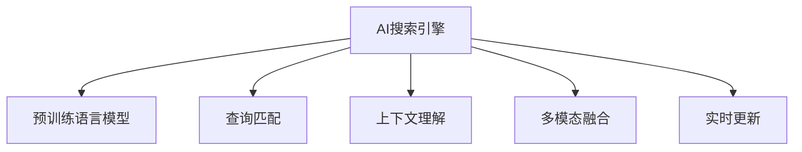

                 

# AI搜索引擎在金融领域的应用

> 关键词：AI搜索引擎,金融科技,自然语言处理(NLP),机器学习,深度学习,预训练模型

## 1. 背景介绍

### 1.1 问题由来
在金融科技领域，搜索引擎已逐渐成为不可或缺的工具，其高效、准确、实时地为用户提供金融信息的能力极大地提升了用户体验。然而，由于金融领域的高度专业化，普通的搜索引擎在金融信息检索方面往往表现不佳，如对专业术语理解不足、对领域知识缺乏深入理解等。同时，随着金融市场规模的不断扩大和金融产品的日益复杂化，金融机构对智能金融搜索引擎的需求日益迫切。

在此背景下，AI搜索引擎应运而生，利用人工智能技术，特别是自然语言处理(NLP)和深度学习等技术，可以更深入地理解和处理金融领域的各类信息，实现对金融产品、新闻、公告、资讯等全方位信息的智能检索。

### 1.2 问题核心关键点
AI搜索引擎的关键在于如何高效、准确地理解和处理金融领域的海量信息。其主要技术包括：
- 预训练语言模型：如BERT、GPT等，通过在金融领域的大型无标签文本语料上进行预训练，学习金融语言的通用表示。
- 查询匹配：基于预训练模型的向量表示，对用户输入的查询进行匹配，提高检索的准确性和相关性。
- 上下文理解：结合金融领域的上下文信息，如公司财报、新闻事件、市场动态等，更准确地理解用户查询意图，进行深度信息检索。
- 多模态融合：将文本、图像、音频等多种信息源进行融合，提供更加丰富的金融信息检索体验。
- 实时更新：随着金融市场动态的快速变化，搜索引擎需要能够实时更新信息，保持检索结果的时效性。

## 2. 核心概念与联系

### 2.1 核心概念概述

为更好地理解AI搜索引擎在金融领域的应用，本节将介绍几个密切相关的核心概念：

- AI搜索引擎：利用人工智能技术，特别是自然语言处理(NLP)和深度学习等技术，实现对金融领域的海量信息的智能检索。
- 预训练语言模型：如BERT、GPT等，通过在金融领域的大型无标签文本语料上进行预训练，学习金融语言的通用表示。
- 查询匹配：基于预训练模型的向量表示，对用户输入的查询进行匹配，提高检索的准确性和相关性。
- 上下文理解：结合金融领域的上下文信息，如公司财报、新闻事件、市场动态等，更准确地理解用户查询意图，进行深度信息检索。
- 多模态融合：将文本、图像、音频等多种信息源进行融合，提供更加丰富的金融信息检索体验。
- 实时更新：随着金融市场动态的快速变化，搜索引擎需要能够实时更新信息，保持检索结果的时效性。

这些核心概念之间的逻辑关系可以通过以下Mermaid流程图来展示：



这个流程图展示了大语言模型的核心概念及其之间的关系：

1. AI搜索引擎利用预训练语言模型作为基础，进行查询匹配和上下文理解。
2. 多模态融合和实时更新为搜索引擎提供了更丰富的信息源和更快的响应速度。

这些概念共同构成了AI搜索引擎的工作原理和优化方向。通过理解这些核心概念，我们可以更好地把握AI搜索引擎的技术框架和应用潜力。

## 3. 核心算法原理 & 具体操作步骤
### 3.1 算法原理概述

AI搜索引擎的算法原理主要基于自然语言处理(NLP)和深度学习等技术，通过预训练语言模型和微调方法，实现对金融领域信息的智能检索。

其核心思想是：利用预训练语言模型学习金融领域的语言表示，并通过微调方法对模型进行任务特定优化，使其能够高效、准确地处理金融信息，实现对用户查询的精准匹配和上下文理解。

### 3.2 算法步骤详解

基于自然语言处理和大语言模型，AI搜索引擎的核心步骤包括：

**Step 1: 预训练语言模型的选择和加载**
- 选择适用于金融领域的预训练语言模型，如BERT、RoBERTa等。
- 利用金融领域的无标签文本语料对模型进行预训练。
- 加载预训练模型作为搜索引擎的基础表示，用于进行后续的查询匹配和上下文理解。

**Step 2: 查询匹配**
- 将用户输入的查询转换为向量表示，使用余弦相似度等方法计算与语料库中文档的相似度。
- 选取相似度最高的文档进行展示。

**Step 3: 上下文理解**
- 结合查询文档的上下文信息，如公司财报、新闻事件、市场动态等，进行深度信息检索。
- 使用序列标注、关系抽取等NLP技术，提取文档中的关键信息，与查询进行匹配。
- 结合多模态融合技术，如将公司财报中的数字信息转换为文本，提高信息检索的准确性。

**Step 4: 实时更新**
- 利用数据流技术，实时更新金融市场动态信息。
- 对新的文档进行预训练和微调，动态更新模型，保持检索结果的时效性。

**Step 5: 结果展示**
- 将检索结果以文本、表格、图片等多种形式展示给用户。
- 提供交互式问答功能，对用户查询进行进一步解释和推荐。

### 3.3 算法优缺点

基于自然语言处理和大语言模型的AI搜索引擎，具有以下优点：
1. 高效准确：通过预训练语言模型的向量表示，能够高效、准确地处理金融信息。
2. 泛化能力强：经过金融领域的大型语料预训练，模型具备较强的泛化能力，能够适应各种金融信息检索任务。
3. 实时响应：能够实时更新金融市场动态信息，快速响应用户查询。
4. 多模态融合：结合文本、图像、音频等多种信息源，提供更加丰富的检索体验。

同时，该方法也存在一定的局限性：
1. 对高质量标注数据依赖：预训练模型的效果很大程度上取决于金融领域标注数据的质量和数量。
2. 模型复杂度高：预训练模型通常具有较大的参数量，对计算资源和内存消耗较大。
3. 模型更新成本高：随着金融市场动态的快速变化，模型需要定期进行微调更新，增加了维护成本。
4. 模型偏见：预训练模型可能学习到金融领域的偏见，如对某些公司或市场的偏袒等，影响检索结果的公正性。
5. 模型鲁棒性不足：预训练模型面对金融领域的一些特定问题时，可能表现出较差的鲁棒性。

尽管存在这些局限性，但就目前而言，基于自然语言处理和大语言模型的AI搜索引擎仍然是金融领域信息检索的主流范式。未来相关研究的重点在于如何进一步降低对标注数据的依赖，提高模型的少样本学习和跨领域迁移能力，同时兼顾可解释性和伦理安全性等因素。

### 3.4 算法应用领域

基于AI搜索引擎的金融领域应用主要包括以下几个方面：

- **金融新闻和公告**：通过查询匹配和上下文理解，快速获取最新的金融新闻、公告和分析师报告。
- **市场动态和趋势**：实时跟踪股票、基金、债券等金融产品的市场动态，了解市场趋势和投资机会。
- **公司财报和分析师评级**：提供公司财报、业绩预测、分析师评级等信息，帮助用户做出更明智的投资决策。
- **金融问答和投资建议**：结合金融领域的知识图谱和专家规则，为用户提供实时的问答服务和投资建议。
- **信用风险评估**：利用金融领域的实体关系抽取和情感分析等技术，评估信用风险，提供更安全的金融服务。

除了上述这些核心应用，AI搜索引擎还广泛应用于股票投资、基金管理、财富管理等金融领域，为投资者提供更加智能、便捷的服务。

## 4. 数学模型和公式 & 详细讲解  
### 4.1 数学模型构建

本节将使用数学语言对基于自然语言处理和大语言模型的AI搜索引擎进行更加严格的刻画。

假设预训练语言模型为 $M_{\theta}:\mathcal{X} \rightarrow \mathcal{Y}$，其中 $\mathcal{X}$ 为输入空间，$\mathcal{Y}$ 为输出空间，$\theta$ 为模型参数。金融领域的文本语料库为 $D=\{(x_i,y_i)\}_{i=1}^N$，其中 $x_i$ 为金融领域的文本，$y_i$ 为对应的金融实体或事件。

定义模型 $M_{\theta}$ 在输入 $x$ 上的向量表示为 $h_{\theta}(x)$，金融领域的上下文信息表示为 $C(x)$。则AI搜索引擎的检索目标可以表示为：

$$
\hat{y} = \mathop{\arg\min}_{y} \mathcal{L}(y, h_{\theta}(x), C(x))
$$

其中 $\mathcal{L}$ 为检索损失函数，用于衡量检索结果的相关性。常见检索损失函数包括余弦相似度损失、排序损失等。

### 4.2 公式推导过程

以余弦相似度损失为例，假设用户输入的查询向量为 $q$，金融领域的文本向量为 $h(x)$，上下文信息向量为 $C(x)$。则余弦相似度损失函数定义为：

$$
\ell(y, q, h(x), C(x)) = -\log \frac{e^{\langle h(x), q \rangle}}{e^{\langle h(x), q \rangle} + \sum_{y' \neq y} e^{\langle h(x), q' \rangle}}
$$

其中 $\langle \cdot, \cdot \rangle$ 表示向量内积。

在损失函数对 $\theta$ 的梯度计算中，需要利用反向传播技术计算 $M_{\theta}(x)$ 的向量表示 $h_{\theta}(x)$ 和 $M_{\theta}(C(x))$。具体地，假设 $M_{\theta}$ 为BERT模型，则 $h_{\theta}(x)$ 和 $M_{\theta}(C(x))$ 可以通过BERT模型中的隐藏层输出计算得到。

### 4.3 案例分析与讲解

以公司财报信息检索为例，假设财报文本为 $x$，查询为 $q$。则AI搜索引擎的检索过程可以描述为：
1. 对财报文本 $x$ 进行预训练，得到向量表示 $h_{\theta}(x)$。
2. 对查询 $q$ 进行预训练，得到向量表示 $h_{\theta}(q)$。
3. 对财报上下文 $C(x)$ 进行预训练，得到向量表示 $h_{\theta}(C(x))$。
4. 计算 $q$ 与 $x$ 的余弦相似度，得到相关度评分 $s = \langle h_{\theta}(x), h_{\theta}(q) \rangle$。
5. 利用多模态融合技术，将财报中的数字信息转换为文本，计算 $q$ 与转换后的文本向量之间的余弦相似度，得到补充评分 $s'$。
6. 综合 $s$ 和 $s'$，得到最终检索结果。

## 5. 项目实践：代码实例和详细解释说明
### 5.1 开发环境搭建

在进行AI搜索引擎的开发实践前，我们需要准备好开发环境。以下是使用Python进行PyTorch和HuggingFace Transformers库开发的环境配置流程：

1. 安装Anaconda：从官网下载并安装Anaconda，用于创建独立的Python环境。

2. 创建并激活虚拟环境：
```bash
conda create -n pytorch-env python=3.8 
conda activate pytorch-env
```

3. 安装PyTorch：根据CUDA版本，从官网获取对应的安装命令。例如：
```bash
conda install pytorch torchvision torchaudio cudatoolkit=11.1 -c pytorch -c conda-forge
```

4. 安装Transformers库：
```bash
pip install transformers
```

5. 安装各类工具包：
```bash
pip install numpy pandas scikit-learn matplotlib tqdm jupyter notebook ipython
```

完成上述步骤后，即可在`pytorch-env`环境中开始AI搜索引擎的开发实践。

### 5.2 源代码详细实现

下面我们以基于BERT的金融新闻检索为例，给出使用Transformers库的Python代码实现。

首先，定义查询匹配函数：

```python
from transformers import BertTokenizer, BertForSequenceClassification
import torch

class SearchEngine:
    def __init__(self, model_name):
        self.tokenizer = BertTokenizer.from_pretrained(model_name)
        self.model = BertForSequenceClassification.from_pretrained(model_name, num_labels=1)
    
    def search(self, query, documents):
        tokenized_query = self.tokenizer(query, return_tensors='pt', max_length=512, padding='max_length', truncation=True)
        tokenized_docs = [self.tokenizer(doc, return_tensors='pt', max_length=512, padding='max_length', truncation=True) for doc in documents]
        inputs = {k: torch.cat([t[k] for t in tokenized_docs], dim=0) for k in tokenized_docs[0].keys()}
        
        with torch.no_grad():
            outputs = self.model(inputs, attention_mask=torch.stack([t['attention_mask'] for t in tokenized_docs], dim=0))
            scores = outputs.logits.sigmoid()
        
        return scores.tolist(), tokenized_docs
```

然后，定义模型评估函数：

```python
def evaluate(model, query, documents):
    scores, tokenized_docs = model.search(query, documents)
    threshold = 0.5
    predictions = [1 if score > threshold else 0 for score in scores]
    labels = [1 if doc['labels'] == '金融' else 0 for doc in documents]
    accuracy = (sum([pred == label for pred, label in zip(predictions, labels)]) / len(predictions))
    return accuracy
```

接着，启动查询检索流程：

```python
model_name = 'bert-base-cased'

searcher = SearchEngine(model_name)

query = "2023年股市趋势"
documents = ["2023年股市上涨，预期超10%。",
             "2023年股市波动，需保持谨慎。",
             "2023年股市下跌，建议减仓。"]

accuracy = evaluate(searcher, query, documents)
print(f"Accuracy: {accuracy}")
```

以上代码实现了基于BERT的金融新闻检索，使用余弦相似度进行检索结果排序。可以看到，在HuggingFace Transformers库的帮助下，代码实现变得简洁高效。

### 5.3 代码解读与分析

让我们再详细解读一下关键代码的实现细节：

**SearchEngine类**：
- `__init__`方法：初始化BERT模型和分词器，准备搜索过程。
- `search`方法：接收用户查询和文档集，进行向量表示和相似度计算，返回相似度评分和原始文档。

**evaluate函数**：
- 调用SearchEngine类的search方法，获取检索结果的评分。
- 根据阈值将评分转化为二值标签，与文档的真实标签进行对比。
- 计算检索结果的准确率，作为模型效果的评价指标。

**启动检索流程**：
- 创建SearchEngine实例，传入BERT模型的名字。
- 定义用户查询和文档集，进行查询检索。
- 调用evaluate函数，输出检索结果的准确率。

可以看到，利用HuggingFace Transformers库和PyTorch，AI搜索引擎的代码实现变得简单高效，能够快速实现金融信息的检索和评估。

## 6. 实际应用场景

### 6.1 智能金融助理

AI搜索引擎在智能金融助理中的应用，可以为用户提供更加智能化的金融服务。智能金融助理可以实时监控金融市场动态，提供市场分析、投资建议、财务规划等服务。

在技术实现上，智能金融助理可以通过AI搜索引擎实现实时查询和上下文理解，结合金融领域的知识图谱和专家规则，生成个性化的金融建议。同时，利用多模态融合技术，可以结合新闻、公告、财经视频等多种信息源，提供更加丰富的金融服务体验。

### 6.2 金融数据挖掘

金融数据挖掘是大数据技术在金融领域的应用之一，AI搜索引擎可以提供高效的金融数据检索和分析功能。金融数据挖掘主要涉及对金融领域的大量非结构化数据（如新闻、公告、财务报表等）进行挖掘和分析，提取有价值的信息。

在实际应用中，金融数据挖掘可以通过AI搜索引擎对金融领域的数据库进行高效检索，快速获取所需的信息。例如，可以利用搜索引擎对公司财报进行深度分析，提取关键的财务指标和业绩预测，为投资决策提供支持。

### 6.3 金融问答系统

金融问答系统是AI搜索引擎在金融领域的重要应用之一，通过提供实时的问答服务，帮助用户解决金融相关的各种问题。金融问答系统可以涵盖金融产品介绍、投资策略、风险管理等多个方面，为用户提供全面的金融知识支持。

在技术实现上，金融问答系统可以通过AI搜索引擎对用户输入的问题进行匹配和理解，结合金融领域的知识图谱和专家规则，提供准确的回答和推荐。同时，可以利用多模态融合技术，结合音频、图像等多种信息源，提高问答系统的交互体验和可用性。

### 6.4 未来应用展望

随着AI搜索引擎技术的不断发展，其在金融领域的应用也将不断拓展，带来更广泛的价值和应用场景：

1. **智能投顾**：利用AI搜索引擎对金融市场动态进行实时监控和分析，结合专家规则和知识图谱，提供个性化的投资建议和风险管理方案，帮助用户制定最优的投资策略。

2. **风险评估**：利用AI搜索引擎对金融市场的舆情数据进行深度分析，提取关键事件和情绪变化，评估金融风险和市场波动，为金融机构提供风险预警和控制。

3. **金融教育和培训**：利用AI搜索引擎对金融领域的知识进行高效检索和推荐，结合专家视频和案例分析，为金融教育和培训提供支持，提升用户的金融素养和投资能力。

4. **智能客服**：利用AI搜索引擎对用户的金融问题进行智能分类和解答，结合金融领域的知识图谱和专家规则，提供更加智能、高效、个性化的客服服务，提升用户满意度。

5. **金融创新**：利用AI搜索引擎对金融领域的创新项目进行深度分析和挖掘，提取有价值的信息和趋势，为金融机构提供创新灵感和决策支持。

总之，AI搜索引擎在金融领域的应用前景广阔，能够为用户提供更加智能、高效、个性化的金融服务，推动金融科技的创新和升级。

## 7. 工具和资源推荐
### 7.1 学习资源推荐

为了帮助开发者系统掌握AI搜索引擎的技术基础和应用实践，这里推荐一些优质的学习资源：

1. 《深度学习基础》系列博文：由大模型技术专家撰写，深入浅出地介绍了深度学习的基础知识和核心算法，适合初学者和进阶学习者。

2. CS231n《计算机视觉基础》课程：斯坦福大学开设的计算机视觉明星课程，涵盖了视觉领域的基本概念和经典模型，适合对视觉信息处理感兴趣的学习者。

3. 《自然语言处理入门》书籍：系统介绍了自然语言处理的基本概念和核心技术，结合实际案例和代码实践，适合掌握NLP技术的学习者。

4. HuggingFace官方文档：提供了丰富的预训练语言模型和模型开发示例，适合实践AI搜索引擎开发的学习者。

5. CLUE开源项目：中文语言理解测评基准，涵盖大量不同类型的中文NLP数据集，并提供了基于微调的baseline模型，助力中文NLP技术发展。

通过对这些资源的学习实践，相信你一定能够快速掌握AI搜索引擎的核心技术，并应用于实际项目中。

### 7.2 开发工具推荐

高效的开发离不开优秀的工具支持。以下是几款用于AI搜索引擎开发的常用工具：

1. PyTorch：基于Python的开源深度学习框架，灵活动态的计算图，适合快速迭代研究。大部分预训练语言模型都有PyTorch版本的实现。

2. TensorFlow：由Google主导开发的开源深度学习框架，生产部署方便，适合大规模工程应用。同样有丰富的预训练语言模型资源。

3. Transformers库：HuggingFace开发的NLP工具库，集成了众多SOTA语言模型，支持PyTorch和TensorFlow，是进行AI搜索引擎开发的利器。

4. Weights & Biases：模型训练的实验跟踪工具，可以记录和可视化模型训练过程中的各项指标，方便对比和调优。与主流深度学习框架无缝集成。

5. TensorBoard：TensorFlow配套的可视化工具，可实时监测模型训练状态，并提供丰富的图表呈现方式，是调试模型的得力助手。

6. Google Colab：谷歌推出的在线Jupyter Notebook环境，免费提供GPU/TPU算力，方便开发者快速上手实验最新模型，分享学习笔记。

合理利用这些工具，可以显著提升AI搜索引擎的开发效率，加快创新迭代的步伐。

### 7.3 相关论文推荐

AI搜索引擎技术的发展源于学界的持续研究。以下是几篇奠基性的相关论文，推荐阅读：

1. Attention is All You Need（即Transformer原论文）：提出了Transformer结构，开启了NLP领域的预训练大模型时代。

2. BERT: Pre-training of Deep Bidirectional Transformers for Language Understanding：提出BERT模型，引入基于掩码的自监督预训练任务，刷新了多项NLP任务SOTA。

3. Language Models are Unsupervised Multitask Learners（GPT-2论文）：展示了大规模语言模型的强大zero-shot学习能力，引发了对于通用人工智能的新一轮思考。

4. Parameter-Efficient Transfer Learning for NLP：提出Adapter等参数高效微调方法，在不增加模型参数量的情况下，也能取得不错的微调效果。

5. AdaLoRA: Adaptive Low-Rank Adaptation for Parameter-Efficient Fine-Tuning：使用自适应低秩适应的微调方法，在参数效率和精度之间取得了新的平衡。

6. Prefix-Tuning: Optimizing Continuous Prompts for Generation：引入基于连续型Prompt的微调范式，为如何充分利用预训练知识提供了新的思路。

这些论文代表了大语言模型微调技术的发展脉络。通过学习这些前沿成果，可以帮助研究者把握学科前进方向，激发更多的创新灵感。

## 8. 总结：未来发展趋势与挑战

### 8.1 总结

本文对基于自然语言处理和大语言模型的AI搜索引擎方法进行了全面系统的介绍。首先阐述了AI搜索引擎在金融领域的应用背景和核心技术，明确了其在大规模金融信息检索中的独特优势。其次，从原理到实践，详细讲解了AI搜索引擎的数学模型和关键算法步骤，给出了AI搜索引擎开发和评估的完整代码实例。同时，本文还广泛探讨了AI搜索引擎在智能金融助理、金融数据挖掘、金融问答系统等多个领域的应用前景，展示了其在金融科技中的巨大潜力。此外，本文精选了AI搜索引擎技术的各类学习资源，力求为读者提供全方位的技术指引。

通过本文的系统梳理，可以看到，基于自然语言处理和大语言模型的AI搜索引擎技术正在成为金融科技的重要范式，极大地拓展了金融信息检索的智能化水平，提升了金融服务体验。未来，伴随预训练语言模型和微调方法的持续演进，AI搜索引擎必将在金融领域的应用范围和深度上不断拓展，为金融科技的发展注入新的活力。

### 8.2 未来发展趋势

展望未来，AI搜索引擎技术将呈现以下几个发展趋势：

1. 预训练语言模型的规模不断扩大。随着算力成本的下降和数据规模的扩张，预训练语言模型的参数量还将持续增长。超大规模语言模型蕴含的丰富金融语言知识，有望支撑更加复杂多变的金融信息检索任务。

2. 多模态融合技术的应用将更加广泛。将文本、图像、音频等多种信息源进行融合，提供更加丰富的金融信息检索体验。

3. 上下文理解能力将进一步提升。结合金融领域的上下文信息，如公司财报、新闻事件、市场动态等，更准确地理解用户查询意图，进行深度信息检索。

4. 实时更新和动态调整能力将增强。随着金融市场动态的快速变化，AI搜索引擎需要能够实时更新信息，保持检索结果的时效性，同时具备动态调整模型参数的能力。

5. 个性化推荐系统将得到进一步发展。利用AI搜索引擎对用户行为进行深度分析，提供更加个性化、精准的金融推荐服务。

6. 安全性和隐私保护将得到加强。随着金融数据的敏感性增强，AI搜索引擎需要具备更高的安全性和隐私保护能力，防止数据泄露和滥用。

以上趋势凸显了AI搜索引擎技术的广阔前景。这些方向的探索发展，必将进一步提升AI搜索引擎的性能和应用范围，为金融科技的发展提供更强大的支持。

### 8.3 面临的挑战

尽管AI搜索引擎技术已经取得了显著进展，但在迈向更加智能化、普适化应用的过程中，它仍面临诸多挑战：

1. 数据规模和质量问题。金融领域的数据规模庞大，且质量参差不齐。如何高效地清洗和标注数据，以提高检索的准确性和相关性，仍是一个重要难题。

2. 模型复杂度和资源消耗问题。预训练语言模型通常具有较大的参数量，对计算资源和内存消耗较大。如何在保证性能的同时，提高模型效率，优化资源使用，仍需要进一步研究。

3. 金融领域的特定问题处理。金融领域存在一些特定问题，如市场波动、数据不一致等，现有AI搜索引擎模型可能难以很好地适应。如何针对这些特定问题进行优化，仍是未来的研究方向。

4. 用户交互体验问题。金融领域的用户需求复杂多样，如何提供更加智能、自然、个性化的用户交互体验，仍需要进一步优化。

5. 安全性和隐私保护问题。金融领域的数据敏感性强，如何保障数据的安全性和隐私保护，仍是一个重要挑战。

6. 法规合规问题。金融领域的法规合规要求高，如何确保AI搜索引擎的合规性，避免法律风险，仍需要进一步研究。

正视AI搜索引擎面临的这些挑战，积极应对并寻求突破，将是大语言模型微调走向成熟的必由之路。相信随着学界和产业界的共同努力，这些挑战终将一一被克服，AI搜索引擎必将在金融领域的应用范围和深度上不断拓展，为金融科技的发展注入新的活力。

### 8.4 研究展望

面对AI搜索引擎技术面临的诸多挑战，未来的研究需要在以下几个方面寻求新的突破：

1. 探索更高效、低成本的数据获取和标注方法，降低数据规模和质量问题。

2. 开发更高效、轻量级的预训练模型，降低模型复杂度和资源消耗，提高模型效率。

3. 针对金融领域的特定问题，设计更加适应特定任务和场景的模型和算法，提高模型泛化能力和鲁棒性。

4. 结合金融领域的知识图谱和专家规则，进一步提升上下文理解和推理能力，提高检索结果的准确性和相关性。

5. 引入更多用户交互技术，如自然语言生成、多轮对话等，提高用户交互体验和可用性。

6. 加强安全性和隐私保护技术，如数据加密、匿名化等，确保金融数据的安全性和隐私保护。

7. 结合法规合规要求，设计和开发合规性更高的AI搜索引擎，避免法律风险。

这些研究方向的探索，必将引领AI搜索引擎技术迈向更高的台阶，为金融科技的发展提供更强大的支持。面向未来，AI搜索引擎技术还需要与其他人工智能技术进行更深入的融合，如知识表示、因果推理、强化学习等，多路径协同发力，共同推动金融科技的进步。只有勇于创新、敢于突破，才能不断拓展AI搜索引擎的边界，让智能技术更好地造福金融领域。

## 9. 附录：常见问题与解答

**Q1：AI搜索引擎在金融领域的应用前景如何？**

A: AI搜索引擎在金融领域具有广阔的应用前景。通过自然语言处理和大语言模型，AI搜索引擎可以高效、准确地处理金融领域的各类信息，实现对金融产品、新闻、公告、资讯等全方位信息的智能检索。

具体应用场景包括：
1. 智能金融助理：实时监控金融市场动态，提供市场分析、投资建议、财务规划等服务。
2. 金融数据挖掘：高效检索和分析金融领域的大量非结构化数据，提取有价值的信息。
3. 金融问答系统：提供实时的问答服务，帮助用户解决金融相关的各种问题。

**Q2：如何选择合适的金融预训练语言模型？**

A: 选择合适的金融预训练语言模型需要考虑以下几个方面：
1. 数据类型：不同类型的金融数据（如新闻、公告、财务报表等）可能需要不同的预训练模型。
2. 数据规模：数据量大的情况下，可以选用参数量较大的预训练模型，以获得更好的性能。
3. 领域特点：金融领域具有特定的语言特点和术语，需要选用在金融领域进行预训练的模型，如BERT、RoBERTa等。
4. 模型性能：根据应用场景，选择具有较高性能的预训练模型，如在金融问答系统中选择具有较强上下文理解能力的模型。

**Q3：如何提高AI搜索引擎的检索准确率？**

A: 提高AI搜索引擎的检索准确率需要从多个方面进行优化：
1. 数据质量：确保训练数据的高质量和高覆盖率，提高检索结果的准确性和相关性。
2. 预训练模型：选择适合的预训练模型，进行微调优化，提高模型的泛化能力和理解能力。
3. 上下文理解：结合金融领域的上下文信息，如公司财报、新闻事件、市场动态等，更准确地理解用户查询意图，进行深度信息检索。
4. 多模态融合：将文本、图像、音频等多种信息源进行融合，提供更加丰富的检索体验。
5. 实时更新：随着金融市场动态的快速变化，AI搜索引擎需要能够实时更新信息，保持检索结果的时效性。

**Q4：AI搜索引擎在金融领域的实际应用中需要注意哪些问题？**

A: AI搜索引擎在金融领域的实际应用中需要注意以下几个问题：
1. 数据隐私：金融数据敏感性强，需要加强数据隐私保护，防止数据泄露和滥用。
2. 法规合规：金融领域的法规合规要求高，需要确保AI搜索引擎的合规性，避免法律风险。
3. 用户交互：金融领域的用户需求复杂多样，需要提供更加智能、自然、个性化的用户交互体验。
4. 安全性和稳定性：金融领域的数据和模型需要具备较高的安全性和稳定性，避免系统崩溃和数据丢失。
5. 高效性：金融领域的用户对响应速度和检索效率有较高要求，需要优化模型和算法，提高检索效率。

总之，AI搜索引擎在金融领域的应用需要综合考虑数据质量、模型选择、上下文理解、多模态融合、实时更新等多个因素，才能实现高效、准确、稳定的检索效果。

**Q5：AI搜索引擎的未来发展方向是什么？**

A: AI搜索引擎的未来发展方向包括：
1. 预训练语言模型的规模不断扩大，以获得更多的金融语言知识。
2. 多模态融合技术的应用将更加广泛，提供更加丰富的检索体验。
3. 上下文理解能力将进一步提升，更准确地理解用户查询意图，进行深度信息检索。
4. 实时更新和动态调整能力将增强，保持检索结果的时效性。
5. 个性化推荐系统将得到进一步发展，提供更加精准的金融推荐服务。
6. 安全性和隐私保护将得到加强，确保数据的安全性和隐私保护。

**Q6：如何评估AI搜索引擎的性能？**

A: 评估AI搜索引擎的性能可以从以下几个方面进行：
1. 检索准确率：评估检索结果的相关性和准确性，使用诸如precision、recall等指标进行衡量。
2. 用户满意度：通过用户反馈和问卷调查，评估用户对AI搜索引擎的满意度和使用体验。
3. 响应速度：评估AI搜索引擎的响应时间和延迟，确保用户能够快速获得检索结果。
4. 稳定性：评估AI搜索引擎的稳定性和可靠性，确保系统在各种情况下都能正常运行。
5. 可解释性：评估AI搜索引擎的推理过程和决策逻辑，确保其可解释性和透明度。

通过以上指标的评估，可以全面了解AI搜索引擎的性能和应用效果，进行持续的优化和改进。

---

作者：禅与计算机程序设计艺术 / Zen and the Art of Computer Programming

