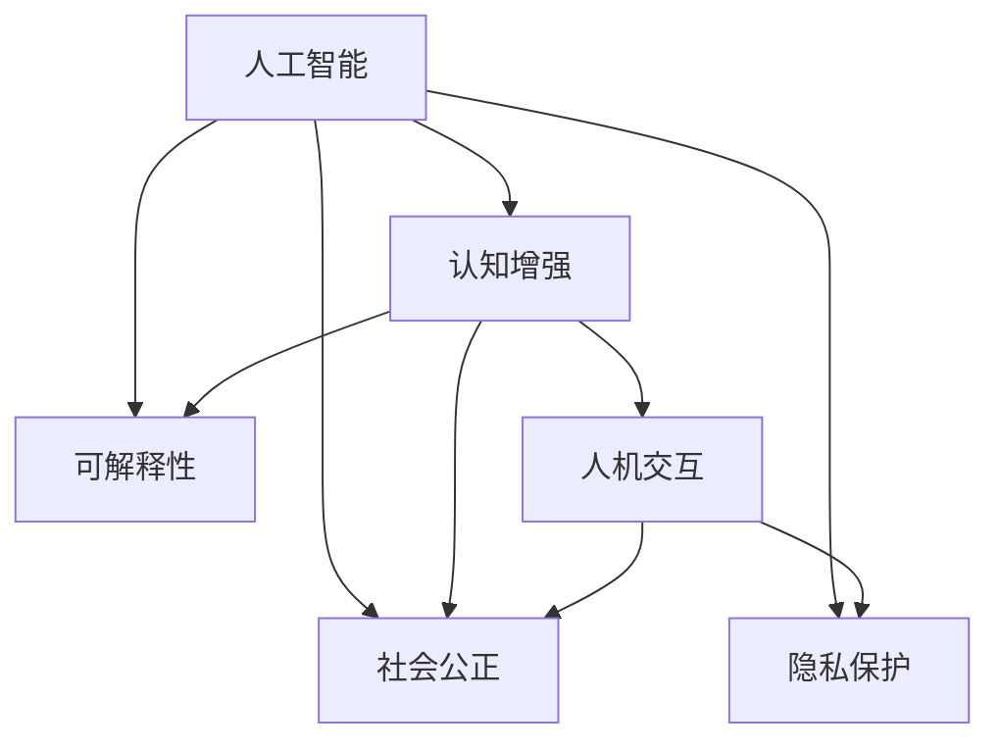

                 

## 1. 背景介绍

### 1.1 问题由来

随着人工智能(AI)技术的迅猛发展，其在诸多领域的应用已逐渐从辅助决策、自动化任务转向更具主动性的认知增强。在AI时代，人类不仅需要学会与AI共存，更需利用AI的力量超越自身极限，克服各类障碍，提升整体能力和生活质量。

近年来，人工智能在语音识别、图像识别、自然语言处理等领域的突破性进展，极大地提升了人类在信息处理、交互和创造等方面的能力。然而，这些技术尚未完全解决诸如认知障碍、生活困难、社会不公等问题。如何进一步拓展AI技术的社会价值，推动人类社会向更加公平、和谐的方向发展，成为当今社会面临的重要课题。

### 1.2 问题核心关键点

实现AI时代的人类增强，关键在于构建人机协同的系统，使AI能够在助人为乐的同时，也成为人的内在力量。AI与人的结合方式和互动机制，决定了其在人类社会中的角色和价值。

核心关键点包括：

- **人机交互**：构建友好、自然的人机交流方式，使AI能够理解和回应人类需求。
- **认知增强**：通过AI辅助决策、学习、记忆，提升人类的认知能力和信息处理效率。
- **社会公正**：确保AI技术公平无偏，避免技术加剧社会不公和分化。
- **隐私保护**：保护个人隐私，防止AI滥用数据和信息，侵害用户权益。

## 2. 核心概念与联系

### 2.1 核心概念概述

为更好地理解AI时代人类增强的方法，本节将介绍几个密切相关的核心概念：

- **人工智能**：指模拟、延伸和扩展人的智能能力，包括感知、学习、推理、决策等过程的技术体系。
- **认知增强**：利用AI技术提升人类的认知功能，如记忆力、注意力、判断力等。
- **社会公正**：AI技术应用过程中，确保每个人都能平等、公正地获得机会和资源。
- **隐私保护**：保护用户隐私，避免数据滥用和信息泄露。
- **可解释性**：使AI系统的决策过程透明、可理解，便于用户监督和反馈。

这些概念之间的逻辑关系可以通过以下Mermaid流程图来展示：



这个流程图展示了几大核心概念及其之间的关系：

1. 人工智能是其他概念的基础，提供了实现认知增强、社会公正、隐私保护和可解释性的技术手段。
2. 认知增强通过提升人类的认知能力，增强人机交互效果，进一步推动社会公正和隐私保护。
3. 社会公正是人类增强的目标之一，通过确保AI技术的公平应用，提升每个人的生活质量和幸福感。
4. 隐私保护是实现社会公正和可解释性的重要保障，防止AI系统滥用用户数据。
5. 可解释性则是认知增强和隐私保护的必要前提，使得AI系统透明、可信，便于用户监督。

## 3. 核心算法原理 & 具体操作步骤
### 3.1 算法原理概述

AI时代的人类增强，通过构建以人为中心的认知增强系统，结合社会公正和隐私保护机制，形成人机协同的智能生态。其核心算法原理主要包括以下几个方面：

1. **认知增强算法**：利用AI模型提升人类的记忆、注意力、判断等认知功能，如基于神经网络的记忆增强、注意力分配模型等。
2. **人机交互算法**：设计自然语言处理、语音识别、图像理解等算法，实现人类与AI系统的无缝沟通和协作。
3. **社会公正算法**：采用公平算法，确保AI技术的应用不偏袒任何群体，提供平等的学习、决策支持。
4. **隐私保护算法**：运用加密、匿名化、联邦学习等技术，保护用户数据不被滥用和泄露。
5. **可解释性算法**：通过模型解释技术，使AI系统透明可理解，便于用户理解和监督。

### 3.2 算法步骤详解

AI时代人类增强的算法实施通常包含以下几个关键步骤：

**Step 1: 需求分析**
- 收集用户需求和反馈，明确增强的目标和范围。
- 分析用户在不同场景下的认知障碍和生活困难，确定增强的具体任务。

**Step 2: 数据准备**
- 收集与认知增强相关的数据，如用户行为数据、心理状态数据、医疗数据等。
- 对数据进行清洗和预处理，确保数据质量和可用性。

**Step 3: 算法设计**
- 根据需求，设计适合的算法模型，如记忆增强模型、注意力分配模型、公平算法等。
- 使用预训练模型或定制化模型，结合领域知识，进行模型微调。

**Step 4: 系统集成**
- 将设计好的算法集成到认知增强系统中，实现对用户的实时反馈和支持。
- 集成隐私保护和可解释性机制，确保系统的合规性和透明度。

**Step 5: 评估与迭代**
- 在实际应用场景中测试系统的效果，收集用户反馈。
- 根据评估结果进行系统优化和迭代，提升用户体验和系统的普适性。

### 3.3 算法优缺点

AI时代人类增强的算法具有以下优点：

1. **效率提升**：通过AI辅助，极大提升人类的认知能力，加速决策和学习过程。
2. **个性化定制**：根据用户需求和反馈，定制化系统功能和界面，提升用户体验。
3. **普适性强**：AI技术可以应用于不同场景和领域，具有广泛的应用潜力。
4. **交互自然**：基于人机交互算法，使得AI系统与人类沟通更加自然流畅。

同时，该算法也存在一定的局限性：

1. **依赖数据**：AI系统的效果很大程度上依赖于数据的质量和量，获取高质量数据成本较高。
2. **伦理挑战**：AI技术在应用过程中可能带来伦理和隐私问题，需要谨慎处理。
3. **技术复杂**：构建复杂的人机协同系统，需要多学科知识的融合和技术团队的协作。
4. **依赖算法**：算法设计不当可能导致不公平、不透明或不可靠的系统输出。

尽管存在这些局限性，但AI时代人类增强的算法仍然是当前提升人类认知能力的最佳途径之一。未来相关研究的重点在于如何进一步降低数据获取成本，提高算法的透明度和公平性，同时兼顾系统的可解释性和伦理安全性等因素。

### 3.4 算法应用领域

AI时代人类增强的算法在多个领域已展现出广泛的应用前景，例如：

- **医疗健康**：利用认知增强技术，帮助医生进行病情诊断和决策支持，提升医疗服务质量和效率。
- **教育培训**：通过AI辅助教学，提升学习效果和兴趣，实现个性化学习。
- **职业发展**：利用认知增强和技能培训系统，帮助员工提升职业技能，增强职业竞争力。
- **日常辅助**：开发智能助手和认知增强设备，辅助老年人、残疾人等特殊群体，提升生活质量。
- **社会治理**：通过AI技术，提升公共服务的智能化水平，提高社会治理的效率和公平性。

除了上述这些领域，AI时代人类增强的应用还将不断拓展到更多场景中，如智慧交通、智慧能源、环境保护等，为人类的生产生活方式带来深远影响。

## 4. 数学模型和公式 & 详细讲解  
### 4.1 数学模型构建

为更精确地描述AI时代人类增强的算法原理，这里引入几个数学模型和公式进行详细讲解。

假设用户在某任务上的认知障碍可以表示为 $O$，认知增强算法通过训练得到的模型 $M$ 对其进行增强，增强后的认知障碍表示为 $M(O)$。认知增强的目标是最小化 $M(O)$ 与真实认知障碍 $O$ 的差异，即：

$$
\min_{M} ||M(O)-O||^2
$$

其中 $||.||$ 表示向量化后的差异度量，通常使用欧几里得距离或曼哈顿距离。

在实践中，认知增强算法通常基于神经网络等深度学习模型。假设 $M$ 是一个具有 $L$ 层隐藏层的神经网络，各层的权重和偏置分别表示为 $\theta_1,\theta_2,\ldots,\theta_L$。网络的前向传播计算为：

$$
h_0=O
$$

$$
h_1=f_1(\theta_1h_0)
$$

$$
h_2=f_2(\theta_2h_1)
$$

$$
\vdots
$$

$$
h_L=f_L(\theta_Lh_{L-1})
$$

其中 $f_i$ 为激活函数，如 ReLU、Sigmoid 等。

通过反向传播算法，计算各层的梯度：

$$
\frac{\partial \mathcal{L}}{\partial \theta_i}=\frac{\partial \mathcal{L}}{\partial h_i} \cdot \frac{\partial h_i}{\partial \theta_i}
$$

其中 $\mathcal{L}$ 为目标函数，如均方误差损失。

### 4.2 公式推导过程

以一个简单的记忆增强模型为例，展示其数学推导过程。

假设用户的记忆障碍表示为 $O$，认知增强模型 $M$ 为基于长短期记忆网络(LSTM)的模型。模型的前向传播计算如下：

$$
h_0=[O;0]
$$

$$
h_1=f_1(\theta_1h_0)
$$

$$
h_2=f_2(\theta_2h_1)
$$

$$
\vdots
$$

$$
h_L=f_L(\theta_Lh_{L-1})
$$

其中 $[.]$ 表示向量拼接，$0$ 表示记忆初始向量，通常为全零向量。

记忆增强的目标是最小化增强后的记忆障碍 $M(O)$ 与真实记忆障碍 $O$ 的差异，即：

$$
\min_{M} ||M(O)-O||^2
$$

定义模型的损失函数为均方误差损失：

$$
\mathcal{L}=\frac{1}{N}\sum_{i=1}^N (M(O_i)-O_i)^2
$$

其中 $N$ 为训练样本数，$O_i$ 为第 $i$ 个样本的认知障碍。

通过反向传播算法，计算各层梯度：

$$
\frac{\partial \mathcal{L}}{\partial \theta_i}=\frac{\partial \mathcal{L}}{\partial h_i} \cdot \frac{\partial h_i}{\partial \theta_i}
$$

其中 $\frac{\partial \mathcal{L}}{\partial h_i}$ 为对输出层的梯度，$O_i$ 为输入层的梯度。

### 4.3 案例分析与讲解

以下以一个具体的案例——智能辅助诊疗系统为例，进行详细分析。

**案例背景**：某医院医生面临大量疑难病例，利用AI辅助系统进行诊断和治疗方案推荐。

**数据准备**：收集医生的诊断记录、病例影像、实验室检查报告等数据，用于训练认知增强模型。

**模型设计**：设计一个基于深度学习的认知增强模型，用于辅助医生识别病情和制定治疗方案。

**算法实现**：采用神经网络模型进行训练和推理，实现对医生诊断和治疗方案推荐的增强。

**效果评估**：通过在医院实际应用，收集医生和患者的反馈，评估系统的提升效果和用户体验。

## 5. 项目实践：代码实例和详细解释说明
### 5.1 开发环境搭建

在进行AI时代人类增强系统的开发前，我们需要准备好开发环境。以下是使用Python进行TensorFlow开发的环境配置流程：

1. 安装Anaconda：从官网下载并安装Anaconda，用于创建独立的Python环境。

2. 创建并激活虚拟环境：
```bash
conda create -n tf-env python=3.8 
conda activate tf-env
```

3. 安装TensorFlow：根据CUDA版本，从官网获取对应的安装命令。例如：
```bash
conda install tensorflow -c conda-forge -c pytorch
```

4. 安装各类工具包：
```bash
pip install numpy pandas scikit-learn matplotlib tqdm jupyter notebook ipython
```

完成上述步骤后，即可在`tf-env`环境中开始开发实践。

### 5.2 源代码详细实现

下面我们以一个简单的记忆增强模型为例，展示TensorFlow的代码实现。

首先，定义模型参数和输入：

```python
import tensorflow as tf
from tensorflow.keras.layers import LSTM, Dense

# 定义模型参数
num_units = 128
num_layers = 2
hidden_size = 64

# 定义输入和输出
input_shape = (None, 10)
output_shape = (None, 1)

# 定义模型
model = tf.keras.Sequential([
    LSTM(num_units, input_shape=input_shape, return_sequences=True),
    LSTM(num_units, input_shape=(None, num_units), return_sequences=True),
    Dense(hidden_size, activation='relu'),
    Dense(output_shape, activation='sigmoid')
])
```

然后，定义损失函数和优化器：

```python
# 定义损失函数
loss = tf.keras.losses.BinaryCrossentropy()

# 定义优化器
optimizer = tf.keras.optimizers.Adam(learning_rate=0.001)
```

接着，定义训练和评估函数：

```python
# 定义训练函数
@tf.function
def train_step(inputs, targets):
    with tf.GradientTape() as tape:
        logits = model(inputs)
        loss_value = loss(targets, logits)
    gradients = tape.gradient(loss_value, model.trainable_variables)
    optimizer.apply_gradients(zip(gradients, model.trainable_variables))

# 定义评估函数
@tf.function
def evaluate(inputs, targets):
    logits = model(inputs)
    loss_value = loss(targets, logits)
    return loss_value.numpy()
```

最后，启动训练流程：

```python
# 准备数据
train_data = ...
test_data = ...

# 训练模型
for epoch in range(10):
    for batch in train_data:
        train_step(batch[0], batch[1])
    print(f"Epoch {epoch+1}, loss: {evaluate(test_data[0], test_data[1])}")
```

以上就是使用TensorFlow实现记忆增强模型的完整代码实现。可以看到，TensorFlow提供的高阶API使得构建深度学习模型变得简洁高效。

### 5.3 代码解读与分析

让我们再详细解读一下关键代码的实现细节：

**定义模型参数和输入**：
- `num_units` 和 `num_layers` 定义LSTM层的大小和层数。
- `hidden_size` 定义全连接层的大小。
- `input_shape` 和 `output_shape` 定义输入和输出的维度。

**模型定义**：
- 使用 `tf.keras.Sequential` 构建序列模型，包含两个LSTM层和一个全连接层。
- LSTM层使用 `return_sequences=True` 参数，保证每个时间步的输出大小与输入大小一致。
- 全连接层使用 `relu` 激活函数，输出层使用 `sigmoid` 激活函数。

**损失函数和优化器**：
- 定义均方误差损失函数 `BinaryCrossentropy`。
- 使用 `Adam` 优化器，设置学习率为 `0.001`。

**训练和评估函数**：
- `train_step` 函数使用梯度带内（Gradient Tape）计算损失函数的梯度，并使用 `apply_gradients` 方法更新模型参数。
- `evaluate` 函数计算模型在测试集上的损失值，并返回损失值。

**训练流程**：
- 循环训练10个epoch，在每个epoch内遍历训练集中的每个批次。
- 调用 `train_step` 函数进行训练，计算损失值并输出。

可以看到，TensorFlow的代码实现简洁明了，易于理解和调试。通过逐步增加模型的复杂度，我们可以实现更加精确的记忆增强系统。

当然，实际应用中还需要根据具体任务进行优化设计，如调整模型结构、选择不同的激活函数、引入正则化技术等，以进一步提升系统的性能和效果。

## 6. 实际应用场景
### 6.1 智能医疗健康

在医疗健康领域，AI辅助诊疗系统可以显著提升医疗服务质量和效率。例如，利用认知增强技术，辅助医生进行疾病诊断和治疗方案推荐。

在技术实现上，可以收集医生的诊断记录、病例影像、实验室检查报告等数据，构建基于深度学习的认知增强模型。模型通过训练，可以识别疾病模式，预测病情进展，推荐治疗方案，辅助医生进行精准诊疗。在实际应用中，医生可以通过接口调用系统，获得智能诊断和推荐支持，提升诊疗决策的准确性和效率。

### 6.2 教育培训

AI辅助教育培训系统可以提供个性化的学习体验，提升学生的学习效果和兴趣。例如，利用认知增强技术，帮助学生掌握复杂概念，解决学习难题。

在技术实现上，可以收集学生的学习行为数据、心理状态数据、答题记录等，构建基于深度学习的认知增强模型。模型通过训练，可以分析学生的学习模式，提供个性化推荐，制定学习计划，实时反馈学习效果。学生可以通过系统获得个性化的学习建议和辅导，提升学习效率和成果。

### 6.3 职业发展

AI辅助职业发展系统可以提升员工的职业技能，增强职业竞争力。例如，利用认知增强技术，帮助员工快速学习新技能，提升工作表现。

在技术实现上，可以收集员工的工作日志、学习记录、考核数据等，构建基于深度学习的认知增强模型。模型通过训练，可以识别员工的弱点和提升点，推荐相关学习资源，制定培训计划，实时跟踪学习进度。员工可以通过系统获得个性化的学习支持和反馈，提升职业技能和工作表现。

### 6.4 日常辅助

AI辅助日常辅助设备可以提升特殊群体的生活质量，帮助他们克服生活困难。例如，利用认知增强技术，帮助老年人、残疾人等群体进行日常事务管理。

在技术实现上，可以收集用户的生活行为数据、健康数据等，构建基于深度学习的认知增强模型。模型通过训练，可以分析用户的认知障碍，提供个性化的日常事务管理建议，如提醒服药、提醒出行等。用户可以通过设备获得智能辅助支持，提升生活质量和独立性。

### 6.5 社会治理

AI辅助社会治理系统可以提高公共服务的智能化水平，提升社会治理的效率和公平性。例如，利用认知增强技术，帮助政府部门进行数据分析和决策支持。

在技术实现上，可以收集社会治理相关的各类数据，构建基于深度学习的认知增强模型。模型通过训练，可以识别社会治理中的关键因素，预测事件发展趋势，制定应对策略，优化资源配置。政府部门可以通过系统获得智能决策支持，提升社会治理的智能化水平和效率。

## 7. 工具和资源推荐
### 7.1 学习资源推荐

为了帮助开发者系统掌握AI时代人类增强的理论基础和实践技巧，这里推荐一些优质的学习资源：

1. **《深度学习》书籍**：Ian Goodfellow、Yoshua Bengio 和 Aaron Courville 撰写的经典教材，涵盖深度学习的理论基础和实践方法。
2. **Coursera《深度学习专项课程》**：由Andrew Ng 等人授课的深度学习课程，系统讲解深度学习的核心概念和技术。
3. **Kaggle 数据竞赛**：利用Kaggle的数据集和社区资源，实践深度学习和认知增强算法，提升算法能力和应用能力。
4. **GitHub 开源项目**：在GitHub上查找相关的开源项目和代码实现，学习先进的技术和实践经验。
5. **AISTATS 会议论文**：机器学习和人工智能领域的顶级会议论文集，了解前沿研究和最新进展。

通过对这些资源的学习实践，相信你一定能够快速掌握AI时代人类增强的精髓，并用于解决实际的AI应用问题。

### 7.2 开发工具推荐

高效的开发离不开优秀的工具支持。以下是几款用于AI时代人类增强开发的常用工具：

1. **TensorFlow**：Google开发的深度学习框架，支持大规模分布式训练，适用于复杂深度学习模型的开发。
2. **PyTorch**：Facebook开发的深度学习框架，灵活性和易用性较高，适合快速迭代和原型开发。
3. **TensorBoard**：TensorFlow配套的可视化工具，实时监测模型训练状态，提供丰富的图表呈现方式。
4. **Weights & Biases**：模型训练的实验跟踪工具，记录和可视化模型训练过程中的各项指标，方便对比和调优。
5. **Jupyter Notebook**：交互式编程环境，支持Python等多种语言，方便代码调试和文档编写。

合理利用这些工具，可以显著提升AI时代人类增强系统的开发效率，加快创新迭代的步伐。

### 7.3 相关论文推荐

AI时代人类增强技术的发展源于学界的持续研究。以下是几篇奠基性的相关论文，推荐阅读：

1. **《深度学习》**：Ian Goodfellow、Yoshua Bengio 和 Aaron Courville 撰写的经典教材，深入讲解深度学习的理论基础和应用方法。
2. **《神经网络与深度学习》**：Michael Nielsen 撰写的通俗易懂介绍深度学习的书籍，适合初学者阅读。
3. **《智能体、学习、搜索与优化》**：Richard S. Sutton 和 Andrew G. Barto 撰写的深度强化学习入门书籍，涵盖强化学习的基本概念和算法。
4. **《认知增强与智能辅助技术》**：陈树等人撰写的论文，介绍认知增强技术的理论基础和实践应用。
5. **《基于深度学习的智能医疗系统》**：杨涛等人撰写的论文，介绍深度学习在医疗健康领域的认知增强技术。

这些论文代表了大时代人类增强技术的发展脉络。通过学习这些前沿成果，可以帮助研究者把握学科前进方向，激发更多的创新灵感。

## 8. 总结：未来发展趋势与挑战

### 8.1 总结

本文对AI时代人类增强的算法原理和操作步骤进行了全面系统的介绍。首先阐述了AI时代人类增强的研究背景和意义，明确了认知增强、社会公正、隐私保护等核心概念在AI技术应用中的重要作用。其次，从算法原理到具体实现，详细讲解了认知增强的数学模型和代码实现，展示了认知增强在医疗、教育、职业发展等多个领域的实际应用。

通过本文的系统梳理，可以看到，AI时代人类增强技术正在成为提升人类认知能力和社会治理水平的重要手段。AI与人的深度结合，将推动人类社会向更加智能化、公平化、可持续的方向发展。未来，伴随AI技术的不断进步，人类增强将迎来更多突破性应用，为人类社会带来更加光明的前景。

### 8.2 未来发展趋势

展望未来，AI时代人类增强技术将呈现以下几个发展趋势：

1. **多模态认知增强**：未来人类增强系统将更加注重多模态信息的融合，结合视觉、听觉、触觉等多种感官数据，提供更全面、更丰富的认知增强体验。
2. **自主学习与自适应**：AI系统将具备自主学习和自适应能力，根据用户需求和反馈，动态调整认知增强策略，提升用户体验和系统效率。
3. **智能辅助决策**：基于深度学习和强化学习技术，AI系统将具备智能辅助决策能力，提供多维度、多层次的决策支持和分析。
4. **社会公正与公平性**：未来的AI技术将更加注重社会公正与公平性，避免技术加剧社会不公和分化，确保每个人都能平等、公正地获得机会和资源。
5. **隐私保护与伦理约束**：AI技术的应用将更加注重隐私保护和伦理约束，确保用户数据的安全性和透明性，避免滥用和侵权。

这些趋势展示了AI时代人类增强技术广阔的发展前景。AI与人的结合方式和应用机制，将深刻影响人类社会的发展方向和进程。

### 8.3 面临的挑战

尽管AI时代人类增强技术已经取得了诸多突破，但在迈向更加智能化、公平化、可持续应用的过程中，仍面临诸多挑战：

1. **数据依赖与获取成本**：AI系统的效果很大程度上依赖于数据的质量和量，获取高质量数据成本较高，如何降低数据获取成本成为关键问题。
2. **公平性与偏见**：AI系统可能学习到有偏见、有害的信息，导致技术应用的不公平性，需进一步提升系统的公平性和透明度。
3. **伦理与隐私**：AI技术在应用过程中可能带来伦理和隐私问题，需建立伦理约束机制，确保技术应用符合人类价值观和伦理道德。
4. **技术复杂与优化难度**：构建复杂的人机协同系统，需多学科知识的融合和技术团队的协作，技术优化难度较大。
5. **系统透明性与可解释性**：AI系统的决策过程需要透明、可理解，便于用户监督和反馈，提升系统的可信性和可靠性。

这些挑战展示了AI时代人类增强技术需要进一步研究和改进的方向。唯有不断优化算法、提升技术透明度和公平性、加强伦理约束，才能实现AI技术与人的深度结合，推动人类社会向更加智能化、公平化、可持续的方向发展。

### 8.4 研究展望

面对AI时代人类增强所面临的种种挑战，未来的研究需要在以下几个方面寻求新的突破：

1. **认知增强算法优化**：开发更加高效的认知增强算法，如神经网络、强化学习等，提升系统的学习效率和效果。
2. **公平性与偏见缓解**：引入公平算法、对抗训练等技术，减少系统偏见，提升系统的公平性和透明性。
3. **多模态认知增强**：结合视觉、听觉、触觉等多种感官数据，提供更全面、更丰富的认知增强体验。
4. **隐私保护与伦理约束**：在算法设计和应用过程中，引入隐私保护和伦理约束机制，确保用户数据的安全性和透明性。
5. **人机协同与智能决策**：基于深度学习和强化学习技术，构建人机协同的智能决策系统，提升系统的智能辅助能力。

这些研究方向将引领AI时代人类增强技术迈向更高的台阶，为构建安全、可靠、可解释、可控的智能系统铺平道路。面向未来，AI时代人类增强技术需要与其他人工智能技术进行更深入的融合，如知识表示、因果推理、强化学习等，多路径协同发力，共同推动自然语言理解和智能交互系统的进步。只有勇于创新、敢于突破，才能不断拓展AI技术的边界，让智能技术更好地造福人类社会。

## 9. 附录：常见问题与解答

**Q1：AI时代人类增强的目标是什么？**

A: AI时代人类增强的目标是通过构建人机协同的智能生态，提升人类的认知能力和社会治理水平，使AI成为人的内在力量，推动人类社会向更加智能化、公平化、可持续的方向发展。

**Q2：AI时代人类增强有哪些主要应用场景？**

A: AI时代人类增强主要应用于医疗健康、教育培训、职业发展、日常辅助和社会治理等多个领域。例如，利用认知增强技术，辅助医生进行疾病诊断和治疗方案推荐，提升学生的学习效果和兴趣，帮助员工提升职业技能，改善特殊群体的日常生活，优化公共服务和社会治理等。

**Q3：AI时代人类增强面临的主要挑战有哪些？**

A: AI时代人类增强面临的主要挑战包括数据依赖与获取成本、公平性与偏见、伦理与隐私、技术复杂与优化难度、系统透明性与可解释性等。如何降低数据获取成本，提升系统的公平性和透明度，加强伦理约束，是当前需要重点解决的问题。

**Q4：AI时代人类增强未来有哪些发展趋势？**

A: AI时代人类增强未来的发展趋势包括多模态认知增强、自主学习与自适应、智能辅助决策、社会公正与公平性、隐私保护与伦理约束等。这些趋势展示了AI时代人类增强技术广阔的发展前景，预示着AI技术与人的深度结合将深刻影响人类社会的发展方向和进程。

---

作者：禅与计算机程序设计艺术 / Zen and the Art of Computer Programming

