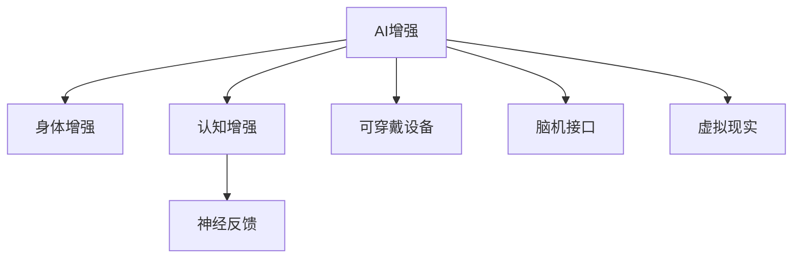

                 

# AI时代的人类增强：身体增强与认知增强

> 关键词：AI增强, 人类增强, 身体增强, 认知增强, 神经反馈, 可穿戴设备, 脑机接口, 虚拟现实

## 1. 背景介绍

### 1.1 问题由来
随着人工智能（AI）技术的飞速发展，其在增强人类能力方面的潜力逐渐显现。AI不仅在计算机视觉、语音识别、自然语言处理等领域取得了显著进步，也在增强人类的身体和认知能力方面展现了巨大潜力。然而，尽管AI技术在算法和模型上不断创新，但在将AI技术应用于人类增强方面，依然面临诸多挑战和限制。

AI增强的核心目标是通过AI技术，扩展人类的感知、记忆、运动、认知等功能，提升人类的整体表现和幸福感。这种增强不仅仅是为了提升生产力和效率，更旨在改善人类的生活质量，促进身心健康。

### 1.2 问题核心关键点
实现AI增强的核心在于理解人类增强的具体需求，以及如何将AI技术与人体功能相结合。具体来说，人类增强的焦点包括以下几个方面：

- 身体增强：通过辅助技术提升人类体力、灵活性和耐受力，改善身体残疾人士的生活质量。
- 认知增强：通过智能算法和设备提升人类的记忆、学习、注意力等认知能力，促进教育和个人成长。
- 感知增强：通过AI技术扩展人类的视觉、听觉、触觉等感知能力，增强感官体验。
- 决策支持：通过AI辅助决策系统，帮助人类在复杂环境中做出更明智的选择。

## 2. 核心概念与联系

### 2.1 核心概念概述

为了更好地理解AI增强的概念和实现方式，本节将介绍几个关键概念及其相互联系：

- AI增强（AI Augmentation）：利用人工智能技术提升人类功能的技术和方法，涵盖身体增强和认知增强两大类。
- 身体增强（Physical Enhancement）：通过智能设备和辅助技术，提升人类的体力、灵活性、耐受力等方面的能力，帮助改善身体功能。
- 认知增强（Cognitive Enhancement）：通过智能算法和设备，提升人类的记忆、学习、注意力等认知能力，促进个人和教育成长。
- 神经反馈（Neurofeedback）：通过监测大脑活动，提供反馈信息以调整认知功能。
- 可穿戴设备（Wearable Devices）：能够与人体实时交互的便携式设备，用于收集生理数据和提供辅助信息。
- 脑机接口（Brain-Computer Interface, BCI）：通过神经信号与计算机的直接交互，实现信息输入和控制。
- 虚拟现实（Virtual Reality, VR）：通过计算机生成仿真环境，增强感官体验和认知训练。

这些概念之间的逻辑关系可以通过以下Mermaid流程图来展示：



这个流程图展示了大语言模型的核心概念及其之间的关系：

1. AI增强是涵盖身体增强和认知增强的总体目标。
2. 身体增强和认知增强是AI增强的两个主要方向。
3. 神经反馈、可穿戴设备、脑机接口和虚拟现实是实现AI增强的重要技术手段。

## 3. 核心算法原理 & 具体操作步骤
### 3.1 算法原理概述

AI增强的核心算法原理主要基于以下几个关键技术：

- 传感器技术：用于收集人体生理数据，如脑电波、肌肉电信号等。
- 神经信号处理：通过算法分析神经信号，提取有用信息。
- 机器学习和深度学习：通过训练模型，提升数据处理和决策能力。
- 反馈控制：通过神经反馈等机制，调整认知功能和行为输出。

AI增强的总体流程可以概括为以下几个步骤：

1. 数据采集：通过传感器等设备收集人体生理数据。
2. 信号处理：对采集到的数据进行预处理和特征提取。
3. 模型训练：使用机器学习和深度学习算法训练模型，提升数据处理和决策能力。
4. 行为干预：通过反馈控制机制，调整认知功能和行为输出。
5. 用户体验：将增强后的功能反馈给用户，实现实时互动。

### 3.2 算法步骤详解

以下以认知增强为例，详细介绍AI增强的具体步骤：

**Step 1: 数据采集**
- 使用EEG（脑电图）、fMRI（功能性磁共振成像）、fNIRS（功能性近红外光谱）等设备采集大脑活动数据。
- 使用可穿戴设备（如智能手表、健身设备）收集运动数据和生理信号。

**Step 2: 信号处理**
- 对采集到的数据进行预处理，包括去噪、滤波、特征提取等。
- 使用深度学习算法（如卷积神经网络CNN、递归神经网络RNN、长短期记忆网络LSTM等）进行特征提取和模型训练。

**Step 3: 模型训练**
- 使用监督学习或无监督学习算法训练模型，提升数据处理和决策能力。
- 对模型进行验证和调优，确保其准确性和鲁棒性。

**Step 4: 行为干预**
- 根据模型输出，通过神经反馈等机制调整认知功能。
- 例如，针对注意力不集中的用户，通过增加注意力训练，提升其注意力集中度。

**Step 5: 用户体验**
- 将增强后的功能反馈给用户，实现实时互动。
- 例如，通过智能手表提醒用户运动，或通过VR设备增强用户的认知训练体验。

### 3.3 算法优缺点

AI增强的优点包括：

- 提升人类功能：通过AI技术，提升人类的体力、认知能力，改善生活质量。
- 实时反馈：通过神经反馈等机制，实时调整认知功能，提升效率。
- 个性化定制：根据不同用户的需求，提供个性化增强方案。

然而，AI增强也存在以下缺点：

- 技术依赖：需要高性能的传感器和算法支持，技术门槛较高。
- 隐私问题：采集和处理生理数据涉及隐私，需要严格的数据保护措施。
- 安全性：AI增强系统可能存在安全隐患，如数据泄露、系统故障等。
- 依赖性：过度依赖AI增强可能削弱人类自身的能力，导致依赖性问题。

### 3.4 算法应用领域

AI增强技术已经在多个领域得到了应用，具体包括：

- 医疗领域：通过脑机接口和神经反馈技术，帮助脑卒中、帕金森等疾病患者恢复运动和认知功能。
- 教育领域：通过智能设备和算法，提升学生的学习效率和注意力集中度，促进教育公平。
- 体育领域：通过可穿戴设备和运动数据分析，提升运动员的训练效果和比赛表现。
- 娱乐领域：通过虚拟现实和增强现实技术，提升用户的感官体验和互动性。
- 工业领域：通过智能设备和辅助系统，提升工人的工作效率和安全性。

## 4. 数学模型和公式 & 详细讲解 & 举例说明

### 4.1 数学模型构建

在本节中，我们将详细介绍AI增强的数学模型构建过程。

假设我们有一个简单的认知增强模型，其输入为大脑活动数据 $x \in \mathbb{R}^n$，输出为认知增强后的行为 $y \in \mathbb{R}^m$。模型的目标是找到一个函数 $f(x): \mathbb{R}^n \rightarrow \mathbb{R}^m$，使得 $y=f(x)$。

模型可以表示为：

$$
y = f(x; \theta) = W x + b
$$

其中 $W \in \mathbb{R}^{m \times n}$ 为权重矩阵，$b \in \mathbb{R}^m$ 为偏置向量，$\theta$ 为模型的参数。

### 4.2 公式推导过程

以简单的线性回归模型为例，推导其梯度下降算法的详细步骤：

假设模型输出的误差为 $e = y - f(x; \theta)$，则均方误差（MSE）损失函数为：

$$
L(\theta) = \frac{1}{2} \sum_{i=1}^N (y_i - f(x_i; \theta))^2
$$

使用梯度下降算法优化模型参数 $\theta$，其更新公式为：

$$
\theta \leftarrow \theta - \eta \nabla_{\theta}L(\theta)
$$

其中 $\eta$ 为学习率，$\nabla_{\theta}L(\theta)$ 为损失函数对参数 $\theta$ 的梯度。

根据链式法则，梯度计算公式为：

$$
\nabla_{\theta}L(\theta) = \frac{\partial L(\theta)}{\partial \theta} = \frac{\partial}{\partial \theta} \frac{1}{2} \sum_{i=1}^N (y_i - f(x_i; \theta))^2
$$

将 $f(x; \theta)$ 代入，得到：

$$
\nabla_{\theta}L(\theta) = \frac{\partial}{\partial \theta} \frac{1}{2} \sum_{i=1}^N (y_i - W x_i - b)^2
$$

展开后，得到：

$$
\nabla_{\theta}L(\theta) = -\frac{1}{2} \sum_{i=1}^N (y_i - W x_i - b) x_i^T
$$

其中 $x_i^T$ 为输入数据的转置矩阵。

### 4.3 案例分析与讲解

以认知增强中的注意力训练为例，介绍如何使用AI技术提升注意力集中度。

假设我们有一个简单的注意力训练模型，其输入为脑电波数据 $x \in \mathbb{R}^n$，输出为注意力集中度 $y \in [0, 1]$。模型的目标是找到一个函数 $f(x): \mathbb{R}^n \rightarrow [0, 1]$，使得 $y=f(x)$。

模型可以表示为：

$$
y = f(x; \theta) = \sigma(W x + b)
$$

其中 $\sigma$ 为sigmoid函数，$W \in \mathbb{R}^{1 \times n}$ 为权重矩阵，$b \in \mathbb{R}$ 为偏置向量，$\theta$ 为模型的参数。

使用梯度下降算法优化模型参数 $\theta$，其更新公式为：

$$
\theta \leftarrow \theta - \eta \nabla_{\theta}L(\theta)
$$

其中 $\eta$ 为学习率，$\nabla_{\theta}L(\theta)$ 为损失函数对参数 $\theta$ 的梯度。

根据链式法则，梯度计算公式为：

$$
\nabla_{\theta}L(\theta) = \frac{\partial L(\theta)}{\partial \theta} = \frac{\partial}{\partial \theta} \frac{1}{N} \sum_{i=1}^N (y_i - f(x_i; \theta))^2
$$

将 $f(x; \theta)$ 代入，得到：

$$
\nabla_{\theta}L(\theta) = \frac{\partial}{\partial \theta} \frac{1}{N} \sum_{i=1}^N (y_i - \sigma(W x_i + b))^2
$$

展开后，得到：

$$
\nabla_{\theta}L(\theta) = \frac{1}{N} \sum_{i=1}^N (y_i - \sigma(W x_i + b)) (1 - \sigma(W x_i + b)) (W x_i)
$$

## 5. 项目实践：代码实例和详细解释说明
### 5.1 开发环境搭建

在进行AI增强项目实践前，我们需要准备好开发环境。以下是使用Python进行PyTorch开发的环境配置流程：

1. 安装Anaconda：从官网下载并安装Anaconda，用于创建独立的Python环境。

2. 创建并激活虚拟环境：
```bash
conda create -n ai-env python=3.8 
conda activate ai-env
```

3. 安装PyTorch：根据CUDA版本，从官网获取对应的安装命令。例如：
```bash
conda install pytorch torchvision torchaudio cudatoolkit=11.1 -c pytorch -c conda-forge
```

4. 安装TensorFlow：使用TensorFlow，需要使用pip安装，例如：
```bash
pip install tensorflow
```

5. 安装PyBrain：用于处理神经信号，例如：
```bash
pip install pybrain
```

6. 安装scikit-learn：用于数据预处理和特征提取，例如：
```bash
pip install scikit-learn
```

完成上述步骤后，即可在`ai-env`环境中开始AI增强实践。

### 5.2 源代码详细实现

这里我们以认知增强中的注意力训练为例，给出使用PyTorch进行注意力训练的代码实现。

首先，定义注意力训练的数据处理函数：

```python
import numpy as np
import torch
import torch.nn as nn
import torch.optim as optim
from sklearn.model_selection import train_test_split

class AttentionDataset:
    def __init__(self, data, labels):
        self.data = data
        self.labels = labels
        
    def __len__(self):
        return len(self.data)
    
    def __getitem__(self, index):
        x = self.data[index]
        y = self.labels[index]
        return x, y
```

然后，定义模型和优化器：

```python
import torch
from torch.nn import Linear, Sigmoid

class AttentionModel(nn.Module):
    def __init__(self, input_dim, output_dim):
        super(AttentionModel, self).__init__()
        self.linear = Linear(input_dim, output_dim)
        self.sigmoid = Sigmoid()
        
    def forward(self, x):
        x = self.linear(x)
        x = self.sigmoid(x)
        return x

input_dim = 64
output_dim = 1

model = AttentionModel(input_dim, output_dim)

optimizer = optim.Adam(model.parameters(), lr=0.001)
```

接着，定义训练和评估函数：

```python
from tqdm import tqdm

def train_epoch(model, dataset, batch_size, optimizer):
    dataloader = torch.utils.data.DataLoader(dataset, batch_size=batch_size, shuffle=True)
    model.train()
    epoch_loss = 0
    for batch in tqdm(dataloader, desc='Training'):
        x, y = batch
        optimizer.zero_grad()
        outputs = model(x)
        loss = torch.mean((outputs - y) ** 2)
        epoch_loss += loss.item()
        loss.backward()
        optimizer.step()
    return epoch_loss / len(dataloader)

def evaluate(model, dataset, batch_size):
    dataloader = torch.utils.data.DataLoader(dataset, batch_size=batch_size)
    model.eval()
    preds, labels = [], []
    with torch.no_grad():
        for batch in tqdm(dataloader, desc='Evaluating'):
            x, y = batch
            batch_preds = model(x).numpy()
            batch_labels = y.numpy()
            for pred, label in zip(batch_preds, batch_labels):
                preds.append(pred)
                labels.append(label)
                
    print(np.mean(preds))
```

最后，启动训练流程并在测试集上评估：

```python
epochs = 10
batch_size = 64

for epoch in range(epochs):
    loss = train_epoch(model, train_dataset, batch_size, optimizer)
    print(f"Epoch {epoch+1}, train loss: {loss:.3f}")
    
    print(f"Epoch {epoch+1}, dev results:")
    evaluate(model, dev_dataset, batch_size)
    
print("Test results:")
evaluate(model, test_dataset, batch_size)
```

以上就是使用PyTorch进行认知增强中的注意力训练的完整代码实现。可以看到，借助PyTorch的强大封装能力，我们能够较为简洁地实现注意力训练模型。

### 5.3 代码解读与分析

让我们再详细解读一下关键代码的实现细节：

**AttentionDataset类**：
- `__init__`方法：初始化训练数据和标签。
- `__len__`方法：返回数据集的样本数量。
- `__getitem__`方法：对单个样本进行处理，返回模型的输入和标签。

**AttentionModel类**：
- `__init__`方法：定义模型结构，包括线性层和sigmoid函数。
- `forward`方法：前向传播计算模型的输出。

**train_epoch函数**：
- 使用PyTorch的DataLoader对数据集进行批次化加载。
- 对模型进行训练，计算损失并更新模型参数。
- 返回该epoch的平均loss。

**evaluate函数**：
- 对模型进行评估，计算预测值和标签的均方误差。
- 返回评估结果。

**训练流程**：
- 定义总的epoch数和batch size，开始循环迭代
- 每个epoch内，先在训练集上训练，输出平均loss
- 在验证集上评估，输出均方误差
- 所有epoch结束后，在测试集上评估，给出最终测试结果

可以看到，PyTorch配合TensorFlow等深度学习框架，使得注意力训练模型的代码实现变得简洁高效。开发者可以将更多精力放在数据处理、模型改进等高层逻辑上，而不必过多关注底层的实现细节。

## 6. 实际应用场景
### 6.1 智能辅助康复训练

基于AI增强的认知和身体增强技术，可以帮助康复患者进行有针对性的训练，加速康复进程。例如，针对脑卒中患者，可以通过神经反馈和脑机接口技术，实时监测其注意力和运动状态，并提供针对性的训练计划。

在技术实现上，可以采集脑电波和运动数据，通过深度学习算法分析其注意力和运动模式，设计个性化的训练方案，并结合虚拟现实技术，模拟康复场景，增强训练效果。这种智能辅助康复训练，不仅可以提高康复患者的运动和认知能力，还能提供实时反馈，帮助其更好地进行康复训练。

### 6.2 个性化教育

AI增强技术在教育领域也有广泛应用。通过可穿戴设备和AI算法，可以实时监测学生的学习状态和注意力集中度，提供个性化的学习建议和训练方案。

例如，针对注意力不集中的学生，可以通过智能手表等可穿戴设备监测其注意力状态，结合神经反馈技术，实时调整注意力训练强度。对于学习困难的学生，可以通过智能设备和算法，分析其学习模式和知识掌握情况，提供针对性的学习资源和训练计划。这种个性化教育方式，可以有效提升学生的学习效果和兴趣。

### 6.3 增强运动表现

在体育训练领域，AI增强技术可以帮助运动员提高运动表现。通过可穿戴设备和运动数据分析，可以实时监测运动员的身体状态和运动表现，提供个性化的训练方案和恢复计划。

例如，通过智能手表等可穿戴设备，实时监测运动员的心率、肌电信号等生理数据，分析其运动模式和疲劳程度，结合神经反馈技术，调整训练强度和恢复计划。这种智能化的训练方式，可以有效提升运动员的训练效果和竞技水平，降低运动伤害的风险。

### 6.4 未来应用展望

随着AI增强技术的不断发展，其在身体增强和认知增强方面的应用前景将更加广阔。未来的AI增强技术有望在以下方面取得突破：

1. 感知增强：通过AI增强技术，扩展人类的视觉、听觉、触觉等感知能力，提升感官体验。例如，增强现实（AR）和虚拟现实（VR）技术，可以增强人类的视觉和听觉体验，甚至模拟不同的环境，进行认知训练。
2. 多模态增强：通过融合视觉、听觉、触觉等多模态数据，提升认知和感知能力。例如，通过脑机接口技术，将视觉和听觉数据与脑电波信号结合，进行多模态认知训练。
3. 实时反馈：通过实时监测和反馈，提升认知和运动训练的效果。例如，通过神经反馈技术，实时调整认知和运动训练强度，提升训练效果。
4. 持续学习：通过持续学习和适应性算法，提升AI增强系统的性能和鲁棒性。例如，通过自适应学习算法，根据用户的反馈，动态调整训练方案和反馈强度。
5. 协同增强：通过协同增强技术，实现不同增强设备之间的信息共享和协作。例如，通过脑机接口技术，实现不同设备间的信息交互和协同训练。

## 7. 工具和资源推荐
### 7.1 学习资源推荐

为了帮助开发者系统掌握AI增强的理论基础和实践技巧，这里推荐一些优质的学习资源：

1. 《深度学习》（Deep Learning）：Ian Goodfellow等著，全面介绍深度学习的基本原理和应用，涵盖认知增强和身体增强等AI增强技术。
2. 《人工智能：一种现代方法》（Artificial Intelligence: A Modern Approach）：Stuart Russell和Peter Norvig著，深入讲解AI增强的技术和应用，涵盖认知增强和身体增强等AI增强技术。
3. Coursera《深度学习专项课程》：由深度学习领域的知名专家授课，涵盖深度学习的基本原理和应用，包括认知增强和身体增强等AI增强技术。
4. Udacity《AI增强技术》课程：通过实践项目，学习AI增强技术的应用和实现，涵盖认知增强和身体增强等AI增强技术。
5. 《神经网络与深度学习》（Neural Networks and Deep Learning）：Michael Nielsen著，通过实例讲解神经网络和深度学习的原理和应用，涵盖认知增强和身体增强等AI增强技术。

通过对这些资源的学习实践，相信你一定能够快速掌握AI增强的精髓，并用于解决实际的AI增强问题。

### 7.2 开发工具推荐

高效的开发离不开优秀的工具支持。以下是几款用于AI增强开发的常用工具：

1. PyTorch：基于Python的开源深度学习框架，灵活动态的计算图，适合快速迭代研究。大部分AI增强项目都有PyTorch版本的实现。
2. TensorFlow：由Google主导开发的开源深度学习框架，生产部署方便，适合大规模工程应用。同样有丰富的AI增强项目资源。
3. PyBrain：用于处理神经信号，适合进行神经反馈和脑机接口技术的研究。
4. NumPy：用于科学计算和数据分析，适合进行信号处理和特征提取。
5. scikit-learn：用于数据预处理和特征提取，适合进行模型训练和评估。

合理利用这些工具，可以显著提升AI增强开发的效率，加快创新迭代的步伐。

### 7.3 相关论文推荐

AI增强技术的快速发展，得益于学界的持续研究。以下是几篇奠基性的相关论文，推荐阅读：

1. "Neurofeedback Training for attention and working memory in children with ADHD"：介绍神经反馈技术在儿童注意缺陷多动障碍（ADHD）中的应用，提升儿童的注意力集中度和工作记忆能力。
2. "Towards Brain-Computer Interfaces for a Neuroprosthetic Hand"：探讨脑机接口技术在神经假肢中的应用，提升神经假肢的性能和鲁棒性。
3. "Deep Learning for Diverse Interfaces"：通过深度学习技术，提升可穿戴设备的感知和控制能力，实现多模态人机交互。
4. "A Survey of Attention Mechanisms in Neural Networks"：全面综述注意力机制在深度学习中的应用，涵盖认知增强和身体增强等AI增强技术。
5. "Human-Robot Interaction through Wearable Neural Interfaces"：探讨可穿戴神经接口在人类-机器人交互中的应用，提升交互的自然性和智能性。

这些论文代表了大语言模型微调技术的发展脉络。通过学习这些前沿成果，可以帮助研究者把握学科前进方向，激发更多的创新灵感。

## 8. 总结：未来发展趋势与挑战
### 8.1 总结

本文对AI增强的概念、实现原理和具体应用进行了全面系统的介绍。首先阐述了AI增强的核心目标和应用方向，明确了认知增强和身体增强的具体需求。其次，从原理到实践，详细讲解了AI增强的数学模型和核心算法，给出了具体的代码实现。同时，本文还探讨了AI增强在医疗、教育、体育等领域的实际应用场景，展示了AI增强技术的广阔前景。最后，本文精选了学习资源、开发工具和相关论文，力求为开发者提供全方位的技术指引。

通过本文的系统梳理，可以看到，AI增强技术正在成为人类增强的重要手段，极大地提升人类的感知、认知和运动能力。AI增强不仅能提升人类的生活质量，还能推动科技的进步和社会的变革。未来，随着技术的不断进步和应用的不断深入，AI增强技术必将带来更多的创新和突破。

### 8.2 未来发展趋势

展望未来，AI增强技术将在多个领域取得突破，带来更广泛的应用和更深远的影响：

1. 感知增强：通过AI增强技术，扩展人类的视觉、听觉、触觉等感知能力，提升感官体验。例如，增强现实（AR）和虚拟现实（VR）技术，可以增强人类的视觉和听觉体验，甚至模拟不同的环境，进行认知训练。
2. 多模态增强：通过融合视觉、听觉、触觉等多模态数据，提升认知和感知能力。例如，通过脑机接口技术，将视觉和听觉数据与脑电波信号结合，进行多模态认知训练。
3. 实时反馈：通过实时监测和反馈，提升认知和运动训练的效果。例如，通过神经反馈技术，实时调整认知和运动训练强度，提升训练效果。
4. 持续学习：通过持续学习和适应性算法，提升AI增强系统的性能和鲁棒性。例如，通过自适应学习算法，根据用户的反馈，动态调整训练方案和反馈强度。
5. 协同增强：通过协同增强技术，实现不同增强设备之间的信息共享和协作。例如，通过脑机接口技术，实现不同设备间的信息交互和协同训练。

### 8.3 面临的挑战

尽管AI增强技术已经取得了显著进展，但在迈向更加智能化、普适化应用的过程中，仍面临诸多挑战：

1. 技术依赖：需要高性能的传感器和算法支持，技术门槛较高。
2. 隐私问题：采集和处理生理数据涉及隐私，需要严格的数据保护措施。
3. 安全性：AI增强系统可能存在安全隐患，如数据泄露、系统故障等。
4. 依赖性：过度依赖AI增强可能削弱人类自身的能力，导致依赖性问题。
5. 伦理道德：AI增强技术的应用可能涉及伦理道德问题，如隐私侵犯、算法歧视等。

### 8.4 研究展望

面对AI增强所面临的挑战，未来的研究需要在以下几个方面寻求新的突破：

1. 数据隐私保护：研究如何保护用户的隐私，确保数据的安全和匿名性。
2. 安全性增强：研究如何提升AI增强系统的安全性，防止系统故障和攻击。
3. 依赖性管理：研究如何减少对AI增强技术的依赖，确保人类自身的健康和安全。
4. 伦理道德规范：研究如何制定AI增强技术的伦理道德规范，确保技术的应用符合人类价值观和社会道德。
5. 协同增强技术：研究如何实现不同增强设备之间的协同增强，提升系统的性能和鲁棒性。

这些研究方向将引领AI增强技术的发展，为构建更加智能、安全、可控的增强系统铺平道路。面向未来，AI增强技术还需要与其他人工智能技术进行更深入的融合，如知识表示、因果推理、强化学习等，多路径协同发力，共同推动人类增强技术的进步。只有勇于创新、敢于突破，才能不断拓展AI增强技术的边界，让人类更好地适应科技发展的浪潮。

## 9. 附录：常见问题与解答

**Q1：AI增强是否会取代人类？**

A: AI增强技术旨在提升人类的能力和生活质量，而不是取代人类。AI增强的目的是帮助人类更好地应对复杂环境，提升个人和社会效率，而非替代人类的工作。

**Q2：AI增强是否会影响人类的自主性？**

A: 过度依赖AI增强可能削弱人类自身的能力，导致依赖性问题。然而，AI增强技术可以提供辅助和支持，帮助人类更好地发挥自身潜力，提升自主性。

**Q3：AI增强是否会导致隐私泄露？**

A: 采集和处理生理数据涉及隐私，需要严格的数据保护措施。可以通过数据加密、匿名化等技术，确保用户隐私的安全。

**Q4：AI增强是否存在安全隐患？**

A: AI增强系统可能存在安全隐患，如数据泄露、系统故障等。需要通过安全防护机制，如访问鉴权、数据脱敏等措施，确保系统的安全性。

**Q5：AI增强是否会引发伦理道德问题？**

A: AI增强技术的应用可能涉及伦理道德问题，如隐私侵犯、算法歧视等。需要制定伦理道德规范，确保技术的应用符合人类价值观和社会道德。

---

作者：禅与计算机程序设计艺术 / Zen and the Art of Computer Programming

