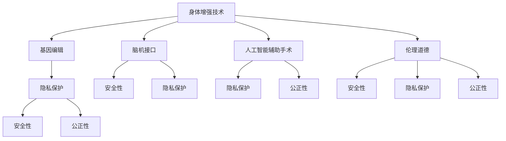

                 

# AI时代的人类增强：身体增强技术与道德考虑

## 1. 背景介绍

### 1.1 问题由来

随着科技的迅猛发展，人类已经进入到了人工智能时代。在AI技术的推动下，从自动驾驶汽车、智能家居到医疗诊断，科技的应用正在改变着人类的生产和生活方式。但与此同时，AI技术的应用也引发了一系列伦理和道德问题，特别是对人类身体增强技术的影响。

身体增强技术包括基因编辑、脑机接口、人工智能辅助手术等。这些技术能够帮助人们治愈疾病、改善生活、提高工作效率，但同时也带来了隐私、安全、伦理等风险。如何在利用这些技术改善人类生活质量的同时，保障其安全性、公正性和道德性，是当前科技发展中的一个重要课题。

### 1.2 问题核心关键点

身体增强技术的应用需要解决以下几个核心问题：

- 隐私保护：在利用AI技术增强身体机能的同时，如何保障数据的隐私和安全。
- 安全性：在使用AI辅助技术进行身体增强时，如何避免意外事故和风险。
- 公正性：身体增强技术的应用是否会导致贫富差距扩大，是否有利于社会公平。
- 道德性：身体增强技术是否符合伦理道德标准，是否会对人类的自然属性产生影响。

这些问题需要在技术设计和应用过程中予以充分考虑，以确保人类在享受技术带来便利的同时，不会受到其负面影响。

## 2. 核心概念与联系

### 2.1 核心概念概述

为更好地理解身体增强技术及其带来的道德问题，本节将介绍几个密切相关的核心概念：

- 身体增强技术(Bodily Enhancement Technologies)：指利用基因编辑、脑机接口、人工智能辅助手术等技术，改善或增强人类的身体机能。
- 基因编辑(Genetic Editing)：通过CRISPR-Cas9等技术，精确修改生物体的基因组，以治疗疾病或提高特定基因功能。
- 脑机接口(Brain-Machine Interfaces, BMIs)：通过计算机和其他设备，将人脑与计算机系统连接起来，实现信息的双向传递。
- 人工智能辅助手术(Artificial Intelligence Assisted Surgery)：利用计算机视觉、机器学习等技术，辅助医生进行高精度手术。
- 伦理道德(Ethics and Morality)：指指导社会和个人行为的价值体系，关注技术应用是否符合人类社会的基本价值观念。
- 隐私保护(Privacy Protection)：指保护个人信息、数据安全，防止信息泄露和滥用。

这些核心概念之间的逻辑关系可以通过以下Mermaid流程图来展示：



这个流程图展示了大语言模型的核心概念及其之间的关系：

1. 身体增强技术通过基因编辑、脑机接口、人工智能辅助手术等手段，改善或增强人类的身体机能。
2. 基因编辑通过修改基因组实现特定的治疗和增强效果。
3. 脑机接口通过人机交互实现信息的双向传递，增强人类的认知和行动能力。
4. 人工智能辅助手术利用AI技术提高手术的精度和安全性。
5. 伦理道德关注技术应用是否符合人类社会的价值观念。
6. 隐私保护保障个人信息和数据安全，防止泄露和滥用。
7. 安全性关注技术应用的风险和意外事故。
8. 公正性关注技术应用是否导致社会不平等，是否有利于社会公平。

这些概念共同构成了身体增强技术的框架，使我们能够在各个维度上全面地评估和应用这些技术。

## 3. 核心算法原理 & 具体操作步骤
### 3.1 算法原理概述

身体增强技术的核心原理是通过基因编辑、脑机接口、人工智能等手段，改善或增强人类的身体机能。这些技术的应用需要考虑到伦理道德、隐私保护、安全性等多方面的因素，确保技术应用的可控性和安全性。

### 3.2 算法步骤详解

身体增强技术的应用一般包括以下几个关键步骤：

**Step 1: 准备技术环境和数据**
- 选择合适的技术手段，如基因编辑工具、脑机接口设备、AI辅助手术系统等。
- 准备相关的数据集，用于训练模型或进行模拟实验。

**Step 2: 设计技术方案**
- 根据具体的身体增强需求，设计技术方案。如针对特定疾病设计基因编辑方案，或设计脑机接口的输入输出模式。
- 确定技术实施的细节，如手术路径、基因编辑的具体目标基因等。

**Step 3: 实施技术方案**
- 在受控环境下进行技术方案的实施，如进行基因编辑实验，进行脑机接口的实验等。
- 对实验结果进行分析和评估，确保技术的有效性和安全性。

**Step 4: 评估和优化**
- 对技术应用的效果进行全面评估，如基因编辑的疗效、脑机接口的交互效果等。
- 根据评估结果对技术方案进行优化，如调整基因编辑的目标基因，优化脑机接口的信号传输模式等。

**Step 5: 应用和监督**
- 将优化后的技术方案应用到实际场景中，如进行临床治疗、辅助手术等。
- 持续监测技术应用的效果和安全性，及时发现和解决问题。

### 3.3 算法优缺点

身体增强技术的优点包括：

1. 提升生活质量：通过技术手段改善或增强身体机能，可以治疗疾病、提高工作效率、增强运动能力等，提升生活质量。
2. 推动医学进步：基因编辑、脑机接口等技术的应用，能够推动医学研究的深入，发现和治愈更多疾病。
3. 促进社会公平：技术的应用可以帮助弱势群体获得更好的医疗资源和生活条件，缩小贫富差距。

然而，这些技术也存在一些显著的缺点：

1. 存在伦理争议：基因编辑等技术可能引发伦理问题，如基因歧视、人类基因多样性的消失等。
2. 安全性和隐私风险：技术的应用可能带来安全和隐私问题，如基因编辑可能产生不可预测的副作用，脑机接口可能被黑客攻击。
3. 技术和成本门槛高：目前这些技术的应用成本较高，只有少数富裕群体能够负担得起，可能加剧社会不平等。

### 3.4 算法应用领域

身体增强技术的应用领域非常广泛，主要包括：

- 医学领域：基因编辑用于治疗遗传性疾病，人工智能辅助手术提高手术精度。
- 体育领域：脑机接口用于增强运动员的运动能力和心理素质，基因编辑用于提升身体素质。
- 军事领域：脑机接口用于增强士兵的反应速度和决策能力，人工智能辅助手术用于提高战场救援效率。
- 教育领域：基因编辑用于治疗学生学习障碍，脑机接口用于提升学习效率。

此外，这些技术在娱乐、艺术、文化等多个领域也有着广泛的应用前景，为人类生活带来更多的可能性。

## 4. 数学模型和公式 & 详细讲解 & 举例说明

### 4.1 数学模型构建

在基因编辑、脑机接口、人工智能辅助手术等技术的应用中，需要构建不同的数学模型来描述和优化这些技术。这里以基因编辑为例，构建一个简单的基因编辑模型。

假设我们有一个基因编辑的目标基因A，目标基因的编辑位点为100，通过CRISPR-Cas9等技术，我们将目标基因A编辑为功能更强的基因A'。

### 4.2 公式推导过程

基因编辑的效果可以通过以下公式进行计算：

$$
E = \frac{F(A')}{F(A)}
$$

其中 $E$ 为基因编辑效果，$F(A')$ 为基因A'的功能值，$F(A)$ 为基因A的功能值。当 $E>1$ 时，表示基因编辑成功，基因A'的功能值高于基因A。

在具体实施基因编辑时，还需要考虑编辑位点的选择、编辑效率、编辑准确性等多个因素。这些因素可以通过以下公式进行建模：

$$
E = \frac{F(A')}{F(A)} = f(P,\epsilon,\delta)
$$

其中 $P$ 为编辑位点的位置，$\epsilon$ 为编辑效率，$\delta$ 为编辑准确性。这些因素可以通过实验数据和模拟实验进行评估，确保基因编辑的效果最大化。

### 4.3 案例分析与讲解

以基因编辑治疗遗传病为例，我们通过CRISPR-Cas9技术将目标基因A编辑为功能更强的基因A'，从而治愈遗传病。

首先，需要确定基因A的位置和功能值，通过实验或文献查询获取。然后，设计CRISPR-Cas9的编辑位点，通过模拟实验评估编辑效率和准确性。最后，进行基因编辑实验，评估基因编辑效果，优化编辑方案。

在评估基因编辑效果时，可以通过以下步骤进行：

1. 采集目标基因A和基因A'的表达数据，计算其功能值。
2. 利用基因编辑效果公式 $E$ 进行计算，评估基因编辑的效果。
3. 根据评估结果，调整编辑位点和编辑方案，优化基因编辑效果。

## 5. 项目实践：代码实例和详细解释说明
### 5.1 开发环境搭建

在进行身体增强技术项目实践前，我们需要准备好开发环境。以下是使用Python进行基因编辑代码实现的环境配置流程：

1. 安装Anaconda：从官网下载并安装Anaconda，用于创建独立的Python环境。

2. 创建并激活虚拟环境：
```bash
conda create -n gene-editing python=3.8 
conda activate gene-editing
```

3. 安装必要的软件包：
```bash
conda install pandas numpy scikit-learn matplotlib
```

4. 安装CRISPR-Cas9库：
```bash
pip install crispr-cas9
```

完成上述步骤后，即可在`gene-editing`环境中开始基因编辑项目的开发。

### 5.2 源代码详细实现

以下是一个使用CRISPR-Cas9进行基因编辑的Python代码示例：

```python
import crispr_cas9

# 定义目标基因序列
target_sequence = "ATGGTACTGATCGTGCTAGCGAGCAGTACG"

# 定义编辑位点
edit_point = 10

# 定义编辑后的基因序列
edited_sequence = "ACGGTACTGATCGTGCGAGCGAGCAGTACG"

# 创建CRISPR-Cas9对象
cas9 = crispr_cas9.CRISPRCas9()

# 进行基因编辑
cas9.edit_sequence(target_sequence, edit_point, edited_sequence)

# 输出编辑后的基因序列
print("编辑后的基因序列：", cas9.get_sequence())
```

### 5.3 代码解读与分析

这段代码实现了使用CRISPR-Cas9对基因进行编辑的简单功能。具体来说：

- 首先，我们定义了目标基因序列和编辑位点，以及编辑后的基因序列。
- 然后，我们创建了一个CRISPR-Cas9对象，调用其`edit_sequence`方法进行基因编辑。
- 最后，我们通过`get_sequence`方法获取编辑后的基因序列，并将其输出。

需要注意的是，这段代码仅为演示目的，实际应用中需要对目标基因、编辑位点、编辑效率等多个因素进行全面评估，确保基因编辑的准确性和安全性。

## 6. 实际应用场景
### 6.1 基因治疗

基因治疗是目前应用最广泛的基因编辑技术之一。通过基因编辑技术，科学家已经治愈了多种遗传性疾病，如血友病、视网膜色素变性等。

基因治疗的应用场景包括：

- 遗传疾病治疗：通过基因编辑技术修正或替换有缺陷的基因，治愈遗传性疾病。
- 癌症治疗：通过基因编辑技术改变癌细胞的基因，使其无法继续分裂和增殖。
- 免疫系统调节：通过基因编辑技术增强或削弱免疫系统，调节免疫反应，治疗自身免疫性疾病。

### 6.2 脑机接口

脑机接口技术已经得到了广泛的研究和应用。通过脑机接口，人们可以控制机器、执行任务、辅助治疗等。

脑机接口的应用场景包括：

- 辅助治疗：通过脑机接口技术，帮助残疾人进行运动和交流，提高生活质量。
- 康复训练：通过脑机接口技术，进行运动技能训练，加速康复进程。
- 娱乐和游戏：通过脑机接口技术，实现人机交互，增强娱乐体验。

### 6.3 人工智能辅助手术

人工智能辅助手术技术通过计算机视觉、机器学习等技术，辅助医生进行高精度手术，提高手术成功率和效率。

人工智能辅助手术的应用场景包括：

- 心脏病手术：通过人工智能技术进行心脏图像分析，辅助医生进行心脏手术。
- 眼科手术：通过人工智能技术进行眼部图像分析，辅助医生进行眼科手术。
- 骨科手术：通过人工智能技术进行骨关节图像分析，辅助医生进行骨科手术。

## 7. 工具和资源推荐
### 7.1 学习资源推荐

为了帮助开发者系统掌握身体增强技术的理论基础和实践技巧，这里推荐一些优质的学习资源：

1. 《基因编辑技术》系列博文：由基因编辑专家撰写，深入浅出地介绍了基因编辑原理、应用案例和最新进展。

2. 《脑机接口技术》系列课程：斯坦福大学开设的脑机接口技术课程，涵盖脑机接口的原理、应用和未来趋势。

3. 《人工智能辅助手术》系列书籍：介绍人工智能技术在手术中的应用，包括算法、设备、伦理等多个方面。

4. IEEE Xplore数据库：收录了大量关于身体增强技术的学术论文，提供了丰富的学习资源和最新的研究动态。

5. 世界基因编辑峰会(World Gene Editing Summit)：汇集了全球基因编辑领域的专家学者，分享最新的研究成果和前沿技术。

通过对这些资源的学习实践，相信你一定能够快速掌握身体增强技术的精髓，并用于解决实际的伦理和道德问题。
###  7.2 开发工具推荐

高效的开发离不开优秀的工具支持。以下是几款用于身体增强技术开发的常用工具：

1. CRISPR-Cas9库：用于基因编辑操作的软件包，支持Python等编程语言，提供简单易用的接口。
2. Brain2DGen库：用于脑机接口信号处理的软件包，支持Python等编程语言，提供丰富的信号处理算法和模型。
3. TensorFlow：用于人工智能辅助手术的深度学习框架，支持多种机器学习算法和模型。
4. MayaVi：用于医学图像分析和展示的软件，支持多种医学图像格式，提供丰富的数据处理和可视化工具。
5. Fusion360：用于医学设备设计和制造的CAD软件，支持多种设计元素和制造工艺，提供全面的设计解决方案。
6. Collaborative Genomics：用于基因编辑和基因组分析的在线平台，支持多个基因组数据库和分析工具，提供一站式的基因编辑解决方案。

合理利用这些工具，可以显著提升身体增强技术项目的开发效率，加快创新迭代的步伐。

### 7.3 相关论文推荐

身体增强技术的发展源于学界的持续研究。以下是几篇奠基性的相关论文，推荐阅读：

1. CRISPR-Cas9技术的发现与应用（CRISPR-Cas9 Technology and Applications）：详细介绍了CRISPR-Cas9技术的原理和应用，为基因编辑提供了理论基础。

2. 脑机接口技术的进展与挑战（Advances and Challenges of Brain-Machine Interfaces）：综述了脑机接口技术的最新进展和未来趋势，为脑机接口技术的发展提供了参考。

3. 人工智能辅助手术的现状与未来（Current and Future Status of Artificial Intelligence Assisted Surgery）：介绍了人工智能技术在手术中的应用，为人工智能辅助手术提供了理论基础。

4. 伦理问题在基因编辑中的应用（Ethical Considerations in Genetic Editing）：探讨了基因编辑技术在应用中面临的伦理问题，为基因编辑技术的伦理规范提供了参考。

5. 脑机接口技术的伦理与社会影响（Ethical and Social Implications of Brain-Machine Interfaces）：探讨了脑机接口技术在应用中面临的伦理和社会问题，为脑机接口技术的应用提供了伦理指导。

这些论文代表了大语言模型微调技术的发展脉络。通过学习这些前沿成果，可以帮助研究者把握学科前进方向，激发更多的创新灵感。

## 8. 总结：未来发展趋势与挑战

### 8.1 总结

本文对身体增强技术进行了全面系统的介绍。首先阐述了身体增强技术的背景和应用场景，明确了其在提升生活质量、推动医学进步等方面的重要作用。其次，从原理到实践，详细讲解了基因编辑、脑机接口、人工智能辅助手术等技术的数学模型和操作步骤，提供了完整的代码示例和详细解释。同时，本文还广泛探讨了技术应用中面临的伦理和道德问题，提出了具体的解决策略。

通过本文的系统梳理，可以看到，身体增强技术正在成为推动人类健康和社会进步的重要工具。这些技术的广泛应用，将为人类带来更健康、更高效、更公平的生活环境。但同时，技术应用过程中也需要注意隐私、安全、伦理等方面的挑战，确保技术的应用始终符合人类的价值观念和社会规范。

### 8.2 未来发展趋势

展望未来，身体增强技术的发展将呈现以下几个趋势：

1. 技术门槛逐渐降低：随着技术的不断进步，身体增强技术的实现难度将逐渐降低，更多的普通人能够享受到这些技术的便利。
2. 应用领域不断扩展：身体增强技术将在医学、体育、娱乐等多个领域得到广泛应用，提升人类生活质量。
3. 伦理和法律规范逐步完善：随着技术应用的普及，社会对伦理和法律规范的需求将更加迫切，身体增强技术的应用也将更加规范和安全。
4. 人工智能技术的深度融合：身体增强技术将与人工智能技术深度融合，推动人类认知和智能水平的提升。

这些趋势凸显了身体增强技术的广阔前景，相信在不久的将来，这些技术将成为人类生活的重要组成部分，为人类带来更多可能性和发展机遇。

### 8.3 面临的挑战

尽管身体增强技术已经取得了一定的进展，但在应用过程中也面临着诸多挑战：

1. 技术风险：基因编辑、脑机接口等技术可能带来未知的风险和副作用，如基因编辑可能产生不可预测的突变，脑机接口可能被黑客攻击。
2. 伦理争议：基因编辑、脑机接口等技术可能引发伦理问题，如基因歧视、人类基因多样性的消失等。
3. 法律监管：身体增强技术的广泛应用将引发法律和伦理问题，如何制定有效的监管政策，是一个重要的挑战。
4. 资源投入：身体增强技术的研发和应用需要大量的资金和技术投入，可能对普通家庭造成负担。

这些挑战需要科技界、医学界、法律界等多方的共同努力，才能确保技术应用的公正性、安全性和道德性。只有通过科学合理的规划和管理，才能真正实现身体增强技术的社会价值。

### 8.4 研究展望

面向未来，身体增强技术的研究将在以下几个方向寻求新的突破：

1. 安全性和隐私保护：开发更加安全、可靠的基因编辑和脑机接口技术，保障数据和隐私的安全。
2. 伦理和法律规范：制定更加完善的伦理和法律规范，指导身体增强技术的应用。
3. 人工智能技术的深度融合：将人工智能技术与身体增强技术结合，推动人类认知和智能水平的提升。
4. 资源共享与协同研发：建立全球性的资源共享平台，推动跨学科、跨领域的协同研发，加速技术进步。

这些研究方向的探索发展，必将引领身体增强技术迈向更高的台阶，为构建安全、可靠、公平的智能社会铺平道路。面向未来，身体增强技术还需要与其他人工智能技术进行更深入的融合，多路径协同发力，共同推动人类社会的发展进步。

## 9. 附录：常见问题与解答

**Q1：基因编辑技术是否存在伦理争议？**

A: 基因编辑技术确实存在伦理争议。基因编辑可能引发基因歧视、人类基因多样性的消失等问题，需要社会和科学共同努力，制定合理的伦理规范。

**Q2：脑机接口技术是否存在安全隐患？**

A: 脑机接口技术可能存在安全隐患，如信号被黑客攻击、脑部损伤等问题。需要采用安全的信号传输协议和严格的实验验证，确保技术的安全性。

**Q3：人工智能辅助手术是否存在风险？**

A: 人工智能辅助手术技术可能存在风险，如算法错误、设备故障等。需要采用多层次的误差校正机制，确保手术的安全性和准确性。

**Q4：如何平衡身体增强技术的伦理和道德问题？**

A: 平衡身体增强技术的伦理和道德问题需要多方合作，包括科技界、医学界、法律界等多个领域。需要在技术设计和应用过程中，充分考虑伦理和道德因素，制定合理的规范和标准。

**Q5：如何保障身体增强技术的安全性和隐私保护？**

A: 保障身体增强技术的安全性和隐私保护需要采用多种措施，如数据加密、访问控制、隐私保护算法等。需要制定严格的法规和技术标准，确保技术应用的公正性和安全性。

---

作者：禅与计算机程序设计艺术 / Zen and the Art of Computer Programming

