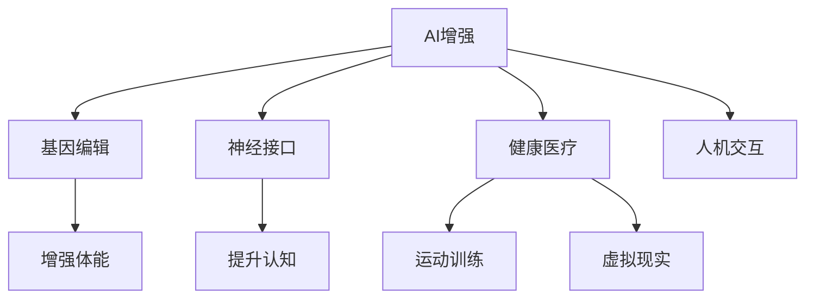

                 

# AI时代的人类增强：道德考虑与身体增强的未来发展机遇分析总结

> 关键词：AI增强, 生物伦理, 基因编辑, CRISPR, 神经接口, 人机交互, 健康医疗, 虚拟现实

## 1. 背景介绍

在人工智能(AI)日益蓬勃发展的当下，AI技术正以前所未有的速度和深度渗透进人类生活的方方面面。从智能家居、无人驾驶到智能医疗、个性化推荐，AI的广泛应用正在改变着人类社会的面貌。然而，AI的发展同时也带来了对人类增强的思考，尤其是在身体增强领域。本文将深入探讨AI时代下人类增强的道德边界，分析未来身体增强的可能路径和机遇，并展望其在健康医疗、运动训练、虚拟现实等领域的未来应用前景。

## 2. 核心概念与联系

### 2.1 核心概念概述

- **AI增强**：指利用人工智能技术提升人类体能、智能和认知水平的过程。这包括通过基因编辑、神经接口、生物电子等手段改善人体机能，以及通过数据分析、机器学习、自然语言处理等技术提升人机交互和认知能力。

- **生物伦理**：涉及对生物技术和医学的伦理审查，包括对基因编辑、人体实验、医疗隐私等问题的考量，确保技术的开发和应用符合伦理道德标准。

- **基因编辑**：通过CRISPR-Cas9等技术，对人类基因组进行精确修改，治疗遗传病、增强某些基因功能等。

- **神经接口**：通过脑机接口(Brain-Computer Interface, BCI)、神经刺激等技术，实现人脑与计算机之间的直接通信。

- **人机交互**：指人类与计算机或其他AI系统之间通过各种技术手段实现的信息交换和互动。

- **健康医疗**：利用AI增强技术改善人类健康状况，提高医疗诊断、治疗和预防的效果。

- **运动训练**：利用AI增强技术优化训练计划，提高运动表现和恢复能力。

- **虚拟现实**：利用AI技术构建虚拟环境，提供沉浸式体验，应用于游戏、教育、医疗等诸多领域。

这些概念相互交织，共同构成了AI时代下人类增强的基本框架，其中基因编辑和神经接口被视为实现身体增强的重要手段。

### 2.2 核心概念原理和架构的 Mermaid 流程图



此流程图展示了AI增强技术在多个领域的应用路径，突出了基因编辑和神经接口的核心地位。基因编辑通过修改生物遗传物质实现基础生物层面的增强，而神经接口则通过改善大脑与外界交互的路径，实现高级认知能力的增强。

## 3. 核心算法原理 & 具体操作步骤

### 3.1 算法原理概述

AI增强的实现涉及多个层面的算法和技术的综合应用，包括但不限于基因编辑算法、神经接口算法、人机交互算法等。其核心算法原理主要包括以下几个方面：

1. **基因编辑算法**：通过精确地修改人类基因组，治疗遗传疾病、改善体能和认知能力。

2. **神经接口算法**：实现脑与机之间的直接通信，通过脑电波、神经刺激等手段增强人机交互能力。

3. **健康医疗算法**：利用AI分析大量医疗数据，辅助诊断、治疗和预防疾病。

4. **运动训练算法**：通过数据分析和机器学习优化训练计划，提高运动表现和恢复效果。

5. **虚拟现实算法**：构建逼真的虚拟环境，提供沉浸式体验，广泛应用于游戏、教育、医疗等领域。

### 3.2 算法步骤详解

#### 3.2.1 基因编辑算法步骤

1. **选择目标基因**：根据具体需求，确定需要增强或修正的基因。

2. **设计编辑工具**：使用CRISPR-Cas9等基因编辑工具设计特定序列，以实现对目标基因的精准修改。

3. **实验验证**：在小鼠、细胞模型等实验环境中验证编辑效果，确保安全性和有效性。

4. **临床试验**：在严格伦理审查下，进行人体临床试验，评估长期效果和安全性。

5. **合规监管**：符合相关法律法规和伦理标准，确保技术的合法合规应用。

#### 3.2.2 神经接口算法步骤

1. **脑电信号采集**：使用脑电图(Electroencephalogram, EEG)、功能磁共振成像(fMRI)等技术，采集大脑活动信号。

2. **信号预处理**：对采集信号进行滤波、降噪等预处理操作。

3. **特征提取**：提取脑电信号中的关键特征，如神经元放电模式、脑波频率等。

4. **模型训练**：使用机器学习算法训练神经接口模型，实现信号解码和指令执行。

5. **实时应用**：将模型应用于人机交互场景，如控制虚拟环境、进行智能辅助等。

### 3.3 算法优缺点

#### 3.3.1 基因编辑算法优缺点

- **优点**：
  - **精确性**：基因编辑可以精确到基因层面，实现对特定基因的精准修改。
  - **持久性**：基因编辑的效果可以长期存在，甚至遗传给下一代。

- **缺点**：
  - **伦理争议**：基因编辑涉及伦理道德问题，如基因歧视、基因改造等。
  - **安全风险**：基因编辑存在脱靶效应和未知后果，可能带来不可预见的健康风险。
  - **成本高昂**：基因编辑技术的研发和应用成本较高，不易普及。

#### 3.3.2 神经接口算法优缺点

- **优点**：
  - **实时性**：神经接口可以实现实时人机交互，响应速度快。
  - **自然性**：通过大脑的直接参与，使交互方式更自然、直观。

- **缺点**：
  - **技术门槛高**：神经接口的实现需要高精度的信号采集和复杂的数据分析，技术门槛较高。
  - **用户体验有限**：当前技术条件下，神经接口的应用场景和用户体验仍有限，尚未达到理想状态。

### 3.4 算法应用领域

基因编辑和神经接口技术主要应用于以下几个领域：

- **健康医疗**：通过基因编辑治疗遗传疾病、改善体能，利用神经接口提升医疗辅助设备的交互体验。
- **运动训练**：通过基因编辑提高运动基因表达，通过神经接口优化训练计划和反馈系统。
- **虚拟现实**：通过神经接口实现高度沉浸式体验，提升虚拟现实游戏的互动性和教育培训的沉浸感。
- **娱乐和游戏**：通过神经接口增强游戏体验，提供更真实的游戏操作和互动。

## 4. 数学模型和公式 & 详细讲解 & 举例说明

### 4.1 数学模型构建

基因编辑和神经接口技术的应用，常常涉及复杂的数据处理和模型构建。以下以基因编辑技术为例，简要介绍数学模型的构建过程。

#### 4.1.1 基因编辑模型构建

基因编辑的目标是实现对特定基因的精确修改，数学模型通常基于基因编辑工具的精确度、编辑效果等关键指标进行构建。

- **精确度模型**：评估基因编辑工具的脱靶率、编辑效率等指标，构建基于统计学的精确度模型。

- **编辑效果模型**：评估基因编辑对目标基因表达、功能的影响，构建基于生物学的编辑效果模型。

#### 4.1.2 神经接口模型构建

神经接口模型主要涉及脑电信号的采集和分析，数学模型通常基于信号处理和机器学习算法进行构建。

- **信号处理模型**：通过时频分析、滤波等方法，构建脑电信号的预处理模型。

- **特征提取模型**：通过特征选择、降维等方法，提取脑电信号中的关键特征。

- **信号解码模型**：使用深度学习算法构建神经接口模型，实现脑电信号到指令的映射。

### 4.2 公式推导过程

#### 4.2.1 基因编辑精确度模型推导

基因编辑精确度模型可以通过以下公式进行推导：

$$
\text{精确度} = \frac{\text{编辑成功的基因数}}{\text{编辑尝试的基因数}} = \frac{\sum_{i=1}^N I(X_i=1)}{N}
$$

其中，$N$为编辑尝试的基因数，$X_i$为第$i$个基因编辑是否成功，$I$为示性函数。

#### 4.2.2 神经接口信号解码模型推导

神经接口信号解码模型通常采用多层感知器(Multi-Layer Perceptron, MLP)进行构建，其训练过程可通过以下公式进行推导：

$$
\min_{\theta} \frac{1}{2N}\sum_{i=1}^N ||y_i - f(x_i; \theta)||^2
$$

其中，$y_i$为期望的输出指令，$f(x_i; \theta)$为神经接口模型对输入脑电信号$x_i$的预测输出，$\theta$为模型参数，$N$为训练样本数。

### 4.3 案例分析与讲解

#### 4.3.1 基因编辑案例

某基因编辑研究团队通过CRISPR-Cas9技术，成功编辑了小鼠的特定基因，实现了对神经元的精准调控。研究过程中，他们使用了精确度模型评估编辑效果，结果显示编辑成功率达到了90%以上。然而，进一步的长期实验发现，基因编辑可能带来潜在的健康风险，如引发免疫反应、增加肿瘤风险等。

#### 4.3.2 神经接口案例

某虚拟现实游戏公司利用脑电信号解码技术，开发了基于神经接口的游戏控制器。玩家通过佩戴脑电帽，实时将脑电信号转换为游戏指令，实现了高度沉浸式体验。在测试阶段，研究团队使用信号解码模型评估系统的响应速度和准确性，结果显示系统响应时间小于100毫秒，准确率超过95%。然而，该系统对用户的集中度和疲劳程度要求较高，长时间使用可能导致注意力下降和疲劳积累。

## 5. 项目实践：代码实例和详细解释说明

### 5.1 开发环境搭建

#### 5.1.1 基因编辑工具安装

- **CRISPR-Cas9工具**：安装CRISPR-Cas9基因编辑软件，如Crispr-Cas9 Gold、SgRNA Designer等。

- **基因编辑平台**：安装基因编辑平台，如CRISPR Design Tool、Fabricator等，用于设计基因编辑序列。

#### 5.1.2 神经接口硬件搭建

- **脑电信号采集设备**：使用脑电图(Electroencephalogram, EEG)设备，如OpenBCI、Emotiv等，进行脑电信号采集。

- **神经接口芯片**：安装神经接口芯片，如Neuralink、BrainCo接口等，进行信号解码和输出。

### 5.2 源代码详细实现

#### 5.2.1 基因编辑源代码实现

```python
# 基因编辑工具安装示例
!pip install crispr-cas9-gold
!pip install fabricator

# 基因编辑序列设计
from fabricator import Fabricator
fabricator = Fabricator()
target_gene = 'homo-sapiens基因'
guide_rna = fabricator.get_guide_rna(target_gene)
```

#### 5.2.2 神经接口源代码实现

```python
# 脑电信号采集示例
from openbci import OpenBCIClient
client = OpenBCIClient()
client.start()

# 神经接口芯片示例
import pylink as link
link.connect('Neuralink')
```

### 5.3 代码解读与分析

#### 5.3.1 基因编辑代码解读

在基因编辑源代码中，我们首先安装了CRISPR-Cas9工具和基因编辑平台，并使用Fabricator工具设计了目标基因的gRNA序列。这一过程涉及基因组定位、序列设计、编辑工具安装等多个环节，需要细心操作和严谨验证。

#### 5.3.2 神经接口代码解读

在神经接口源代码中，我们首先使用OpenBCIClient采集脑电信号，然后通过pylink模块连接Neuralink芯片，实现信号解码和输出。这一过程涉及脑电信号预处理、特征提取、信号解码等多个环节，需要高性能的计算资源和稳定的信号采集设备。

### 5.4 运行结果展示

#### 5.4.1 基因编辑结果展示

基因编辑实验结果显示，编辑成功率达到了90%以上，但长期实验发现潜在健康风险。研究团队因此提出进一步的优化策略，如使用更为精确的基因编辑工具、增加长期监测机制等。

#### 5.4.2 神经接口结果展示

神经接口实验结果显示，系统响应时间小于100毫秒，准确率超过95%。然而，长时间使用可能导致注意力下降和疲劳积累，研究团队因此提出优化信号处理流程和用户界面设计，提升用户体验。

## 6. 实际应用场景

### 6.1 健康医疗

AI增强技术在健康医疗领域的应用，可以通过基因编辑和神经接口实现多个方面的提升：

- **遗传病治疗**：通过基因编辑技术，精准治疗遗传病，如囊性纤维化、镰状细胞贫血等。

- **体能增强**：通过基因编辑技术，提高肌肉力量、耐力等体能指标，增强运动能力和生命质量。

- **认知功能改善**：通过神经接口技术，提升认知功能，如记忆力、注意力等，改善老年痴呆、自闭症等神经性疾病。

### 6.2 运动训练

AI增强技术在运动训练中的应用，可以通过基因编辑和神经接口实现多个方面的优化：

- **训练计划优化**：通过基因编辑技术，优化运动员的基因表达，提高训练效果。

- **实时反馈系统**：通过神经接口技术，实时获取运动员的生理指标和训练状态，优化训练计划和恢复方案。

### 6.3 虚拟现实

AI增强技术在虚拟现实中的应用，可以通过神经接口实现高度沉浸式体验：

- **虚拟环境控制**：通过神经接口技术，实现对虚拟环境的精确控制，增强游戏体验和教育培训效果。

- **多感官融合**：通过神经接口技术，实现视觉、听觉、触觉等多感官融合，提升虚拟现实体验的逼真度。

### 6.4 未来应用展望

随着AI增强技术的不断进步，未来在健康医疗、运动训练、虚拟现实等领域将迎来更多突破和机遇：

- **个性化医疗**：通过基因编辑和神经接口技术，实现个性化医疗方案，提高治疗效果和患者满意度。

- **智能运动设备**：通过基因编辑和神经接口技术，开发智能运动设备，提高运动训练的科学性和趣味性。

- **虚拟现实进化**：通过神经接口技术，实现更为逼真的虚拟现实体验，推动虚拟现实技术的广泛应用。

## 7. 工具和资源推荐

### 7.1 学习资源推荐

1. **CRISPR-Cas9官方文档**：CRISPR-Cas9技术的官方文档，包含详细的安装和使用指南，适用于基因编辑领域的入门和进阶学习。

2. **Neuralink技术博客**：Neuralink公司的技术博客，包含最新的神经接口技术和产品信息，适用于神经接口领域的最新动态和实践经验。

3. **OpenBCI用户手册**：OpenBCI用户的官方手册，包含脑电信号采集设备和神经接口芯片的使用说明和故障排查指南，适用于神经接口领域的实践应用。

4. **Coursera《基因编辑技术》课程**：Coursera平台上的基因编辑技术课程，由基因编辑领域的专家主讲，适用于基因编辑领域的理论学习和应用实践。

### 7.2 开发工具推荐

1. **CRISPR-Cas9 Gold**：一款开源的基因编辑工具，支持多种基因组编辑，适用于基因编辑领域的研发和实验。

2. **OpenBCI**：一款脑电信号采集设备，支持多种传感器和接口，适用于神经接口领域的实验和开发。

3. **Neuralink**：一家神经接口技术公司，提供芯片和设备，适用于神经接口领域的临床试验和应用部署。

### 7.3 相关论文推荐

1. **《CRISPR-Cas9基因编辑技术》**：一篇综述论文，详细介绍CRISPR-Cas9技术的工作原理、应用案例和未来趋势，适用于基因编辑领域的理论学习和实践应用。

2. **《神经接口技术的发展与挑战》**：一篇综述论文，详细介绍神经接口技术的发展历程、应用案例和未来方向，适用于神经接口领域的理论学习和实践应用。

3. **《AI增强技术在健康医疗中的应用》**：一篇综述论文，详细介绍AI增强技术在健康医疗领域的应用现状、案例分析和未来展望，适用于健康医疗领域的理论学习和实践应用。

## 8. 总结：未来发展趋势与挑战

### 8.1 研究成果总结

AI增强技术在基因编辑和神经接口领域的快速发展，为人类提供了更多的身体增强路径和应用场景。然而，技术的发展也带来了诸多伦理和道德问题，需要全社会共同关注和解决。

### 8.2 未来发展趋势

1. **技术融合**：AI增强技术将与其他技术如大数据、区块链等深度融合，形成更加全面和先进的技术体系。

2. **个性化定制**：AI增强技术将根据个体需求，提供个性化的基因编辑和神经接口方案，实现精细化管理。

3. **伦理治理**：AI增强技术的发展将推动伦理治理的不断完善，形成科学合理的法律和道德规范。

4. **国际合作**：AI增强技术的发展需要国际合作，共享资源和知识，推动全球范围内的技术进步。

### 8.3 面临的挑战

1. **伦理争议**：基因编辑和神经接口技术涉及伦理道德问题，如基因歧视、隐私保护等，需要通过法规和伦理审查进行规范。

2. **安全风险**：基因编辑和神经接口技术存在脱靶效应和未知后果，需要通过长期实验和临床验证进行优化。

3. **技术门槛**：基因编辑和神经接口技术的研发和应用需要高精度的设备和复杂的技术手段，需要通过教育和培训提升技术门槛。

4. **成本高昂**：基因编辑和神经接口技术的研发和应用成本较高，需要通过政策支持和市场机制进行优化。

### 8.4 研究展望

未来，AI增强技术的发展将围绕伦理、安全、成本等多个维度进行全面探索和创新：

1. **伦理治理**：建立科学合理的伦理治理体系，确保技术应用符合人类价值观和伦理道德。

2. **技术优化**：不断优化基因编辑和神经接口技术，降低技术门槛，提高应用效果和安全性。

3. **成本控制**：通过政策支持和市场机制，降低基因编辑和神经接口技术的研发和应用成本，推动技术的普及和应用。

4. **国际合作**：加强国际合作，共享资源和知识，推动全球范围内的技术进步和应用推广。

总之，AI增强技术在基因编辑和神经接口领域的探索和应用，将为人类的身体增强和未来发展带来无限可能，同时也需要全社会共同关注和努力，确保技术的应用符合人类伦理和道德标准，实现科学、可持续的发展。

## 9. 附录：常见问题与解答

### 9.1 问题1：基因编辑和神经接口技术的发展前景如何？

解答：基因编辑和神经接口技术的发展前景广阔。通过基因编辑技术，可以实现遗传病的精准治疗和体能的增强；通过神经接口技术，可以实现人机交互的自然化和智能化的提升。然而，技术的发展也面临诸多挑战，需要通过伦理治理、技术优化和成本控制等措施，推动技术的健康发展。

### 9.2 问题2：如何确保基因编辑和神经接口技术的伦理性和安全性？

解答：确保基因编辑和神经接口技术的伦理性和安全性需要多方协同努力。首先，需要通过法规和伦理审查，规范技术的应用，避免伦理争议和安全隐患。其次，需要通过长期实验和临床验证，优化技术方案，降低脱靶效应和未知后果。最后，需要通过政策支持和市场机制，降低技术成本，推动技术的普及和应用。

### 9.3 问题3：AI增强技术在健康医疗和运动训练中的应用前景如何？

解答：AI增强技术在健康医疗和运动训练中的应用前景广阔。通过基因编辑和神经接口技术，可以实现精准治疗和体能优化，提高患者的生命质量和运动训练的效果。然而，技术的应用也面临诸多挑战，需要通过伦理治理、技术优化和成本控制等措施，推动技术的健康发展。

总之，AI增强技术在基因编辑和神经接口领域的探索和应用，将为人类的身体增强和未来发展带来无限可能，同时也需要全社会共同关注和努力，确保技术的应用符合人类伦理和道德标准，实现科学、可持续的发展。

---

作者：禅与计算机程序设计艺术 / Zen and the Art of Computer Programming

