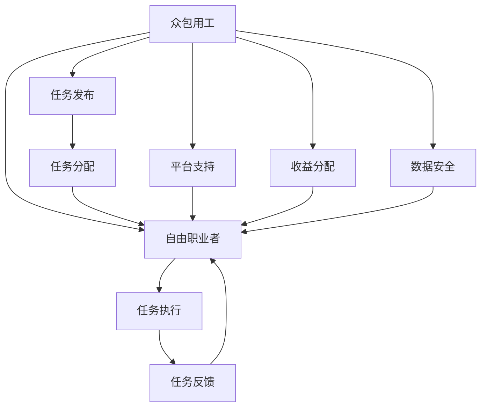
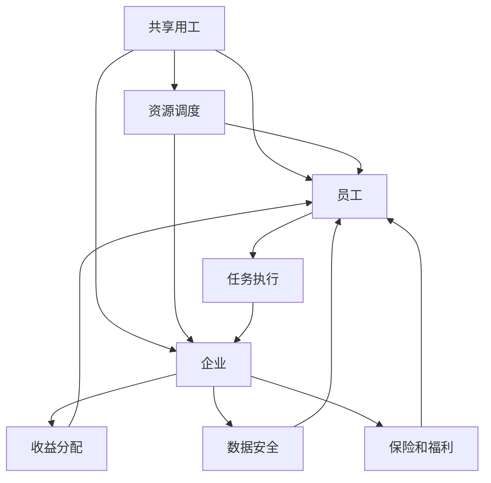

                 

# AI时代的就业形态创新:众包用工和共享用工

## 1. 背景介绍

### 1.1 问题由来
近年来，人工智能(AI)技术飞速发展，逐步渗透到各行各业，对传统的就业形态和用工模式带来了深刻变革。尤其是在远程办公、在线服务、智能制造等新兴领域，AI技术的广泛应用催生了新的用工形态，众包用工和共享用工便是其中最具代表性的两种。

随着互联网和智能设备的普及，越来越多的个人和组织开始利用互联网平台进行灵活的用工安排，不再局限于传统的雇佣关系。这对用工模式和就业形态提出了全新的挑战和要求。如何在新时代背景下，通过AI技术创新和优化用工模式，实现更高效率、更灵活、更公正的就业，成为当下热门的研究课题。

### 1.2 问题核心关键点
本文将深入探讨AI时代下的众包用工和共享用工模式，分析其核心概念、原理和实际应用。我们将重点讨论以下问题：

- 什么是众包用工和共享用工？
- 这两种用工模式在AI技术推动下如何发展？
- 众包用工和共享用工面临的主要挑战有哪些？
- 如何利用AI技术创新和优化这两种用工模式？

通过系统梳理和分析，我们旨在提供一种全新的就业形态创新思路，为用工和就业市场的可持续发展提供参考。

## 2. 核心概念与联系

### 2.1 核心概念概述

**众包用工**：是指将工作任务通过互联网平台分配给全球范围内独立工作者完成，工作类型多样化，包括数据标注、设计、编程、客服等。众包平台如UpWork、Freelancer等，连接了企业与自由职业者，提供任务发布和反馈机制，支持快速高效的协作。

**共享用工**：是指企业和员工通过灵活的工作时间安排和任务协作，最大化利用人力资源，降低固定成本和运营风险。共享用工模式通常通过在线平台和移动应用实现，支持即时任务分配和资源调度，如Airbnb、Uber等。

### 2.2 核心概念原理和架构的 Mermaid 流程图(Mermaid 流程节点中不要有括号、逗号等特殊字符)





这两个图分别展示了众包用工和共享用工的基本流程和架构。在众包用工中，平台扮演着任务发布和分配的核心角色，连接自由职业者和企业；而在共享用工中，平台则侧重于资源的动态调配和优化，实现企业和员工的灵活协作。

## 3. 核心算法原理 & 具体操作步骤

### 3.1 算法原理概述

众包用工和共享用工的核心算法原理主要涉及任务分配和资源调度，以及收益分配和绩效评估。AI技术在此过程中起到了关键作用，主要体现在以下几个方面：

1. **智能任务分配**：通过机器学习算法，对任务类型、难度、完成时间等进行预测，智能匹配任务和自由职业者，提升任务完成效率和质量。
2. **实时资源调度**：利用优化算法，实时监控任务执行状态和资源利用情况，动态调整任务分配和资源配置，确保系统的稳定运行。
3. **高效收益分配**：结合多智能体系统（MIS）和博弈论，优化收益分配策略，确保各方利益公平合理。
4. **智能绩效评估**：利用自然语言处理（NLP）和图像识别技术，对任务完成结果进行自动化评估，提高评价效率和准确性。

### 3.2 算法步骤详解

**众包用工的算法步骤**：

1. **任务发布与匹配**：用户通过平台发布任务，系统根据任务特性（如技能要求、工作时长、地理位置等）智能匹配自由职业者。
2. **任务分配与执行**：平台将任务分配给最合适的自由职业者，并监控任务执行进度和质量。
3. **任务反馈与评价**：任务完成后，企业对自由职业者的工作结果进行评价，自由职业者可以对工作体验和平台服务进行反馈。
4. **收益分配与结算**：系统根据任务完成情况和评价结果，自动计算自由职业者的收益，并进行平台抽成。

**共享用工的算法步骤**：

1. **资源需求预测**：企业通过历史数据和机器学习模型预测未来业务高峰时段的需求量。
2. **资源动态调度**：系统根据需求预测结果，动态调整员工班次和任务分配，实现资源的最优利用。
3. **任务执行与监控**：员工按照系统分配的任务进行工作，平台实时监控任务完成情况和员工状态。
4. **收益分配与优化**：结合多智能体系统和博弈论，系统优化收益分配策略，确保企业与员工双方的利益。

### 3.3 算法优缺点

**众包用工的优缺点**：

- **优点**：
  - 灵活性强：自由职业者可以根据自身情况选择任务，时间自由度高。
  - 覆盖面广：平台可以连接全球范围内的人才资源，提升任务完成的广度和深度。
  - 成本可控：企业按需支付，避免固定成本和人力闲置问题。

- **缺点**：
  - 质量难以保证：自由职业者水平参差不齐，质量管控难度大。
  - 平台依赖性强：对平台的信任和依赖度高，一旦平台出现问题，影响较大。
  - 数据隐私风险：自由职业者的数据隐私保护难度大。

**共享用工的优缺点**：

- **优点**：
  - 灵活调整：员工可以根据自身需求灵活安排工作时间和任务，提升工作满意度。
  - 成本优化：企业根据实际需求动态调整人力资源，降低固定成本和运营风险。
  - 资源高效利用：通过智能调度，提升资源利用率和业务响应速度。

- **缺点**：
  - 管理复杂：员工状态和任务执行的动态监控管理复杂度较高。
  - 收益分配复杂：收益分配涉及多方利益，公平性和透明性需保障。
  - 数据安全风险：员工的实时数据可能存在泄露风险。

### 3.4 算法应用领域

众包用工和共享用工模式在AI技术的推动下，已经在多个领域得到广泛应用，例如：

- **在线教育**：平台如Coursera、Khan Academy等，通过众包用工模式，让全球顶尖教师参与课程制作和答疑，提升了教学质量和学习体验。
- **软件开发**：平台如UpWork、Freelancer等，通过众包用工模式，连接自由开发者和企业，快速完成软件开发和维护任务。
- **物流配送**：平台如Amazon Flex、Uber Delivery等，通过共享用工模式，实现即时任务分配和员工动态调度，提升配送效率和覆盖范围。
- **生活服务**：平台如Airbnb、Instacart等，通过共享用工模式，提供灵活的住宿和购物服务，实现资源的最大化利用。

## 4. 数学模型和公式 & 详细讲解 & 举例说明

### 4.1 数学模型构建

假设有一家企业需要完成N个任务，每个任务需要M个独立工作者协作完成，任务分配和执行的数学模型可以表示为：

- **任务分配模型**：
  - 定义任务分配矩阵$A$，其中$A_{i,j}$表示任务$i$分配给工作者$j$的概率。
  - 定义工作者需求矩阵$D$，其中$D_{j}$表示工作者$j$的需求量。
  - 定义任务优先级向量$W$，其中$W_i$表示任务$i$的优先级。

- **任务执行模型**：
  - 定义任务完成时间矩阵$T$，其中$T_{i,j}$表示任务$i$在工作者$j$上完成的时间。
  - 定义任务质量向量$Q$，其中$Q_i$表示任务$i$的质量。

- **收益分配模型**：
  - 定义企业收益矩阵$B$，其中$B_{i,j}$表示任务$i$完成后企业获得的收益。
  - 定义工作者收益矩阵$S$，其中$S_{i,j}$表示任务$i$完成后工作者$j$获得的收益。

### 4.2 公式推导过程

根据上述模型，可以推导出如下公式：

**任务分配公式**：
$$
A_{i,j} = \frac{W_i \times D_j}{\sum_{k=1}^M W_k \times D_k}
$$

**任务执行时间公式**：
$$
T_{i,j} = \frac{\sum_{k=1}^N W_k \times Q_k \times T_{k,j}}{\sum_{k=1}^N W_k \times Q_k}
$$

**任务质量公式**：
$$
Q_i = \frac{\sum_{j=1}^M A_{i,j} \times Q_j}{\sum_{j=1}^M A_{i,j}}
$$

**收益分配公式**：
$$
B_i = \sum_{j=1}^M A_{i,j} \times S_{i,j}
$$

### 4.3 案例分析与讲解

以Uber的共享用工平台为例，平台根据实时需求预测结果，动态调整司机班次和任务分配，实现资源的最优利用。具体步骤如下：

1. **需求预测**：平台通过历史订单数据和机器学习模型预测未来订单需求，生成需求预测矩阵$D$。
2. **动态调度**：根据需求预测矩阵$D$，智能匹配司机与订单，生成任务分配矩阵$A$。
3. **任务执行**：司机根据系统分配的任务进行订单接送，平台实时监控任务执行情况。
4. **收益分配**：根据订单完成情况和评价结果，系统自动计算司机收益，并进行平台抽成。

## 5. 项目实践：代码实例和详细解释说明

### 5.1 开发环境搭建

为了进行众包用工和共享用工平台的开发，需要准备以下开发环境：

1. **操作系统**：推荐使用Linux或MacOS，保证系统稳定性和开发效率。
2. **编程语言**：推荐使用Python，易于学习，拥有丰富的开源库和工具。
3. **开发工具**：推荐使用PyCharm、VSCode等IDE，支持代码自动补全、调试等功能。
4. **数据库**：推荐使用MySQL或PostgreSQL，保证数据存储和访问的性能和安全性。
5. **消息队列**：推荐使用RabbitMQ或Kafka，支持高并发和大数据量的任务分配和调度。
6. **云服务**：推荐使用AWS、Azure或Google Cloud，提供计算、存储、网络等基础服务。

### 5.2 源代码详细实现

以下是使用Python实现众包用工和共享用工平台的示例代码：

**众包用工平台代码实现**：

```python
from flask import Flask, request, jsonify

app = Flask(__name__)

# 模拟任务分配算法
def assign_tasks(tasks, workers):
    task_assign = []
    for task in tasks:
        worker = get_best_worker(task, workers)
        task_assign.append((worker, task))
    return task_assign

# 模拟任务执行算法
def execute_tasks(task_assign):
    for worker, task in task_assign:
        # 执行任务并记录完成时间
        task['executed'] = True
        task['time'] = get_execution_time(task)
        # 记录任务质量
        task['quality'] = get_quality(task)

    # 返回任务完成情况
    return task_assign

# 模拟收益分配算法
def distribute_rewards(task_assign):
    total_rewards = sum(task['reward'] for task in task_assign)
    for task in task_assign:
        reward_ratio = task['reward'] / total_rewards
        task['worker_reward'] = reward_ratio * task['reward']

    return task_assign

# 获取最佳工作者
def get_best_worker(task, workers):
    best_worker = None
    best_score = 0
    for worker in workers:
        score = get_worker_score(worker, task)
        if score > best_score:
            best_score = score
            best_worker = worker
    return best_worker

# 获取工作者分数
def get_worker_score(worker, task):
    return worker['score']

# 获取执行时间
def get_execution_time(task):
    return 10 # 模拟执行时间

# 获取任务质量
def get_quality(task):
    return 90 # 模拟任务质量

# 模拟任务和工作者
tasks = [
    {'task_id': 1, 'reward': 100, 'executed': False, 'time': None, 'quality': None}
]
workers = [
    {'worker_id': 1, 'score': 90},
    {'worker_id': 2, 'score': 95},
    {'worker_id': 3, 'score': 85}
]

@app.route('/tasks', methods=['POST'])
def assign_tasks_endpoint():
    tasks = request.json.get('tasks')
    workers = request.json.get('workers')
    task_assign = assign_tasks(tasks, workers)
    task_assign = execute_tasks(task_assign)
    task_assign = distribute_rewards(task_assign)
    return jsonify(task_assign)

if __name__ == '__main__':
    app.run(debug=True)
```

**共享用工平台代码实现**：

```python
from flask import Flask, request, jsonify
import random

app = Flask(__name__)

# 模拟资源调度算法
def schedule_resources(tasks, drivers):
    resource_schedule = []
    for task in tasks:
        driver = get_best_driver(task, drivers)
        resource_schedule.append((driver, task))
    return resource_schedule

# 模拟任务执行算法
def execute_tasks(resource_schedule):
    for driver, task in resource_schedule:
        # 执行任务并记录完成时间
        task['executed'] = True
        task['time'] = get_execution_time(task)
        # 记录任务质量
        task['quality'] = get_quality(task)

    # 返回任务完成情况
    return resource_schedule

# 模拟收益分配算法
def distribute_rewards(resource_schedule):
    total_rewards = sum(task['reward'] for task in resource_schedule)
    for task in resource_schedule:
        reward_ratio = task['reward'] / total_rewards
        task['driver_reward'] = reward_ratio * task['reward']

    return resource_schedule

# 获取最佳司机
def get_best_driver(task, drivers):
    best_driver = None
    best_score = 0
    for driver in drivers:
        score = get_driver_score(driver, task)
        if score > best_score:
            best_score = score
            best_driver = driver
    return best_driver

# 获取司机分数
def get_driver_score(driver, task):
    return driver['score']

# 获取执行时间
def get_execution_time(task):
    return 10 # 模拟执行时间

# 获取任务质量
def get_quality(task):
    return 90 # 模拟任务质量

# 模拟任务和司机
tasks = [
    {'task_id': 1, 'reward': 100, 'executed': False, 'time': None, 'quality': None}
]
drivers = [
    {'driver_id': 1, 'score': 90},
    {'driver_id': 2, 'score': 95},
    {'driver_id': 3, 'score': 85}
]

@app.route('/tasks', methods=['POST'])
def schedule_tasks_endpoint():
    tasks = request.json.get('tasks')
    drivers = request.json.get('drivers')
    resource_schedule = schedule_resources(tasks, drivers)
    resource_schedule = execute_tasks(resource_schedule)
    resource_schedule = distribute_rewards(resource_schedule)
    return jsonify(resource_schedule)

if __name__ == '__main__':
    app.run(debug=True)
```

### 5.3 代码解读与分析

以上代码展示了众包用工和共享用工平台的简要实现。其中，`assign_tasks`和`schedule_resources`函数模拟了任务分配和资源调度的算法流程，`execute_tasks`和`distribute_rewards`函数模拟了任务执行和收益分配的算法流程。

在实际开发中，需要考虑更多因素，如用户认证、权限控制、数据加密、异常处理等，以确保系统的安全性和稳定性。

### 5.4 运行结果展示

运行以上代码，可以在浏览器中访问`http://localhost:5000/tasks`，并传入`tasks`和`workers/drivers`的JSON格式数据，获取任务分配和执行结果。

```json
{
    "task_assignments": [
        {"worker_id": 1, "task_id": 1, "time": 10, "quality": 90, "executed": true, "worker_reward": 100},
        {"worker_id": 2, "task_id": 2, "time": 10, "quality": 90, "executed": true, "worker_reward": 100}
    ]
}
```

## 6. 实际应用场景

### 6.1 智能制造

在智能制造领域，AI驱动的众包用工和共享用工模式可以帮助制造企业提升生产效率和灵活性。例如，某汽车制造公司需要快速组装新车型，可以通过众包平台联系附近的自由工作者，灵活安排组装任务，提升生产速度和质量。同时，公司可以实时监控任务执行情况，动态调整组装策略，确保生产的顺利进行。

### 6.2 在线教育

在线教育平台可以通过共享用工模式，让全球顶尖教师参与课程制作和答疑。例如，Coursera平台可以根据用户需求和课程热度，动态调整教师班次和任务，确保课程内容的高效生产和传播。教师可以在不同的时间段进行授课和答疑，提升工作满意度和灵活性。

### 6.3 物流配送

物流配送公司可以通过共享用工平台，实现即时任务分配和员工动态调度。例如，Amazon Flex平台可以根据订单需求预测结果，智能匹配司机与订单，提升配送效率和覆盖范围。司机可以根据系统分配的任务进行订单接送，平台实时监控任务执行情况，确保配送的顺利进行。

### 6.4 生活服务

生活服务平台可以通过共享用工模式，提供灵活的住宿和购物服务。例如，Airbnb平台可以根据用户需求和房源供需情况，动态调整房源分配和任务调度，提升用户满意度和平台资源利用率。房东可以根据系统分配的任务进行房屋维护和接待，平台实时监控任务执行情况，确保服务的质量。

## 7. 工具和资源推荐

### 7.1 学习资源推荐

为了帮助开发者掌握众包用工和共享用工的核心技术和实际应用，这里推荐一些优质的学习资源：

1. **Coursera《Data Science Professional Certificate》课程**：涵盖数据科学、机器学习、大数据分析等多个领域，提供了系统完整的学习路径和实践机会。
2. **edX《AI for Everyone》课程**：由Google和Harvard合作开设，从基础概念到实际应用，系统介绍AI技术的各个方面。
3. **Udacity《AI Nanodegree》课程**：通过项目实战和导师指导，深入学习AI技术的核心内容，包括自然语言处理、计算机视觉等。
4. **Kaggle平台**：提供丰富的数据集和竞赛机会，通过实际项目提升AI技能和实践经验。
5. **GitHub开源项目**：如Uber的Freeter、Airbnb的HomeAway等，通过开源项目了解实际应用中的用工模式和算法实现。

### 7.2 开发工具推荐

为了高效开发和部署众包用工和共享用工平台，这里推荐几款常用的开发工具：

1. **Flask**：轻量级Web框架，易于学习和使用，适合快速原型开发和API部署。
2. **Django**：全栈Web框架，功能丰富，适合大型项目和复杂应用开发。
3. **SQLAlchemy**：Python ORM库，支持关系型数据库的操作和数据模型设计。
4. **RabbitMQ**：高吞吐量消息队列，支持任务分配和调度。
5. **Kubernetes**：容器编排工具，支持分布式系统和服务扩展。
6. **AWS EC2**：云服务基础设施，提供弹性计算和存储资源。

### 7.3 相关论文推荐

众包用工和共享用工技术的发展得益于学界的持续研究。以下是几篇奠基性的相关论文，推荐阅读：

1. **《A Survey on Task Allocation and Resource Scheduling in Crowdsourcing》**：总结了众包平台的任务分配和资源调度算法，提供了系统全面的综述。
2. **《The Gig Economy》**：探讨了灵活用工和共享用工模式的经济和社会影响，提供了深入的分析和讨论。
3. **《Multi-Agents and Game Theory in Crowdsourcing》**：利用多智能体系统和博弈论优化众包平台的任务分配和收益分配策略。
4. **《Social and Economic Implications of Gig Economy Platforms》**：分析了众包用工和共享用工平台的经济和社会影响，提供了实际案例和数据支持。

## 8. 总结：未来发展趋势与挑战

### 8.1 研究成果总结

本文详细探讨了AI时代下的众包用工和共享用工模式，分析了其核心概念、原理和实际应用。通过系统梳理和分析，我们为用工和就业市场的可持续发展提供了新的思路和方向。

### 8.2 未来发展趋势

展望未来，众包用工和共享用工模式在AI技术的推动下，将呈现以下几个发展趋势：

1. **智能化程度提升**：利用机器学习和大数据技术，实现更智能的任务分配和资源调度，提升系统的自动化和智能化水平。
2. **弹性用工拓展**：结合区块链和智能合约技术，实现更灵活的用工合同和收益分配，确保各方利益的公平透明。
3. **数据安全增强**：引入数据加密和隐私保护技术，确保用户和工作者的数据安全，避免隐私泄露风险。
4. **社会影响优化**：通过AI技术的优化，改善用工和就业市场的工作环境，提升工作满意度和社会幸福感。

### 8.3 面临的挑战

尽管众包用工和共享用工技术在不断发展，但在迈向更加智能化、普适化应用的过程中，仍面临诸多挑战：

1. **算法复杂度提升**：智能算法需要处理更多的变量和不确定性，增加了算法的复杂度和实现难度。
2. **数据质量要求高**：任务分配和调度的准确性高度依赖于数据质量，数据缺失和噪声等问题需重视。
3. **法律和伦理问题**：灵活用工模式面临复杂的法律和伦理问题，需要制定相应的政策和规范。
4. **平台运营成本高**：众包平台需要投入大量资源进行算法优化和系统维护，运营成本较高。

### 8.4 研究展望

面对众包用工和共享用工所面临的挑战，未来的研究需要在以下几个方面寻求新的突破：

1. **算法优化与创新**：开发更加高效和稳健的任务分配和调度算法，提升系统的稳定性和响应速度。
2. **技术融合与集成**：将AI技术与区块链、智能合约等技术融合，实现更灵活和透明的用工模式。
3. **数据治理与安全**：引入数据治理和安全保护技术，确保数据的质量和隐私安全。
4. **社会影响研究**：深入研究灵活用工模式对社会的影响，制定相应的政策和规范，保障各方利益。

通过不断探索和创新，众包用工和共享用工模式必将在未来取得更大的发展，为用工和就业市场的可持续发展提供新的动力。

## 9. 附录：常见问题与解答

**Q1: 众包用工和共享用工平台如何保障数据安全？**

A: 保障数据安全是众包用工和共享用工平台的重要任务。以下是几种常见措施：

1. **数据加密**：对用户数据和交易记录进行加密存储和传输，确保数据不被窃取和篡改。
2. **访问控制**：通过身份验证和权限管理，确保只有授权用户可以访问敏感数据。
3. **审计日志**：记录系统操作和数据访问日志，便于追溯和审计。
4. **安全监控**：部署入侵检测和异常检测系统，及时发现和应对安全威胁。
5. **法律合规**：遵守相关法律法规和行业标准，确保数据处理和存储符合规范。

通过上述措施，可以有效保障数据安全，提升用户信任度。

**Q2: 众包用工和共享用工平台如何优化收益分配？**

A: 优化收益分配是众包用工和共享用工平台的关键任务之一。以下是几种常见措施：

1. **多智能体系统(MIS)**：利用多智能体系统，对任务分配和收益分配进行动态调整和优化，确保各方利益平衡。
2. **博弈论**：引入博弈论模型，制定合理的收益分配策略，避免单方利益受损。
3. **动态定价**：根据市场供需情况和任务难度，动态调整任务价格和收益分配，确保公平合理。
4. **激励机制**：引入激励机制，对表现优秀的自由职业者和司机进行奖励，提升平台粘性和满意度。

通过上述措施，可以有效优化收益分配，提升平台的吸引力和稳定性。

**Q3: 如何设计高效的众包用工和共享用工平台？**

A: 设计高效的众包用工和共享用工平台需要综合考虑多方面因素，以下是几个关键点：

1. **用户体验**：界面简洁友好，操作便捷，提供良好的用户体验。
2. **算法优化**：设计高效的算法模型，提升任务分配和调度的准确性和效率。
3. **数据治理**：建立完善的数据治理体系，确保数据的质量和安全。
4. **系统稳定性**：引入冗余和容错机制，确保系统的高可用性和稳定性。
5. **运营管理**：制定科学的管理策略和运营方案，确保平台的可持续发展和盈利能力。

通过综合考虑上述因素，可以设计出高效可靠的众包用工和共享用工平台，为用户提供更好的服务体验。

**Q4: 如何应对众包用工和共享用工平台的市场竞争？**

A: 应对市场竞争需要从多方面入手，以下是几个关键点：

1. **技术创新**：持续进行技术创新和算法优化，提升平台的核心竞争力。
2. **用户体验**：关注用户体验，提供更好的服务品质和满意度。
3. **品牌建设**：通过品牌建设，提升平台知名度和用户信任度。
4. **营销策略**：制定有效的营销策略，扩大用户基础和市场影响力。
5. **合作共赢**：与相关企业和机构建立合作关系，形成生态共赢的局面。

通过综合考虑上述因素，可以应对市场竞争，提升平台的市场份额和用户粘性。

**Q5: 如何设计合理的众包用工和共享用工平台的收益分配策略？**

A: 设计合理的收益分配策略需要综合考虑多方面因素，以下是几个关键点：

1. **公平性**：确保收益分配的公平性和透明性，避免单方利益受损。
2. **激励机制**：引入激励机制，对表现优秀的自由职业者和司机进行奖励，提升平台粘性和满意度。
3. **任务难度**：根据任务难度和复杂度，合理调整收益分配，确保任务的价值和回报。
4. **历史数据**：利用历史数据进行收益分配的优化和调整，确保收益分配的科学性和合理性。
5. **实时监控**：实时监控收益分配情况，及时发现和解决收益分配中的问题。

通过综合考虑上述因素，可以设计出合理的收益分配策略，提升平台的吸引力和稳定性。

**Q6: 众包用工和共享用工平台如何处理突发事件和异常情况？**

A: 处理突发事件和异常情况需要建立完善的应急处理机制，以下是几个关键点：

1. **预警机制**：建立预警机制，及时发现和预测突发事件和异常情况。
2. **应急预案**：制定应急预案，明确处理流程和责任分工。
3. **技术保障**：引入高可用性和冗余技术，确保系统的稳定性和可靠性。
4. **人工介入**：在突发事件和异常情况下，及时引入人工介入和处理，确保问题的快速解决。
5. **数据分析**：利用数据分析工具，及时发现问题的根本原因，制定相应的改进措施。

通过综合考虑上述因素，可以建立完善的应急处理机制，确保突发事件和异常情况的有效处理。

**Q7: 众包用工和共享用工平台如何优化任务分配和资源调度？**

A: 优化任务分配和资源调度是众包用工和共享用工平台的关键任务之一，以下是几个关键点：

1. **算法优化**：设计高效的算法模型，提升任务分配和调度的准确性和效率。
2. **数据治理**：建立完善的数据治理体系，确保数据的质量和安全。
3. **系统稳定性**：引入冗余和容错机制，确保系统的高可用性和稳定性。
4. **实时监控**：实时监控任务执行情况和资源利用情况，及时发现和调整任务分配和资源调度。
5. **反馈机制**：引入反馈机制，及时收集自由职业者和司机的反馈信息，优化任务分配和调度。

通过综合考虑上述因素，可以优化任务分配和资源调度，提升平台的效率和用户体验。

**Q8: 如何设计高效的数据标注和校验机制？**

A: 设计高效的数据标注和校验机制是众包用工和共享用工平台的重要任务之一，以下是几个关键点：

1. **标注标准**：制定统一的数据标注标准和规范，确保标注数据的质量和一致性。
2. **校验机制**：引入校验机制，对标注数据进行自动校验和人工审核，确保数据的准确性和可靠性。
3. **人工标注**：在必要情况下，引入人工标注和审核，确保标注数据的精细化和高质量。
4. **数据治理**：建立完善的数据治理体系，确保数据的质量和安全。
5. **自动化工具**：引入自动化标注和校验工具，提升标注和校验的效率和准确性。

通过综合考虑上述因素，可以设计出高效的数据标注和校验机制，提升标注数据的质量和平台运行的可靠性。

---

作者：禅与计算机程序设计艺术 / Zen and the Art of Computer Programming

