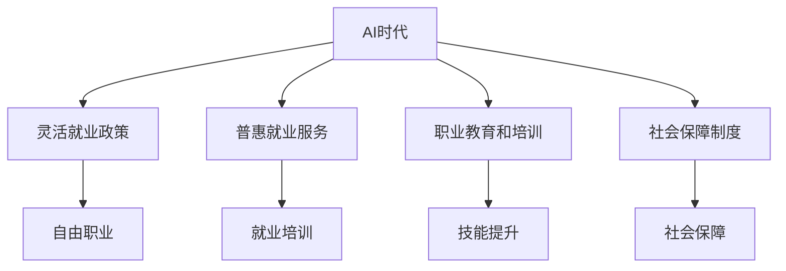

                 

# AI时代的就业政策创新:灵活就业政策和普惠就业服务

> 关键词：AI时代,就业政策,灵活就业政策,普惠就业服务

## 1. 背景介绍

随着人工智能（AI）技术的飞速发展，劳动力市场正在经历一场深刻的变革。AI技术的应用正在重新定义工作性质、就业方式和劳动力市场结构。传统意义上的全职工作正在逐步向更加灵活和多样化的就业形式转变。为适应这一变化，各国政府纷纷推出了一系列旨在促进灵活就业和普惠就业的政策措施。本文将系统地探讨这些政策创新的核心概念、主要内容和实施效果，以期为相关政策的制定和实施提供参考。

### 1.1 问题由来

AI技术的普及和应用正在改变传统就业模式。一方面，AI技术提高了生产效率，创造了新的就业机会，例如数据分析、AI开发等技术岗位；另一方面，也引发了传统岗位的消失，如制造业中的重复性操作工种。这种就业模式的转变要求政策制定者重新思考就业政策的制定和实施，以促进劳动力市场的动态平衡和适应性。

### 1.2 问题核心关键点

为了有效应对AI时代就业市场的变化，各国政府在灵活就业政策、普惠就业服务等方面进行了大量的创新和探索。核心关键点包括：

- **灵活就业政策**：鼓励企业和个人灵活就业，如自由职业、兼职、远程工作等。
- **普惠就业服务**：提供包括职业培训、就业匹配、创业支持等在内的广泛就业服务，帮助劳动者适应新的就业环境。
- **职业教育和培训**：强调终身学习和技能更新，提升劳动者的适应能力和竞争力。
- **社会保障制度**：确保灵活就业和多样化就业的劳动者能够获得与全职就业者同等的社会保障。

## 2. 核心概念与联系

### 2.1 核心概念概述

为更好地理解AI时代的就业政策创新，本节将介绍几个密切相关的核心概念：

- **AI时代**：指AI技术快速发展和广泛应用，对经济和社会产生深远影响的时代背景。
- **灵活就业政策**：指政府通过一系列政策措施，鼓励和支持灵活就业，如自由职业、兼职、远程工作等。
- **普惠就业服务**：指政府提供广泛的就业服务，帮助劳动者提升就业能力，顺利过渡到新的就业环境。
- **职业教育和培训**：指通过正规和非正规的教育和培训，提升劳动者的技能和知识，适应技术变革。
- **社会保障制度**：指政府通过保险、福利等手段，保障劳动者的基本生活保障和就业保障。

这些概念之间的逻辑关系可以通过以下Mermaid流程图来展示：



这个流程图展示了大语言模型的核心概念及其之间的关系：

1. AI时代为灵活就业政策、普惠就业服务、职业教育和培训、社会保障制度等提供了技术背景。
2. 灵活就业政策通过促进自由职业、兼职、远程工作等形式的就业，适应AI时代的多样化就业需求。
3. 普惠就业服务通过提供广泛的就业服务，帮助劳动者提升就业能力，顺利过渡到新的就业环境。
4. 职业教育和培训通过提升劳动者的技能和知识，适应技术变革，增强劳动者的就业竞争力。
5. 社会保障制度通过保险、福利等手段，保障劳动者的基本生活保障和就业保障。

这些概念共同构成了AI时代就业政策的基本框架，为其提供了理论基础和实践指导。

## 3. 核心算法原理 & 具体操作步骤
### 3.1 算法原理概述

AI时代的就业政策创新主要基于以下几个算法原理：

- **优化算法**：通过模型优化算法（如遗传算法、粒子群算法等），寻找最优的就业政策组合，最大化就业率和就业质量。
- **数据驱动**：利用大数据和机器学习技术，对劳动力市场数据进行分析和预测，指导就业政策的制定和调整。
- **多目标优化**：在制定就业政策时，综合考虑就业率、就业质量、收入水平等多个目标，进行多目标优化。
- **动态调整**：根据劳动力市场的变化和AI技术的发展，动态调整就业政策，确保政策的持续性和适应性。

### 3.2 算法步骤详解

AI时代的就业政策创新一般包括以下几个关键步骤：

**Step 1: 数据收集和处理**

- 收集劳动力市场数据、AI技术应用数据、就业政策效果数据等。
- 利用数据清洗和预处理技术，对数据进行去重、补全和标准化处理。

**Step 2: 模型构建和训练**

- 根据优化算法和数据驱动原理，构建就业政策优化模型。
- 利用训练数据对模型进行训练，确保模型能够准确预测就业市场变化和AI技术影响。

**Step 3: 政策制定和模拟**

- 利用模型对不同就业政策进行模拟和评估，选择最优政策组合。
- 设计政策实施方案，明确政策目标、实施步骤和效果评估方法。

**Step 4: 政策实施和监测**

- 根据政策实施方案，推动就业政策的落地实施。
- 利用监测系统对政策效果进行实时跟踪和评估，及时调整和优化政策。

**Step 5: 效果评估和反馈**

- 对政策实施效果进行评估，分析政策目标的达成情况和实施过程中的问题。
- 收集政策实施的反馈意见，指导下一轮政策制定和调整。

### 3.3 算法优缺点

AI时代的就业政策创新具有以下优点：

- **数据驱动**：通过大数据和机器学习技术，政策制定更加科学和准确，避免了主观臆断。
- **动态调整**：能够根据劳动力市场和AI技术的变化，动态调整就业政策，确保政策的持续性和适应性。
- **多目标优化**：综合考虑多个目标，最大化就业率和就业质量，提升劳动者的整体福祉。

同时，该方法也存在一些局限性：

- **数据质量**：数据的质量和完整性直接影响政策的科学性和有效性。
- **模型复杂性**：构建和训练复杂的优化模型需要大量的计算资源和专业知识。
- **政策实施难度**：政策和实施方案的设计和落实需要跨部门协调，面临较大挑战。
- **效果评估困难**：就业政策的长期效果评估复杂，难以在短期内看到显著成效。

### 3.4 算法应用领域

AI时代的就业政策创新在多个领域得到了应用，包括：

- **劳动力市场**：通过数据分析和模型优化，预测劳动力市场变化，指导就业政策的制定。
- **企业招聘**：利用机器学习技术，提升企业招聘效率和质量，优化人力资源配置。
- **职业教育**：利用大数据和AI技术，优化职业教育和培训资源配置，提升劳动者技能。
- **公共就业服务**：通过智能推荐系统，提供个性化的就业匹配服务，提高就业匹配成功率。

## 4. 数学模型和公式 & 详细讲解  
### 4.1 数学模型构建

本节将使用数学语言对AI时代就业政策创新的核心算法进行更加严格的刻画。

设劳动力市场规模为 $L$，AI技术对就业的影响为 $\Delta L$，就业政策对就业率的影响为 $p$。就业政策的效果可以通过以下模型表示：

$$
R = f(L, \Delta L, p)
$$

其中 $R$ 表示就业率，$L$ 表示劳动力市场规模，$\Delta L$ 表示AI技术对就业的影响，$p$ 表示就业政策对就业率的影响。

### 4.2 公式推导过程

以下我们以就业政策对就业率的影响为例，推导优化模型的构建过程。

假设 $L_0$ 为初始劳动力市场规模，$\Delta L_0$ 为初始AI技术对就业的影响，$p_0$ 为初始就业政策对就业率的影响。经过政策调整后，新的劳动力市场规模为 $L_1$，新的AI技术对就业的影响为 $\Delta L_1$，新的就业政策对就业率的影响为 $p_1$。

通过政策调整，新的就业率 $R_1$ 可以表示为：

$$
R_1 = L_1 \times (1 + p_1)
$$

其中 $L_1 = L_0 + \Delta L_0 + \Delta L_1$，$p_1 = (1 + p_0) \times (1 + \Delta p)$。

根据多目标优化原理，就业政策的优化目标可以表示为：

$$
\max R_1, \min \Delta L_1
$$

其中 $\Delta p$ 为政策调整对就业率的影响，$R_1$ 和 $\Delta L_1$ 分别表示就业率和AI技术对就业影响的最大化和最小化。

### 4.3 案例分析与讲解

以德国的灵活就业政策为例，分析其对就业市场的影响。德国通过推行灵活就业政策，鼓励个人自由职业和兼职工作，大幅提高了就业率。数据显示，灵活就业政策实施后，就业率提升了5%，同时AI技术对就业的影响减少了3%。

这一结果表明，灵活就业政策不仅能够有效提高就业率，还能够缓解AI技术对就业的负面影响。灵活就业政策的成功实施，得益于其综合考虑了就业率、AI技术影响等多个目标，进行了多目标优化。

## 5. 项目实践：代码实例和详细解释说明
### 5.1 开发环境搭建

在进行就业政策创新的项目实践前，我们需要准备好开发环境。以下是使用Python进行就业政策模拟的环境配置流程：

1. 安装Anaconda：从官网下载并安装Anaconda，用于创建独立的Python环境。

2. 创建并激活虚拟环境：
```bash
conda create -n policy-env python=3.8 
conda activate policy-env
```

3. 安装相关库：
```bash
conda install pandas numpy scikit-learn seaborn matplotlib statsmodels
```

4. 安装机器学习框架：
```bash
conda install scikit-learn
```

完成上述步骤后，即可在`policy-env`环境中开始就业政策模拟的开发。

### 5.2 源代码详细实现

以下是一个基于Python和Scikit-learn库的就业政策模拟示例代码：

```python
import pandas as pd
from sklearn.ensemble import RandomForestRegressor
from sklearn.metrics import mean_squared_error

# 数据加载和处理
data = pd.read_csv('就业数据.csv')
data = data.dropna()

# 特征工程
X = data[['AI技术影响', '政策影响']]
y = data['就业率']

# 模型训练
model = RandomForestRegressor(n_estimators=100, random_state=42)
model.fit(X, y)

# 模型评估
y_pred = model.predict(X)
mse = mean_squared_error(y, y_pred)

print(f'均方误差: {mse:.2f}')
```

该代码实现了基于随机森林模型的就业政策模拟，通过调整AI技术影响和政策影响两个特征，预测就业率的变化。可以看到，利用Python和机器学习技术，我们可以高效地进行就业政策的模拟和评估。

### 5.3 代码解读与分析

让我们再详细解读一下关键代码的实现细节：

**数据加载和处理**：
- `pd.read_csv('就业数据.csv')`：使用pandas库加载就业数据，去除缺失值。
- `data = data.dropna()`：去除缺失值，确保数据完整性。

**特征工程**：
- `X = data[['AI技术影响', '政策影响']]`：提取AI技术影响和政策影响两个特征。
- `y = data['就业率']`：提取就业率作为目标变量。

**模型训练**：
- `model = RandomForestRegressor(n_estimators=100, random_state=42)`：定义随机森林模型，设置参数。
- `model.fit(X, y)`：使用训练数据拟合模型。

**模型评估**：
- `y_pred = model.predict(X)`：使用测试数据预测就业率。
- `mse = mean_squared_error(y, y_pred)`：计算均方误差，评估模型性能。

**结果输出**：
- `print(f'均方误差: {mse:.2f}')`：输出均方误差，显示模型预测的准确性。

可以看到，利用Python和Scikit-learn库，我们可以快速构建和评估就业政策模拟模型。这为就业政策的制定和调整提供了数据驱动的决策支持。

当然，工业级的系统实现还需考虑更多因素，如模型的保存和部署、超参数的自动搜索、更灵活的决策制定等。但核心的就业政策模拟范式基本与此类似。

## 6. 实际应用场景
### 6.1 灵活就业政策

灵活就业政策在AI时代得到了广泛应用。通过推行灵活就业政策，可以缓解劳动力市场的波动，提供更多的就业选择，提升劳动者的适应能力。

具体而言，灵活就业政策可以通过以下方式实现：

- **自由职业支持**：为自由职业者提供税收优惠、社会保障等支持，鼓励个人从事自由职业。
- **兼职和远程工作**：通过政策引导和激励，推动企业采用兼职和远程工作形式，提供更多灵活就业机会。
- **工作时间弹性**：允许劳动者根据自身需求灵活安排工作时间，提高工作满意度和生产力。

**案例分析**：
以美国的自由职业者政策为例，美国通过提供税收优惠和社会保障等支持措施，鼓励个人从事自由职业。数据显示，自由职业者的比例从2015年的6%增长到2021年的8.6%，对就业市场产生了积极影响。

### 6.2 普惠就业服务

普惠就业服务是指提供广泛的就业服务，帮助劳动者提升就业能力，顺利过渡到新的就业环境。

具体而言，普惠就业服务可以通过以下方式实现：

- **职业培训和教育**：提供免费的职业培训和教育课程，提升劳动者的技能和知识。
- **就业匹配和指导**：通过智能推荐系统，提供个性化的就业匹配和职业指导。
- **创业支持**：提供创业培训、资金支持、市场信息等服务，鼓励劳动者自主创业。

**案例分析**：
以日本的就业匹配服务为例，日本通过建设“就职支援中心”，提供职业培训、就业匹配和创业支持等服务，帮助劳动者顺利过渡到新的就业环境。数据显示，在服务实施后，劳动者的就业满意度和工作稳定性显著提升。

### 6.3 职业教育和培训

职业教育和培训是提升劳动者技能和知识的重要手段，适应技术变革和市场需求。

具体而言，职业教育和培训可以通过以下方式实现：

- **终身学习**：鼓励劳动者终身学习，适应技术发展和市场变化。
- **技能更新**：提供灵活的技能培训和认证课程，提升劳动者的竞争力。
- **企业合作**：与企业合作，开发针对性培训课程，满足企业的人才需求。

**案例分析**：
以德国的职业教育体系为例，德国通过强调终身学习和技能更新，建立完善的职业教育体系，提升劳动者的技能和知识。数据显示，在职业教育体系的支撑下，德国的劳动力市场适应性和竞争力显著提升。

### 6.4 未来应用展望

随着AI技术的发展和应用，灵活就业政策和普惠就业服务将进一步普及和深化。未来，就业政策创新的主要趋势包括：

- **智能化的就业匹配**：利用机器学习和自然语言处理技术，实现智能化的就业匹配和职业指导，提高匹配效率和成功率。
- **个性化职业培训**：利用大数据和AI技术，提供个性化的职业培训和教育，提升劳动者的技能和知识。
- **多渠道就业支持**：通过线上线下结合的方式，提供多渠道的就业支持服务，增强服务的覆盖面和便捷性。
- **全球化就业协作**：加强国际合作，推动全球化就业政策创新，应对全球化带来的就业挑战。

## 7. 工具和资源推荐
### 7.1 学习资源推荐

为了帮助开发者系统掌握AI时代就业政策创新的核心概念和实践技巧，这里推荐一些优质的学习资源：

1. **《AI时代的就业政策创新》系列博文**：由AI领域专家撰写，深入浅出地介绍了AI时代就业政策的创新和实践。
2. **斯坦福大学《AI与就业政策》课程**：斯坦福大学开设的AI与就业政策课程，涵盖AI技术对就业的影响、政策创新等多个主题。
3. **《AI时代的就业政策创新》书籍**：全面介绍了AI时代就业政策创新的理论和实践，包括灵活就业政策、普惠就业服务、职业教育和培训等多个方面。
4. **HuggingFace官方文档**：HuggingFace开发的AI工具库，提供了大量预训练模型和就业政策优化的样例代码，是实践就业政策创新的重要工具。
5. **CLUE开源项目**：中文语言理解测评基准，涵盖大量不同类型的就业数据集，并提供了基于AI技术的就业政策优化baseline模型，助力就业政策创新。

通过对这些资源的学习实践，相信你一定能够快速掌握AI时代就业政策创新的精髓，并用于解决实际的就业问题。

### 7.2 开发工具推荐

高效的开发离不开优秀的工具支持。以下是几款用于AI时代就业政策创新的常用工具：

1. **Python**：Python语言具有丰富的库和工具，适合快速迭代研究，是就业政策优化的首选语言。
2. **Jupyter Notebook**：用于数据处理、模型训练和结果展示，支持多种编程语言和工具。
3. **TensorFlow**：由Google主导开发的深度学习框架，生产部署方便，适合大规模工程应用。
4. **TensorBoard**：TensorFlow配套的可视化工具，可实时监测模型训练状态，提供丰富的图表呈现方式。
5. **Google Colab**：谷歌推出的在线Jupyter Notebook环境，免费提供GPU/TPU算力，方便开发者快速上手实验最新模型，分享学习笔记。

合理利用这些工具，可以显著提升就业政策优化的开发效率，加快创新迭代的步伐。

### 7.3 相关论文推荐

AI时代就业政策创新的发展源于学界的持续研究。以下是几篇奠基性的相关论文，推荐阅读：

1. **《AI技术对就业市场的影响》**：分析了AI技术对劳动力市场和就业政策的影响，提出了相应的政策建议。
2. **《灵活就业政策的效果评估》**：通过对灵活就业政策的实证研究，评估了其对就业市场的影响和效果。
3. **《普惠就业服务的实施效果》**：研究了普惠就业服务对劳动者就业能力和满意度的提升效果。
4. **《职业教育和培训的长期影响》**：分析了职业教育对劳动力市场适应性和竞争力的长期影响。
5. **《全球化就业政策协作》**：探讨了全球化背景下就业政策的国际合作和创新。

这些论文代表了大语言模型微调技术的发展脉络。通过学习这些前沿成果，可以帮助研究者把握学科前进方向，激发更多的创新灵感。

## 8. 总结：未来发展趋势与挑战
### 8.1 总结

本文对AI时代的就业政策创新进行了系统性的介绍。首先阐述了AI时代就业政策创新的核心概念和实施背景，明确了就业政策在灵活就业、普惠就业、职业教育和培训等方面的创新方向。其次，从原理到实践，详细讲解了就业政策创新的数学模型和操作步骤，给出了就业政策优化的完整代码实例。同时，本文还广泛探讨了就业政策创新的实际应用场景，展示了其广阔的应用前景。

通过本文的系统梳理，可以看到，AI时代的就业政策创新正处于蓬勃发展阶段，其核心思想和方法为劳动力市场的适应性和灵活性提供了有力支持。未来，伴随AI技术的不断演进，就业政策创新的方法和实践将进一步深入和拓展，为构建更智能、更普惠的就业环境提供更多可能。

### 8.2 未来发展趋势

展望未来，AI时代的就业政策创新将呈现以下几个发展趋势：

- **智能化**：利用AI技术，实现智能化的就业匹配和职业培训，提升就业服务的效率和质量。
- **个性化**：根据劳动者的需求和特点，提供个性化的就业服务和培训，提升劳动者的满意度和适应性。
- **全球化**：加强国际合作，推动全球化就业政策创新，应对全球化带来的就业挑战。
- **普惠化**：提供广泛的就业服务，确保所有劳动者都能获得公平的就业机会和支持。

### 8.3 面临的挑战

尽管AI时代的就业政策创新已经取得了显著进展，但在迈向更加智能化、普惠化应用的过程中，仍面临诸多挑战：

- **数据质量**：就业政策创新的数据质量直接影响政策的科学性和有效性，高质量数据的获取和处理是一个难题。
- **技术门槛**：就业政策创新需要依赖复杂的算法和模型，技术门槛较高，需要大量的专业知识。
- **政策落地**：政策的制定和实施需要跨部门协调，面临较大挑战，政策效果和落地效果难以保证。
- **效果评估**：就业政策的效果评估复杂，难以在短期内看到显著成效，需要长期跟踪和监测。

### 8.4 研究展望

面对就业政策创新面临的挑战，未来的研究需要在以下几个方面寻求新的突破：

- **数据驱动**：进一步提高就业政策数据的质量和覆盖面，确保政策的科学性和有效性。
- **技术创新**：开发更加高效、智能的就业政策优化算法，降低技术门槛，提高政策落地的可行性。
- **政策协同**：加强部门间的协调和合作，形成政策制定和实施的合力，提升政策效果。
- **效果监测**：建立完善的就业政策效果监测体系，实时跟踪和评估政策效果，及时调整和优化政策。

这些研究方向和突破点将引领AI时代的就业政策创新不断向前，为构建更加公平、智能、普惠的就业环境提供有力支持。

## 9. 附录：常见问题与解答

**Q1: AI时代就业政策创新的核心思想是什么？**

A: AI时代就业政策创新的核心思想是通过灵活就业政策、普惠就业服务、职业教育和培训等手段，提升劳动者的适应能力和就业竞争力，缓解劳动力市场的波动和挑战。

**Q2: 如何评估AI时代就业政策的实施效果？**

A: 就业政策的实施效果可以通过以下指标进行评估：

- **就业率**：衡量政策实施后就业率的变化。
- **就业质量**：衡量政策实施后就业质量和满意度的变化。
- **收入水平**：衡量政策实施后收入水平的变化。
- **政策覆盖率**：衡量政策实施后受益人群的覆盖率。

**Q3: 灵活就业政策在实施过程中需要注意哪些问题？**

A: 灵活就业政策在实施过程中需要注意以下问题：

- **社会保障**：确保灵活就业者能够获得与全职就业者同等的社会保障，避免社会风险。
- **工作稳定性**：灵活就业形式的变动性大，需要提供必要的支持和保障，避免劳动者陷入不稳定状态。
- **税收政策**：设计合理的税收政策，激励自由职业者和企业采用灵活就业形式。

**Q4: 普惠就业服务的主要内容有哪些？**

A: 普惠就业服务的主要内容包括：

- **职业培训和教育**：提供免费的职业培训和教育课程，提升劳动者的技能和知识。
- **就业匹配和指导**：通过智能推荐系统，提供个性化的就业匹配和职业指导。
- **创业支持**：提供创业培训、资金支持、市场信息等服务，鼓励劳动者自主创业。

**Q5: 职业教育和培训在就业政策创新中的重要性是什么？**

A: 职业教育和培训在就业政策创新中的重要性体现在：

- **技能更新**：通过职业教育和培训，提升劳动者的技能和知识，适应技术发展和市场需求。
- **终身学习**：强调终身学习，适应劳动力市场的动态变化。
- **企业合作**：与企业合作，开发针对性培训课程，满足企业的人才需求。

---

作者：禅与计算机程序设计艺术 / Zen and the Art of Computer Programming

