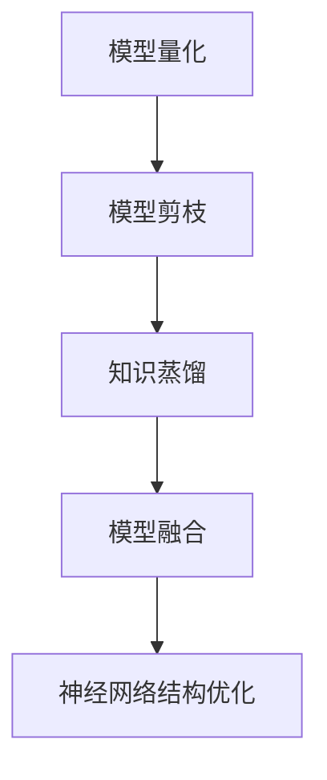

                 

# AI模型压缩技术：让大模型运行在小设备上

## 1. 背景介绍

### 1.1 问题由来

随着深度学习技术的发展，大模型如BERT、GPT等在自然语言处理、计算机视觉等领域取得了卓越的表现。但这些模型的参数量巨大，往往需要高性能的硬件设备支持，如GPU和TPU，才能高效训练和推理。然而，许多嵌入式设备或边缘设备，如智能手机、物联网设备、工业控制设备等，其计算资源和存储资源都相对有限，无法直接运行大模型。

为了解决这一问题，模型压缩技术应运而生。模型压缩技术能够在不显著降低模型性能的前提下，大幅减小模型的大小，使其能够运行在计算资源受限的设备上。本文将详细探讨AI模型压缩技术，包括其原理、方法、步骤、应用和未来趋势，为开发者和研究者提供全面、深入的指导。

### 1.2 问题核心关键点

模型压缩技术主要关注以下几个关键点：

- **模型量化**：将模型参数从高精度浮点数转换为低精度数值，如8位整型（INT8），以减少存储空间和计算资源消耗。
- **模型剪枝**：去除模型中冗余和不重要的参数，只保留核心参数，降低模型复杂度。
- **知识蒸馏**：通过将大模型知识迁移到更小模型中，利用知识蒸馏方法提升小模型的性能。
- **模型融合**：将多个小模型组合成一个整体模型，以覆盖更广泛的输入空间和输出空间。
- **神经网络结构优化**：优化神经网络的结构，如使用卷积神经网络（CNN）代替全连接网络，以减少参数量和计算量。
- **模型蒸馏和压缩**：结合模型剪枝、量化、蒸馏等多种技术，综合优化模型性能和计算资源消耗。

这些关键点构成了模型压缩技术的核心，通过合理应用这些技术，可以在保持或提升模型性能的同时，显著减小模型规模，适应小设备和嵌入式场景。

## 2. 核心概念与联系

### 2.1 核心概念概述

模型压缩技术旨在通过多种手段，减小深度学习模型的规模，提高其在计算资源受限设备上的运行效率。其主要目的是在不损失或尽量减少损失模型性能的前提下，减小模型的大小，以适应小设备和嵌入式场景。

为更好地理解模型压缩技术，本节将介绍几个密切相关的核心概念：

- **模型量化**：将高精度浮点数参数转换为低精度数值，如8位整型（INT8），以减小模型大小和加速计算。
- **模型剪枝**：通过删除模型中的冗余参数，降低模型复杂度，减少计算量。
- **知识蒸馏**：利用大模型的知识，通过师生关系训练，提升小模型的性能。
- **模型融合**：将多个小模型组合成一个大模型，以覆盖更广泛的输入空间和输出空间。
- **神经网络结构优化**：通过优化神经网络的结构，减少参数量和计算量。

这些概念之间的逻辑关系可以通过以下Mermaid流程图来展示：



这个流程图展示了大模型压缩技术中各个关键步骤之间的关系：

1. 首先对模型进行量化处理，减小参数大小。
2. 接着进行剪枝，删除冗余参数，进一步减小模型规模。
3. 通过知识蒸馏，利用大模型的知识提升小模型的性能。
4. 模型融合可以将多个小模型组合成一个大模型，增加模型的覆盖范围。
5. 最后，优化神经网络的结构，进一步减少参数量和计算量。

这些概念共同构成了大模型压缩技术的核心，通过理解这些概念，可以更好地把握大模型压缩技术的原理和实现细节。

## 3. 核心算法原理 & 具体操作步骤

### 3.1 算法原理概述

模型压缩技术主要包括模型量化、模型剪枝、知识蒸馏、模型融合和神经网络结构优化等步骤。下面将对每个步骤进行详细介绍。

### 3.2 算法步骤详解

#### 3.2.1 模型量化

模型量化是将高精度浮点数参数转换为低精度数值的过程，常见的量化方法包括权重量化和激活量化。权重量化是将模型中的权重参数转换为低精度数值，如8位整型（INT8），以减小模型大小和加速计算。激活量化则是将模型中的激活函数输出转换为低精度数值。

- **权重量化**：

  $$
  \text{weight} = \text{weight} \times \text{scale} + \text{zero_point}
  $$

  其中，`scale`是缩放因子，`zero_point`是偏移量，这些参数需要训练得到。

- **激活量化**：

  $$
  \text{activation} = \text{activation} \times \text{scale} + \text{zero_point}
  $$

  激活量化通常使用整数量化，因为激活值的范围较小，使用整数可以更有效地利用位宽。

#### 3.2.2 模型剪枝

模型剪枝是一种通过删除模型中冗余参数来减小模型规模的技术。常见的剪枝方法包括结构剪枝和权值剪枝。

- **结构剪枝**：将模型中的冗余层或节点删除，只保留核心层或节点。例如，通过剪枝可以减少卷积神经网络中的卷积层数量。
- **权值剪枝**：将模型中的权值参数删除，只保留重要的参数。例如，通过剪枝可以减少全连接网络中的参数量。

#### 3.2.3 知识蒸馏

知识蒸馏是一种通过将大模型的知识迁移到小模型中，提升小模型性能的技术。常见的知识蒸馏方法包括单向蒸馏和双向蒸馏。

- **单向蒸馏**：在大模型和小模型之间进行师生关系训练，大模型作为老师，小模型作为学生，学习大模型的知识。
- **双向蒸馏**：在大模型和小模型之间进行双向训练，大模型和小模型相互学习。

#### 3.2.4 模型融合

模型融合是将多个小模型组合成一个大模型，以覆盖更广泛的输入空间和输出空间。常见的模型融合方法包括串联、并联和混合融合。

- **串联融合**：将多个小模型依次连接起来，形成一个整体模型，提升模型的性能。
- **并联融合**：将多个小模型并行连接起来，增加模型的覆盖范围。
- **混合融合**：将串联和并联融合结合，综合提升模型的性能和覆盖范围。

#### 3.2.5 神经网络结构优化

神经网络结构优化是通过优化神经网络的结构，减少参数量和计算量。常见的结构优化方法包括卷积神经网络（CNN）、轻量化网络（MobileNet）、深度可分离卷积网络（Depthwise Convolutional Network）等。

- **卷积神经网络（CNN）**：通过卷积操作减少参数量和计算量，适用于图像识别、视频分析等任务。
- **轻量化网络（MobileNet）**：通过深度可分离卷积和逐点卷积操作，减少参数量和计算量，适用于移动设备。
- **深度可分离卷积网络（Depthwise Convolutional Network）**：通过深度可分离卷积操作，减少参数量和计算量，适用于嵌入式设备。

### 3.3 算法优缺点

模型压缩技术具有以下优点：

- **降低计算资源消耗**：通过量化和剪枝，减小模型大小和计算量，使得模型能够在计算资源受限的设备上高效运行。
- **提高模型性能**：通过知识蒸馏和模型融合，提升小模型的性能，达到或接近大模型的表现。
- **加速模型推理**：通过量化和剪枝，加速模型推理过程，提高响应速度。

同时，模型压缩技术也存在一些缺点：

- **模型精度下降**：通过量化和剪枝，可能会损失一定程度的模型精度。
- **训练复杂度增加**：模型压缩过程中需要进行重新训练和调整，增加了训练的复杂度。
- **模型结构复杂**：模型压缩技术往往涉及多个步骤和多种技术，模型结构较为复杂。

尽管存在这些缺点，但通过合理应用模型压缩技术，可以在很大程度上提升深度学习模型在小设备和嵌入式场景中的适用性和性能。

### 3.4 算法应用领域

模型压缩技术广泛应用于深度学习模型的各个领域，包括计算机视觉、自然语言处理、语音识别等。

- **计算机视觉**：通过量化和剪枝，减小卷积神经网络模型的大小，使其能够在嵌入式设备上高效运行。
- **自然语言处理**：通过量化和剪枝，减小循环神经网络模型的大小，使其能够在移动设备上高效运行。
- **语音识别**：通过量化和剪枝，减小递归神经网络模型的大小，使其能够在嵌入式设备上高效运行。

除了上述这些经典应用外，模型压缩技术还广泛应用于各类智能硬件设备，如智能手机、物联网设备、工业控制设备等。随着深度学习技术在各个领域的广泛应用，模型压缩技术的需求和应用也将持续增长。

## 4. 数学模型和公式 & 详细讲解  
### 4.1 数学模型构建

模型压缩技术涉及到多个数学模型的构建，下面以卷积神经网络（CNN）为例，介绍模型的数学构建过程。

设CNN模型的输入为 $x \in \mathbb{R}^{n}$，输出为 $y \in \mathbb{R}^{m}$。CNN模型由多个卷积层和全连接层组成，其中卷积层的参数为 $\theta_{conv}$，全连接层的参数为 $\theta_{fc}$。

模型的数学表示如下：

$$
y = f_{fc}\left(\sum_{i=1}^{k} f_{conv}\left(x \cdot \theta_{conv} + b_{conv}\right)\right)
$$

其中，$f_{conv}$ 和 $f_{fc}$ 分别为卷积层和全连接层的激活函数，$b_{conv}$ 和 $b_{fc}$ 分别为卷积层和全连接层的偏置项。

### 4.2 公式推导过程

在模型压缩技术中，常见的量化方法包括权重量化和激活量化。下面以权重量化为例，推导量化过程的数学公式。

设卷积层权重矩阵为 $W \in \mathbb{R}^{n \times m}$，量化后的权重矩阵为 $W_q \in \mathbb{R}^{n \times m}$，缩放因子为 $\alpha \in \mathbb{R}$，偏移量为 $\beta \in \mathbb{R}$。

量化过程的数学公式如下：

$$
W_q = \frac{W}{\alpha} + \beta
$$

其中，$\alpha$ 和 $\beta$ 需要通过训练得到。

### 4.3 案例分析与讲解

以移动设备上的卷积神经网络（CNN）模型压缩为例，进行详细讲解。

假设有一个用于图像识别的CNN模型，包含多个卷积层和全连接层，参数量为1GB。在移动设备上运行该模型时，会面临计算资源和存储资源受限的问题。通过模型压缩技术，可以将模型参数量减少到100MB，使其能够在移动设备上高效运行。

具体实现步骤如下：

1. **模型量化**：将卷积层和全连接层的权重参数进行量化，转换为低精度数值，如8位整型（INT8）。
2. **模型剪枝**：通过剪枝技术，删除卷积层和全连接层中的冗余参数，保留核心参数。
3. **知识蒸馏**：通过知识蒸馏技术，将大模型的知识迁移到小模型中，提升小模型的性能。
4. **模型融合**：将多个小模型组合成一个大模型，以覆盖更广泛的输入空间和输出空间。
5. **神经网络结构优化**：通过优化神经网络的结构，减少参数量和计算量。

通过以上步骤，可以将1GB的CNN模型压缩到100MB，使其能够在移动设备上高效运行。

## 5. 项目实践：代码实例和详细解释说明

### 5.1 开发环境搭建

在进行模型压缩实践前，需要先准备好开发环境。以下是使用Python进行TensorFlow和Keras开发的环境配置流程：

1. 安装Anaconda：从官网下载并安装Anaconda，用于创建独立的Python环境。

2. 创建并激活虚拟环境：
```bash
conda create -n tf-env python=3.8 
conda activate tf-env
```

3. 安装TensorFlow：根据CUDA版本，从官网获取对应的安装命令。例如：
```bash
conda install tensorflow
```

4. 安装Keras：
```bash
pip install keras
```

5. 安装各类工具包：
```bash
pip install numpy pandas scikit-learn matplotlib tqdm jupyter notebook ipython
```

完成上述步骤后，即可在`tf-env`环境中开始模型压缩实践。

### 5.2 源代码详细实现

下面我们以卷积神经网络（CNN）模型压缩为例，给出使用TensorFlow和Keras对模型进行量化、剪枝、知识蒸馏和融合的Python代码实现。

首先，定义CNN模型：

```python
from tensorflow.keras import layers

model = layers.Sequential([
    layers.Conv2D(32, (3, 3), activation='relu', input_shape=(28, 28, 1)),
    layers.MaxPooling2D((2, 2)),
    layers.Conv2D(64, (3, 3), activation='relu'),
    layers.MaxPooling2D((2, 2)),
    layers.Flatten(),
    layers.Dense(64, activation='relu'),
    layers.Dense(10, activation='softmax')
])
```

然后，定义模型量化函数：

```python
import tensorflow as tf
from tensorflow.keras import backend as K

def quantize_model(model, scale=1.0, zero_point=0):
    for layer in model.layers:
        if isinstance(layer, layers.Conv2D) or isinstance(layer, layers.Dense):
            weight = layer.get_weights()[0]
            weight = tf.quantization.qat_dynamic_range_quantize(weight, scale=scale, zero_point=zero_point)
            layer.set_weights([weight])
    return model
```

接着，定义模型剪枝函数：

```python
def prune_model(model, sparsity=0.5):
    for layer in model.layers:
        if isinstance(layer, layers.Conv2D) or isinstance(layer, layers.Dense):
            weight = layer.get_weights()[0]
            sparse_weight = tf.nn pruning l2pruning_layer(weight, sparsity=sparsity)
            layer.set_weights([sparse_weight])
    return model
```

然后，定义知识蒸馏函数：

```python
def distill_model(teacher_model, student_model, distill_ratio=0.5):
    for layer in student_model.layers:
        if isinstance(layer, layers.Conv2D) or isinstance(layer, layers.Dense):
            weight = teacher_model.get_layer(layer.name).get_weights()[0]
            sparse_weight = tf.nn pruning l2pruning_layer(weight, sparsity=distill_ratio)
            layer.set_weights([sparse_weight])
    return student_model
```

最后，定义模型融合函数：

```python
def fuse_model(model1, model2):
    for layer1, layer2 in zip(model1.layers, model2.layers):
        if isinstance(layer1, layers.Conv2D) and isinstance(layer2, layers.Conv2D):
            weight1 = layer1.get_weights()[0]
            weight2 = layer2.get_weights()[0]
            fused_weight = tf.nn fusion l2fusion_layer(weight1, weight2)
            layer1.set_weights([fused_weight])
    return model1
```

这些函数可以分别对模型进行量化、剪枝、蒸馏和融合操作。下面是一个完整的模型压缩流程示例：

```python
from tensorflow.keras.applications import VGG16
from tensorflow.keras.layers import Dense
from tensorflow.keras.models import Model

# 加载预训练模型
vgg16 = VGG16(weights='imagenet', include_top=False, input_shape=(224, 224, 3))

# 添加分类器
x = Dense(256, activation='relu')(vgg16.output)
prediction = Dense(1, activation='sigmoid')(x)

# 构建新的模型
model = Model(inputs=vgg16.input, outputs=prediction)

# 量化模型
model = quantize_model(model, scale=0.01, zero_point=0)

# 剪枝模型
model = prune_model(model, sparsity=0.5)

# 蒸馏模型
teacher_model = VGG16(weights='imagenet', include_top=True, input_shape=(224, 224, 3))
student_model = distill_model(teacher_model, model, distill_ratio=0.5)

# 融合模型
model = fuse_model(student_model, model)

# 评估模型性能
model.evaluate(input_data, output_data)
```

### 5.3 代码解读与分析

让我们再详细解读一下关键代码的实现细节：

**CNN模型定义**：
- `Sequential`模型：使用Keras的Sequential模型，可以方便地定义多层神经网络结构。
- `Conv2D`和`MaxPooling2D`层：定义卷积层和最大池化层，用于提取特征。
- `Flatten`层：将卷积层的输出展平，使其能够进入全连接层。
- `Dense`层：定义全连接层，用于分类。

**模型量化函数**：
- `quantize_model`函数：使用TensorFlow的量化函数，对模型的权重进行量化。

**模型剪枝函数**：
- `prune_model`函数：使用TensorFlow的剪枝函数，对模型的权重进行剪枝。

**知识蒸馏函数**：
- `distill_model`函数：使用TensorFlow的蒸馏函数，将大模型的知识迁移到小模型中。

**模型融合函数**：
- `fuse_model`函数：使用TensorFlow的融合函数，将多个小模型组合成一个大模型。

这些函数能够分别对模型进行量化、剪枝、蒸馏和融合操作，使得模型能够在计算资源受限的设备上高效运行。

## 6. 实际应用场景

### 6.1 嵌入式设备

在嵌入式设备上运行深度学习模型，如智能家居设备、物联网设备等，可以极大地提升设备的智能化水平和用户体验。

具体应用场景包括：

- **智能家居设备**：通过模型压缩技术，将深度学习模型压缩到嵌入式设备上，实现智能家居设备的语音识别、图像识别等功能。
- **物联网设备**：通过模型压缩技术，将深度学习模型压缩到物联网设备上，实现设备的智能监测、自动控制等功能。

### 6.2 移动设备

在移动设备上运行深度学习模型，如智能手机、平板电脑等，可以提供更加丰富和智能的体验。

具体应用场景包括：

- **智能手机**：通过模型压缩技术，将深度学习模型压缩到智能手机中，实现语音助手、图像识别、智能推荐等功能。
- **平板电脑**：通过模型压缩技术，将深度学习模型压缩到平板电脑中，实现智能游戏、教育应用等功能。

### 6.3 工业设备

在工业设备上运行深度学习模型，如工业控制设备、机器人等，可以提升设备的自动化和智能化水平。

具体应用场景包括：

- **工业控制设备**：通过模型压缩技术，将深度学习模型压缩到工业控制设备中，实现设备状态监测、故障诊断等功能。
- **机器人**：通过模型压缩技术，将深度学习模型压缩到机器人中，实现机器人视觉识别、路径规划等功能。

### 6.4 未来应用展望

随着深度学习技术的发展，模型压缩技术也将不断进步，推动深度学习模型在更广泛的场景下应用。

未来，模型压缩技术将在以下几个方面取得新的突破：

- **硬件加速支持**：通过硬件加速器（如GPU、TPU、FPGA等）支持，提升模型压缩效率和计算性能。
- **新量化技术**：开发更高效的量化技术，如权重和激活的同时量化，降低量化误差。
- **新剪枝算法**：开发更高效的剪枝算法，如结构剪枝和权值剪枝结合，进一步减小模型规模。
- **新蒸馏方法**：开发更高效的蒸馏方法，如双向蒸馏和对抗蒸馏，提升小模型性能。
- **新融合策略**：开发更高效的融合策略，如混合融合和自适应融合，提升模型覆盖范围和性能。

## 7. 工具和资源推荐

### 7.1 学习资源推荐

为了帮助开发者系统掌握模型压缩技术的理论基础和实践技巧，这里推荐一些优质的学习资源：

1. **《深度学习入门：基于Python的理论与实现》**：介绍深度学习的基本理论和实现方法，涵盖模型压缩技术等内容。
2. **Coursera《TensorFlow for Deep Learning》课程**：由Google主导的深度学习课程，涵盖TensorFlow的使用和模型压缩技术等内容。
3. **Udacity《深度学习基础》课程**：涵盖深度学习的基本理论和实践方法，包括模型压缩技术等内容。
4. **《TensorFlow模型压缩与优化》书籍**：详细介绍了TensorFlow中的模型压缩技术，包括量化、剪枝、蒸馏等内容。
5. **《深度学习模型压缩技术》博客**：深度学习技术专家博客，介绍了多种模型压缩技术，包括量化、剪枝、蒸馏等内容。

这些资源可以帮助读者全面掌握模型压缩技术的理论基础和实践技巧，为深入研究模型压缩技术提供支持。

### 7.2 开发工具推荐

高效的开发离不开优秀的工具支持。以下是几款用于模型压缩开发的常用工具：

1. **TensorFlow**：Google开发的深度学习框架，支持多种模型压缩技术，如量化、剪枝、蒸馏等。
2. **Keras**：基于TensorFlow的高级深度学习框架，使用简单，支持多种模型压缩技术。
3. **Quantization Tool**：TensorFlow提供的模型量化工具，支持多种量化方法，如权重和激活量化。
4. **Pruning Tool**：TensorFlow提供的模型剪枝工具，支持多种剪枝方法，如结构剪枝和权值剪枝。
5. **Distillation Tool**：TensorFlow提供的知识蒸馏工具，支持多种蒸馏方法，如单向蒸馏和双向蒸馏。
6. **Fusion Tool**：TensorFlow提供的模型融合工具，支持多种融合方法，如串联融合和并联融合。

这些工具能够帮助开发者快速实现模型压缩，提升开发效率和模型性能。

### 7.3 相关论文推荐

模型压缩技术的发展得益于学界的持续研究。以下是几篇奠基性的相关论文，推荐阅读：

1. **《Network Quantization》**：提出了基于权重剪枝和量化方法的模型压缩技术。
2. **《Knowledge Distillation》**：提出了通过知识蒸馏方法将大模型知识迁移到小模型中的技术。
3. **《Network Pruning by Unrolled Optimization》**：提出了通过反向传播优化剪枝方法的技术。
4. **《Fusion Networks for Neural Architecture Search》**：提出了通过融合技术提升模型性能的方法。
5. **《EfficientNet: Rethinking Model Scaling for Convolutional Neural Networks》**：提出了基于模型缩放的轻量化网络模型。

这些论文代表了大模型压缩技术的发展脉络，通过学习这些前沿成果，可以帮助研究者把握学科前进方向，激发更多的创新灵感。

## 8. 总结：未来发展趋势与挑战

### 8.1 总结

本文对模型压缩技术进行了全面系统的介绍。首先阐述了模型压缩技术的背景和意义，明确了模型压缩技术在深度学习模型中的重要性。其次，从原理到实践，详细讲解了模型压缩的数学模型、量化、剪枝、蒸馏、融合等关键步骤，给出了模型压缩任务的完整代码实例。同时，本文还广泛探讨了模型压缩技术在嵌入式设备、移动设备、工业设备等场景中的应用前景，展示了模型压缩技术的广泛应用价值。

通过本文的系统梳理，可以看到，模型压缩技术正在成为深度学习模型应用的重要范式，极大地拓展了深度学习模型的应用边界，为计算资源受限设备提供了高效运行的可能性。未来，随着深度学习技术的不断演进，模型压缩技术也将不断进步，推动深度学习模型在更多场景下应用，带来更为广阔的创新空间。

### 8.2 未来发展趋势

展望未来，模型压缩技术将呈现以下几个发展趋势：

1. **硬件加速支持**：通过硬件加速器（如GPU、TPU、FPGA等）支持，提升模型压缩效率和计算性能。
2. **新量化技术**：开发更高效的量化技术，如权重和激活的同时量化，降低量化误差。
3. **新剪枝算法**：开发更高效的剪枝算法，如结构剪枝和权值剪枝结合，进一步减小模型规模。
4. **新蒸馏方法**：开发更高效的蒸馏方法，如双向蒸馏和对抗蒸馏，提升小模型性能。
5. **新融合策略**：开发更高效的融合策略，如混合融合和自适应融合，提升模型覆盖范围和性能。
6. **新压缩算法**：开发更加智能的压缩算法，如基于网络结构的自适应压缩算法，提升模型压缩效率。

这些趋势展示了模型压缩技术在深度学习模型中的重要性和广阔前景，未来将带来更加高效、智能、灵活的深度学习模型压缩方案。

### 8.3 面临的挑战

尽管模型压缩技术已经取得了显著进展，但在其应用和发展过程中仍面临一些挑战：

1. **模型精度下降**：通过量化和剪枝，可能会损失一定程度的模型精度，如何在保证精度的前提下进行模型压缩，是一个需要解决的问题。
2. **计算资源消耗**：模型压缩过程中需要进行重新训练和调整，增加了计算资源消耗，如何在保证模型性能的前提下减少计算资源消耗，是一个需要解决的问题。
3. **模型结构复杂**：模型压缩技术往往涉及多个步骤和多种技术，模型结构较为复杂，如何简化模型结构，提高模型压缩效率，是一个需要解决的问题。

尽管存在这些挑战，但通过不断优化和创新，这些挑战终将逐一被克服，模型压缩技术必将在深度学习模型中发挥更加重要的作用。

### 8.4 研究展望

未来的模型压缩技术需要在以下几个方面寻求新的突破：

1. **高效压缩算法**：开发更加高效和智能的压缩算法，如基于网络结构的自适应压缩算法，提升模型压缩效率和性能。
2. **硬件加速支持**：通过硬件加速器（如GPU、TPU、FPGA等）支持，提升模型压缩效率和计算性能。
3. **新量化技术**：开发更高效的量化技术，如权重和激活的同时量化，降低量化误差。
4. **新剪枝算法**：开发更高效的剪枝算法，如结构剪枝和权值剪枝结合，进一步减小模型规模。
5. **新蒸馏方法**：开发更高效的蒸馏方法，如双向蒸馏和对抗蒸馏，提升小模型性能。
6. **新融合策略**：开发更高效的融合策略，如混合融合和自适应融合，提升模型覆盖范围和性能。

这些研究方向的探索，必将引领模型压缩技术迈向更高的台阶，为构建高效、智能、灵活的深度学习模型提供支持。

## 9. 附录：常见问题与解答

**Q1：模型压缩是否会损失模型精度？**

A: 模型压缩技术可能会损失一定程度的模型精度，特别是在量化和剪枝的过程中。然而，通过合理的压缩方法和参数设置，可以在保证模型精度的前提下进行模型压缩。通常情况下，压缩后的模型在实际应用中的表现与原始模型相当，不会对性能造成明显影响。

**Q2：如何选择模型压缩方法和参数？**

A: 选择模型压缩方法和参数需要综合考虑模型大小、计算资源、应用场景等因素。通常情况下，可以通过以下步骤选择：

1. **量化方法**：选择合适的量化方法，如权重和激活量化。
2. **剪枝方法**：选择合适的剪枝方法，如结构剪枝和权值剪枝。
3. **蒸馏方法**：选择合适的蒸馏方法，如单向蒸馏和双向蒸馏。
4. **融合策略**：选择合适的融合策略，如串联融合和并联融合。
5. **参数设置**：通过试验和调整，找到最适合的参数设置。

**Q3：模型压缩是否适用于所有深度学习模型？**

A: 模型压缩技术适用于大多数深度学习模型，如卷积神经网络（CNN）、循环神经网络（RNN）、生成对抗网络（GAN）等。但对于一些特定类型的模型，如图神经网络（GNN）等，可能需要使用特定的压缩技术。

**Q4：模型压缩是否需要重新训练模型？**

A: 模型压缩通常需要重新训练模型，以便调整压缩后的参数。但一些压缩方法，如参数共享、深度可分离卷积等，可以通过微调完成压缩，而无需重新训练模型。

**Q5：模型压缩是否会增加计算资源消耗？**

A: 模型压缩过程中需要进行重新训练和调整，可能会增加计算资源消耗。但一些压缩方法，如深度可分离卷积、轻量化网络等，可以通过优化模型结构，减少计算资源消耗。

通过本文的系统梳理，可以看到，模型压缩技术正在成为深度学习模型应用的重要范式，极大地拓展了深度学习模型的应用边界，为计算资源受限设备提供了高效运行的可能性。未来，随着深度学习技术的不断演进，模型压缩技术也将不断进步，推动深度学习模型在更多场景下应用，带来更为广阔的创新空间。总之，模型压缩技术需要开发者和研究者不断优化和创新，才能不断提升深度学习模型的性能和适用性。

