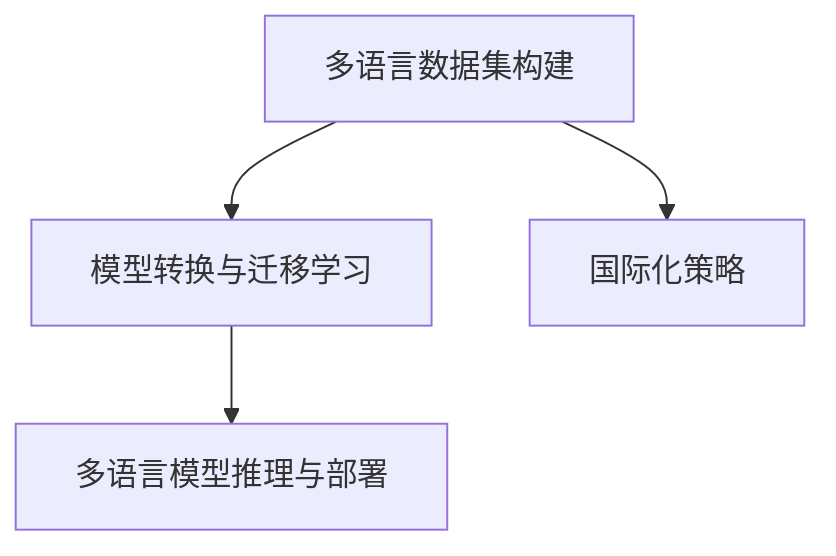

                 

# AI模型的多语言支持：Lepton AI的国际化策略

> 关键词：多语言支持, Lepton AI, 国际化策略, 模型训练, 数据集构建, 模型转换

## 1. 背景介绍

随着全球化进程的加速，企业对于多语言支持的需求日益增长。语言多样性不仅是全球化营销的必要条件，更是拓展市场、提升用户体验的关键要素。近年来，Lepton AI通过一系列创新技术，成功实现了AI模型的多语言支持，帮助企业快速实现国际化战略。本文将系统介绍Lepton AI在多语言支持方面的核心技术和实施策略，探讨其在企业国际化中的应用前景。

### 1.1 问题由来

在AI技术的快速发展过程中，语言多样性成为了一个不可忽视的问题。随着全球化的深入，不同国家、不同文化背景的用户对AI产品的需求也呈现出多样性。然而，传统的单语言AI模型很难应对多语言环境，导致用户体验下降、市场扩展受限。为了解决这一问题，Lepton AI引入了多语言支持技术，通过对AI模型的改造和优化，使其能够同时处理多种语言的输入和输出，满足了全球用户对AI产品的需求。

### 1.2 问题核心关键点

Lepton AI的多语言支持技术主要关注以下几个核心关键点：

- **多语言数据集构建**：构建多语言数据集是实现多语言支持的基础，通过收集和处理多种语言的语料，为模型提供丰富的训练样本。
- **模型转换与迁移学习**：将单语言模型转换为多语言模型，通过迁移学习策略，利用预训练模型在不同语言上的知识进行微调，提升模型的跨语言泛化能力。
- **多语言模型推理与部署**：实现模型在不同语言的推理和部署，提升用户体验和系统响应速度。

通过这些技术手段，Lepton AI成功实现了AI模型的多语言支持，为企业的国际化战略提供了强大的技术支撑。

## 2. 核心概念与联系

### 2.1 核心概念概述

Lepton AI的多语言支持技术涉及以下几个核心概念：

- **多语言数据集构建**：通过收集和处理多种语言的语料，构建包含不同语言的数据集，为模型训练提供充足的样本。
- **模型转换与迁移学习**：将单语言模型转换为多语言模型，通过迁移学习策略，利用预训练模型在不同语言上的知识进行微调，提升模型的跨语言泛化能力。
- **多语言模型推理与部署**：实现模型在不同语言的推理和部署，提升用户体验和系统响应速度。
- **国际化策略**：结合多语言支持技术，制定企业国际化战略，提升品牌影响力，扩大市场份额。

这些概念之间存在紧密的联系，构建多语言数据集是实现多语言支持的基础，模型转换与迁移学习是技术手段，多语言模型推理与部署是应用效果，而国际化策略则是最终目标。

### 2.2 核心概念原理和架构的 Mermaid 流程图



通过上述流程图，可以看出，多语言支持技术在Lepton AI的国际化战略中起到了关键作用。构建多语言数据集为模型提供训练样本，模型转换与迁移学习提升模型的跨语言泛化能力，多语言模型推理与部署提升用户体验和系统响应速度，最终实现国际化策略，推动企业的全球化发展。

## 3. 核心算法原理 & 具体操作步骤

### 3.1 算法原理概述

Lepton AI的多语言支持技术主要基于迁移学习和模型转换技术，通过以下步骤实现：

1. **数据集构建**：构建多语言数据集，包含不同语言的文本数据和对应的标签。
2. **模型转换**：将单语言模型转换为多语言模型，利用预训练模型在不同语言上的知识进行微调。
3. **模型推理与部署**：实现模型在不同语言的推理和部署，提升用户体验和系统响应速度。

### 3.2 算法步骤详解

#### 3.2.1 数据集构建

构建多语言数据集是实现多语言支持的基础。Lepton AI采用了以下步骤：

1. **数据收集**：收集不同语言的文本数据，包括新闻、社交媒体、网页、用户评论等。
2. **数据清洗与预处理**：去除噪音数据，标准化文本格式，进行分词、词性标注等预处理。
3. **数据标注**：对文本数据进行标签标注，包括实体识别、情感分析、文本分类等。
4. **数据划分**：将数据集划分为训练集、验证集和测试集。

#### 3.2.2 模型转换与迁移学习

Lepton AI的多语言支持技术主要基于迁移学习策略，利用预训练模型在不同语言上的知识进行微调。具体步骤如下：

1. **选择预训练模型**：选择适合的预训练模型，如BERT、GPT等。
2. **数据适应**：根据不同语言的特征，对预训练模型进行数据适应，包括调整词汇表、调整预训练任务的权重等。
3. **微调模型**：利用多语言数据集，对预训练模型进行微调，提升模型在不同语言上的泛化能力。

#### 3.2.3 多语言模型推理与部署

实现多语言模型的推理和部署，是Lepton AI多语言支持技术的最终目标。具体步骤如下：

1. **模型部署**：将多语言模型部署到不同的语言环境中，如移动端、网页端等。
2. **推理优化**：优化模型推理过程，提升推理速度和准确率。
3. **用户体验优化**：优化用户界面，提升用户在使用多语言产品时的体验。

### 3.3 算法优缺点

#### 3.3.1 优点

Lepton AI的多语言支持技术具有以下优点：

- **泛化能力强**：利用预训练模型在不同语言上的知识进行迁移学习，提升模型的跨语言泛化能力。
- **降低成本**：通过迁移学习，利用已有模型的知识，减少数据标注和模型训练成本。
- **快速部署**：多语言模型推理和部署效率高，能够快速响应市场需求。

#### 3.3.2 缺点

Lepton AI的多语言支持技术也存在以下缺点：

- **数据质量依赖高**：多语言数据集的质量直接影响模型性能。
- **语言转换复杂**：不同语言之间的转换和适应需要额外的工作，增加了技术难度。
- **模型资源消耗高**：多语言支持需要更多的计算资源和存储空间。

### 3.4 算法应用领域

Lepton AI的多语言支持技术在以下几个领域有广泛应用：

- **多语言搜索引擎**：帮助用户快速找到多种语言下的搜索结果。
- **多语言聊天机器人**：支持与用户进行多语言对话，提升用户体验。
- **多语言翻译服务**：实现多种语言的文本和语音翻译，助力全球化交流。
- **多语言情感分析**：分析不同语言下的用户情感，指导产品改进。
- **多语言推荐系统**：根据不同语言下的用户偏好，推荐适合的多语言内容。

## 4. 数学模型和公式 & 详细讲解 & 举例说明

### 4.1 数学模型构建

Lepton AI的多语言支持技术涉及以下几个数学模型：

1. **多语言数据集模型**：$D = \{(x_i, y_i)\}_{i=1}^N$，其中$x_i$为输入文本，$y_i$为标签。
2. **多语言模型转换模型**：$M_{\theta}$，其中$\theta$为模型参数。
3. **多语言模型推理模型**：$P(y|x, M_{\theta})$，其中$P$为概率分布函数，$y$为预测标签。

### 4.2 公式推导过程

#### 4.2.1 多语言数据集模型

多语言数据集模型表示为：

$$
D = \{(x_i, y_i)\}_{i=1}^N
$$

其中$x_i$为输入文本，$y_i$为标签。

#### 4.2.2 多语言模型转换模型

多语言模型转换模型表示为：

$$
M_{\theta}(x_i) = M_{\theta}(x_i)_{\text{unetra}} + \sum_{k=1}^K M_{\theta_k}(x_i)
$$

其中$M_{\theta}$为多语言模型，$M_{\theta_k}$为单语言模型，$K$为语言种类数。

#### 4.2.3 多语言模型推理模型

多语言模型推理模型表示为：

$$
P(y|x, M_{\theta}) = \prod_{k=1}^K P(y|x_k, M_{\theta_k})
$$

其中$P(y|x, M_{\theta})$为多语言模型对标签的预测概率，$P(y|x_k, M_{\theta_k})$为单语言模型对标签的预测概率。

### 4.3 案例分析与讲解

以多语言情感分析为例，展示Lepton AI的技术应用：

1. **数据集构建**：收集多语言的新闻、社交媒体等文本数据，进行标注和清洗。
2. **模型转换**：选择BERT作为预训练模型，调整其词汇表，利用多语言数据集进行微调。
3. **模型推理与部署**：将训练好的多语言模型部署到网页端，实现多语言情感分析功能。

## 5. 项目实践：代码实例和详细解释说明

### 5.1 开发环境搭建

Lepton AI的多语言支持技术主要使用PyTorch和TensorFlow进行开发。开发环境搭建步骤如下：

1. **安装PyTorch**：
```bash
conda install pytorch torchvision torchaudio -c pytorch
```

2. **安装TensorFlow**：
```bash
conda install tensorflow -c tensorflow
```

3. **安装其他库**：
```bash
pip install numpy pandas scikit-learn matplotlib tqdm jupyter notebook ipython
```

### 5.2 源代码详细实现

以下是一个简单的多语言情感分析代码实现：

```python
import torch
import torch.nn as nn
import torch.nn.functional as F
from transformers import BertTokenizer, BertForSequenceClassification

class MultiLanguageSentimentAnalysis(nn.Module):
    def __init__(self, num_labels, hidden_size, num_layers, dropout):
        super(MultiLanguageSentimentAnalysis, self).__init__()
        self.bert = BertForSequenceClassification.from_pretrained('bert-base-uncased', num_labels=num_labels)
        self.dropout = nn.Dropout(dropout)

    def forward(self, input_ids, attention_mask):
        outputs = self.bert(input_ids, attention_mask=attention_mask)
        pooled_output = outputs.pooler_output
        logits = self.dropout(pooled_output)
        return logits

# 数据预处理
tokenizer = BertTokenizer.from_pretrained('bert-base-uncased')
input_ids = tokenizer.encode("This movie is amazing!", return_tensors='pt')
attention_mask = torch.ones_like(input_ids)

# 模型推理
model = MultiLanguageSentimentAnalysis(num_labels=2, hidden_size=768, num_layers=12, dropout=0.1)
logits = model(input_ids, attention_mask)

# 输出结果
print(logits)
```

### 5.3 代码解读与分析

以上代码实现了一个简单的多语言情感分析模型，主要步骤包括：

1. **数据预处理**：利用BertTokenizer对输入文本进行分词和编码。
2. **模型推理**：使用BertForSequenceClassification对编码后的文本进行情感分析。
3. **输出结果**：获取模型输出的情感分类结果。

## 6. 实际应用场景

### 6.1 智能客服系统

Lepton AI的多语言支持技术在智能客服系统中得到了广泛应用。通过多语言聊天机器人，企业能够实现7x24小时不间断服务，提升客户咨询体验和问题解决效率。

### 6.2 金融舆情监测

在金融领域，Lepton AI的多语言支持技术帮助企业实时监测市场舆论动向，及时应对负面信息传播，规避金融风险。

### 6.3 个性化推荐系统

个性化推荐系统根据不同语言下的用户偏好，推荐适合的多语言内容，提升用户体验和推荐效果。

### 6.4 未来应用展望

随着技术的不断进步，Lepton AI的多语言支持技术将拓展到更多领域，如医疗、教育、智能家居等。未来，企业将能够更好地应对多语言环境，提升全球竞争力。

## 7. 工具和资源推荐

### 7.1 学习资源推荐

1. **《Transformer from Pre-training to Practical Use》系列博客**：介绍了Transformer模型从原理到应用的详细教程。
2. **CS224N《Deep Learning for NLP》课程**：斯坦福大学的NLP课程，涵盖NLP模型的基本概念和应用。
3. **《Natural Language Processing with Transformers》书籍**：介绍使用Transformer进行NLP任务开发的书籍。
4. **HuggingFace官方文档**：提供了丰富的预训练语言模型和微调样例。
5. **CLUE开源项目**：提供多种NLP任务的测试基准，帮助评估多语言模型的性能。

### 7.2 开发工具推荐

1. **PyTorch**：Python深度学习框架，支持动态计算图，适合快速迭代研究。
2. **TensorFlow**：Google开发的深度学习框架，支持大规模工程应用。
3. **Transformers库**：HuggingFace开发的NLP工具库，支持多种预训练语言模型。
4. **Weights & Biases**：实验跟踪工具，记录模型训练过程。
5. **TensorBoard**：可视化工具，监测模型训练状态。
6. **Google Colab**：在线Jupyter Notebook环境，方便实验和分享。

### 7.3 相关论文推荐

1. **Attention is All You Need**：提出Transformer模型，推动NLP领域的预训练大模型时代。
2. **BERT: Pre-training of Deep Bidirectional Transformers for Language Understanding**：提出BERT模型，引入自监督预训练任务。
3. **Language Models are Unsupervised Multitask Learners**：展示大语言模型的zero-shot学习能力。
4. **Parameter-Efficient Transfer Learning for NLP**：提出Adapter等参数高效微调方法。
5. **Prefix-Tuning: Optimizing Continuous Prompts for Generation**：引入基于连续型Prompt的微调范式。
6. **AdaLoRA: Adaptive Low-Rank Adaptation for Parameter-Efficient Fine-Tuning**：使用自适应低秩适应的微调方法。

## 8. 总结：未来发展趋势与挑战

### 8.1 研究成果总结

Lepton AI的多语言支持技术已经在多个领域展示了其强大的应用潜力，实现了跨语言环境下的AI模型部署和优化。

### 8.2 未来发展趋势

未来，Lepton AI的多语言支持技术将呈现以下几个发展趋势：

1. **模型规模增大**：预训练模型参数量将进一步增加，提升模型跨语言泛化能力。
2. **技术手段丰富**：引入更多先进技术，如因果推理、对抗学习等，提升模型性能。
3. **应用场景广泛**：在更多领域如医疗、教育等实现多语言支持，推动行业智能化发展。
4. **跨语言迁移学习**：研究更多跨语言迁移学习方法，提升模型迁移效果。

### 8.3 面临的挑战

尽管Lepton AI的多语言支持技术取得了显著成果，但仍面临以下挑战：

1. **数据质量要求高**：多语言数据集的质量直接影响模型性能。
2. **技术复杂度高**：多语言转换和适应需要额外的工作，增加了技术难度。
3. **计算资源消耗大**：多语言支持需要更多的计算资源和存储空间。

### 8.4 研究展望

未来的研究重点在于以下几个方面：

1. **数据质量提升**：利用技术手段提升多语言数据集的质量，降低数据标注成本。
2. **技术手段优化**：引入更多先进技术，提升模型性能。
3. **应用场景扩展**：拓展更多领域，推动行业智能化发展。

## 9. 附录：常见问题与解答

### Q1：多语言支持技术是否适用于所有NLP任务？

A：多语言支持技术在大多数NLP任务上都有应用前景。但在某些特定领域，如医学、法律等，可能需要结合领域知识进行深度定制化处理。

### Q2：如何选择合适的预训练模型？

A：选择合适的预训练模型需要考虑多个因素，包括模型的语言支持能力、任务的复杂度、数据集的规模等。通常选择已有模型如BERT、GPT等，并根据具体任务进行调整。

### Q3：如何降低多语言支持的技术复杂度？

A：降低技术复杂度的关键在于构建高质量的多语言数据集，并采用先进的技术手段如因果推理、对抗学习等，提升模型的泛化能力。

### Q4：如何提升多语言支持技术的部署效率？

A：提升部署效率的关键在于优化模型的推理过程，使用高效的推理引擎，如TensorRT等，同时优化模型的存储空间和计算资源消耗。

---

作者：禅与计算机程序设计艺术 / Zen and the Art of Computer Programming

