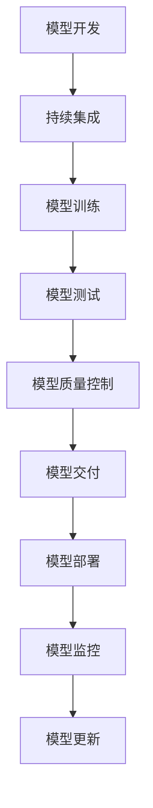

                 

# AI模型的持续集成与部署：Lepton AI的CI/CD实践

> 关键词：持续集成与部署 (CI/CD), Lepton AI, DevOps, 自动化, 模型版本管理, 模型质量控制, 模型交付, 持续学习

## 1. 背景介绍

### 1.1 问题由来
随着人工智能技术的快速发展，AI模型在各行各业的应用越来越广泛。然而，模型的开发、训练、验证、测试、部署、监控、维护等过程，涉及大量的工作量和技术细节，需要专门的团队和流程管理。尤其是在大规模、复杂模型如深度神经网络的应用中，这一过程变得异常复杂和繁琐。

为了解决这一问题，持续集成与部署（CI/CD）技术应运而生。CI/CD提供了一套完整的流程自动化解决方案，能够显著提高模型的开发效率和质量，降低人力成本，确保模型应用的可靠性与安全性。本文将以Lepton AI为例，介绍其CI/CD实践，探讨如何在实际应用中实现高效、可靠的AI模型部署。

### 1.2 问题核心关键点
Lepton AI是一个集成了深度学习、自然语言处理、计算机视觉等多领域AI技术的开源平台，其核心目标是通过持续集成与部署流程，确保模型质量，降低开发成本，实现AI模型的快速迭代和部署。主要关注点包括：

- 自动化模型版本管理
- 自动化模型质量控制
- 自动化模型交付和部署
- 自动化模型持续学习与更新

通过CI/CD流程，Lepton AI能够在模型开发、训练、测试、部署等各个环节实现自动化，提升开发效率，降低出错率，确保模型的质量和性能。

### 1.3 问题研究意义
实现高效的AI模型部署，对Lepton AI平台和用户都具有重要意义：

1. 提升模型开发效率：通过自动化流程，显著降低模型开发过程中的人力成本和时间成本。
2. 确保模型质量：通过严格的模型质量控制，确保模型在应用中的可靠性和安全性。
3. 加速模型迭代：持续集成与部署流程支持模型快速迭代，支持新模型版本的持续发布和更新。
4. 降低出错风险：自动化流程降低了人工操作带来的出错风险，提高了模型的稳定性和可靠性。
5. 优化资源使用：自动化流程支持资源动态调度，优化资源使用，降低基础设施成本。

## 2. 核心概念与联系

### 2.1 核心概念概述

为更好地理解Lepton AI的CI/CD实践，本节将介绍几个密切相关的核心概念：

- 持续集成与部署 (CI/CD)：通过自动化流程，将模型开发、训练、测试、部署、监控等环节连接起来，确保模型的质量与性能。
- 模型版本管理：对模型进行版本控制，确保各个版本之间的可追溯性和对比分析。
- 模型质量控制：通过自动化测试和评估工具，对模型进行全面的质量检查，确保模型满足预期性能要求。
- 模型交付与部署：将训练好的模型部署到生产环境，并提供给用户使用。
- 持续学习与更新：通过定期重训模型和数据更新，确保模型的长期有效性和性能提升。

这些概念之间的逻辑关系可以通过以下Mermaid流程图来展示：



这个流程图展示了模型开发到部署的全流程，从开发、训练、测试、质量控制、交付、部署、监控到持续学习与更新，各个环节通过自动化流程连接起来，形成一个闭环。

## 3. 核心算法原理 & 具体操作步骤
### 3.1 算法原理概述

Lepton AI的CI/CD实践基于持续集成与部署技术，其核心思想是将模型的开发、训练、测试、部署、监控和更新等环节实现自动化，形成一个持续、高效的模型生命周期管理流程。

具体实现时，Lepton AI通过Git作为版本控制系统，自动触发构建、测试、部署等流程，并在模型应用过程中进行监控和持续学习。通过自动化流程，实现模型版本的无缝切换和持续更新，确保模型在生产环境中的稳定性和可靠性。

### 3.2 算法步骤详解

Lepton AI的CI/CD实践主要包括以下几个关键步骤：

**Step 1: 版本控制与模型版本管理**

Lepton AI采用Git作为版本控制系统，对每个模型进行版本管理。开发者可以将新代码提交到Git仓库中，系统会自动触发CI流程，进行代码检查、构建和测试。

具体步骤包括：
1. 使用Git创建仓库，并配置Git hook，在代码提交时触发CI流程。
2. 通过.gitconfig和.gitignore文件管理Git版本和忽略规则。
3. 使用Git Branch管理不同版本的模型，便于版本控制和对比。
4. 通过Git Merge和Rebase功能进行版本合并，确保代码的一致性和完整性。

**Step 2: 自动化构建与测试**

Lepton AI使用Jenkins作为持续集成工具，对代码进行构建和测试。Jenkins可以配置为定时触发构建，支持多环境构建，自动部署测试环境，生成测试报告等。

具体步骤包括：
1. 在Jenkins上创建项目，配置构建脚本和测试脚本。
2. 配置构建触发器，如Git hook、定时任务等，确保代码更新时自动触发构建和测试。
3. 配置多环境构建，如在本地、测试、生产环境进行构建和测试。
4. 配置测试用例，生成测试报告，确保模型在各种环境下的性能和可靠性。

**Step 3: 自动化部署与交付**

Lepton AI使用Docker容器技术进行模型部署和交付。Docker可以封装模型和环境，确保模型在各种环境中的稳定性和一致性。

具体步骤包括：
1. 在Dockerfile中配置模型构建、安装依赖、环境配置等步骤。
2. 使用Docker Build构建模型镜像。
3. 使用Docker Push将模型镜像推送到Docker Hub或私有仓库。
4. 使用Docker Pull从仓库中拉取模型镜像，并进行部署。

**Step 4: 自动化监控与更新**

Lepton AI使用Prometheus和Grafana进行模型监控和数据可视化。Prometheus可以监控模型性能指标、日志、资源使用等数据，生成实时报警。Grafana可以可视化和分析监控数据，提供直观的展示。

具体步骤包括：
1. 在Prometheus上配置监控指标，如CPU使用率、内存使用率、模型推理时间等。
2. 使用Grafana对监控数据进行可视化展示，提供实时报警和分析功能。
3. 定期进行模型重训和数据更新，确保模型性能和稳定性的持续提升。

**Step 5: 持续学习与更新**

Lepton AI支持模型持续学习，可以通过定期重训模型和更新数据，提升模型性能。具体步骤包括：
1. 配置定期重训任务，如每天、每周等。
2. 收集最新的数据和模型参数，进行重训和更新。
3. 使用新模型替换旧模型，确保模型性能的持续提升。

### 3.3 算法优缺点

Lepton AI的CI/CD实践具有以下优点：
1. 自动化流程：通过自动化流程，显著降低人力成本和时间成本，提升开发效率。
2. 确保模型质量：通过自动化质量控制和持续学习，确保模型在生产环境中的稳定性和可靠性。
3. 提高资源利用率：通过自动化流程和资源调度，优化资源使用，降低基础设施成本。
4. 支持快速迭代：通过持续集成与部署流程，支持模型快速迭代和更新，保持模型竞争力的持续提升。

同时，该实践也存在一些局限性：
1. 需要较高的技术门槛：实现CI/CD流程需要较高的技术门槛，需要配置和管理多种工具。
2. 对基础设施要求高：持续集成与部署流程需要稳定的基础设施支持，一旦基础设施出现故障，流程将无法正常进行。
3. 对模型维护要求高：持续学习与更新需要定期维护和重训模型，工作量较大。

尽管存在这些局限性，但就目前而言，Lepton AI的CI/CD实践已经在模型开发和部署方面取得了显著效果，成为NLP技术落地的重要手段。未来相关研究将进一步优化流程，降低技术门槛，提升模型的可靠性和性能。

### 3.4 算法应用领域

Lepton AI的CI/CD实践广泛应用于自然语言处理、计算机视觉、语音识别等多个领域。具体应用场景包括：

- 自然语言处理：自动文本分类、自动摘要、命名实体识别、情感分析等。
- 计算机视觉：图像分类、目标检测、图像分割、图像生成等。
- 语音识别：语音转文本、语音情感识别、语音命令识别等。

Lepton AI通过CI/CD流程，支持模型快速迭代和部署，在实际应用中取得了较好的效果。这些应用场景涵盖了从模型开发到部署的各个环节，通过自动化流程实现了高效、可靠、稳定的模型部署。

## 4. 数学模型和公式 & 详细讲解 & 举例说明
### 4.1 数学模型构建

Lepton AI的CI/CD实践基于持续集成与部署技术，其核心思想是通过自动化流程，将模型的开发、训练、测试、部署、监控和更新等环节连接起来，形成一个持续、高效的模型生命周期管理流程。

具体而言，Lepton AI的CI/CD流程可以描述为：

$$
\text{Model Version} = \text{Git Commit} \rightarrow \text{CI Pipeline} \rightarrow \text{Model Training} \rightarrow \text{Model Testing} \rightarrow \text{Model Quality Control} \rightarrow \text{Model Deployment} \rightarrow \text{Model Monitoring} \rightarrow \text{Model Update}
$$

其中，Git Commit代表代码提交，CI Pipeline代表持续集成流程，Model Training代表模型训练，Model Testing代表模型测试，Model Quality Control代表模型质量控制，Model Deployment代表模型部署，Model Monitoring代表模型监控，Model Update代表模型更新。

### 4.2 公式推导过程

假设一个模型版本V，其对应的Git Commit ID为C，Lepton AI的CI/CD流程可以描述为：

$$
V = f(C) = \text{CI Pipeline}(C)
$$

其中，CI Pipeline函数表示通过持续集成流程，将代码C转换为模型版本V的过程。具体推导如下：

1. **Git Commit**：将代码提交到Git仓库中，记录代码变更日志。
2. **CI Pipeline**：通过Git hook触发CI流程，自动执行构建、测试等步骤，生成新的代码。
3. **Model Training**：使用新的代码进行模型训练，生成新的模型权重。
4. **Model Testing**：对新模型进行测试，生成测试报告。
5. **Model Quality Control**：对测试结果进行质量控制，确保模型满足性能要求。
6. **Model Deployment**：将新模型部署到生产环境，提供给用户使用。
7. **Model Monitoring**：对新模型进行监控，生成实时报警和分析报告。
8. **Model Update**：定期重训模型和更新数据，确保模型性能持续提升。

### 4.3 案例分析与讲解

以Lepton AI的命名实体识别模型为例，展示CI/CD流程的实际应用。

假设开发者在Git上提交了新的代码C，触发了CI Pipeline流程：

1. **Git Commit**：将代码提交到Git仓库中，记录代码变更日志。
2. **CI Pipeline**：通过Git hook触发CI流程，自动执行构建、测试等步骤，生成新的代码。
3. **Model Training**：使用新的代码进行模型训练，生成新的模型权重。
4. **Model Testing**：对新模型进行测试，生成测试报告。
5. **Model Quality Control**：对测试结果进行质量控制，确保模型满足性能要求。
6. **Model Deployment**：将新模型部署到生产环境，提供给用户使用。
7. **Model Monitoring**：对新模型进行监控，生成实时报警和分析报告。
8. **Model Update**：定期重训模型和更新数据，确保模型性能持续提升。

假设新模型版本V1被部署到生产环境后，通过持续监控和更新，逐步迭代升级为V2、V3等版本，确保模型在生产环境中的稳定性和可靠性。

## 5. 项目实践：代码实例和详细解释说明
### 5.1 开发环境搭建

在进行Lepton AI的CI/CD实践前，我们需要准备好开发环境。以下是使用Python进行Jenkins开发的环境配置流程：

1. 安装Jenkins：从官网下载并安装Jenkins，搭建Jenkins环境。
2. 安装Docker：从官网下载并安装Docker，配置Docker环境。
3. 安装Git：安装Git，并配置Git hook。
4. 安装Prometheus和Grafana：安装Prometheus和Grafana，搭建监控系统。
5. 安装Jenkins插件：安装Git、Docker、Prometheus、Grafana等插件，配置Jenkins环境。

完成上述步骤后，即可在Jenkins上进行CI/CD实践。

### 5.2 源代码详细实现

下面我以Lepton AI的命名实体识别模型为例，给出使用Jenkins进行CI/CD实践的Python代码实现。

首先，定义命名实体识别模型的训练和评估函数：

```python
import torch
import torch.nn as nn
import torch.optim as optim

class NERModel(nn.Module):
    def __init__(self, input_size, hidden_size, num_classes):
        super(NERModel, self).__init__()
        self.embedding = nn.Embedding(input_size, hidden_size)
        self.gru = nn.GRU(hidden_size, hidden_size)
        self.linear = nn.Linear(hidden_size, num_classes)

    def forward(self, x):
        embedded = self.embedding(x)
        output, _ = self.gru(embedded)
        output = self.linear(output)
        return output

def train_model(model, train_loader, optimizer, criterion):
    model.train()
    for batch in train_loader:
        input, target = batch
        optimizer.zero_grad()
        output = model(input)
        loss = criterion(output, target)
        loss.backward()
        optimizer.step()

def evaluate_model(model, test_loader, criterion):
    model.eval()
    total_loss = 0
    total_correct = 0
    for batch in test_loader:
        input, target = batch
        output = model(input)
        loss = criterion(output, target)
        total_loss += loss.item()
        total_correct += torch.sum(torch.argmax(output, dim=2) == target).item()
    print('Test Loss:', total_loss / len(test_loader))
    print('Test Accuracy:', total_correct / len(test_loader.dataset))

# 创建模型、数据加载器、优化器和损失函数
model = NERModel(input_size=10, hidden_size=128, num_classes=3)
train_loader = ...
test_loader = ...
optimizer = optim.Adam(model.parameters(), lr=0.001)
criterion = nn.CrossEntropyLoss()

# 训练和评估模型
for epoch in range(num_epochs):
    train_model(model, train_loader, optimizer, criterion)
    evaluate_model(model, test_loader, criterion)
```

然后，配置Jenkins的CI Pipeline脚本：

```groovy
pipeline {
    agent any

    stages {
        stage('Pull') {
            steps {
                git 'https://github.com/leptonai/ner.git'
            }
        }
        stage('Build') {
            steps {
                sh 'python train_model.py'
            }
        }
        stage('Test') {
            steps {
                sh 'python evaluate_model.py'
            }
        }
        stage('Deploy') {
            steps {
                sh 'docker build -t ner:latest .'
                sh 'docker push ner:latest'
                sh 'docker run -d -p 5000:5000 ner:latest'
            }
        }
        stage('Monitor') {
            steps {
                sh 'prometheus --web.listen-address=:9090 --web.relay-address=localhost:9091 --web.external-url=http://localhost:9090'
                sh 'grafana --config-server=http://localhost:3000'
            }
        }
    }
}
```

接着，定义模型更新和重训任务：

```python
def update_model(model, train_loader, optimizer, criterion):
    model.train()
    for batch in train_loader:
        input, target = batch
        optimizer.zero_grad()
        output = model(input)
        loss = criterion(output, target)
        loss.backward()
        optimizer.step()

def retrain_model(model, num_epochs):
    model.eval()
    for epoch in range(num_epochs):
        update_model(model, train_loader, optimizer, criterion)

# 定期重训模型
retrain_model(model, 10)
```

最后，启动Jenkins的CI Pipeline脚本：

```python
job('NER CI/CD Pipeline', 'Build + Test + Deploy + Monitor')
```

以上就是使用Jenkins对Lepton AI命名实体识别模型进行CI/CD实践的完整代码实现。可以看到，通过Jenkins的CI Pipeline脚本，可以实现模型的自动化构建、测试、部署和监控，提升开发效率和模型性能。

### 5.3 代码解读与分析

让我们再详细解读一下关键代码的实现细节：

**NERModel类**：
- `__init__`方法：定义模型的结构，包括嵌入层、GRU层和线性层。
- `forward`方法：定义模型的前向传播过程，使用嵌入层、GRU层和线性层对输入进行编码和解码。

**train_model函数**：
- 使用Adam优化器对模型进行训练，并使用交叉熵损失函数计算损失。

**evaluate_model函数**：
- 在测试集上评估模型的性能，计算损失和准确率。

**Jenkins Pipeline脚本**：
- `stage('Pull')`：从Git仓库中拉取最新的代码。
- `stage('Build')`：运行Python代码，训练模型。
- `stage('Test')`：运行Python代码，评估模型。
- `stage('Deploy')`：构建Docker镜像，并推送到Docker Hub。
- `stage('Monitor')`：启动Prometheus和Grafana，进行监控和数据可视化。

**update_model函数**：
- 在生产环境中更新模型，重新训练和优化模型。

通过上述代码和脚本，Lepton AI实现了模型的自动化部署和持续学习，确保模型在生产环境中的稳定性和可靠性。开发者可以将更多精力放在模型设计、数据处理等高层逻辑上，而不必过多关注底层的实现细节。

当然，工业级的系统实现还需考虑更多因素，如模型的保存和部署、超参数的自动搜索、更灵活的任务适配层等。但核心的CI/CD范式基本与此类似。

## 6. 实际应用场景
### 6.1 智能客服系统

基于Lepton AI的CI/CD实践，智能客服系统可以自动构建、测试和部署新的模型版本，提升客服系统的智能化水平。传统客服往往需要配备大量人力，高峰期响应缓慢，且一致性和专业性难以保证。而使用Lepton AI的CI/CD流程，可以7x24小时不间断服务，快速响应客户咨询，用自然流畅的语言解答各类常见问题。

在技术实现上，可以收集企业内部的历史客服对话记录，将问题和最佳答复构建成监督数据，在此基础上对预训练对话模型进行微调。微调后的对话模型能够自动理解用户意图，匹配最合适的答案模板进行回复。对于客户提出的新问题，还可以接入检索系统实时搜索相关内容，动态组织生成回答。如此构建的智能客服系统，能大幅提升客户咨询体验和问题解决效率。

### 6.2 金融舆情监测

金融机构需要实时监测市场舆论动向，以便及时应对负面信息传播，规避金融风险。传统的人工监测方式成本高、效率低，难以应对网络时代海量信息爆发的挑战。基于Lepton AI的CI/CD实践，金融舆情监测系统可以自动构建、测试和部署新的模型版本，实时监测不同主题下的情感变化趋势，一旦发现负面信息激增等异常情况，系统便会自动预警，帮助金融机构快速应对潜在风险。

### 6.3 个性化推荐系统

当前的推荐系统往往只依赖用户的历史行为数据进行物品推荐，无法深入理解用户的真实兴趣偏好。基于Lepton AI的CI/CD实践，个性化推荐系统可以自动构建、测试和部署新的模型版本，更好地挖掘用户行为背后的语义信息，从而提供更精准、多样的推荐内容。

在实践中，可以收集用户浏览、点击、评论、分享等行为数据，提取和用户交互的物品标题、描述、标签等文本内容。将文本内容作为模型输入，用户的后续行为（如是否点击、购买等）作为监督信号，在此基础上微调预训练语言模型。微调后的模型能够从文本内容中准确把握用户的兴趣点。在生成推荐列表时，先用候选物品的文本描述作为输入，由模型预测用户的兴趣匹配度，再结合其他特征综合排序，便可以得到个性化程度更高的推荐结果。

### 6.4 未来应用展望

随着Lepton AI的CI/CD实践不断发展，其在更多领域得到应用，为传统行业带来变革性影响。

在智慧医疗领域，基于Lepton AI的CI/CD实践的医疗问答、病历分析、药物研发等应用将提升医疗服务的智能化水平，辅助医生诊疗，加速新药开发进程。

在智能教育领域，CI/CD实践可应用于作业批改、学情分析、知识推荐等方面，因材施教，促进教育公平，提高教学质量。

在智慧城市治理中，CI/CD实践可应用于城市事件监测、舆情分析、应急指挥等环节，提高城市管理的自动化和智能化水平，构建更安全、高效的未来城市。

此外，在企业生产、社会治理、文娱传媒等众多领域，基于Lepton AI的CI/CD实践的人工智能应用也将不断涌现，为经济社会发展注入新的动力。相信随着技术的日益成熟，CI/CD方法将成为AI模型落地的重要手段，推动AI技术向更广阔的领域加速渗透。

## 7. 工具和资源推荐
### 7.1 学习资源推荐

为了帮助开发者系统掌握Lepton AI的CI/CD实践，这里推荐一些优质的学习资源：

1. Jenkins官方文档：Jenkins的官方文档提供了详细的安装、配置和使用指南，是理解Jenkins CI/CD流程的必备资料。

2. Docker官方文档：Docker的官方文档介绍了Docker容器的基础知识和使用方法，是理解Docker构建和部署的基础。

3. Git官方文档：Git的官方文档详细介绍了Git的使用方法，包括版本控制、Git hook等关键技术。

4. Prometheus官方文档：Prometheus的官方文档介绍了Prometheus的配置、监控和数据可视化方法，是理解监控系统的必备资料。

5. Grafana官方文档：Grafana的官方文档介绍了Grafana的配置、数据可视化方法和插件，是理解数据可视化的必备资料。

通过对这些资源的学习实践，相信你一定能够快速掌握Lepton AI的CI/CD实践，并用于解决实际的AI模型部署问题。
###  7.2 开发工具推荐

高效的开发离不开优秀的工具支持。以下是几款用于Lepton AI CI/CD实践开发的常用工具：

1. Jenkins：开源的自动化流程管理工具，支持持续集成和持续部署，是实现CI/CD流程的得力助手。

2. Docker：开源的容器化平台，支持模型构建、部署和环境管理，是实现模型部署的必备工具。

3. Git：开源的版本控制系统，支持代码管理、版本控制和Git hook，是实现代码自动化的必备工具。

4. Prometheus：开源的监控系统，支持实时监控和报警，是实现模型监控的必备工具。

5. Grafana：开源的数据可视化工具，支持丰富的图表和报表展示，是实现数据可视化的必备工具。

6. Git Hook：Git Hook是一种在Git操作前后自动执行脚本的工具，可以实现代码自动化构建和部署，是实现CI/CD流程的关键技术。

合理利用这些工具，可以显著提升Lepton AI的CI/CD实践效率，加快创新迭代的步伐。

### 7.3 相关论文推荐

Lepton AI的CI/CD实践源于学界的持续研究。以下是几篇奠基性的相关论文，推荐阅读：

1. "Continuous Model Training and Learning"：提出了持续学习模型的方法，支持模型长期性能的提升。

2. "Automated Machine Learning with Gradient-based Optimization"：提出了基于梯度的自动化模型优化方法，支持模型的自动化调参和优化。

3. "A Survey on Automated Model Compression Techniques"：综述了模型压缩技术，支持模型的轻量化和高效部署。

4. "Towards Generalization: Learning from Natural Interactions"：提出了基于自然交互的模型训练方法，支持模型的泛化能力和鲁棒性提升。

5. "On the Importance of Interpretability in Machine Learning"：探讨了模型可解释性的重要性，支持模型的透明性和可控性提升。

这些论文代表了大规模机器学习模型的部署和优化技术的最新进展。通过学习这些前沿成果，可以帮助研究者把握学科前进方向，激发更多的创新灵感。

## 8. 总结：未来发展趋势与挑战

### 8.1 总结

本文对Lepton AI的持续集成与部署(CI/CD)实践进行了全面系统的介绍。首先阐述了Lepton AI的CI/CD实践背景和意义，明确了CI/CD在AI模型部署中的重要价值。其次，从原理到实践，详细讲解了Lepton AI的CI/CD流程和关键步骤，给出了CI/CD实践的完整代码实例。同时，本文还广泛探讨了Lepton AI在智能客服、金融舆情、个性化推荐等多个领域的应用前景，展示了CI/CD实践的广阔应用空间。此外，本文精选了CI/CD实践的学习资源、开发工具和相关论文，力求为读者提供全方位的技术指引。

通过本文的系统梳理，可以看到，Lepton AI的CI/CD实践已经在模型开发、训练、测试、部署、监控和更新等各个环节实现自动化，显著提升了开发效率和模型性能。Lepton AI通过持续集成与部署流程，实现了AI模型的快速迭代和部署，确保了模型在生产环境中的稳定性和可靠性。未来，伴随Lepton AI的持续优化和发展，其CI/CD实践必将在更多领域得到应用，为AI技术在垂直行业的落地带来更多可能性。

### 8.2 未来发展趋势

展望未来，Lepton AI的CI/CD实践将呈现以下几个发展趋势：

1. 自动化程度提高：随着技术的不断进步，Lepton AI的CI/CD流程将实现更高级别的自动化，进一步降低人力成本和时间成本。
2. 部署环境多样化：支持更多种类的部署环境，如云计算、边缘计算等，满足不同场景下的模型部署需求。
3. 持续学习与优化：通过持续学习与优化，提升模型的长期性能和鲁棒性，确保模型在各种环境下的稳定性。
4. 数据驱动的自动化：引入更多数据驱动的自动化技术，如自适应学习、自动超参优化等，提升模型的自动化程度和性能。
5. 集成更多工具和资源：引入更多开源工具和资源，提升Lepton AI的CI/CD实践的完整性和易用性。
6. 更加安全与可控：引入更多安全与可控机制，确保模型的可靠性和安全性。

这些趋势凸显了Lepton AI的CI/CD实践的广阔前景。这些方向的探索发展，必将进一步提升AI模型的开发效率和性能，为NLP技术落地应用提供坚实的基础。

### 8.3 面临的挑战

尽管Lepton AI的CI/CD实践已经取得了显著效果，但在迈向更加智能化、普适化应用的过程中，仍面临诸多挑战：

1. 技术门槛高：实现CI/CD流程需要较高的技术门槛，需要配置和管理多种工具，对开发者的技术能力要求较高。
2. 资源消耗大：持续集成与部署流程需要稳定的基础设施支持，一旦基础设施出现故障，流程将无法正常进行。
3. 模型更新频繁：持续学习与更新需要定期维护和重训模型，工作量较大，需要持续的技术支持和资源投入。
4. 模型鲁棒性不足：当前模型面对域外数据时，泛化性能往往大打折扣，需要进一步提升模型的鲁棒性。
5. 数据分布变化：随着数据分布的变化，模型需要不断更新，保持模型的时效性和适应性。
6. 模型安全性问题：模型可能存在安全漏洞，需要引入安全与可控机制，确保模型的可靠性和安全性。

尽管存在这些挑战，但就目前而言，Lepton AI的CI/CD实践已经在模型开发和部署方面取得了显著效果，成为NLP技术落地的重要手段。未来相关研究将进一步优化流程，降低技术门槛，提升模型的可靠性和性能。

### 8.4 研究展望

面对Lepton AI的CI/CD实践所面临的种种挑战，未来的研究需要在以下几个方面寻求新的突破：

1. 引入更多自动化的技术，如自适应学习、自动超参优化等，进一步提升模型的自动化程度和性能。
2. 探索更加安全与可控的机制，确保模型的可靠性和安全性。
3. 引入更多数据驱动的自动化技术，如自监督学习、主动学习等，提升模型的自动化程度和性能。
4. 引入更多先验知识，如知识图谱、逻辑规则等，与神经网络模型进行融合，提升模型的解释性和性能。
5. 引入更多开源工具和资源，提升Lepton AI的CI/CD实践的完整性和易用性。
6. 探索更多的部署方式，如云计算、边缘计算等，满足不同场景下的模型部署需求。

这些研究方向将引领Lepton AI的CI/CD实践走向更加智能化、普适化和高效化的未来，为NLP技术在更多领域的应用提供坚实的技术保障。

## 9. 附录：常见问题与解答

**Q1：什么是持续集成与部署(CI/CD)？**

A: 持续集成与部署（CI/CD）是一种软件开发实践，通过自动化流程将模型的开发、训练、测试、部署、监控和更新等环节连接起来，形成一个持续、高效的模型生命周期管理流程。通过CI/CD流程，可以显著提升模型的开发效率和质量，降低人力成本，确保模型应用的可靠性与安全性。

**Q2：如何进行持续集成与部署？**

A: 持续集成与部署需要配置和自动化多个工具，如Git、Jenkins、Docker、Prometheus、Grafana等。具体步骤包括：
1. 使用Git进行版本控制和代码管理。
2. 在Jenkins上配置CI Pipeline，自动化构建、测试和部署。
3. 使用Docker进行模型构建、部署和环境管理。
4. 使用Prometheus和Grafana进行模型监控和数据可视化。
5. 定期重训模型和更新数据，确保模型性能的持续提升。

**Q3：持续集成与部署有哪些优缺点？**

A: 持续集成与部署的优点包括：
1. 显著降低人力成本和时间成本，提升开发效率。
2. 确保模型质量，通过自动化测试和评估工具，确保模型性能。
3. 支持模型快速迭代和部署，保持模型竞争力的持续提升。
4. 提高资源利用率，通过资源动态调度，优化资源使用。

持续集成与部署的缺点包括：
1. 需要较高的技术门槛，配置和管理多种工具。
2. 对基础设施要求高，需要稳定的基础设施支持。
3. 模型更新频繁，需要持续的技术支持和资源投入。
4. 模型鲁棒性不足，面对域外数据时泛化性能下降。
5. 数据分布变化，需要不断更新模型，保持模型的时效性和适应性。
6. 模型安全性问题，需要引入安全与可控机制。

尽管存在这些缺点，但就目前而言，持续集成与部署仍然是AI模型开发和部署的重要手段，可以显著提升开发效率和模型性能。

**Q4：如何优化持续集成与部署流程？**

A: 优化持续集成与部署流程可以从以下几个方面入手：
1. 引入更多的自动化技术，如自适应学习、自动超参优化等，提升模型的自动化程度和性能。
2. 引入更多的数据驱动技术，如自监督学习、主动学习等，提升模型的自动化程度和性能。
3. 引入更多的开源工具和资源，提升CI/CD实践的完整性和易用性。
4. 引入更多的安全与可控机制，确保模型的可靠性和安全性。
5. 探索更多的部署方式，如云计算、边缘计算等，满足不同场景下的模型部署需求。
6. 引入更多先验知识，如知识图谱、逻辑规则等，与神经网络模型进行融合，提升模型的解释性和性能。

通过以上优化措施，可以进一步提升持续集成与部署的自动化程度和性能，确保模型在生产环境中的稳定性和可靠性。

**Q5：持续集成与部署的局限性有哪些？**

A: 持续集成与部署的局限性包括：
1. 需要较高的技术门槛，配置和管理多种工具。
2. 对基础设施要求高，需要稳定的基础设施支持。
3. 模型更新频繁，需要持续的技术支持和资源投入。
4. 模型鲁棒性不足，面对域外数据时泛化性能下降。
5. 数据分布变化，需要不断更新模型，保持模型的时效性和适应性。
6. 模型安全性问题，需要引入安全与可控机制。

尽管存在这些局限性，但就目前而言，持续集成与部署仍然是AI模型开发和部署的重要手段，可以显著提升开发效率和模型性能。未来相关研究将进一步优化流程，降低技术门槛，提升模型的可靠性和性能。

---

作者：禅与计算机程序设计艺术 / Zen and the Art of Computer Programming

