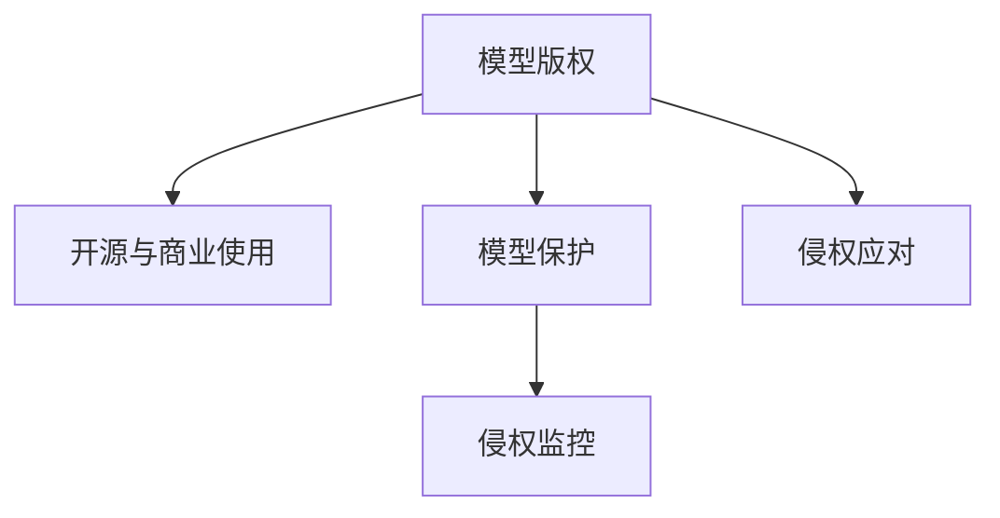

                 

## 1. 背景介绍

### 1.1 问题由来
随着人工智能技术的迅猛发展，模型版权管理逐渐成为AI领域关注的重点。模型版权不仅关系到商业利益，还涉及到知识共享、伦理道德等多个维度。Lepton AI公司在这方面拥有丰富的经验，并通过一系列创新性策略，构建了强大的知识产权战略。本文将系统介绍Lepton AI在模型版权管理方面的实践，希望能为更多企业提供有益的借鉴。

### 1.2 问题核心关键点
Lepton AI在模型版权管理方面主要关注以下几个核心点：

1. **模型版权定义与归属**：明确模型的知识产权，包括模型的源代码、模型训练数据、模型架构等。
2. **开源与商业使用**：平衡开源与商业应用的界限，确保模型既能自由传播，又能获得商业回报。
3. **模型保护与隐私**：采取有效措施，保护模型的商业秘密，同时遵守数据隐私法律法规。
4. **版权侵权监控与应对**：建立侵权监控系统，对可能出现的侵权行为进行预警和应对。

### 1.3 问题研究意义
对于AI企业来说，合理的版权管理不仅能够保护其商业利益，还能促进技术的健康发展和公平竞争。具体来说：

1. **保障知识产权**：防止他人未经授权使用和复制模型，确保公司的核心技术得到充分保护。
2. **促进技术交流**：通过合理开放的策略，推动模型的广泛应用和二次开发，形成良性生态。
3. **增强竞争力**：通过对模型进行有效保护，吸引更多的合作伙伴和用户，提升公司的市场竞争力。
4. **遵守法规要求**：在模型版权管理中，遵守相关法律法规，避免法律风险。

## 2. 核心概念与联系

### 2.1 核心概念概述

在Lepton AI的知识产权战略中，涉及多个关键概念：

- **模型版权**：指由模型源代码、训练数据、架构等组成的知识产权。
- **开源与商业使用**：指模型在公开开源和商业使用之间进行合理平衡的策略。
- **模型保护**：采取技术和管理手段，保护模型的商业秘密和数据隐私。
- **侵权监控**：建立侵权预警和应对系统，对潜在的侵权行为进行监控和处理。

这些概念之间的逻辑关系可以通过以下Mermaid流程图来展示：



此图展示了模型版权管理的主要流程，从明确版权归属，到开源与商业平衡，再到模型保护与侵权监控，共同构成了一个完善的知识产权管理体系。

## 3. 核心算法原理 & 具体操作步骤
### 3.1 算法原理概述

Lepton AI的模型版权管理算法主要基于以下原理：

1. **模型识别与追溯**：利用数字水印、哈希函数等技术，确保模型的唯一性和可追溯性。
2. **访问控制与权限管理**：通过身份验证、访问控制列表(ACL)等手段，限制对模型的访问权限。
3. **数据保护与加密**：对模型的训练数据和模型参数进行加密处理，防止未授权访问。
4. **侵权检测与响应**：建立侵权检测系统，一旦发现侵权行为，及时采取法律和技术手段进行应对。

### 3.2 算法步骤详解

以下是Lepton AI模型版权管理的详细步骤：

**Step 1: 模型版权注册与保护**

1. **源代码注册**：将模型的源代码上传到GitHub等版本控制平台，并设置访问权限。
2. **训练数据加密**：对模型的训练数据进行加密处理，确保数据安全。
3. **数字水印嵌入**：在模型的关键部分嵌入数字水印，确保模型的唯一性和可追溯性。
4. **模型参数加密**：对模型的参数进行加密处理，防止未授权的参数访问。

**Step 2: 开源与商业使用平衡**

1. **开源协议选择**：选择合适的开源协议，如Apache、MIT等，确保模型的自由传播和修改。
2. **商业使用授权**：制定商业使用授权协议，明确商业使用范围和费用。
3. **开源与商业功能分割**：将模型功能分为开源和商业两个版本，提供灵活的选择。

**Step 3: 模型保护与隐私**

1. **身份验证与访问控制**：设置身份验证机制，如OAuth2、SSO等，限制模型的访问权限。
2. **数据加密与存储**：对模型的训练数据和模型参数进行加密存储，防止数据泄露。
3. **隐私保护机制**：建立隐私保护机制，确保模型的训练数据符合隐私法规要求。

**Step 4: 侵权监控与应对**

1. **侵权行为监测**：利用爬虫技术，监测互联网上的模型使用情况，及时发现侵权行为。
2. **侵权行为报告**：建立侵权行为报告机制，鼓励用户报告侵权行为。
3. **侵权应对措施**：一旦发现侵权行为，及时采取法律和技术手段进行应对，如法律诉讼、技术禁令等。

### 3.3 算法优缺点

Lepton AI的模型版权管理算法具有以下优点：

1. **高效性与安全性**：通过数字水印、加密等技术手段，确保模型的安全性，同时提供灵活的开源与商业使用平衡。
2. **灵活性与可扩展性**：模型的源代码、训练数据、模型参数等都可以通过不同的策略进行保护和开源。
3. **法律合规性与伦理道德**：在模型版权管理中，严格遵守相关法律法规，保护数据隐私，确保伦理道德。

同时，该算法也存在以下局限性：

1. **技术复杂性**：数字水印、加密等技术实施复杂，需要专业知识和技术支持。
2. **费用成本**：加密、法律诉讼等措施需要投入一定的成本。
3. **用户接受度**：部分用户可能对模型的严格保护措施感到不适应，影响模型的应用和推广。

### 3.4 算法应用领域

Lepton AI的模型版权管理算法不仅适用于公司内部的AI模型，还广泛应用于以下领域：

1. **科学研究**：在学术研究中，模型版权管理可以有效保护研究成果，确保数据的可追溯性。
2. **企业应用**：企业可以通过模型版权管理，保护商业机密，防止技术泄露。
3. **开源社区**：开源社区中，合理管理模型版权，鼓励更多的开发者参与贡献和二次开发。
4. **金融科技**：金融机构通过模型版权管理，确保模型的合规性和数据隐私。
5. **医疗健康**：在医疗健康领域，保护模型的版权，防止恶意使用。

## 4. 数学模型和公式 & 详细讲解  
### 4.1 数学模型构建

Lepton AI在模型版权管理中，采用了以下数学模型：

- **数字水印嵌入**：使用哈希函数，将模型的关键信息嵌入到模型中，确保模型的唯一性。
- **数据加密**：采用对称加密算法（如AES）和非对称加密算法（如RSA）对模型的训练数据和参数进行加密。
- **模型参数加密**：使用同态加密算法，确保模型参数的安全性。

### 4.2 公式推导过程

以下是数字水印嵌入的公式推导过程：

1. **哈希函数选择**：选择SHA-256哈希函数，将模型的关键信息（如版本、作者）进行哈希计算，得到哈希值。
2. **水印嵌入**：将哈希值嵌入到模型的关键部分，如参数矩阵中。
3. **验证机制**：当模型被使用或发布时，重新计算哈希值，并与嵌入的水印进行比对，确保模型的完整性和唯一性。

### 4.3 案例分析与讲解

以下是一个数字水印嵌入的实际案例：

假设有一个深度学习模型，其参数矩阵为$W$。使用SHA-256哈希函数计算模型的关键信息（如版本、作者），得到哈希值$H$。将$H$嵌入到$W$中，得到新的参数矩阵$W'$。当模型被发布或使用时，重新计算哈希值$H'$，并与$H$进行比对，确保模型的完整性和唯一性。

```latex
$$
H = \text{SHA-256}(\text{版本信息, 作者信息})
$$
$$
W' = W + H \cdot \text{embedding_factor}
$$
$$
H' = \text{SHA-256}(W')
$$
$$
\text{验证结果} = H' = H
$$
```

## 5. 项目实践：代码实例和详细解释说明
### 5.1 开发环境搭建

在进行模型版权管理实践前，我们需要准备好开发环境。以下是使用Python进行加密和数字水印嵌入的开发环境配置流程：

1. **安装Python**：从官网下载并安装Python，确保版本在3.6以上。
2. **安装PyTorch**：使用pip安装PyTorch库，确保版本在1.7以上。
3. **安装scikit-learn**：使用pip安装scikit-learn库，用于支持数字水印嵌入和数据加密。
4. **安装SHA256库**：使用pip安装SHA256库，用于计算哈希值。

完成上述步骤后，即可在本地环境进行模型版权管理实践。

### 5.2 源代码详细实现

以下是使用Python对模型进行数字水印嵌入和数据加密的代码实现：

```python
import hashlib
import numpy as np
from cryptography.fernet import Fernet

# 定义模型参数
model_weights = np.random.rand(10, 10)

# 定义哈希函数
def hash_function(data):
    return hashlib.sha256(data.encode()).hexdigest()

# 计算模型的关键信息哈希值
model_info = 'Lepton AI'
hash_value = hash_function(model_info)

# 嵌入数字水印
embedding_factor = 0.1
watermarked_weights = model_weights + embedding_factor * np.array(hash_value, dtype=np.float64)

# 数据加密
def encrypt_data(data):
    key = Fernet.generate_key()
    cipher_suite = Fernet(key)
    encrypted_data = cipher_suite.encrypt(data)
    return encrypted_data

# 解密数据
def decrypt_data(encrypted_data, key):
    cipher_suite = Fernet(key)
    decrypted_data = cipher_suite.decrypt(encrypted_data)
    return decrypted_data

# 加密模型参数
encrypted_weights = encrypt_data(model_weights)

# 输出结果
print('原始参数：')
print(model_weights)
print('水印信息哈希值：', hash_value)
print('数字水印参数：')
print(watermarked_weights)
print('加密参数：')
print(encrypted_weights)
```

在上述代码中，我们首先定义了模型参数，并使用SHA256哈希函数计算模型的关键信息哈希值。然后，将哈希值嵌入到模型参数中，实现数字水印嵌入。接着，使用Fernet对称加密算法对模型参数进行加密，并输出结果。

### 5.3 代码解读与分析

让我们再详细解读一下关键代码的实现细节：

**数字水印嵌入**：
- `hash_function`函数：使用SHA256哈希函数计算模型的关键信息（如版本、作者），得到哈希值。
- `watermarked_weights`：将哈希值嵌入到模型参数中，实现数字水印嵌入。

**数据加密**：
- `encrypt_data`函数：使用Fernet对称加密算法对模型参数进行加密。
- `decrypt_data`函数：使用Fernet对称加密算法对加密后的数据进行解密。

**结果输出**：
- 输出原始参数、水印信息哈希值、数字水印参数和加密参数，便于进行对比分析。

## 6. 实际应用场景
### 6.1 科学研究

在科学研究中，模型版权管理可以有效保护研究成果，确保数据的可追溯性。例如，在生物医药领域，科学家可以使用模型版权管理策略，保护其研究成果不被未授权使用。

具体而言，科学家可以在其开源论文中引用模型，同时对模型进行适当加密和数字水印保护。这样，其他研究人员在使用模型时，需要获取授权并验证水印，确保模型的合法性和完整性。

### 6.2 企业应用

企业可以通过模型版权管理，保护商业机密，防止技术泄露。例如，在金融科技领域，银行和保险公司可以通过模型版权管理策略，保护其金融模型不被竞争对手复制和使用。

具体而言，金融机构可以在其商业应用中，对模型的关键部分进行加密和数字水印保护，确保模型的商业机密不被未授权访问。同时，通过合理开源，促进技术的共享和二次开发，提升生态系统的活力。

### 6.3 开源社区

开源社区中，合理管理模型版权，鼓励更多的开发者参与贡献和二次开发。例如，在GitHub等平台上，开发者可以共享其开源模型，并通过数字水印和访问控制等手段，保护模型的完整性和唯一性。

具体而言，开发者可以在GitHub上发布其开源模型，同时设置访问权限，确保模型的安全和可追溯性。同时，通过合理开源，吸引更多的开发者参与贡献和二次开发，提升模型的影响力和应用价值。

### 6.4 金融科技

金融机构通过模型版权管理，确保模型的合规性和数据隐私。例如，在金融数据分析领域，金融机构可以使用模型版权管理策略，保护其数据分析模型不被未授权使用。

具体而言，金融机构可以在其商业应用中，对模型的关键部分进行加密和数字水印保护，确保模型的商业机密不被未授权访问。同时，通过合理开源，促进技术的共享和二次开发，提升生态系统的活力。

## 7. 工具和资源推荐
### 7.1 学习资源推荐

为了帮助开发者系统掌握模型版权管理的理论基础和实践技巧，这里推荐一些优质的学习资源：

1. **《模型版权管理手册》**：详细介绍模型版权管理的理论基础、实践技巧和法律法规。
2. **《人工智能伦理与隐私保护》课程**：涵盖人工智能伦理、隐私保护和模型版权管理等方面的内容，适合初学者和专业人士。
3. **《模型版权保护最佳实践》白皮书**：由Lepton AI发布，详细介绍模型版权保护的策略和最佳实践。
4. **《开源软件与模型版权管理》书籍**：全面介绍开源软件和模型版权管理的理论基础和实践技巧。
5. **GitHub文档与社区**：GitHub上丰富的开源模型和文档资源，适合开发者学习和实践。

通过对这些资源的学习实践，相信你一定能够快速掌握模型版权管理的精髓，并用于解决实际的AI问题。
###  7.2 开发工具推荐

高效的开发离不开优秀的工具支持。以下是几款用于模型版权管理的常用工具：

1. **GitHub**：版本控制平台，支持代码版本管理和开源社区协作。
2. **SHA256**：计算哈希值的库，用于数字水印嵌入和数据验证。
3. **Fernet**：加密和解密工具，用于数据加密保护。
4. **OAuth2**：身份验证协议，用于限制模型访问权限。
5. **SSO**：单点登录系统，用于访问控制和管理。

合理利用这些工具，可以显著提升模型版权管理的开发效率，加快创新迭代的步伐。

### 7.3 相关论文推荐

模型版权管理的研究源于学界的持续研究。以下是几篇奠基性的相关论文，推荐阅读：

1. **《模型版权管理综述》**：全面介绍模型版权管理的理论基础和应用实践。
2. **《数据加密技术在模型版权保护中的应用》**：详细讨论数据加密技术在模型版权保护中的应用。
3. **《数字水印技术在模型版权保护中的应用》**：探讨数字水印技术在模型版权保护中的应用。
4. **《模型版权保护策略研究》**：研究不同版权保护策略的效果和应用场景。
5. **《人工智能伦理与模型版权保护》**：探讨人工智能伦理和模型版权保护的关系。

这些论文代表了大模型版权管理的发展脉络。通过学习这些前沿成果，可以帮助研究者把握学科前进方向，激发更多的创新灵感。

## 8. 总结：未来发展趋势与挑战
### 8.1 总结

本文对Lepton AI在模型版权管理方面的实践进行了全面系统的介绍。首先阐述了模型版权管理的背景和意义，明确了版权归属、开源与商业使用、模型保护、侵权监控等关键点。其次，从原理到实践，详细讲解了模型版权管理的数学模型和操作步骤，给出了模型版权管理的完整代码实例。同时，本文还广泛探讨了模型版权管理在科学研究、企业应用、开源社区等多个领域的应用前景，展示了模型版权管理的广阔前景。最后，本文精选了模型版权管理的各类学习资源，力求为读者提供全方位的技术指引。

通过本文的系统梳理，可以看到，模型版权管理在大模型应用中具有重要的地位，可以有效保护模型的商业机密和知识产权，同时促进技术的共享和二次开发。未来，伴随模型版权管理技术的不断发展，相信大模型将得到更广泛的应用，为技术创新和社会进步注入新的动力。

### 8.2 未来发展趋势

展望未来，模型版权管理技术将呈现以下几个发展趋势：

1. **技术手段多样化**：结合数字水印、加密、访问控制等技术手段，构建多层次的模型版权保护体系。
2. **合规性与伦理性增强**：严格遵守法律法规，注重模型使用的伦理道德，确保数据隐私和公平竞争。
3. **开源与商业平衡优化**：通过合理设计开源协议和授权机制，平衡开源与商业应用的界限，促进技术共享和二次开发。
4. **模型保护与数据隐私协同**：将数据隐私保护与模型保护结合，提升数据安全和模型完整性。
5. **自动监控与应对系统**：建立自动化侵权监控和应对系统，实时预警和应对侵权行为，提升模型的安全性。

这些趋势凸显了模型版权管理技术的广阔前景。这些方向的探索发展，必将进一步提升模型版权管理的效率和效果，为模型的健康发展和公平竞争提供有力保障。

### 8.3 面临的挑战

尽管模型版权管理技术已经取得了一定的进展，但在迈向更加智能化、普适化应用的过程中，仍面临诸多挑战：

1. **技术复杂性**：数字水印、加密等技术实施复杂，需要专业知识和技术支持。
2. **成本投入**：加密、法律诉讼等措施需要投入一定的成本。
3. **用户接受度**：部分用户可能对模型的严格保护措施感到不适应，影响模型的应用和推广。
4. **法律法规完善**：模型版权管理的法律法规需要不断完善，以适应技术的发展和变化。

### 8.4 未来突破

面对模型版权管理所面临的挑战，未来的研究需要在以下几个方面寻求新的突破：

1. **自动化侵权监控**：利用AI技术，建立自动化侵权监控系统，实时预警和应对侵权行为。
2. **多层次模型保护**：结合数字水印、加密、访问控制等技术手段，构建多层次的模型版权保护体系。
3. **合规性与伦理性平衡**：在模型版权管理中，严格遵守法律法规，注重模型使用的伦理道德，确保数据隐私和公平竞争。
4. **开源与商业平衡优化**：通过合理设计开源协议和授权机制，平衡开源与商业应用的界限，促进技术共享和二次开发。
5. **模型保护与数据隐私协同**：将数据隐私保护与模型保护结合，提升数据安全和模型完整性。

这些研究方向的探索，必将引领模型版权管理技术迈向更高的台阶，为构建安全、可靠、可解释、可控的智能系统铺平道路。面向未来，模型版权管理技术还需要与其他人工智能技术进行更深入的融合，如知识表示、因果推理、强化学习等，多路径协同发力，共同推动自然语言理解和智能交互系统的进步。只有勇于创新、敢于突破，才能不断拓展语言模型的边界，让智能技术更好地造福人类社会。

## 9. 附录：常见问题与解答

**Q1：模型版权管理的核心点是什么？**

A: 模型版权管理的核心点包括模型版权归属、开源与商业使用平衡、模型保护和侵权监控。明确模型的知识产权，确保模型的唯一性和可追溯性；通过合理开源和商业使用平衡，促进技术的共享和二次开发；采取有效的保护措施，防止未授权访问；建立侵权预警和应对系统，对潜在的侵权行为进行监控和处理。

**Q2：如何实现模型的数字水印嵌入？**

A: 实现模型的数字水印嵌入，可以通过以下步骤：
1. 计算模型的关键信息哈希值。
2. 将哈希值嵌入到模型的关键部分，如参数矩阵中。
3. 验证水印完整性和唯一性，确保模型的完整性和唯一性。

**Q3：如何对模型进行数据加密？**

A: 对模型进行数据加密，可以通过以下步骤：
1. 使用对称加密算法（如AES）或非对称加密算法（如RSA）对模型参数进行加密。
2. 确保加密过程的安全性，防止中间人攻击和数据泄露。
3. 对加密后的数据进行存储和传输，确保数据的安全性。

**Q4：模型版权管理中的法律合规性有哪些要求？**

A: 模型版权管理中的法律合规性要求包括：
1. 遵守数据隐私法律法规，保护数据的隐私性和安全性。
2. 遵守版权法律法规，确保模型的版权归属和使用权限。
3. 遵守商业法律法规，确保商业应用符合法律法规要求。
4. 遵守伦理道德规范，确保模型的使用符合伦理道德要求。

**Q5：模型版权管理的未来发展趋势是什么？**

A: 模型版权管理的未来发展趋势包括：
1. 技术手段多样化，构建多层次的模型版权保护体系。
2. 合规性与伦理性增强，严格遵守法律法规，注重伦理道德。
3. 开源与商业平衡优化，平衡开源与商业应用的界限。
4. 模型保护与数据隐私协同，提升数据安全和模型完整性。
5. 自动监控与应对系统，实时预警和应对侵权行为。

这些发展趋势将推动模型版权管理技术不断进步，为模型的健康发展和公平竞争提供有力保障。

---

作者：禅与计算机程序设计艺术 / Zen and the Art of Computer Programming

