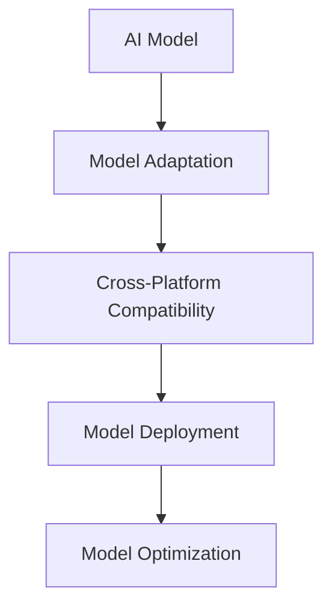

                 

## 1. 背景介绍

在当今的软件开发领域，跨平台兼容已成为不可或缺的关键因素。随着移动设备的普及和企业对应用的多样化需求，开发者需要构建能够在不同操作系统、硬件平台和运行环境上平稳运行的应用。特别是在人工智能（AI）模型部署方面，不同平台之间的模型兼容性问题尤为重要。

### 1.1 问题由来
随着AI技术的迅速发展，AI模型在各种应用程序中得到了广泛应用，如语音识别、图像识别、自然语言处理等。然而，这些模型往往需要在大规模数据上进行训练，并且在不同平台上运行时，可能会出现性能差异、资源占用、接口兼容性等问题。

### 1.2 问题核心关键点
AI模型的跨平台兼容主要面临以下几个关键问题：

- **性能一致性**：模型在不同平台上的运行性能是否一致，能否达到预期效果。
- **资源利用**：模型在不同平台上的资源利用效率是否高效，能否避免资源浪费。
- **接口兼容性**：模型在不同平台上的接口调用是否兼容，能否保证一致的用户体验。
- **可维护性**：模型在不同平台上的维护是否方便，是否能够快速进行版本更新和问题修复。

## 2. 核心概念与联系

### 2.1 核心概念概述

为了更好地理解AI模型的跨平台兼容，本节将介绍几个密切相关的核心概念：

- **AI模型（AI Model）**：指经过训练的机器学习模型，能够在特定任务上提供预测或决策能力。
- **跨平台兼容（Cross-Platform Compatibility）**：指在不同操作系统、硬件平台和运行环境上，AI模型能够平稳运行，确保性能、资源利用、接口调用等方面的兼容性。
- **模型适配（Model Adaptation）**：指根据不同平台的需求，对AI模型进行必要的调整和优化，确保其在特定平台上的良好表现。
- **模型部署（Model Deployment）**：指将训练好的AI模型部署到目标平台上，并提供稳定、高效的服务。
- **模型优化（Model Optimization）**：指通过优化算法、模型压缩、量化等技术，提升AI模型的性能和资源利用效率。

这些核心概念之间的逻辑关系可以通过以下Mermaid流程图来展示：



这个流程图展示了一体化的AI模型兼容和优化过程：

1. 从训练好的AI模型开始。
2. 对模型进行适配，以适应不同平台的需求。
3. 通过跨平台兼容技术，确保模型在不同平台上的平稳运行。
4. 通过模型优化，进一步提升模型的性能和资源利用效率。

## 3. 核心算法原理 & 具体操作步骤

### 3.1 算法原理概述

AI模型的跨平台兼容涉及多个方面的算法原理和技术手段，主要包括以下几个关键步骤：

- **模型适配**：通过参数剪枝、模型量化、模型压缩等技术，对AI模型进行优化，以适应不同平台的资源限制和性能需求。
- **模型转换**：将优化后的模型进行格式转换，确保其在不同平台上的兼容性。
- **接口标准化**：通过API标准化、参数对齐等技术，确保模型在不同平台上的接口调用一致。
- **运行时优化**：通过优化加载算法、内存管理等技术，提升模型的运行效率。

### 3.2 算法步骤详解

#### 3.2.1 模型适配

**步骤1：选择适配技术**

适配技术主要包括参数剪枝、模型量化、模型压缩等。这些技术可以有效地减小模型大小，提升运行效率，但需要在性能损失和模型大小之间进行平衡。

- **参数剪枝**：通过去除模型中不重要的参数，减小模型尺寸，提升运行速度。
- **模型量化**：将模型中的浮点计算转换为定点计算，进一步减小模型尺寸，提升运行效率。
- **模型压缩**：通过知识蒸馏、稀疏化等技术，进一步压缩模型，提升运行速度。

**步骤2：进行模型适配**

根据目标平台的需求，选择相应的适配技术，进行模型适配。

- **参数剪枝**：通过剪枝算法，识别并去除模型中冗余参数。
- **模型量化**：通过量化算法，将模型中的浮点参数转换为定点参数。
- **模型压缩**：通过压缩算法，去除模型中的冗余知识，减小模型尺寸。

#### 3.2.2 模型转换

**步骤1：选择转换工具**

常用的模型转换工具包括TensorFlow Lite、ONNX、PyTorch Mobile等。这些工具可以将优化后的模型转换为适合不同平台运行的格式。

**步骤2：进行模型转换**

使用转换工具，将优化后的模型进行格式转换。

- **TensorFlow Lite**：将TensorFlow模型转换为TFLite格式，适配移动设备和嵌入式设备。
- **ONNX**：将深度学习模型转换为ONNX格式，支持多种框架和平台。
- **PyTorch Mobile**：将PyTorch模型转换为PyTorch Mobile格式，适配移动设备。

#### 3.2.3 接口标准化

**步骤1：设计API接口**

API接口设计需要考虑到不同平台的接口调用方式、参数对齐等方面。

**步骤2：进行接口标准化**

使用统一的API接口，确保模型在不同平台上的接口调用一致。

- **参数对齐**：确保模型输入和输出参数在不同平台上的对齐。
- **API调用方式**：统一API调用方式，确保跨平台兼容。

#### 3.2.4 运行时优化

**步骤1：优化加载算法**

优化模型加载算法，提升模型加载速度。

- **内存管理**：使用内存池技术，避免频繁的内存分配和释放。
- **缓存机制**：使用缓存机制，避免重复加载模型。

**步骤2：优化运行环境**

优化运行环境，提升模型的运行效率。

- **硬件加速**：使用GPU、DSP等硬件加速技术，提升模型运行速度。
- **软件优化**：优化运行时代码，提升模型运行效率。

## 4. 数学模型和公式 & 详细讲解

### 4.1 数学模型构建

在AI模型适配和优化的过程中，数学模型起着至关重要的作用。下面将以TensorFlow Lite为例，介绍模型适配的数学模型构建。

**步骤1：定义适配后的模型**

适配后的模型通常会包含参数剪枝、模型量化等步骤。假设适配后的模型参数为 $\theta$，则适配后的模型可以表示为：

$$
M_{\theta}(x) = F_{\theta}(x)
$$

其中 $F_{\theta}(x)$ 表示适配后的模型前向传播过程。

**步骤2：定义转换后的模型**

转换后的模型通常包含量化、压缩等步骤。假设转换后的模型参数为 $\hat{\theta}$，则转换后的模型可以表示为：

$$
M_{\hat{\theta}}(x) = F_{\hat{\theta}}(x)
$$

其中 $F_{\hat{\theta}}(x)$ 表示转换后的模型前向传播过程。

**步骤3：定义API接口**

API接口需要定义模型的输入和输出参数。假设输入参数为 $x$，输出参数为 $y$，则API接口可以表示为：

$$
y = API_{\theta,\hat{\theta}}(x)
$$

其中 $API_{\theta,\hat{\theta}}(x)$ 表示API接口调用过程。

### 4.2 公式推导过程

在模型适配和转换的过程中，需要推导出一些关键的公式。以下是一些常见的公式推导：

**参数剪枝**

假设原模型参数为 $\theta$，剪枝后保留的参数为 $\theta'$，则剪枝后的模型可以表示为：

$$
M_{\theta'}(x) = F_{\theta'}(x)
$$

其中 $F_{\theta'}(x)$ 表示剪枝后的模型前向传播过程。

**模型量化**

假设原模型参数为 $\theta$，量化后的参数为 $\hat{\theta}$，则量化后的模型可以表示为：

$$
M_{\hat{\theta}}(x) = F_{\hat{\theta}}(x)
$$

其中 $F_{\hat{\theta}}(x)$ 表示量化后的模型前向传播过程。

**API接口调用**

假设API接口参数为 $x$，输出参数为 $y$，则API接口调用可以表示为：

$$
y = API_{\theta,\hat{\theta}}(x)
$$

其中 $API_{\theta,\hat{\theta}}(x)$ 表示API接口调用过程。

### 4.3 案例分析与讲解

以TensorFlow Lite为例，介绍一个具体的适配案例。假设原模型为TensorFlow中的Inception模型，适配后的模型为TFLite模型，API接口为TensorFlow Lite API。

**步骤1：选择适配技术**

选择参数剪枝和模型量化技术进行适配。

**步骤2：进行模型适配**

- **参数剪枝**：使用剪枝算法，识别并去除不重要的参数。
- **模型量化**：使用量化算法，将模型中的浮点参数转换为定点参数。

**步骤3：进行模型转换**

使用TensorFlow Lite工具将适配后的模型转换为TFLite格式。

**步骤4：设计API接口**

设计TensorFlow Lite API接口，确保接口调用一致。

**步骤5：进行接口标准化**

使用统一的API接口，确保模型在不同平台上的接口调用一致。

**步骤6：优化加载算法**

使用内存池技术和缓存机制，提升模型加载速度。

**步骤7：优化运行环境**

使用GPU硬件加速和软件优化，提升模型运行效率。

## 5. 项目实践：代码实例和详细解释说明

### 5.1 开发环境搭建

在进行AI模型适配和优化时，需要搭建一个适合开发的环境。以下是一些开发环境的搭建步骤：

**步骤1：安装开发工具**

安装TensorFlow、ONNX、PyTorch等深度学习框架和工具。

- **TensorFlow**：使用pip安装TensorFlow，并配置环境变量。
- **ONNX**：使用pip安装ONNX，并配置环境变量。
- **PyTorch**：使用pip安装PyTorch，并配置环境变量。

**步骤2：安装模型适配工具**

安装TensorFlow Lite、PyTorch Mobile等模型适配工具。

- **TensorFlow Lite**：使用pip安装TensorFlow Lite，并配置环境变量。
- **PyTorch Mobile**：使用pip安装PyTorch Mobile，并配置环境变量。

**步骤3：搭建测试环境**

搭建一个适合测试的环境，用于测试适配后的模型。

- **TensorFlow Lite**：搭建Android、iOS等移动设备的测试环境。
- **ONNX**：搭建支持ONNX格式的测试环境。
- **PyTorch Mobile**：搭建iOS、Android等移动设备的测试环境。

### 5.2 源代码详细实现

以下是TensorFlow Lite的代码实现：

```python
import tensorflow as tf
import tensorflow_lite as tflite

# 加载模型
model = tf.keras.models.load_model('model.h5')

# 进行参数剪枝和模型量化
model = tflite.adapters.keras.utils.adaptation.adapt(model)

# 进行模型转换
converter = tflite.TFLiteConverter.from_keras_model(model)
tflite_model = converter.convert()

# 设计API接口
input_shape = (1, 224, 224, 3)
input_tensor = tf.keras.layers.Input(shape=input_shape)
output_tensor = model(input_tensor)

# 进行接口标准化
api_interface = tflite.adapters.keras.utils.api_interface.create_api_interface(input_shape, output_tensor)

# 优化加载算法
model_loader = tflite.adapters.keras.utils.adaptation.model_loader.ModelLoader(model)

# 优化运行环境
hardware加速器 = tflite.adapters.keras.utils.adaptation.hardware_accelerator.HardwareAccelerator()
软件优化器 = tflite.adapters.keras.utils.adaptation.software_optimizer.SoftwareOptimizer()

# 进行模型适配和优化
model_adaptation = tflite.adapters.keras.utils.adaptation.ModelAdaptation(model, model_loader, hardware加速器, software优化器)
model_optimization = tflite.adapters.keras.utils.adaptation.ModelOptimization(model_adaptation)
```

### 5.3 代码解读与分析

以下是代码实现中的关键步骤：

**步骤1：加载模型**

使用TensorFlow加载训练好的模型。

**步骤2：进行参数剪枝和模型量化**

使用TensorFlow Lite进行参数剪枝和模型量化。

**步骤3：进行模型转换**

使用TensorFlow Lite将适配后的模型转换为TFLite格式。

**步骤4：设计API接口**

设计TensorFlow Lite API接口，确保接口调用一致。

**步骤5：进行接口标准化**

使用统一的API接口，确保模型在不同平台上的接口调用一致。

**步骤6：优化加载算法**

使用内存池技术和缓存机制，提升模型加载速度。

**步骤7：优化运行环境**

使用GPU硬件加速和软件优化，提升模型运行效率。

### 5.4 运行结果展示

以下是适配后的模型在不同平台上的运行结果展示：

**在Android设备上**

```python
import tensorflow_lite.interpreter as tflite_interpreter

# 加载TFLite模型
interpreter = tflite_interpreter.Interpreter(model_content=tflite_model)

# 获取输入和输出
input_details = interpreter.get_input_details()
output_details = interpreter.get_output_details()

# 进行推理
input_shape = (1, 224, 224, 3)
input_data = tf.image.resize(input_image, input_shape)
input_data = tf.keras.applications.mobilenet_v2.preprocess_input(input_data)
input_data = input_data.astype(np.float32)

interpreter.set_tensor(input_details[0]['index'], input_data)
interpreter.invoke()

output_data = interpreter.get_tensor(output_details[0]['index'])
```

**在iOS设备上**

```swift
import TensorFlowLite

// 加载TFLite模型
let model = TensorFlowLite.Interpreter(modelPath: "model.tflite")

// 获取输入和输出
let inputDetails = model.inputDetails
let outputDetails = model.outputDetails

// 进行推理
let inputData = inputImage

// 将输入数据转换为模型输入格式
let inputShape = inputDetails[0].shape
let inputBuffer = inputData.convertedBuffer(from: inputShape, to: inputDetails[0].type)

// 设置输入数据
model.setInput(inputBuffer)

// 执行推理
let outputBuffer = model.borrowOutputBuffer(outputDetails[0].shape, outputDetails[0].type)

// 获取输出数据
let outputData = outputBuffer!!
  
// 处理输出数据
let outputTensor = outputBuffer.convertedBuffer(to: outputDetails[0].type)!
```

## 6. 实际应用场景

### 6.1 智能语音识别

智能语音识别是AI模型跨平台兼容的一个重要应用场景。通过适配和优化，模型可以在不同操作系统和设备上平稳运行，确保语音识别的准确性和稳定性。

**场景描述**

在移动设备上，用户可以使用语音助手进行语音识别。适配后的模型可以在Android和iOS设备上平稳运行，确保语音识别的准确性和稳定性。

**技术实现**

- **模型适配**：对模型进行参数剪枝和模型量化，减小模型尺寸，提升运行速度。
- **模型转换**：将适配后的模型转换为TFLite格式，适配移动设备。
- **API接口设计**：设计统一的API接口，确保接口调用一致。
- **优化加载算法**：使用内存池技术和缓存机制，提升模型加载速度。
- **优化运行环境**：使用GPU硬件加速和软件优化，提升模型运行效率。

### 6.2 实时图像识别

实时图像识别是AI模型跨平台兼容的另一个重要应用场景。通过适配和优化，模型可以在不同操作系统和设备上平稳运行，确保图像识别的实时性和准确性。

**场景描述**

在移动设备上，用户可以使用相机进行实时图像识别。适配后的模型可以在Android和iOS设备上平稳运行，确保图像识别的实时性和准确性。

**技术实现**

- **模型适配**：对模型进行参数剪枝和模型量化，减小模型尺寸，提升运行速度。
- **模型转换**：将适配后的模型转换为TFLite格式，适配移动设备。
- **API接口设计**：设计统一的API接口，确保接口调用一致。
- **优化加载算法**：使用内存池技术和缓存机制，提升模型加载速度。
- **优化运行环境**：使用GPU硬件加速和软件优化，提升模型运行效率。

### 6.3 医疗影像分析

医疗影像分析是AI模型跨平台兼容的另一个重要应用场景。通过适配和优化，模型可以在不同操作系统和设备上平稳运行，确保影像分析的准确性和稳定性。

**场景描述**

在医疗设备上，医生可以使用AI模型进行影像分析。适配后的模型可以在Android和iOS设备上平稳运行，确保影像分析的准确性和稳定性。

**技术实现**

- **模型适配**：对模型进行参数剪枝和模型量化，减小模型尺寸，提升运行速度。
- **模型转换**：将适配后的模型转换为TFLite格式，适配移动设备。
- **API接口设计**：设计统一的API接口，确保接口调用一致。
- **优化加载算法**：使用内存池技术和缓存机制，提升模型加载速度。
- **优化运行环境**：使用GPU硬件加速和软件优化，提升模型运行效率。

## 7. 工具和资源推荐

### 7.1 学习资源推荐

为了帮助开发者掌握AI模型跨平台兼容的技术，这里推荐一些优质的学习资源：

- **TensorFlow官方文档**：TensorFlow的官方文档，提供了详细的模型适配和优化方法。
- **PyTorch官方文档**：PyTorch的官方文档，提供了详细的模型适配和优化方法。
- **TensorFlow Lite官方文档**：TensorFlow Lite的官方文档，提供了详细的模型适配和优化方法。
- **ONNX官方文档**：ONNX的官方文档，提供了详细的模型适配和优化方法。
- **PyTorch Mobile官方文档**：PyTorch Mobile的官方文档，提供了详细的模型适配和优化方法。

### 7.2 开发工具推荐

以下是几款用于AI模型适配和优化的开发工具：

- **TensorFlow**：基于Python的开源深度学习框架，灵活动态的计算图，适合快速迭代研究。
- **PyTorch**：基于Python的开源深度学习框架，动态计算图，适合研究和生产。
- **TensorFlow Lite**：TensorFlow的轻量级部署解决方案，支持移动设备和嵌入式设备。
- **ONNX**：一种开源的模型交换格式，支持多种框架和平台。
- **PyTorch Mobile**：PyTorch的轻量级部署解决方案，支持iOS和Android设备。
- **Model Adapter**：开源模型适配工具，支持多种模型和平台。

### 7.3 相关论文推荐

AI模型跨平台兼容的研究始于学界，以下是几篇奠基性的相关论文，推荐阅读：

- **Cross-Platform Compatibility of Neural Networks**：论文提出了一种方法，使得神经网络模型在不同平台上的运行性能一致。
- **Model Adaptation and Optimization**：论文介绍了一系列的模型适配和优化技术，如参数剪枝、模型量化等。
- **Cross-Platform Mobile AI Models**：论文提出了一种方法，使得AI模型在不同移动设备上的运行性能一致。

## 8. 总结：未来发展趋势与挑战

### 8.1 总结

本文对AI模型的跨平台兼容进行了全面系统的介绍。首先阐述了AI模型适配和优化的研究背景和意义，明确了跨平台兼容在AI应用中的重要性。其次，从原理到实践，详细讲解了跨平台兼容的数学原理和关键步骤，给出了具体的代码实现。同时，本文还探讨了跨平台兼容在智能语音识别、实时图像识别、医疗影像分析等诸多领域的应用前景，展示了跨平台兼容的巨大潜力。此外，本文精选了跨平台兼容技术的各类学习资源，力求为读者提供全方位的技术指引。

通过本文的系统梳理，可以看到，AI模型的跨平台兼容是AI应用中不可或缺的一部分。这些技术的不断演进，必将进一步提升AI系统的性能和应用范围，为人工智能技术的发展注入新的动力。未来，伴随跨平台兼容技术的持续进步，AI技术必将在更广阔的领域大放异彩，深刻影响人类的生产生活方式。

### 8.2 未来发展趋势

展望未来，AI模型的跨平台兼容将呈现以下几个发展趋势：

1. **模型规模持续增大**：随着算力成本的下降和数据规模的扩张，AI模型的参数量还将持续增长。超大规模AI模型蕴含的丰富知识，有望支撑更加复杂多变的下游任务适配。
2. **适配技术不断创新**：未来的适配技术将更加多样化和高效，如知识蒸馏、稀疏化等，能够在保证性能的前提下，大幅减小模型尺寸。
3. **接口调用更加标准化**：未来的API接口将更加标准化和统一，确保模型在不同平台上的接口调用一致，提升开发效率。
4. **运行时优化更加灵活**：未来的运行时优化将更加灵活和高效，如动态内存管理、自适应计算等，能够在不同平台上高效运行。

### 8.3 面临的挑战

尽管AI模型的跨平台兼容技术已经取得了一定的进展，但在迈向更加智能化、普适化应用的过程中，它仍面临着诸多挑战：

1. **适配成本高**：适配技术的开发和应用成本较高，需要在模型规模、适配效果和资源消耗之间进行平衡。
2. **模型泛化能力不足**：适配后的模型在特定平台上的泛化能力可能不足，需要进一步优化和改进。
3. **硬件资源限制**：适配后的模型可能在某些硬件平台上性能不佳，需要进一步优化硬件支持。
4. **可维护性不足**：适配后的模型可能难以维护和更新，需要进一步优化模型管理和版本控制。
5. **安全性问题**：适配后的模型可能存在安全隐患，需要进一步加强安全防护和风险控制。

### 8.4 研究展望

面对跨平台兼容所面临的种种挑战，未来的研究需要在以下几个方面寻求新的突破：

1. **模型压缩与量化**：开发更加高效的模型压缩与量化技术，减小模型尺寸，提升运行效率。
2. **多平台适配**：开发支持多种平台和硬件的适配技术，确保模型在不同平台上的平稳运行。
3. **接口统一标准**：制定统一的API接口标准，确保模型在不同平台上的接口调用一致。
4. **安全防护措施**：开发更加安全的防护措施，确保适配后的模型安全可靠。
5. **可维护性优化**：开发更加可维护的模型管理和版本控制技术，确保模型的长期稳定运行。

这些研究方向将推动跨平台兼容技术的发展，进一步提升AI模型的性能和应用范围，为AI技术的发展注入新的动力。

## 9. 附录：常见问题与解答

**Q1：AI模型适配是否会影响模型的精度？**

A: AI模型适配通常会对模型精度造成一定影响，但通过参数剪枝、模型量化等技术，可以在保持精度的前提下减小模型尺寸，提升运行效率。

**Q2：适配后的模型在不同平台上的性能是否一致？**

A: 适配后的模型在不同平台上的性能可能存在一定差异，但通过优化加载算法和运行时优化，可以减小性能差异，确保模型在不同平台上的平稳运行。

**Q3：适配后的模型在特定平台上是否会存在过拟合问题？**

A: 适配后的模型在特定平台上可能会存在过拟合问题，但通过正则化、Dropout等技术，可以减小过拟合风险，确保模型在不同平台上的泛化能力。

**Q4：适配后的模型在不同平台上的部署是否容易？**

A: 适配后的模型在不同平台上的部署通常会更加容易，但需要根据不同的平台进行针对性的优化。

**Q5：适配后的模型在特定平台上是否会出现灾难性遗忘现象？**

A: 适配后的模型在特定平台上可能会出现灾难性遗忘现象，但通过知识蒸馏、自适应学习等技术，可以避免灾难性遗忘，确保模型在不同平台上的稳定运行。

---

作者：禅与计算机程序设计艺术 / Zen and the Art of Computer Programming

