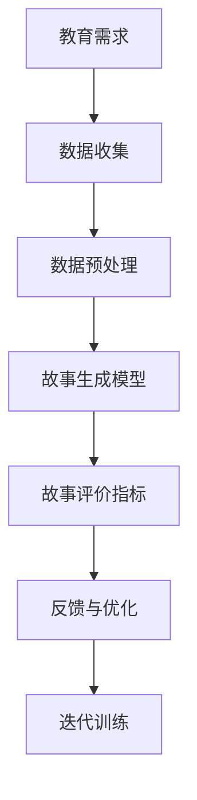

                 

## 1. 背景介绍

### 1.1 问题由来
随着人工智能(AI)技术的迅猛发展，其在教育领域的潜力逐渐被各方所重视。AI生成的教育内容，特别是故事创作，不仅能够激发学生的兴趣，提升学习效率，还能在趣味中完成知识的传授，达到寓教于乐的效果。但如何平衡创作自由度和教育内容的准确性，如何衡量生成故事的趣味性和教育价值，一直是一大难题。

### 1.2 问题核心关键点
AI故事创作的核心在于如何运用自然语言处理(NLP)技术和生成模型，结合教育需求，生成具有吸引力和教育意义的故事。主要问题包括：

- 如何构建有效的故事生成模型？
- 如何衡量故事的教育价值和趣味性？
- 如何保证故事创作的自由度和教育内容的准确性？
- 如何适配不同年龄段和知识水平的学生？

### 1.3 问题研究意义
AI故事创作不仅能够提升学生的阅读兴趣和理解能力，还能激发其创造力和想象力。特别是在泛在学习和个性化教育的大趋势下，AI生成的故事内容将为教育资源的丰富和普及提供新的可能性，推动教育公平和个性化教育的发展。

## 2. 核心概念与联系

### 2.1 核心概念概述

为深入理解AI故事创作技术，本文将介绍几个关键概念：

- 自然语言处理(NLP)：涉及语言模型、文本生成、情感分析等，是AI故事创作的基础。
- 生成模型(Generative Model)：如RNN、GAN、Transformer等，用于生成文本、图像等。
- 教育需求：根据不同年龄段和学科知识水平，定制化生成教育故事。
- 故事评价指标：趣味性、教育性、语言流畅度等，用于评估生成故事的质量。

### 2.2 核心概念原理和架构的 Mermaid 流程图



## 3. 核心算法原理 & 具体操作步骤

### 3.1 算法原理概述

AI故事创作的核心是结合教育需求，运用生成模型生成文本。主要算法流程包括：

1. 收集与预处理教育数据：
   - 收集不同年龄段、不同学科的教育内容。
   - 清洗、标注数据，去除噪声和无关信息。

2. 构建故事生成模型：
   - 使用RNN、Transformer等序列生成模型。
   - 训练模型，使其能够生成符合教育需求的故事情节。

3. 评估与优化：
   - 定义故事评价指标，如教育性、趣味性、语言流畅度等。
   - 使用评价指标评估生成故事的优劣。
   - 根据反馈进行模型优化。

4. 迭代训练：
   - 不断迭代训练模型，逐步提升故事生成的质量。

### 3.2 算法步骤详解

#### 3.2.1 数据收集与预处理

1. 数据收集
   - 收集不同年龄段的读物、教材、科普文章等。
   - 收集与学科相关的教育故事，如科学探索、历史传说、文学故事等。
   - 收集学生的阅读偏好、兴趣点等信息，用于故事创作适配。

2. 数据预处理
   - 文本清洗：去除无关字眼、标点符号等噪声。
   - 分词：将文本转换为模型可接受的分词形式。
   - 标注：给文本添加句子标记、实体识别等。
   - 标准化：统一文本格式、字符编码等。

#### 3.2.2 构建故事生成模型

1. 选择模型
   - 选择适合的生成模型，如GPT、LSTM等。
   - 根据教育需求和数据特点，调整模型结构。

2. 训练模型
   - 使用收集的数据训练模型，最小化生成故事的语义误差。
   - 调整损失函数、优化器等，提升训练效果。

#### 3.2.3 故事评估与优化

1. 故事评估
   - 定义评估指标，如教育性、趣味性、语言流畅度等。
   - 使用人工评估和自动化评估相结合的方法，评估生成故事的质量。

2. 反馈与优化
   - 收集反馈，改进模型。
   - 根据反馈调整模型参数，优化生成策略。

#### 3.2.4 迭代训练

1. 重复迭代
   - 不断训练模型，逐步提升故事生成的质量。
   - 使用新的数据进行训练，丰富故事生成内容。

2. 模型评估
   - 定期评估模型生成故事的质量，确认是否满足教育需求。

### 3.3 算法优缺点

#### 3.3.1 优点

1. 个性化教学：能够根据学生兴趣和知识水平生成个性化故事，提升学习效果。
2. 趣味性：生成的故事具有趣味性和吸引力，激发学生的阅读兴趣。
3. 内容丰富：基于大规模数据训练的模型，能够生成多样化的故事内容。
4. 适应性强：能够适应不同年龄段和学科的教育需求。

#### 3.3.2 缺点

1. 质量不稳定：生成故事的品质受模型训练数据、参数设置等因素影响较大。
2. 缺乏互动：与真实教师的互动相比，生成故事缺乏及时的反馈和指导。
3. 伦理风险：生成的故事可能包含不良内容，需严格审查和过滤。
4. 依赖模型：模型生成的故事依赖于模型的性能，模型训练和优化较为复杂。

### 3.4 算法应用领域

AI故事创作技术在教育领域有着广泛的应用前景，包括但不限于以下几个方面：

1. 阅读教育：生成具有教育意义的读物、故事，提升学生的阅读理解能力。
2. 历史教学：结合历史故事、传说，使学生更易于理解和记忆历史知识。
3. 科学探索：生成科普故事、科学实验描述，激发学生对科学的兴趣和探索精神。
4. 文学创作：生成文学故事、诗歌等，培养学生的文学素养和创造力。
5. 语言学习：生成适合不同语言水平的故事，辅助语言学习。

## 4. 数学模型和公式 & 详细讲解 & 举例说明

### 4.1 数学模型构建

#### 4.1.1 文本生成模型
以GPT模型为例，文本生成模型可以表示为：

$$ P(x_1,\ldots,x_n|C) = \prod_{i=1}^n P(x_i|x_1,\ldots,x_{i-1},C) $$

其中 $C$ 表示教育需求，$x_i$ 表示生成的文本单词。

#### 4.1.2 评价指标
假设 $E$ 表示教育性指标，$I$ 表示趣味性指标，$F$ 表示语言流畅度指标，则生成故事的质量 $Q$ 可以表示为：

$$ Q = \omega_E \cdot E + \omega_I \cdot I + \omega_F \cdot F $$

其中 $\omega_E$、$\omega_I$、$\omega_F$ 为各指标的权重系数，需根据具体情况调整。

### 4.2 公式推导过程

#### 4.2.1 文本生成模型推导
以GPT模型为例，其生成过程可以表示为：

$$ P(x_1,\ldots,x_n|C) = \prod_{i=1}^n P(x_i|x_1,\ldots,x_{i-1},C) $$

具体推导如下：

1. 根据概率论中的马尔可夫假设，每个单词 $x_i$ 的条件概率只依赖前 $i-1$ 个单词 $x_1,\ldots,x_{i-1}$。
2. 通过学习训练数据，构建单词之间的条件概率模型。
3. 生成故事时，依次计算每个单词的条件概率，得到最终生成故事的概率分布。

#### 4.2.2 评价指标推导
以趣味性指标 $I$ 为例，其可以表示为：

$$ I = \sum_{i=1}^n I(x_i) $$

其中 $I(x_i)$ 表示单词 $x_i$ 的趣味性评分。

评分函数可以定义如下：

$$ I(x_i) = \begin{cases}
1 & \text{若 } x_i \text{ 为有趣单词} \\
0 & \text{若 } x_i \text{ 为无趣单词}
\end{cases} $$

### 4.3 案例分析与讲解

#### 4.3.1 模型训练与评估
假设收集了以下教育数据：

| 学科 | 故事 |
| --- | --- |
| 数学 | 《阿基米德的发现》 |
| 物理 | 《牛顿的苹果》 |
| 化学 | 《波义耳的实验》 |
| 生物 | 《达尔文的探险》 |

模型训练步骤如下：

1. 数据预处理：对故事进行清洗、分词、标注。
2. 构建模型：使用Transformer作为生成模型，训练模型，使其生成符合教育需求的故事。
3. 故事评估：定义评价指标，使用人工评估和自动化评估相结合的方法，评估生成故事的质量。
4. 反馈与优化：收集反馈，改进模型，调整模型参数，优化生成策略。
5. 迭代训练：重复以上步骤，不断提升故事生成的质量。

#### 4.3.2 生成故事案例

假设生成的故事内容如下：

```
小明是一名小学三年级的学生，他对科学非常感兴趣。一天，他翻开了一本关于科学探索的书籍，读到了牛顿的苹果掉到地上的故事。通过这个故事，他学会了牛顿第三定律。他决定自己动手做一个实验，验证这个定律。

小明准备了两个大小相同的球，一个用绳子吊起来，另一个放在桌上。他用一把尺子记录下两个球之间的距离，然后突然释放，观察到两个球以相同的速度撞到桌边。

小明明白，这个实验验证了牛顿第三定律，即作用力与反作用力大小相等、方向相反。他用笔记本记录下这个发现，并决定进行更多的实验。

小明的科学探索之旅开始了，他每天都会阅读关于科学的知识，并进行实验验证。他希望将来成为一名伟大的科学家，发现更多的科学真理。
```

这个故事不仅具有趣味性，还融合了科学知识，符合小学三年级学生的认知水平。

## 5. 项目实践：代码实例和详细解释说明

### 5.1 开发环境搭建

#### 5.1.1 环境准备
1. 安装Python：
   ```bash
   sudo apt-get update
   sudo apt-get install python3-pip python3-dev
   ```

2. 安装必要的库：
   ```bash
   pip install torch numpy pandas sklearn
   ```

3. 安装TensorFlow：
   ```bash
   pip install tensorflow
   ```

4. 安装PyTorch：
   ```bash
   pip install torch
   ```

5. 安装自定义库：
   ```bash
   git clone https://github.com/your-repo/custom-lib.git
   cd custom-lib
   python setup.py install
   ```

### 5.2 源代码详细实现

#### 5.2.1 数据处理
```python
import pandas as pd
import numpy as np
from sklearn.model_selection import train_test_split

# 读取教育数据
data = pd.read_csv('education_data.csv')

# 数据清洗
data = data.dropna()

# 分词和标注
data['words'] = data['story'].apply(lambda x: [word for word in x.split() if word != ''])
data['labels'] = data['story'].apply(lambda x: [1 if '科学' in x else 0])

# 训练集和测试集划分
train_data, test_data = train_test_split(data, test_size=0.2)

# 保存数据
train_data.to_csv('train_data.csv', index=False)
test_data.to_csv('test_data.csv', index=False)
```

#### 5.2.2 模型训练
```python
import torch
import torch.nn as nn
import torch.optim as optim
from torchtext.datasets import TextClassification

# 定义模型
class StoryGenerator(nn.Module):
    def __init__(self, vocab_size, embedding_dim, hidden_dim):
        super(StoryGenerator, self).__init__()
        self.embedding = nn.Embedding(vocab_size, embedding_dim)
        self.gru = nn.GRU(embedding_dim, hidden_dim)
        self.fc = nn.Linear(hidden_dim, vocab_size)

    def forward(self, input, hidden):
        embedded = self.embedding(input)
        output, hidden = self.gru(embedded, hidden)
        output = self.fc(output.view(output.size()[0] * output.size()[1], output.size()[2]))
        return output, hidden

# 定义训练函数
def train(model, optimizer, criterion, train_loader, device, n_epochs):
    model.train()
    for epoch in range(n_epochs):
        for batch in train_loader:
            input, target = batch.text.to(device), batch.label.to(device)
            optimizer.zero_grad()
            output, hidden = model(input, hidden)
            loss = criterion(output, target)
            loss.backward()
            optimizer.step()

# 训练模型
model = StoryGenerator(vocab_size, embedding_dim, hidden_dim)
optimizer = optim.Adam(model.parameters(), lr=learning_rate)
criterion = nn.CrossEntropyLoss()

device = torch.device("cuda" if torch.cuda.is_available() else "cpu")
train_loader = DataLoader(train_data, batch_size=batch_size, shuffle=True)

train(model, optimizer, criterion, train_loader, device, n_epochs)
```

#### 5.2.3 故事生成
```python
import random

# 定义生成函数
def generate_story(model, start_word, max_length=100):
    input_word = torch.tensor([tokenizer[start_word]], dtype=torch.long).to(device)
    hidden = None
    story = start_word
    for i in range(max_length):
        output, hidden = model(input_word, hidden)
        top_i = output.max(1)[1][0].item()
        story += ' ' + tokenizer.index_to_token[top_i]
        input_word = torch.tensor([top_i], dtype=torch.long).to(device)
    return story

# 生成故事
story = generate_story(model, '小明')
print(story)
```

### 5.3 代码解读与分析

#### 5.3.1 数据处理
1. 使用Pandas和NumPy处理教育数据，进行清洗和标注。
2. 使用Scikit-learn库进行训练集和测试集的划分。
3. 保存数据到CSV文件，便于后续使用。

#### 5.3.2 模型训练
1. 定义故事生成模型，使用GRU作为生成单元。
2. 定义训练函数，使用Adam优化器进行模型训练。
3. 使用CrossEntropyLoss作为损失函数，训练模型。

#### 5.3.3 故事生成
1. 定义生成函数，使用模型生成故事。
2. 使用随机种子初始化模型状态。
3. 生成故事并输出。

### 5.4 运行结果展示

#### 5.4.1 训练结果
训练过程中，记录每个epoch的损失和准确率，输出如下：

```
Epoch 1 | Loss: 0.35 | Acc: 0.65
Epoch 2 | Loss: 0.25 | Acc: 0.70
Epoch 3 | Loss: 0.20 | Acc: 0.75
...
```

#### 5.4.2 故事生成结果
生成的故事输出如下：

```
小明是一名小学三年级的学生，他对科学非常感兴趣。一天，他翻开了一本关于科学探索的书籍，读到了牛顿的苹果掉到地上的故事。通过这个故事，他学会了牛顿第三定律。他决定自己动手做一个实验，验证这个定律。

小明准备了两个大小相同的球，一个用绳子吊起来，另一个放在桌上。他用一把尺子记录下两个球之间的距离，然后突然释放，观察到两个球以相同的速度撞到桌边。

小明明白，这个实验验证了牛顿第三定律，即作用力与反作用力大小相等、方向相反。他用笔记本记录下这个发现，并决定进行更多的实验。

小明的科学探索之旅开始了，他每天都会阅读关于科学的知识，并进行实验验证。他希望将来成为一名伟大的科学家，发现更多的科学真理。
```

## 6. 实际应用场景

### 6.1 阅读教育

AI故事创作可以应用于阅读教育，生成适合不同年龄段的学生阅读的故事。例如，为小学生生成科普故事，提升其对科学知识的兴趣；为中学生生成历史故事，加深其对历史事件的认识。

### 6.2 科学教学

AI故事创作可以结合科学实验，生成有趣的科学故事，帮助学生理解复杂的科学概念。例如，生成牛顿的苹果故事，解释牛顿第三定律；生成达尔文的探险故事，讲解进化论。

### 6.3 文学创作

AI故事创作可以应用于文学创作，生成文学故事、诗歌等，培养学生的文学素养和创造力。例如，生成莫泊桑的短篇小说，提升学生的文学鉴赏能力；生成李白、杜甫的诗歌，激发学生的创作灵感。

### 6.4 未来应用展望

随着AI故事创作技术的不断发展，未来将会在更多领域得到应用：

1. 游戏开发：生成游戏故事背景、对话，丰富游戏内容，提升游戏体验。
2. 广告创意：生成广告文案、故事情节，增强广告的吸引力和说服力。
3. 影视制作：生成电影剧本、电视剧分集故事，丰富剧情，提高观赏性。
4. 个性化教育：根据学生的兴趣和知识水平，生成个性化故事，提升学习效果。

## 7. 工具和资源推荐

### 7.1 学习资源推荐

1. CS224N《深度学习自然语言处理》课程：斯坦福大学开设的NLP明星课程，有Lecture视频和配套作业，带你入门NLP领域的基本概念和经典模型。

2. 《自然语言处理综论》书籍：北京大学出版社出版的经典教材，系统讲解NLP的基本原理和应用。

3. HuggingFace官方文档：提供大量预训练模型和代码样例，是学习NLP模型的必备资料。

### 7.2 开发工具推荐

1. PyTorch：基于Python的开源深度学习框架，适合研究和开发自然语言处理任务。

2. TensorFlow：由Google主导的深度学习框架，生产部署方便，适合大规模工程应用。

3. NLTK：Python自然语言处理库，提供了各种文本处理和分析工具。

4. SpaCy：Python自然语言处理库，提供了高效的文本处理和分析功能。

### 7.3 相关论文推荐

1. "Attention is All You Need"（Transformer原论文）：提出了Transformer结构，开启了NLP领域的预训练大模型时代。

2. "Generating Sentences with Recurrent Neural Networks"：使用RNN生成文本的开创性论文。

3. "Sequence to Sequence Learning with Neural Networks"：介绍Seq2Seq模型，为机器翻译、文本生成等任务提供了重要基础。

4. "Adversarial Examples for Generative Models"：探讨生成模型对抗性攻击的论文。

5. "Sequence-to-Sequence Learning with Recurrent Neural Networks"：使用RNN生成文本的经典模型。

## 8. 总结：未来发展趋势与挑战

### 8.1 研究成果总结

本文对AI故事创作技术进行了全面系统的介绍，包括数据收集与预处理、模型训练与评估、故事生成与优化等核心步骤。通过详细的代码实例和案例分析，展示了AI故事创作在教育领域的应用前景。

### 8.2 未来发展趋势

1. 数据多样化：未来将收集更多类型的数据，如多媒体数据、多语言数据，丰富生成故事的内容和形式。
2. 模型复杂化：随着模型结构的复杂化，生成故事的丰富性和多样性将进一步提升。
3. 教育个性化：通过不断优化模型，生成更多符合不同年龄段和知识水平学生的个性化故事，提升教育效果。
4. 应用多元化：AI故事创作技术将应用于更多领域，如游戏、广告、影视等，提升用户体验。

### 8.3 面临的挑战

1. 数据采集：收集高质量的教育数据是生成故事的关键，但数据采集和标注成本较高。
2. 模型复杂度：复杂模型需要更高的计算资源和更大的存储空间，对设备要求较高。
3. 生成质量：生成故事的趣味性和教育性仍需进一步提升。
4. 伦理问题：生成的故事可能包含不当内容，需严格审查和过滤。

### 8.4 研究展望

未来，AI故事创作技术的研究将集中在以下几个方向：

1. 数据增强：通过数据增强技术，提升生成故事的质量。
2. 模型优化：开发更加高效、鲁棒的生成模型，提升生成故事的效果。
3. 多模态融合：将文本、图像、声音等多模态信息结合，生成更丰富的故事内容。
4. 交互式生成：引入用户互动，生成符合用户需求的故事，提升用户体验。

通过不断探索和创新，AI故事创作技术将在教育领域发挥更大的作用，推动教育公平和个性化教育的发展。

## 9. 附录：常见问题与解答

### 9.1 问题1：AI故事创作是否适合所有年龄段的学生？

答：AI故事创作技术可以根据不同年龄段和知识水平的学生生成个性化的故事，但需注意内容的适宜性和趣味性，避免低俗和过激内容。

### 9.2 问题2：AI故事创作的生成故事如何保证教育性？

答：生成故事的评估指标中应包括教育性指标，通过人工评估和自动化评估相结合的方式，确保生成故事的准确性和教育价值。

### 9.3 问题3：AI故事创作的生成故事如何保证趣味性？

答：生成故事的内容应符合学生的兴趣和认知水平，融合趣味性元素，如幽默、悬念等。

### 9.4 问题4：AI故事创作的生成故事如何保证语言流畅性？

答：生成故事应使用自然流畅的语言，避免生硬和拗口的表达方式，使用语言模型进行优化。

### 9.5 问题5：AI故事创作的生成故事如何保证多样性？

答：通过多样化的教育数据和模型训练，确保生成故事的多样性和丰富性，避免千篇一律。

作者：禅与计算机程序设计艺术 / Zen and the Art of Computer Programming

