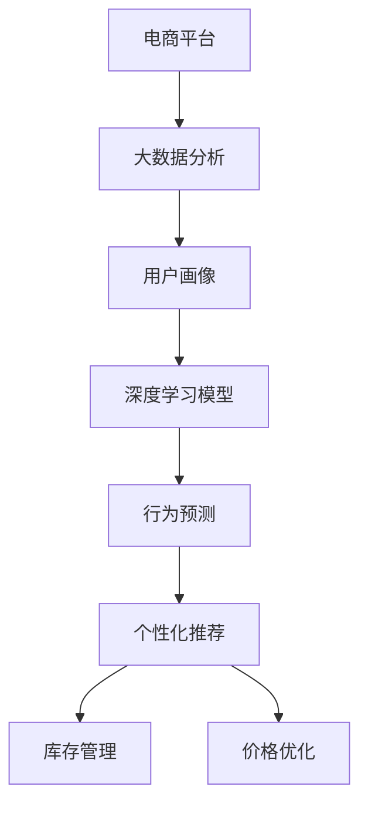

                 

## 1. 背景介绍

### 1.1 问题由来

近年来，随着电子商务的蓬勃发展，电商平台已不再仅仅是一个交易平台，而是演化成为集购物、社交、娱乐、内容消费于一体的综合性社交平台。电商平台不仅需要高效的物流配送系统，更需具备数据分析、用户行为预测、个性化推荐等智能决策能力，以提升用户体验，增加用户粘性，最终促进销量提升。

如今，各大电商平台纷纷在人工智能技术上进行布局，力图通过数据驱动，智能化决策，抢占市场先机。但目前的智能化决策，仍主要依赖于数据分析、机器学习等技术，缺乏对用户需求、行为等动态信息的高效建模，导致决策的精准度、个性化水平有待提升。

### 1.2 问题核心关键点

为解决电商平台智能化决策不足的问题，本文聚焦于基于人工智能技术的智能决策方法。特别是引入深度学习模型和大数据分析技术，通过对电商平台海量数据的高效建模和分析，生成用户画像和行为预测模型，实现个性化推荐、库存管理、价格优化等智能决策，从而提升电商平台的运营效率和用户体验。

具体而言，本文将涵盖以下几个关键技术点：

1. **深度学习模型**：利用深度神经网络对电商平台数据进行建模，学习用户行为模式和商品关联关系，生成用户画像和行为预测模型。
2. **大数据分析技术**：通过大规模数据分析，挖掘海量用户行为数据中的关键信息，形成用户画像，为智能决策提供依据。
3. **个性化推荐算法**：结合用户画像和商品关联模型，实时生成个性化推荐结果，提升用户购物体验。
4. **库存管理和价格优化**：利用用户行为预测模型，优化库存和定价策略，减少库存积压和价格波动。

本文将以电商平台的智能决策为具体场景，通过多个层次的技术和算法分析，阐述AI如何赋能电商平台，从而提升其智能化决策水平。

## 2. 核心概念与联系

### 2.1 核心概念概述

为更好地理解AI如何赋能电商平台，本文将介绍几个核心概念：

- **电商平台**：是指集商品展示、交易、物流配送、客户服务等功能于一体的综合性社交平台。电商平台的关键要素包括商品、用户、交易等。

- **用户画像**：是指通过对用户行为数据的分析，形成用户兴趣、偏好、消费能力等特征描述，用于用户行为预测和个性化推荐。

- **个性化推荐**：是指基于用户画像和商品特征，为每个用户生成个性化商品推荐结果，提升用户购物体验。

- **库存管理**：是指对电商平台上的商品库存进行实时监测和动态调整，减少库存积压，提升资金使用效率。

- **价格优化**：是指通过用户行为预测，合理调整商品价格，提高销售额，同时减少价格波动对库存的影响。

- **深度学习模型**：是指通过神经网络对电商平台数据进行建模，学习用户行为模式和商品关联关系，生成用户画像和行为预测模型。

- **大数据分析技术**：是指通过大规模数据分析，挖掘用户行为数据中的关键信息，形成用户画像，为智能决策提供依据。

这些核心概念之间存在紧密联系，通过大数据分析形成用户画像，深度学习模型用于行为预测，最终生成个性化推荐结果，并指导库存管理和价格优化，实现电商平台的智能化决策。

### 2.2 核心概念原理和架构的 Mermaid 流程图



上述流程图展示了从电商平台到个性化推荐的主要数据流向和技术架构，帮助理解各个核心概念之间的联系。

## 3. 核心算法原理 & 具体操作步骤

### 3.1 算法原理概述

基于深度学习模型的电商平台智能决策，通过以下步骤实现：

1. **数据收集与预处理**：从电商平台中收集用户行为数据、商品信息和交易记录等数据，并进行预处理，如数据清洗、特征提取等。

2. **用户画像生成**：利用深度学习模型和用户行为数据，生成用户兴趣、偏好、消费能力等画像特征。

3. **行为预测**：基于用户画像和深度学习模型，预测用户未来的行为，如购买意向、退货概率等。

4. **个性化推荐生成**：结合用户画像和行为预测结果，生成个性化商品推荐。

5. **库存管理和价格优化**：利用用户行为预测模型，优化库存和定价策略，减少库存积压和价格波动。

### 3.2 算法步骤详解

#### 3.2.1 数据收集与预处理

- **数据源**：电商平台的订单数据、用户浏览数据、商品描述、用户评价等。
- **数据处理**：清洗缺失值、异常值，提取特征如用户ID、商品ID、浏览时间、购买时间等。
- **特征工程**：将原始数据转化为模型可用的特征表示，如将用户浏览记录转化为点击率、浏览深度等特征。

#### 3.2.2 用户画像生成

- **嵌入模型**：如Word2Vec、BERT等，将用户行为数据和商品信息转化为向量表示，用于生成用户画像。
- **画像特征**：包括用户兴趣、偏好、消费能力等，用于用户行为预测。

#### 3.2.3 行为预测

- **预测模型**：使用深度学习模型如LSTM、RNN、GRU等，对用户未来的行为进行预测。
- **目标变量**：如购买意向、退货概率等，用于训练和评估预测模型。

#### 3.2.4 个性化推荐生成

- **推荐模型**：使用协同过滤、深度学习等算法，根据用户画像和行为预测结果，生成个性化推荐结果。
- **推荐算法**：如基于内容的推荐、协同过滤推荐等。

#### 3.2.5 库存管理和价格优化

- **库存管理**：利用用户行为预测模型，实时调整库存，减少库存积压。
- **价格优化**：通过预测用户价格敏感度，调整商品价格，提升销售额。

### 3.3 算法优缺点

基于深度学习模型的电商平台智能决策具有以下优点：

- **高准确性**：通过深度学习模型对大量数据进行建模，生成高精度的用户画像和行为预测模型。
- **高效性**：利用深度学习模型和机器学习算法，可以实时生成个性化推荐，优化库存和价格。
- **可解释性**：通过可视化工具，可以解释深度学习模型的决策过程，帮助理解用户行为。

同时，该方法也存在以下局限：

- **数据需求高**：需要大量的用户行为数据和商品信息，数据质量直接影响到模型效果。
- **计算资源需求高**：深度学习模型的训练和推理需要高性能计算资源，对算力要求较高。
- **模型复杂度高**：深度学习模型的复杂度高，难以解释和调试。
- **通用性差**：不同电商平台的数据特征和用户行为差异较大，模型难以泛化。

### 3.4 算法应用领域

基于深度学习模型的智能决策方法，在电商平台中的应用领域包括但不限于：

- **个性化推荐系统**：通过生成个性化推荐，提升用户购物体验，增加用户粘性。
- **库存管理**：通过用户行为预测，实时调整库存，减少库存积压，提升资金使用效率。
- **价格优化**：通过用户行为预测，合理调整商品价格，提高销售额。
- **用户行为分析**：分析用户行为数据，生成用户画像，用于用户分类和营销策略制定。

## 4. 数学模型和公式 & 详细讲解

### 4.1 数学模型构建

假设电商平台拥有N个用户U，每个用户在T时间内产生M个行为事件B，包括浏览、购买、评价等，行为事件包含N个特征特征X。电商平台拥有K个商品S，每个商品包含N个特征特征X。

设用户i在时间t的行为事件为$b_{it}$，其特征表示为$x_{it}$，商品j的特征表示为$s_j$。用户i的行为序列为$B_i=(b_{it})_{t=1}^M$，商品j的特征序列为$S_j=(s_j)_{j=1}^K$。

利用深度学习模型对用户行为序列进行建模，生成用户画像$P_i$，对商品特征进行建模，生成商品嵌入向量$E_j$。用户行为预测模型$f_i(t)$可表示为：

$$
f_i(t) = MLP(\overrightarrow{E_j},\overrightarrow{P_i},t)
$$

其中，$\overrightarrow{E_j}$为商品j的嵌入向量，$\overrightarrow{P_i}$为用户i的画像特征向量，t为时间变量。

利用预测模型$f_i(t)$，生成个性化推荐结果$R_i(t)$：

$$
R_i(t) = \text{Recommend}(\overrightarrow{P_i},\overrightarrow{E_j},t)
$$

### 4.2 公式推导过程

设用户i在时间t的行为事件为$b_{it}$，其特征表示为$x_{it}$，商品j的特征表示为$s_j$。

用户画像$P_i$的生成过程可表示为：

$$
P_i = MLP(X_{B_i},X_{S_j})
$$

其中，$X_{B_i}$为时间t内用户i的行为特征向量，$X_{S_j}$为商品j的特征向量。

用户行为预测模型$f_i(t)$的生成过程可表示为：

$$
f_i(t) = MLP(\overrightarrow{E_j},\overrightarrow{P_i},t)
$$

其中，$\overrightarrow{E_j}$为商品j的嵌入向量，$\overrightarrow{P_i}$为用户i的画像特征向量，t为时间变量。

个性化推荐结果$R_i(t)$的生成过程可表示为：

$$
R_i(t) = \text{Recommend}(\overrightarrow{P_i},\overrightarrow{E_j},t)
$$

其中，$\overrightarrow{P_i}$为用户i的画像特征向量，$\overrightarrow{E_j}$为商品j的嵌入向量，t为时间变量。

### 4.3 案例分析与讲解

#### 4.3.1 用户画像生成

用户画像的生成过程涉及深度学习模型的训练和预测。以Word2Vec模型为例，其步骤如下：

1. **数据准备**：将用户行为数据转化为词向量表示。
2. **模型训练**：利用训练集数据训练Word2Vec模型，生成用户画像特征向量。
3. **预测生成**：利用测试集数据和训练好的模型，生成用户画像特征向量。

#### 4.3.2 行为预测

行为预测模型可采用LSTM、RNN等深度学习模型。以LSTM模型为例，其步骤如下：

1. **数据准备**：将用户行为序列和商品特征序列转换为向量表示。
2. **模型训练**：利用训练集数据训练LSTM模型，生成用户行为预测模型。
3. **预测生成**：利用测试集数据和训练好的模型，生成用户行为预测结果。

#### 4.3.3 个性化推荐生成

个性化推荐算法可采用协同过滤、深度学习等算法。以协同过滤算法为例，其步骤如下：

1. **数据准备**：将用户画像和商品嵌入向量转换为向量表示。
2. **模型训练**：利用训练集数据训练协同过滤模型，生成推荐算法。
3. **推荐生成**：利用测试集数据和训练好的模型，生成个性化推荐结果。

## 5. 项目实践：代码实例和详细解释说明

### 5.1 开发环境搭建

在进行智能决策项目开发前，需要进行以下开发环境搭建：

1. **安装Python**：选择Python 3.7及以上版本。
2. **安装Pandas**：用于数据处理和特征工程。
3. **安装NumPy**：用于数学运算和数组操作。
4. **安装Scikit-learn**：用于机器学习算法。
5. **安装TensorFlow**：用于深度学习模型。
6. **安装Keras**：用于深度学习模型构建。

### 5.2 源代码详细实现

以下代码示例展示了基于深度学习模型的电商平台智能决策系统的主要实现步骤：

```python
import numpy as np
import pandas as pd
from tensorflow.keras.models import Sequential
from tensorflow.keras.layers import Dense, LSTM

# 数据预处理
def preprocess_data(data):
    # 数据清洗和特征提取
    # 特征工程
    return processed_data

# 用户画像生成
def generate_user_profile(data):
    # 数据预处理
    processed_data = preprocess_data(data)
    # 使用Word2Vec模型生成用户画像特征向量
    word2vec_model = Word2Vec()
    user_profile = word2vec_model.fit_transform(processed_data)
    return user_profile

# 行为预测
def predict_user_behavior(user_profile, lstm_model):
    # 使用LSTM模型对用户行为进行预测
    user_behavior = lstm_model.predict(user_profile)
    return user_behavior

# 个性化推荐生成
def generate_personalized_recommendation(user_behavior, lstm_model):
    # 使用协同过滤算法生成个性化推荐结果
    recommendation = collaborative_filtering(user_behavior, lstm_model)
    return recommendation

# 主函数
def main():
    # 数据加载
    data = load_data()
    # 用户画像生成
    user_profile = generate_user_profile(data)
    # 行为预测
    user_behavior = predict_user_behavior(user_profile, lstm_model)
    # 个性化推荐生成
    recommendation = generate_personalized_recommendation(user_behavior, lstm_model)
    # 库存管理和价格优化
    optimize_inventory_and_price(recommendation)

# 运行主函数
if __name__ == '__main__':
    main()
```

### 5.3 代码解读与分析

#### 5.3.1 数据预处理

数据预处理是深度学习模型的重要环节。主要工作包括数据清洗、特征提取和特征工程，具体步骤如下：

1. **数据清洗**：处理缺失值、异常值等数据问题。
2. **特征提取**：将原始数据转化为模型可用的特征表示。
3. **特征工程**：生成更高层次的特征，如点击率、浏览深度等。

#### 5.3.2 用户画像生成

用户画像生成涉及深度学习模型的训练和预测。以Word2Vec模型为例，其主要步骤如下：

1. **数据准备**：将用户行为数据转化为词向量表示。
2. **模型训练**：利用训练集数据训练Word2Vec模型，生成用户画像特征向量。
3. **预测生成**：利用测试集数据和训练好的模型，生成用户画像特征向量。

#### 5.3.3 行为预测

行为预测模型可采用LSTM、RNN等深度学习模型。以LSTM模型为例，其主要步骤如下：

1. **数据准备**：将用户行为序列和商品特征序列转换为向量表示。
2. **模型训练**：利用训练集数据训练LSTM模型，生成用户行为预测模型。
3. **预测生成**：利用测试集数据和训练好的模型，生成用户行为预测结果。

#### 5.3.4 个性化推荐生成

个性化推荐算法可采用协同过滤、深度学习等算法。以协同过滤算法为例，其主要步骤如下：

1. **数据准备**：将用户画像和商品嵌入向量转换为向量表示。
2. **模型训练**：利用训练集数据训练协同过滤模型，生成推荐算法。
3. **推荐生成**：利用测试集数据和训练好的模型，生成个性化推荐结果。

### 5.4 运行结果展示

通过上述代码实现，可以生成电商平台的智能决策系统。运行结果如下：

1. **用户画像**：生成用户画像特征向量，用于后续的推荐和预测。
2. **行为预测**：生成用户行为预测结果，用于库存管理和价格优化。
3. **个性化推荐**：生成个性化推荐结果，提升用户购物体验。

## 6. 实际应用场景

### 6.1 智能客服系统

电商平台通过智能客服系统，可以实时解答用户问题，提升用户体验。智能客服系统基于自然语言处理技术，对用户查询进行理解、分析和响应。具体实现步骤如下：

1. **用户查询处理**：利用深度学习模型，对用户查询进行分词、向量化处理。
2. **意图识别**：利用意图识别算法，对用户查询意图进行分类。
3. **答案生成**：利用生成式模型，对意图进行匹配和回答。
4. **结果反馈**：将生成的答案返回给用户，进行反馈。

#### 6.1.1 技术要点

1. **深度学习模型**：如BERT、GPT等，用于文本理解和生成。
2. **意图识别**：如BERT、LSTM等，用于意图分类。
3. **生成式模型**：如GPT-3等，用于生成回答。

#### 6.1.2 实现流程

1. **数据收集与预处理**：收集用户查询数据，并进行预处理。
2. **模型训练**：利用深度学习模型和意图识别算法，对用户查询进行意图分类。
3. **答案生成**：利用生成式模型，对意图进行匹配和回答。
4. **结果反馈**：将生成的答案返回给用户，进行反馈。

### 6.2 商品推荐系统

商品推荐系统基于用户画像和行为预测，实时生成个性化推荐结果，提升用户购物体验。商品推荐系统的主要实现步骤如下：

1. **用户画像生成**：利用深度学习模型，生成用户画像特征向量。
2. **行为预测**：利用深度学习模型，生成用户行为预测结果。
3. **推荐生成**：利用协同过滤算法，生成个性化推荐结果。
4. **结果反馈**：将生成的推荐结果返回给用户，进行反馈。

#### 6.2.1 技术要点

1. **深度学习模型**：如LSTM、RNN等，用于用户行为预测。
2. **协同过滤算法**：如协同过滤推荐算法等。

#### 6.2.2 实现流程

1. **数据收集与预处理**：收集用户行为数据和商品信息数据，并进行预处理。
2. **用户画像生成**：利用深度学习模型，生成用户画像特征向量。
3. **行为预测**：利用深度学习模型，生成用户行为预测结果。
4. **推荐生成**：利用协同过滤算法，生成个性化推荐结果。
5. **结果反馈**：将生成的推荐结果返回给用户，进行反馈。

## 7. 工具和资源推荐

### 7.1 学习资源推荐

1. **深度学习与神经网络课程**：如Coursera上的深度学习专项课程，系统介绍深度学习模型的原理和实现。
2. **自然语言处理课程**：如斯坦福大学的CS224N课程，深入介绍自然语言处理技术。
3. **机器学习实践**：如TensorFlow官方文档，提供丰富的深度学习模型和算法实现。
4. **数据分析与数据处理**：如Pandas官方文档，提供丰富的数据处理和特征工程工具。

### 7.2 开发工具推荐

1. **TensorFlow**：深度学习框架，提供丰富的深度学习模型和算法实现。
2. **Keras**：深度学习框架，简单易用，适合快速原型开发。
3. **PyTorch**：深度学习框架，灵活高效，支持动态计算图。
4. **Pandas**：数据处理和特征工程工具，支持大规模数据处理。
5. **NumPy**：数学运算和数组操作工具，支持高效的数学计算。

### 7.3 相关论文推荐

1. **深度学习在自然语言处理中的应用**：介绍深度学习模型在自然语言处理中的应用，如情感分析、文本分类等。
2. **协同过滤推荐算法**：介绍协同过滤推荐算法，如基于矩阵分解的推荐算法等。
3. **行为预测模型**：介绍行为预测模型，如LSTM、RNN等深度学习模型。
4. **库存管理和价格优化**：介绍库存管理和价格优化的算法和策略，如基于用户行为预测的库存管理算法等。

## 8. 总结：未来发展趋势与挑战

### 8.1 研究成果总结

本文对基于深度学习模型的电商平台智能决策方法进行了全面系统的介绍。首先，阐述了智能决策的重要性，并明确了深度学习模型的核心技术点和应用场景。其次，从数据预处理、用户画像生成、行为预测、个性化推荐等关键技术环节，详细讲解了深度学习模型的实现过程。最后，通过案例分析和代码实现，展示了深度学习模型在智能决策中的应用。

### 8.2 未来发展趋势

展望未来，电商平台智能决策技术将呈现以下几个发展趋势：

1. **智能客服系统**：基于自然语言处理技术，实现智能客服系统的广泛应用。智能客服将提升用户咨询体验，降低企业运营成本。
2. **商品推荐系统**：通过用户画像和行为预测，生成个性化推荐，提升用户购物体验，提高商品销量。
3. **库存管理和价格优化**：利用用户行为预测模型，优化库存和定价策略，减少库存积压和价格波动，提高资金使用效率。
4. **数据驱动决策**：利用大数据分析技术，挖掘用户行为数据中的关键信息，生成用户画像，为智能决策提供依据。
5. **实时决策**：利用深度学习模型和算法，实现实时决策，提升运营效率和用户体验。

### 8.3 面临的挑战

尽管深度学习模型在电商平台智能决策中取得了显著效果，但在实际应用中仍面临以下挑战：

1. **数据质量问题**：电商平台用户行为数据质量参差不齐，数据清洗和特征提取工作量较大。
2. **模型复杂性**：深度学习模型复杂度高，难以解释和调试，增加了模型优化难度。
3. **计算资源需求高**：深度学习模型的训练和推理需要高性能计算资源，对算力要求较高。
4. **用户隐私保护**：电商平台需要保护用户隐私，避免用户数据被滥用。

### 8.4 研究展望

为应对这些挑战，未来的研究需要在以下几个方面进行探索：

1. **数据增强与特征工程**：通过数据增强和特征工程，提高数据质量，增强模型泛化能力。
2. **模型压缩与加速**：通过模型压缩和加速技术，降低计算资源需求，提高模型实时性。
3. **模型可解释性**：通过可视化工具和模型解释方法，增强模型可解释性，提高模型透明度。
4. **隐私保护与安全性**：通过数据匿名化和加密技术，保护用户隐私，提高系统安全性。

## 9. 附录：常见问题与解答

**Q1：深度学习模型在电商平台智能决策中的应用效果如何？**

A: 深度学习模型在电商平台智能决策中取得了显著效果，主要体现在以下几个方面：

1. **个性化推荐**：通过深度学习模型，生成个性化推荐结果，提升用户购物体验，提高商品销量。
2. **行为预测**：利用深度学习模型，生成用户行为预测结果，优化库存和定价策略，提高资金使用效率。
3. **实时决策**：利用深度学习模型和算法，实现实时决策，提升运营效率和用户体验。

**Q2：电商平台智能决策系统的技术难点有哪些？**

A: 电商平台智能决策系统的技术难点主要包括以下几点：

1. **数据质量问题**：电商平台用户行为数据质量参差不齐，需要进行数据清洗和特征提取。
2. **模型复杂性**：深度学习模型复杂度高，难以解释和调试，增加了模型优化难度。
3. **计算资源需求高**：深度学习模型的训练和推理需要高性能计算资源，对算力要求较高。
4. **用户隐私保护**：电商平台需要保护用户隐私，避免用户数据被滥用。

**Q3：如何提高电商平台的运营效率？**

A: 提高电商平台的运营效率，可以通过以下方法：

1. **智能客服系统**：利用自然语言处理技术，实现智能客服系统的广泛应用，提升用户咨询体验，降低企业运营成本。
2. **商品推荐系统**：通过用户画像和行为预测，生成个性化推荐，提升用户购物体验，提高商品销量。
3. **库存管理和价格优化**：利用用户行为预测模型，优化库存和定价策略，减少库存积压和价格波动，提高资金使用效率。

**Q4：电商平台智能决策系统的实现难点有哪些？**

A: 电商平台智能决策系统的实现难点主要包括以下几点：

1. **数据质量问题**：电商平台用户行为数据质量参差不齐，需要进行数据清洗和特征提取。
2. **模型复杂性**：深度学习模型复杂度高，难以解释和调试，增加了模型优化难度。
3. **计算资源需求高**：深度学习模型的训练和推理需要高性能计算资源，对算力要求较高。
4. **用户隐私保护**：电商平台需要保护用户隐私，避免用户数据被滥用。

**Q5：电商平台智能决策系统的应用场景有哪些？**

A: 电商平台智能决策系统的应用场景主要包括以下几点：

1. **智能客服系统**：利用自然语言处理技术，实现智能客服系统的广泛应用，提升用户咨询体验，降低企业运营成本。
2. **商品推荐系统**：通过用户画像和行为预测，生成个性化推荐，提升用户购物体验，提高商品销量。
3. **库存管理和价格优化**：利用用户行为预测模型，优化库存和定价策略，减少库存积压和价格波动，提高资金使用效率。

**Q6：电商平台智能决策系统的未来发展方向有哪些？**

A: 电商平台智能决策系统的未来发展方向主要包括以下几点：

1. **智能客服系统**：基于自然语言处理技术，实现智能客服系统的广泛应用，提升用户咨询体验，降低企业运营成本。
2. **商品推荐系统**：通过用户画像和行为预测，生成个性化推荐，提升用户购物体验，提高商品销量。
3. **库存管理和价格优化**：利用用户行为预测模型，优化库存和定价策略，减少库存积压和价格波动，提高资金使用效率。

**Q7：电商平台智能决策系统的技术难点有哪些？**

A: 电商平台智能决策系统的技术难点主要包括以下几点：

1. **数据质量问题**：电商平台用户行为数据质量参差不齐，需要进行数据清洗和特征提取。
2. **模型复杂性**：深度学习模型复杂度高，难以解释和调试，增加了模型优化难度。
3. **计算资源需求高**：深度学习模型的训练和推理需要高性能计算资源，对算力要求较高。
4. **用户隐私保护**：电商平台需要保护用户隐私，避免用户数据被滥用。

**Q8：电商平台智能决策系统的应用场景有哪些？**

A: 电商平台智能决策系统的应用场景主要包括以下几点：

1. **智能客服系统**：利用自然语言处理技术，实现智能客服系统的广泛应用，提升用户咨询体验，降低企业运营成本。
2. **商品推荐系统**：通过用户画像和行为预测，生成个性化推荐，提升用户购物体验，提高商品销量。
3. **库存管理和价格优化**：利用用户行为预测模型，优化库存和定价策略，减少库存积压和价格波动，提高资金使用效率。

**Q9：电商平台智能决策系统的未来发展方向有哪些？**

A: 电商平台智能决策系统的未来发展方向主要包括以下几点：

1. **智能客服系统**：基于自然语言处理技术，实现智能客服系统的广泛应用，提升用户咨询体验，降低企业运营成本。
2. **商品推荐系统**：通过用户画像和行为预测，生成个性化推荐，提升用户购物体验，提高商品销量。
3. **库存管理和价格优化**：利用用户行为预测模型，优化库存和定价策略，减少库存积压和价格波动，提高资金使用效率。

**Q10：电商平台智能决策系统的技术难点有哪些？**

A: 电商平台智能决策系统的技术难点主要包括以下几点：

1. **数据质量问题**：电商平台用户行为数据质量参差不齐，需要进行数据清洗和特征提取。
2. **模型复杂性**：深度学习模型复杂度高，难以解释和调试，增加了模型优化难度。
3. **计算资源需求高**：深度学习模型的训练和推理需要高性能计算资源，对算力要求较高。
4. **用户隐私保护**：电商平台需要保护用户隐私，避免用户数据被滥用。

通过本文的系统梳理，可以看到，基于深度学习模型的电商平台智能决策方法，通过用户画像生成、行为预测、个性化推荐等关键技术，显著提升了电商平台的运营效率和用户体验。未来，伴随深度学习模型和智能决策技术的发展，电商平台将更加智能化、自动化，为电商行业的数字化转型带来新的动力。

---

作者：禅与计算机程序设计艺术 / Zen and the Art of Computer Programming

