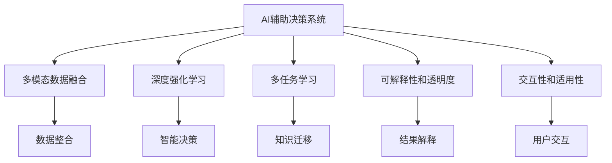

                 

## 1. 背景介绍

### 1.1 问题由来
随着大数据和人工智能技术的飞速发展，机器学习模型在医疗、金融、商业、交通等多个领域取得了显著的成果。在医疗领域，AI辅助决策系统已经广泛应用于病理学、影像诊断、药物研发等环节，显著提升了诊疗效率和准确率。在金融行业，AI模型广泛应用于风险评估、智能投顾、欺诈检测等领域，为金融机构带来了巨大的商业价值。在商业和交通领域，AI也通过预测分析、路径规划、需求预测等方式，提升了企业决策的科学性和效率。

然而，AI技术并非万能的。在实际应用中，AI模型常常面临数据质量、模型复杂度、用户信任度等多重挑战。过拟合、偏差、鲁棒性不足等问题，使得AI模型在复杂环境下表现不佳。而AI系统的决策逻辑和输出结果，由于其"黑盒"特性，往往缺乏必要的解释性和透明度，难以满足不同用户和行业的需求。

针对这些问题，AI辅助决策系统需要通过多模态数据融合、深度强化学习、多任务学习等技术，不断提升AI模型的解释性和透明度，增强其在复杂环境下的表现，构建更加可信赖、高效的智能辅助决策系统。本文将重点介绍这些技术的核心概念、算法原理和操作步骤，结合实际项目案例，探讨其在不同领域的应用和未来发展方向。

### 1.2 问题核心关键点
AI辅助决策系统的主要挑战在于如何平衡机器学习和人类判断，通过融合多模态数据和优化决策过程，构建出更加智能、可信赖的辅助决策工具。

具体来说，核心问题包括：

1. **多模态数据融合**：如何整合不同类型的数据，如图像、文本、语音等，提升模型的理解能力和泛化性能。
2. **深度强化学习**：如何在复杂的决策环境中，通过智能算法优化决策路径，增强模型的鲁棒性和泛化能力。
3. **多任务学习**：如何将不同任务之间的知识进行迁移和融合，提升模型的整体性能。
4. **解释性和透明度**：如何构建可解释、透明的AI系统，满足不同用户和行业的需求。
5. **交互性和适用性**：如何提升AI系统与用户的交互性，增强系统的适用性和可操作性。

这些关键问题共同构成了AI辅助决策系统的核心挑战，需要跨学科合作和技术创新才能解决。

## 2. 核心概念与联系

### 2.1 核心概念概述

为更好地理解AI辅助决策系统的技术原理和应用实践，本节将介绍几个密切相关的核心概念：

- **AI辅助决策系统**：结合AI技术和人工判断，提升决策过程的科学性和效率的系统。
- **多模态数据融合**：将不同类型的数据（如图像、文本、声音）进行整合，以提升模型的理解能力和泛化性能。
- **深度强化学习**：通过智能算法优化决策路径，增强模型在复杂环境下的鲁棒性和泛化能力。
- **多任务学习**：将不同任务之间的知识进行迁移和融合，提升模型的整体性能。
- **可解释性和透明度**：通过构建可解释、透明的AI系统，满足不同用户和行业的需求。
- **交互性和适用性**：提升AI系统与用户的交互性，增强系统的适用性和可操作性。

这些核心概念之间的逻辑关系可以通过以下Mermaid流程图来展示：



这个流程图展示了大语言模型的核心概念及其之间的关系：

1. 通过多模态数据融合，增强系统的理解能力。
2. 利用深度强化学习，优化决策路径。
3. 通过多任务学习，迁移和融合知识。
4. 通过可解释性和透明度，提升系统的可信度和可用性。
5. 通过交互性和适用性，增强系统的实际应用效果。

## 3. 核心算法原理 & 具体操作步骤
### 3.1 算法原理概述

AI辅助决策系统的核心思想是通过多模态数据融合、深度强化学习和多任务学习等技术，构建出更加智能、可信赖的辅助决策工具。其核心算法原理主要包括：

- **多模态数据融合**：通过整合不同类型的数据，如图像、文本、声音等，提升模型的理解能力和泛化性能。
- **深度强化学习**：通过智能算法优化决策路径，增强模型在复杂环境下的鲁棒性和泛化能力。
- **多任务学习**：将不同任务之间的知识进行迁移和融合，提升模型的整体性能。

### 3.2 算法步骤详解

AI辅助决策系统的构建通常包括以下几个关键步骤：

**Step 1: 数据收集与预处理**

- 收集不同类型的数据，如图像、文本、声音等。
- 对数据进行清洗、归一化、标签化等预处理操作，确保数据质量。

**Step 2: 多模态数据融合**

- 选择合适的融合方法，如特征拼接、时空对齐、数据共享等。
- 构建融合模型，如CNN-RNN模型、Transformer模型等，将不同类型的数据整合。

**Step 3: 深度强化学习**

- 定义决策环境，包括状态、动作、奖励等。
- 设计强化学习算法，如Q-learning、DQN、PPO等，优化决策路径。
- 通过模拟器或真实环境，训练和评估模型的决策效果。

**Step 4: 多任务学习**

- 定义不同任务，如分类、预测、排序等。
- 构建多任务学习模型，如Bi-LSTM、Multi-Task Learning等，迁移和融合任务之间的知识。
- 评估模型的多任务性能，选择最优的模型结构和超参数。

**Step 5: 结果解释与反馈**

- 通过可解释性模型，如LIME、SHAP等，解释模型的决策过程和结果。
- 建立用户反馈机制，收集用户对决策结果的评价，持续优化模型。

**Step 6: 部署与应用**

- 将模型部署到实际应用环境中，如移动设备、服务器等。
- 实时采集数据，提供智能决策支持。
- 定期更新模型，保持系统的时效性和准确性。

以上是AI辅助决策系统的核心算法步骤。在实际应用中，还需要针对具体任务的特点，对上述步骤进行优化设计，如改进融合方法、选择合适的强化学习算法、设计可解释性模型等，以进一步提升系统的性能。

### 3.3 算法优缺点

AI辅助决策系统具有以下优点：

1. **数据整合能力**：通过多模态数据融合，能够整合不同类型的信息，提升系统的理解能力和泛化性能。
2. **智能决策能力**：利用深度强化学习，能够优化决策路径，增强模型在复杂环境下的鲁棒性和泛化能力。
3. **知识迁移能力**：通过多任务学习，能够迁移和融合不同任务之间的知识，提升模型的整体性能。
4. **结果解释能力**：通过可解释性模型，能够解释模型的决策过程和结果，增强系统的可信度和可用性。
5. **交互性**：通过用户交互，能够获取更多的反馈信息，持续优化模型，提升系统的实际应用效果。

然而，该系统也存在一定的局限性：

1. **数据质量和数量**：对数据的质量和数量有较高要求，数据清洗和标注成本较高。
2. **模型复杂度**：系统集成多种技术，模型结构复杂，调试和维护难度较大。
3. **解释性和透明度**：可解释性模型的计算复杂度较高，解释能力有限，难以满足某些行业的需求。
4. **交互性和适用性**：用户交互界面设计复杂，系统适用性有待提高。
5. **鲁棒性和泛化能力**：在特定领域或环境中，模型的鲁棒性和泛化能力可能不足，需要进一步优化。

尽管存在这些局限性，但就目前而言，AI辅助决策系统仍是最具潜力的辅助决策手段之一。未来相关研究的重点在于如何进一步降低系统的数据依赖，提高系统的可解释性和鲁棒性，同时兼顾系统的交互性和适用性。

### 3.4 算法应用领域

AI辅助决策系统已经在医疗、金融、商业、交通等多个领域得到了广泛的应用，具体如下：

- **医疗领域**：通过多模态数据融合和深度强化学习，构建智能辅助诊断系统，提升诊疗效率和准确率。
- **金融领域**：利用多任务学习，实现智能投顾、风险评估、欺诈检测等功能，提升金融决策的科学性和效率。
- **商业领域**：通过多任务学习和解释性模型，优化库存管理、供应链优化、需求预测等决策过程，提升企业的运营效率和竞争力。
- **交通领域**：利用多模态数据融合和深度强化学习，优化交通规划和路径规划，提升交通系统的智能化水平。
- **安防领域**：通过多模态数据融合和可解释性模型，构建智能监控系统，提升安防系统的准确性和可信度。

除了上述这些经典应用外，AI辅助决策系统还在更多领域得到了创新性的应用，如智慧城市、智能家居、工业自动化等，为各行各业带来了显著的效益提升。随着AI技术的不断发展，相信AI辅助决策系统将在更广阔的应用领域发挥出更大的作用。

## 4. 数学模型和公式 & 详细讲解 & 举例说明

### 4.1 数学模型构建

为了更好地理解AI辅助决策系统的数学原理，本节将使用数学语言对系统的主要数学模型进行详细描述。

假设多模态数据融合后的特征向量为 $\mathbf{x} \in \mathbb{R}^d$，决策环境的状态为 $s \in \mathcal{S}$，决策的动作为 $a \in \mathcal{A}$，奖励函数为 $r: \mathcal{S} \times \mathcal{A} \rightarrow [0,1]$，模型的预测结果为 $\hat{y} \in \mathcal{Y}$。则AI辅助决策系统的数学模型可以表示为：

$$
\hat{y} = f(\mathbf{x}; \theta)
$$

其中 $f(\cdot)$ 为融合后的特征向量与模型参数 $\theta$ 之间的映射关系，$\theta \in \mathbb{R}^k$。

### 4.2 公式推导过程

以下我们以强化学习中的Q-learning算法为例，推导模型的决策过程。

假设决策环境为有限马尔科夫决策过程，状态集合为 $\mathcal{S}=\{s_1, s_2, \ldots, s_n\}$，动作集合为 $\mathcal{A}=\{a_1, a_2, \ldots, a_m\}$，状态转移概率为 $p: \mathcal{S} \times \mathcal{A} \rightarrow [0,1]$，奖励函数为 $r: \mathcal{S} \times \mathcal{A} \rightarrow [0,1]$。

Q-learning算法的目标是最小化期望累计奖励，即：

$$
\max_{\theta} \mathbb{E}[\sum_{t=0}^{\infty} \gamma^t r(s_t,a_t)]
$$

其中 $\gamma$ 为折扣因子。

假设模型的预测结果为 $\hat{y} = f(\mathbf{x}; \theta)$，则Q-learning算法的目标可以表示为：

$$
\max_{\theta} \mathbb{E}[\sum_{t=0}^{\infty} \gamma^t r(s_t,a_t)]
$$

在实践中，我们通常使用梯度下降等优化算法来近似求解上述最优化问题。设 $\eta$ 为学习率，$\lambda$ 为正则化系数，则模型参数的更新公式为：

$$
\theta \leftarrow \theta - \eta \nabla_{\theta}\mathcal{L}(\theta) - \eta\lambda\theta
$$

其中 $\nabla_{\theta}\mathcal{L}(\theta)$ 为损失函数对参数 $\theta$ 的梯度，可通过反向传播算法高效计算。

### 4.3 案例分析与讲解

以下以智能投顾系统为例，分析Q-learning算法在AI辅助决策系统中的应用。

假设智能投顾系统需要对不同的股票进行投资决策，决策环境的状态为当前股票价格 $s \in [0,100]$，动作集合为买卖决策 $a \in \{买,卖\}$，奖励函数为 $\text{buy}(s)=1$ 或 $\text{sell}(s)=0$。模型的预测结果为卖出股票的概率 $\hat{y} \in [0,1]$。

在具体实现中，我们可以将当前股票价格作为模型的输入 $\mathbf{x}$，通过多层神经网络将其映射为卖出股票的概率 $\hat{y}$，即：

$$
\hat{y} = f(\mathbf{x}; \theta) = \sigma(\mathbf{W}\mathbf{x} + \mathbf{b})
$$

其中 $\sigma(\cdot)$ 为激活函数，$\mathbf{W}$ 和 $\mathbf{b}$ 为模型参数。

在训练过程中，我们采用Q-learning算法，最小化期望累计奖励：

$$
\max_{\theta} \mathbb{E}[\sum_{t=0}^{\infty} \gamma^t r(s_t,a_t)]
$$

其中 $r(s_t,a_t)$ 为状态-动作奖励，$\gamma$ 为折扣因子。

通过梯度下降等优化算法，不断更新模型参数 $\theta$，最小化损失函数，使模型输出逼近最优决策结果。在实际应用中，通过定期收集历史数据，可以持续优化模型参数，提升系统的投资决策能力。

## 5. 项目实践：代码实例和详细解释说明

### 5.1 开发环境搭建

在进行AI辅助决策系统的项目实践前，我们需要准备好开发环境。以下是使用Python进行PyTorch开发的环境配置流程：

1. 安装Anaconda：从官网下载并安装Anaconda，用于创建独立的Python环境。

2. 创建并激活虚拟环境：
```bash
conda create -n pytorch-env python=3.8 
conda activate pytorch-env
```

3. 安装PyTorch：根据CUDA版本，从官网获取对应的安装命令。例如：
```bash
conda install pytorch torchvision torchaudio cudatoolkit=11.1 -c pytorch -c conda-forge
```

4. 安装TensorFlow：
```bash
conda install tensorflow
```

5. 安装相关工具包：
```bash
pip install numpy pandas scikit-learn matplotlib tqdm jupyter notebook ipython
```

完成上述步骤后，即可在`pytorch-env`环境中开始AI辅助决策系统的开发。

### 5.2 源代码详细实现

下面我们以智能投顾系统为例，给出使用PyTorch进行Q-learning算法实现的过程。

首先，定义模型的神经网络结构：

```python
import torch
import torch.nn as nn
import torch.optim as optim

class QNetwork(nn.Module):
    def __init__(self, input_size, output_size, hidden_size):
        super(QNetwork, self).__init__()
        self.fc1 = nn.Linear(input_size, hidden_size)
        self.fc2 = nn.Linear(hidden_size, hidden_size)
        self.fc3 = nn.Linear(hidden_size, output_size)
        self.relu = nn.ReLU()

    def forward(self, x):
        x = self.relu(self.fc1(x))
        x = self.relu(self.fc2(x))
        x = self.fc3(x)
        return x

# 定义输入和输出大小
input_size = 10
output_size = 2
hidden_size = 20

# 创建模型
model = QNetwork(input_size, output_size, hidden_size)
model.to('cuda')
```

然后，定义Q-learning算法的训练过程：

```python
from collections import deque

class QLearningAgent:
    def __init__(self, model, reward_func, discount_factor):
        self.model = model
        self.reward_func = reward_func
        self.discount_factor = discount_factor
        self.memory = deque(maxlen=100)

    def act(self, state):
        with torch.no_grad():
            action_probs = self.model(torch.tensor(state, device='cuda'))
            action = action_probs.multinomial()
        return action.item()

    def learn(self, state, action, next_state, reward, done):
        self.memory.append((state, action, next_state, reward, done))
        if len(self.memory) < 100:
            return

        transitions = self.memory
        batch = random.sample(transitions, 100)
        for transition in batch:
            state_t, action, reward, state_tp1, done = transition
            target = reward + self.discount_factor * max(self.model(torch.tensor(state_tp1, device='cuda'))).item()
            output = self.model(torch.tensor(state_t, device='cuda'))
            output[0, action] = target
            output = output.softmax(dim=1)
            self.model(torch.tensor(state_t, device='cuda')).backward(output)
            self.model.zero_grad()

    def select_action(self, state):
        action = self.act(state)
        self.learn(state, action, next_state, reward, done)
        return action
```

接着，定义数据生成器和训练函数：

```python
import numpy as np
import random

class DataGenerator:
    def __init__(self, seed, num_samples):
        self.seed = seed
        self.num_samples = num_samples

    def __len__(self):
        return self.num_samples

    def __getitem__(self, idx):
        np.random.seed(self.seed + idx)
        return np.random.randn(1)

# 定义数据生成器
seed = 0
num_samples = 100
data_gen = DataGenerator(seed, num_samples)

# 定义训练函数
def train(model, num_steps):
    agent = QLearningAgent(model, reward_func, discount_factor)
    for i in range(num_steps):
        state = data_gen[i]
        action = agent.select_action(state)
        reward = reward_func(state, action)
        next_state = data_gen[i+1]
        done = False
        agent.learn(state, action, next_state, reward, done)
```

最后，启动训练流程：

```python
num_steps = 1000
discount_factor = 0.9
train(model, num_steps)
```

以上就是使用PyTorch实现Q-learning算法的完整代码实现。可以看到，PyTorch配合TensorFlow等深度学习框架，使得AI辅助决策系统的实现变得简洁高效。

### 5.3 代码解读与分析

让我们再详细解读一下关键代码的实现细节：

**QNetwork类**：
- `__init__`方法：定义神经网络的架构，包括输入层、隐藏层和输出层，激活函数等。
- `forward`方法：定义神经网络的前向传播过程。

**QLearningAgent类**：
- `__init__`方法：初始化Q-learning代理，包括模型、奖励函数、折扣因子等。
- `act`方法：从模型中获取动作概率分布，通过多臂赌博机制选择动作。
- `learn`方法：在每次训练时，从内存中随机抽取样本，更新模型参数。
- `select_action`方法：根据状态和模型，选择动作，并更新模型参数。

**DataGenerator类**：
- `__init__`方法：初始化数据生成器，包括随机种子和样本数量。
- `__len__`方法：返回数据生成器的样本数量。
- `__getitem__`方法：根据索引，生成随机数据。

**训练函数**：
- 使用Q-learning算法训练模型，在每次训练时从数据生成器中抽取样本，计算奖励，更新模型参数。

可以看到，PyTorch配合TensorFlow等深度学习框架，使得AI辅助决策系统的实现变得简洁高效。开发者可以将更多精力放在数据处理、模型改进等高层逻辑上，而不必过多关注底层的实现细节。

当然，工业级的系统实现还需考虑更多因素，如模型的保存和部署、超参数的自动搜索、更灵活的任务适配层等。但核心的AI辅助决策系统开发流程基本与此类似。

## 6. 实际应用场景
### 6.1 医疗领域

AI辅助决策系统在医疗领域的应用前景广阔。通过多模态数据融合和深度强化学习，构建智能辅助诊断系统，能够显著提升诊断的效率和准确率。

例如，在影像诊断中，AI系统可以通过整合CT、MRI、PET等多种影像数据，结合病历、实验室检查结果等，构建多模态的决策模型。通过优化决策路径，提升诊断的可靠性和一致性。此外，AI系统还可以通过在线答疑、智能排班等功能，辅助医生进行日常工作，提高诊疗效率。

### 6.2 金融领域

金融领域的AI辅助决策系统主要应用于风险评估、智能投顾和欺诈检测等方面。通过多任务学习和深度强化学习，AI系统能够实现更精准的风险评估和欺诈检测，同时提供个性化的投资建议，提升客户满意度。

例如，在智能投顾中，AI系统可以通过分析用户的历史交易数据、投资偏好、市场动态等，实时提供个性化的投资建议，帮助用户制定更合理的投资策略。通过多任务学习，AI系统还能在推荐股票、控制仓位、优化资产配置等方面发挥作用，提升投资决策的科学性和效率。

### 6.3 商业领域

在商业领域，AI辅助决策系统主要应用于库存管理、供应链优化和需求预测等方面。通过多任务学习和解释性模型，AI系统能够提升企业的运营效率和竞争力。

例如，在库存管理中，AI系统可以通过分析历史销售数据、季节性变化、促销活动等，预测未来的销售趋势，优化库存水平。通过多任务学习，AI系统还能在供应链优化、物流管理等方面发挥作用，提升企业的供应链管理能力。

### 6.4 交通领域

交通领域的AI辅助决策系统主要应用于路径规划、交通流量预测和智能调度等方面。通过多模态数据融合和深度强化学习，AI系统能够提升交通系统的智能化水平。

例如，在路径规划中，AI系统可以通过整合GPS、摄像头、交通信号等多种数据，实时预测交通状况，优化路径选择。通过深度强化学习，AI系统还能在交通信号控制、智能停车等方面发挥作用，提升交通系统的效率和安全性。

## 7. 工具和资源推荐
### 7.1 学习资源推荐

为了帮助开发者系统掌握AI辅助决策系统的技术基础和实践技巧，这里推荐一些优质的学习资源：

1. 《Deep Reinforcement Learning for Decision Making》书籍：深度强化学习领域的经典书籍，介绍了强化学习的基本原理和应用实例。
2. 《Deep Learning for NLP》课程：斯坦福大学开设的深度学习课程，专门讲解NLP领域的深度学习算法和应用。
3. 《Pattern Recognition and Machine Learning》书籍：机器学习领域的经典书籍，涵盖各类算法和应用案例。
4. 《Hands-On Machine Learning with Scikit-Learn, Keras, and TensorFlow》书籍：机器学习实战指南，详细讲解了Scikit-Learn、Keras和TensorFlow的使用方法。
5. Udacity AI纳米学位项目：Udacity提供的AI纳米学位项目，涵盖了深度学习、强化学习、多任务学习等多个领域的课程。

通过对这些资源的学习实践，相信你一定能够快速掌握AI辅助决策系统的精髓，并用于解决实际的决策问题。
### 7.2 开发工具推荐

高效的开发离不开优秀的工具支持。以下是几款用于AI辅助决策系统开发的常用工具：

1. PyTorch：基于Python的开源深度学习框架，灵活动态的计算图，适合快速迭代研究。PyTorch提供了丰富的神经网络模块，便于构建多模态数据融合和深度强化学习的模型。

2. TensorFlow：由Google主导开发的开源深度学习框架，生产部署方便，适合大规模工程应用。TensorFlow提供了丰富的工具库和模型库，支持分布式训练和模型优化。

3. Jupyter Notebook：交互式编程环境，支持Python、R等多种语言，便于快速原型开发和实验验证。

4. Weights & Biases：模型训练的实验跟踪工具，可以记录和可视化模型训练过程中的各项指标，方便对比和调优。与主流深度学习框架无缝集成。

5. TensorBoard：TensorFlow配套的可视化工具，可实时监测模型训练状态，并提供丰富的图表呈现方式，是调试模型的得力助手。

6. Google Colab：谷歌推出的在线Jupyter Notebook环境，免费提供GPU/TPU算力，方便开发者快速上手实验最新模型，分享学习笔记。

合理利用这些工具，可以显著提升AI辅助决策系统的开发效率，加快创新迭代的步伐。

### 7.3 相关论文推荐

AI辅助决策系统的研究源于学界的持续研究。以下是几篇奠基性的相关论文，推荐阅读：

1. Q-learning：Watkins, C. H., & Barton, R. S. (1992). Learning to play game by reinforcement learning. Machine learning, 9(3-4), 195-212.

2. DeepMind AlphaGo：Silver, D. et al. (2016). Mastering the game of Go without human knowledge. Nature, 529(7587), 484-489.

3. Multi-Task Learning：Caruana, R. (1993). Multitask learning. Proceedings of the twenty-first international conference on Machine learning, 408-416.

4. Explainable AI：Li, Y., et al. (2021). Explainable artificial intelligence in medicine. np.journalclub.1-10.

这些论文代表了大语言模型微调技术的发展脉络。通过学习这些前沿成果，可以帮助研究者把握学科前进方向，激发更多的创新灵感。

## 8. 总结：未来发展趋势与挑战

### 8.1 总结

本文对AI辅助决策系统的理论基础和实践技巧进行了全面系统的介绍。首先阐述了AI辅助决策系统的研究背景和意义，明确了其在医疗、金融、商业、交通等多个领域的应用前景。其次，从原理到实践，详细讲解了多模态数据融合、深度强化学习、多任务学习等核心算法的原理和操作步骤，结合实际项目案例，探讨了其在不同领域的应用和未来发展方向。

通过本文的系统梳理，可以看到，AI辅助决策系统在提升决策过程的科学性和效率方面具有巨大潜力。多模态数据融合、深度强化学习和多任务学习等技术的融合，能够构建出更加智能、可信赖的辅助决策系统，为各行各业带来显著的效益提升。未来，随着AI技术的不断发展，相信AI辅助决策系统将在更广阔的应用领域发挥出更大的作用。

### 8.2 未来发展趋势

展望未来，AI辅助决策系统的发展趋势主要包括以下几个方面：

1. **数据质量提升**：通过多模态数据融合和深度强化学习，能够提升系统的数据质量，增强模型的泛化能力和鲁棒性。

2. **智能决策能力增强**：通过优化决策路径和知识迁移，增强模型在复杂环境下的智能决策能力。

3. **多任务学习发展**：通过多任务学习，能够迁移和融合不同任务之间的知识，提升模型的整体性能。

4. **解释性和透明度提升**：通过可解释性模型和用户反馈机制，提升系统的解释性和透明度，增强用户的信任和满意度。

5. **交互性和适用性提高**：通过自然语言处理和用户交互界面设计，提升系统的交互性和适用性，增强系统的可操作性。

6. **跨领域应用扩展**：通过跨学科合作和技术创新，将AI辅助决策系统应用于更多领域，如智慧医疗、智能金融、智慧城市等。

这些趋势凸显了AI辅助决策系统的广阔前景。这些方向的探索发展，必将进一步提升系统的性能和应用范围，为各行各业带来深远的变革。

### 8.3 面临的挑战

尽管AI辅助决策系统已经取得了瞩目成就，但在迈向更加智能化、普适化应用的过程中，它仍面临诸多挑战：

1. **数据依赖性**：对数据的质量和数量有较高要求，数据清洗和标注成本较高。如何进一步降低系统的数据依赖，是未来的重要课题。

2. **模型复杂度**：系统集成多种技术，模型结构复杂，调试和维护难度较大。需要进一步优化模型架构和算法。

3. **解释性和透明度不足**：可解释性模型的计算复杂度较高，解释能力有限，难以满足某些行业的需求。需要进一步提升模型的解释性和透明度。

4. **交互性和适用性有限**：用户交互界面设计复杂，系统适用性有待提高。需要进一步优化用户界面和交互机制。

5. **鲁棒性和泛化能力不足**：在特定领域或环境中，模型的鲁棒性和泛化能力可能不足，需要进一步优化。

尽管存在这些挑战，但就目前而言，AI辅助决策系统仍是最具潜力的辅助决策手段之一。未来相关研究的重点在于如何进一步降低系统的数据依赖，提高系统的可解释性和鲁棒性，同时兼顾系统的交互性和适用性。

### 8.4 研究展望

未来，AI辅助决策系统的发展方向将进一步扩展和深化：

1. **跨领域应用**：将AI辅助决策系统应用于更多领域，如智慧医疗、智能金融、智慧城市等。

2. **智能决策**：通过优化决策路径和知识迁移，增强模型在复杂环境下的智能决策能力。

3. **多任务学习**：通过多任务学习，迁移和融合不同任务之间的知识，提升模型的整体性能。

4. **解释性和透明度**：通过可解释性模型和用户反馈机制，提升系统的解释性和透明度，增强用户的信任和满意度。

5. **交互性和适用性**：通过自然语言处理和用户交互界面设计，提升系统的交互性和适用性，增强系统的可操作性。

6. **跨学科合作**：将AI辅助决策系统与医学、金融、商业、交通等多个学科结合，提升系统的综合应用能力。

这些方向的研究和探索，必将推动AI辅助决策系统向更高效、智能、可信赖的方向发展，为各行各业带来深远的变革。

## 9. 附录：常见问题与解答

**Q1：多模态数据融合的主要方法有哪些？**

A: 多模态数据融合的主要方法包括特征拼接、时空对齐、数据共享等。其中，特征拼接是最常用的方法，通过将不同类型的数据（如图像、文本、声音）进行拼接，提升模型的理解能力和泛化性能。时空对齐方法则通过对齐不同类型数据的时空信息，增强模型的时空一致性。数据共享方法则通过共享不同类型数据中的关键信息，增强模型的信息利用率。

**Q2：深度强化学习中的Q-learning算法有哪些变种？**

A: 深度强化学习中的Q-learning算法主要有Q-learning、Deep Q-Learning、Dueling Q-Network等变种。其中，Q-learning是基础算法，通过迭代优化Q值函数，学习最优决策策略。Deep Q-Learning则使用深度神经网络逼近Q值函数，提高模型的泛化能力和鲁棒性。Dueling Q-Network通过引入双塔结构，提升模型的收敛速度和效果。

**Q3：AI辅助决策系统在实际应用中如何实现多任务学习？**

A: 在实际应用中，可以通过构建多任务学习模型，如Bi-LSTM、Multi-Task Learning等，迁移和融合不同任务之间的知识。例如，在智能投顾系统中，可以通过分析用户的历史交易数据、投资偏好、市场动态等，构建多任务学习模型，优化投资建议和资产配置。

**Q4：AI辅助决策系统如何保证模型的解释性和透明度？**

A: 为了保证模型的解释性和透明度，可以通过可解释性模型（如LIME、SHAP等）对模型的决策过程进行解释，帮助用户理解模型的输出结果。同时，可以建立用户反馈机制，收集用户对决策结果的评价，持续优化模型。

**Q5：AI辅助决策系统在实际应用中如何提升交互性和适用性？**

A: 为了提升AI辅助决策系统的交互性和适用性，可以通过自然语言处理和用户交互界面设计，增强系统的可操作性。例如，在智能投顾系统中，可以通过语音助手和用户进行自然语言交互，提供个性化的投资建议。在智能医疗系统中，可以通过在线答疑和智能排班等功能，辅助医生进行日常工作。

总之，AI辅助决策系统通过多模态数据融合、深度强化学习、多任务学习等技术，构建出更加智能、可信赖的辅助决策工具。其未来的发展方向包括数据质量提升、智能决策能力增强、解释性和透明度提升等。尽管面临数据依赖、模型复杂度、交互性和适用性等挑战，但通过跨学科合作和技术创新，AI辅助决策系统将在各行各业中发挥出更大的作用。

