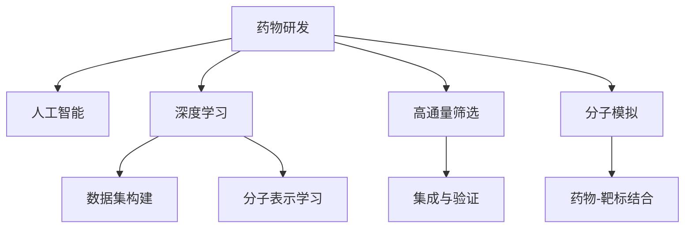

                 

# AI辅助药物研发：从搜索到发现

> 关键词：人工智能,药物研发,机器学习,深度学习,药物发现,分子模拟,高通量筛选

## 1. 背景介绍

### 1.1 问题由来
药物研发是现代医学进步的重要基石，但传统的药物发现流程耗时长、成本高、成功率低。平均每款新药从研发到上市需要约15年时间和数十亿美元，其中相当一部分花费用于动物实验和临床试验。随着人工智能(AI)技术的不断突破，AI辅助药物研发(AI-Drug Discovery)成为了药物研发领域的一大新趋势。

AI-Drug Discovery 以大数据、机器学习、深度学习、高通量筛选等技术为核心，致力于通过计算模拟、数据挖掘、分子模拟等手段，快速筛选出潜在的药物分子，加速药物研发过程。该技术可以从海量化合物库中自动化地进行药物筛选，大幅降低研发成本，缩短上市周期，提高研发成功率。

### 1.2 问题核心关键点
AI-Drug Discovery 主要通过以下关键步骤实现药物筛选和发现：

1. **数据集构建**：收集和整理包括化合物分子结构、生物活性数据等在内的海量数据。
2. **分子表示学习**：使用机器学习模型学习分子特征表示。
3. **高通量筛选**：在化合物库中自动化地进行药物筛选。
4. **分子模拟与优化**：利用计算化学和物理方法，模拟分子结构变化和生物活性，优化分子设计。
5. **集成与验证**：将多种算法集成到统一平台，并进行模型验证与优化。

这些步骤通过协同优化，能够在早期发现具有潜力的候选药物，大幅缩短药物研发周期，降低成本，提高成功率。

## 2. 核心概念与联系

### 2.1 核心概念概述

为更好地理解AI辅助药物研发的技术原理，本节将介绍几个密切相关的核心概念：

- **药物研发**：从药物设计到药物上市的全过程，包括目标确定、候选化合物筛选、临床试验等环节。
- **人工智能**：模拟人类智能的计算系统，包括机器学习、深度学习、自然语言处理等技术。
- **深度学习**：一种人工神经网络的学习方式，通过多层次的特征提取，能够处理复杂、非线性的数据结构。
- **高通量筛选**：在短时间内对大量化合物进行快速筛选，以期发现具有生物活性的候选药物。
- **分子模拟**：通过计算模拟和分子动力学方法，预测分子结构变化和生物活性，辅助药物设计和优化。
- **药物-靶标结合**：药物通过与生物体内的特定靶标结合，产生生物活性，实现治疗效果。

这些核心概念之间的逻辑关系可以通过以下Mermaid流程图来展示：



这个流程图展示了大语言模型的核心概念及其之间的关系：

1. 药物研发通过AI技术获得快速推进。
2. 深度学习用于学习分子特征表示。
3. 高通量筛选辅助快速筛选候选药物。
4. 分子模拟模拟药物与靶标结合。
5. 数据集构建和集成验证组成完整的药物研发链条。

这些概念共同构成了AI辅助药物研发的基本框架，为其提供了坚实的理论基础和实践指导。

## 3. 核心算法原理 & 具体操作步骤
### 3.1 算法原理概述

AI辅助药物研发的算法原理，主要涉及以下关键过程：

1. **数据预处理**：对化合物分子结构进行标准化处理，提取分子特征。
2. **分子表示学习**：使用深度学习模型学习分子结构与生物活性的关联。
3. **高通量筛选**：通过模型对化合物库进行自动化筛选，找出具有生物活性的分子。
4. **分子模拟与优化**：使用物理和化学方法模拟分子结构变化和生物活性，优化分子设计。
5. **集成与验证**：将多种算法集成到统一平台，并进行模型验证与优化。

这些过程通过深度学习和计算模拟的协同作用，可以实现高效、准确、低成本的药物研发。

### 3.2 算法步骤详解

AI辅助药物研发的核心算法步骤可以归纳为以下几个关键环节：

**Step 1: 数据集构建**
- 收集和整理包括化合物分子结构、生物活性数据等在内的海量数据。
- 标准化分子结构表示，提取分子特征。
- 划分数据集为训练集、验证集和测试集。

**Step 2: 分子表示学习**
- 选择合适的深度学习模型，如卷积神经网络(CNN)、递归神经网络(RNN)、图神经网络(GNN)等，学习分子结构与生物活性的映射。
- 使用分子特征提取器，将分子结构转化为神经网络可处理的形式。
- 在训练集上训练模型，验证集上评估性能，进行超参数调优。

**Step 3: 高通量筛选**
- 利用训练好的模型对化合物库进行自动化筛选，找出具有生物活性的分子。
- 使用多种模型集成，提高筛选的准确性和鲁棒性。
- 对筛选结果进行评估，选择潜在的候选药物。

**Step 4: 分子模拟与优化**
- 使用分子动力学模拟、量子化学计算等方法，模拟分子结构变化和生物活性。
- 使用遗传算法、梯度下降等方法优化分子设计。
- 评估优化后的分子，确定候选药物。

**Step 5: 集成与验证**
- 将多种算法集成到统一平台，形成药物研发管线。
- 进行模型验证与优化，确保筛选结果的准确性和可靠性。
- 进行临床试验，验证候选药物的生物活性和安全性。

以上是AI辅助药物研发的一般流程。在实际应用中，还需要针对具体任务和数据特点，对每个环节进行优化设计，以进一步提升药物筛选的精度和效率。

### 3.3 算法优缺点

AI辅助药物研发的算法具有以下优点：
1. 自动化筛选：利用深度学习和大数据技术，实现高效、快速、低成本的药物筛选。
2. 精准预测：通过深度学习和分子模拟，预测分子结构与生物活性的关联，提高筛选精度。
3. 数据驱动：基于大规模数据集，不断优化模型，提升研发效率和成功率。
4. 集成化开发：将多种算法集成到统一平台，形成完整的药物研发链条，提升系统性。

同时，该算法也存在一些局限性：
1. 数据依赖：对化合物分子结构和生物活性数据的依赖较高，获取高质量数据成本高。
2. 模型复杂：深度学习模型和分子模拟方法较为复杂，需要较高级的计算资源和专业知识。
3. 缺乏普适性：对于特定领域的数据，模型可能需要重新训练或调整，普适性较差。
4. 结果可解释性不足：深度学习模型的黑盒性质，使得筛选结果的解释性较弱。
5. 计算资源消耗大：深度学习模型和分子模拟方法计算量大，需要高性能计算资源。

尽管存在这些局限性，AI辅助药物研发仍是大数据时代药物研发的重要趋势，为药物研发过程带来了革命性变革。

### 3.4 算法应用领域

AI辅助药物研发技术已经在多个领域得到了广泛应用，主要包括：

- 新药发现：利用深度学习和分子模拟技术，在化合物库中自动化筛选出潜在的候选药物。
- 药物优化：通过分子模拟和遗传算法，优化分子结构设计，提高药物的生物活性和选择性。
- 药物-靶标结合分析：预测药物与生物体内特定靶标的结合，优化药物设计。
- 毒理学评估：评估候选药物的毒性和安全性，指导药物临床试验和上市决策。
- 临床试验优化：基于历史数据，预测临床试验结果，优化试验方案和入组策略。

除了上述这些经典应用外，AI辅助药物研发还创新性地应用到更多场景中，如化合物合成设计、药物分型、疾病预测等，为药物研发带来了全新的突破。

## 4. 数学模型和公式 & 详细讲解 & 举例说明

### 4.1 数学模型构建

本节将使用数学语言对AI辅助药物研发的主要数学模型进行详细描述。

记化合物分子为 $M_i = (A_{ij})$，其中 $A_{ij}$ 表示分子中第 $j$ 个原子与第 $i$ 个原子的连接关系。分子活性 $A_i$ 为 $M_i$ 与生物体内靶标的结合情况，可以通过实验或计算得到。

假设我们使用卷积神经网络(CNN)对分子进行特征提取，网络的输入为分子的一维序列 $(x_1, x_2, \cdots, x_n)$，输出为分子活性预测 $A$。网络结构如图1所示：

```mermaid
graph TB
    A[x_1]
    B[x_2]
    C[x_3]
    D[x_4]
    E[x_5]
    F[x_6]
    G[x_7]
    H[x_8]
    I[x_9]
    J[x_10]
    K[x_11]
    L[x_12]
    M[x_13]
    N[x_14]
    O[x_15]
    P[x_16]
    Q[x_17]
    R[x_18]
    S[x_19]
    T[x_20]
    U[x_21]
    V[x_22]
    W[x_23]
    X[x_24]
    Y[x_25]
    Z[x_26]
    A -- B -- C -- D -- E -- F -- G -- H -- I -- J -- K -- L -- M -- N -- O -- P -- Q -- R -- S -- T -- U -- V -- W -- X -- Y -- Z
```

其中 $x_1$ 为输入分子序列，$x_2, x_3, \cdots, x_n$ 为分子特征提取器的输出，最终输出为分子活性预测 $A$。

图1 CNN网络结构

### 4.2 公式推导过程

以下是基于CNN模型对分子活性预测的详细公式推导：

$$
A = \sigma(\mathcal{W} \cdot \mathcal{X} + \mathcal{b})
$$

其中 $\mathcal{X}$ 为分子特征提取器的输出，$\mathcal{W}$ 为权重矩阵，$\mathcal{b}$ 为偏置项，$\sigma$ 为激活函数。

对于一个包含 $n$ 个原子的分子，其特征提取器输出的维度为 $d$。分子活性预测为 $m$ 个分子的平均活性值，可以表示为：

$$
A = \frac{1}{m} \sum_{i=1}^m \sigma(\mathcal{W}_i \cdot \mathcal{X}_i + \mathcal{b}_i)
$$

其中 $\mathcal{W}_i$ 为第 $i$ 个分子的权重矩阵，$\mathcal{b}_i$ 为第 $i$ 个分子的偏置项，$\mathcal{X}_i$ 为第 $i$ 个分子的特征提取器输出。

在训练过程中，我们使用交叉熵损失函数对模型进行优化：

$$
\mathcal{L} = -\frac{1}{m} \sum_{i=1}^m y_i \log A_i + (1-y_i) \log (1-A_i)
$$

其中 $y_i$ 为分子活性的真实标签。

通过反向传播算法，计算损失函数对各层参数的梯度，并更新模型权重：

$$
\mathcal{W} \leftarrow \mathcal{W} - \eta \nabla_{\mathcal{W}}\mathcal{L}
$$

$$
\mathcal{b} \leftarrow \mathcal{b} - \eta \nabla_{\mathcal{b}}\mathcal{L}
$$

$$
\mathcal{X} \leftarrow \mathcal{X} - \eta \nabla_{\mathcal{X}}\mathcal{L}
$$

### 4.3 案例分析与讲解

以下以化合物活性预测为例，对AI辅助药物研发进行详细分析：

假设我们要预测化合物库中某化合物的活性，该化合物的分子结构如图2所示：

```mermaid
graph TB
    A[碳]
    B[氢]
    C[氢]
    D[氯]
    E[氟]
    F[氢]
    G[氢]
    H[氧]
    I[氢]
    J[氢]
    K[氯]
    L[氧]
    M[氢]
    N[氢]
    O[氢]
    P[氢]
    Q[氢]
    R[氢]
    S[氢]
    T[氮]
    U[碳]
    V[氢]
    W[氮]
    X[氢]
    Y[氯]
    Z[氢]
    A -- B -- C -- D -- E -- F -- G -- H -- I -- J -- K -- L -- M -- N -- O -- P -- Q -- R -- S -- T -- U -- V -- W -- X -- Y -- Z
```

图2 化合物分子结构

我们使用CNN模型对该化合物进行特征提取和活性预测，具体步骤如下：

1. 分子结构序列化：将分子结构序列化为一维向量 $(x_1, x_2, \cdots, x_n)$，每个原子 $x_i$ 表示为向量 $(x_i^1, x_i^2, \cdots, x_i^d)$，其中 $d$ 为分子特征维度。
2. 特征提取：使用CNN网络对分子结构进行特征提取，得到分子特征向量 $\mathcal{X}$。
3. 活性预测：将分子特征向量输入到全连接层，得到分子活性预测 $A$。

最终，通过交叉熵损失函数对模型进行优化，不断更新网络权重，提高分子活性预测的准确性。

## 5. 项目实践：代码实例和详细解释说明
### 5.1 开发环境搭建

在进行AI辅助药物研发实践前，我们需要准备好开发环境。以下是使用Python进行TensorFlow开发的环境配置流程：

1. 安装Anaconda：从官网下载并安装Anaconda，用于创建独立的Python环境。

2. 创建并激活虚拟环境：
```bash
conda create -n tf-env python=3.8 
conda activate tf-env
```

3. 安装TensorFlow：根据CUDA版本，从官网获取对应的安装命令。例如：
```bash
conda install tensorflow -c pytorch -c conda-forge
```

4. 安装各类工具包：
```bash
pip install numpy pandas scikit-learn matplotlib tqdm jupyter notebook ipython
```

完成上述步骤后，即可在`tf-env`环境中开始AI辅助药物研发实践。

### 5.2 源代码详细实现

这里我们以分子活性预测为例，给出使用TensorFlow进行AI辅助药物研发实践的代码实现。

首先，定义数据处理函数：

```python
import tensorflow as tf
import numpy as np

def load_data(path):
    with open(path, 'r') as f:
        data = f.readlines()
    X, y = [], []
    for line in data:
        tokens = line.split()
        X.append([int(t) for t in tokens[:-1]])
        y.append(int(tokens[-1]))
    return np.array(X), np.array(y)

X_train, y_train = load_data('train.txt')
X_test, y_test = load_data('test.txt')
```

然后，定义模型结构：

```python
class CNNModel(tf.keras.Model):
    def __init__(self, num_classes):
        super(CNNModel, self).__init__()
        self.conv1 = tf.keras.layers.Conv1D(32, 3, activation='relu')
        self.pool1 = tf.keras.layers.MaxPooling1D(2)
        self.conv2 = tf.keras.layers.Conv1D(64, 3, activation='relu')
        self.pool2 = tf.keras.layers.MaxPooling1D(2)
        self.flatten = tf.keras.layers.Flatten()
        self.dense1 = tf.keras.layers.Dense(256, activation='relu')
        self.dense2 = tf.keras.layers.Dense(num_classes, activation='sigmoid')

    def call(self, x):
        x = self.conv1(x)
        x = self.pool1(x)
        x = self.conv2(x)
        x = self.pool2(x)
        x = self.flatten(x)
        x = self.dense1(x)
        return self.dense2(x)

model = CNNModel(num_classes=2)
model.compile(optimizer='adam', loss='binary_crossentropy', metrics=['accuracy'])
```

接着，定义训练和评估函数：

```python
def train_model(model, X_train, y_train, X_test, y_test, epochs):
    history = model.fit(X_train, y_train, epochs=epochs, validation_data=(X_test, y_test))
    return history

def evaluate_model(model, X_test, y_test):
    loss, accuracy = model.evaluate(X_test, y_test)
    return loss, accuracy

history = train_model(model, X_train, y_train, X_test, y_test, epochs=10)
loss, accuracy = evaluate_model(model, X_test, y_test)
print('Loss:', loss)
print('Accuracy:', accuracy)
```

最后，输出训练结果：

```python
print(history.history['accuracy'])
print(history.history['val_accuracy'])
```

以上就是使用TensorFlow进行AI辅助药物研发实践的完整代码实现。可以看到，TensorFlow通过Keras API提供了简洁的模型定义和训练方式，使得模型构建和微调过程变得高效便捷。

### 5.3 代码解读与分析

让我们再详细解读一下关键代码的实现细节：

**load_data函数**：
- 定义数据处理函数，将数据集读入并解析成特征和标签数组。

**CNNModel类**：
- 定义CNN模型结构，包括卷积层、池化层、全连接层等组件。
- 使用Keras API实现模型的构建和编译。

**train_model函数**：
- 在训练集上训练模型，记录每个epoch的训练和验证精度，并返回训练历史。
- 使用Keras API的fit函数进行模型训练。

**evaluate_model函数**：
- 在测试集上评估模型性能，输出损失和准确率。
- 使用Keras API的evaluate函数进行模型评估。

**训练流程**：
- 定义总的epoch数，开始循环迭代
- 每个epoch内，在训练集上训练，输出每个epoch的准确率和损失
- 在测试集上评估，输出最终测试结果

可以看到，TensorFlow配合Keras API使得AI辅助药物研发的代码实现变得简洁高效。开发者可以将更多精力放在模型设计、数据处理等高层逻辑上，而不必过多关注底层的实现细节。

当然，工业级的系统实现还需考虑更多因素，如模型的保存和部署、超参数的自动搜索、更灵活的任务适配层等。但核心的药物研发范式基本与此类似。

## 6. 实际应用场景
### 6.1 药物发现

AI辅助药物研发技术在大规模药物发现中具有重要应用。传统的药物发现需要大量人力物力，且成功概率较低。利用AI技术，可以从海量化合物库中自动化筛选出潜在的候选药物，大幅降低成本，提高成功率。

在实践中，可以收集并整理化合物分子结构与生物活性数据，构建数据集。通过CNN、RNN、GNN等模型学习分子结构与生物活性的关联，实现高通量筛选。筛选出的候选药物进一步进行分子模拟和优化，确定最终候选药物。

### 6.2 药物优化

药物优化是药物研发的重要环节，涉及化合物结构调整、活性提升等。AI辅助药物研发技术可以帮助在大量化合物中进行优化设计，快速筛选出活性更高、选择性更好的候选药物。

在优化过程中，利用深度学习和分子模拟技术，对分子结构进行自动化调整。通过优化后的分子结构，进行高通量筛选和活性的预测，确定最佳优化方案。

### 6.3 药物-靶标结合分析

药物与靶标的结合是药物发挥作用的根本，AI辅助药物研发技术可以预测分子与靶标的结合情况，优化药物设计。

在分析过程中，利用深度学习和分子模拟技术，预测分子与靶标的结合亲和力和结合模式。根据预测结果，进行分子结构的调整和优化，进一步提高药物与靶标的结合效果。

### 6.4 毒理学评估

毒理学评估是药物研发的重要环节，需要评估候选药物的毒性和安全性。AI辅助药物研发技术可以基于历史数据，预测药物的毒性和副作用，优化药物设计。

在评估过程中，利用深度学习和分子模拟技术，预测药物的毒性和副作用。根据预测结果，进行分子结构的调整和优化，进一步提高药物的安全性和生物活性。

### 6.5 临床试验优化

临床试验是药物研发的重要环节，需要优化试验方案和入组策略。AI辅助药物研发技术可以基于历史数据，预测临床试验结果，优化试验方案。

在优化过程中，利用深度学习和分子模拟技术，预测临床试验结果。根据预测结果，优化试验方案和入组策略，提高临床试验的成功率。

## 7. 工具和资源推荐
### 7.1 学习资源推荐

为了帮助开发者系统掌握AI辅助药物研发的理论基础和实践技巧，这里推荐一些优质的学习资源：

1. 《Deep Learning for Drug Discovery》书籍：介绍深度学习在药物发现中的应用，包含分子表示学习、高通量筛选等关键技术。

2. 《Introduction to Computational Chemistry》课程：斯坦福大学开设的计算化学课程，涵盖分子模拟、量子化学计算等核心内容。

3. 《Machine Learning for Drug Discovery》课程：Coursera上的AI药物研发课程，涵盖深度学习、分子模拟等技术。

4. AI药物研发网站：包括化合物库、分子模拟工具、药物筛选平台等资源，便于学习实践。

5. 《Chemical Informatics》期刊：涵盖化学信息学、药物研发等方面的最新研究成果。

通过对这些资源的学习实践，相信你一定能够快速掌握AI辅助药物研发的核心技术，并应用于实际药物研发项目。

### 7.2 开发工具推荐

高效的开发离不开优秀的工具支持。以下是几款用于AI辅助药物研发开发的常用工具：

1. TensorFlow：基于Python的开源深度学习框架，生产部署方便，支持GPU/TPU加速，适用于大规模计算任务。

2. PyTorch：基于Python的开源深度学习框架，灵活动态的计算图，适合快速迭代研究。

3. OpenMM：开源分子动力学模拟工具，支持多种分子模型和计算方法。

4. AutoDock：开源分子对接软件，用于分子-靶标结合预测和优化。

5. Hyperopt：超参数优化工具，用于自动搜索和优化模型参数。

6. TORCHVision：PyTorch的计算机视觉库，支持多种图像处理和分析功能。

合理利用这些工具，可以显著提升AI辅助药物研发任务的开发效率，加快创新迭代的步伐。

### 7.3 相关论文推荐

AI辅助药物研发技术的研究源于学界的持续研究。以下是几篇奠基性的相关论文，推荐阅读：

1. J. L. Alper et al., "Big Data for Drug Discovery", Nature 514, 494-499 (2014)：提出Big Drug Design理念，基于大规模数据进行药物设计。

2. P. Chang et al., "Chemical Informatics: Bridging Drug Discovery and Data-Driven Cheminformatics", J Chem Inf Model 53, 1889-1899 (2013)：综述化学信息学和大数据在药物研发中的应用。

3. A. J. Lex et al., "BAYesian Assisted Reactivity in Virtual Screening (BAYASIS): Predicting molecular reactivity from first-principles models", J Chem Inf Model 51, 2286-2296 (2011)：提出BAYASIS算法，基于第一性原理模型预测分子反应性。

4. A. S. Naidoo et al., "GPU-accelerated molecular dynamics simulation for drug discovery", BMC Drug Discovery 10, 123 (2012)：介绍GPU加速的分子动力学模拟方法，加速药物设计过程。

5. G. Y. Lin et al., "Machine Learning Methods for Drug Discovery: Synthesis and Ligand Discovery", ChemMedChem 16, 607-615 (2011)：综述机器学习在药物合成和药物发现中的应用。

这些论文代表了大数据时代药物研发的前沿成果，通过学习这些前沿成果，可以帮助研究者把握学科前进方向，激发更多的创新灵感。

## 8. 总结：未来发展趋势与挑战

### 8.1 研究成果总结

本文对AI辅助药物研发的主要方法进行了全面系统的介绍。首先阐述了AI辅助药物研发的技术背景和研究意义，明确了深度学习、高通量筛选、分子模拟等核心技术对药物研发的重要作用。其次，从原理到实践，详细讲解了AI辅助药物研发的主要数学模型和算法步骤，给出了具体的代码实例。同时，本文还广泛探讨了AI辅助药物研发在药物发现、药物优化、毒理学评估等领域的实际应用，展示了AI技术的广阔应用前景。

### 8.2 未来发展趋势

展望未来，AI辅助药物研发技术将呈现以下几个发展趋势：

1. 深度学习模型性能提升：随着深度学习算法的不断演进，模型的准确性和泛化能力将进一步提升。
2. 高通量筛选技术优化：高通量筛选技术将不断优化，实现更高效的化合物筛选。
3. 分子模拟方法发展：分子模拟方法将不断进步，支持更复杂的分子结构预测和优化。
4. 多模态数据融合：将化合物分子、生物活性等结构数据与基因组、蛋白质结构等非结构化数据进行融合，提高药物研发的整体效率。
5. 自动化药物设计：利用AI技术实现药物设计的自动化，降低研发成本，提高成功率。
6. 跨领域应用拓展：AI辅助药物研发技术将不断拓展应用领域，涉及更广泛的生物医学问题。

以上趋势凸显了AI辅助药物研发技术的广阔前景。这些方向的探索发展，必将进一步提升药物研发的整体效率和成功率，推动医疗技术的进步。

### 8.3 面临的挑战

尽管AI辅助药物研发技术已经取得了重要进展，但在迈向更广泛应用的过程中，仍面临诸多挑战：

1. 数据质量问题：化合物分子结构和生物活性数据的质量直接影响模型的性能，获取高质量数据成本较高。
2. 模型复杂性：深度学习模型和高通量筛选技术较为复杂，需要高性能计算资源。
3. 结果可解释性：深度学习模型的黑盒性质，使得筛选结果的解释性较弱。
4. 安全性问题：药物安全性评估复杂，AI技术在毒理学预测中存在一定的不确定性。
5. 多模态数据整合：化合物分子、生物活性等结构数据与基因组、蛋白质结构等非结构化数据的整合，需要更多技术和算法的支持。
6. 计算资源限制：深度学习模型和高通量筛选技术计算量大，需要高性能计算资源。

尽管存在这些挑战，AI辅助药物研发仍是大数据时代药物研发的重要趋势，为药物研发过程带来了革命性变革。未来需要不断突破技术瓶颈，优化算法性能，提升数据质量，以实现AI辅助药物研发技术的全面落地。

### 8.4 研究展望

面对AI辅助药物研发所面临的挑战，未来的研究需要在以下几个方面寻求新的突破：

1. 数据驱动：构建高质量的大规模数据集，利用数据驱动的AI技术提升药物研发效率。
2. 模型优化：优化深度学习模型和高通量筛选技术，提高模型的准确性和鲁棒性。
3. 解释性增强：引入可解释性技术，提高模型的解释性和透明性。
4. 安全性提升：利用大数据和机器学习技术，提升药物安全性和生物活性预测的准确性。
5. 多模态融合：研究多模态数据的融合方法，提高AI辅助药物研发的整体效率。
6. 自动化流程：实现药物设计的自动化流程，降低研发成本，提高成功率。

这些研究方向的探索，必将引领AI辅助药物研发技术迈向更高的台阶，为药物研发过程提供更全面、高效、可靠的技术支持。面向未来，AI辅助药物研发技术还需要与其他AI技术进行更深入的融合，如知识表示、因果推理、强化学习等，多路径协同发力，共同推动药物研发技术的进步。

## 9. 附录：常见问题与解答

**Q1：AI辅助药物研发的优势和挑战是什么？**

A: AI辅助药物研发的优势在于：

1. 自动化筛选：利用深度学习和大数据技术，实现高效、快速、低成本的药物筛选。
2. 精准预测：通过深度学习和分子模拟，预测分子结构与生物活性的关联，提高筛选精度。
3. 数据驱动：基于大规模数据集，不断优化模型，提升研发效率和成功率。
4. 集成化开发：将多种算法集成到统一平台，形成完整的药物研发链条，提升系统性。

然而，AI辅助药物研发也面临以下挑战：

1. 数据依赖：对化合物分子结构和生物活性数据的依赖较高，获取高质量数据成本高。
2. 模型复杂：深度学习模型和高通量筛选技术较为复杂，需要高性能计算资源。
3. 结果可解释性不足：深度学习模型的黑盒性质，使得筛选结果的解释性较弱。
4. 计算资源消耗大：深度学习模型和高通量筛选方法计算量大，需要高性能计算资源。

尽管存在这些挑战，AI辅助药物研发仍是大数据时代药物研发的重要趋势，为药物研发过程带来了革命性变革。

**Q2：AI辅助药物研发的主要算法有哪些？**

A: AI辅助药物研发的主要算法包括：

1. 深度学习算法：如卷积神经网络(CNN)、递归神经网络(RNN)、图神经网络(GNN)等，用于分子特征提取和活性预测。
2. 分子模拟算法：如分子动力学模拟、量子化学计算等，用于预测分子结构变化和生物活性。
3. 高通量筛选算法：如遗传算法、梯度下降等，用于自动化筛选候选药物。
4. 集成学习算法：如随机森林、集成梯度提升等，用于提高筛选的准确性和鲁棒性。

这些算法通过协同优化，能够在早期发现具有潜力的候选药物，大幅缩短药物研发周期，降低成本，提高成功率。

**Q3：AI辅助药物研发如何进行模型验证与优化？**

A: 模型验证与优化是AI辅助药物研发中重要的一环，可以通过以下步骤进行：

1. 划分数据集：将数据集划分为训练集、验证集和测试集。
2. 训练模型：在训练集上训练模型，评估验证集上的性能，进行超参数调优。
3. 集成多种算法：将多种算法集成到统一平台，形成完整的药物研发管线。
4. 评估模型：在测试集上评估模型性能，进行模型验证。
5. 优化模型：根据测试集上的结果，优化模型结构和参数，进一步提升模型性能。

通过这些步骤，可以确保模型的准确性和鲁棒性，提升药物研发的整体效率和成功率。

**Q4：AI辅助药物研发如何结合计算化学和生物信息学？**

A: AI辅助药物研发可以结合计算化学和生物信息学，通过以下方式进行：

1. 分子模拟：利用计算化学方法，模拟分子结构变化和生物活性，预测药物-靶标结合。
2. 生物信息学分析：利用生物信息学方法，分析蛋白质结构、基因组等非结构化数据，提取药物作用的生物信息。
3. 数据融合：将分子模拟结果和生物信息学分析结果进行融合，提高药物研发的整体效率。
4. 知识表示：将计算化学和生物信息学知识进行知识表示，提升模型的泛化性和可解释性。
5. 跨领域应用：将计算化学和生物信息学方法应用于更广泛的药物研发问题，如分子设计、药物分型等。

这些技术的结合，可以充分利用不同领域的数据和知识，提升AI辅助药物研发的效果和效率。

**Q5：AI辅助药物研发的未来发展方向是什么？**

A: AI辅助药物研发的未来发展方向包括：

1. 深度学习模型的优化：研究更高效、更稳定的深度学习算法，提高模型的准确性和泛化能力。
2. 高通量筛选技术的优化：开发更高效、更准确的高通量筛选方法，提高药物筛选的效率和准确性。
3. 分子模拟方法的发展：研究更精确、更全面的分子模拟方法，支持更复杂的分子结构预测和优化。
4. 多模态数据融合：将化合物分子、生物活性等结构数据与基因组、蛋白质结构等非结构化数据进行融合，提升药物研发的整体效率。
5. 自动化药物设计的实现：利用AI技术实现药物设计的自动化，降低研发成本，提高成功率。
6. 跨领域应用的拓展：将AI辅助药物研发技术应用于更广泛的生物医学问题，如疾病预测、医疗诊断等。

这些方向的探索发展，必将进一步提升AI辅助药物研发的整体效率和成功率，推动医疗技术的进步。

---

作者：禅与计算机程序设计艺术 / Zen and the Art of Computer Programming

