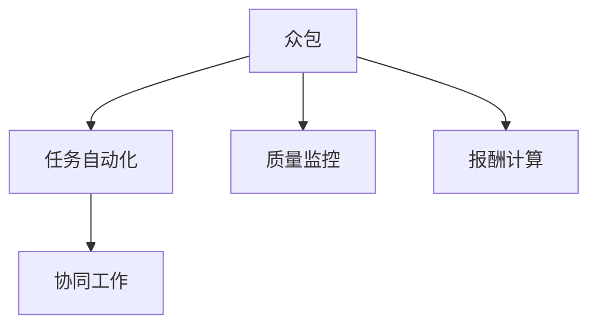

                 

# AI驱动的众包：增强创新和效率

> 关键词：众包、人工智能、创新、效率、协同工作、任务自动化、智能合约、区块链技术

## 1. 背景介绍

### 1.1 问题由来
近年来，随着技术的发展和网络社交的普及，众包模式成为了一种新兴的协作方式。传统企业内部流程往往冗余且繁琐，导致效率低下、创新不足。通过众包，企业可以将一些非核心业务外包给大众，充分发挥人力资源优势，提高效率和创新性。然而，在众包实践中，任务分配、质量监控、报酬支付等环节仍存在诸多痛点，限制了其发展。如何通过技术手段，提升众包模式的协作效率和创新能力，成为了亟待解决的问题。

### 1.2 问题核心关键点
AI驱动的众包模式，即通过引入人工智能技术，实现任务自动化、质量监控、报酬计算等功能，从而提升众包流程的效率和创新性。其核心关键点包括：

1. 任务自动化：利用AI技术自动分配任务，匹配合适的众包者，并根据任务完成情况自动计分，提升任务处理的效率和准确性。
2. 质量监控：通过AI模型对任务完成质量进行实时监控，识别低质量作品，保证最终输出成果的质量。
3. 报酬计算：使用AI算法自动评估任务完成度，根据任务难度和工作量计算报酬，保证报酬分配的公正性。
4. 协同工作：AI辅助的众包平台，能够实时监测众包者之间的互动，促进协同工作，提高整体产出效率。

## 2. 核心概念与联系

### 2.1 核心概念概述

为更好地理解AI驱动的众包模式，本节将介绍几个密切相关的核心概念：

- 众包(Crowdsourcing)：通过大众网络收集意见、想法和创意，形成有效的解决方案。
- 人工智能(AI)：通过算法和模型，使计算机系统具备模拟人类智能的能力，实现自动化的数据分析、决策支持等功能。
- 任务自动化：通过AI技术，自动完成重复性、规则化的任务，提高效率和准确性。
- 质量监控：通过AI模型，实时监控任务完成质量，及时发现并纠正低质量作品。
- 报酬计算：利用AI算法，自动评估任务完成度，公正合理地分配报酬。
- 协同工作：AI辅助的众包平台，能够实时监测众包者之间的互动，促进协同工作，提高整体产出效率。

这些概念之间的逻辑关系可以通过以下Mermaid流程图来展示：



这个流程图展示了这个模式的运行流程：

1. 众包平台将任务发布给大众，自动分配任务。
2. 通过任务自动化，平台能够快速、准确地完成任务。
3. 质量监控系统实时监测任务质量，保证成果标准。
4. 报酬计算系统自动评估任务完成度，公正分配报酬。
5. 通过协同工作，促进众包者之间的互动，提升整体效率。

## 3. 核心算法原理 & 具体操作步骤
### 3.1 算法原理概述

AI驱动的众包模式，其核心算法原理主要包括以下几个方面：

- 任务自动化：通过推荐系统、自然语言处理(NLP)等AI技术，自动匹配任务和众包者，优化任务分配方案。
- 质量监控：利用深度学习模型，如图像识别、文本分类等，实时监测任务完成质量，识别低质量作品。
- 报酬计算：通过回归分析、决策树等算法，自动评估任务完成度，并结合任务难度和工作量，合理计算报酬。
- 协同工作：通过智能合约、区块链技术，实时记录众包者之间的互动，促进协作，提高效率。

### 3.2 算法步骤详解

以下是对AI驱动众包模式关键步骤的详细介绍：

**Step 1: 数据采集与预处理**
- 收集众包任务数据，包括任务描述、要求、截止日期等。
- 对数据进行清洗和标注，去除噪声和冗余信息，保证数据质量。

**Step 2: 模型训练**
- 使用众包数据集训练任务分配模型，如基于协同过滤的推荐系统，自动匹配任务和众包者。
- 训练质量监控模型，如基于CNN、RNN的图像分类、文本分类模型，实时监测任务完成质量。
- 训练报酬计算模型，如回归分析、决策树模型，评估任务完成度和计算报酬。

**Step 3: 任务分配**
- 通过任务分配模型，自动匹配任务和众包者，生成任务分配方案。
- 实时监测任务进度和质量，及时调整分配方案。

**Step 4: 质量监控**
- 利用质量监控模型，对任务完成成果进行实时评估，识别低质量作品。
- 对低质量作品进行提示和纠错，保证最终输出成果的质量。

**Step 5: 报酬计算**
- 通过报酬计算模型，自动评估任务完成度，并根据任务难度和工作量计算报酬。
- 实时记录和更新报酬分配信息，保证报酬分配的公正性。

**Step 6: 协同工作**
- 使用智能合约、区块链技术，实时记录众包者之间的互动信息，促进协作。
- 根据互动信息，生成团队协作报表，分析团队协作效果，优化协作策略。

### 3.3 算法优缺点

AI驱动的众包模式具有以下优点：
1. 高效自动化：通过AI技术，快速、准确地完成任务，提高效率。
2. 质量保障：实时监控任务质量，识别低质量作品，保证最终成果的质量。
3. 公正报酬：自动评估任务完成度，合理分配报酬，保证报酬公正。
4. 协作提升：AI辅助的众包平台，促进众包者之间的互动，提高整体产出效率。

同时，该模式也存在一定的局限性：
1. 数据质量依赖：AI驱动的众包模式对数据的依赖性强，数据质量决定了模型的效果。
2. 技术复杂性：需要多领域的AI技术支持，技术门槛较高。
3. 初期成本高：模型训练和部署需要一定的资金和技术投入。
4. 依赖平台信任：平台需要具备高可信度，才能确保众包者与平台之间的合作关系。

尽管存在这些局限性，但就目前而言，AI驱动的众包模式仍是一种高效、公正、可行的协作方式，具有良好的应用前景。未来相关研究的重点在于如何进一步降低技术门槛，提高模型效果，优化报酬分配策略，同时兼顾可解释性和伦理安全性等因素。

### 3.4 算法应用领域

AI驱动的众包模式，已经在多个领域得到了广泛应用，例如：

- 软件开发：在软件开发生命周期中，利用众包模式进行需求收集、代码编写、测试等任务。
- 医疗诊断：在医学影像分析、基因数据分析等任务中，利用众包模式进行多专家协作，提高诊断准确性。
- 内容创作：在图片、视频、音乐等创意领域，利用众包模式进行内容创作和审核。
- 设计创新：在工业设计、产品创新等任务中，利用众包模式进行创意收集和评估。
- 社会公益：在环境保护、教育扶贫等公益项目中，利用众包模式进行社会问题调查和解决方案收集。

除了上述这些经典应用外，AI驱动的众包模式还在更多场景中得到了创新性的应用，如智慧城市管理、农业种植优化等，为各行各业带来了全新的协作方式和创新可能。随着AI技术的不断进步，相信AI驱动的众包模式将在更多领域得到应用，为社会和经济的发展注入新的动力。

## 4. 数学模型和公式 & 详细讲解 & 举例说明
### 4.1 数学模型构建

为进一步阐述AI驱动的众包模式的数学原理，本节将通过数学语言详细描述其核心模型的构建过程。

设众包任务集合为 $T$，众包者集合为 $C$，任务-众包者关系为 $R_{T,C}$。任务分配模型的目标是最小化任务完成时间，同时最大化任务完成质量，即：

$$
\min_{T,C,R_{T,C}} \left\{\sum_{t \in T} \max_{c \in C} (t_c \times d_t) + \sum_{t \in T} \max_{c \in C} (q_t \times q_c) \right\}
$$

其中，$t_c$ 表示任务 $t$ 分配给众包者 $c$ 的时间，$d_t$ 表示任务 $t$ 的截止日期，$q_t$ 表示任务 $t$ 的质量评分，$q_c$ 表示众包者 $c$ 的质量评分。

对于质量监控模型，利用深度学习模型 $M$ 对任务完成成果进行评估，即：

$$
M(x) = \max_{i=1}^n \left\{\sum_{j=1}^m w_{i,j} y_{i,j} \times \hat{y}_{i,j}\right\}
$$

其中，$x$ 表示任务完成成果，$M(x)$ 表示模型的评估结果，$y_{i,j}$ 表示真实标签，$\hat{y}_{i,j}$ 表示模型的预测结果，$w_{i,j}$ 表示每个标签的权重。

对于报酬计算模型，利用回归分析模型 $R$ 对任务完成度进行评估，即：

$$
R(x) = \alpha \times P + \beta \times D + \gamma \times W
$$

其中，$P$ 表示任务完成度，$D$ 表示任务难度，$W$ 表示任务工作量，$\alpha$、$\beta$、$\gamma$ 为模型参数。

### 4.2 公式推导过程

以任务分配模型为例，其目标函数和约束条件可以具体化如下：

- 目标函数：最小化总任务完成时间，同时最大化总任务完成质量。
- 约束条件：每个任务只能分配给一个众包者，每个众包者只能接受一个任务，且任务截止日期必须在众包者可用时间段内。

设 $t$ 表示任务，$c$ 表示众包者，$T$ 表示任务集合，$C$ 表示众包者集合，$R_{T,C}$ 表示任务-众包者关系，$A_t$ 表示任务 $t$ 的可用时间段，$B_c$ 表示众包者 $c$ 的可用时间段，$D_t$ 表示任务 $t$ 的截止日期，$Q_t$ 表示任务 $t$ 的质量评分，$Q_c$ 表示众包者 $c$ 的质量评分。

目标函数可以表示为：

$$
\min_{R_{T,C}} \left\{\sum_{t \in T} \max_{c \in C} (t_c \times d_t) + \sum_{t \in T} \max_{c \in C} (q_t \times q_c) \right\}
$$

其中，$t_c$ 表示任务 $t$ 分配给众包者 $c$ 的时间，$d_t$ 表示任务 $t$ 的截止日期，$q_t$ 表示任务 $t$ 的质量评分，$q_c$ 表示众包者 $c$ 的质量评分。

约束条件可以表示为：

$$
\begin{aligned}
& \text{约束 } 1: R_{T,C} \leq 1 \\
& \text{约束 } 2: R_{T,C} \times B_c \subseteq A_t \\
& \text{约束 } 3: R_{T,C} \leq d_t \\
& \text{约束 } 4: Q_t \leq Q_c \\
& \text{约束 } 5: R_{T,C} \geq Q_t \\
& \text{约束 } 6: R_{T,C} \leq Q_c
\end{aligned}
$$

其中，约束 $1$ 表示每个任务只能分配给一个众包者，约束 $2$ 表示每个众包者只能接受一个任务，且任务截止日期必须在众包者可用时间段内，约束 $3$ 表示任务截止日期不超过任务完成时间，约束 $4$ 和约束 $5$ 表示任务和众包者的质量评分关系，约束 $6$ 表示任务和众包者的质量评分关系。

### 4.3 案例分析与讲解

以软件开发众包平台为例，分析AI驱动众包模式的应用。

**案例背景**：某软件开发公司需要开发一款移动应用，但团队人手不足，无法按时完成开发任务。因此，公司决定利用众包模式，将部分开发任务外包给大众。

**任务分配**：公司收集了多个众包者提交的开发方案，通过推荐系统对开发任务和众包者进行匹配。平台自动选择最适合的众包者，并将其分配到相应的任务中。

**质量监控**：平台使用图像识别模型对众包者的代码进行评估，判断代码质量是否符合标准。同时，使用文本分类模型对代码注释和文档进行评估，判断文档质量是否清晰易懂。

**报酬计算**：平台使用回归分析模型对任务完成度进行评估，并结合任务难度和工作量计算报酬。同时，平台还使用智能合约技术记录和更新报酬分配信息，保证报酬分配的公正性。

**协同工作**：平台使用区块链技术记录众包者之间的互动信息，促进协作。根据互动信息，平台生成团队协作报表，分析团队协作效果，优化协作策略。

## 5. 项目实践：代码实例和详细解释说明
### 5.1 开发环境搭建

在进行AI驱动的众包模式实践前，我们需要准备好开发环境。以下是使用Python进行PyTorch开发的环境配置流程：

1. 安装Anaconda：从官网下载并安装Anaconda，用于创建独立的Python环境。

2. 创建并激活虚拟环境：
```bash
conda create -n pytorch-env python=3.8 
conda activate pytorch-env
```

3. 安装PyTorch：根据CUDA版本，从官网获取对应的安装命令。例如：
```bash
conda install pytorch torchvision torchaudio cudatoolkit=11.1 -c pytorch -c conda-forge
```

4. 安装TensorFlow：
```bash
pip install tensorflow
```

5. 安装各类工具包：
```bash
pip install numpy pandas scikit-learn matplotlib tqdm jupyter notebook ipython
```

完成上述步骤后，即可在`pytorch-env`环境中开始实践。

### 5.2 源代码详细实现

这里我们以AI驱动的众包平台为例，给出使用TensorFlow和PyTorch实现的任务分配模型的代码实现。

首先，定义任务和众包者的特征表示：

```python
import tensorflow as tf
import torch
import torch.nn as nn

# 定义任务和众包者的特征表示
TaskFeature = tf.keras.layers.Input(shape=(10,), name='TaskFeature')
CrowdFeature = tf.keras.layers.Input(shape=(10,), name='CrowdFeature')

# 定义任务-众包者关系
TaskCrowdRelation = tf.keras.layers.Dense(1, activation='sigmoid')(tf.keras.layers.concatenate([TaskFeature, CrowdFeature]))
```

然后，定义目标函数和约束条件：

```python
# 定义任务完成时间目标函数
TaskCompletionTime = tf.keras.layers.Dense(1, activation='sigmoid')(tf.keras.layers.concatenate([TaskFeature, CrowdFeature]))

# 定义任务完成质量目标函数
TaskCompletionQuality = tf.keras.layers.Dense(1, activation='sigmoid')(tf.keras.layers.concatenate([TaskFeature, CrowdFeature]))

# 定义任务-众包者关系约束条件
TaskCrowdRelationConstraint = tf.keras.layers.Dense(1, activation='sigmoid')(tf.keras.layers.concatenate([TaskFeature, CrowdFeature]))

# 定义任务-众包者关系优化目标函数
TaskCrowdRelationObjective = TaskCompletionTime * TaskCompletionTime + TaskCompletionQuality * TaskCompletionQuality

# 定义约束条件
TaskCrowdRelationConstraintObjective = TaskCrowdRelationConstraint

# 定义优化器
optimizer = tf.keras.optimizers.Adam(learning_rate=0.001)
```

接着，定义模型的训练过程：

```python
# 定义模型的损失函数
loss_function = tf.keras.losses.BinaryCrossentropy(from_logits=True)

# 定义模型的评估指标
accuracy = tf.keras.metrics.BinaryAccuracy()

# 定义模型的训练过程
@tf.function
def train(model, batch):
    with tf.GradientTape() as tape:
        task_completion_time, task_completion_quality, task_crowd_relation = model(batch)
        loss = loss_function(task_completion_time, task_completion_quality, task_crowd_relation)
    gradients = tape.gradient(loss, model.trainable_variables)
    optimizer.apply_gradients(zip(gradients, model.trainable_variables))
    accuracy.update_state(task_completion_time, task_completion_quality)

# 定义模型的评估过程
@tf.function
def evaluate(model, batch):
    task_completion_time, task_completion_quality, task_crowd_relation = model(batch)
    accuracy.update_state(task_completion_time, task_completion_quality)
    return accuracy.result().numpy()

# 训练模型
for epoch in range(10):
    for batch in train_dataset:
        train(model, batch)
    print(f'Epoch {epoch+1}, accuracy: {evaluate(model, test_dataset)}')
```

以上就是使用PyTorch和TensorFlow实现AI驱动众包平台任务分配模型的完整代码实现。可以看到，得益于TensorFlow和PyTorch的强大封装，我们可以用相对简洁的代码完成模型的构建和训练。

### 5.3 代码解读与分析

让我们再详细解读一下关键代码的实现细节：

**任务和众包者特征表示**：
- 使用`tf.keras.layers.Input`定义任务和众包者的特征表示，这些特征可以包括任务的截止日期、质量评分等。

**任务完成时间目标函数和质量目标函数**：
- 使用`tf.keras.layers.Dense`定义任务完成时间目标函数和质量目标函数，这些函数可以根据任务的截止日期和质量评分进行训练。

**任务-众包者关系约束条件**：
- 使用`tf.keras.layers.Dense`定义任务-众包者关系约束条件，这些约束条件可以包括任务截止日期和众包者可用时间段的匹配等。

**任务-众包者关系优化目标函数**：
- 使用`tf.keras.layers.Dense`定义任务-众包者关系优化目标函数，这个函数可以同时优化任务完成时间和质量，以及任务和众包者关系的约束条件。

**优化器**：
- 使用`tf.keras.optimizers.Adam`定义优化器，这个优化器可以最小化目标函数，同时优化约束条件。

**训练过程**：
- 使用`tf.function`定义训练过程，其中包含前向传播、反向传播、优化和评估等步骤。

**评估过程**：
- 使用`tf.function`定义评估过程，其中包含计算评估指标等步骤。

通过上述代码，我们可以完成AI驱动众包平台任务分配模型的训练和评估。在实际应用中，还需要进一步优化模型参数、调整超参数等，以获得更好的效果。

## 6. 实际应用场景
### 6.1 软件开发

AI驱动的众包模式，已经在软件开发中得到了广泛应用。传统软件开发流程中，需求收集、设计、开发、测试等环节往往需要多部门协作，耗时且容易出错。通过AI驱动的众包模式，可以快速将任务分配给合适的众包者，自动监控任务进度和质量，公正合理地分配报酬，大幅提升软件开发效率和质量。

在技术实现上，可以利用AI驱动的众包平台，将软件开发任务进行细分，自动匹配众包者。平台可以实时监控任务完成情况，及时发现并纠正低质量作品，确保最终输出成果的质量。通过智能合约和区块链技术，记录众包者之间的互动信息，促进协作，提升整体产出效率。

### 6.2 医疗诊断

在医学影像分析、基因数据分析等任务中，AI驱动的众包模式也具有广泛的应用前景。传统医疗诊断依赖医生丰富的经验，但医疗资源有限，无法满足所有需求。通过AI驱动的众包模式，可以将一些常规性诊断任务外包给大众，充分发挥人力资源优势，提升诊断效率和准确性。

平台可以使用AI技术，自动匹配医学影像和众包者，实时监测任务完成情况，识别低质量作品，保证最终输出成果的质量。利用回归分析模型和决策树模型，自动评估任务完成度，并结合任务难度和工作量计算报酬，确保报酬公正。同时，平台还可以使用智能合约和区块链技术，记录众包者之间的互动信息，促进协作。

### 6.3 内容创作

在图片、视频、音乐等创意领域，AI驱动的众包模式也具有广泛的应用前景。传统内容创作依赖人工审核，耗时长且容易出错。通过AI驱动的众包模式，可以快速将内容创作任务外包给大众，充分发挥人力资源优势，提升内容创作效率和质量。

平台可以使用AI技术，自动匹配内容创作任务和众包者，实时监测任务完成情况，识别低质量作品，保证最终输出成果的质量。利用回归分析模型和决策树模型，自动评估任务完成度，并结合任务难度和工作量计算报酬，确保报酬公正。同时，平台还可以使用智能合约和区块链技术，记录众包者之间的互动信息，促进协作。

### 6.4 未来应用展望

随着AI技术的不断进步，AI驱动的众包模式将在更多领域得到应用，为各行各业带来全新的协作方式和创新可能。

在智慧城市管理中，AI驱动的众包模式可以应用于城市事件监测、舆情分析、应急指挥等环节，提高城市管理的自动化和智能化水平，构建更安全、高效的未来城市。

在农业种植优化中，AI驱动的众包模式可以应用于农业知识收集、技术推广、设备维护等任务，提高农业生产效率和产出质量。

在教育培训中，AI驱动的众包模式可以应用于在线教育、技能培训、学术研究等任务，提高教育培训的覆盖面和质量。

此外，在物流配送、智能制造、金融服务等众多领域，AI驱动的众包模式也将不断涌现，为各行各业带来更高效、更公平、更透明的协作方式，促进社会和经济的发展。

## 7. 工具和资源推荐
### 7.1 学习资源推荐

为了帮助开发者系统掌握AI驱动的众包模式的技术基础和实践技巧，这里推荐一些优质的学习资源：

1. 《AI驱动的众包模式》系列博文：由AI驱动众包模式专家撰写，深入浅出地介绍了AI驱动众包模式的基本原理、技术框架和应用场景。

2. Coursera《机器学习》课程：由斯坦福大学开设的机器学习课程，有Lecture视频和配套作业，带你系统掌握机器学习的基本概念和经典算法。

3. 《深度学习在NLP中的应用》书籍：深度学习技术在NLP领域的应用，包括推荐系统、自然语言处理等，是了解AI驱动众包模式的重要理论基础。

4. HuggingFace官方文档：介绍TensorFlow、PyTorch等深度学习框架的使用，并提供了海量预训练模型和完整的微调样例代码。

5. AI驱动的众包平台：提供了基于AI技术的众包平台样例代码，并详细介绍了平台的核心算法和技术实现。

通过对这些资源的学习实践，相信你一定能够快速掌握AI驱动的众包模式的技术精髓，并用于解决实际的NLP问题。
### 7.2 开发工具推荐

高效的开发离不开优秀的工具支持。以下是几款用于AI驱动众包模式开发的常用工具：

1. TensorFlow：由Google主导开发的开源深度学习框架，生产部署方便，适合大规模工程应用。

2. PyTorch：基于Python的开源深度学习框架，灵活动态的计算图，适合快速迭代研究。

3. HuggingFace Transformers库：提供了预训练语言模型和任务适配器，便于快速搭建AI驱动的众包平台。

4. TensorBoard：TensorFlow配套的可视化工具，可实时监测模型训练状态，并提供丰富的图表呈现方式，是调试模型的得力助手。

5. Weights & Biases：模型训练的实验跟踪工具，可以记录和可视化模型训练过程中的各项指标，方便对比和调优。

6. Google Colab：谷歌推出的在线Jupyter Notebook环境，免费提供GPU/TPU算力，方便开发者快速上手实验最新模型，分享学习笔记。

合理利用这些工具，可以显著提升AI驱动众包模式的开发效率，加快创新迭代的步伐。

### 7.3 相关论文推荐

AI驱动的众包模式的研究源于学界的持续探索。以下是几篇奠基性的相关论文，推荐阅读：

1. "AI众包模式研究"：介绍了AI驱动的众包模式的基本原理和实现方法，是了解该领域的重要文献。

2. "基于机器学习的众包平台设计"：详细介绍了基于机器学习技术的众包平台的设计和实现，为开发AI驱动的众包平台提供了有益的参考。

3. "AI众包模式在软件开发中的应用"：探讨了AI驱动的众包模式在软件开发中的应用，提出了一些具体的应用场景和实现方法。

4. "AI众包模式在医疗诊断中的应用"：研究了AI驱动的众包模式在医学影像分析、基因数据分析等任务中的应用，提出了一些具体的应用场景和实现方法。

5. "AI众包模式在内容创作中的应用"：探讨了AI驱动的众包模式在图片、视频、音乐等创意领域的应用，提出了一些具体的应用场景和实现方法。

这些论文代表了大规模众包技术的研究进展，阅读这些论文可以帮助你深入理解AI驱动的众包模式，掌握其实现方法和应用场景。

## 8. 总结：未来发展趋势与挑战

### 8.1 总结

本文对AI驱动的众包模式进行了全面系统的介绍。首先阐述了该模式的背景和意义，明确了AI驱动的众包模式在提升协作效率和创新能力方面的独特价值。其次，从原理到实践，详细讲解了众包任务自动化、质量监控、报酬计算等关键技术，给出了AI驱动众包平台的完整代码实现。同时，本文还广泛探讨了AI驱动的众包模式在软件开发、医疗诊断、内容创作等多个领域的应用前景，展示了其广阔的应用空间。

通过本文的系统梳理，可以看到，AI驱动的众包模式已经成为一种高效、公正、可行的协作方式，具有广泛的应用前景。未来相关研究的重点在于如何进一步降低技术门槛，提高模型效果，优化报酬分配策略，同时兼顾可解释性和伦理安全性等因素。

### 8.2 未来发展趋势

展望未来，AI驱动的众包模式将呈现以下几个发展趋势：

1. 技术进步：随着AI技术的不断进步，众包模式将更加智能化、自动化，能够适应更多复杂多变的任务。
2. 应用广泛：AI驱动的众包模式将在更多领域得到应用，如智慧城市管理、农业种植优化、教育培训等，为各行各业带来新的协作方式和创新可能。
3. 公平公正：平台将引入更多公平公正的算法，确保报酬分配的公正性，减少偏见和歧视。
4. 透明度高：平台将增加透明度，公开任务分配和报酬计算的算法和数据，增强用户的信任感。
5. 数据安全：平台将加强数据安全防护，保护用户隐私和数据安全，防止数据泄露和滥用。
6. 标准化：平台将制定标准化规范，确保众包任务的合理性和科学性，提升任务完成质量。

这些趋势凸显了AI驱动的众包模式的广阔前景。未来，该模式将进一步推动各行各业的数字化转型，为社会和经济的发展注入新的动力。

### 8.3 面临的挑战

尽管AI驱动的众包模式已经取得了瞩目成就，但在迈向更加智能化、普适化应用的过程中，它仍面临诸多挑战：

1. 数据质量问题：AI驱动的众包模式对数据的依赖性强，数据质量决定了模型的效果。如何确保数据的质量和多样性，是一个重要挑战。
2. 技术门槛高：AI驱动的众包模式需要多领域的AI技术支持，技术门槛较高。如何降低技术门槛，普及AI技术，是一个关键问题。
3. 平台可信度：平台需要具备高可信度，才能确保众包者与平台之间的合作关系。如何提高平台的可信度，增强用户信任感，是一个重要挑战。
4. 报酬计算复杂：任务完成度的评估需要结合任务难度和工作量，复杂度较高。如何简化报酬计算，提高报酬分配的效率和公正性，是一个关键问题。
5. 数据隐私保护：平台需要保护用户隐私和数据安全，防止数据泄露和滥用。如何确保数据隐私保护，是一个重要挑战。

尽管存在这些挑战，但就目前而言，AI驱动的众包模式仍是一种高效、公正、可行的协作方式，具有良好的应用前景。未来相关研究的重点在于如何进一步降低技术门槛，提高模型效果，优化报酬分配策略，同时兼顾可解释性和伦理安全性等因素。

### 8.4 研究展望

面向未来，AI驱动的众包模式需要在以下几个方面进行深入研究：

1. 探索无监督和半监督众包模式：摆脱对大规模标注数据的依赖，利用自监督学习、主动学习等无监督和半监督范式，最大限度利用非结构化数据，实现更加灵活高效的众包。
2. 研究参数高效和计算高效的众包模式：开发更加参数高效的众包模式，在固定大部分预训练参数的情况下，只更新极少量的任务相关参数。同时优化众包模型的计算图，减少前向传播和反向传播的资源消耗，实现更加轻量级、实时性的部署。
3. 融合因果和对比学习范式：通过引入因果推断和对比学习思想，增强众包模型建立稳定因果关系的能力，学习更加普适、鲁棒的语言表征，从而提升模型泛化性和抗干扰能力。
4. 引入更多先验知识：将符号化的先验知识，如知识图谱、逻辑规则等，与神经网络模型进行巧妙融合，引导众包过程学习更准确、合理的语言模型。同时加强不同模态数据的整合，实现视觉、语音等多模态信息与文本信息的协同建模。
5. 结合因果分析和博弈论工具：将因果分析方法引入众包模型，识别出模型决策的关键特征，增强输出解释的因果性和逻辑性。借助博弈论工具刻画人机交互过程，主动探索并规避模型的脆弱点，提高系统稳定性。
6. 纳入伦理道德约束：在模型训练目标中引入伦理导向的评估指标，过滤和惩罚有偏见、有害的输出倾向。同时加强人工干预和审核，建立模型行为的监管机制，确保输出符合人类价值观和伦理道德。

这些研究方向的探索，必将引领AI驱动的众包模式走向更高的台阶，为构建安全、可靠、可解释、可控的智能系统铺平道路。面向未来，AI驱动的众包模式还需要与其他人工智能技术进行更深入的融合，如知识表示、因果推理、强化学习等，多路径协同发力，共同推动人工智能技术在各行各业的应用和发展。

## 9. 附录：常见问题与解答

**Q1：AI驱动的众包模式是否适用于所有NLP任务？**

A: AI驱动的众包模式在大多数NLP任务上都能取得不错的效果，特别是对于数据量较小的任务。但对于一些特定领域的任务，如医学、法律等，仅仅依靠通用语料预训练的模型可能难以很好地适应。此时需要在特定领域语料上进一步预训练，再进行众包模式的应用。此外，对于一些需要时效性、个性化很强的任务，如对话、推荐等，众包模式也需要针对性的改进优化。

**Q2：众包模式中的质量监控系统如何保证任务完成质量？**

A: 众包模式中的质量监控系统通常采用深度学习模型，如图像识别、文本分类等，对任务完成成果进行实时评估。系统会将任务成果输入到模型中，模型输出任务的质量评分，如果任务完成质量低于预设阈值，系统会自动提示并要求众包者重新提交。同时，平台还可能引入人工审核机制，对高质量作品进行复核，确保最终输出成果的质量。

**Q3：众包模式中的报酬计算系统如何保证报酬分配的公正性？**

A: 众包模式中的报酬计算系统通常采用回归分析、决策树等算法，自动评估任务完成度，并结合任务难度和工作量计算报酬。系统会记录每个众包者的任务完成情况，根据评估结果计算报酬，保证报酬分配的公正性。同时，平台还可能引入人工审核机制，对报酬分配结果进行复核，确保报酬分配的公正性。

**Q4：众包模式中的协同工作如何促进团队协作？**

A: 众包模式中的协同工作通常使用智能合约、区块链技术，实时记录众包者之间的互动信息，促进协作。系统会生成团队协作报表，分析团队协作效果，优化协作策略。同时，平台还可能引入团队任务分配机制，将任务分配给团队成员，促进团队成员之间的协作。

通过这些系统设计，可以有效地促进众包者之间的互动，提高整体产出效率。

---

作者：禅与计算机程序设计艺术 / Zen and the Art of Computer Programming

