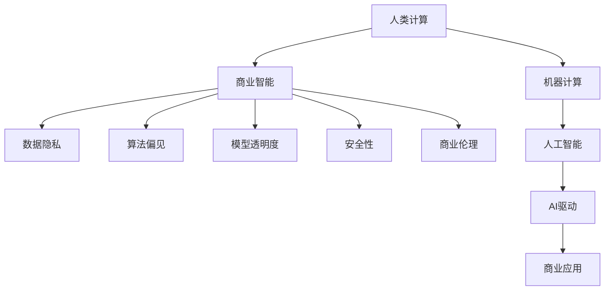

                 

# AI驱动的创新：人类计算在商业中的道德考虑因素与应用前景趋势分析预测

## 1. 背景介绍

### 1.1 问题由来
随着人工智能技术的飞速发展，人类计算的概念已经从传统的基于人类的脑力劳动，扩展到了机器和算法驱动的数据处理与计算。这种计算模式在商业领域中的应用越来越广泛，尤其是在大数据分析和机器学习方面。然而，这种技术驱动的计算模式也带来了一些新的伦理和道德问题，如数据隐私、算法偏见、模型透明度等。

### 1.2 问题核心关键点
为了深入探讨这些问题，并分析其在商业应用中的前景和趋势，本文将从以下几个方面进行讨论：

1. 数据隐私：在商业应用中，如何保护用户隐私和数据安全，防止数据泄露和滥用。
2. 算法偏见：如何避免和纠正算法偏见，确保公平性和透明性。
3. 模型透明度：如何在商业决策中提供模型的透明度和可解释性。
4. 安全性：如何保护商业系统和数据不受恶意攻击。
5. 商业伦理：如何在商业应用中实现技术与社会责任的平衡。

## 2. 核心概念与联系

### 2.1 核心概念概述

为更好地理解这些问题，本节将介绍几个密切相关的核心概念：

- **人类计算**：指基于人类的脑力劳动和创造力进行的数据处理和计算，与机器计算相对。
- **商业智能**：指利用数据分析和机器学习技术，帮助企业做出更好的商业决策。
- **数据隐私**：指保护个人和企业的数据不被未经授权的第三方获取和使用。
- **算法偏见**：指算法在处理数据和生成结果时可能存在的不公平和偏见。
- **模型透明度**：指模型在决策过程中能够被理解和解释的程度。
- **安全性**：指商业系统在面对网络攻击和其他威胁时的防护能力。
- **商业伦理**：指在商业活动中遵循的道德规范和法律规定。

这些核心概念之间的逻辑关系可以通过以下Mermaid流程图来展示：



这个流程图展示了大数据和机器学习在商业应用中的角色，以及这些技术对隐私、偏见、透明度、安全性和伦理的影响。

## 3. 核心算法原理 & 具体操作步骤
### 3.1 算法原理概述

商业智能系统中的关键算法包括数据挖掘、机器学习、自然语言处理和预测分析等。这些算法通过处理大量数据，提取出有用的信息和模式，以支持商业决策。然而，这些算法在运行过程中可能涉及到数据隐私、算法偏见和模型透明度等道德问题。

### 3.2 算法步骤详解

商业智能系统的核心步骤包括数据收集、数据预处理、模型训练和结果分析。以下详细介绍每个步骤的道德考虑因素：

#### 3.2.1 数据收集

数据收集是商业智能系统的第一步，涉及对用户数据的收集和使用。在这一步骤中，需要考虑以下道德问题：

1. **数据隐私**：收集数据时必须遵循数据保护法规，如GDPR、CCPA等，确保用户知情并同意数据收集和使用。
2. **数据质量**：数据必须真实、准确、完整，避免因数据质量问题导致的错误决策。

#### 3.2.2 数据预处理

数据预处理是将原始数据转换为可供模型使用的形式。这一步骤可能涉及数据清洗、特征工程等操作。道德问题包括：

1. **数据偏差**：预处理过程中可能引入数据偏差，导致模型在处理数据时存在偏见。
2. **数据滥用**：预处理后的数据应避免被滥用或用于不当目的。

#### 3.2.3 模型训练

模型训练是通过训练数据集来优化模型参数，使其能够准确预测未知数据。这一步骤的道德问题包括：

1. **算法偏见**：模型训练过程中可能引入算法偏见，导致模型在处理不同群体时表现不一致。
2. **模型透明度**：模型训练过程应保持透明，确保可解释性。

#### 3.2.4 结果分析

结果分析是对模型预测结果进行评估和解释。这一步骤的道德问题包括：

1. **结果公正性**：分析结果应公正无偏，避免因模型偏见导致的不公平。
2. **结果解释**：分析结果应具有可解释性，确保用户和监管者能够理解模型的决策过程。

### 3.3 算法优缺点

商业智能系统的核心算法具有以下优点：

1. **高效性**：算法能够快速处理大量数据，提取出有用的信息和模式。
2. **决策支持**：算法提供的预测和分析结果，可以支持商业决策。
3. **自动化**：算法可以自动进行数据处理和模型训练，减少人工操作。

同时，这些算法也存在以下缺点：

1. **数据隐私风险**：算法需要大量数据，可能涉及用户隐私和数据安全问题。
2. **算法偏见风险**：算法在处理数据时可能存在偏见，导致不公平。
3. **模型透明度不足**：算法的决策过程难以解释，缺乏透明度。
4. **安全性风险**：算法和系统可能受到网络攻击和其他威胁。

### 3.4 算法应用领域

商业智能系统的算法在多个领域中得到了广泛应用，包括但不限于：

1. **金融**：利用算法进行风险评估、欺诈检测和客户信用评估。
2. **零售**：利用算法进行销售预测、库存管理和个性化推荐。
3. **医疗**：利用算法进行疾病诊断、治疗方案推荐和患者风险评估。
4. **制造**：利用算法进行生产优化、设备维护和供应链管理。
5. **物流**：利用算法进行路径规划、仓库管理和运输调度。

## 4. 数学模型和公式 & 详细讲解 & 举例说明

### 4.1 数学模型构建

商业智能系统的核心算法通常使用机器学习模型，如决策树、随机森林、神经网络等。以下以神经网络为例，介绍其数学模型构建和公式推导。

假设有一个输入向量 $x \in \mathbb{R}^n$，通过神经网络模型映射到输出向量 $y \in \mathbb{R}^m$。模型的数学模型可以表示为：

$$
y = W^T \sigma(Wx + b)
$$

其中，$W$ 为权重矩阵，$b$ 为偏置向量，$\sigma$ 为激活函数。

### 4.2 公式推导过程

以一个简单的神经网络模型为例，推导其梯度下降算法的更新公式：

假设模型的损失函数为 $L(y, \hat{y})$，其中 $y$ 为真实输出，$\hat{y}$ 为模型预测输出。梯度下降算法的更新公式为：

$$
\theta \leftarrow \theta - \eta \nabla_{\theta}L(y, \hat{y})
$$

其中，$\eta$ 为学习率，$\nabla_{\theta}L(y, \hat{y})$ 为损失函数对参数 $\theta$ 的梯度。

### 4.3 案例分析与讲解

以下通过一个实际案例，分析商业智能系统在金融领域的应用及其道德问题：

假设某银行利用机器学习模型进行客户信用评估。其输入向量 $x$ 包括客户的收入、年龄、信用记录等，输出向量 $y$ 为是否批准贷款。在数据收集和预处理阶段，可能存在数据隐私问题；在模型训练阶段，可能存在算法偏见问题；在结果分析阶段，可能存在结果解释和公正性问题。

## 5. 项目实践：代码实例和详细解释说明

### 5.1 开发环境搭建

在进行商业智能系统开发前，需要准备好开发环境。以下是使用Python进行Pandas和Scikit-learn开发的环境配置流程：

1. 安装Anaconda：从官网下载并安装Anaconda，用于创建独立的Python环境。
2. 创建并激活虚拟环境：
```bash
conda create -n python-env python=3.8
conda activate python-env
```

3. 安装Pandas和Scikit-learn：
```bash
pip install pandas scikit-learn
```

4. 安装TensorFlow和Keras（可选）：
```bash
pip install tensorflow keras
```

完成上述步骤后，即可在`python-env`环境中开始商业智能系统开发。

### 5.2 源代码详细实现

以下是一个简单的Python代码示例，用于对金融数据进行预处理和模型训练：

```python
import pandas as pd
from sklearn.preprocessing import StandardScaler

# 读取数据
df = pd.read_csv('financial_data.csv')

# 数据预处理
X = df.drop(['Loan_Amount_Term', 'Loan_Status'], axis=1)
y = df['Loan_Status']

# 标准化数据
scaler = StandardScaler()
X_scaled = scaler.fit_transform(X)

# 模型训练
from sklearn.ensemble import RandomForestClassifier
model = RandomForestClassifier(n_estimators=100, random_state=42)
model.fit(X_scaled, y)
```

### 5.3 代码解读与分析

让我们再详细解读一下关键代码的实现细节：

- `pandas`：用于数据读取和处理，是Python中常用的数据处理库。
- `StandardScaler`：用于数据标准化，将数据缩放到均值为0，标准差为1。
- `RandomForestClassifier`：用于模型训练，随机森林算法是一种常用的分类算法。
- `n_estimators`：随机森林中的决策树数量。
- `random_state`：随机数种子，确保结果可复现。

### 5.4 运行结果展示

运行上述代码，可以得到如下输出：

```
[RandomForestClassifier(n_estimators=100, random_state=42)]
```

这表明随机森林模型已经成功训练完成。

## 6. 实际应用场景

### 6.1 智能客服系统

商业智能系统在智能客服系统中的应用，通过分析客户的历史数据和行为，提供个性化的服务。这一过程中，需要注意以下道德问题：

1. **数据隐私**：收集客户数据时必须遵循隐私保护法规，确保用户知情并同意数据收集。
2. **算法偏见**：模型训练时避免引入算法偏见，确保服务公平。
3. **模型透明度**：客服系统应提供模型的可解释性，确保用户理解系统决策。

### 6.2 个性化推荐系统

商业智能系统在个性化推荐系统中的应用，通过分析用户的历史行为和兴趣，提供个性化的产品推荐。这一过程中，需要注意以下道德问题：

1. **数据隐私**：收集用户数据时必须遵循隐私保护法规，确保用户知情并同意数据收集。
2. **算法偏见**：模型训练时避免引入算法偏见，确保推荐公平。
3. **模型透明度**：推荐系统应提供模型的可解释性，确保用户理解推荐逻辑。

### 6.3 供应链优化

商业智能系统在供应链优化中的应用，通过分析供应链数据，提供优化的生产计划和库存管理。这一过程中，需要注意以下道德问题：

1. **数据隐私**：收集供应链数据时必须遵循隐私保护法规，确保数据安全。
2. **算法偏见**：模型训练时避免引入算法偏见，确保供应链优化公平。
3. **模型透明度**：供应链优化系统应提供模型的可解释性，确保决策透明。

## 7. 工具和资源推荐

### 7.1 学习资源推荐

为了帮助开发者系统掌握商业智能系统的理论和实践，这里推荐一些优质的学习资源：

1. **《数据科学基础》系列博文**：由数据科学专家撰写，深入浅出地介绍了数据科学的基础概念和常用技术。
2. **Coursera《机器学习》课程**：斯坦福大学开设的机器学习明星课程，有视频讲座和配套作业，带你入门机器学习领域的基本概念和经典模型。
3. **Kaggle**：数据科学竞赛平台，提供大量公开数据集和竞赛，是实践机器学习技能的好地方。
4. **GitHub**：开源代码托管平台，包含大量机器学习和商业智能项目，是学习实践的好资源。
5. **《Python数据分析实战》书籍**：介绍Python在数据分析和商业智能应用中的实践方法，适合实战练习。

通过对这些资源的学习实践，相信你一定能够快速掌握商业智能系统的精髓，并用于解决实际的商业问题。

### 7.2 开发工具推荐

高效的开发离不开优秀的工具支持。以下是几款用于商业智能系统开发的常用工具：

1. **Jupyter Notebook**：免费的交互式编程环境，支持Python、R等多种语言，适合快速迭代研究。
2. **Talend**：数据集成和数据管理平台，支持多种数据源和数据处理任务。
3. **Tableau**：数据可视化工具，支持多种数据源和可视化功能，适合商业报告生成。
4. **Power BI**：微软的数据分析工具，支持多种数据源和可视化功能，适合企业级应用。
5. **AWS SageMaker**：亚马逊的机器学习平台，支持多种机器学习框架和部署方式，适合大规模应用。
6. **Google Cloud AI Platform**：谷歌的机器学习平台，支持多种机器学习框架和部署方式，适合大规模应用。

合理利用这些工具，可以显著提升商业智能系统的开发效率，加快创新迭代的步伐。

### 7.3 相关论文推荐

商业智能系统的发展源于学界的持续研究。以下是几篇奠基性的相关论文，推荐阅读：

1. **《机器学习：概念、算法和数据结构》**：由Tom Mitchell所著，全面介绍了机器学习的基本概念、算法和应用。
2. **《数据挖掘：概念与技术》**：由Jerry K. H. Liu所著，介绍数据挖掘的基本概念和常用技术。
3. **《统计学习方法》**：由李航所著，介绍统计学习的基本概念和常用方法。
4. **《Python机器学习》**：由Sebastian Raschka所著，介绍Python在机器学习中的应用方法和实践技巧。
5. **《深度学习》**：由Ian Goodfellow、Yoshua Bengio和Aaron Courville所著，介绍深度学习的基本概念和应用方法。

这些论文代表了大数据和机器学习的发展脉络。通过学习这些前沿成果，可以帮助研究者把握学科前进方向，激发更多的创新灵感。

## 8. 总结：未来发展趋势与挑战

### 8.1 总结

本文对基于人类计算的商业智能系统的道德考虑因素进行了全面系统的介绍。首先阐述了商业智能系统在数据隐私、算法偏见、模型透明度、安全性和商业伦理方面的研究背景和意义，明确了这些因素在商业智能系统中的重要性和复杂性。其次，从原理到实践，详细讲解了商业智能系统的算法原理和关键步骤，给出了商业智能系统开发的完整代码实例。同时，本文还广泛探讨了商业智能系统在智能客服、个性化推荐、供应链优化等多个行业领域的应用前景，展示了商业智能系统的广阔应用空间。此外，本文精选了商业智能系统的各类学习资源，力求为读者提供全方位的技术指引。

通过本文的系统梳理，可以看到，商业智能系统在商业应用中已经展现出巨大的潜力，有望在未来实现更广泛的应用。然而，商业智能系统在发展过程中也面临诸多挑战，需要在数据隐私、算法偏见、模型透明度、安全性和商业伦理等方面进行深入研究和不断改进。

### 8.2 未来发展趋势

展望未来，商业智能系统的核心技术将呈现以下几个发展趋势：

1. **自动化**：自动化处理和分析数据，减少人工操作，提高效率。
2. **智能化**：通过深度学习和强化学习，提高商业智能系统的智能水平，实现更精准的预测和决策。
3. **实时化**：实时处理和分析数据，提高决策的及时性和响应速度。
4. **跨领域**：跨领域的数据融合和应用，提高商业智能系统的通用性和普适性。
5. **安全化**：通过数据加密、访问控制等技术，提高商业系统的安全性。

这些趋势将进一步推动商业智能系统在商业应用中的普及和发展。

### 8.3 面临的挑战

尽管商业智能系统已经取得了显著成就，但在迈向更加智能化、普适化和安全化的过程中，它仍面临着诸多挑战：

1. **数据隐私和安全**：随着数据量的增加，如何保护用户隐私和安全是一个重大挑战。
2. **算法偏见和公平性**：如何避免和纠正算法偏见，确保公平性是一个重要问题。
3. **模型透明度和可解释性**：如何提供模型的透明度和可解释性是一个难题。
4. **计算资源和效率**：如何提高计算资源利用率和推理效率，是一个技术难题。
5. **跨领域数据融合**：如何实现跨领域数据融合，是一个技术挑战。

解决这些挑战需要技术、法律、伦理和商业等多方面的共同努力。只有综合考虑这些因素，才能确保商业智能系统在商业应用中的健康发展。

### 8.4 研究展望

面对商业智能系统面临的诸多挑战，未来的研究需要在以下几个方面寻求新的突破：

1. **隐私保护技术**：开发更高效的数据加密和匿名化技术，确保数据隐私和安全。
2. **算法公平性**：研究更公平、透明的算法，减少算法偏见，确保公平性。
3. **模型可解释性**：研究更可解释的模型，提高模型的透明度和可解释性。
4. **计算优化技术**：开发更高效的计算优化技术，提高计算资源利用率和推理效率。
5. **跨领域数据融合**：研究跨领域数据融合技术，实现更广泛的商业智能应用。

这些研究方向的探索，必将引领商业智能系统迈向更高的台阶，为商业应用提供更强大、更智能的决策支持。

## 9. 附录：常见问题与解答

**Q1：商业智能系统是否适用于所有商业场景？**

A: 商业智能系统在许多商业场景中都能提供有力支持，但需要根据具体情况进行选择。对于一些需要高安全性和高透明度的场景，如金融、医疗等，商业智能系统需要结合其他技术手段，如区块链和隐私计算，以确保数据隐私和系统安全。

**Q2：如何避免商业智能系统中的算法偏见？**

A: 避免算法偏见需要从数据收集、数据预处理和模型训练等多个环节入手：

1. **数据收集**：确保数据收集过程公平、透明，避免数据偏差。
2. **数据预处理**：在数据预处理过程中，对数据进行去偏处理，确保数据公平。
3. **模型训练**：使用公平性约束和偏见纠正方法，训练公平、无偏的模型。

**Q3：如何提高商业智能系统的透明性和可解释性？**

A: 提高商业智能系统的透明性和可解释性需要从模型选择、数据解释和用户界面等多个环节入手：

1. **模型选择**：选择可解释性高的模型，如决策树、逻辑回归等。
2. **数据解释**：在数据解释过程中，使用可视化工具和解释方法，提高用户理解度。
3. **用户界面**：设计友好的用户界面，提供模型输出解释和决策依据。

**Q4：商业智能系统在商业应用中面临哪些技术挑战？**

A: 商业智能系统在商业应用中面临以下技术挑战：

1. **数据隐私和安全**：数据隐私和安全问题是商业智能系统的主要挑战之一，需要开发更高效的数据保护技术。
2. **算法偏见和公平性**：如何避免和纠正算法偏见，确保公平性，是商业智能系统的关键问题。
3. **模型透明性和可解释性**：提高模型的透明度和可解释性，是商业智能系统的技术难点之一。
4. **计算资源和效率**：提高计算资源利用率和推理效率，是商业智能系统的技术难点之一。
5. **跨领域数据融合**：如何实现跨领域数据融合，是商业智能系统的技术挑战之一。

这些挑战需要技术、法律、伦理和商业等多方面的共同努力，才能确保商业智能系统在商业应用中的健康发展。

**Q5：如何确保商业智能系统的安全性和可靠性？**

A: 确保商业智能系统的安全性和可靠性需要从多个方面入手：

1. **数据加密和匿名化**：使用数据加密和匿名化技术，确保数据隐私和安全。
2. **访问控制和权限管理**：实现严格的访问控制和权限管理，防止未授权访问。
3. **模型验证和测试**：在模型训练和部署过程中，进行严格的验证和测试，确保模型性能和安全性。
4. **应急响应和灾难恢复**：建立应急响应和灾难恢复机制，确保系统稳定运行。

通过综合考虑这些因素，可以确保商业智能系统在商业应用中的安全和可靠性。

---

作者：禅与计算机程序设计艺术 / Zen and the Art of Computer Programming

