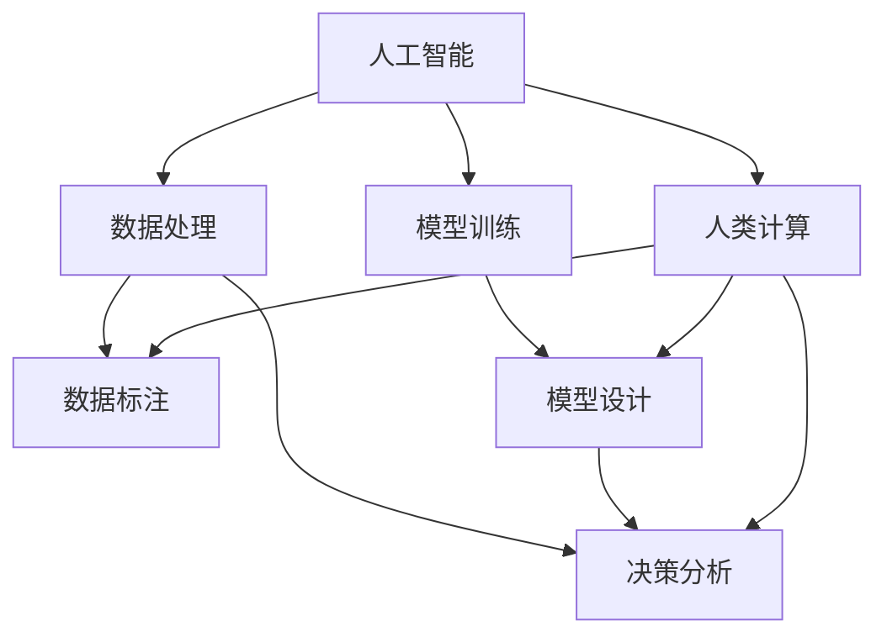

                 

# AI驱动的创新：人类计算在商业中的道德考虑因素与应用趋势

> 关键词：人工智能, 人类计算, 商业伦理, 道德考虑, 应用趋势

## 1. 背景介绍

### 1.1 问题由来
随着人工智能（AI）技术的飞速发展，人类计算在商业应用中的作用越来越受到重视。利用AI进行数据分析、决策支持、客户服务等任务，不仅能大幅提高商业效率，还能带来全新的商业模式和增长动力。然而，AI的广泛应用也带来了许多新的道德和伦理问题。如何在技术创新和商业发展的同时，坚守道德底线，保护用户权益，成为摆在所有AI从业者面前的重要课题。本文将从多个角度探讨这些问题，并提出一些解决思路，为AI技术在商业应用中的道德考虑和应用趋势提供参考。

### 1.2 问题核心关键点
本节的关键词包括：
1. 人工智能（AI）：指利用计算机算法和数据处理技术模拟人类智能的技术，包括机器学习、深度学习等。
2. 人类计算：指利用人类大脑的智慧和经验，辅助计算机进行复杂决策和创新。
3. 商业伦理：指在商业活动中遵循的道德规范和行为准则，包括数据隐私、决策透明度、公平性等。
4. 道德考虑：指在进行技术创新和商业决策时，必须考虑的道德和伦理问题。
5. 应用趋势：指AI技术在商业应用中的发展方向和趋势，包括技术进步、市场需求、政策法规等。

这些关键词共同构成了本文的研究框架，旨在探讨AI技术在商业应用中如何平衡技术进步和道德伦理，以及未来可能的发展趋势。

## 2. 核心概念与联系

### 2.1 核心概念概述

AI技术的发展离不开人类计算的支持。人类计算不仅包括在数据收集、清洗、标注等基础环节中的贡献，还包括在模型设计、参数调优、业务分析等高级环节中的深度参与。AI和人类计算的结合，使得商业应用能够更加灵活、智能、高效。然而，随着AI技术的广泛应用，一些道德和伦理问题也开始显现。例如，数据隐私保护、算法偏见、决策透明度等，这些问题如果处理不当，将对用户和社会造成严重后果。

### 2.2 核心概念原理和架构的 Mermaid 流程图



这个流程图展示了AI和人类计算之间的关系：
1. 人工智能利用数据处理和模型训练，从原始数据中提取特征，训练出能够进行各种商业决策的模型。
2. 人类计算在数据标注、模型设计和决策分析中起着关键作用，帮助AI更好地理解和应用人类的智慧和经验。
3. 数据处理和模型训练环节中，需要大量的人类计算进行数据标注和模型优化，确保模型在实际应用中能够获得最优性能。
4. 决策分析环节中，人类计算通过理解和解释AI的输出结果，辅助商业决策，确保决策的透明性和公平性。

## 3. 核心算法原理 & 具体操作步骤

### 3.1 算法原理概述

AI驱动的商业创新，依赖于两大核心算法：机器学习和深度学习。机器学习通过数据训练模型，从中学习规律和模式；深度学习通过多层神经网络，学习更加复杂和非线性的特征表示。这些算法在商业应用中，可以用于用户画像分析、需求预测、个性化推荐、风险控制等任务，显著提升商业效率和决策质量。

### 3.2 算法步骤详解

#### 3.2.1 数据准备

1. 数据收集：收集与商业任务相关的数据，包括用户行为数据、交易数据、市场数据等。
2. 数据清洗：去除重复、缺失、异常等数据，确保数据质量。
3. 数据标注：对数据进行标注，为模型训练提供标签。

#### 3.2.2 模型训练

1. 选择合适的算法：根据商业任务的特点，选择合适的机器学习或深度学习算法。
2. 数据分割：将数据集划分为训练集、验证集和测试集，确保模型在未知数据上的泛化能力。
3. 模型训练：使用训练集数据，通过反向传播算法优化模型参数，最小化损失函数。

#### 3.2.3 模型评估和部署

1. 模型评估：在验证集上评估模型性能，调整模型参数，优化模型。
2. 模型部署：将训练好的模型部署到实际应用中，进行实时分析和决策。

### 3.3 算法优缺点

#### 3.3.1 优点

1. 提升决策效率：AI技术可以自动处理大量数据，进行快速分析和决策，提高商业效率。
2. 增强决策质量：AI技术能够从海量数据中提取有价值的信息，提供更加精确的预测和建议。
3. 拓展业务范围：AI技术可以应用于多种商业场景，开拓新的业务领域。

#### 3.3.2 缺点

1. 数据隐私风险：AI技术需要大量数据进行训练，数据隐私保护成为一大挑战。
2. 算法偏见问题：AI模型可能会继承数据中的偏见，导致不公平的决策。
3. 透明度问题：AI模型的决策过程难以解释，缺乏透明性。

### 3.4 算法应用领域

AI技术在商业应用中的主要领域包括但不限于：
1. 市场营销：通过分析用户行为数据，进行精准营销和广告投放。
2. 供应链管理：利用AI进行需求预测、库存优化、物流规划等，提高供应链效率。
3. 客户服务：利用AI进行客户需求分析、服务推荐、智能客服等，提升客户满意度。
4. 金融风控：通过AI进行信用评估、欺诈检测、投资分析等，降低金融风险。
5. 健康医疗：利用AI进行疾病诊断、治疗方案推荐、药物研发等，提高医疗水平。

## 4. 数学模型和公式 & 详细讲解 & 举例说明

### 4.1 数学模型构建

在商业应用中，常用的数学模型包括线性回归、逻辑回归、决策树、随机森林、神经网络等。以线性回归模型为例，其数学模型为：

$$
y = \theta_0 + \theta_1 x_1 + \theta_2 x_2 + \ldots + \theta_n x_n
$$

其中 $y$ 为输出变量，$x_1, x_2, \ldots, x_n$ 为输入变量，$\theta_0, \theta_1, \theta_2, \ldots, \theta_n$ 为模型参数。通过最小化损失函数，使用梯度下降算法更新模型参数，即可得到最优的线性回归模型。

### 4.2 公式推导过程

以线性回归为例，最小化均方误差损失函数的推导过程如下：

设训练集为 $D=\{(x_i, y_i)\}_{i=1}^N$，其中 $x_i = [x_{i1}, x_{i2}, \ldots, x_{in}]^T$，$y_i$ 为标签。均方误差损失函数为：

$$
L(\theta) = \frac{1}{2N}\sum_{i=1}^N (y_i - \hat{y}_i)^2
$$

其中 $\hat{y}_i = \theta_0 + \theta_1 x_{i1} + \theta_2 x_{i2} + \ldots + \theta_n x_{in}$。

通过求偏导数，可得：

$$
\frac{\partial L(\theta)}{\partial \theta_k} = \frac{1}{N}\sum_{i=1}^N (y_i - \hat{y}_i)x_{ik}
$$

利用梯度下降算法，更新模型参数 $\theta$ 的公式为：

$$
\theta \leftarrow \theta - \alpha \frac{\partial L(\theta)}{\partial \theta}
$$

其中 $\alpha$ 为学习率。

### 4.3 案例分析与讲解

以一家电商平台为例，利用AI技术进行需求预测。平台收集了用户历史购买数据、浏览数据、搜索数据等，构建了特征向量 $x$，并将其输入线性回归模型进行训练。训练好的模型可以预测用户未来的购买需求，从而进行库存优化和个性化推荐。

## 5. 项目实践：代码实例和详细解释说明

### 5.1 开发环境搭建

要实现AI驱动的商业应用，首先需要搭建好开发环境。以下是一些推荐的开发环境：

1. Python 3.x：选择 Python 3.x 作为编程语言，因为其有丰富的科学计算和机器学习库。
2. Jupyter Notebook：一款交互式笔记本，适合进行数据分析和模型训练。
3. TensorFlow 或 PyTorch：选择 TensorFlow 或 PyTorch 作为深度学习框架，因为它们有强大的计算图和优化算法。
4. Scikit-Learn：一个Python机器学习库，适合进行简单机器学习任务的实现。
5. Keras：一个高级深度学习库，提供了简单易用的API，适合快速实现深度学习模型。

### 5.2 源代码详细实现

以下是一个简单的线性回归模型的实现代码：

```python
import numpy as np
from sklearn.linear_model import LinearRegression

# 构建训练数据
x = np.array([[1, 2, 3], [4, 5, 6], [7, 8, 9]])
y = np.array([2, 4, 6])

# 构建线性回归模型
model = LinearRegression()

# 训练模型
model.fit(x, y)

# 预测新的数据
new_x = np.array([[10, 11, 12]])
predictions = model.predict(new_x)

print(predictions)
```

### 5.3 代码解读与分析

在上述代码中，我们使用了Scikit-Learn库中的LinearRegression模型，用于构建线性回归模型。首先，我们构建了训练数据集 $x$ 和标签 $y$，然后通过调用 `model.fit(x, y)` 方法训练模型。接着，我们使用 `model.predict(new_x)` 方法对新的数据进行预测，最终输出预测结果。

## 6. 实际应用场景

### 6.1 智能客服

智能客服是AI技术在商业应用中的一个典型场景。通过AI驱动的智能客服系统，企业可以提供7x24小时的客户服务，提升客户满意度。智能客服系统可以自动处理客户的常见问题，进行智能解答，还可以根据客户的历史行为数据进行个性化推荐，提高客户体验。

### 6.2 精准营销

精准营销是利用AI技术进行用户画像分析，实现个性化广告投放的商业应用。企业可以通过AI技术分析用户的浏览、购买、搜索行为，构建用户画像，进行精准营销。例如，某电商企业通过AI分析用户的历史购买数据和浏览数据，为其推荐个性化的商品广告，从而提高转化率和销售额。

### 6.3 供应链优化

供应链优化是利用AI技术进行需求预测、库存管理和物流规划的商业应用。企业可以通过AI技术分析历史销售数据和市场趋势，进行需求预测，优化库存管理。例如，某零售企业通过AI技术预测未来一个月的销售量，优化库存水平，降低库存成本。

### 6.4 未来应用展望

未来，AI技术在商业应用中的发展将呈现以下几个趋势：

1. 更加智能化：AI技术将更加智能化，能够处理更加复杂和多样化的商业场景。
2. 更加个性化：AI技术将更加个性化，能够提供更加精准和定制化的服务。
3. 更加透明化：AI技术的决策过程将更加透明化，用户可以理解和信任AI的输出结果。
4. 更加安全化：AI技术将更加安全化，能够保护数据隐私和用户权益。
5. 更加规范化：AI技术的开发和应用将更加规范化，遵循相关的法律法规和道德准则。

## 7. 工具和资源推荐

### 7.1 学习资源推荐

1. 《深度学习》书籍：由 Ian Goodfellow、Yoshua Bengio 和 Aaron Courville 合著，全面介绍了深度学习的原理和应用。
2. 《机器学习实战》书籍：由 Peter Harrington 合著，适合初学者入门机器学习。
3. Coursera 和 Udacity 等在线课程：提供从入门到高级的机器学习和深度学习课程。
4. Kaggle：一个数据科学竞赛平台，提供大量的数据集和竞赛项目，适合练习和实践。
5. GitHub：一个代码托管平台，提供大量的开源机器学习和深度学习项目，适合学习和参考。

### 7.2 开发工具推荐

1. Jupyter Notebook：一款交互式笔记本，适合进行数据分析和模型训练。
2. TensorFlow 和 PyTorch：两个深度学习框架，适合进行深度学习模型的开发和训练。
3. Scikit-Learn：一个Python机器学习库，适合进行简单机器学习任务的实现。
4. Keras：一个高级深度学习库，提供了简单易用的API，适合快速实现深度学习模型。
5. Azure ML 和 Google Cloud AI：两个云端AI平台，提供自动化的模型训练和部署服务。

### 7.3 相关论文推荐

1. "Deep Learning" by Ian Goodfellow, Yoshua Bengio, and Aaron Courville。
2. "Convolutional Neural Networks for Visual Recognition" by Alex Krizhevsky, Ilya Sutskever, and Geoffrey Hinton.
3. "Natural Language Processing with Transformers" by Jacob Devlin, Ming-Wei Chang, Kenton Lee, and Kristina Toutanova。
4. "An Introduction to Support Vector Machines" by Christopher M. Bishop。
5. "Adversarial Machine Learning" by Nicholas Carlini and David Wagner。

## 8. 总结：未来发展趋势与挑战

### 8.1 研究成果总结

本文从AI驱动的商业创新角度，探讨了人类计算在商业应用中的道德考虑因素。AI技术的广泛应用，不仅提升了商业效率和决策质量，但也带来了数据隐私、算法偏见、决策透明度等道德和伦理问题。如何在技术创新和商业发展的同时，坚守道德底线，保护用户权益，是AI从业者面临的重要课题。

### 8.2 未来发展趋势

未来，AI技术在商业应用中的发展将呈现以下几个趋势：
1. 更加智能化：AI技术将更加智能化，能够处理更加复杂和多样化的商业场景。
2. 更加个性化：AI技术将更加个性化，能够提供更加精准和定制化的服务。
3. 更加透明化：AI技术的决策过程将更加透明化，用户可以理解和信任AI的输出结果。
4. 更加安全化：AI技术将更加安全化，能够保护数据隐私和用户权益。
5. 更加规范化：AI技术的开发和应用将更加规范化，遵循相关的法律法规和道德准则。

### 8.3 面临的挑战

尽管AI技术在商业应用中取得了显著进展，但也面临着以下挑战：
1. 数据隐私保护：AI技术需要大量数据进行训练，如何保护数据隐私和用户权益成为一大挑战。
2. 算法偏见问题：AI模型可能会继承数据中的偏见，导致不公平的决策。
3. 决策透明度：AI技术的决策过程难以解释，缺乏透明性。
4. 安全性和可靠性：AI技术的安全性和可靠性问题，如对抗攻击、模型鲁棒性等，仍需进一步提升。
5. 法律法规和伦理准则：AI技术的开发和应用需要遵循相关的法律法规和伦理准则，避免法律风险和道德问题。

### 8.4 研究展望

未来，AI技术在商业应用中还需要在以下几个方面进行深入研究：
1. 数据隐私保护技术：研究和开发更加有效的数据隐私保护技术，如差分隐私、联邦学习等，保护用户隐私。
2. 算法公平性技术：研究和开发更加公平、无偏的AI算法，消除数据中的偏见，提升模型公平性。
3. 决策透明化技术：研究和开发更加透明的AI决策过程，增强模型的可解释性。
4. 安全性技术：研究和开发更加安全的AI技术，如对抗训练、鲁棒性优化等，提高系统的安全性。
5. 法律法规和伦理准则：研究和制定相关的法律法规和伦理准则，规范AI技术在商业应用中的行为。

## 9. 附录：常见问题与解答

### 9.1 常见问题解答

#### Q1：AI在商业应用中面临的主要道德和伦理问题有哪些？

A1：AI在商业应用中面临的主要道德和伦理问题包括：
1. 数据隐私保护：如何保护用户数据的隐私，避免数据泄露和滥用。
2. 算法偏见问题：如何避免算法偏见，确保公平性。
3. 决策透明度：如何增强AI决策过程的透明度，让用户理解模型的输出。
4. 安全性：如何保证AI系统的安全性，避免对抗攻击和系统崩溃。
5. 法律法规和伦理准则：如何遵循相关的法律法规和伦理准则，避免法律风险和道德问题。

#### Q2：如何保护用户数据隐私？

A2：保护用户数据隐私的常见方法包括：
1. 数据匿名化：通过去标识化、假名化等方法，保护用户数据的隐私。
2. 差分隐私：使用差分隐私技术，确保单个数据点的泄露对整体数据分布的影响最小。
3. 联邦学习：通过在本地设备上进行模型训练，避免数据集中存储和泄露。

#### Q3：如何避免AI算法的偏见？

A3：避免AI算法偏见的方法包括：
1. 数据清洗：清洗数据集，去除带有偏见的数据，确保数据集的多样性和公平性。
2. 模型优化：使用公平性约束，优化模型参数，消除算法偏见。
3. 多样性增强：引入多样性数据和公平性约束，提升模型的泛化能力。

#### Q4：如何增强AI决策过程的透明度？

A4：增强AI决策过程透明度的常见方法包括：
1. 可解释性模型：使用可解释性模型，如决策树、线性回归等，增强模型的可解释性。
2. 模型可视化：使用模型可视化技术，如特征重要性分析、决策路径可视化等，增强模型的可解释性。
3. 用户反馈：引入用户反馈机制，通过用户反馈和反馈机制，增强模型的可解释性和透明度。

#### Q5：如何保证AI系统的安全性？

A5：保证AI系统安全性的常见方法包括：
1. 对抗训练：使用对抗训练技术，增强模型的鲁棒性和安全性。
2. 鲁棒性优化：使用鲁棒性优化技术，提升模型的鲁棒性和安全性。
3. 安全监控：使用安全监控技术，实时监测模型的安全性和鲁棒性。

#### Q6：如何遵循相关的法律法规和伦理准则？

A6：遵循相关法律法规和伦理准则的常见方法包括：
1. 法律法规遵循：确保AI系统的开发和应用遵循相关的法律法规和伦理准则。
2. 伦理审查：在AI系统的开发和应用过程中，进行伦理审查，确保AI系统的公平性和公正性。
3. 用户权益保护：在AI系统的开发和应用过程中，保护用户权益，确保用户数据的隐私和安全。

综上所述，AI技术在商业应用中需要平衡技术创新和道德伦理，保护用户权益，确保AI系统的安全性、透明性和公平性，遵循相关的法律法规和伦理准则。只有这样，AI技术才能在商业应用中发挥更大的价值，推动商业创新和社会进步。

---

作者：禅与计算机程序设计艺术 / Zen and the Art of Computer Programming

