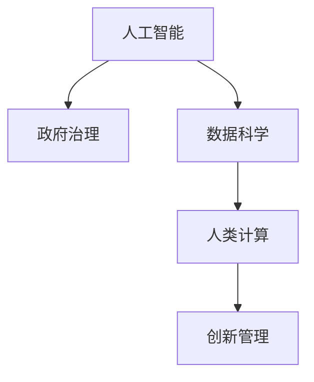

                 

# AI驱动的创新：人类计算在政府治理中的作用

> 关键词：人工智能,政府治理,人类计算,数据科学,创新管理

## 1. 背景介绍

在过去几十年里，全球政府机构逐步意识到数字技术的革命性作用，并积极推进信息技术在政府治理中的应用。随着大数据、云计算和人工智能技术的快速发展，政府机构在公共服务、政策制定、应急管理、环境保护等各个方面，都得到了前所未有的改进和创新。特别是人工智能（AI）技术，通过模拟人类的计算和决策过程，赋予了政府治理新的生命力。

AI技术在政府治理中的应用，不仅提升了决策的准确性和效率，还显著改善了公共服务的质量和覆盖面，优化了社会资源的分配，并推动了政府透明度的提升。然而，尽管AI技术带来了诸多好处，但在应用过程中也面临一系列挑战，如数据隐私、算法透明性、伦理道德等问题。

## 2. 核心概念与联系

### 2.1 核心概念概述

- **人工智能（AI）**：AI是一类技术，其核心是通过算法模拟人类的学习和推理能力，从而使计算机系统能够执行复杂的决策和任务。

- **政府治理**：政府治理是指政府机构为了实现公共利益，通过政策制定、执行、监督等活动，管理社会公共事务的过程。

- **数据科学**：数据科学是涉及数据采集、处理、分析和可视化的多学科领域，旨在通过数据洞察推动决策科学化。

- **人类计算**：人类计算是一种借鉴人类思维方式的计算模式，强调利用人类的逻辑推理、直觉判断和创造性思维来辅助或替代计算机算法。

- **创新管理**：创新管理是指通过系统的工具和方法，指导组织进行新技术和新产品的开发、商业化，以及创新文化的构建和维护。

这些概念之间的联系，可以通过以下Mermaid流程图来展示：



这个流程图展示了AI、数据科学、人类计算和创新管理如何相互交织，共同推动政府治理的创新与发展。

## 3. 核心算法原理 & 具体操作步骤
### 3.1 算法原理概述

基于AI的政府治理，其核心在于利用AI技术提升政府决策和公共服务的质量。具体而言，AI技术通过以下几种方式实现了对政府治理的赋能：

- **预测分析**：通过历史数据训练AI模型，预测未来趋势和事件，辅助政府制定政策。
- **自动化决策**：使用AI算法自动化处理日常事务，提高工作效率。
- **智能监管**：利用AI进行数据监控和风险评估，优化资源配置。
- **公共服务**：利用自然语言处理（NLP）等AI技术，提升公共服务的响应速度和质量。

### 3.2 算法步骤详解

AI在政府治理中的具体应用，通常包括以下几个步骤：

1. **需求分析**：根据实际需求，明确AI技术在特定场景中的应用目标和预期效果。
2. **数据采集**：收集相关的历史数据和实时数据，为AI模型训练和应用提供基础。
3. **模型训练**：使用机器学习算法对数据进行建模和训练，构建AI模型。
4. **模型部署**：将训练好的模型部署到生产环境，实现对实际问题的解决。
5. **持续优化**：根据实际应用效果，持续优化和调整模型，确保其长期有效性。

### 3.3 算法优缺点

AI在政府治理中的应用，具有以下优点：

- **效率提升**：自动化和智能化的决策过程，提高了政府工作的效率。
- **决策支持**：AI提供的分析报告和预测结果，为政府决策提供了有力的支持。
- **服务改进**：通过AI优化公共服务流程，提升公众满意度。

同时，也存在以下缺点：

- **数据隐私**：大规模数据采集和处理可能引发隐私泄露问题。
- **算法透明度**：AI决策过程的复杂性，使得其结果难以解释。
- **伦理道德**：AI在决策中可能存在偏见，需要额外审查和规范。
- **技术门槛**：AI技术的应用需要专业的技术支持和维护。

### 3.4 算法应用领域

AI在政府治理中的应用，已覆盖以下主要领域：

- **公共安全**：通过AI进行视频监控、异常检测等，提升社会治安水平。
- **交通管理**：利用AI优化交通流量，减少拥堵，提高交通安全。
- **环境监测**：使用AI进行空气质量、水质等监测，提供决策支持。
- **医疗健康**：AI在疾病预测、诊疗建议等方面，辅助公共卫生决策。
- **教育服务**：通过AI提供个性化学习方案，提升教育质量。

## 4. 数学模型和公式 & 详细讲解  
### 4.1 数学模型构建

AI在政府治理中的应用，通常涉及复杂的数学模型和算法。以下是几个常见的模型和算法：

- **回归模型**：用于预测连续变量，如交通流量、空气质量等。
- **分类模型**：用于分类问题，如垃圾分类、疾病诊断等。
- **聚类算法**：用于数据分组和分析，如客户细分、区域划分等。
- **优化算法**：用于资源配置和调度，如交通网络优化、应急资源分配等。

### 4.2 公式推导过程

以回归模型为例，其基本公式为：

$$ y = \beta_0 + \beta_1x_1 + \beta_2x_2 + ... + \beta_nx_n + \epsilon $$

其中，$y$ 为预测值，$\beta$ 为模型参数，$x_i$ 为自变量，$\epsilon$ 为随机误差项。

### 4.3 案例分析与讲解

一个实际案例是使用AI进行交通流量预测。通过收集历史交通数据，训练回归模型，可以得到未来的交通流量预测结果。具体步骤如下：

1. 收集交通流量历史数据，如时间、天气、道路类型等。
2. 使用回归算法，如线性回归、随机森林等，构建预测模型。
3. 将模型应用到实时数据，预测未来交通流量。
4. 根据预测结果，调整交通信号灯控制策略，优化交通流量。

## 5. 项目实践：代码实例和详细解释说明
### 5.1 开发环境搭建

要进行AI在政府治理中的应用开发，需要先搭建好开发环境。以下是主要步骤：

1. **选择编程语言和框架**：如Python，并使用TensorFlow、PyTorch等深度学习框架。
2. **安装必要的库和工具**：如NumPy、Pandas、Scikit-learn等数据处理库。
3. **配置数据存储和处理环境**：如使用Hadoop、Spark等大数据处理平台。
4. **搭建云服务环境**：如AWS、Google Cloud等，提供计算资源和存储空间。

### 5.2 源代码详细实现

以下是一个简单的交通流量预测的Python代码实现：

```python
import pandas as pd
from sklearn.linear_model import LinearRegression
from sklearn.metrics import mean_squared_error

# 读取交通流量数据
data = pd.read_csv('traffic_flow.csv')

# 选择自变量和因变量
X = data[['hour', 'weather', 'road_type']]
y = data['flow']

# 训练线性回归模型
model = LinearRegression()
model.fit(X, y)

# 预测未来流量
future_data = pd.DataFrame({
    'hour': [23, 0, 1],
    'weather': ['rain', 'sunny', 'sunny'],
    'road_type': ['highway', 'city_street', 'city_street']
})
future_X = future_data[['hour', 'weather', 'road_type']]
prediction = model.predict(future_X)

# 评估模型效果
mse = mean_squared_error(y, prediction)
print('Mean Squared Error:', mse)
```

### 5.3 代码解读与分析

上述代码主要实现了以下几个步骤：

- **数据读取**：使用Pandas库读取交通流量数据。
- **模型训练**：选择自变量和因变量，使用线性回归模型进行训练。
- **数据预测**：构建未来数据的特征向量，使用模型进行预测。
- **模型评估**：计算预测值与真实值之间的均方误差，评估模型效果。

## 6. 实际应用场景
### 6.1 公共安全

AI在公共安全领域的应用，主要体现在以下几个方面：

- **视频监控**：使用计算机视觉和深度学习技术，实时分析视频监控数据，识别异常行为和事件。
- **犯罪预测**：基于历史犯罪数据，构建预测模型，预测未来犯罪趋势，指导警力部署。
- **应急响应**：通过AI进行实时数据监控和分析，快速响应突发事件，提高应急响应效率。

### 6.2 交通管理

AI在交通管理中的应用，主要体现在以下几个方面：

- **交通流量预测**：使用AI进行交通流量预测，优化交通信号灯控制策略。
- **智能交通系统**：利用AI进行车流量分析和调度，提升交通效率。
- **事故预防**：通过AI分析驾驶行为，预测潜在事故风险，提供预防措施。

### 6.3 环境监测

AI在环境监测中的应用，主要体现在以下几个方面：

- **空气质量监测**：使用AI分析气象数据和传感器数据，预测空气质量变化。
- **水质监测**：通过AI分析水质数据，识别污染物和污染源。
- **灾害预警**：利用AI进行地震、洪水等自然灾害预警，降低灾害损失。

### 6.4 未来应用展望

未来，AI在政府治理中的应用将更加广泛和深入，具体展望如下：

- **多模态数据融合**：融合视觉、听觉等多模态数据，提升AI模型的感知能力。
- **实时决策支持**：利用AI进行实时数据分析，提供决策支持。
- **AI伦理监管**：构建AI伦理监管机制，确保AI应用的公正性和透明性。
- **跨领域应用**：将AI应用于更多领域，如智慧城市、智慧医疗等，提升整体治理水平。

## 7. 工具和资源推荐
### 7.1 学习资源推荐

以下是几个学习AI和政府治理相关知识的优质资源：

- **《人工智能基础》**：国内知名AI专家李航教授的系列课程，全面介绍AI基本概念和算法。
- **《政府数据科学与人工智能应用》**：中国工程院院士李克强教授的讲座，探讨AI在政府治理中的应用。
- **《AI驱动的政府创新》**：国际知名的政府创新会议，展示AI技术在政府治理中的最新应用。
- **《数据科学与政府治理》**：相关学术期刊和会议，提供最新的研究论文和应用案例。

### 7.2 开发工具推荐

以下是几个常用的AI开发工具：

- **TensorFlow**：由Google开发的深度学习框架，适用于大规模AI模型开发。
- **PyTorch**：由Facebook开发的深度学习框架，支持动态图计算和高效模型训练。
- **Keras**：高层次的深度学习框架，易于上手，适合快速原型开发。
- **Jupyter Notebook**：交互式编程环境，便于代码调试和数据可视化。

### 7.3 相关论文推荐

以下是几篇关于AI在政府治理中的应用的重要论文：

- **《AI在公共安全中的应用》**：详细探讨了AI在视频监控、犯罪预测等方面的应用。
- **《交通流量预测的AI方法》**：介绍了多种交通流量预测的AI模型和算法。
- **《政府治理中的数据科学应用》**：探讨了数据科学在政府治理中的多方面应用。
- **《AI伦理监管的挑战与对策》**：分析了AI伦理监管的现状和未来方向。

## 8. 总结：未来发展趋势与挑战
### 8.1 研究成果总结

本文总结了AI在政府治理中的应用及其潜力，强调了AI技术在提高政府治理效率和透明度方面的重要作用。AI的应用，不仅提升了政府决策的科学性和准确性，还优化了公共服务，改善了社会资源分配。然而，在应用过程中也面临着数据隐私、算法透明性和伦理道德等方面的挑战。

### 8.2 未来发展趋势

未来，AI在政府治理中的应用将呈现以下几个趋势：

- **AI技术进一步成熟**：随着深度学习、强化学习等技术的发展，AI在政府治理中的应用将更加深入和高效。
- **跨领域应用扩展**：AI将在更多领域发挥作用，如智慧城市、智慧医疗等，推动政府治理的全面智能化。
- **伦理和法律规范**：随着AI应用的普及，伦理和法律规范将成为AI应用的重要保障。
- **AI与人类协同**：AI将更多地发挥辅助作用，与人类协同合作，提升治理效果。

### 8.3 面临的挑战

尽管AI在政府治理中的应用前景广阔，但也面临以下挑战：

- **数据隐私和安全**：大规模数据采集和处理可能引发隐私泄露和数据安全问题。
- **算法透明性和可解释性**：AI决策过程的复杂性，使得其结果难以解释和审查。
- **伦理和道德问题**：AI在决策中可能存在偏见，需要额外审查和规范。
- **技术门槛高**：AI技术的应用需要专业的技术支持和维护。

### 8.4 研究展望

未来，应在以下几个方面进行深入研究：

- **隐私保护技术**：研究数据隐私保护技术，确保数据采集和处理过程中的数据安全。
- **算法透明性和可解释性**：开发透明、可解释的AI模型，提高决策的透明度和可信度。
- **伦理和道德规范**：建立AI伦理监管机制，确保AI应用的公正性和透明性。
- **跨学科融合**：将AI与其他学科领域进行深度融合，提升治理效能。

总之，AI技术在政府治理中的应用前景广阔，但也面临诸多挑战。只有通过跨学科协同、技术创新和伦理规范，才能充分发挥AI的潜力，推动政府治理的现代化和智能化。

## 9. 附录：常见问题与解答

**Q1: 如何确保AI在政府治理中的应用不会侵犯个人隐私？**

A: 确保AI在政府治理中的应用不侵犯个人隐私，需要采取以下措施：

- **数据匿名化**：对敏感数据进行匿名化处理，去除或模糊化个人身份信息。
- **访问控制**：设置严格的访问控制机制，确保只有授权人员才能访问和使用数据。
- **加密技术**：使用加密技术对数据进行保护，防止数据泄露和窃取。
- **隐私保护算法**：采用差分隐私等隐私保护算法，确保数据处理过程中隐私不受侵害。

**Q2: 如何确保AI决策的透明性和可解释性？**

A: 确保AI决策的透明性和可解释性，需要采取以下措施：

- **模型解释工具**：使用模型解释工具，如SHAP、LIME等，帮助理解AI模型的决策过程。
- **可视化分析**：通过可视化技术展示AI模型的决策过程和结果，提高透明度。
- **人工审查**：引入人工审查机制，对AI决策进行复核和验证。
- **可解释性模型**：开发可解释性更高的AI模型，降低决策的复杂性。

**Q3: AI在政府治理中的应用面临哪些伦理和道德问题？**

A: AI在政府治理中的应用面临以下伦理和道德问题：

- **偏见和歧视**：AI模型可能存在偏见，导致不公平的决策。
- **隐私保护**：大规模数据采集和处理可能引发隐私泄露问题。
- **自主性问题**：AI的自主决策可能导致难以控制和预测的行为。
- **责任归属**：AI决策出现问题时，责任归属问题难以明确。

解决这些问题需要建立严格的伦理规范和法律框架，确保AI应用的公正性和透明性。

**Q4: 未来AI在政府治理中的应用有哪些潜在的风险？**

A: AI在政府治理中的应用，可能面临以下潜在风险：

- **数据质量问题**：数据质量不齐、数据偏差可能导致AI模型的错误决策。
- **技术依赖性**：对AI技术的过度依赖，可能导致政府治理的脆弱性。
- **安全问题**：AI系统可能遭受网络攻击，影响政府治理的稳定性和安全性。
- **伦理道德问题**：AI决策中可能存在偏见和伦理道德问题，导致不公正的治理效果。

因此，政府机构在应用AI时，需要综合考虑技术、伦理和法律等方面的因素，确保AI应用的合理性和安全性。

---

作者：禅与计算机程序设计艺术 / Zen and the Art of Computer Programming

