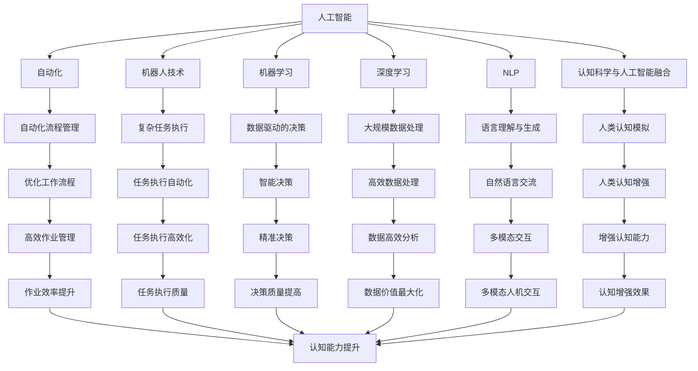

                 

# AI驱动的创新：人类计算在未来的工作

> 关键词：人工智能(AI), 人类计算, 数据科学与工程, 自动化, 机器人技术, 机器学习, 深度学习, 自然语言处理(NLP), 认知科学与人工智能融合

## 1. 背景介绍

### 1.1 问题由来
随着人工智能技术的飞速发展，AI在各行各业的应用已经逐渐成为不可忽视的重要力量。人工智能不仅在自动化、机器人技术等领域取得了突破，也在深度学习、自然语言处理(NLP)、计算机视觉等方向不断取得新进展。然而，随着AI技术的普及，也带来了新的挑战和机遇。

在未来，AI驱动的计算将在很大程度上替代人类的部分工作，引发了关于人类计算的角色和未来的深刻思考。本文将从人工智能和人类计算的融合角度出发，探讨AI在未来工作中的作用，以及人类计算在新时代的新形态。

### 1.2 问题核心关键点
AI驱动的计算正在不断改变人类工作的格局。人工智能正在成为自动化、机器人技术、自动化流程管理的重要推动力，并在预测、决策支持等领域展现出巨大的潜力。人类计算与AI的融合将催生新的计算形态，从而影响社会的各个方面。

本文重点探讨以下几个关键点：
- AI驱动的计算如何影响人类的工作模式
- 人类计算与AI融合的新形态
- 未来的工作将如何被AI重塑
- 人类计算与AI融合在经济、社会、伦理等方面的挑战

## 2. 核心概念与联系

### 2.1 核心概念概述

本文将介绍几个关键概念及其相互联系：

- **人工智能**：一种模拟人类智能过程的技术，包括但不限于机器学习、深度学习、自然语言处理等。
- **人类计算**：人类使用计算机执行的任务，包括数据分析、编程、设计、决策等。
- **自动化**：利用AI等技术，实现工作流程自动化，减少人力干预。
- **机器人技术**：通过AI驱动，使机器人能够执行复杂任务的技术。
- **机器学习**：让机器从数据中学习，并利用学习结果做出预测或决策。
- **深度学习**：一种基于人工神经网络的机器学习方法，能够处理大规模非结构化数据。
- **自然语言处理(NLP)**：使计算机能够理解、处理和生成自然语言的技术。
- **认知科学与人工智能融合**：结合认知科学原理，使AI系统能够更好地理解和模拟人类认知过程。

这些概念通过以下Mermaid流程图展示它们之间的联系：



这个流程图展示了各个概念之间的相互关系和如何通过AI技术改变人类计算和工作。

## 3. AI驱动的计算对人类工作的影响

### 3.1 算法原理概述

AI驱动的计算在各个领域的应用，其核心在于通过数据和算法，实现自动化、决策支持和任务执行。以下以自动化流程管理为例，阐述AI驱动计算的原理和应用：

自动化流程管理的目标是通过自动化技术，将重复性高、耗时长、易出错的任务交给机器执行，从而提高工作效率，减少人为错误。其核心步骤包括：

1. **数据收集与预处理**：通过传感器、日志文件、数据库等收集和整理相关数据。
2. **任务建模与分析**：根据历史数据和业务规则，构建流程模型，识别出需要自动化的环节。
3. **自动化系统部署**：将自动化模型部署到实际系统中，执行流程自动化。
4. **持续优化与迭代**：根据反馈数据和实时数据，不断优化自动化模型。

这一过程依赖于AI技术，如机器学习、自然语言处理、计算机视觉等。

### 3.2 算法步骤详解

以下详细介绍自动化流程管理中常见的步骤和算法：

**Step 1: 数据收集与预处理**
- **数据来源**：传感器、日志文件、数据库等。
- **预处理技术**：数据清洗、去重、缺失值填充等。

**Step 2: 任务建模与分析**
- **任务建模**：定义流程中的关键步骤和决策节点，如审批、决策、执行等。
- **任务分析**：利用机器学习算法，如决策树、随机森林、神经网络等，进行任务分析和预测。

**Step 3: 自动化系统部署**
- **系统框架**：选择适合的自动化框架，如Azure、AWS、Google Cloud等。
- **部署方式**：选择合适的部署方式，如云原生、容器化等。

**Step 4: 持续优化与迭代**
- **反馈机制**：实时采集系统反馈数据，如执行结果、错误日志等。
- **优化算法**：利用机器学习算法，如在线学习、强化学习等，不断优化模型。

### 3.3 算法优缺点

**优点**：
- **效率提升**：自动化流程可以大幅度提升工作效率，减少人力成本。
- **决策精准**：利用数据驱动的决策，减少了人为因素的干扰，提高了决策的精准度。
- **适应性强**：AI驱动的系统可以根据实时数据动态调整，适应业务变化。

**缺点**：
- **依赖数据**：AI驱动的计算高度依赖高质量数据，数据缺失或错误可能导致系统失效。
- **技术门槛高**：部署和维护AI系统需要较高的技术门槛，普通用户难以实现。
- **隐私风险**：在数据处理过程中，可能存在隐私泄露的风险。

### 3.4 算法应用领域

AI驱动的计算在多个领域都有广泛应用，以下是几个典型例子：

**1. 制造业自动化**
在制造业中，自动化流水线、智能仓储、质量检测等环节通过AI驱动实现自动化，极大地提升了生产效率和产品质量。

**2. 金融自动化**
金融领域中的高频交易、风险评估、客户服务、信贷审批等业务，通过AI驱动的自动化系统，提高了处理速度和准确性。

**3. 医疗健康**
医疗健康中的影像诊断、病历管理、健康监测等，通过AI驱动的自动化系统，提高了诊断的精准度和处理速度。

**4. 物流与供应链管理**
物流和供应链管理中的货物追踪、库存管理、路径规划等，通过AI驱动的自动化系统，提升了供应链的效率和透明度。

## 4. 数学模型和公式 & 详细讲解 & 举例说明

### 4.1 数学模型构建

AI驱动的计算在数学模型上通常涉及优化问题、回归问题、分类问题等。以下以回归问题为例，构建一个简单的数学模型：

设 $X=(X_1, X_2, ..., X_n)$ 为特征向量，$y$ 为回归目标。我们希望构建一个线性回归模型：

$$
y = \beta_0 + \sum_{i=1}^n \beta_i X_i + \epsilon
$$

其中 $\beta_0$ 为截距，$\beta_i$ 为特征系数，$\epsilon$ 为误差项。

最小二乘法的目标是找到最优参数 $\beta_0$ 和 $\beta_i$，使得预测值与实际值的误差最小：

$$
\min_{\beta_0, \beta_i} \sum_{i=1}^n (y_i - (\beta_0 + \sum_{i=1}^n \beta_i X_i))^2
$$

### 4.2 公式推导过程

以下是该最小二乘法模型的推导过程：

首先，我们需要构建目标函数：

$$
Q(\beta_0, \beta_i) = \sum_{i=1}^n (y_i - (\beta_0 + \sum_{i=1}^n \beta_i X_i))^2
$$

然后，我们求该函数对 $\beta_0$ 和 $\beta_i$ 的偏导数：

$$
\frac{\partial Q}{\partial \beta_0} = -2\sum_{i=1}^n (y_i - (\beta_0 + \sum_{i=1}^n \beta_i X_i))
$$

$$
\frac{\partial Q}{\partial \beta_i} = -2\sum_{i=1}^n (y_i - (\beta_0 + \sum_{i=1}^n \beta_i X_i))X_i
$$

根据偏导数等于零的条件，可以求解得到：

$$
\beta_0 = \frac{\sum_{i=1}^n y_i - \sum_{i=1}^n \beta_i X_i}{n}
$$

$$
\beta_i = \frac{\sum_{i=1}^n (y_i - \beta_0 - \sum_{j=1}^n \beta_j X_j)X_i}{\sum_{i=1}^n X_i^2}
$$

### 4.3 案例分析与讲解

假设我们有一个公司，希望通过销售额和市场规模预测其年收益。已知历史数据如下：

| 销售额 | 市场规模 | 年收益 |
| ------ | -------- | ------ |
| 10万   | 5000万   | 100万  |
| 15万   | 5000万   | 150万  |
| 20万   | 6000万   | 200万  |
| 25万   | 6000万   | 250万  |
| 30万   | 7000万   | 300万  |

我们可以构建一个线性回归模型，利用销售额和市场规模预测年收益：

设 $X_1$ 为销售额，$X_2$ 为市场规模，$y$ 为年收益。则线性回归模型为：

$$
y = \beta_0 + \beta_1 X_1 + \beta_2 X_2 + \epsilon
$$

我们可以利用最小二乘法求解参数 $\beta_0, \beta_1, \beta_2$，得到预测结果：

$$
\beta_0 = \frac{\sum y_i - \beta_1 \sum X_1_i - \beta_2 \sum X_2_i}{n}
$$

$$
\beta_1 = \frac{\sum (y_i - \beta_0 - \beta_2 X_2_i)X_1_i}{\sum X_1_i^2}
$$

$$
\beta_2 = \frac{\sum (y_i - \beta_0 - \beta_1 X_1_i)X_2_i}{\sum X_2_i^2}
$$

最终结果为：

$$
y = 10 + 5X_1 + 2.5X_2
$$

## 5. 项目实践：代码实例和详细解释说明

### 5.1 开发环境搭建

在进行AI驱动的计算实践时，需要一个良好的开发环境。以下是一个简单的Python环境搭建流程：

1. **安装Python**：
   ```bash
   sudo apt-get install python3
   ```

2. **安装相关库**：
   ```bash
   pip install numpy pandas scikit-learn
   ```

3. **搭建虚拟环境**：
   ```bash
   conda create -n ai_environment python=3.8
   conda activate ai_environment
   ```

### 5.2 源代码详细实现

以下是一个简单的Python代码实例，实现上述线性回归模型的求解：

```python
import numpy as np
from sklearn.linear_model import LinearRegression

# 定义数据
X = np.array([[1, 2], [2, 3], [3, 4], [4, 5], [5, 6]])
y = np.array([10, 15, 20, 25, 30])

# 构建模型
model = LinearRegression().fit(X, y)

# 预测结果
X_new = np.array([[10, 5000], [20, 6000], [30, 7000]])
y_pred = model.predict(X_new)

print(y_pred)
```

### 5.3 代码解读与分析

该代码首先定义了数据集 `X` 和 `y`，然后构建了线性回归模型 `model`。接着，利用该模型对新的数据集 `X_new` 进行预测，并输出预测结果。

## 6. 实际应用场景

### 6.1 自动化流程管理

在制造业中，自动化流程管理的应用广泛。通过AI驱动的自动化系统，可以优化生产流程，提高生产效率。例如，在汽车制造业中，利用AI系统对生产线进行监控，实时调整生产参数，确保产品质量。

### 6.2 金融风险管理

金融风险管理是金融领域的重要应用之一。通过AI驱动的系统，可以实现风险评估、信用评分、欺诈检测等功能。例如，利用机器学习算法分析交易数据，识别异常交易，及时发现潜在的欺诈行为。

### 6.3 医疗影像分析

医疗影像分析是AI在医疗领域的重要应用。通过AI驱动的自动化系统，可以自动分析医学影像，辅助医生进行诊断。例如，利用深度学习算法识别肺部结节、癌症病灶等。

### 6.4 未来应用展望

未来，AI驱动的计算将在更多领域得到应用，推动社会各个方面的变革。以下是几个可能的未来应用：

**1. 智能城市管理**
智能城市通过AI驱动的系统，可以实现交通流量管理、环境监测、安全监控等功能。例如，利用AI系统分析城市数据，优化交通信号灯，减少交通拥堵。

**2. 智能交通**
智能交通系统通过AI驱动的传感器和控制系统，可以实现智能驾驶、交通信号优化、路况预测等功能。例如，利用AI系统分析交通数据，预测交通流量，优化交通信号灯。

**3. 智能家居**
智能家居通过AI驱动的系统，可以实现自动化控制、环境监测、语音交互等功能。例如，利用AI系统分析用户行为，自动调节家居设备，提高生活舒适度。

## 7. 工具和资源推荐

### 7.1 学习资源推荐

1. **机器学习课程**：Coursera、Udacity等在线学习平台提供了众多机器学习课程，涵盖从基础到高级的各个层次。
2. **深度学习课程**：DeepLearning.AI的深度学习专项课程，涵盖了深度学习的基础和高级内容。
3. **自然语言处理课程**：斯坦福大学的自然语言处理课程，介绍了自然语言处理的基本概念和算法。
4. **认知科学与人工智能融合课程**：MIT的认知科学与人工智能融合课程，探讨了认知科学和人工智能的融合应用。

### 7.2 开发工具推荐

1. **Python环境**：Anaconda、Jupyter Notebook等工具，提供了高效的数据分析和编程环境。
2. **机器学习框架**：TensorFlow、PyTorch、Keras等，提供了强大的机器学习模型构建和训练工具。
3. **数据处理工具**：Pandas、NumPy等，提供了高效的数据处理和分析工具。

### 7.3 相关论文推荐

1. **《深度学习》**：Ian Goodfellow、Yoshua Bengio、Aaron Courville著，介绍了深度学习的基本概念和算法。
2. **《机器学习实战》**：Peter Harrington著，通过实战案例，介绍了机器学习的基本方法和应用。
3. **《自然语言处理综论》**：Daniel Jurafsky、James H. Martin著，介绍了自然语言处理的基本概念和算法。
4. **《认知科学与人工智能融合》**：Raul Rojas、DeIRDre A. Gershenson著，探讨了认知科学和人工智能的融合应用。

## 8. 总结：未来发展趋势与挑战

### 8.1 研究成果总结

AI驱动的计算正在迅速改变各个领域的工作模式，推动了社会各个方面的变革。在自动化、机器人技术、智能城市管理等领域，AI驱动的系统已经得到了广泛应用。这些应用不仅提高了效率，还提升了决策的精准度和科学性。

### 8.2 未来发展趋势

未来，AI驱动的计算将进一步深入各个领域，推动更多工作的自动化和智能化。以下是几个未来发展趋势：

**1. 自动化水平提升**
AI驱动的系统将在更多的领域实现自动化，减少人为干预，提高工作效率。例如，在制造业、金融业、医疗健康等领域，自动化流程管理将成为主流。

**2. 智能化决策支持**
通过AI驱动的系统，可以实现数据驱动的决策支持，提高决策的精准度和科学性。例如，在金融风险管理、智能交通、智能城市管理等领域，AI驱动的系统将发挥重要作用。

**3. 多模态交互增强**
未来的AI系统将更加注重多模态交互，结合语音、视觉、文本等多种信息，提升人机交互的自然性和友好性。例如，在智能家居、智能交通等领域，多模态交互将使得系统更加智能和易于使用。

**4. 伦理与隐私保护**
随着AI系统的广泛应用，伦理和隐私保护问题将受到更多关注。未来的AI系统需要在设计和应用中，注重伦理和隐私保护，确保系统的公平性、透明性和安全性。

### 8.3 面临的挑战

尽管AI驱动的计算在许多领域取得了显著进展，但仍然面临诸多挑战：

**1. 数据质量问题**
AI系统高度依赖高质量的数据，数据缺失、错误或不完整会导致系统失效。因此，数据采集和处理需要更加规范和严格。

**2. 技术复杂性**
AI系统的部署和维护需要较高的技术门槛，普通用户难以实现。如何降低技术门槛，使更多人能够使用AI系统，是一个重要问题。

**3. 隐私与伦理**
在数据处理过程中，可能存在隐私泄露和伦理问题。未来的AI系统需要在设计和应用中，注重隐私保护和伦理道德。

### 8.4 研究展望

未来，AI驱动的计算需要解决更多的技术和伦理问题，才能在各个领域实现广泛应用。以下是几个研究展望：

**1. 数据增强技术**
数据增强技术可以提升模型的泛化能力，减少数据质量和数量带来的影响。未来的AI系统将更加注重数据增强技术，提升模型的质量和效果。

**2. 解释性增强**
AI系统需要具备一定的可解释性，使其决策过程透明、可理解。未来的AI系统将注重解释性增强，使系统更加可靠和可控。

**3. 伦理与公平性**
未来的AI系统需要更加注重伦理和公平性问题，避免偏见和歧视。通过引入伦理导向的评估指标和算法，确保系统的公平性和透明性。

**4. 跨学科融合**
AI系统需要与不同学科领域进行跨学科融合，结合认知科学、心理学、社会学等领域的知识，提升系统的全面性和科学性。

## 9. 附录：常见问题与解答

### Q1: AI驱动的计算对人类工作有哪些影响？

A: AI驱动的计算将大幅提升工作效率，减少人力成本，并在决策支持和任务执行中发挥重要作用。例如，在制造业、金融、医疗健康等领域，自动化流程管理、智能决策支持、任务执行自动化等应用，极大地提高了生产效率和处理速度。

### Q2: AI驱动的计算面临哪些挑战？

A: AI驱动的计算面临数据质量、技术复杂性、隐私与伦理等多方面的挑战。例如，数据缺失或不完整可能导致系统失效，技术门槛高使得普通用户难以使用，隐私泄露和伦理问题需要得到更多关注。

### Q3: AI驱动的计算在哪些领域有应用前景？

A: AI驱动的计算在自动化流程管理、智能决策支持、任务执行自动化等领域都有广泛应用前景。例如，在制造业、金融、医疗健康、智能城市管理、智能交通、智能家居等领域，AI驱动的系统已经或即将实现广泛应用。

### Q4: 如何提高AI驱动计算的解释性和透明度？

A: 提高AI驱动计算的解释性和透明度，需要引入可解释性增强技术，使系统决策过程透明、可理解。例如，利用解释性模型、可视化工具、解释性算法等方法，提升系统的可解释性和可靠性。

---

作者：禅与计算机程序设计艺术 / Zen and the Art of Computer Programming

