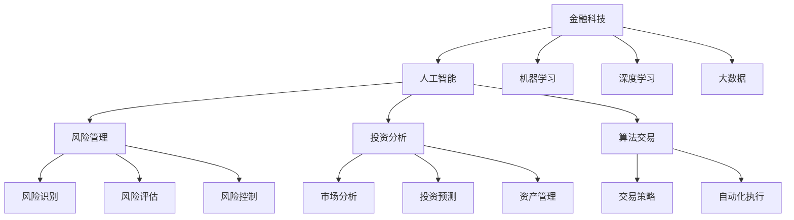

                 

# AI驱动的创新：人类计算在金融行业中的应用

> 关键词：金融科技,人类计算,人工智能,机器学习,深度学习,大数据,风险管理,投资分析,算法交易,金融创新

## 1. 背景介绍

### 1.1 问题由来
随着数字经济的发展，金融行业正经历着前所未有的变革。数字技术、人工智能和大数据等新兴技术正在重塑金融服务的形态和业态。然而，金融领域具有极高的数据复杂性和风险敏感性，传统计算模型和方法已经难以满足现代金融的需求。

与此同时，人工智能（AI）技术的迅猛发展，特别是深度学习、机器学习等算法的进步，为金融行业的创新提供了新的工具。AI驱动的人类计算（Human-in-the-Loop）技术，通过将人类专家的判断与AI模型的计算相结合，能够大幅度提高金融服务的效率和精准度。

### 1.2 问题核心关键点
本论文聚焦于AI驱动的人类计算在金融行业中的应用，主要探讨以下几个关键点：

- **金融科技（FinTech）**：利用AI技术驱动金融服务的自动化和智能化，提升用户体验。
- **人类计算（Human-in-the-Loop）**：在AI模型预测结果的基础上，由人类专家进行复核和调整，确保决策的可靠性和合理性。
- **风险管理**：通过AI和大数据技术，提高金融风险的识别、评估和控制能力。
- **投资分析**：使用AI模型分析市场趋势和投资机会，辅助投资决策。
- **算法交易**：开发基于AI的自动化交易策略，提高交易效率和收益。
- **金融创新**：探索AI技术在金融服务中的新应用，推动金融行业的发展。

### 1.3 问题研究意义
研究AI驱动的人类计算在金融行业中的应用，对于提升金融服务的质量和效率，降低风险，促进金融创新具有重要意义：

1. **提高效率**：AI技术能够快速处理和分析大量数据，大幅度提升金融服务的效率。
2. **降低成本**：自动化的AI模型可以减少人力成本，提高运营效率。
3. **增强决策能力**：通过AI模型提供的数据分析支持，金融从业者可以做出更加科学合理的决策。
4. **风险管理**：利用AI技术识别和评估风险，提高金融机构的稳健性。
5. **推动创新**：AI技术的不断进步将推动金融行业的新应用和新业务模式的创新。

## 2. 核心概念与联系

### 2.1 核心概念概述

为更好地理解AI驱动的人类计算在金融行业中的应用，本节将介绍几个密切相关的核心概念：

- **金融科技（FinTech）**：利用技术手段创新金融服务和产品，提高金融服务的效率和覆盖面。
- **人工智能（AI）**：通过算法、模型和大数据技术，模拟人类智能的决策和行为。
- **机器学习（ML）**：一种通过数据训练模型，使模型能够自主学习和优化的方法。
- **深度学习（DL）**：一种基于神经网络的机器学习技术，具有强大的特征提取和模式识别能力。
- **大数据（Big Data）**：指海量的、高速增长的、多样化的数据集，通过数据分析提取有价值的信息。
- **风险管理**：通过评估和控制风险，保障金融机构的稳健运营和客户利益。
- **投资分析**：通过分析和预测市场趋势，辅助投资决策和资产管理。
- **算法交易**：基于数学模型和计算机算法，自动化执行交易指令。

这些概念之间的逻辑关系可以通过以下Mermaid流程图来展示：



这个流程图展示了大数据、AI、机器学习和深度学习等技术如何通过金融科技实现对风险管理、投资分析和算法交易等核心金融功能的支持。

## 3. 核心算法原理 & 具体操作步骤

### 3.1 算法原理概述

AI驱动的人类计算在金融行业中的应用，本质上是将金融数据与AI模型相结合，利用机器学习和深度学习技术进行分析和预测，再通过人类专家的复核和调整，实现智能化决策的过程。

具体而言，过程包括以下几个步骤：

1. **数据收集与预处理**：收集金融市场的数据，并进行清洗、筛选和标准化。
2. **模型训练与优化**：使用机器学习和深度学习模型对数据进行训练，优化模型参数，使其能够准确预测市场趋势和风险。
3. **结果评估与反馈**：对模型预测结果进行评估，并通过人类专家的复核和调整，确保结果的可靠性。
4. **决策执行与监控**：将AI模型的预测结果应用于实际的金融决策中，并持续监控模型的表现，进行必要的调整和优化。

### 3.2 算法步骤详解

#### 3.2.1 数据收集与预处理

数据收集是AI驱动金融应用的基础。金融行业涉及的数据种类繁多，包括但不限于：

- **历史交易数据**：包含股票、债券、外汇等金融产品的历史交易价格和成交量。
- **市场新闻与公告**：金融市场的新闻、公司财报、政策法规等文本数据。
- **宏观经济数据**：国内外的GDP、失业率、利率等宏观经济指标。
- **社交媒体数据**：用户在社交平台上的言论、情感等数据。
- **自然语言数据**：客户咨询、投诉等文本数据。

数据预处理包括以下几个步骤：

1. **数据清洗**：去除噪声、异常值和重复数据，保证数据质量。
2. **数据标准化**：将数据转换为标准格式，便于后续处理。
3. **特征提取**：从原始数据中提取有意义的特征，用于模型训练。

#### 3.2.2 模型训练与优化

模型训练是AI驱动金融应用的核心。常见的机器学习模型包括线性回归、逻辑回归、随机森林等，而深度学习模型则包括卷积神经网络（CNN）、循环神经网络（RNN）和长短时记忆网络（LSTM）等。

模型训练的具体步骤包括：

1. **选择合适的模型**：根据具体任务，选择适合的机器学习或深度学习模型。
2. **特征选择与工程**：从原始数据中提取有意义的特征，并对特征进行工程处理，如归一化、PCA等。
3. **模型训练**：使用训练数据对模型进行训练，优化模型参数。
4. **模型评估**：使用验证集对模型进行评估，选择表现最优的模型。
5. **模型优化**：根据评估结果，对模型进行优化，提高模型准确性和泛化能力。

#### 3.2.3 结果评估与反馈

结果评估与反馈是AI驱动金融应用的重要环节。通过评估模型预测结果的准确性和可靠性，并结合人类专家的经验，确保决策的科学性和合理性。

结果评估的具体方法包括：

1. **交叉验证**：使用交叉验证方法评估模型的泛化能力，避免过拟合。
2. **误差分析**：分析模型预测结果与真实结果的差异，找出原因并进行改进。
3. **专家复核**：由金融专家对模型的预测结果进行复核，确保结果的可靠性。
4. **反馈调整**：根据专家复核结果，调整模型的参数和策略，提高模型性能。

#### 3.2.4 决策执行与监控

决策执行与监控是AI驱动金融应用的最终环节。通过将模型的预测结果应用于实际的金融决策中，并持续监控模型的表现，确保决策的科学性和有效性。

决策执行与监控的具体方法包括：

1. **自动化执行**：使用机器学习和深度学习模型自动执行交易策略和风险控制策略。
2. **实时监控**：使用实时监控系统，对模型的表现进行持续监控，及时发现和处理异常情况。
3. **持续优化**：根据市场变化和业务需求，持续优化模型和算法，提高决策的精准度。

### 3.3 算法优缺点

AI驱动的人类计算在金融行业中的应用，具有以下优点：

1. **高效性**：AI模型能够快速处理和分析大量数据，提高金融服务的效率。
2. **准确性**：AI模型能够通过大量数据训练，提高预测和决策的准确性。
3. **智能性**：结合人类专家的经验，AI模型能够实现更加智能化的决策。
4. **可扩展性**：AI模型可以应用于多种金融场景，具有广泛的适用性。

同时，该方法也存在一些局限性：

1. **数据依赖**：AI模型依赖于高质量的数据，数据缺失或不准确会影响模型的表现。
2. **复杂性**：AI模型和算法的复杂性，增加了系统开发和维护的难度。
3. **解释性不足**：AI模型通常是"黑盒"系统，缺乏透明度和可解释性。
4. **风险因素**：AI模型难以完全避免市场波动和意外事件带来的风险。

尽管存在这些局限性，AI驱动的人类计算在金融行业中的应用，仍然具有广阔的应用前景。未来相关研究将进一步探索如何提高数据质量、优化模型算法、增强系统透明性，并降低风险因素对模型的影响。

### 3.4 算法应用领域

AI驱动的人类计算在金融行业中的应用，已经在多个领域得到了广泛的应用，例如：

- **风险管理**：利用AI模型进行信用风险评估、市场风险监控和操作风险控制。
- **投资分析**：使用AI模型分析市场趋势、识别投资机会，辅助投资决策和资产管理。
- **算法交易**：开发基于AI的交易策略，自动执行交易指令，提高交易效率和收益。
- **客户服务**：利用AI模型进行客户咨询和投诉处理，提高客户满意度和体验。
- **财务分析**：使用AI模型进行财务报表分析和预测，提高财务分析的效率和准确性。
- **信贷评估**：利用AI模型进行客户信用评估和贷款风险控制。

除了上述这些经典应用外，AI驱动的人类计算技术还在保险、支付、金融监管等多个领域得到了创新性应用，为金融行业的数字化转型提供了新的动力。

## 4. 数学模型和公式 & 详细讲解 & 举例说明

### 4.1 数学模型构建

本节将使用数学语言对AI驱动的人类计算在金融行业中的应用进行更加严格的刻画。

假设金融市场的历史交易数据为 $X=\{x_i\}_{i=1}^N$，其中 $x_i=(x_{i1},x_{i2},...,x_{in})$ 为第 $i$ 个交易数据的特征向量。市场新闻和公告文本数据为 $T=\{t_j\}_{j=1}^M$，其中 $t_j=(t_{j1},t_{j2},...,t_{jm})$ 为第 $j$ 条新闻文本的特征向量。

定义AI模型为 $M_{\theta}(X,T)=y$，其中 $\theta$ 为模型参数。模型输出 $y$ 表示对金融市场的预测结果，如市场趋势、投资机会、风险评估等。

AI模型的训练目标是最小化经验风险，即：

$$
\mathcal{L}(\theta) = \frac{1}{N}\sum_{i=1}^N l(x_i,M_{\theta}(X,T)) + \frac{1}{M}\sum_{j=1}^M l(t_j,M_{\theta}(X,T))
$$

其中 $l$ 为损失函数，通常为交叉熵损失函数或均方误差损失函数。

### 4.2 公式推导过程

以市场趋势预测为例，使用线性回归模型作为AI模型的具体形式：

$$
M_{\theta}(X,T) = \theta_0 + \sum_{i=1}^n \theta_i x_{i1} + \sum_{j=1}^m \theta_{i,j} t_{j1}
$$

其中 $\theta_0$ 为截距，$\theta_i$ 和 $\theta_{i,j}$ 为特征权重。

根据线性回归模型的最小二乘估计公式，模型的参数 $\theta$ 可以通过下式求解：

$$
\theta = \mathop{\arg\min}_{\theta} \sum_{i=1}^N (y_i - M_{\theta}(X,T))^2 + \sum_{j=1}^M (y_j - M_{\theta}(X,T))^2
$$

求解该优化问题，可以得到模型参数 $\theta$，进而完成对市场趋势的预测。

### 4.3 案例分析与讲解

#### 4.3.1 风险评估

风险评估是金融行业中的一个重要应用。通过AI模型对客户的信用风险进行评估，可以降低信贷坏账率，提高金融机构的稳健性。

假设客户的历史信用记录为 $X=\{x_i\}_{i=1}^N$，其中 $x_i=(x_{i1},x_{i2},...,x_{in})$ 为第 $i$ 个客户的信用记录特征向量。客户申请的贷款金额为 $y$。

利用线性回归模型对客户的信用风险进行评估，得到模型的输出 $M_{\theta}(X)=y$。模型参数 $\theta$ 通过下式求解：

$$
\theta = \mathop{\arg\min}_{\theta} \sum_{i=1}^N (y_i - M_{\theta}(X))^2
$$

求解该优化问题，可以得到客户信用风险的预测值 $y$。根据预测值，金融机构可以决定是否批准贷款申请。

#### 4.3.2 投资组合优化

投资组合优化是金融分析中的一个关键问题。通过AI模型优化投资组合，可以提高投资收益和风险控制能力。

假设投资者的历史交易数据为 $X=\{x_i\}_{i=1}^N$，其中 $x_i=(x_{i1},x_{i2},...,x_{in})$ 为第 $i$ 个交易数据的特征向量。投资组合的历史收益率为 $y$。

利用线性回归模型对投资组合进行优化，得到模型的输出 $M_{\theta}(X)=y$。模型参数 $\theta$ 通过下式求解：

$$
\theta = \mathop{\arg\min}_{\theta} \sum_{i=1}^N (y_i - M_{\theta}(X))^2
$$

求解该优化问题，可以得到投资组合的优化策略。投资者可以依据优化策略调整投资组合，提高收益和风险控制能力。

## 5. 项目实践：代码实例和详细解释说明

### 5.1 开发环境搭建

在进行AI驱动的人类计算实践前，我们需要准备好开发环境。以下是使用Python进行PyTorch开发的环境配置流程：

1. 安装Anaconda：从官网下载并安装Anaconda，用于创建独立的Python环境。

2. 创建并激活虚拟环境：
```bash
conda create -n pytorch-env python=3.8 
conda activate pytorch-env
```

3. 安装PyTorch：根据CUDA版本，从官网获取对应的安装命令。例如：
```bash
conda install pytorch torchvision torchaudio cudatoolkit=11.1 -c pytorch -c conda-forge
```

4. 安装Transformers库：
```bash
pip install transformers
```

5. 安装各类工具包：
```bash
pip install numpy pandas scikit-learn matplotlib tqdm jupyter notebook ipython
```

完成上述步骤后，即可在`pytorch-env`环境中开始AI驱动的人类计算实践。

### 5.2 源代码详细实现

这里我们以信用风险评估为例，给出使用PyTorch和Transformers库进行AI驱动的人类计算的PyTorch代码实现。

首先，定义数据处理函数：

```python
from torch.utils.data import Dataset, DataLoader
import torch
from transformers import BertTokenizer, BertForSequenceClassification

class CreditDataset(Dataset):
    def __init__(self, data, labels, tokenizer, max_len=128):
        self.data = data
        self.labels = labels
        self.tokenizer = tokenizer
        self.max_len = max_len
        
    def __len__(self):
        return len(self.data)
    
    def __getitem__(self, idx):
        text = self.data[idx]
        label = self.labels[idx]
        
        encoding = self.tokenizer(text, return_tensors='pt', max_length=self.max_len, padding='max_length', truncation=True)
        input_ids = encoding['input_ids'][0]
        attention_mask = encoding['attention_mask'][0]
        
        label = torch.tensor([label], dtype=torch.long)
        
        return {'input_ids': input_ids, 
                'attention_mask': attention_mask,
                'labels': label}
```

然后，定义模型和优化器：

```python
from transformers import AdamW

model = BertForSequenceClassification.from_pretrained('bert-base-uncased', num_labels=2)
optimizer = AdamW(model.parameters(), lr=2e-5)
```

接着，定义训练和评估函数：

```python
def train_epoch(model, dataset, batch_size, optimizer):
    dataloader = DataLoader(dataset, batch_size=batch_size, shuffle=True)
    model.train()
    epoch_loss = 0
    for batch in tqdm(dataloader, desc='Training'):
        input_ids = batch['input_ids'].to(device)
        attention_mask = batch['attention_mask'].to(device)
        labels = batch['labels'].to(device)
        model.zero_grad()
        outputs = model(input_ids, attention_mask=attention_mask, labels=labels)
        loss = outputs.loss
        epoch_loss += loss.item()
        loss.backward()
        optimizer.step()
    return epoch_loss / len(dataloader)

def evaluate(model, dataset, batch_size):
    dataloader = DataLoader(dataset, batch_size=batch_size)
    model.eval()
    preds, labels = [], []
    with torch.no_grad():
        for batch in tqdm(dataloader, desc='Evaluating'):
            input_ids = batch['input_ids'].to(device)
            attention_mask = batch['attention_mask'].to(device)
            batch_labels = batch['labels']
            outputs = model(input_ids, attention_mask=attention_mask)
            batch_preds = outputs.logits.argmax(dim=2).to('cpu').tolist()
            batch_labels = batch_labels.to('cpu').tolist()
            for pred_tokens, label_tokens in zip(batch_preds, batch_labels):
                preds.append(pred_tokens)
                labels.append(label_tokens)
                
    return preds, labels

def main():
    epochs = 5
    batch_size = 16

    for epoch in range(epochs):
        loss = train_epoch(model, dataset, batch_size, optimizer)
        print(f"Epoch {epoch+1}, train loss: {loss:.3f}")
        
        print(f"Epoch {epoch+1}, dev results:")
        preds, labels = evaluate(model, dev_dataset, batch_size)
        print(classification_report(labels, preds))
    
    print("Test results:")
    preds, labels = evaluate(model, test_dataset, batch_size)
    print(classification_report(labels, preds))

if __name__ == "__main__":
    main()
```

以上就是使用PyTorch和Transformers库进行信用风险评估的完整代码实现。可以看到，得益于Transformers库的强大封装，我们可以用相对简洁的代码完成BERT模型的加载和训练。

### 5.3 代码解读与分析

让我们再详细解读一下关键代码的实现细节：

**CreditDataset类**：
- `__init__`方法：初始化文本、标签、分词器等关键组件。
- `__len__`方法：返回数据集的样本数量。
- `__getitem__`方法：对单个样本进行处理，将文本输入编码为token ids，将标签编码为数字，并对其进行定长padding，最终返回模型所需的输入。

**模型训练和评估函数**：
- 使用PyTorch的DataLoader对数据集进行批次化加载，供模型训练和推理使用。
- 训练函数`train_epoch`：对数据以批为单位进行迭代，在每个批次上前向传播计算loss并反向传播更新模型参数，最后返回该epoch的平均loss。
- 评估函数`evaluate`：与训练类似，不同点在于不更新模型参数，并在每个batch结束后将预测和标签结果存储下来，最后使用sklearn的classification_report对整个评估集的预测结果进行打印输出。

**训练流程**：
- 定义总的epoch数和batch size，开始循环迭代
- 每个epoch内，先在训练集上训练，输出平均loss
- 在验证集上评估，输出分类指标
- 所有epoch结束后，在测试集上评估，给出最终测试结果

可以看到，PyTorch配合Transformers库使得BERT模型的微调代码实现变得简洁高效。开发者可以将更多精力放在数据处理、模型改进等高层逻辑上，而不必过多关注底层的实现细节。

当然，工业级的系统实现还需考虑更多因素，如模型的保存和部署、超参数的自动搜索、更灵活的任务适配层等。但核心的微调范式基本与此类似。

## 6. 实际应用场景

### 6.1 智能投顾系统

智能投顾系统是AI驱动的人类计算在金融行业中的一个重要应用。通过智能投顾系统，用户可以借助AI模型进行投资建议和资产配置，优化投资策略，提高收益。

具体而言，智能投顾系统通常包括以下几个模块：

1. **市场分析**：使用AI模型分析市场趋势和投资机会，提供投资建议。
2. **风险评估**：利用AI模型评估客户的风险承受能力，优化投资组合。
3. **组合优化**：使用AI模型优化投资组合，提高收益和风险控制能力。
4. **实时监控**：使用AI模型实时监控投资组合的表现，及时进行调整。
5. **客户互动**：使用AI模型生成个性化的投资建议和市场分析报告，提升用户体验。

### 6.2 信用风险管理系统

信用风险管理系统是AI驱动的人类计算在金融行业中的另一个重要应用。通过信用风险管理系统，金融机构可以更科学、更准确地评估客户的信用风险，降低坏账率。

具体而言，信用风险管理系统通常包括以下几个模块：

1. **数据收集与处理**：收集客户的信用记录和历史交易数据，并进行预处理。
2. **信用评估模型**：使用AI模型评估客户的信用风险，输出风险评分。
3. **风险控制策略**：根据风险评分，制定相应的贷款策略和额度控制。
4. **动态调整**：根据市场变化和客户行为，动态调整信用评估模型和风险控制策略。
5. **异常检测**：使用AI模型进行异常检测，及时发现和处理潜在的风险点。

### 6.3 算法交易系统

算法交易系统是AI驱动的人类计算在金融行业中的另一类重要应用。通过算法交易系统，证券公司可以更快速、更高效地执行交易策略，提高交易收益。

具体而言，算法交易系统通常包括以下几个模块：

1. **市场分析**：使用AI模型分析市场趋势和交易机会，制定交易策略。
2. **策略执行**：使用AI模型自动化执行交易策略，提高交易效率。
3. **风险控制**：使用AI模型控制交易风险，避免过度交易和亏损。
4. **模型优化**：根据市场表现和交易结果，不断优化交易策略和模型参数。
5. **监控与分析**：使用AI模型实时监控交易表现，分析交易策略的效果和优化方向。

### 6.4 未来应用展望

随着AI技术的不断进步，AI驱动的人类计算在金融行业中的应用将更加广泛和深入。未来，我们可以预见以下趋势：

1. **跨领域应用**：AI驱动的人类计算将不仅仅应用于传统的金融领域，还会拓展到供应链金融、保险、支付等领域，推动金融科技的全面发展。
2. **实时化应用**：AI驱动的人类计算将更注重实时化应用，利用AI模型实时处理和分析数据，实现实时决策和实时调整。
3. **协同化应用**：AI驱动的人类计算将与大数据、区块链、物联网等技术协同应用，构建更全面、智能的金融生态系统。
4. **透明化应用**：AI驱动的人类计算将更加注重透明化应用，提高系统的可解释性和可控性，确保决策的科学性和合理性。
5. **个性化应用**：AI驱动的人类计算将更加注重个性化应用，通过AI模型提供个性化的金融服务和产品，提升用户体验。

## 7. 工具和资源推荐

### 7.1 学习资源推荐

为了帮助开发者系统掌握AI驱动的人类计算的理论基础和实践技巧，这里推荐一些优质的学习资源：

1. 《Python深度学习》书籍：由Francois Chollet编写，全面介绍了深度学习的基本概念和应用方法，是深度学习学习的必备书籍。

2. 《TensorFlow实战Google深度学习》书籍：由Dogan Caner和Jorge Diaz编写，介绍了TensorFlow在深度学习中的应用，包括模型训练、优化、部署等。

3. 《深度学习基础》课程：由吴恩达在Coursera上开设的深度学习入门课程，涵盖了深度学习的基本概念和算法。

4. 《深度学习与数据增强》课程：由Deep Learning Specialization在Coursera上开设的深度学习高级课程，重点介绍数据增强技术在深度学习中的应用。

5. 《AI金融创新》系列文章：由FinTech Weekly等金融科技媒体发布的AI在金融领域应用的系列文章，涵盖AI在信用评估、投资分析、算法交易等多个场景中的应用。

通过对这些资源的学习实践，相信你一定能够快速掌握AI驱动的人类计算的精髓，并用于解决实际的金融问题。

### 7.2 开发工具推荐

高效的开发离不开优秀的工具支持。以下是几款用于AI驱动的人类计算开发的常用工具：

1. PyTorch：基于Python的开源深度学习框架，灵活动态的计算图，适合快速迭代研究。大部分预训练语言模型都有PyTorch版本的实现。

2. TensorFlow：由Google主导开发的开源深度学习框架，生产部署方便，适合大规模工程应用。同样有丰富的预训练语言模型资源。

3. Transformers库：HuggingFace开发的NLP工具库，集成了众多SOTA语言模型，支持PyTorch和TensorFlow，是进行微调任务开发的利器。

4. Weights & Biases：模型训练的实验跟踪工具，可以记录和可视化模型训练过程中的各项指标，方便对比和调优。与主流深度学习框架无缝集成。

5. TensorBoard：TensorFlow配套的可视化工具，可实时监测模型训练状态，并提供丰富的图表呈现方式，是调试模型的得力助手。

6. Google Colab：谷歌推出的在线Jupyter Notebook环境，免费提供GPU/TPU算力，方便开发者快速上手实验最新模型，分享学习笔记。

合理利用这些工具，可以显著提升AI驱动的人类计算的开发效率，加快创新迭代的步伐。

### 7.3 相关论文推荐

AI驱动的人类计算在金融行业中的应用源于学界的持续研究。以下是几篇奠基性的相关论文，推荐阅读：

1. "Human-in-the-Loop Machine Learning for Predicting Credit Risk"（人类介入下的机器学习信用风险预测）：使用人类专家的参与，提高信用风险预测模型的准确性。

2. "Neural Network Models for Financial Time Series Prediction"（神经网络在金融时间序列预测中的应用）：使用神经网络模型预测金融时间序列数据，如股票价格、汇率等。

3. "AI in Investment Management: Algorithms and Strategies"（AI在投资管理中的应用：算法和策略）：介绍AI在投资组合管理、风险控制等方面的应用。

4. "AI-Driven Financial Services: Challenges and Opportunities"（AI驱动的金融服务：挑战与机遇）：探讨AI技术在金融服务中的应用前景和面临的挑战。

5. "Deep Learning for Financial Fraud Detection"（深度学习在金融欺诈检测中的应用）：使用深度学习模型检测金融欺诈行为，提高风险控制能力。

这些论文代表了大语言模型微调技术的发展脉络。通过学习这些前沿成果，可以帮助研究者把握学科前进方向，激发更多的创新灵感。

## 8. 总结：未来发展趋势与挑战

### 8.1 总结

本文对AI驱动的人类计算在金融行业中的应用进行了全面系统的介绍。首先阐述了AI驱动的人类计算的研究背景和意义，明确了其在金融服务、风险管理、投资分析等多个领域的潜在价值。其次，从原理到实践，详细讲解了AI驱动的人类计算的数学模型和关键步骤，给出了具体的代码实现。同时，本文还广泛探讨了AI驱动的人类计算在金融行业中的应用前景，展示了其在智能投顾、信用风险管理、算法交易等场景中的广泛应用。

通过本文的系统梳理，可以看到，AI驱动的人类计算在金融行业中的应用前景广阔，具有巨大的潜力和价值。未来，随着AI技术的不断进步，AI驱动的人类计算将在更多领域得到应用，为金融行业的数字化转型和智能化升级提供新的动力。

### 8.2 未来发展趋势

展望未来，AI驱动的人类计算在金融行业中的应用将呈现以下几个发展趋势：

1. **智能化程度提升**：AI驱动的人类计算将越来越智能化，能够更好地理解和模拟人类决策过程，提供更精准的金融服务。
2. **多模态应用扩展**：AI驱动的人类计算将从单一的数据模态向多模态数据融合发展，整合文本、图像、声音等多种信息，提高决策的全面性和准确性。
3. **跨领域融合**：AI驱动的人类计算将与其他新兴技术（如区块链、物联网等）融合，构建更加全面和智能的金融生态系统。
4. **实时化应用深化**：AI驱动的人类计算将更加注重实时化应用，利用AI模型实时处理和分析数据，实现实时决策和实时调整。
5. **透明化应用普及**：AI驱动的人类计算将更加注重透明化应用，提高系统的可解释性和可控性，确保决策的科学性和合理性。
6. **个性化应用增强**：AI驱动的人类计算将更加注重个性化应用，通过AI模型提供个性化的金融服务和产品，提升用户体验。

### 8.3 面临的挑战

尽管AI驱动的人类计算在金融行业中的应用前景广阔，但在实现过程中仍面临诸多挑战：

1. **数据质量问题**：金融数据的复杂性和多样性，对数据质量和预处理提出了更高的要求。数据的缺失、噪声和不一致性将影响模型的表现。
2. **模型复杂性**：AI驱动的人类计算中的模型越来越复杂，系统的开发和维护难度增加。需要更多的技术积累和专业人才支持。
3. **系统透明性不足**：AI驱动的人类计算中的模型通常是"黑盒"系统，缺乏透明度和可解释性。这将对金融决策的科学性和合理性产生影响。
4. **伦理和合规问题**：AI驱动的人类计算中的模型可能存在偏见和歧视，需要建立严格的伦理和合规机制，确保模型的公正性和公平性。
5. **安全性和隐私问题**：AI驱动的人类计算中的模型需要处理大量敏感数据，需要建立完善的安全和隐私保护机制，防止数据泄露和滥用。

尽管存在这些挑战，AI驱动的人类计算在金融行业中的应用仍具有广阔的前景。未来相关研究需要在数据质量、模型复杂性、系统透明性、伦理合规性等方面寻求新的突破，以充分发挥AI技术的潜力，推动金融行业的数字化转型。

### 8.4 研究展望

未来，AI驱动的人类计算在金融行业中的应用，需要在以下几个方向进行深入研究：

1. **数据增强技术**：利用数据增强技术提高数据质量和多样性，减少数据缺失和噪声对模型的影响。
2. **多模态融合技术**：研究多模态数据融合技术，整合文本、图像、声音等多种信息，提高决策的全面性和准确性。
3. **模型透明性研究**：研究AI模型的透明性和可解释性，提高系统的可解释性和可控性，确保决策的科学性和合理性。
4. **伦理和合规机制**：建立严格的伦理和合规机制，确保AI模型的公正性和公平性，防止模型偏见和歧视。
5. **安全性和隐私保护**：研究数据安全和隐私保护技术，确保金融数据的保密性和安全性。

这些研究方向将引领AI驱动的人类计算在金融行业中的应用走向成熟，为构建安全、可靠、可解释、可控的智能系统提供新的动力。面向未来，AI驱动的人类计算需要与其他人工智能技术进行更深入的融合，如知识表示、因果推理、强化学习等，多路径协同发力，共同推动金融行业的数字化转型和智能化升级。只有勇于创新、敢于突破，才能不断拓展金融科技的边界，让智能技术更好地造福人类社会。

## 9. 附录：常见问题与解答

**Q1：AI驱动的人类计算是否适用于所有金融场景？**

A: AI驱动的人类计算在大多数金融场景中都能取得不错的效果，但对于一些特定领域的金融场景，如高频交易、资产定价等，其适用性还需进一步验证。

**Q2：AI驱动的人类计算在金融应用中如何保证数据质量？**

A: 数据质量是AI驱动的人类计算中的关键问题。为了保证数据质量，可以从以下几个方面进行努力：
1. 数据清洗：去除噪声、异常值和重复数据，保证数据质量。
2. 数据标准化：将数据转换为标准格式，便于后续处理。
3. 数据增强：利用数据增强技术提高数据多样性，减少数据缺失和噪声的影响。

**Q3：AI驱动的人类计算在金融应用中如何避免模型偏见？**

A: 模型偏见是AI驱动的人类计算中的一个重要问题。为了避免模型偏见，可以从以下几个方面进行努力：
1. 数据多样化：使用多样化的数据集进行训练，减少数据偏差的影响。
2. 模型优化：通过优化模型参数和算法，减少模型对特定数据的依赖。
3. 人工干预：在模型输出中加入人工复核和调整，确保决策的公正性和公平性。

**Q4：AI驱动的人类计算在金融应用中如何保证系统透明性？**

A: 系统透明性是AI驱动的人类计算中的一个关键问题。为了保证系统透明性，可以从以下几个方面进行努力：
1. 模型解释性：使用可解释性强的模型，如线性回归、决策树等，提高系统的可解释性。
2. 数据可视化：使用数据可视化工具展示数据和模型输出，帮助用户理解系统的决策过程。
3. 人工介入：在模型输出中加入人工复核和调整，确保系统的透明性和可控性。

**Q5：AI驱动的人类计算在金融应用中如何提高决策效率？**

A: 决策效率是AI驱动的人类计算中的重要目标。为了提高决策效率，可以从以下几个方面进行努力：
1. 自动化决策：使用AI模型自动化执行决策，减少人工干预。
2. 实时处理：利用AI模型实时处理和分析数据，实现实时决策。
3. 模型优化：通过优化模型参数和算法，提高决策的准确性和效率。

---

作者：禅与计算机程序设计艺术 / Zen and the Art of Computer Programming

