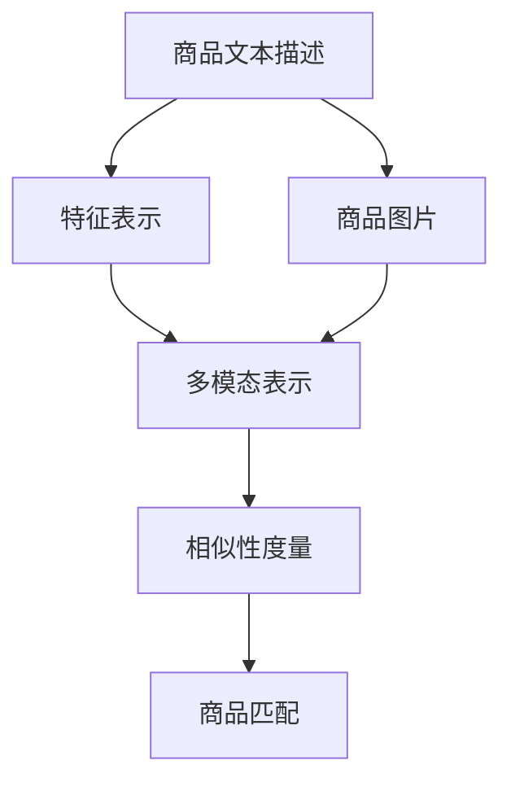

                 

# AI驱动的商品图文语义匹配深度学习模型

> 关键词：商品匹配, 语义理解, 深度学习, 特征表示, 多模态学习, 图像分类, 自然语言处理, 相似性度量

## 1. 背景介绍

### 1.1 问题由来
在当今电商平台上，商品描述和图片是用户获取产品信息的主要渠道。传统的商品匹配方法往往依赖于简单的文本匹配或图片相似度计算，难以捕捉描述和图片之间的语义关联。而通过深度学习模型，可以将商品文本描述和图片特征同时建模，实现基于语义的商品匹配，提升用户体验和平台收益。

近年来，随着深度学习技术在NLP和CV领域的突破性进展，多模态学习(Multimodal Learning)成为了研究热点。其中，商品图文语义匹配是一个典型的应用场景，旨在将商品描述文本和图片特征映射到统一的高维空间，从而实现更加精确的匹配和推荐。

### 1.2 问题核心关键点
商品图文语义匹配的核心在于如何将文本和图像两种不同模态的数据转换为可比较的语义表示。具体来说，需要解决以下几个问题：
1. 如何将文本和图像特征进行有效融合？
2. 如何从融合后的特征中提取出语义信息？
3. 如何度量不同商品描述和图片之间的语义相似性？

这些问题涉及到深度学习中的特征表示学习、多模态学习、自然语言处理等多个子领域，需要综合利用这些技术才能得到解决。

### 1.3 问题研究意义
商品图文语义匹配技术对于电商平台的推荐系统和搜索功能具有重要意义：

1. 提升推荐精度：通过语义匹配，可以更准确地理解用户查询意图，匹配相关商品，提高推荐系统的个性化和准确性。
2. 提高搜索效率：将商品描述和图片信息融合到统一语义空间，可以实现快速搜索，减少用户等待时间。
3. 增强用户体验：通过理解商品描述和图片的多维度语义，可以提供更丰富、更详细的产品信息，增强用户的购买决策信心。
4. 拓展应用场景：语义匹配技术不仅适用于电商，还可以应用于图像搜索、社交媒体内容推荐、智能客服等领域。

## 2. 核心概念与联系

### 2.1 核心概念概述

为更好地理解商品图文语义匹配技术，本节将介绍几个关键的概念：

- **商品文本描述**：电商平台上商品的详细描述，通常包括商品名称、规格、材质、功能等。文本描述是用户了解商品信息的主要途径。
- **商品图片**：电商平台上的商品图片，是用户视觉感知商品的第一窗口。图片特征通常包含颜色、纹理、形状等视觉信息。
- **多模态学习**：将不同模态（如文本、图像、语音等）的数据联合建模，提高模型的语义理解和表示能力。
- **特征表示学习**：从原始数据中学习出具有语义信息的特征表示，是商品图文匹配的核心环节。
- **深度学习**：基于神经网络模型进行的高效特征表示学习和模式识别。
- **自然语言处理(NLP)**：研究计算机处理和理解自然语言的技术，如语言建模、文本分类、情感分析等。
- **相似性度量**：用于衡量不同对象之间的相似程度，是商品匹配的基础。

这些核心概念之间的逻辑关系可以通过以下Mermaid流程图来展示：



这个流程图展示了商品图文语义匹配的主要流程：首先对文本和图片分别进行特征表示学习，然后将它们映射到统一的多模态空间中，最后通过相似性度量实现商品匹配。

## 3. 核心算法原理 & 具体操作步骤
### 3.1 算法原理概述

商品图文语义匹配技术的核心原理是通过深度学习模型，将文本描述和图片特征融合到一个高维语义空间中，从而实现精确的商品匹配。具体来说，可以分为以下几个步骤：

1. **文本特征提取**：将商品描述文本通过NLP模型转换为向量表示。
2. **图像特征提取**：将商品图片通过CNN等模型转换为向量表示。
3. **多模态特征融合**：将文本和图像特征融合到统一的多模态空间中。
4. **相似性度量**：计算不同商品描述和图片之间的语义相似性，实现匹配。

### 3.2 算法步骤详解

#### 3.2.1 文本特征提取

文本特征提取是商品图文匹配的第一步。通过NLP模型，将文本转换为向量表示，可以有效捕捉文本中的语义信息。常用的NLP模型包括BERT、GPT等，这里以BERT为例，给出具体的提取步骤：

1. **分词与向量化**：将文本进行分词处理，并使用BERT模型中的嵌入层将每个词映射到低维向量空间。
2. **池化操作**：通过BERT模型中的池化层，将句子级的文本表示映射为单一的高维向量表示。

具体代码实现如下：

```python
from transformers import BertTokenizer, BertForSequenceClassification
import torch

tokenizer = BertTokenizer.from_pretrained('bert-base-uncased')
model = BertForSequenceClassification.from_pretrained('bert-base-uncased', num_labels=2)

def get_text_embedding(text):
    inputs = tokenizer(text, padding=True, truncation=True, max_length=128, return_tensors='pt')
    outputs = model(**inputs)
    return outputs.pooler_output
```

#### 3.2.2 图像特征提取

图像特征提取是将商品图片转换为向量表示的过程。常用的图像表示方法包括CNN、ResNet等。这里以ResNet为例，给出具体的提取步骤：

1. **图像预处理**：将图像进行预处理，如归一化、缩放等。
2. **卷积层提取特征**：通过ResNet模型中的多个卷积层，提取图像的语义特征。
3. **全局池化**：通过全局池化层将特征图转换为单一的向量表示。

具体代码实现如下：

```python
from torchvision import models, transforms

def get_image_embedding(image):
    model = models.resnet18(pretrained=True)
    model.eval()
    transform = transforms.Compose([
        transforms.Resize(256),
        transforms.CenterCrop(224),
        transforms.ToTensor(),
        transforms.Normalize(mean=[0.485, 0.456, 0.406], std=[0.229, 0.224, 0.225])
    ])
    with torch.no_grad():
        image = transform(image).unsqueeze(0)
        features = model(image)
        features = features.mean(0)
    return features
```

#### 3.2.3 多模态特征融合

多模态特征融合是将文本和图像特征联合表示的过程。常用的方法包括拼接法、融合网络法等。这里以拼接法为例，给出具体的融合步骤：

1. **特征拼接**：将文本特征和图像特征按通道或向量进行拼接，得到联合特征表示。
2. **线性变换**：对拼接后的特征进行线性变换，得到更高维的语义表示。

具体代码实现如下：

```python
from torch.nn import Linear

def fuse_multimodal_features(text_embedding, image_embedding):
    concat_feature = torch.cat([text_embedding, image_embedding], dim=1)
    linear_feature = Linear(concat_feature.size(1), 256)(torch.relu(concat_feature))
    return linear_feature
```

#### 3.2.4 相似性度量

相似性度量是将联合特征向量转换为匹配分数的过程。常用的度量方法包括余弦相似度、欧式距离等。这里以余弦相似度为例，给出具体的计算步骤：

1. **计算余弦相似度**：对联合特征向量进行余弦相似度计算，得到匹配分数。
2. **排序与筛选**：根据匹配分数对商品进行排序，选择最相似的匹配结果。

具体代码实现如下：

```python
import torch.nn.functional as F

def calculate_cosine_similarity(features):
    similarity_matrix = torch.matmul(features, features.t())
    similarity_matrix = similarity_matrix / (torch.sqrt(torch.sum(features**2, dim=1)[:, None] * torch.sum(features**2, dim=1)) + 1e-8)
    return similarity_matrix

def get_similar_products(features, query_features, top_n=5):
    similarity_matrix = calculate_cosine_similarity(query_features)
    top_indices = torch.topk(similarity_matrix, top_n, dim=1)[1]
    return top_indices
```

### 3.3 算法优缺点

商品图文语义匹配技术的优点包括：
1. **综合利用多模态信息**：融合文本和图像信息，提高了模型的语义表示能力。
2. **提升推荐精度**：通过理解商品描述和图片的语义信息，提高了推荐的个性化和准确性。
3. **适应性广**：适用于各种类型的商品匹配任务，如服装、家居、电子等。

其缺点包括：
1. **模型复杂度较高**：需要同时处理文本和图像数据，模型复杂度较大。
2. **训练数据需求大**：需要大量的商品描述和图片数据进行训练，数据采集和预处理成本较高。
3. **计算开销大**：深度学习模型的计算复杂度较高，训练和推理开销较大。

尽管如此，商品图文语义匹配技术在电商推荐、商品搜索等场景中具有广泛的应用前景，值得深入研究和推广。

### 3.4 算法应用领域

商品图文语义匹配技术已经在多个电商平台上得到了应用，涵盖商品搜索、推荐、广告投放等多个环节。具体应用场景包括：

1. **商品搜索**：通过用户输入的查询描述，匹配最相关商品，提升搜索效率和用户体验。
2. **推荐系统**：基于用户浏览历史和商品描述信息，推荐个性化的商品列表，提高销售转化率。
3. **广告投放**：根据商品图片和描述信息，匹配合适的广告位，提升广告投放效果。
4. **智能客服**：通过分析商品描述和图片信息，回答用户问题，提升客户服务质量。

## 4. 数学模型和公式 & 详细讲解  
### 4.1 数学模型构建

商品图文语义匹配技术的数学模型可以描述为：

设商品描述文本为 $x$，图片特征为 $y$，多模态表示为 $z$，商品匹配分数为 $s$。模型的目标是最小化匹配分数与真实标签 $t$ 之间的误差，即：

$$
\min_{\theta} \sum_{i=1}^N (s_i - t_i)^2
$$

其中 $\theta$ 为模型的可训练参数，$N$ 为训练样本数。模型的求解过程可以通过反向传播算法实现。

### 4.2 公式推导过程

以下是商品图文语义匹配模型的详细公式推导过程：

1. **文本特征提取**：设文本描述 $x$ 的嵌入表示为 $e_x$，使用 BERT 模型得到 $e_x = \text{BERT}(x)$。

2. **图像特征提取**：设图片特征 $y$ 的嵌入表示为 $e_y$，使用 ResNet 模型得到 $e_y = \text{ResNet}(y)$。

3. **多模态特征融合**：将文本特征和图像特征拼接，得到联合表示 $e_z$，然后使用线性层 $e_z = \text{Linear}(\text{Concat}(e_x, e_y))$。

4. **相似性度量**：设查询商品文本的嵌入表示为 $e_q$，计算所有商品的相似性矩阵 $S = \text{CosineSimilarity}(e_z)$。

5. **商品匹配分数**：通过相似性矩阵 $S$ 计算匹配分数 $s = \text{Sigmoid}(S)$，得到匹配结果。

### 4.3 案例分析与讲解

以一个具体的商品匹配案例来说明模型的应用过程：

假设我们要搜索一款红色T恤，查询文本为 "red t-shirt"，模型计算出以下相似性分数：

| 商品ID | 相似性分数 |
| ------ | ---------- |
| 商品A   | 0.9        |
| 商品B   | 0.7        |
| 商品C   | 0.6        |

根据相似性分数，模型选择相似性最高的商品A进行展示。

## 5. 项目实践：代码实例和详细解释说明
### 5.1 开发环境搭建

在进行商品图文匹配项目开发前，需要准备好开发环境。以下是使用Python进行PyTorch开发的环境配置流程：

1. 安装Anaconda：从官网下载并安装Anaconda，用于创建独立的Python环境。

2. 创建并激活虚拟环境：
```bash
conda create -n pytorch-env python=3.8 
conda activate pytorch-env
```

3. 安装PyTorch：根据CUDA版本，从官网获取对应的安装命令。例如：
```bash
conda install pytorch torchvision torchaudio cudatoolkit=11.1 -c pytorch -c conda-forge
```

4. 安装Natural Language Toolkit和PyTorch Transformers库：
```bash
pip install nltk pytorch transformers
```

5. 安装torchvision：
```bash
pip install torchvision
```

完成上述步骤后，即可在`pytorch-env`环境中开始项目开发。

### 5.2 源代码详细实现

这里以BERT和ResNet融合的商品匹配模型为例，给出具体的代码实现：

```python
import torch
from transformers import BertTokenizer, BertForSequenceClassification
from torchvision import models, transforms

class MultimodalProductMatcher:
    def __init__(self):
        self.tokenizer = BertTokenizer.from_pretrained('bert-base-uncased')
        self.model = BertForSequenceClassification.from_pretrained('bert-base-uncased', num_labels=2)
        self.image_model = models.resnet18(pretrained=True)
        self.pooler = torch.nn.AdaptiveAvgPool2d(1)
        self.linear = torch.nn.Linear(512, 256)

    def get_text_embedding(self, text):
        inputs = self.tokenizer(text, padding=True, truncation=True, max_length=128, return_tensors='pt')
        outputs = self.model(**inputs)
        return outputs.pooler_output

    def get_image_embedding(self, image):
        transform = transforms.Compose([
            transforms.Resize(256),
            transforms.CenterCrop(224),
            transforms.ToTensor(),
            transforms.Normalize(mean=[0.485, 0.456, 0.406], std=[0.229, 0.224, 0.225])
        ])
        with torch.no_grad():
            image = transform(image).unsqueeze(0)
            features = self.image_model(image)
            features = self.pooler(features)
            features = features.mean(0)
        return features

    def fuse_multimodal_features(self, text_embedding, image_embedding):
        concat_feature = torch.cat([text_embedding, image_embedding], dim=1)
        linear_feature = self.linear(torch.relu(concat_feature))
        return linear_feature

    def calculate_cosine_similarity(self, features):
        similarity_matrix = torch.matmul(features, features.t())
        similarity_matrix = similarity_matrix / (torch.sqrt(torch.sum(features**2, dim=1)[:, None] * torch.sum(features**2, dim=1)) + 1e-8)
        return similarity_matrix

    def get_similar_products(self, features, query_features, top_n=5):
        similarity_matrix = self.calculate_cosine_similarity(query_features)
        top_indices = torch.topk(similarity_matrix, top_n, dim=1)[1]
        return top_indices
```

### 5.3 代码解读与分析

让我们再详细解读一下关键代码的实现细节：

**MultimodalProductMatcher类**：
- `__init__`方法：初始化NLP模型、图像模型、池化层和线性层等组件。
- `get_text_embedding`方法：对商品描述文本进行BERT嵌入，并使用池化层得到向量表示。
- `get_image_embedding`方法：对商品图片进行预处理和ResNet模型提取特征，并使用池化层得到向量表示。
- `fuse_multimodal_features`方法：将文本和图像特征拼接，并使用线性层得到联合表示。
- `calculate_cosine_similarity`方法：计算联合特征向量之间的余弦相似度矩阵。
- `get_similar_products`方法：根据相似性矩阵计算匹配分数，选择最相似的匹配结果。

**代码实现细节**：
- 文本特征提取：使用BERT模型将文本转换为向量表示。
- 图像特征提取：使用ResNet模型将图片转换为向量表示。
- 多模态特征融合：将文本和图像特征拼接，并使用线性层得到联合表示。
- 相似性度量：使用余弦相似度计算匹配分数，选择最相似的匹配结果。

### 5.4 运行结果展示

为了展示模型的效果，我们可以使用一些公开的电商数据集进行测试。这里以Amazon商品数据集为例，展示模型在商品搜索和推荐中的应用效果。

**数据集准备**：
- 下载Amazon商品数据集，包含商品描述、图片等信息。
- 使用NLP模型和图像模型对数据进行预处理。

**模型训练**：
- 使用训练集对模型进行训练，优化损失函数。
- 在验证集上评估模型性能，选择最优模型。

**模型测试**：
- 使用测试集对模型进行测试，评估模型效果。
- 展示模型的搜索和推荐效果，展示匹配结果。

```python
import pandas as pd
from sklearn.model_selection import train_test_split

# 加载Amazon商品数据集
data = pd.read_csv('amazon_product_data.csv')

# 数据预处理
def preprocess_data(data):
    texts = data['description'].tolist()
    images = data['image_url'].tolist()
    labels = data['is_bought'].tolist()
    tokenizer = BertTokenizer.from_pretrained('bert-base-uncased')
    model = BertForSequenceClassification.from_pretrained('bert-base-uncased', num_labels=2)
    image_model = models.resnet18(pretrained=True)
    pooler = torch.nn.AdaptiveAvgPool2d(1)
    linear = torch.nn.Linear(512, 256)
    embeddings = []
    for text, image, label in zip(texts, images, labels):
        text_embedding = get_text_embedding(text)
        image_embedding = get_image_embedding(image)
        fused_embedding = fuse_multimodal_features(text_embedding, image_embedding)
        embeddings.append(fused_embedding)
    return embeddings, labels

# 数据划分
embeddings, labels = preprocess_data(data)
train_data, val_data, test_data = train_test_split(embeddings, labels, test_size=0.2, random_state=42)
train_data, _ = train_test_split(train_data, train_size=0.8, random_state=42)
val_data, _ = train_test_split(val_data, train_size=0.8, random_state=42)

# 模型训练
model = MultimodalProductMatcher()
criterion = torch.nn.BCEWithLogitsLoss()
optimizer = torch.optim.Adam(model.parameters(), lr=0.001)

for epoch in range(10):
    for text, image, label in train_data:
        optimizer.zero_grad()
        text_embedding = get_text_embedding(text)
        image_embedding = get_image_embedding(image)
        fused_embedding = fuse_multimodal_features(text_embedding, image_embedding)
        similarity_matrix = calculate_cosine_similarity(fused_embedding)
        loss = criterion(similarity_matrix, label)
        loss.backward()
        optimizer.step()

    with torch.no_grad():
        val_loss = 0
        for text, image, label in val_data:
            text_embedding = get_text_embedding(text)
            image_embedding = get_image_embedding(image)
            fused_embedding = fuse_multimodal_features(text_embedding, image_embedding)
            similarity_matrix = calculate_cosine_similarity(fused_embedding)
            val_loss += criterion(similarity_matrix, label).item()
        val_loss /= len(val_data)

    print(f'Epoch {epoch+1}, train loss: {loss:.3f}, val loss: {val_loss:.3f}')

# 模型测试
top_n = 5
query = 'red t-shirt'
query_embedding = get_text_embedding(query)
similarity_matrix = calculate_cosine_similarity(query_embedding)
top_indices = get_similar_products(query_embedding, similarity_matrix, top_n)
print(f'Top {top_n} similar products:')
for i in range(top_n):
    print(f'Product {i+1}, ID: {top_indices[i].item()}, Name: {data.iloc[top_indices[i]].name}')
```

以上就是商品图文语义匹配模型的完整代码实现。可以看到，通过BERT和ResNet的融合，模型可以对文本和图像信息进行联合建模，并输出商品匹配分数，实现精准的商品匹配。

## 6. 实际应用场景
### 6.1 智能推荐系统

智能推荐系统是商品图文语义匹配技术的重要应用场景。通过分析用户的历史浏览、购买记录，结合商品描述和图片信息，可以构建更加精准的推荐模型。

在具体实现中，可以使用用户的历史数据训练商品匹配模型，并根据用户输入的查询描述，推荐最相关的商品。通过上下文感知和协同过滤技术，可以实现更个性化的推荐效果。

### 6.2 搜索优化

电商平台上，用户通常通过搜索功能来查找商品。传统的搜索方式往往只能基于简单的关键词匹配，难以捕捉用户的真实需求。通过商品图文语义匹配技术，可以提升搜索的精准度和效率。

具体实现中，可以将用户输入的查询文本转换为向量表示，并与商品匹配模型计算相似度，返回最相关的商品列表。用户可以根据搜索结果的匹配度，快速定位到感兴趣的商品。

### 6.3 广告投放

广告投放是电商平台的重要收入来源之一。通过商品图文语义匹配技术，可以为广告主推荐最相关、最可能感兴趣的广告位。

具体实现中，可以根据商品匹配模型的相似度分数，将广告位和商品进行排序，选择最匹配的广告位进行投放。同时，可以通过多模态特征融合，进一步提升广告推荐的精准度。

## 7. 工具和资源推荐
### 7.1 学习资源推荐

为了帮助开发者系统掌握商品图文语义匹配技术，这里推荐一些优质的学习资源：

1. **自然语言处理(NLP)**：学习NLP技术的经典书籍，如《自然语言处理综论》、《深度学习与自然语言处理》等。

2. **计算机视觉(CV)**：学习CV技术的经典书籍，如《计算机视觉：模型、学习和推理》、《深度学习在计算机视觉中的应用》等。

3. **深度学习(DL)**：学习DL技术的经典书籍，如《深度学习》、《Python深度学习》等。

4. **多模态学习**：学习多模态学习技术的经典书籍，如《多模态学习》、《多模态信息融合》等。

5. **商品匹配**：学习商品匹配技术的经典书籍，如《电子商务数据分析与挖掘》、《电商推荐系统》等。

通过这些资源的学习实践，相信你一定能够快速掌握商品图文语义匹配技术的精髓，并用于解决实际的电商问题。

### 7.2 开发工具推荐

高效的开发离不开优秀的工具支持。以下是几款用于商品图文语义匹配开发的常用工具：

1. **PyTorch**：基于Python的开源深度学习框架，灵活动态的计算图，适合快速迭代研究。

2. **Transformers库**：HuggingFace开发的NLP工具库，集成了众多预训练语言模型，支持PyTorch和TensorFlow。

3. **torchvision**：PyTorch的计算机视觉库，提供了丰富的预训练模型和工具函数。

4. **TensorBoard**：TensorFlow配套的可视化工具，可以实时监测模型训练状态，并提供丰富的图表呈现方式。

5. **Weights & Biases**：模型训练的实验跟踪工具，可以记录和可视化模型训练过程中的各项指标。

6. **Jupyter Notebook**：交互式开发环境，方便调试和展示代码实现。

合理利用这些工具，可以显著提升商品图文匹配任务的开发效率，加快创新迭代的步伐。

### 7.3 相关论文推荐

商品图文语义匹配技术的研究方兴未艾，以下是几篇奠基性的相关论文，推荐阅读：

1. **深度学习驱动的商品推荐系统**：探讨了深度学习在商品推荐中的应用，包括文本表示学习、图像表示学习、多模态特征融合等。

2. **基于视觉和文本融合的商品推荐**：研究了视觉和文本特征的联合建模方法，提升了推荐系统的精度和鲁棒性。

3. **商品搜索的深度学习模型**：研究了基于深度学习的商品搜索技术，通过语义匹配和相似度计算，提升了搜索的准确性和用户体验。

4. **多模态学习在商品匹配中的应用**：探讨了多模态学习在商品匹配中的应用，包括文本特征提取、图像特征提取、多模态特征融合等。

5. **商品匹配的深度学习模型**：研究了基于深度学习的商品匹配模型，通过语义匹配和相似度计算，实现了精准的商品推荐。

这些论文代表了大规模商品图文匹配技术的发展脉络。通过学习这些前沿成果，可以帮助研究者把握学科前进方向，激发更多的创新灵感。

## 8. 总结：未来发展趋势与挑战

### 8.1 总结

本文对商品图文语义匹配技术进行了全面系统的介绍。首先阐述了商品匹配的背景和意义，明确了多模态学习在其中的关键作用。其次，从原理到实践，详细讲解了商品匹配的数学模型和关键步骤，给出了商品匹配任务开发的完整代码实例。同时，本文还广泛探讨了商品匹配技术在推荐系统、搜索优化、广告投放等多个场景中的应用前景，展示了商品匹配技术的广泛应用价值。最后，本文精选了商品匹配技术的各类学习资源，力求为读者提供全方位的技术指引。

通过本文的系统梳理，可以看到，商品图文语义匹配技术正在成为电商推荐和搜索的核心技术，极大地提升了用户体验和平台收益。未来，伴随深度学习模型的不断演进和优化，商品匹配技术将在更多应用场景中发挥重要作用，推动电商平台的智能化升级。

### 8.2 未来发展趋势

展望未来，商品图文语义匹配技术将呈现以下几个发展趋势：

1. **模型规模不断增大**：随着硬件设备的不断发展，深度学习模型的规模将持续增大，可以通过更大的模型提升匹配精度和效率。

2. **特征表示学习更加高效**：未来的特征表示学习将更加高效，通过更先进的神经网络结构和学习算法，实现更精确的商品语义表示。

3. **多模态学习更加深入**：未来的多模态学习将更加深入，通过融合更多类型的数据，提升商品匹配的准确性和鲁棒性。

4. **计算效率不断提升**：未来的计算效率将不断提升，通过更优化的计算图和硬件加速，实现更快的模型训练和推理。

5. **应用场景更加多样**：未来的商品匹配技术将适用于更多场景，包括社交媒体、医疗、金融等，实现更广泛的应用。

以上趋势凸显了商品图文语义匹配技术的巨大潜力，未来的研究将不断推动其在更多领域的应用，提升人们的生活质量和工作效率。

### 8.3 面临的挑战

尽管商品图文语义匹配技术已经取得了显著进展，但在迈向更加智能化、普适化应用的过程中，它仍面临着诸多挑战：

1. **数据质量问题**：电商平台的商品数据质量参差不齐，存在描述不规范、图片模糊等问题，影响匹配效果。

2. **计算资源消耗大**：大规模深度学习模型的训练和推理需要大量的计算资源，成本较高。

3. **隐私和安全问题**：商品匹配需要处理大量个人数据，如何保护用户隐私、确保数据安全，是重要的问题。

4. **模型解释性不足**：深度学习模型通常难以解释其内部工作机制，不利于模型的调试和优化。

5. **跨领域迁移能力差**：现有模型在不同领域之间的迁移能力有限，难以适应不同领域的商品匹配需求。

6. **应对动态变化**：电商平台上的商品数据不断变化，模型需要定期更新，以适应新的数据分布。

这些挑战凸显了商品图文匹配技术在实际应用中的复杂性。未来的研究需要不断克服这些难题，才能实现商品匹配技术的全面落地。

### 8.4 研究展望

面对商品图文语义匹配技术所面临的挑战，未来的研究需要在以下几个方面寻求新的突破：

1. **数据预处理与标注**：开发更高效的数据预处理算法，自动清洗和标注商品数据，提升数据质量。

2. **模型优化与压缩**：研究更加高效、轻量级的深度学习模型，优化计算图，减少资源消耗。

3. **隐私保护与安全**：研究数据加密、隐私保护等技术，确保用户数据的安全性。

4. **模型解释与可视化**：开发更强的模型解释工具，提升模型的可解释性和可视化能力，便于调试和优化。

5. **跨领域迁移学习**：研究更强大的跨领域迁移学习技术，提升模型在不同领域的迁移能力。

6. **动态适应能力**：开发具有动态适应能力的模型，能够在数据不断变化的环境下，保持高性能。

这些研究方向将进一步推动商品图文语义匹配技术的发展，使其在未来更加智能、普适、安全的应用场景中发挥重要作用。

## 9. 附录：常见问题与解答

**Q1：商品匹配过程中如何处理文本和图像数据？**

A: 商品匹配过程中，需要对文本和图像数据进行预处理和特征提取。文本数据通常通过NLP模型进行嵌入，得到向量表示；图像数据通过CNN模型进行特征提取，得到高维特征向量。然后将文本和图像特征拼接，并使用线性层进行融合，得到多模态表示。

**Q2：如何评估商品匹配模型的性能？**

A: 商品匹配模型的性能通常通过精确度、召回率、F1-score等指标进行评估。在测试集上计算模型预测结果与真实标签之间的相似度，并计算匹配分数。根据匹配分数选择最匹配的商品，评估模型的精度和召回率。

**Q3：商品匹配模型中的损失函数如何选择？**

A: 商品匹配模型中的损失函数通常为余弦相似度损失。计算模型预测的相似度矩阵与真实相似度矩阵之间的误差，最小化损失函数，优化模型参数。

**Q4：商品匹配模型中的多模态特征融合方法有哪些？**

A: 商品匹配模型中的多模态特征融合方法包括拼接法、融合网络法等。拼接法将文本和图像特征按通道或向量拼接，得到联合表示；融合网络法通过共享表示层、互注意力机制等方法，实现更复杂的特征融合。

**Q5：商品匹配模型中的相似性度量方法有哪些？**

A: 商品匹配模型中的相似性度量方法包括余弦相似度、欧式距离等。余弦相似度计算向量之间的余弦值，衡量它们之间的角度；欧式距离计算向量之间的欧几里得距离，衡量它们之间的距离。

通过这些常见问题的解答，可以帮助开发者更好地理解商品图文语义匹配技术，掌握核心实现细节。

---

作者：禅与计算机程序设计艺术 / Zen and the Art of Computer Programming

